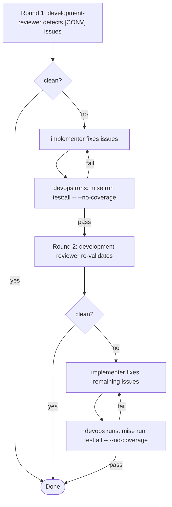

# Fix Code Convention Violations

## Overview

Review source code for compliance with project coding conventions
(`docs/conventions/zig-*.md`) and official Zig language standards (Style Guide,
Illegal Behavior), then fix any violations found. Detection and fixing are
separated across agents to avoid bias — the reviewer who finds issues is not the
one who fixes them.

**Max rounds: 2.** After Round 2, the cycle ends regardless of remaining issues.

## Action



### Round 1: Detection

Spawn the **development-reviewer** agent
(`.claude/agents/impl-team/development-reviewer.md`):

```
Review all source files in <target>/src/ for convention violations.
Zig version: run `mise current zig` to get the active version.
Zig reference docs: docs/references/<version>/zig-language-reference.html

Read the project conventions and Zig reference, then check all source files.
Report all violations as a numbered [CONV] issue list.
If no violations: "Clean pass — no convention violations found."
```

If clean pass → done.

If violations found, spawn the **implementer** agent
(`.claude/agents/impl-team/implementer.md`):

```
The development-reviewer found these convention violations. Fix each one.
Do NOT add anything beyond what the fix requires.

Issues:
<paste [CONV] issue list>
```

After fixes, spawn the **devops** agent (`.claude/agents/impl-team/devops.md`):

```
Run tests to verify convention fixes did not break anything:
mise run test:all -- --no-coverage
Report results.
```

If tests fail, the implementer fixes until tests pass.

### Round 2: Re-validation

The **development-reviewer** re-validates the implementer's fixes. If new
violations are found, the **implementer** fixes them and the **devops** agent
re-runs tests.

After Round 2 completes (clean or not), the cycle ends.
