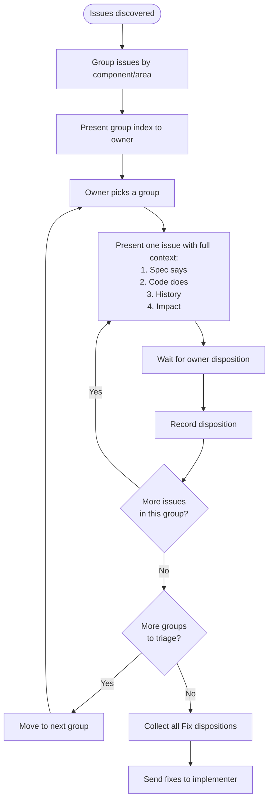

# AGENTS.md

> **Note**: `CLAUDE.md` is a symlink to this file (`AGENTS.md`). This is the
> canonical source.

This file provides guidance to Claude Code (claude.ai/code) when working with
code in this repository.

## Project Overview

**it-shell3** is a terminal ecosystem providing terminal multiplexer session
management with first-class CJK input support, built on libghostty. The project
consists of three libraries and two applications:

### Applications

- **it-shell3** — Client terminal app (Swift/AppKit + libghostty Metal GPU).
  macOS first, iOS later. Connects to daemon.
- **it-shell3-daemon** — Server daemon process (Zig binary): PTY owner, session
  persistence, I/O mux, client connections via Unix socket. Runs as LaunchAgent
  or standalone process.

### Libraries

- **libitshell3** — Core Zig library: session/pane state, PTY layer, RenderState
  export/import. Exports C API for Swift/other consumers.
- **libitshell3-protocol** — Wire protocol library shared by daemon and client:
  message types, serialization, capability negotiation, CJK preedit sync.
- **libitshell3-ime** — Native IME engine in Zig (wraps libhangul for Korean).
  Purely algorithmic, no OS IME dependency. Covers English QWERTY + Korean
  2-set.
- **libghostty** — External dependency: terminal engine providing VT parser,
  font/Unicode, RenderState API, Metal rendering.

## Current State

Three library modules are under active implementation. See
[`ROADMAP.md`](docs/superpowers/plans/ROADMAP.md) for per-plan status.

| Module               | Status                                           |
| -------------------- | ------------------------------------------------ |
| libitshell3-protocol | Implemented (22 source files), 135+ tests        |
| libitshell3-ime      | Implemented (9 source files), 135+ tests         |
| libitshell3          | Implemented (6 sub-modules), spec alignment next |

Applications (it-shell3 client, it-shell3-daemon) are not yet started.

## Build & Test

**Prerequisites:** [mise](https://mise.jdx.dev/), Docker (for Linux tests and
coverage)

Zig build system (`build.zig`) per module. Managed via `mise` tasks:

```bash
mise run test:macos                # All modules — Debug
mise run test:macos:release-safe   # All modules — ReleaseSafe
mise run test:coverage             # kcov in Docker (Linux)
mise run test:linux                # All modules in Docker — Debug
mise run build:docker:zig-kcov     # Build the kcov Docker image
```

Single-module test (from project root):

```bash
(cd modules/libitshell3 && zig build test --summary all)
```

### Why Docker for coverage?

kcov cannot parse macOS DWARF debug info — it only works with Linux ELF
binaries. `Dockerfile.kcov` builds a `zig-kcov` image (kcov + mise + Zig
pre-installed) so macOS developers can produce ELF binaries and run coverage
inside a Linux container via `mise run test:coverage`.

## Architecture

**Daemon + Client over Unix socket:**

```
Server (Daemon)                    Client (App)
┌─────────────────┐                ┌──────────────┐
│ PTY master FDs  │                │ UI Layer     │
│ Session state   │  Unix socket   │ (Swift/Metal)│
│ libitshell3-ime │◄──────────────►│              │
│ libghostty-vt   │  binary msgs   │ libghostty   │
│ I/O multiplexer │                │ surface      │
└─────────────────┘                └──────────────┘
```

**Protocol wire format:** 16-byte fixed header (`magic 0x4954` + version +
flags + msg_type + length + sequence) with variable payload. Max payload 16 MiB.

**Key design decisions:**

- IME is native Zig (not OS IME) — eliminates iOS async UITextInput and macOS
  NSTextInputClient issues
- RenderState protocol (structured cell data with dirty tracking) instead of VT
  re-serialization
- Session hierarchy: Session > Pane (binary split tree, JSON-serializable)
- Capability negotiation at handshake (not version guessing)

**Daemon lifecycle:** The daemon binary is bundled inside the client app
(`it-shell3.app/Contents/Helpers/it-shell3-daemon`). Distributed as notarized
DMG or Homebrew Cask (not Mac App Store — LaunchAgent requires sandbox escape).
On launch, the client connects to the Unix socket; if the daemon is not running,
it registers a LaunchAgent and starts it. For remote (SSH) connections, the
daemon is started via `fork+exec` without LaunchAgent (similar to `tmux` server
auto-start); version compatibility is ensured via protocol negotiation. See
daemon design docs for lifecycle details, version conflict handling, and
reconnection procedures.

## Documentation Structure

- `docs/modules/libitshell3/` — 15 design documents (00–14) covering project
  overview, API analysis, protocol, PTY, CJK input, architecture, testing
  strategy, and validation
- `docs/modules/libitshell3/design/server-client-protocols/` — 6 detailed
  protocol specs (handshake, session/pane mgmt, input/renderstate, CJK preedit,
  flow control)
- `docs/modules/libitshell3-ime/` — 7 documents covering Korean composition
  rules, libhangul API, IME architecture, integration protocol, build/licensing
- [**`docs/insights/`**](docs/insights/) — Cross-cutting architectural insights.
  Read before design discussions to avoid re-researching solved questions.
  - [Design Principles](docs/insights/design-principles.md) — Living document of
    validated protocol design principles, architectural insights, and process
    lessons. Updated after each revision cycle.
  - [Reference Codebase Learnings](docs/insights/reference-codebase-learnings.md)
    — Multi-client output delivery, dirty tracking, frame recovery, concurrency,
    and backpressure patterns from ghostty, tmux, zellij.

## Vendored Dependencies

Located at `vendors/`:

- **ghostty** (Zig) — Terminal engine (libghostty). API not yet stable; pin
  commits and use abstraction layer.
- **libhangul** (C, LGPL-2.1) — Korean Hangul composition for libitshell3-ime.
  Must handle LGPL compliance (dynamic linking or offer source).

## Reference Codebases

External projects used for design reference (not vendored — local paths are in
auto memory):

| Reference                                      | Purpose                                             |
| ---------------------------------------------- | --------------------------------------------------- |
| [tmux](https://github.com/tmux/tmux)           | Daemon/protocol pattern reference                   |
| [zellij](https://github.com/zellij-org/zellij) | Multi-threaded architecture reference               |
| [iTerm2](https://github.com/gnachman/iTerm2)   | tmux -CC integration, native UI mapping             |
| [cmux](https://github.com/manaflow-ai/cmux)    | libghostty-based macOS terminal (embedding pattern) |

## Development Phases

See [`docs/superpowers/plans/ROADMAP.md`](docs/superpowers/plans/ROADMAP.md) for
the detailed implementation roadmap (Plans 1-16+), dependency graph, per-plan
status, and test/coverage commands.

## Conventions

> **⚠️ MANDATORY: You MUST read and strictly follow all convention docs under
> `docs/conventions/` before making any changes. No exceptions.**

- [**Zig Coding**](docs/conventions/zig-coding.md) — Standard-width integers
  only (no arbitrary u3/u5/u19). Packed struct and Unicode codepoint exceptions.
- [**Zig Naming**](docs/conventions/zig-naming.md) — No abbreviations, buffer
  size constants, getter patterns. Applies to all Zig source.
- [**Zig Documentation**](docs/conventions/zig-documentation.md) — Doc comment
  rules, spec reference policy (no section numbers), TODO format.
- [**Zig Testing**](docs/conventions/zig-testing.md) — Inline unit tests
  (implementer) vs spec compliance tests (QA). File naming, test naming,
  ownership rules.
- [**Commit Messages**](docs/conventions/commit-messages.md) — Conventional
  commits format. **English only.**
- [**Document Artifact Conventions**](docs/conventions/artifacts/documents/01-overview.md)
  — Naming, format, and content rules for all document artifacts (review notes,
  handovers, design resolutions, research reports, cross-team requests).
- [**Architecture Decision Records**](docs/conventions/artifacts/documents/10-adr.md)
  — Permanent log of significant design/implementation decisions. **Use
  `/adr <topic>` for any meaningful owner decision** (technology selection,
  protocol tradeoffs, architectural patterns, implementation strategy). The
  agent researches context and writes the full ADR autonomously.

### Design Document Metadata

Spec documents (numbered `01-*.md` through `99-*.md`) use bullet-item metadata
immediately after the `# Title` heading. Only these two properties are allowed:

```markdown
# Document Title

- **Date**: YYYY-MM-DD
- **Scope**: one-line description of what this document covers
```

Do NOT add Status, Version, Author, Depends on, Changes from, or any other
metadata. Status and version are encoded in the directory path
(`draft/v1.0-rN/`). Author and dependency info belong in changelogs or
resolution docs, not in the spec header.

Process artifacts (review notes, design resolutions, verification issues,
cross-team requests) have their own metadata conventions defined in
`docs/conventions/artifacts/documents/`.

### Cross-Document References

The deciding factor is **whether two documents share a revision cycle** (move
together), not whether they are in the same module.

- **Same revision cycle** (e.g., files within
  `interface-contract/draft/v1.0-r9/`): relative paths are fine — they always
  move together.
- **Independent revision cycles** (e.g., `interface-contract/draft/v1.0-r9/` →
  `behavior/draft/v1.0-r1/`, or any cross-module reference): **do NOT use exact
  file path links**. Exact paths encode revision numbers that break every time
  the target is revised.

Instead, use a loose prose reference:

```markdown
<!-- Avoid: exact path, breaks on every revision -->

See
[behavior/draft/v1.0-r1/02-scenario-matrix.md](../../../behavior/draft/v1.0-r1/02-scenario-matrix.md).
See
[daemon design doc 02 §4.2](../../../../../libitshell3/.../v1.0-r3/02-integration-boundaries.md#42-...).

<!-- Prefer: name the doc without the path; omit section numbers (they change too) -->

See `02-scenario-matrix.md` in the behavior docs for the complete scenario
matrix. See the `libitshell3` daemon design docs for details. See the
`libitshell3-protocol` server-client-protocols docs for details.
```

## CRITICAL: Never Overwrite Working Tree with Git Checkout

**NEVER use `git checkout <ref> -- <path>` to compare or restore files in a
dirty working tree.** This overwrites uncommitted changes and can destroy agent
work in progress. Use non-destructive alternatives:

- `git show <ref>:<path>` — view a file at a specific commit
- `git diff <ref>` — compare current state against a commit
- `git stash` — only if you intend to restore immediately

## CRITICAL: Never Change the Working Directory

**NEVER use `cd` to change the current directory from the project root.** Almost
all operations can be performed by passing the correct path to commands and
tools. Changing directories causes confusion and errors in subsequent
operations.

In the rare cases where changing directory is absolutely unavoidable, use a
subshell so the directory change does not persist:

```bash
(cd other-dir; command;)
```

## Issue Triage

When issues are discovered — from QA review, spec compliance checks, simplify
passes, or any other source — triage them **one at a time** with the owner.

### Pre-procedure: Grouping

Before triage begins, group all discovered issues and present the groups to the
owner. The owner picks which group to triage first.

**Grouping criteria** — by the component or area of the codebase the issue
touches. Examples: "connection state machine", "handshake flow", "transport
layer", "timer infrastructure", "dead code / hygiene". Never group by severity —
severity-based groups pre-bias the triage order and hide relationships between
issues in the same area.

**Group presentation format:**

```
Group A: <area name> (N issues)
  - #1: <one-line title>
  - #4: <one-line title>

Group B: <area name> (N issues)
  - #2: <one-line title>
  - #3: <one-line title>
  - #7: <one-line title>
```

One-line titles are allowed here because this is an index, not the triage
itself. The detailed context comes when the owner picks a group and triage
begins.

### Procedure



**Presenting an issue** — show the full context without compression:

1. **Spec says** — quote the exact spec text (section name, line content). If
   multiple spec documents mention the same thing, cite all of them.
2. **Code does** — show the exact code (file path, line numbers, relevant
   snippet). Not a summary of what the code does — the actual code.
3. **History** — any prior decisions that affect this issue: existing CTRs,
   ADRs, owner decisions from prototyping, design resolutions. If none exist,
   say so.
4. **Impact** — what breaks or doesn't work because of this issue. Be concrete:
   "client cannot switch sessions" not "state transition may fail".

Do NOT include your recommendation. Do NOT pre-decide the disposition. Present
the facts and wait.

**Example:**

> **Issue 3: Handshake timeout timer not armed on client accept**
>
> **Spec says:**
>
> daemon-behavior `03-policies-and-procedures.md` Section 13 "Handshake
> Timeouts", lines 824-835:
>
> ```
> | Stage                                       | Duration | Action on timeout                        |
> | Transport connection (accept to first byte) | 5s       | Close socket                             |
> | ClientHello → ServerHello                   | 5s       | Send Error(ERR_INVALID_STATE), close     |
> | READY → AttachSession/CreateSession/...     | 60s      | Send Disconnect(TIMEOUT), close          |
> ```
>
>> **Invariant**: Each timeout MUST be enforced via per-client EVFILT_TIMER. The
>> timer is cancelled when the expected message arrives.
>
> **Code does:**
>
> `server/handlers/client_accept.zig` lines 40-54: after `accept()` succeeds,
> calls `add_client_fn(conn)` but never arms a timer. `ClientAcceptContext` has
> no `EventLoopOps` reference — timer registration is structurally impossible.
>
> ```zig
> fn handleClientAccept(ctx: *ClientAcceptContext) void {
>     const conn = ctx.listener.accept() catch { return; };
>     // TODO(Plan 6): Configure SO_SNDBUF and SO_RCVBUF ...  ← stale
>     ctx.add_client_fn(conn) catch { ... };
>     // no timer armed here
> }
> ```
>
> `timer_handler.zig` lines 48-59: handler for timer events exists
> (`handleHandshakeTimeout`, `handleReadyIdleTimeout`) — the receive side is
> implemented, but the send side (arming the timer) is missing.
>
> `client_state.zig` line 44: `handshake_timer_id: ?u16 = null` — field exists,
> never populated.
>
> **History:** No CTR or ADR. No prior owner decision. The stale TODO on line 46
> references SO_SNDBUF/SO_RCVBUF which is now handled inside
> `Listener.accept()`.
>
> **Impact:** After accept, no 5s handshake timer fires. A client that connects
> but never sends ClientHello will hold a slot indefinitely. Handshake success
> also never cancels a timer or arms the 60s READY idle timer.

**CRITICAL:** Do NOT apply fixes during triage. Triage determines dispositions
only. Fixes are collected and applied after all groups are triaged, unless the
owner explicitly says to fix something right now.

### Dispositions (owner decides)

| Disposition     | Meaning                                         | Action                                            |
| --------------- | ----------------------------------------------- | ------------------------------------------------- |
| **Fix**         | Code is wrong, change it now                    | Implementer fixes after triage completes          |
| **Defer**       | Correct but belongs in a later plan             | Add `TODO(Plan N)` in code + note in `ROADMAP.md` |
| **CTR**         | Spec needs updating to match a decision         | File a cross-team request                         |
| **False alarm** | CTR already exists or known decision            | No action needed                                  |
| **Skip**        | Not worth the cost (for simplify/perf findings) | No action                                         |

### Anti-patterns

- **Batch triage.** "Here are 7 issues, Issues 1, 4, 5 are false alarms, 2 and 3
  need fixing, 6 and 7 are deferred." This pre-decides dispositions and hides
  context.
- **Compressed summaries.** "ServerHello protocol_version type mismatch" tells
  the owner nothing. Show the spec quote, the code, and the impact.
- **Implicit dismissal.** "Known from prototyping" or "Plan 7 scope" are
  conclusions. The owner makes conclusions, not the agent.
- **Fixing during triage.** Do not modify code while triage is in progress.
  Triage is for deciding dispositions. Fixes come after.
- **Asking what to do.** "Should I fix this?" is unnecessary when the issue is
  clearly a bug. "Owner 판단?" is only appropriate when there is a genuine
  ambiguity (e.g., spec says X, prior owner decision says Y).
- **Pressuring for a decision.** The owner may need to ask follow-up questions,
  read more context, or simply think. Do not repeat "fix or skip?", "how to
  proceed?", or "next?" after presenting an issue. Present the facts once and
  wait silently. The owner will respond when ready.

## Work Styles

> **⚠️ MANDATORY: You(main agent, team leader) MUST read and strictly follow all
> work-style docs under `docs/work-styles/` before starting any team-based work.
> No exceptions.**
>
> **You are a facilitator, NOT a doer.** Never do research, writing, or
> implementation yourself — always delegate to teammates. Never micromanage
> teammates with specific instructions like "change line X to Y" — state the
> goal and let them figure out the approach. Never proxy messages between agents
> — they must communicate directly with each other.
>
> **⚠️ CRITICAL — Post-compaction teammate recovery:** After a context
> compaction (conversation compression), you lose awareness of previously
> spawned teammates. This is the **single most important thing** to handle after
> compaction. Immediately:
>
> 1. Run `TaskList` to discover all tracked tasks and their owners/statuses.
> 2. Identify any tasks still marked `in_progress` — these may have active
>    teammates working on them, or they may be zombies (agents from the
>    pre-compaction context that are no longer reachable).
> 3. For each `in_progress` task, attempt to contact the owning teammate (via
>    `SendMessage`) to verify they are alive and still working.
> 4. Shut down confirmed zombies and clean up their stale task entries.
> 5. Only after recovery is complete should you resume or start new work.

- [**Overview**](docs/work-styles/01-overview.md) — Entry point: how we work,
  document index.
- [**Team Collaboration**](docs/work-styles/02-team-collaboration.md) — Team
  structure, roles, communication rules, consensus policy, lessons learned.
- [**Design Workflow**](docs/work-styles/03-design-workflow/) — Rationale and
  reference for the revision/review cycles. **Execution is driven by the
  `design-doc-revision` skill** (`.claude/skills/design-doc-revision/`).
- [**PoC Workflow**](docs/work-styles/04-poc-workflow.md) — When, why, and how
  to run Proof-of-Concept experiments.
