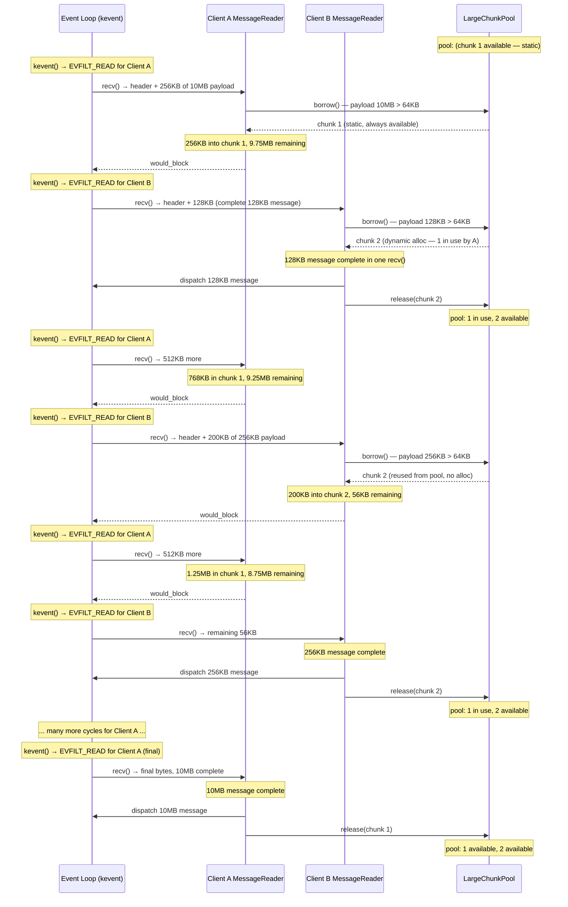
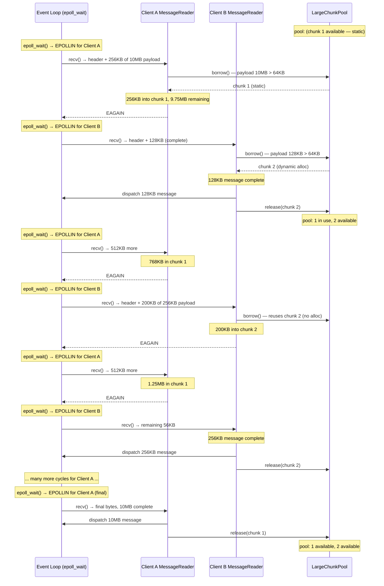

# 00061. MessageReader Tiered Buffer Strategy

- Date: 2026-03-29
- Status: Accepted

## Context

The current `MessageReader` in `libitshell3-protocol` uses a fixed 4096-byte
internal buffer (`BUFFER_SIZE: u16 = 4096`) that accumulates all incoming bytes
via `feed()`, then extracts complete frames via `nextMessage()`. This design has
three compounding limitations:

**1. Hard 4 KB message size ceiling.** The internal buffer is 4096 bytes and the
length field is `u16`. Any message whose header + payload exceeds 4096 bytes
cannot be fully accumulated. `feed()` silently drops bytes that exceed buffer
capacity, meaning large messages are silently corrupted.

**2. Protocol spec allows payloads up to 16 MiB.** The wire format header uses a
`u32` `payload_length` field, and `MAX_PAYLOAD_SIZE` is 16 MiB. Client-to-server
messages that exceed 4 KB include PasteData (user pasting large text),
SnapshotRequest/Response, and potentially session list responses. The current
MessageReader cannot handle any of these.

**3. Per-client 16 MiB buffers are unacceptable.** Sizing the fixed buffer to
the spec maximum would require 16 MiB × 64 clients = 1 GB. Most messages are
small JSON control payloads under 1 KB.

MessageReader handles the **client→server direction only**. The large payloads
in this protocol (I-frames, P-frames at ~82 KB for CJK worst case) are
**server→client** and go through the ring buffer, not through MessageReader.
Client→server messages are overwhelmingly small: ClientHello, Heartbeat,
KeyEvent, MouseEvent, SessionRequest — all under 1 KB. The only realistically
large client→server message is PasteData.

**Non-blocking I/O complication.** The daemon uses non-blocking sockets with
kqueue (BSD) / epoll (Linux). A large message may arrive across multiple recv()
calls separated by returns to the event loop. Between those returns, other
clients' events are processed. This means **multiple clients can simultaneously
be in the middle of receiving large messages**, each holding a large buffer for
the duration of accumulation. A singleton buffer is insufficient — a pool is
required.

**Alternatives considered:**

1. **Larger fixed buffer (16 MiB per client).** Unacceptable memory cost.

2. **Two-phase state machine with caller-provided payload buffer.**
   MessageReader owns only 16 bytes (header buffer); caller provides payload
   buffer after learning `payload_length`. Minimal per-client memory, but
   complex consumer API — callers must handle phase transitions and buffer
   lifecycle.

3. **Tiered buffer: 64 KB fixed + LargeChunkPool.** MessageReader owns a 64 KB
   internal buffer for common messages. Large messages borrow from a
   daemon-global `LargeChunkPool`. Simple consumer API, handles the full spec
   range. This is the chosen approach.

The interface must change now rather than later. Once more consumers depend on
the current API, changing it becomes a breaking coordination problem.

## Decision

Redesign `MessageReader` with a tiered buffer strategy backed by a daemon-global
`LargeChunkPool`.

### Tier 1 — Internal fixed buffer (64 KB)

Each `MessageReader` owns a 64 KB inline buffer. The `length` field type changes
from `u16` to `u32`. `feed()` copies incoming bytes into this buffer.
`nextMessage()` extracts complete frames. This handles all control messages,
heartbeats, handshake, input events, and most PasteData with zero allocation.

### Tier 2 — LargeChunkPool

When a message's `payload_length` (learned from the 16-byte header already in
the fixed buffer) exceeds the fixed buffer capacity, the reader borrows a 16 MiB
chunk from the daemon-global `LargeChunkPool`.

**LargeChunkPool design:**

- **First chunk is static.** A single 16 MiB chunk is declared in `.bss`
  (zero-initialized, no binary size impact). This chunk is always available at
  process start — no runtime allocation failure possible for the first
  concurrent large message.

- **Additional chunks are dynamically allocated.** If the static chunk is in use
  (another client is mid-accumulation of a large message), the pool allocates a
  new 16 MiB chunk via the system allocator. This handles the concurrent large
  message scenario.

- **Released chunks are retained for reuse.** When a MessageReader finishes with
  a chunk, it returns it to the pool. Dynamic chunks are kept (not freed) for
  future reuse, avoiding repeated alloc/free cycles. The pool grows to the
  high-water mark of concurrent large messages and stays there.

- **Pool cap.** The pool is capped at `MAX_CLIENTS` chunks (theoretical maximum
  of concurrent large messages). In practice, concurrent large messages are
  extremely rare — the pool will almost never exceed 1-2 chunks.

- **OoM handling.** If dynamic allocation fails, the MessageReader returns an
  error for that message. The client connection is not dropped — the specific
  large message is rejected and the reader resets to READING_HEADER for the next
  message.

- **Single-threaded safety.** The daemon event loop is single-threaded, so the
  pool requires no locking. Borrow and release are simple pointer/index
  operations.

### Concurrent large message scenario — BSD (kqueue)

Client A sends a 10 MB PasteData (arrives slowly over many event loop cycles).
Client B sends two large messages back-to-back: 128 KB then 256 KB. B's first
message completes and releases its chunk while A is still accumulating. B's
second message reuses the released chunk.

### Same scenario — Linux (epoll)

The BSD and Linux flows are identical in structure — only the syscall names
differ (kevent/epoll_wait, would_block/EAGAIN).

### Consumer API

The `feed()` / `nextMessage()` interface remains conceptually the same. The
tiering is internal to MessageReader. The only API change is that MessageReader
must be initialized with a reference to the `LargeChunkPool` (or receive it per
`feed()` call).

## Consequences

**What gets easier:**

- Handles any client→server payload size up to the 16 MiB spec maximum.
- 99.9%+ of messages require zero dynamic allocation — the 64 KB fixed buffer
  covers all common message types.
- Consumer API remains simple: `feed()` bytes, loop `nextMessage()`.
- Concurrent large messages from multiple clients are handled correctly via the
  pool, without per-client 16 MiB reservation.
- Static first chunk guarantees the common case (single large message at a time)
  never allocates.
- Pool high-water mark tracks actual concurrent large message demand. In the
  scenario above, 3 large messages produced a high-water mark of only 2 chunks,
  because same-client messages are stream-ordered (no interleaving within one
  Unix domain socket SOCK_STREAM connection).
- Dynamic chunks are reused, not freed — repeated large messages from the same
  client reuse the same chunk with zero allocation after the first time.

**What gets harder:**

- Per-client memory increases from 4 KB to 64 KB (4 MB total with 64 clients).
- Daemon must own and initialize a `LargeChunkPool` instance, passed to each
  `ClientState` / `MessageReader`.
- Overflow buffer lifecycle: the reader must track whether the current message
  is in the fixed buffer or a borrowed chunk, and release the chunk after
  consumption.
- Testing the overflow path requires constructing messages > 64 KB.

**New obligations:**

- `LargeChunkPool` must be implemented in libitshell3 (daemon-side, not protocol
  library — the pool is a daemon resource management concern).
- `message_reader.zig` must be rewritten with tiered buffer logic.
- `client_read.zig` changes are minimal (API shape preserved) but must provide
  pool reference.
- `ClientState` initialization must receive a pool reference.
