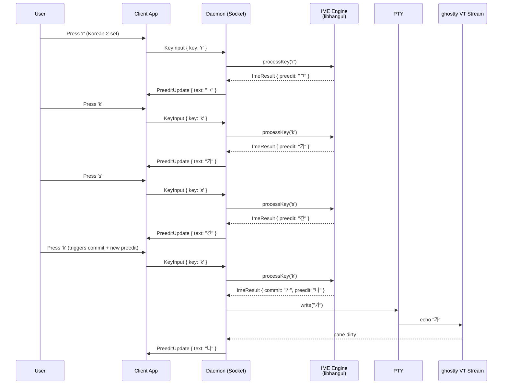
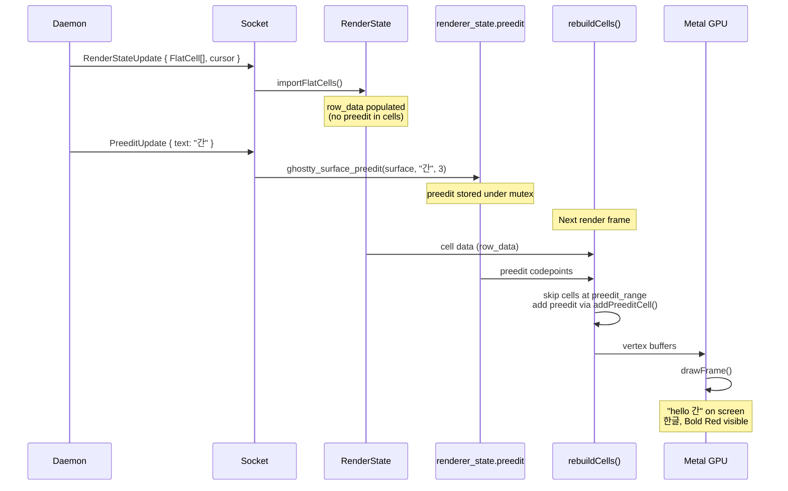
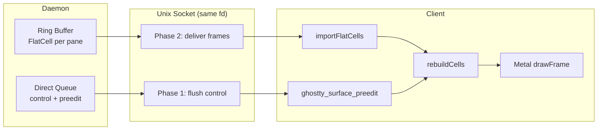

# 00065. Preedit as GPU Overlay, Not Cell Data

- Date: 2026-04-16
- Status: Accepted

## Context

Design Principle A1 stated: "Preedit is cell data, not metadata." The design
assumed that the daemon calls `ghostty_surface_preedit()` on its Terminal
instance, which injects preedit characters into the terminal's Screen/Page cell
data. Under this model, preedit cells would be exported as part of FlatCell[]
in I/P-frames, and the client would render them as ordinary cells without
knowing what is preedit. This eliminated the need for a separate preedit
channel.

During Plan 9 (Frame Delivery) owner review, this assumption was investigated
and found to be **false**. ghostty's actual preedit architecture:

- `ghostty_surface_preedit()` stores UTF-8 preedit text in
  `renderer_state.preedit` under a mutex
- During `rebuildCells()`, the renderer **skips** normal cells at the
  `preedit_range` and calls `addPreeditCell()` to render preedit glyphs into
  GPU vertex buffers
- **Preedit never enters terminal cell data** (Screen/Page). It exists only in
  the GPU rendering pipeline

This means the daemon cannot embed preedit in FlatCell[] exports. The daemon's
`bulkExport()` produces cell data without preedit, and preedit must be
delivered separately.

PoC 09 (`poc/09-import-plus-preedit/`) verified the correct architecture with
actual Metal GPU rendering and programmatic screenshot capture:

- Channel 1: `importFlatCells()` populates RenderState from FlatCell[] (daemon
  cell data)
- Channel 2: `ghostty_surface_preedit()` injects Korean preedit from real
  libhangul C API
- `rebuildCells()` merges both into one Metal GPU frame

## Decision

Adopt a **two-channel delivery model** where preedit is a separate control
message, not part of frame cell data:

**Channel 1 — Control** (small messages via direct queue, Phase 1 flush):
commands, preedit updates, metadata changes, resize acks.

**Channel 2 — Frame** (FlatCell[] via ring buffer, Phase 2 delivery): terminal
cell data exported by `bulkExport()`, which never contains preedit.

On the client side, the two channels feed independent APIs:

- Frame data → `importFlatCells()` → `RenderState.row_data`
- Preedit → `ghostty_surface_preedit()` → `renderer_state.preedit`

Both merge at render time in `rebuildCells()` → Metal `drawFrame()`.

Retire Design Principle A1 ("Preedit is cell data, not metadata"). Replace
with: **Preedit is a GPU rendering overlay delivered as a control message.**

### Hangul Key Input Flow

### Client Rendering Flow

### Two-Channel Wire Architecture

## Consequences

**What gets easier:**

- Client rendering is simpler: no need to detect or strip preedit from cell
  data. `importFlatCells()` always receives clean cell data.
- Preedit updates are independent of frame delivery: a preedit change does not
  require a new frame. Lower latency for composition feedback.
- Aligns with ghostty's actual architecture: no impedance mismatch between
  what ghostty does internally and what the protocol assumes.

**What gets harder:**

- Daemon must manage two output paths for IME: committed text → PTY write,
  preedit text → PreeditUpdate broadcast. Previously assumed to be one path.
- `importFlatCells()` must set `cursor.viewport` (not just `cursor.active`)
  for preedit range calculation to work. Discovered via PoC crash.

**What must change:**

- Design Principle A1 retired, replaced with new principle.
- `preedit_overlay.zig` in libitshell3 (daemon-side overlay built on false
  premise) should be removed.
- Protocol and daemon specs need CTRs to align with two-channel model.

**Evidence:**

- PoC 09 screenshots: `poc/09-import-plus-preedit/screenshots/`
- PoC 09 diff: `poc/09-import-plus-preedit/diffs/ghostty-vendor.diff`
