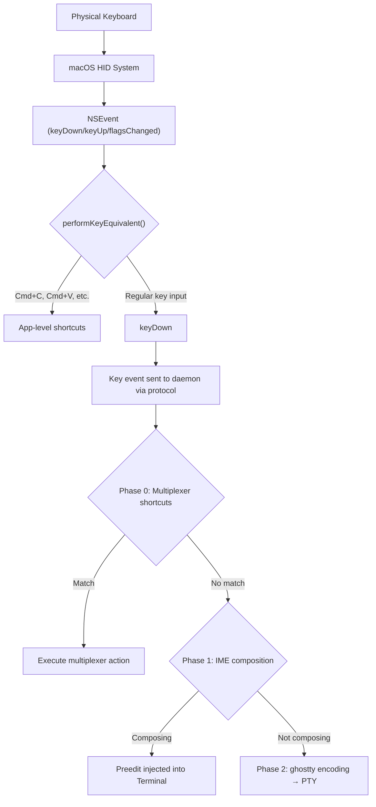

# macOS Input Pipeline

The macOS it-shell3 app captures keyboard events via AppKit's NSEvent system and routes them to the native IME engine (libitshell3-ime) or directly to the daemon. This document covers the high-level input pipeline.

---

## Input Pipeline Overview

> **Key design decision**: it-shell3 uses a native IME engine (libitshell3-ime) instead of macOS's NSTextInputClient/NSTextInputContext. This eliminates the async UITextInput problem on iOS, the NSEvent construction risk, and platform dependency. The OS IME is never activated for the terminal view. See `docs/modules/libitshell3-ime/01-overview/` for IME architecture details.

## Three-Phase Key Processing

The daemon processes key events in three phases:

1. **Phase 0 — Shortcuts**: Multiplexer keybindings (e.g., prefix key, split/navigate). If matched, the key is consumed.
2. **Phase 1 — IME**: libitshell3-ime composition engine. If composing (e.g., Korean syllable assembly), produces preedit or commit events.
3. **Phase 2 — Terminal**: Unhandled keys forwarded to ghostty for terminal escape sequence encoding → PTY.

> For detailed key processing pipeline, see the IME contract at `docs/modules/libitshell3-ime/02-design-docs/interface-contract/`.

## ghostty Surface APIs (Daemon-Side)

The **daemon** uses these ghostty C APIs on its per-pane Terminal instances. The client app does NOT call these directly — it sends key events to the daemon via the protocol, and the daemon processes them through the three-phase pipeline.

| API | Called by | Purpose |
|-----|-----------|---------|
| `ghostty_surface_key()` | Daemon (Phase 2) | Forward key events to Terminal for escape sequence encoding |
| `ghostty_surface_text()` | Daemon (Phase 1 commit) | Send committed text to Terminal |
| `ghostty_surface_preedit()` | Daemon (Phase 1 compose) | Inject preedit cells into Terminal's render output |
| `ghostty_surface_ime_point()` | Daemon | Get cursor position for preedit overlay |

> The client is a thin RenderState populator (design principle A4). It receives cell data (including preedit cells) via `importFlatCells()` and renders them without knowing which cells are preedit (design principle A1).

> For the full ghostty C API reference, see `01-libghostty-api.md` in `docs/modules/libitshell3/01-overview/`.

## Reference: cmux Key Input Pattern

cmux/ghostty intercepts key events in `performKeyEquivalent(with:)` before the OS text input system sees them. it-shell3 follows the same pattern but routes ALL key events to libitshell3-ime instead of the OS IME.

Source: `~/dev/git/references/cmux/Sources/GhosttyTerminalView.swift`

## Wide Character Rendering

ghostty handles wide character rendering internally via its `Cell.Wide` enum (narrow, wide, spacer_tail, spacer_head). The wire protocol preserves this through the FlatCell format. The client does not need special CJK width handling — ghostty's renderer handles it.

> For Unicode width properties, see ghostty source at `vendors/ghostty/src/unicode/props.zig`.
