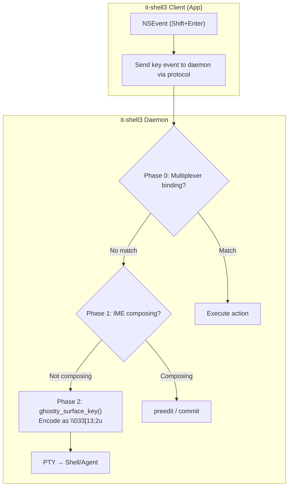

# Key Handling

Special key combinations require careful handling in a terminal multiplexer. This document covers Shift+Enter (line break vs. submit), Cmd+C/V (clipboard vs. terminal control), and AI agent input area detection.

---

## Handling Shift+Enter

### The Challenge

Shift+Enter must:
- In AI agent input areas: Insert a newline (not submit)
- In normal terminal: Send `\n` or `\r` (same as Enter)
- In tmux/zellij: Potentially mapped to a multiplexer action

### Terminal Encoding

| Encoding | Sequence | Notes |
|----------|----------|-------|
| Legacy | `\r` (same as Enter) | Cannot distinguish Shift+Enter |
| xterm modifyOtherKeys | `\033[13;2u` | CSI u format: keycode 13, modifier 2 (Shift) |
| Kitty keyboard protocol | `\033[13;2u` | Same encoding, but with press/release/repeat |

### Ghostty's Handling

Ghostty supports both xterm modifyOtherKeys and the Kitty keyboard protocol. When enabled:
- The terminal sends `\033[13;2u` for Shift+Enter
- The application (shell/agent) can detect this and handle it differently from plain Enter

### it-shell3 Strategy



---

## Handling Cmd+C / Cmd+V (macOS)

### The Challenge

On macOS:
- **Cmd+C** = Copy (AppKit default), but in terminal = should sometimes be SIGINT (Ctrl+C)
- **Cmd+V** = Paste (AppKit default), but in terminal = should be bracketed paste

### cmux/Ghostty Approach

```swift
// performKeyEquivalent handles Cmd-key events BEFORE AppKit menu system
override func performKeyEquivalent(with event: NSEvent) -> Bool {
    // Check if ghostty has a binding for Cmd+C
    if ghostty_surface_key_is_binding(surface, keyEvent) {
        // Let ghostty handle it (could be copy if text selected, or send to PTY)
        ghostty_surface_key(surface, keyEvent)
        return true
    }
    // Fall through to AppKit (standard Copy/Paste)
    return super.performKeyEquivalent(with: event)
}
```

### Ghostty's Copy/Paste Logic

Ghostty's default behavior:
- **Cmd+C with selection**: Copy selected text to clipboard
- **Cmd+C without selection**: Send Ctrl+C (SIGINT) to PTY
- **Cmd+V**: Paste from clipboard (with bracketed paste wrapping if enabled)

### it-shell3 Strategy

1. **Copy (Cmd+C)**:
   - If text is selected in the ghostty surface → Copy to clipboard
   - If no selection → Forward to daemon as Ctrl+C
   - AI agent mode: Always copy (agents handle Ctrl+C differently)

2. **Paste (Cmd+V)**:
   - Read from clipboard
   - Send as bracketed paste to daemon → PTY
   - AI agent mode: Insert text at cursor without bracketed paste wrapper

---

## AI Agent Input Areas

### The Challenge

AI agent chat interfaces (Claude Code, Codex CLI, Cursor) create custom input areas within the terminal that behave differently from normal shell input:

1. **Multi-line editing**: Shift+Enter inserts a newline instead of submitting
2. **Clipboard**: Cmd+C copies text (not SIGINT), Cmd+V pastes (not bracketed paste)
3. **CJK composition**: IME must work correctly within the agent's input buffer

### Detection Strategy

The daemon needs to detect when an AI agent's input area is active:

**Approach 1: Terminal Mode Detection**
- Monitor termios mode changes (raw mode vs. cooked mode)
- AI agents typically use raw mode with custom key handling
- Ghostty's termios polling (200ms) can detect this

**Approach 2: OSC Sequences**
- AI agents could emit custom OSC sequences to signal input area boundaries
- Example: `\033]9999;input-area-start\007` ... `\033]9999;input-area-end\007`
- Requires cooperation from agent developers

**Approach 3: Shell Integration**
- Detect running process via `/proc/pid/cmdline` or `ps`
- Known agent binaries: `claude`, `codex`, `cursor-terminal`
- Map process detection to input mode configuration

### Recommended Approach

Use a combination:
1. Default Shift+Enter handling configurable per-pane
2. Process detection for known AI agents
3. Custom key binding profiles per detected agent
4. Future: Propose OSC extension for agent input area signaling
