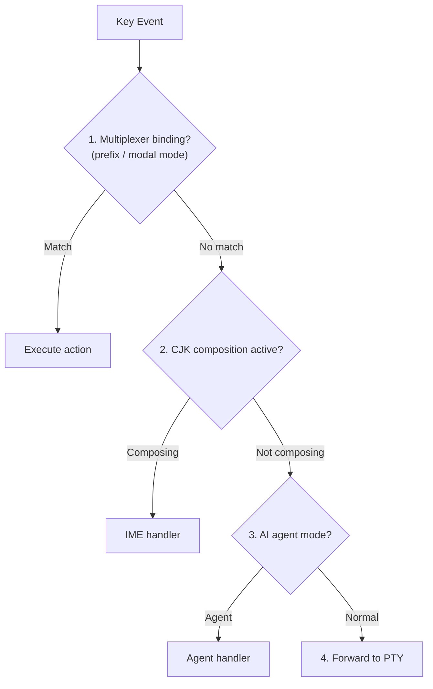

# Multiplexer Key Bindings

Multiplexer-level keybindings are intercepted by the daemon before being forwarded to the PTY. This document covers keybinding models from reference implementations and the proposed approach for it-shell3.

## tmux Prefix Mode

tmux uses a prefix key (default: `Ctrl+B`) followed by a command key:
- `Ctrl+B` then `%`: Split horizontal
- `Ctrl+B` then `"`: Split vertical
- `Ctrl+B` then arrow: Navigate panes
- `Ctrl+B` then `d`: Detach

## Zellij Mode System

Zellij uses modal keybindings:
- `Ctrl+P`: Enter pane mode (arrow keys navigate)
- `Ctrl+T`: Enter tab mode
- `Ctrl+N`: Enter resize mode
- `Ctrl+S`: Enter scroll mode

## it-shell3 Approach

Consider a hybrid:

1. **Default**: Zellij-style modes (more discoverable)
2. **Optional**: tmux prefix compatibility mode
3. **Custom**: Per-pane key binding profiles for AI agents

