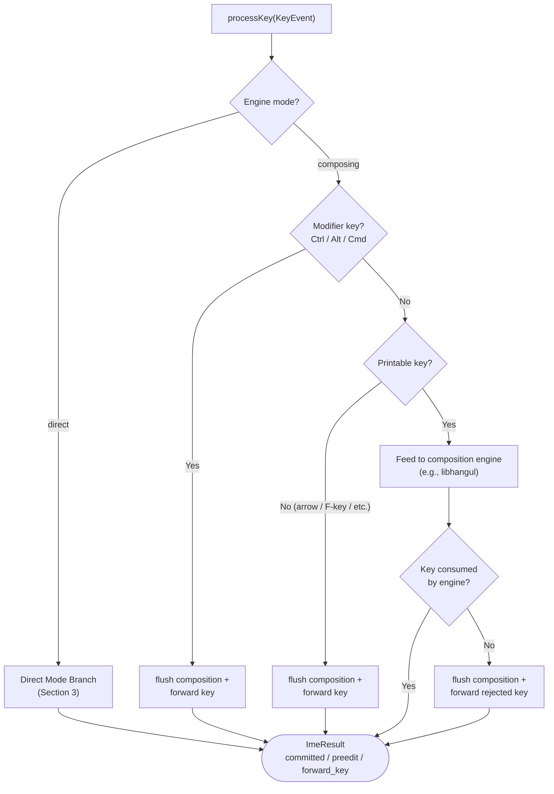

# processKey() Algorithm

**Version**: v1.0-r1
**Date**: 2026-03-14
**Scope**: Language-agnostic `processKey()` general decision tree and direct mode branching logic

---

## 1. Overview

`processKey(KeyEvent) → ImeResult` is the engine's core entry point. It receives
a key event and produces an `ImeResult` containing any committed text, updated
preedit, and/or a key to forward to the terminal. The engine is a pure
composition state machine — it has no knowledge of what happens before (Phase 0:
shortcut interception) or after (Phase 2: ghostty integration / PTY writes).

## 2. Decision Tree

The following flowchart shows the general decision tree inside `processKey()`.
This applies to all engine modes (direct and composing).

### 2.1 Step-by-Step Algorithm (Composing Mode)

1. **Check modifiers** (Ctrl / Alt / Cmd): If any composition-breaking modifier
   is present, flush the current composition (commit preedit), then forward the
   original key. See [03-modifier-flush-policy.md](03-modifier-flush-policy.md)
   for the full policy table and rationale.

2. **Check printability**: If the key is non-printable (arrow keys, function
   keys, Enter, Tab, Escape, etc.), flush the current composition, then forward
   the key. These keys are not candidates for composition input.

   > **Note — "printable" definition for this algorithm**: In this document,
   > "printable" means keys that map to letters, digits, or punctuation
   > characters via HID-to-ASCII lookup. Concretely, this is HID keycodes
   > 0x04–0x27 (letters A–Z and digits 1–0) and 0x2D–0x38 (punctuation:
   > `-`, `=`, `[`, `]`, `\`, `;`, `'`, `` ` ``, `,`, `.`, `/`).
   >
   > **`isPrintablePosition()` from the interface contract MUST NOT be used as
   > the printability gate here.** Its range is 0x04–0x38, which includes HID
   > 0x28 (Enter), 0x29 (Escape), 0x2A (Backspace), 0x2B (Tab), and 0x2C
   > (Space). All of these are non-printable for composition purposes and must
   > be routed to the flush/forward path, not the composition path. Using
   > `isPrintablePosition()` directly would misclassify them as printable,
   > directly contradicting the scenario matrix in Section 3.1 of
   > [02-scenario-matrix.md](02-scenario-matrix.md).

3. **Feed to composition engine**: If the key is printable and unmodified (or
   Shift-only), feed it to the language-specific composition engine. For Korean,
   this calls `hangul_ic_process()`. For details on the libhangul call sequence,
   see [11-hangul-ic-process-handling.md](11-hangul-ic-process-handling.md).

4. **Handle engine response**:
   - **Consumed** (engine returns true): The key was accepted into the
     composition. Read committed text and preedit from the engine.
   - **Not consumed** (engine returns false): The key was rejected (not a valid
     input for the current composition engine). Flush any remaining composition,
     then forward the rejected key. See
     [11-hangul-ic-process-handling.md](11-hangul-ic-process-handling.md) for the
     complete return-false handling algorithm.

5. **Construct ImeResult**: Populate `committed_text`, `preedit_text`,
   `forward_key`, and `preedit_changed` based on the outcome. Return to caller.

### 2.2 Flush Semantics

In all flush cases (modifier, non-printable, rejected key), the engine
**commits** the in-progress composition — it never silently discards it. This
ensures the user's typed text is always preserved. The flush policy is defined
in [03-modifier-flush-policy.md](03-modifier-flush-policy.md).

## 3. Direct Mode Branch

In direct mode (`"direct"` input method), there is no composition engine active.
`processKey()` performs a simple branch:

- **Printable key without modifiers**: HID-to-ASCII lookup →
  `committed_text = ascii_char`, no forward key.
  **Exception**: Space is always forwarded (consistent across all modes — Space
  is a word separator, not a character to commit).
- **Everything else** (non-printable, modified, unmapped): `forward_key =
  original_key`, no committed text.
- Direct mode never has preedit (no composition state), so `preedit_changed` is
  always `false`.

  > **Note — "printable" in direct mode**: The same definition from Section 2.1
  > Step 2 applies here. Printable means HID 0x04–0x27 and 0x2D–0x38. HID
  > 0x28 (Enter), 0x29 (Escape), 0x2A (Backspace), 0x2B (Tab), and 0x2C
  > (Space) are not printable for this purpose and fall into the "everything
  > else → forward" path. Do not use `isPrintablePosition()` from the interface
  > contract as the gate — its range 0x04–0x38 includes these control keys.

### 3.1 Direct Mode Rationale

Direct mode exists so the engine can handle all key input uniformly — the daemon
always calls `processKey()` regardless of the active input method. This
eliminates a conditional branch in the daemon's key routing path. The engine
internally dispatches to the appropriate logic based on its current mode.

## 4. Engine Isolation

The engine is deliberately isolated from the surrounding pipeline:

- **No Phase 0 knowledge**: The engine does not know about language toggle keys,
  app-level shortcuts, or CapsLock handling. These are consumed before the key
  reaches `processKey()`.
- **No Phase 2 knowledge**: The engine does not know about PTY writes, ghostty
  key encoding, or preedit overlay rendering. It produces `ImeResult`; the daemon
  decides how to consume it.
- **No pane/session awareness**: The engine is pane-agnostic. Per-pane locking,
  focus change flushing, and session lifecycle are daemon responsibilities.

This isolation means `processKey()` is a pure function of the current composition
state and the incoming key event.
