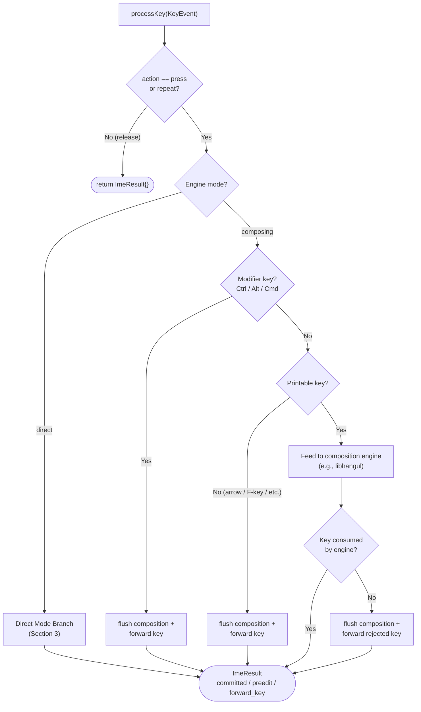

# processKey() Algorithm

- **Date**: 2026-03-22
- **Scope**: Language-agnostic `processKey()` general decision tree, direct mode
  branching logic, and Backspace undo path

---

## 1. Overview

`processKey(KeyEvent) → ImeResult` is the engine's core entry point. It receives
a key event and produces an `ImeResult` containing any committed text, updated
preedit, and/or a key to forward to the terminal. The daemon routes key events
through a three-phase pipeline (Phase 0 → 1 → 2); this engine operates in
Phase 1. For the full pipeline definition, see `02-integration-boundaries.md` in
the daemon design docs. The engine is a pure composition state machine — it has
no knowledge of what happens in Phase 0 (shortcut interception) or Phase 2
(ghostty integration / PTY writes).

## 2. Decision Tree

The following flowchart shows the general decision tree inside `processKey()`.
This applies to all engine modes (direct and composing).



### 2.1 Step-by-Step Algorithm (Composing Mode)

1. **Check action**: If the key action is not `press` or `repeat` (i.e., it is a
   release event), return `ImeResult{}` immediately. Release events are never
   processed by the composition engine.

2. **Check modifiers** (Ctrl / Alt / Cmd): If any composition-breaking modifier
   is present, flush the current composition (commit preedit), then forward the
   original key. See [03-modifier-flush-policy.md](03-modifier-flush-policy.md)
   for the full policy table and rationale.

3. **Check printability**: If the key is non-printable (arrow keys, function
   keys, Enter, Tab, Escape, etc.), flush the current composition, then forward
   the key. These keys are not candidates for composition input.

   > **Note — "printable" definition for this algorithm**: In this document,
   > "printable" means keys that map to letters, digits, or punctuation
   > characters via HID-to-ASCII lookup. `isPrintablePosition()` from the
   > interface contract is the correct printability gate — it covers HID
   > keycodes 0x04–0x27 (letters A–Z and digits 1–0) and 0x2D–0x38 (punctuation:
   > `-`, `=`, `[`, `]`, `\`, `;`, `'`, `` ` ``, `,`, `.`, `/`), correctly
   > excluding the five gap keycodes (0x28–0x2C):
   >
   > - Enter (0x28), Escape (0x29), Tab (0x2B), Space (0x2C) — routed to the
   >   flush/forward path per this step.
   > - Backspace (0x2A) — routed to the IME undo handler. See Section 2.3.

4. **Feed to composition engine**: If the key is printable and unmodified (or
   Shift-only), feed it to the language-specific composition engine. For Korean,
   this calls `hangul_ic_process()`. For details on the libhangul call sequence,
   see [11-hangul-ic-process-handling.md](11-hangul-ic-process-handling.md).

5. **Handle engine response**:
   - **Consumed** (engine returns true): The key was accepted into the
     composition. Read committed text and preedit from the engine.
   - **Not consumed** (engine returns false): The key was rejected (not a valid
     input for the current composition engine). Flush any remaining composition,
     then forward the rejected key. See
     [11-hangul-ic-process-handling.md](11-hangul-ic-process-handling.md) for
     the complete return-false handling algorithm.

6. **Construct ImeResult**: Populate `committed_text`, `preedit_text`,
   `forward_key`, and `preedit_changed` based on the outcome. Return to caller.

### 2.2 Flush Semantics

In all flush cases (modifier, non-printable, rejected key), the engine
**commits** the in-progress composition — it never silently discards it. This
ensures the user's typed text is always preserved. The flush policy is defined
in [03-modifier-flush-policy.md](03-modifier-flush-policy.md).

### 2.3 Backspace Handling in Composing Mode

Backspace during active composition is the third non-printable path in the
`processKey()` decision tree, distinct from both the modifier flush path
(Step 2) and the special-key flush path (Step 3). Instead of flushing, Backspace
is delegated to the engine's undo handler.

The undo handler returns a boolean indicating whether the key was consumed:

- **`true` (consumed)**: A composition unit was removed. The engine reads the
  updated preedit from its internal state and returns:

  ```
  ImeResult{ .committed_text = null, .preedit_text = updated_preedit,
             .forward_key = null, .preedit_changed = true }
  ```

  If the undo operation empties the composition entirely, `preedit_text` is
  `null` (and `preedit_changed` is still `true` because preedit transitioned
  from non-null to null).

- **`false` (not consumed)**: The composition was already empty -- there is
  nothing to undo. The key is forwarded to the terminal:

  ```
  ImeResult{ .committed_text = null, .preedit_text = null,
             .forward_key = Backspace, .preedit_changed = false }
  ```

This algorithm is language-agnostic. For language-specific decomposition
mechanics (e.g., Korean jamo stack behavior), see
[10-hangul-engine-internals.md](10-hangul-engine-internals.md) Section 6.

## 3. Direct Mode Branch

In direct mode (`"direct"` input method), there is no composition engine active.
`processKey()` performs a simple branch:

- **Printable key without modifiers**: HID-to-ASCII lookup →
  `committed_text = ascii_char`, no forward key.
- **Everything else** (non-printable, modified, unmapped):
  `forward_key = original_key`, no committed text.
- Direct mode never has preedit (no composition state), so `preedit_changed` is
  always `false`.

  > **Note — "printable" in direct mode**: The same definition from Section 2.1
  > Step 3 applies here. `isPrintablePosition()` is the correct printability
  > gate — it covers HID 0x04–0x27 and 0x2D–0x38, excluding the five gap
  > keycodes (0x28–0x2C: Enter, Escape, Backspace, Tab, Space) which fall into
  > the "everything else → forward" path.

### 3.1 Direct Mode Rationale

Direct mode exists so the engine can handle all key input uniformly — the daemon
always calls `processKey()` regardless of the active input method. This
eliminates a conditional branch in the daemon's key routing path. The engine
internally dispatches to the appropriate logic based on its current mode.

## 4. Engine Isolation

The engine is deliberately isolated from the surrounding pipeline:

- **No Phase 0 knowledge**: The engine does not know about language toggle keys,
  app-level shortcuts, or CapsLock handling. These are consumed before the key
  reaches `processKey()`.
- **No Phase 2 knowledge**: The engine does not know about PTY writes, ghostty
  key encoding, or preedit overlay rendering. It produces `ImeResult`; the
  daemon decides how to consume it.
- **No pane/session awareness**: The engine is pane-agnostic. Per-pane locking,
  focus change flushing, and session lifecycle are daemon responsibilities.

This isolation means `processKey()` is a pure function of the current
composition state and the incoming key event.
