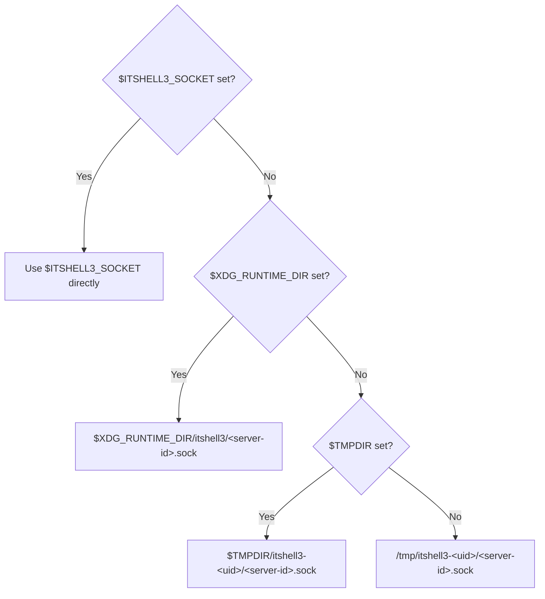
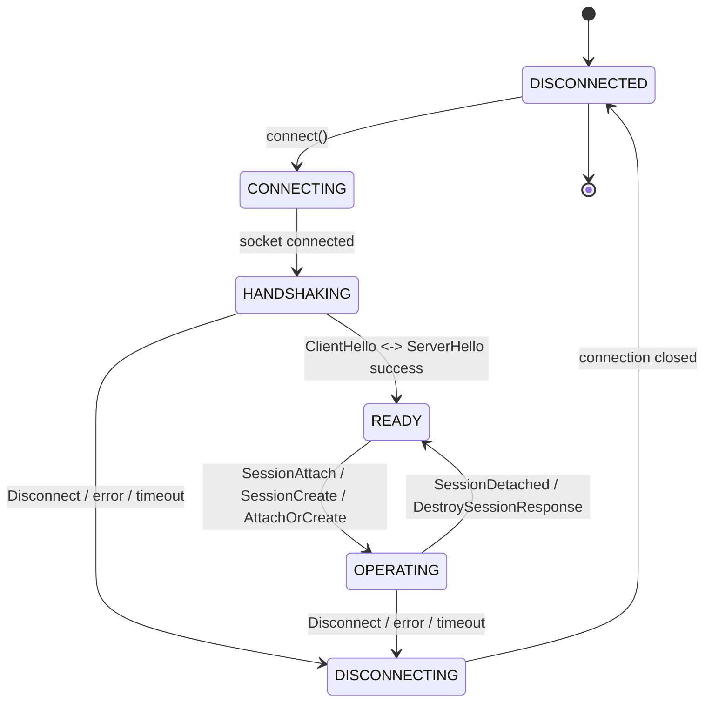

# Protocol Overview and Message Framing

- **Date**: 2026-03-14
- **Scope**: libitshell3 server-client wire protocol — transport, framing,
  message types, lifecycle, error handling

---

## 1. Design Goals and Principles

### 1.1 Primary Goals

| Goal                            | Description                                                                                                                         |
| ------------------------------- | ----------------------------------------------------------------------------------------------------------------------------------- |
| **Low-latency input**           | Key events reach the PTY in under 1ms over Unix socket                                                                              |
| **Efficient rendering updates** | I/P-frame model with periodic keyframes and delta-based RenderState transfer; typical partial update under 1 KB                     |
| **CJK-first design**            | Preedit synchronization, Jamo decomposition, ambiguous width negotiation are first-class protocol citizens                          |
| **Extensibility**               | Reserved message type ranges, capability negotiation, version-tagged framing                                                        |
| **Debuggability**               | Magic bytes for stream alignment, sequence numbers for packet tracing, well-defined error codes, JSON payloads for control messages |

### 1.2 Design Principles

1. **Little-endian byte order throughout.** Matches native byte order of all
   target platforms (ARM64 macOS/iOS, x86_64 macOS/Linux). Eliminates byte-swap
   overhead. Zig's `std.mem.writeInt` with `.little` endianness is used for
   serialization.

2. **Sequence numbers for every message.** Enables request-response correlation,
   out-of-order detection, and protocol debugging. Each direction maintains its
   own monotonically increasing sequence counter.

3. **Explicit error reporting.** Every error is a structured message with an
   error code, the offending sequence number, and a human-readable description.
   No silent drops.

4. **Backpressure-aware.** Flow control messages and a shared per-pane ring
   buffer prevent buffer bloat when clients cannot keep up with rendering
   updates. Slow clients are advanced to the latest I-frame (keyframe) in the
   ring rather than accumulating stale deltas.

5. **Event-driven delta delivery, not fixed-fps.** The server does not render at
   a fixed frame rate. Updates are driven by PTY output events and coalesced via
   an adaptive cadence model (see Section 10). The coalescing ceiling matches
   the client's display refresh rate (typically 16ms for 60 Hz) but real
   terminal workloads typically produce 0-30 updates/second.

---

## 2. Transport Layer

### 2.1 Primary Transport: Unix Domain Socket

| Property         | Value                                                                                                   |
| ---------------- | ------------------------------------------------------------------------------------------------------- |
| Domain           | `AF_UNIX`                                                                                               |
| Type             | `SOCK_STREAM` (reliable, ordered byte stream)                                                           |
| Path             | `$XDG_RUNTIME_DIR/itshell3/<server-id>.sock` or `$TMPDIR/itshell3-<uid>/<server-id>.sock`               |
| Permissions      | Socket file: `0600` (owner-only). Directory: `0700`.                                                    |
| Authentication   | Kernel-level: `SO_PEERCRED` / `getpeereid()` provides peer UID/GID. Only same-UID connections accepted. |
| Max message size | 16 MiB (covers full-screen RenderState with large scrollback queries)                                   |
| Buffer sizes     | `SO_SNDBUF` / `SO_RCVBUF`: 256 KiB (sufficient for ~30 full frames of buffering)                        |

**Socket path resolution algorithm:**



The `<server-id>` is a short identifier (default: `default`) allowing multiple
daemon instances.

### 2.2 Remote Transport: SSH Tunneling (Phase 5)

For iOS-to-macOS and general remote connectivity:

```
Local client:   App → Unix socket → daemon
Remote client:  App → SSH tunnel (libssh2) → sshd → Unix socket → daemon
```

The daemon only ever sees Unix socket connections. The protocol is truly
transport-agnostic with a single transport implementation.

| Property       | Value                                                                                                                               |
| -------------- | ----------------------------------------------------------------------------------------------------------------------------------- |
| Transport      | SSH tunnel via libssh2 — client opens `direct-tcpip` or `direct-streamlocal@openssh.com` channel to forward to daemon's Unix socket |
| Authentication | SSH key or password — handled entirely by SSH, not by the protocol                                                                  |
| Compression    | SSH's built-in compression (`Compression yes`) — no application-layer compression needed                                            |
| Framing        | Same binary framing as Unix socket (the protocol is transport-agnostic)                                                             |
| Keepalive      | SSH `ServerAliveInterval` + application-level heartbeat as secondary safety net                                                     |

---

## 3. Message Framing Format

### 3.1 Frame Header (16 bytes, fixed)

Every message on the wire begins with this 16-byte header:

```
Offset  Size  Field          Description
------  ----  -----          -----------
 0      2     magic          Magic bytes: 0x49 0x54 (ASCII "IT")
 2      1     version        Header format version (current: 1; see Section 3.1.1)
 3      1     flags          Frame flags (see below)
 4      2     msg_type       Message type ID (little-endian u16)
 6      2     reserved       Reserved, must be 0 (alignment padding)
 8      4     payload_len    Payload length in bytes (little-endian u32, NOT including header)
12      4     sequence       Sequence number (little-endian u32)
```

**Total header size: 16 bytes** (naturally aligned for 4-byte fields)

**Important**: `payload_len` is the size of the payload only. Total bytes on the
wire = 16 + payload_len. The 2-byte reserved field provides natural 4-byte
alignment for `payload_len` and `sequence`, and room for future routing or flag
fields.

#### 3.1.1 Version Byte Semantics

The version byte identifies the **binary header format**, not the protocol
feature set. Currently `1`. Exact match is required in the reader loop (Section
11.2).

**Evolution policy:** All backward-compatible protocol evolution uses capability
negotiation (doc 02). The version byte is incremented only when the 16-byte
header structure itself changes — for example, header size change, byte order
change, magic value change, or a fundamental encoding change (e.g., header
becomes TLV). Do not increment the version byte for new message types, new
fields, or new capabilities.

The version byte is NOT a protocol revision number. It is essentially a parser
compatibility marker. A version change means "rewrite the parser." Capabilities
handle everything else.

### 3.2 Frame Flags (byte at offset 3)

```
Bit  Name            Description
---  ----            -----------
 0   ENCODING        Payload encoding: 0 = JSON payload, 1 = binary payload
 1   RESPONSE        This message is a response to a request (sequence = request's sequence)
 2   ERROR           This message is an error response (implies RESPONSE)
 3   MORE_FRAGMENTS  More fragments follow (for messages exceeding max fragment size)
4-7  (reserved)      Must be 0
```

Bit numbering is LSB-first: bit 0 is the least significant bit (0x01), bit 7 is
the most significant bit (0x80).

Example: ENCODING=1 only → flags byte = `0x01`.

**Encoding flag semantics:**

| ENCODING bit | Payload format                                                                      | Used by                                                                                                              |
| ------------ | ----------------------------------------------------------------------------------- | -------------------------------------------------------------------------------------------------------------------- |
| `0` (JSON)   | Entire payload is a JSON object                                                     | All control messages: handshake, session management, input events, errors, flow control, heartbeat                   |
| `1` (binary) | Payload contains binary-encoded data (may include a trailing JSON metadata section) | `FrameUpdate` (0x0300): binary DirtyRows + CellData, followed by a JSON metadata blob for cursor, colors, dimensions |

### 3.3 Wire Format

```
+----------------------+----------------------------------+
|  Header (16 bytes)   |  Payload (payload_len bytes)     |
|                      |  (may be empty if payload_len=0) |
| magic version flags  |                                  |
| msg_type  reserved   |                                  |
| payload_len          |                                  |
| sequence             |                                  |
+----------------------+----------------------------------+
```

**FrameUpdate wire layout (ENCODING=1):**

```
+----------------------+---------------------+--------------------+-------------------+
|  Header (16 bytes)   |  Binary frame hdr   |  Binary DirtyRows  |  JSON metadata    |
|  flags.ENCODING = 1  |  (fixed size)       |  + CellData        |  blob             |
+----------------------+---------------------+--------------------+-------------------+
```

**All other messages (ENCODING=0):**

```
+----------------------+-------------------+
|  Header (16 bytes)   |  JSON payload     |
|  flags.ENCODING = 0  |                   |
+----------------------+-------------------+
```

Messages are sent back-to-back on the stream with no inter-message padding. The
reader loop:

1. Read exactly 16 bytes (header)
2. Validate magic bytes (`0x49 0x54`)
3. Read exactly `payload_len` bytes (payload)
4. Check `ENCODING` flag to determine payload format
5. Dispatch on `msg_type`

### 3.4 Sequence Numbers

Each connection direction (client-to-server, server-to-client) maintains its own
sequence counter, starting at 1.

**Sequence 0 is never sent on the wire.** It is used only as a sentinel value in
payload fields (e.g., `ref_sequence = 0` in Error messages means "no specific
message triggered this error").

All message types — requests, responses, and notifications — use sequence
numbers as follows:

| Message type   | Sequence number                    | RESPONSE flag                 |
| -------------- | ---------------------------------- | ----------------------------- |
| Request        | Sender's next monotonic seq        | 0                             |
| Response       | Echo the request's sequence number | 1                             |
| Notification   | Sender's next monotonic seq        | 0                             |
| Error response | Echo offending request's seq       | 1 (RESPONSE + ERROR both set) |

Notifications are distinguished from requests by their message type
(notification types such as `LayoutChanged`, `PaneMetadataChanged`, etc. are
never used as request/response pairs).

The sequence counter wraps at `0xFFFFFFFF` back to 1 (skipping 0).

### 3.5 JSON Payload Conventions

All messages with ENCODING=0 (JSON) follow these conventions:

- **Field types**: Boolean fields use JSON `true`/`false`. String fields are
  JSON strings (UTF-8). Integer fields are JSON numbers.
- **Optional fields**: When a JSON field has no value, the field MUST be omitted
  from the JSON object. Senders MUST NOT include fields with `null` values.
  Receivers MUST tolerate both missing keys and `null` values as "absent"
  (defensive parsing for forward/backward compatibility).

### 3.6 Fragmentation

Messages larger than 1 MiB should be fragmented:

- Set `MORE_FRAGMENTS` flag on all fragments except the last
- All fragments share the same sequence number
- Fragments must arrive in order (guaranteed by `SOCK_STREAM`)
- The receiver reassembles fragments before dispatching

Fragmentation is a safety mechanism for edge cases (large scrollback queries,
bulk clipboard data). Most messages are well under 64 KiB.

---

## 4. Message Type ID Allocation

Message type IDs are 16-bit unsigned integers (`u16`), allocated in ranges by
functional category.

### 4.1 Allocation Ranges

| Range             | Category                           | Specification                                                           |
| ----------------- | ---------------------------------- | ----------------------------------------------------------------------- |
| `0x0000`          | Reserved                           | Never used                                                              |
| `0x0001 - 0x00FF` | **Handshake & Lifecycle**          | Doc 02                                                                  |
| `0x0100 - 0x01FF` | **Session & Pane Management**      | Doc 03                                                                  |
| `0x0200 - 0x02FF` | **Input Forwarding**               | Doc 04                                                                  |
| `0x0300 - 0x03FF` | **Render State**                   | Doc 04                                                                  |
| `0x0400 - 0x04FF` | **CJK & IME**                      | Doc 05                                                                  |
| `0x0500 - 0x05FF` | **Flow Control & Backpressure**    | Doc 06                                                                  |
| `0x0600 - 0x06FF` | **Clipboard**                      | Doc 06                                                                  |
| `0x0700 - 0x07FF` | **Persistence (snapshot/restore)** | Doc 06                                                                  |
| `0x0800 - 0x08FF` | **Notifications & Subscriptions**  | Doc 06                                                                  |
| `0x0900 - 0x09FF` | **Connection Health (reserved)**   | Future extensions (heartbeat uses `0x0003`/`0x0004` in Handshake range) |
| `0x0A00 - 0x0AFF` | **Extension Negotiation**          | Doc 06                                                                  |
| `0x0B00 - 0x0FFF` | **Reserved for future**            | Future protocol extensions                                              |
| `0xF000 - 0xFFFE` | **Vendor extensions**              | Third-party extensions (not part of core protocol)                      |
| `0xFFFF`          | Reserved                           | Never used                                                              |

### 4.2 Core Message Types (v1)

#### 4.2.1 Encoding Convention

| Message category                     | Payload encoding                             | ENCODING flag | Rationale                                                                                                                |
| ------------------------------------ | -------------------------------------------- | ------------- | ------------------------------------------------------------------------------------------------------------------------ |
| Handshake & Lifecycle                | JSON                                         | 0             | Self-describing, version discovery, debuggable                                                                           |
| Session & Pane Management            | JSON                                         | 0             | Low frequency, schema evolution, cross-language                                                                          |
| Input Forwarding                     | JSON                                         | 0             | Low frequency, cross-language clients                                                                                    |
| Render State: **FrameUpdate**        | **Hybrid** (binary CellData + JSON metadata) | **1**         | Binary for bulk cell data (3x smaller, RLE-compatible); JSON for cursor, colors, dimensions (debuggable, `"한"` not hex) |
| Render State: other (Scroll, Search) | JSON                                         | 0             | Low frequency                                                                                                            |
| CJK & IME                            | JSON                                         | 0             | Preedit shows `"한"` not hex; low frequency                                                                              |
| Flow Control                         | JSON                                         | 0             | Low frequency                                                                                                            |
| Errors                               | JSON                                         | 0             | Human-readable                                                                                                           |
| All other categories                 | JSON                                         | 0             | Default encoding for all control messages                                                                                |

#### Handshake & Lifecycle (`0x0001 - 0x00FF`)

| ID                | Name           | Direction     | Encoding | Description                                        |
| ----------------- | -------------- | ------------- | -------- | -------------------------------------------------- |
| `0x0001`          | `ClientHello`  | C->S          | JSON     | Client identification and capability declaration   |
| `0x0002`          | `ServerHello`  | S->C          | JSON     | Server identification, capabilities, session list  |
| `0x0003`          | `Heartbeat`    | Bidirectional | JSON     | Keepalive ping (carries `ping_id` for correlation) |
| `0x0004`          | `HeartbeatAck` | Bidirectional | JSON     | Keepalive pong (echoes `ping_id`)                  |
| `0x0005`          | `Disconnect`   | Bidirectional | JSON     | Graceful disconnect with reason                    |
| `0x0006`-`0x00FE` | (reserved)     | —             | —        | Reserved for future lifecycle messages             |
| `0x00FF`          | `Error`        | Bidirectional | JSON     | Structured error report                            |

#### Session & Pane Management (`0x0100 - 0x01FF`)

See doc 03 for detailed message specifications. All messages in this range use
JSON encoding. Summary of key messages:

| ID       | Name                     | Direction | Description                                            |
| -------- | ------------------------ | --------- | ------------------------------------------------------ |
| `0x0100` | `CreateSessionRequest`   | C->S      | Create a new session                                   |
| `0x0101` | `CreateSessionResponse`  | S->C      | Session creation confirmation with session_id, pane_id |
| `0x0102` | `ListSessionsRequest`    | C->S      | List available sessions                                |
| `0x0103` | `ListSessionsResponse`   | S->C      | Session list                                           |
| `0x0104` | `AttachSessionRequest`   | C->S      | Attach to an existing session                          |
| `0x0105` | `AttachSessionResponse`  | S->C      | Attach confirmation with layout and state              |
| `0x0106` | `DetachSessionRequest`   | C->S      | Detach from current session                            |
| `0x0107` | `DetachSessionResponse`  | S->C      | Detach confirmation (also used for forced detach)      |
| `0x0108` | `DestroySessionRequest`  | C->S      | Destroy a session                                      |
| `0x0109` | `DestroySessionResponse` | S->C      | Destroy confirmation                                   |
| `0x010A` | `RenameSessionRequest`   | C->S      | Rename a session                                       |
| `0x010B` | `RenameSessionResponse`  | S->C      | Rename confirmation                                    |
| `0x010C` | `AttachOrCreateRequest`  | C->S      | Attach to existing session or create new (see doc 03)  |
| `0x010D` | `AttachOrCreateResponse` | S->C      | AttachOrCreate result with action_taken                |
| `0x0140` | `CreatePaneRequest`      | C->S      | Create a standalone pane                               |
| `0x0141` | `CreatePaneResponse`     | S->C      | Pane creation result                                   |
| `0x0142` | `SplitPaneRequest`       | C->S      | Split an existing pane                                 |
| `0x0143` | `SplitPaneResponse`      | S->C      | Split result with new_pane_id                          |
| `0x0144` | `ClosePaneRequest`       | C->S      | Close a pane                                           |
| `0x0145` | `ClosePaneResponse`      | S->C      | Close result with side_effect                          |
| `0x0146` | `FocusPaneRequest`       | C->S      | Set focused pane                                       |
| `0x0147` | `FocusPaneResponse`      | S->C      | Focus result with previous_pane_id                     |
| `0x0148` | `NavigatePaneRequest`    | C->S      | Move focus in a direction                              |
| `0x0149` | `NavigatePaneResponse`   | S->C      | Navigate result with focused_pane_id                   |
| `0x014A` | `ResizePaneRequest`      | C->S      | Adjust split divider                                   |
| `0x014B` | `ResizePaneResponse`     | S->C      | Resize result                                          |
| `0x014C` | `EqualizeSplitsRequest`  | C->S      | Equalize all splits in a session                       |
| `0x014D` | `EqualizeSplitsResponse` | S->C      | Equalize result                                        |
| `0x014E` | `ZoomPaneRequest`        | C->S      | Toggle pane zoom                                       |
| `0x014F` | `ZoomPaneResponse`       | S->C      | Zoom result with zoomed state                          |
| `0x0150` | `SwapPanesRequest`       | C->S      | Swap two panes in layout                               |
| `0x0151` | `SwapPanesResponse`      | S->C      | Swap result                                            |
| `0x0152` | `LayoutGetRequest`       | C->S      | Query current layout tree                              |
| `0x0153` | `LayoutGetResponse`      | S->C      | Current layout tree (same format as LayoutChanged)     |
| `0x0180` | `LayoutChanged`          | S->C      | Layout tree updated (notification)                     |
| `0x0181` | `PaneMetadataChanged`    | S->C      | Pane metadata updated (notification)                   |
| `0x0182` | `SessionListChanged`     | S->C      | Session list changed (notification)                    |
| `0x0183` | `ClientAttached`         | S->C      | Client attached to session (notification)              |
| `0x0184` | `ClientDetached`         | S->C      | Client detached from session (notification)            |
| `0x0185` | `ClientHealthChanged`    | S->C      | Client health state changed (notification)             |
| `0x0190` | `WindowResize`           | C->S      | Client window resized                                  |
| `0x0191` | `WindowResizeAck`        | S->C      | Resize acknowledged                                    |

**Note**: There is no Tab as a protocol entity in libitshell3. The protocol
hierarchy is **Daemon > Session(s) > Pane tree (binary splits)**. Each Session
has one layout tree. The client UI presents Sessions as tabs:

| UI action  | Protocol message                                                         |
| ---------- | ------------------------------------------------------------------------ |
| New tab    | `CreateSessionRequest` (0x0100)                                          |
| Close tab  | `DestroySessionRequest` (0x0108) -- closes the session and all its panes |
| Switch tab | Client-local: switch which Session's render state is displayed           |
| Rename tab | `RenameSessionRequest` (0x010A)                                          |

See doc 03 for full details.

#### Input Forwarding (`0x0200 - 0x02FF`)

See doc 04 for detailed message specifications. All messages in this range use
JSON encoding.

| ID       | Name          | Direction | Description                                |
| -------- | ------------- | --------- | ------------------------------------------ |
| `0x0200` | `KeyEvent`    | C->S      | Raw HID keycode + modifiers + input method |
| `0x0201` | `TextInput`   | C->S      | Direct UTF-8 text insertion (bypasses IME) |
| `0x0202` | `MouseButton` | C->S      | Mouse button press/release                 |
| `0x0203` | `MouseMove`   | C->S      | Mouse motion (rate limited)                |
| `0x0204` | `MouseScroll` | C->S      | Scroll wheel / trackpad                    |
| `0x0205` | `PasteData`   | C->S      | Clipboard paste (chunked)                  |
| `0x0206` | `FocusEvent`  | C->S      | Window focus gained/lost                   |

#### Render State (`0x0300 - 0x03FF`)

See doc 04 for detailed message specifications.

| ID       | Name             | Direction | Encoding                   | Description                                                                                                                                               |
| -------- | ---------------- | --------- | -------------------------- | --------------------------------------------------------------------------------------------------------------------------------------------------------- |
| `0x0300` | `FrameUpdate`    | S->C      | **Hybrid** (binary + JSON) | RenderState delta or full update. Binary DirtyRows/CellData (including preedit cells injected into the terminal grid by the server) + JSON metadata blob. |
| `0x0301` | `ScrollRequest`  | C->S      | JSON                       | Scroll viewport                                                                                                                                           |
| `0x0302` | `ScrollPosition` | S->C      | JSON                       | Current scroll position                                                                                                                                   |
| `0x0303` | `SearchRequest`  | C->S      | JSON                       | Search in scrollback                                                                                                                                      |
| `0x0304` | `SearchResult`   | S->C      | JSON                       | Search results                                                                                                                                            |
| `0x0305` | `SearchCancel`   | C->S      | JSON                       | Cancel active search                                                                                                                                      |

**FrameUpdate hybrid encoding:**

```
[16-byte binary header (ENCODING=1)] -> dispatch on type + encoding flag
    |
    +-- [binary frame header][binary DirtyRows + CellData][JSON metadata blob]
```

| Component                  | Encoding  | Rationale                                                                                                     |
| -------------------------- | --------- | ------------------------------------------------------------------------------------------------------------- |
| DirtyRows + CellData       | Binary    | 70-95% of payload; 3x smaller than JSON; RLE-compatible; fixed-size cells enable deterministic pre-allocation |
| Cursor, Colors, Dimensions | JSON blob | Debuggable; low-frequency metadata                                                                            |

#### CJK & IME (`0x0400 - 0x04FF`)

See doc 05 for detailed message specifications. The server owns the native IME
engine (libitshell3-ime). Clients send raw HID keycodes via KeyEvent; the server
manages composition lifecycle and pushes preedit metadata to all attached
clients. Preedit rendering is through cell data in I/P-frames (the server
injects preedit cells into the terminal grid and they appear in FrameUpdate
CellData). All messages in this range use JSON encoding.

| ID       | Name                   | Direction     | Description                                                                                                              |
| -------- | ---------------------- | ------------- | ------------------------------------------------------------------------------------------------------------------------ |
| `0x0400` | `PreeditStart`         | **S->C**      | Server notifies that IME composition began                                                                               |
| `0x0401` | `PreeditUpdate`        | **S->C**      | Server pushes preedit lifecycle/metadata to all clients (text for multi-client coordination; rendering is via cell data) |
| `0x0402` | `PreeditEnd`           | **S->C**      | Server notifies composition committed or cancelled                                                                       |
| `0x0403` | `PreeditSync`          | S->C          | Full preedit snapshot for late-joining clients                                                                           |
| `0x0404` | `InputMethodSwitch`    | C->S          | Client requests input method change                                                                                      |
| `0x0405` | `InputMethodAck`       | S->C          | Server confirms input method change                                                                                      |
| `0x0406` | `AmbiguousWidthConfig` | Bidirectional | Ambiguous-width character configuration                                                                                  |
| `0x04FF` | `IMEError`             | S->C          | Error response for CJK/IME operations                                                                                    |

**Preedit architecture (v0.8)**: Preedit is cell data, not metadata. The server
injects preedit cells into the terminal grid. These cells are serialized as part
of FrameUpdate CellData in I/P-frames. The client renders all cells uniformly —
it has no concept of which cells are preedit. Dedicated preedit messages
(0x0400-0x0405) provide lifecycle/metadata only (multi-client coordination,
debugging); they are not used for rendering. The `"preedit"` capability controls
only these dedicated messages; preedit rendering via cell data is always
available regardless of capability negotiation.

#### Flow Control & Backpressure (`0x0500 - 0x05FF`)

See doc 06 for detailed message specifications. All messages in this range use
JSON encoding.

| ID       | Name                   | Direction | Description                                                                               |
| -------- | ---------------------- | --------- | ----------------------------------------------------------------------------------------- |
| `0x0500` | `PausePane`            | S->C      | Advisory signal: client is falling behind on a pane (triggers health escalation timeline) |
| `0x0501` | `ContinuePane`         | C->S      | Client signals readiness to resume                                                        |
| `0x0502` | `FlowControlConfig`    | C->S      | Client configures flow control parameters                                                 |
| `0x0503` | `FlowControlConfigAck` | S->C      | Server acknowledges flow control configuration                                            |
| `0x0504` | `OutputQueueStatus`    | S->C      | Server reports per-client queue pressure                                                  |
| `0x0505` | `ClientDisplayInfo`    | C->S      | Client reports display, power, and transport state                                        |
| `0x0506` | `ClientDisplayInfoAck` | S->C      | Server acknowledges display info                                                          |

#### Clipboard (`0x0600 - 0x06FF`)

See doc 06 for detailed message specifications. All messages in this range use
JSON encoding.

| ID       | Name                       | Direction | Description                                   |
| -------- | -------------------------- | --------- | --------------------------------------------- |
| `0x0600` | `ClipboardWrite`           | S->C      | Server requests client write to OS clipboard  |
| `0x0601` | `ClipboardRead`            | C->S      | Client requests clipboard contents for a pane |
| `0x0602` | `ClipboardReadResponse`    | S->C      | Server returns clipboard contents             |
| `0x0603` | `ClipboardChanged`         | S->C      | Clipboard content changed notification        |
| `0x0604` | `ClipboardWriteFromClient` | C->S      | Client pushes clipboard content to server     |

#### Persistence — Snapshot/Restore (`0x0700 - 0x07FF`)

See doc 06 for detailed message specifications. All messages in this range use
JSON encoding.

| ID       | Name                        | Direction | Description                                   |
| -------- | --------------------------- | --------- | --------------------------------------------- |
| `0x0700` | `SnapshotRequest`           | C->S      | Client requests a session snapshot            |
| `0x0701` | `SnapshotResponse`          | S->C      | Snapshot result                               |
| `0x0702` | `RestoreSessionRequest`     | C->S      | Client requests session restore from snapshot |
| `0x0703` | `RestoreSessionResponse`    | S->C      | Restore result                                |
| `0x0704` | `SnapshotListRequest`       | C->S      | List available snapshots                      |
| `0x0705` | `SnapshotListResponse`      | S->C      | Available snapshots                           |
| `0x0706` | `SnapshotAutoSaveConfig`    | C->S      | Configure auto-save                           |
| `0x0707` | `SnapshotAutoSaveConfigAck` | S->C      | Auto-save configuration result                |

#### Notifications & Subscriptions (`0x0800 - 0x08FF`)

See doc 06 for detailed message specifications. All messages in this range use
JSON encoding.

| ID       | Name               | Direction | Description                          |
| -------- | ------------------ | --------- | ------------------------------------ |
| `0x0800` | `PaneTitleChanged` | S->C      | Pane title changed (OSC 0/2)         |
| `0x0801` | `ProcessExited`    | S->C      | Foreground process exited            |
| `0x0802` | `Bell`             | S->C      | Bell character received (BEL / \\a)  |
| `0x0803` | `RendererHealth`   | S->C      | Server-side rendering health report  |
| `0x0804` | `PaneCwdChanged`   | S->C      | Pane working directory changed       |
| `0x0805` | `ActivityDetected` | S->C      | Output activity in a background pane |
| `0x0806` | `SilenceDetected`  | S->C      | No output for configured duration    |
| `0x0810` | `Subscribe`        | C->S      | Subscribe to notification events     |
| `0x0811` | `SubscribeAck`     | S->C      | Subscription confirmation            |
| `0x0812` | `Unsubscribe`      | C->S      | Unsubscribe from events              |
| `0x0813` | `UnsubscribeAck`   | S->C      | Unsubscription confirmation          |

#### Connection Health (`0x0900 - 0x09FF`)

Reserved for future connection health extensions. Heartbeat uses
`0x0003`/`0x0004` in the Handshake range (see Section 5.4).

#### Extension Negotiation (`0x0A00 - 0x0AFF`)

See doc 06 for detailed message specifications. All messages in this range use
JSON encoding.

| ID       | Name               | Direction     | Description                              |
| -------- | ------------------ | ------------- | ---------------------------------------- |
| `0x0A00` | `ExtensionList`    | C->S or S->C  | Declare available extensions             |
| `0x0A01` | `ExtensionListAck` | S->C or C->S  | Acknowledge and accept/reject extensions |
| `0x0A02` | `ExtensionMessage` | Bidirectional | Message within a negotiated extension    |

---

## 5. Connection Lifecycle State Machine

### 5.1 State Diagram



### 5.2 State Descriptions

| State           | Description                                                                | Allowed Messages                                       |
| --------------- | -------------------------------------------------------------------------- | ------------------------------------------------------ |
| `DISCONNECTED`  | No active connection. Initial and terminal state.                          | None                                                   |
| `CONNECTING`    | Socket connection in progress. Transport-layer only.                       | None (transport handshake)                             |
| `HANDSHAKING`   | Connected; exchanging `ClientHello` / `ServerHello`.                       | `ClientHello`, `ServerHello`, `Error`, `Disconnect`    |
| `READY`         | Handshake complete. Client is authenticated but not attached to a session. | Session management messages, `Heartbeat`, `Disconnect` |
| `OPERATING`     | Attached to a session. Full protocol in effect.                            | All message types                                      |
| `DISCONNECTING` | Graceful disconnect in progress. Draining pending messages.                | `Disconnect`, `Error`                                  |

**Single-session-per-connection rule:** A client connection is attached to at
most one session at a time. To switch sessions, the client must first detach
(`DetachSessionRequest`) then attach to the new session. Sending
`AttachSessionRequest` while already attached returns
`ERR_SESSION_ALREADY_ATTACHED`.

### 5.3 State Transitions

| From            | Event                                                                             | To              | Action                                |
| --------------- | --------------------------------------------------------------------------------- | --------------- | ------------------------------------- |
| `DISCONNECTED`  | `connect()`                                                                       | `CONNECTING`    | Initiate socket connection            |
| `CONNECTING`    | Transport connected                                                               | `HANDSHAKING`   | Client sends `ClientHello`            |
| `CONNECTING`    | Timeout (5s)                                                                      | `DISCONNECTED`  | Log error, close                      |
| `HANDSHAKING`   | `ServerHello` received, compatible                                                | `READY`         | Store negotiated capabilities         |
| `HANDSHAKING`   | `ServerHello` received, incompatible                                              | `DISCONNECTING` | Send `Error`, close                   |
| `HANDSHAKING`   | Timeout (5s)                                                                      | `DISCONNECTING` | Send `Error`, close                   |
| `READY`         | `AttachSessionRequest` / `CreateSessionRequest` / `AttachOrCreateRequest` success | `OPERATING`     | Begin session interaction             |
| `READY`         | `Disconnect` received or sent                                                     | `DISCONNECTING` | Drain and close                       |
| `OPERATING`     | `SessionDetach`                                                                   | `READY`         | Detach from session, remain connected |
| `OPERATING`     | `DestroySessionResponse` (status=0)                                               | `READY`         | Session destroyed, remain connected   |
| `OPERATING`     | `Disconnect` received or sent                                                     | `DISCONNECTING` | Drain and close                       |
| `OPERATING`     | Connection error / timeout                                                        | `DISCONNECTED`  | Log error, clean up                   |
| `DISCONNECTING` | All pending messages sent                                                         | `DISCONNECTED`  | Close connection                      |

### 5.4 Heartbeat and Timeout

- **Heartbeat interval**: 30 seconds (configurable)
- **Heartbeat timeout**: 90 seconds (3 missed heartbeats)
- **Direction**: Bidirectional. Either side MAY send `Heartbeat` if no other
  messages have been sent within the heartbeat interval. The receiver responds
  with `HeartbeatAck`. Heartbeat initiation policy is defined in daemon design
  docs.
- If no message (of any kind) is received within the timeout, the connection is
  considered dead

Over Unix sockets, heartbeats are a secondary safety net; the kernel detects
peer process death via `EPIPE` / `SIGPIPE` much faster. Over SSH tunnels,
heartbeats are complementary to SSH's own `ServerAliveInterval` keepalive.

**Heartbeat payload (JSON, `0x0003`):**

```json
{
  "ping_id": 42
}
```

| Field     | Type | Description                            |
| --------- | ---- | -------------------------------------- |
| `ping_id` | u32  | Monotonic ping counter for correlation |

**HeartbeatAck payload (JSON, `0x0004`):**

```json
{
  "ping_id": 42
}
```

| Field     | Type | Description           |
| --------- | ---- | --------------------- |
| `ping_id` | u32  | Echoed from Heartbeat |

Liveness detection requires only `ping_id`: did the ack arrive within the
90-second timeout?

**Local RTT diagnostics** (implementation-level, not wire protocol): The sender
MAY maintain a local `HashMap(u32, u64)` mapping `ping_id → send_time` for
debugging purposes. `RTT = current_time - sent_times[ack.ping_id]`. This is an
implementation choice, not a wire protocol concern.

**Disconnect payload (`0x0005`)**: See doc 02, Section 11.1.

### 5.5 Multi-Session Client Model

The single-session-per-connection rule (Section 5.2) means a multi-tab client
MUST open **one Unix socket connection per session (tab)**.

```
Client app (it-shell3)
├── Connection 1 → Unix socket → daemon → Session A (tab 1)
├── Connection 2 → Unix socket → daemon → Session B (tab 2)
└── Connection 3 → Unix socket → daemon → Session C (tab 3)
```

Each connection runs the full lifecycle independently: handshake, session
attachment, FrameUpdate stream, heartbeat, and disconnect. This model naturally
provides:

- **Independent FrameUpdate streams**: All tabs render simultaneously without
  detach/attach ceremony.
- **Independent sequence counters**: No cross-session ordering constraints.
- **Independent flow control**: One tab at Bulk tier does not affect another tab
  at Interactive tier.

#### 5.5.1 Connection Lifecycle for Tabs

| UI action      | Protocol sequence                                                                                             |
| -------------- | ------------------------------------------------------------------------------------------------------------- |
| **New tab**    | Open new Unix socket connection -> ClientHello/ServerHello -> CreateSessionRequest (or AttachOrCreateRequest) |
| **Close tab**  | DestroySessionRequest (or DetachSessionRequest if session should survive) -> Disconnect -> close connection   |
| **Switch tab** | Client-local display switch. No protocol messages.                                                            |
| **Rename tab** | RenameSessionRequest on the tab's connection                                                                  |

#### 5.5.2 SSH Tunnel Multiplexing

For remote clients (Phase 5), multiple connections over a single SSH tunnel work
via SSH channel multiplexing:

```
SSH TCP connection (1 connection)
├── Channel 1 (direct-streamlocal@openssh.com) → Unix socket → Session A
├── Channel 2 (direct-streamlocal@openssh.com) → Unix socket → Session B
└── Channel 3 (direct-streamlocal@openssh.com) → Unix socket → Session C
```

Each SSH channel acts as an independent socket connection from the daemon's
perspective. No protocol changes are needed — SSH handles mux/demux
transparently. Note that the single SSH TCP connection is a single point of
failure: if it drops, all tabs lose connectivity simultaneously. This is
expected behavior and matches how users think about "the SSH connection to my
server."

#### 5.5.3 Connection Limits

No protocol-level limit on simultaneous connections. If the server cannot
accommodate a client due to resource limits, it responds with
`ERR_RESOURCE_EXHAUSTED`. The specific lifecycle stage at which this occurs is
defined in daemon design docs. Connection limit policy is defined in daemon
design docs.

### 5.6 Multi-Client Resize Policy

When multiple clients attach to the same session, the server must determine the
effective terminal size for the session's pane tree. The active resize policy is
communicated via `AttachSessionResponse` and applied through
`WindowResize`/`WindowResizeAck` messages (see doc 03 Section 5).

Clients with smaller dimensions than the effective size MUST clip to their own
viewport (top-left origin), matching tmux `latest` policy behavior. Per-client
viewports (scroll to see clipped areas) are deferred to v2.

### 5.7 Client Health Model

The protocol defines two health states orthogonal to connection lifecycle:

| State     | Definition                               | Resize participation      | Frame delivery                                                                                               |
| --------- | ---------------------------------------- | ------------------------- | ------------------------------------------------------------------------------------------------------------ |
| `healthy` | Normal operation                         | Yes                       | Full (per coalescing tier)                                                                                   |
| `stale`   | Paused too long or output queue stagnant | No (excluded from resize) | None (ring cursor stagnant). Recovery sends LayoutChanged + PreeditSync via direct queue before the I-frame. |

`paused` (PausePane active) is an orthogonal flow-control state, not a health
state. A paused client remains `healthy` until the stale timeout fires.

Server MAY send `Disconnect` with reason `stale_client` to evict unresponsive
clients. Health state transitions are communicated via `ClientHealthChanged`
(0x0185) notifications, sent to all peer clients attached to the same session.
See doc 06 Section 2 for wire message definitions.

---

## 6. Error Handling

### 6.1 Error Message Format

The `Error` message (`0x00FF`) uses JSON encoding (ENCODING=0):

```json
{
  "error_code": 1,
  "ref_sequence": 42,
  "detail": "Invalid magic bytes in header"
}
```

| Field          | Type   | Description                                                             |
| -------------- | ------ | ----------------------------------------------------------------------- |
| `error_code`   | u32    | Error code (see Section 6.2)                                            |
| `ref_sequence` | u32    | Sequence number of the message that caused the error (0 if unsolicited) |
| `detail`       | string | UTF-8 error detail string (human-readable)                              |

### 6.2 Error Code Ranges

| Range                     | Category             | Description                                            |
| ------------------------- | -------------------- | ------------------------------------------------------ |
| `0x00000000`              | Success              | No error (never sent in an Error message)              |
| `0x00000001 - 0x000000FF` | **Protocol errors**  | Malformed messages, version mismatch, bad magic        |
| `0x00000100 - 0x000001FF` | **Handshake errors** | Capability mismatch, auth failure                      |
| `0x00000200 - 0x000002FF` | **Session errors**   | Session not found, already attached, permission denied |
| `0x00000300 - 0x000003FF` | **Pane errors**      | Pane not found, cannot split, process exited           |
| `0x00000400 - 0x000004FF` | **Input errors**     | Invalid key, paste too large                           |
| `0x00000500 - 0x000005FF` | **CJK errors**       | Invalid preedit state, unsupported composition         |
| `0x00000600 - 0x000006FF` | **Resource errors**  | Out of memory, too many sessions/panes, rate limited   |
| `0xFFFFFFFF`              | **Internal**         | Unspecified server error                               |

### 6.3 Core Error Codes

| Code         | Name                           | Description                                                     |
| ------------ | ------------------------------ | --------------------------------------------------------------- |
| `0x00000001` | `ERR_BAD_MAGIC`                | Invalid magic bytes in header                                   |
| `0x00000002` | `ERR_UNSUPPORTED_VERSION`      | Protocol version not supported                                  |
| `0x00000003` | `ERR_BAD_MSG_TYPE`             | Unknown message type ID                                         |
| `0x00000004` | `ERR_PAYLOAD_TOO_LARGE`        | Payload exceeds maximum size                                    |
| `0x00000005` | `ERR_INVALID_STATE`            | Message not allowed in current connection state                 |
| `0x00000006` | `ERR_MALFORMED_PAYLOAD`        | Payload fails to parse                                          |
| `0x00000007` | `ERR_PROTOCOL_ERROR`           | Generic protocol violation (e.g., setting a reserved flag)      |
| `0x00000008` | `ERR_BAD_ENCODING`             | ENCODING flag does not match expected encoding for message type |
| `0x00000100` | `ERR_VERSION_MISMATCH`         | No mutually supported protocol version                          |
| `0x00000101` | `ERR_AUTH_FAILED`              | Authentication failed (UID mismatch)                            |
| `0x00000102` | `ERR_CAPABILITY_REQUIRED`      | Required capability not supported by peer                       |
| `0x00000200` | `ERR_SESSION_NOT_FOUND`        | Referenced session does not exist                               |
| `0x00000201` | `ERR_SESSION_ALREADY_ATTACHED` | Client already attached to a session                            |
| `0x00000202` | `ERR_SESSION_LIMIT`            | Maximum number of sessions reached                              |
| `0x00000203` | `ERR_ACCESS_DENIED`            | Operation not permitted (e.g., readonly client sending input)   |
| `0x00000300` | `ERR_PANE_NOT_FOUND`           | Referenced pane does not exist                                  |
| `0x00000301` | `ERR_PANE_EXITED`              | Pane's process has exited                                       |
| `0x00000302` | `ERR_SPLIT_FAILED`             | Cannot split pane (too small, etc.)                             |
| `0x00000600` | `ERR_RESOURCE_EXHAUSTED`       | Server resource limit reached                                   |
| `0x00000601` | `ERR_RATE_LIMITED`             | Too many requests                                               |

### 6.4 Recovery Strategies

| Error Category                   | Strategy                                                             |
| -------------------------------- | -------------------------------------------------------------------- |
| Protocol errors (`0x01-0xFF`)    | Fatal. Disconnect immediately. Indicates a bug or protocol mismatch. |
| Handshake errors (`0x100-0x1FF`) | Fatal. Disconnect. Client should report the error to the user.       |
| Session errors (`0x200-0x2FF`)   | Non-fatal. Client can retry or choose a different session.           |
| Pane errors (`0x300-0x3FF`)      | Non-fatal. Client can close the pane view and continue.              |
| Input errors (`0x400-0x4FF`)     | Non-fatal. Drop the input and continue.                              |
| CJK errors (`0x500-0x5FF`)       | Non-fatal. Fall back to non-CJK input mode for the affected pane.    |
| Resource errors (`0x600-0x6FF`)  | Non-fatal. Client should back off and retry after a delay.           |

---

## 7. Endianness and Encoding Conventions

| Item                                | Convention                                                                                                                                                                                                                                                              | Rationale                                                                                                                                                                                                                                                   |
| ----------------------------------- | ----------------------------------------------------------------------------------------------------------------------------------------------------------------------------------------------------------------------------------------------------------------------- | ----------------------------------------------------------------------------------------------------------------------------------------------------------------------------------------------------------------------------------------------------------- |
| **Integer byte order**              | Little-endian                                                                                                                                                                                                                                                           | Native for ARM64 (Apple Silicon) and x86_64. Zig `std.mem.writeInt(.little)`. No byte-swap cost on any target platform.                                                                                                                                     |
| **String encoding**                 | UTF-8                                                                                                                                                                                                                                                                   | Universal encoding. In JSON payloads, strings are native JSON strings. In binary payloads (CellData), strings are length-prefixed where needed.                                                                                                             |
| **Boolean**                         | JSON: `true`/`false`. Binary: u8 `0x00`/`0x01`.                                                                                                                                                                                                                         | JSON payloads use native JSON booleans. Binary payloads use explicit u8.                                                                                                                                                                                    |
| **Enums**                           | JSON: string names. Binary: u8 or u16 depending on range.                                                                                                                                                                                                               | JSON payloads use readable string names for debuggability. Binary payloads use numeric values.                                                                                                                                                              |
| **Optional fields**                 | JSON: field MUST be omitted when absent. Senders MUST NOT include fields with `null` values. Receivers MUST tolerate both missing keys and `null` values as "absent" (defensive parsing for forward/backward compatibility). Binary: preceding u8 flag (`0x00`/`0x01`). | Smaller payloads (relevant at preedit frequency ~15 msgs/s). Swift's default `Codable` behavior encodes `nil` as key-absent. Zig's `std.json` handles missing keys with `@"field" = null` defaults. Unambiguous: one canonical representation for "absent". |
| **Timestamps**                      | u64, milliseconds since Unix epoch                                                                                                                                                                                                                                      | Used for debugging and session metadata. In JSON payloads, encoded as a number.                                                                                                                                                                             |
| **Session/Pane IDs**                | u32, assigned by server, monotonically increasing                                                                                                                                                                                                                       | Server-authoritative. Never reused during a daemon's lifetime. In JSON payloads, encoded as a number.                                                                                                                                                       |
| **Field name direction convention** | C->S: bare names (`input_method`, `keyboard_layout`). S->C: `active_` prefix (`active_input_method`, `active_keyboard_layout`).                                                                                                                                         | C->S messages declare a requested or intended value. S->C messages report current authoritative state. The `active_` prefix distinguishes "this is what is" from "this is what I want."                                                                     |

---

## 9. Bandwidth Analysis

### 9.1 FrameUpdate Size Estimates

**Full frame (80x24 terminal, binary CellData):**

| Component                     | Size       | Notes                                                                                                                                      |
| ----------------------------- | ---------- | ------------------------------------------------------------------------------------------------------------------------------------------ |
| Binary frame header           | 20 B       | session_id, pane_id, frame_sequence, frame_type, screen, section_flags                                                                     |
| DirtyRows count + row headers | ~218 B     | num_dirty_rows (2 B) + 24 RowData headers (y + row_flags + selection_start + selection_end + num_cells = 9 B each)                         |
| CellData (all 1920 cells)     | ~30 KB     | Binary: 16 bytes/cell (fixed-size CellData)                                                                                                |
| Per-row side tables           | ~96 B      | 24 rows × 4 B side-table overhead                                                                                                          |
| JSON metadata blob            | ~1,700 B   | Full I-frame: cursor, colors (fg + bg + 256-entry palette = 768 B), dimensions, terminal modes, mouse state. P-frames: ~200 B cursor-only. |
| **Total**                     | **~33 KB** |                                                                                                                                            |

**Equivalent in JSON (for comparison):** ~120+ KB per full frame (3x larger).

### 9.2 Typical Update Rates

| Scenario                               | Update rate           | Bandwidth    | Notes                                                             |
| -------------------------------------- | --------------------- | ------------ | ----------------------------------------------------------------- |
| Idle terminal                          | 0 updates/s           | 0 KB/s       | No frames sent when nothing changes                               |
| Interactive typing                     | 1-10 updates/s        | <10 KB/s     | 1-3 dirty rows per update                                         |
| `ls` output                            | 5-15 updates/s        | 10-50 KB/s   | Coalesced bursts                                                  |
| Heavy output (`find /`, `cat bigfile`) | 20-30 updates/s       | 100-480 KB/s | Coalescing ceiling; **this is the upper bound, not steady state** |
| `cat /dev/urandom` stress test         | 30 updates/s (capped) | ~480 KB/s    | Coalesced at Bulk tier (33ms interval)                            |

### 9.3 I-Frame (Keyframe) Bandwidth Overhead

Periodic I-frames add a baseline bandwidth cost per pane:

| Terminal size      | I-frame size | At 1 keyframe/s | 4 panes   |
| ------------------ | ------------ | --------------- | --------- |
| 80x24 (standard)   | ~33 KB       | ~33 KB/s        | ~132 KB/s |
| 120x40 (large CJK) | ~82 KB       | ~82 KB/s        | ~328 KB/s |

---

## 10. FrameUpdate Delivery Model

FrameUpdates are not sent at a fixed rate. The server sends them in response to
terminal state changes (PTY output, preedit state changes, resize events). The
server uses adaptive coalescing to batch rapid state changes into fewer
FrameUpdates, balancing latency and throughput.

**Wire-observable properties:**

- **Per-(client, pane) delivery**: Each pane's FrameUpdate stream is
  independent.
- **Preedit state changes are delivered with minimal latency.** The server
  prioritizes preedit FrameUpdates over bulk output.
- **Client hints**: `ClientDisplayInfo` provides `display_refresh_hz`,
  `power_state`, `preferred_max_fps`, `transport_type`, `estimated_rtt_ms`,
  `bandwidth_hint` for server-side adaptation.

---

## 12. Security Considerations

### 12.1 Unix Socket Authentication

Unix socket connections are authenticated by kernel-level UID verification. Only
connections from the same UID as the daemon process are accepted.

### 12.2 SSH Tunnel Authentication

See daemon design docs for SSH tunnel authentication implementation.
