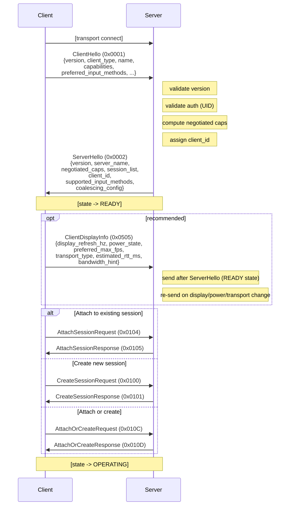
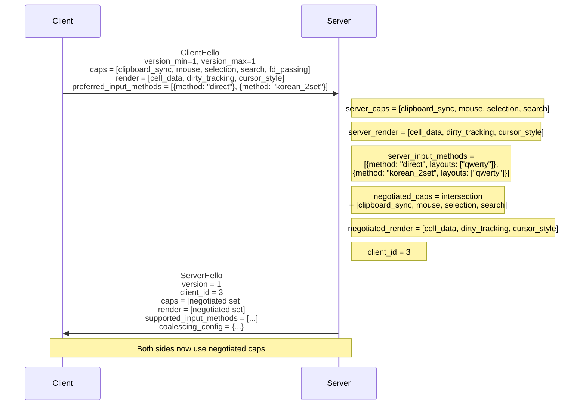

# Handshake and Capability Negotiation

- **Date**: 2026-03-14
- **Scope**: `ClientHello` / `ServerHello` message formats, capability flags,
  negotiation algorithm, attach/detach semantics, ClientDisplayInfo, input
  method negotiation

---

## 1. Overview

The handshake phase occurs immediately after transport-layer connection. All
handshake messages use JSON payloads (ENCODING flag = 0 in the frame header).
The client sends a `ClientHello` message declaring its identity and
capabilities. The server responds with `ServerHello` declaring its capabilities,
the negotiated feature set, and the client's assigned `client_id`. The
connection transitions from `HANDSHAKING` to `READY` on success.

After the handshake, the client SHOULD send a `ClientDisplayInfo` message to
provide display and transport characteristics that inform the server's adaptive
coalescing model.



---

## 2. ClientHello Message (`0x0001`)

### 2.1 JSON Payload Schema

All handshake messages use JSON encoding (ENCODING flag = 0). The ClientHello
payload is a JSON object.

```json
{
  "protocol_version_min": 1,
  "protocol_version_max": 1,
  "client_type": "native",
  "capabilities": [
    "clipboard_sync",
    "mouse",
    "selection",
    "search",
    "fd_passing"
  ],
  "render_capabilities": ["cell_data", "dirty_tracking", "cursor_style"],
  "preferred_input_methods": [
    { "method": "direct" },
    { "method": "korean_2set" }
  ],
  "client_name": "it-shell3-macos",
  "client_version": "1.0.0",
  "terminal_type": "xterm-256color",
  "cols": 80,
  "rows": 24,
  "pixel_width": 0,
  "pixel_height": 0
}
```

| Field                     | Type     | Description                                                          |
| ------------------------- | -------- | -------------------------------------------------------------------- |
| `protocol_version_min`    | u8       | Minimum protocol version the client supports                         |
| `protocol_version_max`    | u8       | Maximum protocol version the client supports                         |
| `client_type`             | string   | Client type (see 2.2)                                                |
| `capabilities`            | string[] | General capability flag names (see Section 4)                        |
| `render_capabilities`     | string[] | Render capability flag names (see Section 5)                         |
| `preferred_input_methods` | object[] | Client's preferred input methods in priority order (see Section 5.3) |
| `client_name`             | string   | Client name (e.g., "it-shell3-macos", "it-shell3-ios")               |
| `client_version`          | string   | Version string (e.g., "1.0.0")                                       |
| `terminal_type`           | string   | Terminal type (e.g., "xterm-256color", "ghostty")                    |
| `cols`                    | u16      | Initial terminal width in columns                                    |
| `rows`                    | u16      | Initial terminal height in rows                                      |
| `pixel_width`             | u16      | Pixel width of the terminal area (0 if unknown)                      |
| `pixel_height`            | u16      | Pixel height of the terminal area (0 if unknown)                     |

**Input method objects**: Each entry in `preferred_input_methods` is an object
with a required `method` field and an optional `layout` field (omitted =
`"qwerty"` default, per the JSON optional field convention). See Section 5.3 for
details.

### 2.2 Client Type Enum

| Value        | Name     | Description                                                     |
| ------------ | -------- | --------------------------------------------------------------- |
| `"native"`   | NATIVE   | it-shell3 native client (macOS or iOS) with Metal GPU rendering |
| `"control"`  | CONTROL  | Control/scripting client (no rendering, command-only)           |
| `"headless"` | HEADLESS | Headless client (testing, CI, automation)                       |

With SSH tunneling, all clients connect via Unix socket regardless of physical
location. The transport distinction (local vs remote) is communicated via
`ClientDisplayInfo.transport_type`, not client type.

### 2.3 Example ClientHello

A macOS native client connecting for the first time:

```json
{
  "protocol_version_min": 1,
  "protocol_version_max": 1,
  "client_type": "native",
  "capabilities": [
    "clipboard_sync",
    "mouse",
    "selection",
    "search",
    "fd_passing"
  ],
  "render_capabilities": [
    "cell_data",
    "dirty_tracking",
    "cursor_style"
  ],
  "preferred_input_methods": [
    { "method": "direct" },
    { "method": "korean_2set" }
  ],
  "client_name": "it-shell3-macos",
  "client_version": "1.0.0",
  "terminal_type": "xterm-256color",
  "cols": 80,
  "rows": 24,
  "pixel_width": 0,
  "pixel_height": 0
}
```

On the wire, this is sent as:

```
[16-byte header: magic=IT, version=1, flags=0x00 (ENCODING=0, JSON), msg_type=0x0001, payload_len=<N>, seq=1]
[N bytes: UTF-8 JSON payload]
```

---

## 3. ServerHello Message (`0x0002`)

### 3.1 JSON Payload Schema

```json
{
  "protocol_version": 1,
  "client_id": 1,
  "negotiated_caps": ["clipboard_sync", "mouse", "selection", "search"],
  "negotiated_render_caps": ["cell_data", "dirty_tracking", "cursor_style"],
  "supported_input_methods": [
    { "method": "direct", "layouts": ["qwerty"] },
    { "method": "korean_2set", "layouts": ["qwerty"] }
  ],
  "server_pid": 6839,
  "server_name": "itshell3d",
  "server_version": "1.0.0",
  "heartbeat_interval_ms": 30000,
  "max_panes_per_session": 0,
  "max_sessions": 0,
  "coalescing_config": {
    "interactive_threshold_kbps": 1,
    "active_interval_ms": 16,
    "bulk_threshold_kbps": 100,
    "bulk_interval_ms": 33,
    "idle_timeout_ms": 500,
    "preedit_fallback_ms": 200
  },
  "sessions": [
    {
      "session_id": 1,
      "name": "main",
      "attached_clients": 0,
      "pane_count": 1,
      "created_at": 1709500000000,
      "last_activity": 1709500100000
    }
  ]
}
```

| Field                     | Type     | Description                                                                                                                                                         |
| ------------------------- | -------- | ------------------------------------------------------------------------------------------------------------------------------------------------------------------- |
| `protocol_version`        | u8       | Negotiated protocol version                                                                                                                                         |
| `client_id`               | u32      | Server-assigned client ID for this connection. Monotonically increasing per daemon lifetime. Used for preedit ownership comparison and multi-client identification. |
| `negotiated_caps`         | string[] | Negotiated general capability flag names                                                                                                                            |
| `negotiated_render_caps`  | string[] | Negotiated render capability flag names                                                                                                                             |
| `supported_input_methods` | object[] | Server's supported input methods with available layouts (see Section 5.3)                                                                                           |
| `server_pid`              | u32      | Server daemon PID (for debugging)                                                                                                                                   |
| `server_name`             | string   | Server name (e.g., "itshell3d")                                                                                                                                     |
| `server_version`          | string   | Version string                                                                                                                                                      |
| `heartbeat_interval_ms`   | u32      | Heartbeat interval in milliseconds (0 = no heartbeat)                                                                                                               |
| `max_panes_per_session`   | u16      | Maximum panes per session (0 = unlimited)                                                                                                                           |
| `max_sessions`            | u16      | Maximum concurrent sessions (0 = unlimited)                                                                                                                         |
| `coalescing_config`       | object   | Server's adaptive coalescing parameters (see 3.3)                                                                                                                   |
| `sessions`                | array    | Array of SessionDescriptor objects (see 3.2)                                                                                                                        |

### 3.2 SessionDescriptor

Each existing session is described by a `SessionDescriptor`. This allows the
client to display available sessions for attachment.

```json
{
  "session_id": 1,
  "name": "main",
  "attached_clients": 0,
  "pane_count": 1,
  "created_at": 1709500000000,
  "last_activity": 1709500100000
}
```

| Field              | Type   | Description                                        |
| ------------------ | ------ | -------------------------------------------------- |
| `session_id`       | u32    | Server-assigned session ID                         |
| `name`             | string | Session name (e.g., "main", "dev")                 |
| `attached_clients` | u8     | Number of clients currently attached               |
| `pane_count`       | u16    | Number of panes in this session                    |
| `created_at`       | u64    | Creation timestamp (milliseconds since Unix epoch) |
| `last_activity`    | u64    | Last activity timestamp                            |

### 3.3 Coalescing Configuration

The `coalescing_config` object in ServerHello informs the client of the server's
adaptive cadence parameters. This is informational — the server controls
coalescing; the client uses these values for UI expectations (e.g., estimating
latency).

| Field                        | Type | Description                                                  |
| ---------------------------- | ---- | ------------------------------------------------------------ |
| `interactive_threshold_kbps` | u32  | PTY throughput threshold for Interactive tier (KB/s)         |
| `active_interval_ms`         | u16  | Frame interval for Active tier (typically 16ms = 60Hz)       |
| `bulk_threshold_kbps`        | u32  | PTY throughput threshold for Bulk tier (KB/s)                |
| `bulk_interval_ms`           | u16  | Frame interval for Bulk tier (typically 33ms = 30Hz)         |
| `idle_timeout_ms`            | u16  | No-output duration before Idle tier (ms)                     |
| `preedit_fallback_ms`        | u16  | Timeout before preedit tier falls back to previous tier (ms) |

### 3.4 Example ServerHello

Server responding with one existing session, assigning client_id 3:

```json
{
  "protocol_version": 1,
  "client_id": 3,
  "negotiated_caps": ["clipboard_sync", "mouse", "selection", "search"],
  "negotiated_render_caps": ["cell_data", "dirty_tracking", "cursor_style"],
  "supported_input_methods": [
    { "method": "direct", "layouts": ["qwerty"] },
    { "method": "korean_2set", "layouts": ["qwerty"] }
  ],
  "server_pid": 6839,
  "server_name": "itshell3d",
  "server_version": "1.0.0",
  "heartbeat_interval_ms": 30000,
  "max_panes_per_session": 0,
  "max_sessions": 0,
  "coalescing_config": {
    "interactive_threshold_kbps": 1,
    "active_interval_ms": 16,
    "bulk_threshold_kbps": 100,
    "bulk_interval_ms": 33,
    "idle_timeout_ms": 500,
    "preedit_fallback_ms": 200
  },
  "sessions": [
    {
      "session_id": 1,
      "name": "main",
      "attached_clients": 0,
      "pane_count": 1,
      "created_at": 1709500000000,
      "last_activity": 1709500100000
    }
  ]
}
```

---

## 4. General Capability Flags

The `capabilities` array in `ClientHello` and `negotiated_caps` array in
`ServerHello` use the following names:

| Name                 | Internal Bit | Description                                                |
| -------------------- | ------------ | ---------------------------------------------------------- |
| `"clipboard_sync"`   | 0            | Supports bidirectional clipboard synchronization           |
| `"mouse"`            | 1            | Supports mouse event forwarding                            |
| `"selection"`        | 2            | Supports text selection synchronization                    |
| `"search"`           | 3            | Supports scrollback search                                 |
| `"fd_passing"`       | 4            | Supports file descriptor passing (Unix socket only)        |
| `"agent_detection"`  | 5            | Supports AI agent input mode detection and profiles        |
| `"flow_control"`     | 6            | Supports pause/resume flow control messages                |
| `"pixel_dimensions"` | 7            | Client provides pixel dimensions for cell size calculation |
| `"sixel"`            | 8            | Supports Sixel graphics passthrough                        |
| `"kitty_graphics"`   | 9            | Supports Kitty graphics protocol passthrough               |
| `"notifications"`    | 10           | Supports OSC notification forwarding                       |

### 4.1 Capability Notes

- `"fd_passing"` is only valid for direct `AF_UNIX` transport (not available
  over SSH tunnels). The server ignores this flag when FD passing is not
  possible.
- `"agent_detection"`: When negotiated, the server sends process-detection
  notifications when an AI agent is detected in a pane's foreground process, and
  the client can activate agent-specific input profiles.

---

## 5. Render Capability Flags

### 5.1 Render Capabilities

| Name                 | Internal Bit | Description                                                                |
| -------------------- | ------------ | -------------------------------------------------------------------------- |
| `"cell_data"`        | 0            | Supports structured binary cell data in FrameUpdate (RenderState protocol) |
| `"dirty_tracking"`   | 1            | Supports partial (delta) FrameUpdate with per-row dirty flags              |
| `"cursor_style"`     | 2            | Supports all cursor styles (block, bar, underline)                         |
| `"true_color"`       | 3            | Supports 24-bit RGB colors in cell data                                    |
| `"256_color"`        | 4            | Supports 256-color palette in cell data                                    |
| `"underline_styles"` | 5            | Supports underline style variants (single, double, curly, dotted, dashed)  |
| `"hyperlinks"`       | 6            | Supports OSC 8 hyperlink passthrough                                       |
| `"vt_fallback"`      | 7            | Supports VT re-serialization as a fallback rendering mode                  |

### 5.2 Render Capability Notes

- `"cell_data"` is the primary rendering mode. All native it-shell3 clients
  support this. When negotiated, the server sends `FrameUpdate` with binary
  CellData (ENCODING=1 in header).
- `"vt_fallback"` is for minimal/debug clients that prefer receiving raw VT
  escape sequences (via `TerminalFormatter`) instead of structured cell data.
  This is never the default.
- `"dirty_tracking"` should be supported by all clients. Without it, the server
  sends full frames on every update (wasteful).

### 5.3 Input Method Negotiation

Input method support uses a two-axis model with two orthogonal per-session
properties:

- `input_method` (string): `"direct"`, `"korean_2set"`, `"korean_3set_390"`,
  `"korean_3set_final"`, future: `"japanese_romaji"`, `"chinese_pinyin"`
- `keyboard_layout` (string): `"qwerty"`, `"dvorak"`, `"colemak"`, `"jis_kana"`
  (v1: only `"qwerty"`)

**ClientHello `preferred_input_methods`:**

```json
{
  "preferred_input_methods": [
    { "method": "direct" },
    { "method": "korean_2set" }
  ]
}
```

Each entry is an object with:

- `method` (string, required): Input method identifier
- `layout` (string, optional): Keyboard layout. Omitted = `"qwerty"` default.
  Singular because the client declares one preferred layout per method.

When Japanese JIS kana is added in the future:
`{"method": "japanese_kana", "layout": "jis"}`.

**ServerHello `supported_input_methods`:**

```json
{
  "supported_input_methods": [
    { "method": "direct", "layouts": ["qwerty"] },
    { "method": "korean_2set", "layouts": ["qwerty"] }
  ]
}
```

Each entry is an object with:

- `method` (string, required): Input method identifier
- `layouts` (string[], required): Supported keyboard layouts for this method.
  Plural because the server advertises all supported options.

**Field naming conventions in handshake objects:**

Within `preferred_input_methods` and `supported_input_methods` arrays, fields
use abbreviated names (`method`, `layout`/`layouts`) rather than the full
protocol names (`input_method`, `keyboard_layout`). The parent key already
provides context — `preferred_input_methods[].input_method` would be redundant.

**Default for new panes:** `input_method: "direct"`,
`keyboard_layout: "qwerty"`. Normative.

---

## 6. ClientDisplayInfo Message (`0x0505`)

### 6.1 Overview

`ClientDisplayInfo` is an early post-handshake message sent by the client to
inform the server of display characteristics and transport conditions that
affect the adaptive coalescing model. This message is sent in the `READY` or
`OPERATING` state and can be re-sent whenever conditions change (e.g., moving
window to a different monitor, plugging/unplugging power, network conditions
changing).

| Property     | Value                               |
| ------------ | ----------------------------------- |
| Message type | `0x0505`                            |
| Direction    | C->S                                |
| Encoding     | JSON (ENCODING=0)                   |
| State        | `READY` or `OPERATING`              |
| Required     | No (recommended for native clients) |

### 6.2 Payload Schema and Semantics

The canonical payload schema for `ClientDisplayInfo` (0x0505) and
`ClientDisplayInfoAck` (0x0506) is defined in **doc 06, Section 1.2**. Doc 06 is
authoritative for the wire-level field definitions, value enums, and server-side
coalescing behavior.

This section describes the handshake-context semantics of the message:

- **When to send**: After receiving `ServerHello`, before or after
  `AttachSessionRequest`. Re-send whenever display, power, or transport
  conditions change at runtime.
- **Transport adaptation**: The `transport_type`, `estimated_rtt_ms`, and
  `bandwidth_hint` fields inform coalescing adjustments for remote clients (doc
  06 Section 1.2).
- **Server response**: The server acknowledges with `ClientDisplayInfoAck`
  reporting the effective fps cap. If the server receives
  `display_refresh_hz = 120` (ProMotion), it adjusts the Active tier interval to
  8ms for that client.

### 6.3 Example: iOS Client on Battery over SSH

```json
{
  "display_refresh_hz": 60,
  "power_state": "battery",
  "preferred_max_fps": 30,
  "transport_type": "ssh_tunnel",
  "estimated_rtt_ms": 45,
  "bandwidth_hint": "wan"
}
```

---

## 7. Negotiation Algorithm

### 7.1 Protocol Version

If no compatible version exists between client and server, the server sends
`Error(ERR_VERSION_MISMATCH)` and disconnects. In v1, both
`protocol_version_min` and `protocol_version_max` are `1`. This field exists for
future version negotiation. The version selection algorithm is defined in daemon
design docs.

### 7.2 General Capabilities

Capabilities are negotiated as the intersection of client and server flag sets.
A capability is active only if both sides support it. Unknown capability names
are ignored (forward compatibility). The intersection algorithm is defined in
daemon design docs.

### 7.3 Render Capabilities

Render capabilities are negotiated as the intersection of client and server
render capability sets. If no common rendering mode exists (neither
`"cell_data"` nor `"vt_fallback"` in the negotiated set), the server sends
`Error(ERR_CAPABILITY_REQUIRED, detail="No common rendering mode")` and
disconnects.

### 7.4 Input Method Negotiation

The server includes `supported_input_methods` in ServerHello. The client's
`preferred_input_methods` from ClientHello are informational — they allow the
server to log or optimize, but do not restrict the client. The client can switch
to any server-supported input method at runtime via `InputMethodSwitch`
(0x0404).

The effective input method set is the intersection of client preferences and
server support. If a client requests an unsupported method via
`InputMethodSwitch`, the server responds with `IMEError` (0x04FF).

### 7.5 Negotiation Summary



---

## 8. Attach/Detach Semantics

### 8.1 Session Attach (`0x0104`)

After handshake completes (state = `READY`), the client attaches to a session.
All attach/detach messages use JSON encoding.

**AttachSessionRequest payload:**

```json
{
  "session_id": 1,
  "cols": 80,
  "rows": 24,
  "readonly": false,
  "detach_others": false
}
```

| Field           | Type | Description                                                              |
| --------------- | ---- | ------------------------------------------------------------------------ |
| `session_id`    | u32  | ID of session to attach to (from SessionDescriptor in ServerHello)       |
| `cols`          | u16  | Client terminal width in columns                                         |
| `rows`          | u16  | Client terminal height in rows                                           |
| `readonly`      | bool | Attach as read-only viewer (see Section 8.7)                             |
| `detach_others` | bool | Detach other clients from this session (exclusive mode, see Section 8.8) |

> **Note**: Pixel dimensions are provided via `WindowResize` (0x0190, doc 03
> Section 5.1), not at attach time.

**Single-session-per-connection rule:** A client connection is attached to at
most one session at a time. Sending `AttachSessionRequest` while already
attached returns `ERR_SESSION_ALREADY_ATTACHED`. To switch sessions, the client
must first detach (`DetachSessionRequest`).

### 8.2 Session Attached Response (`0x0105`)

**AttachSessionResponse payload:**

```json
{
  "status": 0,
  "session_id": 1,
  "name": "main",
  "active_pane_id": 1,
  "active_input_method": "korean_2set",
  "active_keyboard_layout": "qwerty",
  "resize_policy": "latest"
}
```

| Field                    | Type   | Description                                                                               |
| ------------------------ | ------ | ----------------------------------------------------------------------------------------- |
| `status`                 | u32    | 0 = success, 1 = session not found, 2 = access denied, 3 = already attached to a session  |
| `session_id`             | u32    | Session ID                                                                                |
| `name`                   | string | Session name                                                                              |
| `active_pane_id`         | u32    | Currently focused pane ID                                                                 |
| `active_input_method`    | string | Session's current input method (e.g., `"direct"`, `"korean_2set"`)                        |
| `active_keyboard_layout` | string | Session's current keyboard layout (e.g., `"qwerty"`)                                      |
| `resize_policy`          | string | Server's active resize policy: `"latest"` or `"smallest"` (informational, not negotiated) |

**Session-level IME fields**: The `active_input_method` and
`active_keyboard_layout` fields are session-level. Leaf nodes in the subsequent
`LayoutChanged` notification carry the same values for self-containedness.

**`resize_policy`**: Reports the server's active resize policy for the session.
This is informational — the client cannot negotiate or change it. See doc 01
Section 5.6 and doc 03 Section 5 for policy details.

On success, the server follows the response with:

1. A `LayoutChanged` notification containing the full layout tree (with per-pane
   `active_input_method` and `active_keyboard_layout` in leaf nodes — all
   identical, reflecting the session's shared engine).
2. If the session has active preedit on any pane, a `PreeditSync` is sent (via
   the direct message queue, priority 1), arriving BEFORE the I-frame containing
   preedit cells.
3. A full I-frame (`frame_type=1`) for each visible pane from the shared ring
   buffer.
4. A `ClientAttached` notification to all other clients attached to the session.

After receiving `AttachSessionResponse`, the client:

1. Initializes session-level input method state from `active_input_method` and
   `active_keyboard_layout`
2. Processes the `LayoutChanged` to create local pane views
3. If a `PreeditSync` was received, applies preedit composition state before
   rendering
4. Processes the I-frame (`frame_type=1`) to render the initial viewport
5. Transitions to `OPERATING` state

### 8.3 AttachOrCreate (`0x010C`)

`AttachOrCreateRequest` is a convenience message that combines attach and create
semantics, equivalent to tmux's `new-session -A`. See doc 03 for the full
message specification. It is a valid transition from `READY` to `OPERATING`
alongside `AttachSessionRequest` and `CreateSessionRequest`.

Semantics: If a session with the given `session_name` exists → attach. If not →
create. Empty string → attach to most recently active, or create new. See doc 03
Section 1.13 for field definitions.

### 8.4 Session Create (`0x0100`)

If the client wants a new session instead of attaching to an existing one:

**CreateSessionRequest payload:**

```json
{
  "name": "dev",
  "cols": 80,
  "rows": 24,
  "shell": "/bin/zsh",
  "cwd": "/Users/user/projects"
}
```

| Field   | Type   | Description                                             |
| ------- | ------ | ------------------------------------------------------- |
| `name`  | string | Desired session name (empty string for auto-generated)  |
| `cols`  | u16    | Terminal width                                          |
| `rows`  | u16    | Terminal height                                         |
| `shell` | string | Shell command (empty for default `$SHELL` or `/bin/sh`) |
| `cwd`   | string | Working directory (empty for `$HOME`)                   |

> **Note**: Pixel dimensions are provided via `WindowResize` (0x0190, doc 03
> Section 5.1), not at session creation time.

All fields are optional. See doc 03 Section 1.1 for full details.

**CreateSessionResponse (`0x0101`):**

```json
{
  "status": 0,
  "session_id": 2,
  "pane_id": 3
}
```

| Field        | Type | Description                        |
| ------------ | ---- | ---------------------------------- |
| `status`     | u32  | 0 = success, non-zero = error code |
| `session_id` | u32  | Newly assigned session ID          |
| `pane_id`    | u32  | ID of the initial pane             |

This is immediately followed by an I-frame (`frame_type=1`) for the initial
pane.

### 8.5 Session Detach (`0x0106`)

**DetachSessionRequest payload:**

```json
{
  "session_id": 1
}
```

| Field        | Type | Description                                         |
| ------------ | ---- | --------------------------------------------------- |
| `session_id` | u32  | Session to detach from (must be currently attached) |

**DetachSessionResponse (`0x0107`):**

This message serves as both a response to client-initiated detach and a
server-initiated forced detach notification.

```json
{
  "status": 0,
  "reason": "client_requested"
}
```

| Field    | Type   | Description                                   |
| -------- | ------ | --------------------------------------------- |
| `status` | number | 0 = success, 1 = not attached to this session |
| `reason` | string | Detach reason (see table below)               |
| `error`  | string | Error description (present only on error)     |

**Detach reason values** (authoritative definition in doc 03 Section 1.8):

| Reason                             | Trigger                                            | Description               |
| ---------------------------------- | -------------------------------------------------- | ------------------------- |
| `"client_requested"`               | Client sends DetachSessionRequest                  | Normal voluntary detach   |
| `"force_detached_by_other_client"` | Another client attaches with `detach_others: true` | Evicted by another client |
| `"session_destroyed"`              | Session destroyed via DestroySessionRequest        | Session no longer exists  |

After detach:

- Connection state returns to `READY`
- The client can attach to another session or disconnect
- The session continues running in the daemon (sessions survive client detach)

**Forced detach:** The server may send unsolicited `DetachSessionResponse`
messages when another client attaches with `detach_others: true` or when the
session is destroyed. In both cases, the evicted client transitions back to
`READY` state. See doc 03 Section 1.8 for the full detach reason enum.

### 8.6 Multi-Client Attach

Multiple clients can attach to the same session simultaneously. The server
handles this by:

1. **Terminal dimensions**: Determined by the server's resize policy (`latest`
   by default, `smallest` opt-in). Under `latest`, the most recently active
   client's dimensions are used. Under `smallest`, the minimum across all
   eligible (non-stale) clients. See doc 03 Section 5 for the full resize
   algorithm.
2. **Input forwarding**: All non-readonly clients can send input. The server
   processes input in arrival order.
3. **Preedit exclusivity**: Only one client can have active preedit per session.
   The `PreeditEnd` reason enum includes `"replaced_by_other_client"` for
   conflict resolution (see doc 05 Section 5).
4. **Client join/leave/health notifications**: When a client attaches, detaches,
   or transitions health state, other clients attached to the same session
   receive `ClientAttached` (0x0183), `ClientDetached` (0x0184), or
   `ClientHealthChanged` (0x0185) notifications carrying `session_id`,
   `client_id`, `client_name`, and relevant state information.

### 8.7 Readonly Attach

When `AttachSessionRequest.readonly` is `true`, the client attaches as a
read-only viewer:

- The client receives all server-to-client messages including FrameUpdate,
  preedit broadcasts (PreeditStart/Update/End/Sync, InputMethodAck),
  LayoutChanged, and notifications.
- The client MUST NOT send any mutating input or session/pane management
  messages (KeyEvent, TextInput, MouseButton, PasteData, InputMethodSwitch,
  CreatePane, ClosePaneRequest, ResizePane, etc.). Prohibited messages return
  `ERR_ACCESS_DENIED` (0x00000203).
- The client MAY send: queries (ListSessions, LayoutGet, Search), viewport
  operations (Scroll, MouseScroll), connection management (Heartbeat,
  Disconnect, Detach, ClientDisplayInfo, Subscribe).

See doc 03 for the full readonly permissions table.

### 8.8 `detach_others` Behavior

When `AttachSessionRequest.detach_others` is `true`, the server detaches all
other clients currently attached to the session before completing the attach:

1. For each currently attached client, the server sends a forced
   `DetachSessionResponse` with `reason="force_detached_by_other_client"`.
2. Evicted clients transition to `READY` state.
3. The requesting client's attach proceeds normally with exclusive access.

### 8.9 Multi-Client Resize

The server's active resize policy is reported in
`AttachSessionResponse.resize_policy`. Resize is communicated through
`WindowResize` (C→S) and `WindowResizeAck` (S→C) messages (see doc 03 Section 5)
and `LayoutChanged` notifications.

**Viewport clipping**: Under `latest` policy, clients with smaller dimensions
than the effective size MUST clip to their own viewport (top-left origin).

---

## 9. Graceful Fallback Matrix

This matrix shows behavior when capabilities differ between client and server:

### 9.1 Render Capability Fallback

| Client                                    | Server                | Behavior                                                                                |
| ----------------------------------------- | --------------------- | --------------------------------------------------------------------------------------- |
| `"cell_data"` = yes                       | `"cell_data"` = yes   | Structured binary cell data rendering (primary mode). FrameUpdate sent with ENCODING=1. |
| `"cell_data"` = no, `"vt_fallback"` = yes | `"vt_fallback"` = yes | VT re-serialization mode: server sends raw VT escape sequences in JSON payload          |
| Neither rendering mode                    |                       | Handshake fails with `ERR_CAPABILITY_REQUIRED`                                          |

| Client                   | Server                   | Behavior                                                        |
| ------------------------ | ------------------------ | --------------------------------------------------------------- |
| `"dirty_tracking"` = yes | `"dirty_tracking"` = yes | Delta updates: only changed rows sent in FrameUpdate            |
| `"dirty_tracking"` = no  |                          | Full frame on every update. Higher bandwidth, but always works. |

### 9.2 General Capability Fallback

| Capability         | When Not Negotiated                                                                              |
| ------------------ | ------------------------------------------------------------------------------------------------ |
| `"clipboard_sync"` | No clipboard synchronization. Client clipboard is local only.                                    |
| `"mouse"`          | Mouse events not forwarded. Terminal applications that need mouse input will not work correctly. |
| `"selection"`      | No selection sync across clients. Each client manages selection locally.                         |
| `"search"`         | Scrollback search not available. Client can still scroll.                                        |
| `"fd_passing"`     | No file descriptor passing. All data goes through the protocol.                                  |
| `"flow_control"`   | Server drops frames when client is slow instead of pausing. May cause visible frame skipping.    |

---

## 10. Disconnect and Reconnection

### 10.1 Graceful Disconnect (`0x0005`)

**Disconnect payload (JSON):**

```json
{
  "reason": "normal",
  "detail": "Client shutting down"
}
```

| Field    | Type   | Description                                                                                                                                       |
| -------- | ------ | ------------------------------------------------------------------------------------------------------------------------------------------------- |
| `reason` | string | Disconnect reason: `"normal"`, `"error"`, `"timeout"`, `"version_mismatch"`, `"auth_failed"`, `"server_shutdown"`, `"replaced"`, `"stale_client"` |
| `detail` | string | Human-readable detail string                                                                                                                      |

### 10.2 Reconnection

Reconnection uses the normal handshake flow. There is no incremental
reconnection protocol (no "replay from sequence N"). Every reconnection is a
full state resync via I-frame from the shared ring buffer.

The reconnection procedure (connection establishment, handshake, session
reattach, I-frame resync) is defined in daemon design docs.

---

## 11. Security Considerations

### 11.1 Unix Socket Authentication

Unix socket connections are authenticated by kernel-level UID verification. Only
connections from the same UID as the daemon process are accepted. No additional
authentication is needed for Unix socket transport because the OS kernel
guarantees the peer identity.

### 11.2 SSH Tunnel Authentication

For remote access, authentication is handled entirely by SSH. When a client
connects through an SSH tunnel, `getpeereid()` returns sshd's UID. The daemon
accepts this because SSH has already authenticated the user at the transport
layer. The trust chain is: SSH authentication → sshd process → Unix socket →
daemon. See doc 01 Section 12.2 for details.
