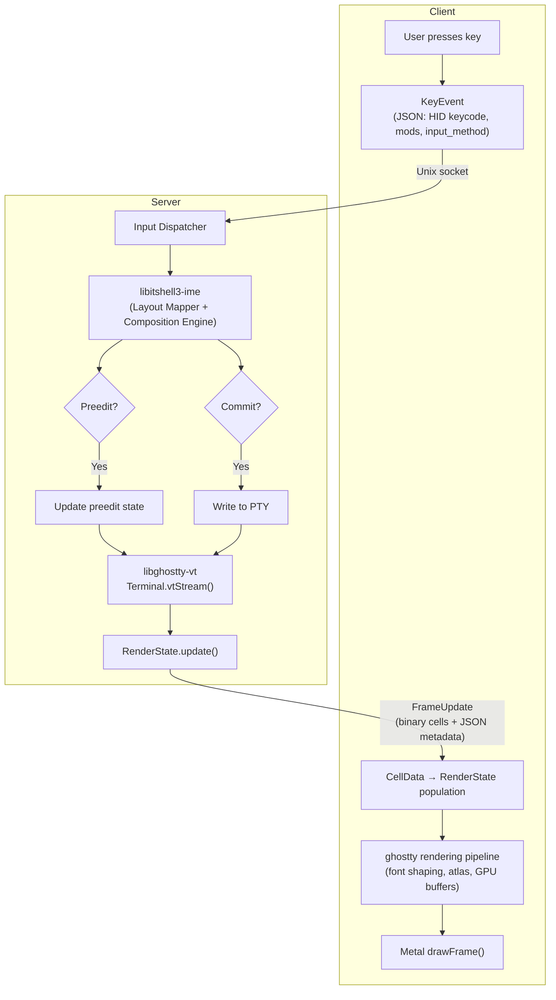

# Input Forwarding and RenderState Protocol

- **Date**: 2026-03-14

---

## 1. Overview

This document specifies the wire protocols for two core data flows:

1. **Input (client -> server)**: Raw key events, text input, mouse events, paste
   data
2. **RenderState (server -> client)**: Structured terminal cell data (including
   preedit cells), cursor, colors, terminal modes

The server IS the terminal emulator. The client is a remote keyboard + GPU
display. The client has no VT parser, no Terminal state machine, no PTY. It
receives structured cell data from the server and renders using libghostty's
font subsystem (SharedGrid, Atlas, HarfBuzz) and Metal GPU shaders.

### 1.1 Message Type Ranges

| Range             | Category             | Direction        |
| ----------------- | -------------------- | ---------------- |
| `0x0200`-`0x02FF` | Input messages       | Client -> Server |
| `0x0300`-`0x03FF` | RenderState messages | Server -> Client |

### 1.2 Common Message Header

All messages share the 16-byte binary header defined in
[Doc 01 §3.1](./01-protocol-overview.md#31-frame-header-16-bytes-fixed).

---

## 2. Input Messages (Client -> Server)

All input messages use **JSON payloads**.

### 2.1 KeyEvent (type = 0x0200)

The primary input message. The client sends raw HID keycodes and modifiers. The
server derives text through the native IME engine (libitshell3-ime) — the client
never sends composed text for key input. The client does not track IME
composition state; the server determines composition state internally from the
IME engine.

#### JSON Payload

```json
{
  "keycode": 11,
  "action": 0,
  "modifiers": 0,
  "input_method": "korean_2set",
  "pane_id": 1
}
```

| Field          | Type   | Description                                                         |
| -------------- | ------ | ------------------------------------------------------------------- |
| `keycode`      | u16    | HID usage code, e.g., `0x04` = 'A'                                  |
| `action`       | u8     | 0=press, 1=release, 2=repeat                                        |
| `modifiers`    | u8     | Bitflags (see below)                                                |
| `input_method` | string | Active input method identifier (see below)                          |
| `pane_id`      | u32    | Target pane (optional; omit or 0 = route to session's focused pane) |

#### Modifier Bitflags (u8)

```
Bit  Modifier
---  --------
 0   Shift
 1   Ctrl
 2   Alt (Option on macOS)
 3   Super (Cmd on macOS)
 4   Caps Lock
 5   Num Lock
 6   (reserved)
 7   (reserved)
```

#### Wire-to-IME KeyEvent Mapping

The server decomposes the wire `modifiers` bitmask into the IME contract's
separated fields:

| Wire modifier bits           | IME KeyEvent field     | Notes                                                                                          |
| ---------------------------- | ---------------------- | ---------------------------------------------------------------------------------------------- |
| Bit 0 (Shift)                | `shift: bool`          | Separated because Shift participates in jamo selection (e.g., ㄱ vs ㄲ), not composition flush |
| Bits 1-3 (Ctrl, Alt, Super)  | `modifiers: Modifiers` | These trigger composition flush in the IME engine                                              |
| Bits 4-5 (CapsLock, NumLock) | Dropped                | Intentionally not consumed by IME — see IME contract Section 3.1                               |
| Bits 6-7                     | Reserved               | Must be 0                                                                                      |

See IME Interface Contract Section 3.1 for the rationale behind separating Shift
from other modifiers.

#### HID Keycodes

The `keycode` field uses USB HID Usage Table codes (same address space as
`UIKeyboardHIDUsage` on iOS and macOS `kHIDUsage_Keyboard*` constants). Common
values:

| HID Code      | Key                      | Notes                           |
| ------------- | ------------------------ | ------------------------------- |
| `0x04`-`0x1D` | A-Z                      |                                 |
| `0x1E`-`0x27` | 1-0                      |                                 |
| `0x28`        | Enter/Return             |                                 |
| `0x29`        | Escape                   |                                 |
| `0x2A`        | Backspace                | Critical for Jamo decomposition |
| `0x2B`        | Tab                      |                                 |
| `0x2C`        | Space                    |                                 |
| `0x4F`-`0x52` | Arrow Right/Left/Down/Up |                                 |
| `0xE0`-`0xE7` | Modifier keys themselves | LCtrl, LShift, LAlt, LSuper, R* |

#### Input Method Identifiers

The `input_method` field identifies which input method the client has active, so
the server's IME engine can apply the correct keycode-to-character mapping.
Input methods use string identifiers throughout the protocol (no numeric IDs):

| Identifier            | Description                            | v1 Support |
| --------------------- | -------------------------------------- | ---------- |
| `"direct"`            | Direct passthrough (US QWERTY English) | Yes        |
| `"korean_2set"`       | Korean 2-set (Dubeolsik)               | Yes        |
| `"korean_3set_390"`   | Korean 3-set (390 layout)              | Planned    |
| `"korean_3set_final"` | Korean 3-set (Final layout)            | Planned    |
| `"japanese_romaji"`   | Japanese Romaji input                  | Future     |
| `"japanese_kana"`     | Japanese Kana input                    | Future     |
| `"chinese_pinyin"`    | Chinese Pinyin input                   | Future     |

String identifiers are self-documenting on the wire, require no mapping table,
no reserved numeric ranges, and adding new input methods is just a new string
value with zero schema migration. The overhead of ~13 bytes per KeyEvent is
irrelevant at typing speeds (~15/s) over a >1 GB/s Unix socket.

The `input_method` string is the **canonical identifier** for input methods. It
flows unchanged from client to server to IME engine constructor. Inside the
engine, it is decomposed into engine-specific types (e.g., libhangul keyboard
IDs). No code outside the engine constructor performs this decomposition. The
canonical registry of valid `input_method` strings is defined in the IME
Interface Contract, Section 3.7.

Input methods are negotiated during handshake: the server advertises
`supported_input_methods` in ServerHello, the client selects from them in
ClientHello's `preferred_input_methods` (see doc 02).

The `keyboard_layout` axis (e.g., `"qwerty"`, `"dvorak"`) is a separate,
orthogonal per-session property and is NOT encoded in the `input_method` string.
It is established at handshake and omitted from KeyEvent. In v1, only `"qwerty"`
is supported.

#### Example: Typing Korean "한"

```
1. User presses 'H' key (HID 0x0B), input_method=korean_2set
   KeyEvent: {"keycode": 11, "action": 0, "modifiers": 0, "input_method": "korean_2set"}
   Server IME: maps H -> ㅎ, enters composing state, emits preedit "ㅎ"

2. User presses 'A' key (HID 0x04)
   KeyEvent: {"keycode": 4, "action": 0, "modifiers": 0, "input_method": "korean_2set"}
   Server IME: maps A -> ㅏ, composes ㅎ+ㅏ=하, emits preedit "하"

3. User presses 'N' key (HID 0x11)
   KeyEvent: {"keycode": 17, "action": 0, "modifiers": 0, "input_method": "korean_2set"}
   Server IME: maps N -> ㄴ, composes 하+ㄴ=한, emits preedit "한"

4. User presses Space (HID 0x2C), commits
   KeyEvent: {"keycode": 44, "action": 0, "modifiers": 0, "input_method": "korean_2set"}
   Server IME: commits "한" to PTY, clears preedit
```

Note: The client sends identical KeyEvent messages regardless of whether
composition is active. The server's IME engine tracks composition state
internally.

### 2.2 TextInput (type = 0x0201)

For direct text insertion that bypasses IME processing. Primary use case:
programmatic text injection (e.g., from clipboard managers, automation tools).

#### JSON Payload

```json
{
  "pane_id": 1,
  "text": "Hello, world!"
}
```

| Field     | Type   | Description                          |
| --------- | ------ | ------------------------------------ |
| `pane_id` | u32    | Target pane                          |
| `text`    | string | UTF-8 encoded text (max 65535 bytes) |

For text larger than 65535 bytes, use PasteData (0x0205).

### 2.3 MouseButton (type = 0x0202)

#### JSON Payload

```json
{
  "pane_id": 1,
  "button": 0,
  "action": 0,
  "modifiers": 0,
  "click_count": 1,
  "x": 5.0,
  "y": 10.0
}
```

| Field         | Type | Description                          |
| ------------- | ---- | ------------------------------------ |
| `pane_id`     | u32  | Target pane                          |
| `button`      | u8   | 0=left, 1=middle, 2=right, 3-7=extra |
| `action`      | u8   | 0=press, 1=release                   |
| `modifiers`   | u8   | Same bitflags as KeyEvent            |
| `click_count` | u8   | 1=single, 2=double, 3=triple         |
| `x`           | f32  | Column position in cell coords       |
| `y`           | f32  | Row position in cell coords          |

Sub-cell precision is provided via f32 for `x` and `y` to support fractional
cell positioning (useful for future sixel/image region click detection).

> **Normative — Preedit interaction**: If preedit is active when a MouseButton
> event arrives, the server MUST commit preedit before processing the mouse
> event. The server sends `PreeditEnd` with `reason="committed"` and the
> committed text is written to the PTY, then forwards the mouse event. See doc
> 05 Section 6 for the normative rules on mouse event interaction with active
> preedit.

### 2.4 MouseMove (type = 0x0203)

Sent when the mouse moves and mouse tracking is active (the server notifies the
client whether mouse tracking is enabled via a flag in FrameUpdate).

#### JSON Payload

```json
{
  "pane_id": 1,
  "modifiers": 0,
  "buttons_held": 1,
  "x": 5.5,
  "y": 10.2
}
```

| Field          | Type | Description                             |
| -------------- | ---- | --------------------------------------- |
| `pane_id`      | u32  | Target pane                             |
| `modifiers`    | u8   | Active modifiers                        |
| `buttons_held` | u8   | Bitflags: bit 0=left, 1=middle, 2=right |
| `x`            | f32  | Column position                         |
| `y`            | f32  | Row position                            |

**Rate limiting**: The client SHOULD throttle MouseMove messages to at most
60/second per pane. The server MAY drop excess MouseMove messages.

### 2.5 MouseScroll (type = 0x0204)

#### JSON Payload

```json
{
  "pane_id": 1,
  "modifiers": 0,
  "dx": 0.0,
  "dy": -3.0,
  "precise": false
}
```

| Field       | Type | Description                                                   |
| ----------- | ---- | ------------------------------------------------------------- |
| `pane_id`   | u32  | Target pane                                                   |
| `modifiers` | u8   | Active modifiers                                              |
| `dx`        | f32  | Horizontal scroll delta                                       |
| `dy`        | f32  | Vertical scroll delta                                         |
| `precise`   | bool | false=line-based (mouse wheel), true=pixel-precise (trackpad) |

### 2.6 PasteData (type = 0x0205)

For clipboard paste operations. Supports large payloads via chunking.

#### JSON Payload

```json
{
  "pane_id": 1,
  "bracketed_paste": true,
  "first_chunk": true,
  "final_chunk": true,
  "data": "pasted text here"
}
```

| Field             | Type   | Description                     |
| ----------------- | ------ | ------------------------------- |
| `pane_id`         | u32    | Target pane                     |
| `bracketed_paste` | bool   | Wrap in `\e[200~` / `\e[201~`   |
| `first_chunk`     | bool   | This is the first chunk         |
| `final_chunk`     | bool   | This is the last chunk          |
| `data`            | string | UTF-8 paste data for this chunk |

**Chunking protocol**:

- Small pastes (<=64 KB): Single message with first_chunk=true AND
  final_chunk=true
- Large pastes: Multiple messages. First has first_chunk=true. Last has
  final_chunk=true.
- The server assembles chunks in sequence order before writing to PTY.
- The server applies bracketed paste wrapping around the assembled text if
  `bracketed_paste=true` and the terminal has bracketed paste mode enabled.

### 2.7 FocusEvent (type = 0x0206)

Notifies the server when the client terminal gains or loses OS-level focus. This
enables focus reporting (CSI ? 1004 h).

#### JSON Payload

```json
{
  "pane_id": 1,
  "focused": true
}
```

| Field     | Type | Description                         |
| --------- | ---- | ----------------------------------- |
| `pane_id` | u32  | Target pane                         |
| `focused` | bool | true=gained focus, false=lost focus |

### 2.8 Readonly Client Input Restrictions

Clients attached with the `readonly` flag (see doc 02 for the flag, doc 03
Section 9 for the authoritative permissions table) are restricted in which input
messages they may send. The server MUST reject prohibited messages with
ERR_ACCESS_DENIED (error code 0x00000203).

**Readonly clients MAY send (non-mutating)**:

| Message                | Rationale                                          |
| ---------------------- | -------------------------------------------------- |
| MouseScroll (0x0204)   | Viewport navigation, does not alter terminal state |
| FocusEvent (0x0206)    | Advisory, does not alter terminal state            |
| ScrollRequest (0x0301) | Viewport navigation                                |
| SearchRequest (0x0303) | Read-only query                                    |
| SearchCancel (0x0305)  | Cancels own search                                 |

**Readonly clients MUST NOT send (mutating)**:

| Message                    | Rationale                            |
| -------------------------- | ------------------------------------ |
| KeyEvent (0x0200)          | Generates terminal input             |
| TextInput (0x0201)         | Injects text into PTY                |
| MouseButton (0x0202)       | Can trigger terminal mouse reporting |
| MouseMove (0x0203)         | Can trigger terminal mouse tracking  |
| PasteData (0x0205)         | Writes to PTY                        |
| InputMethodSwitch (0x0404) | Mutates session IME state            |

> **Authoritative source**: Doc 03 Section 9 defines the complete readonly
> permissions table across all message types. The tables above are an
> input-specific summary for convenience; if they conflict with doc 03 Section
> 9, doc 03 is authoritative.

---

## 3. Input Channel Architecture

### 3.1 Multiplexed vs. Dedicated Channel

**Decision: Multiplexed with priority.**

All input messages share the same Unix domain socket connection as other
protocol messages. However, input messages receive processing priority on the
server side.

**Rationale**:

- A separate input channel adds connection management complexity (two sockets
  per client)
- Unix domain sockets have sufficient bandwidth (>1 GB/s) — congestion is not a
  realistic concern
- The server's event loop processes input messages with higher priority than
  control/management messages
- Key-to-screen latency target: <1ms on Unix socket (verified in Doc 13's
  analysis)

**Server processing priority order**:

1. KeyEvent, TextInput (highest — affects what the user sees immediately)
2. MouseButton, MouseScroll (user interaction)
3. MouseMove (bulk, can be coalesced)
4. PasteData (bulk transfer)
5. FocusEvent (advisory)

### 3.2 Input Flow Summary



---

## 4. RenderState Messages (Server -> Client)

### 4.1 FrameUpdate (type = 0x0300)

The primary rendering message. Carries the full or partial terminal viewport
state.

A FrameUpdate uses **hybrid encoding**: a binary section (frame header,
DirtyRows, CellData) for the performance-critical cell data path, followed by an
optional JSON metadata blob for cursor, colors, dimensions, mouse state, and
terminal modes.

> **Normative — CellData is SEMANTIC**: CellData carries semantic content
> (codepoint, style attributes, colors, wide-char flag) for populating a
> RenderState on the client. The client populates RenderState from wire CellData
> and delegates all rendering to ghostty's existing rendering pipeline (font
> shaping, atlas management, GPU buffer construction, draw). The client does NOT
> individually perform font shaping, glyph atlas lookup, or GPU buffer
> construction — these are internal to the rendering pipeline.

> **Informative — Reference implementation**: In ghostty, this pipeline
> corresponds to `importFlatCells()` (RenderState population from wire data)
> followed by `rebuildCells()` (font shaping and GPU buffer construction) and
> `drawFrame()` (Metal GPU rendering). See PoC 08 for validation.

> **Normative note — FrameUpdate delivery scope**: The server sends FrameUpdate
> messages for ALL panes in the client's attached session that have dirty state,
> not just the focused pane. Each FrameUpdate carries a `pane_id` identifying
> which pane's state it contains. The client receives and renders updates for
> all visible panes.

> **Normative note — Per-pane dirty tracking (I/P-frame model)**: The server
> maintains a single dirty bitmap per pane. Frame data (I-frames and P-frames)
> is serialized once per pane per frame interval and written to the shared
> per-pane ring buffer. All clients viewing the same pane receive identical
> frame data from the ring buffer. Clients at different coalescing tiers receive
> different subsets of frames from the same sequence, but each frame's content
> is identical regardless of which client receives it.

> **Normative note — I/P-frame cumulative semantics**: P-frames (`frame_type=0`)
> carry cumulative dirty rows since the most recent I-frame. Any P-frame is
> independently decodable given only the current I-frame. There is no sequential
> dependency chain between P-frames. A client needs only the latest I-frame plus
> the latest P-frame — it MAY skip any number of intermediate P-frames freely.
> This enables clients at different coalescing tiers to skip different subsets
> of P-frames without per-client diff computation.

> **Normative note — I-frame self-containment**: I-frames (`frame_type=1`) MUST
> always carry full CellData for ALL rows of the pane. A client that receives an
> I-frame has a complete, self-contained terminal state. I-frames MUST never
> reference a previous frame in place of data. The self-containment property is
> the defining characteristic of a keyframe. Wide characters are always complete
> in I-frames — both the `wide=1` cell and its `spacer_tail` are always present,
> no dangling references.

> **Normative note — Implicit I-frame reference**: A P-frame (`frame_type=0`)
> always references the most recent I-frame (`frame_type=1`) that the client has
> received. The client MUST track the `frame_sequence` of the most recently
> received I-frame as local state. All subsequent P-frames are applied against
> this I-frame's state. When the client receives a new I-frame, it replaces its
> reference and discards the previous I-frame state.

> **Normative — Minimum rendering dimensions**: The server MUST NOT send
> FrameUpdate with `cols < 2` or `rows < 1`. When a pane's dimensions fall below
> these minimums (e.g., during resize animation or aggressive pane splitting),
> the server MUST suppress FrameUpdate for that pane until dimensions return to
> valid range. Dimension-based suppression takes precedence over the I-frame
> keyframe interval — no FrameUpdate is sent for undersized panes. Pane liveness
> is maintained through the session/pane management protocol (doc 03) — the
> client knows the pane exists from CreatePane and is notified of termination
> through session/pane lifecycle messages (doc 03). The server SHOULD also
> suppress FrameUpdate when dimensions fall below its renderer's practical
> minimum.

> **Normative — PTY independence**: When the server suppresses FrameUpdate due
> to undersized pane dimensions, only the FrameUpdate rendering pipeline is
> suppressed. PTY behavior during suppression is defined in daemon design docs.

#### Wire Format Overview

A FrameUpdate is a variable-length message composed of a binary section followed
by an optional JSON metadata blob.

```
[16-byte binary header] [binary frame header] [binary DirtyRows + CellData] [JSON metadata blob]
```

##### Binary Frame Header

```
Offset  Size  Field                Description
------  ----  -----                -----------
 0      16    [header]             type=0x0300, payload_len=variable
16       4    session_id           Session identifier (u32 LE)
20       4    pane_id              Pane identifier (u32 LE)
24       8    frame_sequence       Monotonic frame counter (u64 LE)
32       1    frame_type           Frame type (see below)
33       1    screen               0=primary, 1=alternate
34       2    section_flags        Bitflags indicating which sections follow (u16 LE)
```

**`frame_type` values**:

| Value | Name             | Description                                                                                                                                |
| ----- | ---------------- | ------------------------------------------------------------------------------------------------------------------------------------------ |
| 0     | P-frame, partial | DirtyRows section present when dirty rows exist (section_flags bit 4). JSON metadata only when no rows changed (cursor move, mode change). |
| 1     | I-frame          | All rows present. Self-contained keyframe. `num_dirty_rows` MUST equal the pane's total row count.                                         |

> **Normative note — `frame_sequence` scope**: `frame_sequence` is a per-pane
> monotonic counter incremented each time the server writes a frame to the ring
> buffer. All frames increment `frame_sequence`. Clients may observe gaps due to
> coalescing or flow control. The counter is NOT per-client — all clients see
> values from the same monotonic sequence but may see different subsets.

**Section Flags (u16)**:

```
Bit  Section             When present
---  -------             ------------
 0   (reserved)          Formerly Dimensions (now in JSON metadata)
 1   (reserved)          Formerly Colors (now in JSON metadata)
 2   (reserved)          Formerly Cursor (now in JSON metadata)
 3   (reserved)          Formerly Preedit (preedit is now cell data in I/P-frames)
 4   DirtyRows           When frame_type=0 (P-frame with dirty rows) or frame_type=1 (I-frame)
 5   (reserved)          Formerly MouseState (now in JSON metadata)
 6   (reserved)          Formerly TerminalModes (now in JSON metadata)
 7   JSONMetadata        When JSON metadata blob is present (see Section 4.2)
 8-15 (reserved)
```

### 4.2 JSON Metadata Blob (section_flags bit 7)

When bit 7 of `section_flags` is set, a JSON metadata blob follows the binary
DirtyRows/CellData section (or immediately after the binary frame header if no
DirtyRows are present).

The JSON metadata blob is length-prefixed:

```
Offset  Size  Field               Description
------  ----  -----               -----------
 0       4    json_len             Length of JSON blob in bytes (u32 LE)
 4       N    json_data            UTF-8 JSON object
```

The JSON blob contains whichever metadata sections are relevant for this frame.
Fields are either REQUIRED (must be present in I-frames) or optional (included
only when changed). Absent optional fields are omitted, never `null` (per Issue
3):

```json
{
  "cursor": {
    "x": 5,
    "y": 10,
    "visible": true,
    "style": 0,
    "blinking": true
  },
  "dimensions": {
    "cols": 80,
    "rows": 24
  },
  "colors": {
    "fg": [255, 255, 255],
    "bg": [0, 0, 0],
    "cursor_color": [255, 200, 0],
    "palette": [[0, 0, 0], [205, 49, 49], "...(256 entries)..."],
    "palette_changes": [[1, [255, 0, 0]], [4, [0, 0, 255]]]
  },
  "mouse": {
    "tracking": 0,
    "format": 0
  },
  "terminal_modes": {
    "bracketed_paste": true,
    "focus_reporting": true,
    "application_cursor_keys": false,
    "application_keypad": false,
    "kitty_keyboard_flags": 0
  }
}
```

> **Normative — Client dimension validation**: The client SHOULD validate `cols`
> and `rows` from the FrameUpdate dimensions field before processing cell data.
> If dimensions are below the client's rendering minimum, the client SHOULD
> display a placeholder (e.g., solid background using the session's
> `default_background`) instead of attempting to render cells.

#### Cursor fields

| Field            | Type | Description                 |
| ---------------- | ---- | --------------------------- |
| `x`              | u16  | Column                      |
| `y`              | u16  | Row                         |
| `visible`        | bool | Cursor visible              |
| `style`          | u8   | 0=block, 1=bar, 2=underline |
| `blinking`       | bool | Whether cursor blinks       |
| `password_input` | bool | Password mode detected      |

**Cursor blink (normative)**: When `cursor.blinking` is true, the client runs a
local blink timer. The server does NOT send FrameUpdates for blink animation.
The blink cadence (typically 500ms on/500ms off) is a client-local rendering
concern. This avoids unnecessary frame traffic for a purely visual effect.

**Note — No preedit section in JSON metadata**: Preedit rendering is through
cell data in I/P-frames. The server injects preedit cells into frame cell data
when serializing FrameUpdate. The client renders cells — it has no concept of
"preedit" at the rendering layer. See doc 05 for the dedicated preedit lifecycle
messages (0x0400-0x0405).

**Capability interaction**: The `"preedit"` capability controls only the
dedicated preedit messages (PreeditStart/Update/End/Sync in the 0x0400 range,
see doc 05), which provide composition lifecycle metadata for multi-client
coordination, observer UIs, and conflict resolution. Preedit rendering is always
available through cell data in I/P-frames regardless of capability negotiation —
any client that can render cells automatically renders preedit content. A client
that only needs to render can ignore all 0x04xx messages.

#### Dimensions fields

| Field  | Type | Description              |
| ------ | ---- | ------------------------ |
| `cols` | u16  | Viewport width in cells  |
| `rows` | u16  | Viewport height in cells |

Present on I-frames or terminal resize.

#### Colors fields

| Field             | Type                    | Description                                                                    |
| ----------------- | ----------------------- | ------------------------------------------------------------------------------ |
| `fg`              | [r, g, b]               | Default foreground RGB (REQUIRED in I-frames)                                  |
| `bg`              | [r, g, b]               | Default background RGB (REQUIRED in I-frames)                                  |
| `cursor_color`    | [r, g, b]               | Cursor RGB (omit when no cursor color override)                                |
| `palette`         | [[r,g,b], ...]          | Full 256-entry palette (REQUIRED in I-frames; omit in P-frames when unchanged) |
| `palette_changes` | [[index, [r,g,b]], ...] | Partial palette updates in P-frames (omit when none)                           |

> **Normative — Colors are rendering-critical**: The `colors` section is not
> informational metadata. The client's renderer uses `bg` as the
> `default_background` for padding extension decisions (`neverExtendBg()`) and
> as the fallback for cells with `PackedColor tag=0x00`. Palette entries are
> required to resolve cells with `PackedColor tag=0x01`. I-frames
> (`frame_type=1`) MUST include `fg`, `bg`, and the full `palette` (256 entries,
> 768 bytes). This ensures the I-frame is self-contained — a client that
> receives only this I-frame can render correctly.

**I-frames**: `fg`, `bg`, and `palette` are REQUIRED. `cursor_color` is included
when a cursor color override is active. **P-frames**: Use `palette_changes` for
delta updates; if no palette entries have changed, `palette_changes` is omitted.
Colors are also present on P-frames when any color changes (e.g., OSC 10/11/12
sequences).

#### Mouse fields

| Field      | Type | Description                            |
| ---------- | ---- | -------------------------------------- |
| `tracking` | u8   | 0=off, 1=button, 2=any (motion), 3=sgr |
| `format`   | u8   | 0=normal, 1=sgr, 2=urxvt               |

When `tracking` is 0, the client handles mouse events locally (selection,
scrollback). When non-zero, the client forwards mouse events to the server.

#### Terminal modes fields

| Field                     | Type | Description                                 |
| ------------------------- | ---- | ------------------------------------------- |
| `bracketed_paste`         | bool | Bracketed paste mode enabled                |
| `focus_reporting`         | bool | Focus reporting enabled                     |
| `application_cursor_keys` | bool | Application cursor key mode                 |
| `application_keypad`      | bool | Application keypad mode                     |
| `kitty_keyboard_flags`    | u8   | Kitty keyboard protocol flags (4-bit value) |

### 4.3 DirtyRows Section (section_flags bit 4)

Contains the actual cell data for rows that changed. This section uses **binary
encoding** for compact, RLE-compatible transport.

```
Offset  Size  Field               Description
------  ----  -----               -----------
 0       2    num_dirty_rows       Count of dirty rows (u16 LE)
```

Followed by `num_dirty_rows` entries of `RowData`:

```
Offset  Size  Field               Description
------  ----  -----               -----------
 0       2    y                    Row index (u16 LE)
 2       1    row_flags            Row metadata bitflags (see below)
 3       2    selection_start      Start column of selection (u16 LE; meaningful when row_flags bit 0 is set)
 5       2    selection_end        End column of selection (u16 LE; meaningful when row_flags bit 0 is set)
 7       2    num_cells            Number of cell entries (u16 LE)
```

#### row_flags (u8)

```
Bit     Field               Description
---     -----               -----------
 0      has_selection        Row has an active selection range (existing, unchanged)
 1      rle_encoded          Row uses run-length encoding (existing, unchanged; see Section 5)
 2-3    semantic_prompt      Prompt type (0=none, 1=prompt, 2=prompt_continuation, 3=reserved)
 4      hyperlink            Row contains at least one hyperlinked cell
 5-7    reserved             Must be 0 (bit 5 anticipated for wrap in a future revision)
```

> **Normative — `semantic_prompt` is rendering-critical**: The client's renderer
> uses `semantic_prompt` to determine background extension behavior. Prompt
> lines (`semantic_prompt=1`) and prompt continuation lines
> (`semantic_prompt=2`) prevent background color extension into padding (the
> `neverExtendBg()` rendering path). Without this field, Powerline-style prompts
> bleed background color into the terminal padding area — a visible rendering
> artifact.

> **Normative — `hyperlink` is a rendering optimization**: When `hyperlink=0`,
> the client's renderer MAY skip overlay rendering (e.g., hyperlink underline
> hover effects) for this row entirely. This avoids scanning every cell of every
> row for hyperlink state. The server MUST set `hyperlink=1` whenever any cell
> in the row carries hyperlink metadata.

> **Informative — `wrap` deferred**: Bit 5 is reserved for a future `wrap` field
> (row continues from the previous row). Research confirms `wrap` is NOT used by
> the renderer's cell-building or GPU pipeline — it is only used for text
> serialization (copy/paste). Copy/paste is not a v1 protocol requirement. When
> copy/paste is designed, `wrap` can be defined without a protocol version bump.

Followed by `num_cells` entries of `CellData` (16 bytes each, fixed-size), then
per-row side tables (GraphemeTable and UnderlineColorTable). See Section 4.4 for
CellData encoding and Section 4.5 for the per-row side tables.

**Note**: `num_cells` may be less than `cols` when trailing cells are
default/empty. The client fills remaining cells with the default background.

**I-frame row count rule**: For I-frames (`frame_type=1`), `num_dirty_rows` MUST
equal the pane's total row count. All rows are present.

**P-frame cumulative row semantics**: For P-frames (`frame_type=0`), the dirty
rows represent ALL rows that changed since the most recent I-frame, not just
rows changed since the previous P-frame. A client that skipped intermediate
P-frames can apply any P-frame directly against the I-frame's row data.

### 4.4 CellData Encoding

Each cell in a dirty row is encoded as a fixed 16-byte struct:

```
Offset  Size  Field               Description
------  ----  -----               -----------
 0       4    codepoint            Primary codepoint (u32 LE, lower 21 bits meaningful)
                                   0 = empty cell
 4       1    wide                 0=narrow, 1=wide, 2=spacer_tail, 3=spacer_head
 5       2    flags                Style flags (u16 LE, see below)
 7       1    content_tag          Content tag (u8, bits 0-1 used, bits 2-7 reserved)
 8       4    fg_color             PackedColor (4 bytes)
12       4    bg_color             PackedColor (4 bytes)
```

**Fixed 16-byte size**: Every cell is exactly 16 bytes (power-of-2 aligned). No
variable-length fields. O(1) random access via `buffer[col * 16]`. Enables
SIMD-friendly processing and direct indexing for dirty-row extraction.

**Wide character**: The wide cell (wide=1) carries the codepoint. The
spacer_tail (wide=2) immediately follows and has codepoint=0.

**Wide character atomicity in I/P-frame model**: Row-level dirty tracking
guarantees that wide characters are always sent atomically — both the `wide=1`
cell and its `spacer_tail` are in the same row and always sent together. A wide
character never spans the boundary between "dirty" and "not dirty" within a
frame, because dirty tracking operates at row granularity.

#### content_tag (u8)

Bits 0-1 define the cell's content type (matching ghostty's `ContentTag` enum):

| Value | Name               | Description                                               |
| ----- | ------------------ | --------------------------------------------------------- |
| 0     | codepoint          | Single codepoint, no grapheme data                        |
| 1     | codepoint_grapheme | Base codepoint in cell, extra codepoints in GraphemeTable |
| 2     | bg_color_palette   | Cell carries background palette color                     |
| 3     | bg_color_rgb       | Cell carries background RGB color                         |

Bits 2-7 are reserved and MUST be 0.

When `content_tag=1`, the receiver MUST look up the cell's column index in the
row's GraphemeTable (Section 4.5) to obtain extra codepoints.

#### PackedColor (4 bytes)

```
Byte 0: tag
  0x00 = default (use terminal's default fg or bg)
  0x01 = palette index (byte 1 = index 0-255, bytes 2-3 unused)
  0x02 = direct RGB (byte 1 = R, byte 2 = G, byte 3 = B)

Bytes 1-3: data (interpretation depends on tag)
```

#### Style Flags (u16)

```
Bit   Flag
---   ----
 0    bold
 1    italic
 2    faint (dim)
 3    blink
 4    inverse (reverse video)
 5    invisible (hidden)
 6    strikethrough
 7    overline
 8-10 underline_style: 0=none, 1=single, 2=double, 3=curly, 4=dotted, 5=dashed
11    (reserved)
12-15 (reserved)
```

### 4.5 Per-Row Side Tables

After each row's CellData array, two side tables follow. Both are present for
every row (empty tables use a 2-byte zero count header).

```
RowData body layout:
  RowHeader (Section 4.3)
  CellData[num_cells]           (16 bytes each, fixed)
  GraphemeTable                 (variable, per-row)
  UnderlineColorTable           (variable, per-row)
```

#### GraphemeTable

For cells with `content_tag=1` (codepoint_grapheme), extra codepoints are stored
here:

```
Offset  Size         Field               Description
------  ----         -----               -----------
 0       2           num_entries          Number of grapheme entries (u16 LE; 0 for most rows)
 For each entry:
   0     2           col_index            Column within the row (u16 LE)
   2     1           extra_count          Number of extra codepoints (u8)
   3     4*N         extra_codepoints     Extra codepoints (u32 LE each)
```

Grapheme clusters are rare in terminal output (~1.1% of cells in typical
workloads). The receiver processes the cell array first, then patches grapheme
cells using this table.

#### UnderlineColorTable

For cells with a non-default underline color (SGR 58), the underline color is
stored here:

```
Offset  Size         Field               Description
------  ----         -----               -----------
 0       2           num_entries          Number of entries (u16 LE; 0 for most rows)
 For each entry:
   0     2           col_index            Column within the row (u16 LE)
   2     4           underline_color      PackedColor (4 bytes)
```

Cells with colored underlines are rare. The receiver processes the cell array
first, then applies underline colors from this table.

> **Informative — Per-row overhead**: Empty side tables add 4 bytes per row (two
> u16 zero-count headers). For a 24-row frame: 96 bytes. This is negligible
> compared to ~30 KB of cell data.

---

## 5. RenderState: Run-Length Encoding Optimization

For rows with many consecutive cells sharing the same style (common for blank
lines, monochrome text), an optional RLE encoding reduces bandwidth.

### 5.1 RLE Cell Encoding

When a row uses RLE (indicated by `rle_encoded` in `row_flags`, see Section
4.3), cells are encoded as runs:

```
Offset  Size  Field               Description
------  ----  -----               -----------
 0       2    run_length           Number of consecutive cells with this style (u16 LE)
 2      16    cell_data            CellData for the prototype cell (16 bytes, fixed)
```

Each RLE run is 18 bytes (2-byte run_length + 16-byte CellData). The client
replicates the cell `run_length` times, advancing the column index. For RLE
rows, `num_cells` in the RowData header represents the number of _runs_, not
individual cells. Side tables (GraphemeTable, UnderlineColorTable) follow the
RLE cell array, same as for non-RLE rows.

**Heuristic**: The server uses RLE when it reduces the row size by at least 25%.
Otherwise, it sends individual cells.

### 5.2 Row Header Extension for RLE

Bit 1 of `row_flags` (see Section 4.3) indicates RLE encoding:

```
row_flags bit 1: rle_encoded (0=individual cells, 1=run-length encoded)
```

---

## 6. Scrollback Messages

The client does not hold scrollback data. All scrollback access is
request/response through the server. All scrollback and search messages use
**JSON payloads** (ENCODING=0).

### 6.1 ScrollRequest (type = 0x0301)

Client -> server. Requests scrolling the viewport.

#### JSON Payload

```json
{
  "pane_id": 1,
  "direction": 0,
  "lines": 10
}
```

| Field       | Type | Description                                                  |
| ----------- | ---- | ------------------------------------------------------------ |
| `pane_id`   | u32  | Target pane                                                  |
| `direction` | u8   | 0=up, 1=down, 2=top, 3=bottom                                |
| `lines`     | u32  | Number of lines to scroll (ignored for direction=top/bottom) |

**Server response**: A FrameUpdate with `frame_type=1` (I-frame) showing the
scrolled viewport. Scroll-response I-frames are written to the shared ring
buffer like any other I-frame. When one client scrolls, all attached clients
receive the scrolled viewport. This is consistent with the globally singleton
session model.

### 6.2 ScrollPosition (type = 0x0302)

Server -> all clients notification of current scroll position (sent with or
after FrameUpdate).

#### JSON Payload

```json
{
  "pane_id": 1,
  "viewport_top": 0,
  "total_lines": 5000,
  "viewport_rows": 24
}
```

| Field           | Type | Description                          |
| --------------- | ---- | ------------------------------------ |
| `pane_id`       | u32  | Target pane                          |
| `viewport_top`  | u32  | Top line of viewport (0=most recent) |
| `total_lines`   | u32  | Total lines in scrollback            |
| `viewport_rows` | u32  | Number of visible rows               |

This allows the client to render a scrollbar indicator.

### 6.3 SearchRequest (type = 0x0303)

Client -> server. Initiates a search in the scrollback buffer.

#### JSON Payload

```json
{
  "pane_id": 1,
  "direction": 0,
  "case_sensitive": false,
  "regex": false,
  "wrap_around": true,
  "query": "search term"
}
```

| Field            | Type   | Description                      |
| ---------------- | ------ | -------------------------------- |
| `pane_id`        | u32    | Target pane                      |
| `direction`      | u8     | 0=forward, 1=backward            |
| `case_sensitive` | bool   | Case-sensitive search            |
| `regex`          | bool   | Treat query as regex             |
| `wrap_around`    | bool   | Wrap around at buffer boundaries |
| `query`          | string | UTF-8 search string              |

### 6.4 SearchResult (type = 0x0304)

Server -> client. Reports the result of a search.

#### JSON Payload

```json
{
  "pane_id": 1,
  "total_matches": 42,
  "current_match": 7,
  "match_row": 10,
  "match_start_col": 5,
  "match_end_col": 15
}
```

| Field             | Type | Description                      |
| ----------------- | ---- | -------------------------------- |
| `pane_id`         | u32  | Target pane                      |
| `total_matches`   | u32  | Total match count (0=none found) |
| `current_match`   | u32  | Index of highlighted match       |
| `match_row`       | u16  | Row of current match in viewport |
| `match_start_col` | u16  | Start column of match            |
| `match_end_col`   | u16  | End column of match              |

The server also sends a FrameUpdate scrolling the viewport to show the match and
highlighting the matched range in the selection.

### 6.5 SearchCancel (type = 0x0305)

Client -> server. Cancels an active search.

#### JSON Payload

```json
{
  "pane_id": 1
}
```

| Field     | Type | Description |
| --------- | ---- | ----------- |
| `pane_id` | u32  | Target pane |

---

## 7. FrameUpdate Frame Types

The `frame_type` field in FrameUpdate controls what sections are present and how
the client processes the frame:

### 7.1 frame_type=0 (P-frame, partial)

Partial update. When dirty rows exist, DirtyRows section is present
(section_flags bit 4 set) with cumulative dirty rows since the most recent
I-frame. When no rows changed (e.g., cursor position moved without grid
changes), section_flags bit 4 is unset and the frame carries JSON metadata only.

**Note**: Cursor blink does NOT trigger FrameUpdates. When `cursor.blinking` is
true, the client runs a local blink timer autonomously.

**Client processing**: When DirtyRows is present, the client applies the dirty
rows against the state from the most recently received I-frame. If the client
skipped intermediate P-frames (due to coalescing), this P-frame still contains
all the data needed — no catch-up required.

**Required sections**: JSON metadata blob with changed fields. DirtyRows
(binary) when grid rows changed. **Typical size (metadata-only, no dirty
rows)**: 16 (header) + 20 (frame header) + 4 (json_len) + ~60 (JSON) = **~100
bytes**. **Typical size for 2 changed rows (80 cols)**:

```
Header:           16 bytes
Frame header:     20 bytes
DirtyRows header:  2 bytes
Row 0 header:      9 bytes
Row 0 cells:    80 * 16 = 1,280 bytes
Row 0 side tables: 4 bytes (empty GraphemeTable + UnderlineColorTable)
Row 1 header:      9 bytes
Row 1 cells:    80 * 16 = 1,280 bytes
Row 1 side tables: 4 bytes
JSON metadata:   ~80 bytes (cursor)
---------------------------------
Total:          ~2,704 bytes
```

With RLE (mostly empty rows): **~300-600 bytes**.

### 7.2 frame_type=1 (I-frame)

Self-contained keyframe. Everything is present. Sent periodically (default:
every 1 second), on resize, screen switch (primary/alternate), initial attach,
scroll-to-position, and recovery (advance cursor to latest I-frame).

**Client processing**: The client replaces its entire terminal state from this
frame. The client records this frame's `frame_sequence` as the current I-frame
reference.

**Required sections**: DirtyRows (all rows, binary), JSON metadata blob
(dimensions, colors — including `fg`, `bg`, and full `palette` (256 entries, 768
bytes) — cursor, terminal modes, mouse state). See Section 4.2 "Colors are
rendering-critical" normative note for rationale. **Typical size for 80x24
terminal**:

```
Header:           16 bytes
Frame header:     20 bytes
DirtyRows header:  2 bytes
24 rows * ~1,293 bytes per row = ~31,032 bytes
  (per row: 9 header + 80*16 cells + 4 side tables = 1,293)
JSON metadata:  ~1,700 bytes (all sections incl. 768B palette)
---------------------------------
Total:          ~32,770 bytes (worst case, all unique styles)
```

With typical styling (most cells default): **~6,000-10,000 bytes**. With RLE:
**~2,500-4,000 bytes**.

---

## 8. Bandwidth Analysis

### 8.1 Scenario Estimates

| Scenario                                | Message Size | Frequency                  | Bandwidth     | Notes                                    |
| --------------------------------------- | ------------ | -------------------------- | ------------- | ---------------------------------------- |
| Cursor-only move                        | ~100 B       | Event-driven               | ~2.6 KB/s     |                                          |
| Preedit update (Korean composition)     | ~120 B       | Per keystroke (~5/s)       | ~0.6 KB/s     | Preedit cells in P-frame via ring buffer |
| Single row change (keystroke echo)      | ~1.4 KB      | Per keystroke (~5/s)       | ~7.0 KB/s     | 16B/cell (was 20B)                       |
| Partial update (2 rows, command output) | ~2.7 KB      | ~30/s                      | ~81 KB/s      | 16B/cell + 4B side tables/row            |
| I-frame (80x24, typical)                | ~6-10 KB     | 1/s default                | ~6-10 KB/s    | Periodic keyframe                        |
| I-frame (80x24, worst case)             | ~33 KB       | 1/s default                | ~33 KB/s      | 16B/cell (was ~40 KB at 20B/cell)        |
| I-frame (120x40, CJK worst case)        | ~82 KB       | 1/s default                | ~82 KB/s      | 16B/cell (was ~116 KB at 20B/cell)       |
| Scrolling (24 rows dirty)               | ~6-10 KB     | ~30/s during active scroll | ~180-300 KB/s |                                          |
| Heavy output (e.g., `cat large_file`)   | ~6-10 KB     | Coalesced ceiling ~60/s    | ~360-600 KB/s | Coalesced ceiling, not sustained target  |

### 8.2 Bandwidth Budget

- **Unix domain socket**: >1 GB/s throughput, <0.1ms latency
- **LAN (iOS -> macOS)**: ~100 MB/s, 1-5ms latency
- **WAN (SSH tunnel)**: 1-10 MB/s, 20-100ms latency

**Conclusion**: All scenarios are well within bandwidth limits, even over WAN
via SSH tunnel. The periodic I-frame adds ~82 KB/s per pane (CJK worst case),
which is negligible on local connections and acceptable on SSH. The 16-byte
CellData (down from 20 bytes) reduces I-frame sizes by ~20%. The bottleneck over
WAN is latency, not bandwidth.

### 8.3 Event-Driven Coalescing

FrameUpdates are sent only when dirty state exists. There is no fixed fps
target. See doc 01 Section 10 for the wire-observable delivery model. Coalescing
tier definitions, timing values, and adaptation rules are defined in daemon
design docs.

**I-frame scheduling**: I-frames (keyframes) are produced periodically (default:
every 1 second, configurable 0.5-5 seconds via server configuration). When the
I-frame timer fires and the pane has no changes since the last I-frame, no frame
is written to the ring buffer — the most recent I-frame already in the ring
provides correct state for any seeking client. When the timer fires and changes
exist, the server sends `frame_type=1` (I-frame) containing all rows. The
I-frame timer is independent of the coalescing tiers — it fires at a fixed
interval regardless of PTY throughput.

### 8.4 Measured Wire Overhead (PoC Baseline)

The following measurements were collected from PoC 06-08 on Apple Silicon
(ReleaseFast build, 1000 iterations after warmup). All measurements use the
16-byte FlatCell format (see Section 4.4).

| Metric                              | 80x24         | 300x80        | Notes                                                   |
| ----------------------------------- | ------------- | ------------- | ------------------------------------------------------- |
| Server export (`bulkExport()`)      | 22 us         | 217 us        | RenderState -> FlatCell[] serialization                 |
| Client import (`importFlatCells()`) | 12 us         | 96 us         | FlatCell[] -> RenderState population                    |
| **Total wire overhead**             | **34 us**     | **313 us**    | 0.2% / 1.9% of 16.6 ms frame budget (60fps)             |
| Per-cell import cost                | ~4 ns         | ~4 ns         | Consistent across terminal sizes                        |
| Round-trip fidelity                 | bit-identical | bit-identical | export -> import -> re-export produces identical output |

> **Informative — Performance positioning**: Wire serialization/deserialization
> is NOT the rendering bottleneck. Font shaping and GPU rendering are the
> dominant costs in the frame pipeline. The measured wire overhead (0.2% of
> frame budget for a standard 80x24 terminal) validates the design decision to
> transmit semantic CellData rather than GPU-ready data.

**Known gap**: Grapheme cluster cells were not tested in the PoC. Performance
for frames with grapheme side table data is unmeasured but expected to be
negligible (the grapheme table typically contains a handful of entries per
frame).

---

## 9. Compression

### 9.1 Reserved for Future Use

The COMPRESSED flag (bit 1 of the header flags byte) is reserved for future use.
In protocol version 1, compression is not implemented. Senders MUST NOT set the
COMPRESSED flag. Receivers that encounter COMPRESSED=1 SHOULD send
`ERR_PROTOCOL_ERROR`.

Application-layer compression is deferred to v2. For remote access via SSH
tunnel, SSH's built-in compression (`Compression yes`) provides transport-layer
compression without protocol complexity. Neither tmux nor zellij implements
application-layer compression.

If benchmarking in v2 shows benefit beyond SSH compression, application-layer
compression will be added with explicit exclusion of Preedit and Interactive
tier messages to preserve latency guarantees.

---

## 10. Message Type Summary

### 10.1 Input Messages (Client -> Server): 0x0200-0x02FF

All input messages use JSON payloads (16-byte binary header + JSON body).

| Type     | Name        | Description                                       |
| -------- | ----------- | ------------------------------------------------- |
| `0x0200` | KeyEvent    | Raw HID keycode + modifiers + input_method (JSON) |
| `0x0201` | TextInput   | Direct UTF-8 text insertion (JSON)                |
| `0x0202` | MouseButton | Mouse button press/release (JSON)                 |
| `0x0203` | MouseMove   | Mouse motion, rate limited (JSON)                 |
| `0x0204` | MouseScroll | Scroll wheel / trackpad (JSON)                    |
| `0x0205` | PasteData   | Clipboard paste, chunked (JSON)                   |
| `0x0206` | FocusEvent  | Window focus gained/lost (JSON)                   |

### 10.2 RenderState Messages (Server -> Client): 0x0300-0x03FF

| Type     | Name           | Encoding               | Description                                            |
| -------- | -------------- | ---------------------- | ------------------------------------------------------ |
| `0x0300` | FrameUpdate    | Hybrid (binary + JSON) | Terminal viewport state (binary cells + JSON metadata) |
| `0x0301` | ScrollRequest  | JSON                   | Client requests scroll (client -> server)              |
| `0x0302` | ScrollPosition | JSON                   | Current scroll position                                |
| `0x0303` | SearchRequest  | JSON                   | Search in scrollback (client -> server)                |
| `0x0304` | SearchResult   | JSON                   | Search match result                                    |
| `0x0305` | SearchCancel   | JSON                   | Cancel active search (client -> server)                |

**Note**: ScrollRequest, SearchRequest, and SearchCancel are client -> server
messages that use the 0x0300 range because they are conceptually part of the
render state subsystem (they trigger FrameUpdate responses). All messages except
FrameUpdate use JSON payloads (ENCODING=0).

---

## 11. Open Questions

1. **~~Cell deduplication~~** **Closed (v0.7)**: Unnecessary. The I/P-frame
   model already reduces bandwidth via dirty-row-only P-frames. 16 bytes/cell
   (v0.9, down from 20 bytes in v0.7) is acceptable. Owner decision.

2. **~~Image protocol~~** **Closed (v0.7)**: Moved to `99-post-v1-features.md`
   Section 1. Out of scope for v0.x through v1. Owner decision.

3. **~~Selection protocol~~** **Closed (v0.7)**: Unnecessary. Selection is
   per-pane shared state delivered via RowData
   `row_flags`/`selection_start`/`selection_end` in FrameUpdate. No dedicated
   messages needed. Owner decision.

4. **~~Hyperlink data~~** **Closed (v1.0-r12)**: Hyperlink encoding (per-cell
   association and URI delivery) deferred to post-v1. The `row_flags.hyperlink`
   bit provides row-level presence detection for rendering optimization. The
   intended design direction is a per-row HyperlinkTable side table (matching
   GraphemeTable/UnderlineColorTable pattern) with a per-frame hyperlink URI
   table in the JSON metadata blob. CellData remains 16 bytes. See
   `99-post-v1-features.md` Section 6.

5. **~~FrameUpdate acknowledgment~~** **Closed (v0.7)**: Unnecessary. Ring
   buffer with cursor stagnation detection provides implicit flow control.
   PausePane escalation handles slow clients. SSH TCP flow control covers WAN
   backpressure. Owner decision.

6. **~~Notification coalescing~~** **Closed (v0.7)**: Unnecessary. Per-pane
   individual FrameUpdate messages are the current design and align with the
   per-pane ring buffer model. `writev()` makes multiple small writes nearly
   zero overhead. Owner decision.

---

## Appendix A: Example FrameUpdate Hex Dump

A partial update (P-frame): cursor moved to (5, 10), one row changed with 5
cells.

```
Offset  Hex                                       Description
------  ---                                       -----------
        -- 16-byte message header --
0000    49 54                                     magic "IT"
0002    01                                        version 1
0003    01                                        flags (ENCODING=1 binary, no compression)
0004    00 03                                     type 0x0300 (FrameUpdate)
0006    00 00                                     reserved
0008    XX XX XX XX                               payload_len (varies)
000C    XX XX XX XX                               sequence

        -- Binary frame header (20 bytes) --
0010    01 00 00 00                               session_id = 1
0014    01 00 00 00                               pane_id = 1
0018    2A 00 00 00 00 00 00 00                   frame_sequence = 42
0020    00                                        frame_type = 0 (P-frame, partial)
0021    00                                        screen = primary
0022    90 00                                     section_flags = 0x0090 (DirtyRows + JSONMetadata)

        -- DirtyRows Section (binary) --
0024    01 00                                     num_dirty_rows = 1

        -- Row 0 header --
0026    0A 00                                     y = 10
0028    00                                        row_flags = 0x00 (no selection, no RLE,
                                                    semantic_prompt=none, no hyperlink)
0029    04 00                                     selection_start (no selection active)
002B    04 00                                     selection_end (no selection active)
002D    05 00                                     num_cells = 5

        -- Cell 0: 'H' (16 bytes) --
002F    48 00 00 00                               codepoint = 0x48 ('H')
0033    00                                        wide = narrow
0034    01 00                                     flags = bold
0036    00                                        content_tag = 0 (codepoint)
0037    00 00 00 00                               fg = default
003B    00 00 00 00                               bg = default

        -- Cell 1: 'e' (16 bytes) --
003F    65 00 00 00                               codepoint = 0x65 ('e')
0043    00                                        wide = narrow
0044    01 00                                     flags = bold
0046    00                                        content_tag = 0 (codepoint)
0047    00 00 00 00                               fg = default
004B    00 00 00 00                               bg = default

        ... (cells 2-4 follow same pattern) ...

        -- GraphemeTable (empty) --
007F    00 00                                     num_entries = 0

        -- UnderlineColorTable (empty) --
0081    00 00                                     num_entries = 0

        -- JSON Metadata Blob --
0083    YY YY YY YY                               json_len = N
0087    7B 22 63 75 72 73 6F 72 ...               {"cursor":{"x":5,"y":10,"visible":true,
                                                    "style":0,"blinking":true}}
```

**Total row body**: 5 cells * 16 bytes + 2 bytes (GraphemeTable) + 2 bytes
(UnderlineColorTable) = 84 bytes.

## Appendix B: CellData Size Analysis

| Cell type                      | Cell size                             | Side table cost              | Frequency                               |
| ------------------------------ | ------------------------------------- | ---------------------------- | --------------------------------------- |
| Simple ASCII (no style)        | 16 B                                  | 0 B                          | ~70% of cells                           |
| Simple ASCII (styled)          | 16 B                                  | 0 B                          | ~20% of cells                           |
| Wide CJK character             | 16 B                                  | 0 B                          | ~5% (the spacer_tail adds another 16 B) |
| Grapheme cluster (emoji + ZWJ) | 16 B                                  | 2 + 4*N B (in GraphemeTable) | ~1.1%                                   |
| Underline-colored cell         | 16 B                                  | 6 B (in UnderlineColorTable) | <0.1%                                   |
| Empty (trailing)               | 16 B, or omitted with short num_cells | 0 B                          | ~varies                                 |

**Effective cell size**: 16 bytes/cell for >98% of terminal content. Grapheme
clusters and underline colors are in per-row side tables (Section 4.5), adding
cost only when present. Per-row overhead for empty side tables: 4 bytes (two u16
zero-count headers).

**Comparison with v0.8**: The v0.8 spec used a 20-byte variable-length CellData
format with inline `extra_count`/`extra_codepoints` and per-cell
`underline_color`. The 16-byte fixed format reduces bandwidth by 20% (30.7 KB vs
38.4 KB for a full 80x24 I-frame) while enabling O(1) random access. The side
table approach moves rare data (~1.1% graphemes, <0.1% underline colors) out of
the hot path.

## Appendix C: Hybrid Encoding Rationale

The hybrid encoding (binary CellData + JSON metadata) was chosen based on
analysis of ghostty and iTerm2 reference implementations (see review-notes-02):

| Component                          | Encoding     | Rationale                                                     |
| ---------------------------------- | ------------ | ------------------------------------------------------------- |
| Message header                     | Binary (16B) | O(1) dispatch, unambiguous framing                            |
| DirtyRows + CellData               | Binary       | 70-95% of payload, 3x smaller than JSON, RLE-compatible       |
| Cursor, Colors, Dimensions, Modes  | JSON blob    | Debuggable; human-readable field names not hex bytes          |
| Input messages (key, mouse, focus) | JSON         | Low frequency, schema evolution, cross-language `JSONDecoder` |
| Handshake/negotiation              | JSON         | Self-describing, version discovery                            |

**What killed uniform binary**: GPU structs are 70%+ client-local data (font
shaping, atlas coords). Zero-copy wire-to-GPU is impossible. JSON at 480 KB/s
worst case is <0.01% CPU. The debuggability/maintainability benefit of JSON for
non-cell-data sections outweighs the marginal bandwidth difference.

**What justifies binary CellData**: ~31 KB binary vs 120 KB+ JSON per full 80x24
frame. Fixed 16-byte cells enable O(1) random access and efficient RLE.
Deterministic sizing enables client pre-allocation. Avoids JSON tokenization of
2000+ cells on mobile/iPad.
