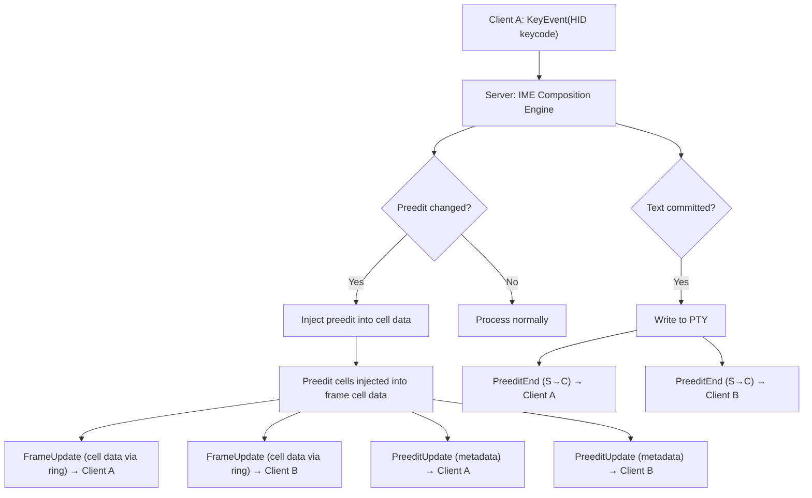
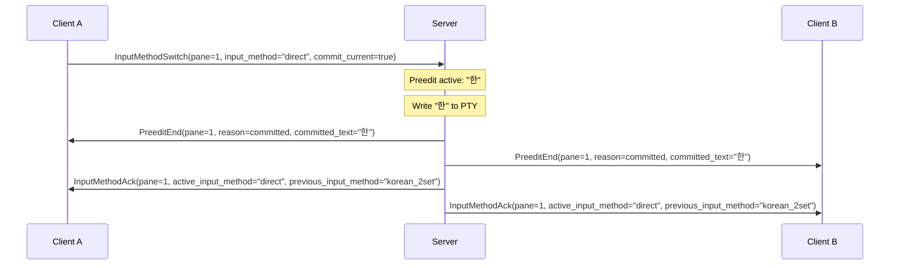

# CJK Preedit Sync and IME Protocol

- **Date**: 2026-03-14

**Changes from v0.11** (design-resolutions `01-protocol-v012.md`, 5/5
unanimous):

- **Resolution 1: Mouse + preedit interaction**: Added normative rules in
  Section 6 for mouse event interaction with active preedit. MouseButton
  (0x0202) commits preedit before forwarding. MouseScroll (0x0204) does not
  commit.
- **Resolution 7: Remove `ghostty_surface_preedit()` references**: Replaced all
  server-side API name references with wire-observable, implementation-neutral
  language. The wire-observable fact (preedit appears as cell data in
  I/P-frames) is preserved.
- **Resolution 8: Section numbering gap fix**: Renumbered Sections 4-15 to 3-14,
  closing the gap left by Section 3 deletion in v0.7.
- **Resolution 9: Subsection numbering**: Added subsection numbers to Section 1
  (1.1 Architecture Context, 1.2 Message Type Range).

**Changes from v0.7** (preedit overhaul — design-resolutions
`01-preedit-overhaul.md`, 7/7 unanimous):

- **Core principle: Preedit is cell data, not metadata.** The server injects
  preedit cells into frame cell data. Clients render cells without knowing what
  is preedit. This eliminates the dual-channel design, FrameUpdate preedit JSON
  section, ring buffer bypass, and preedit-specific cursor/width fields. _(v0.7
  originally described this as `ghostty_surface_preedit()` on a ghostty Surface;
  v1.0-r12 replaced with implementation-neutral language per daemon headless API
  design.)_
- **Resolution 1: Remove `composition_state`** from PreeditUpdate (Section 2.2)
  and PreeditSync (Section 2.4). No component consumes this value.
- **Resolution 2: Remove FrameUpdate preedit JSON section** references from
  Sections 1, 6.4, 7.3, 7.5, 10.2, 13.
- **Resolution 3: Remove dual-channel design.** Section 1 rewritten to
  single-path model. Section 14 rewritten — PreeditUpdate is lifecycle/metadata
  only.
- **Resolution 4: Remove cursor/width fields** (`cursor_x`, `cursor_y`,
  `display_width`) from PreeditStart (Section 2.1), PreeditUpdate (Section 2.2),
  and PreeditSync (Section 2.4).
- **Resolution 5: Remove Section 3** (Korean Composition State Machine) entirely
  — libhangul is the ground truth; the protocol should not maintain a parallel
  state machine.
- **Resolution 6: Remove Section 10.1 cursor style normative rules** — preedit
  cell decoration is ghostty-internal.
- **Resolution 7: Remove ring buffer bypass** — Section 8.2 Rule 2 removed,
  Section 8.4 removed entirely. All frames go through the ring buffer.
  Coalescing Tier 0 (immediate flush) preserves the latency guarantee.
- **Resolution 8: frame_type renumbering** — references updated from 4 values
  {0,1,2,3} to 3 values {0,1,2}. _(Further reduced to 2 values {0,1} in v1.0-r12
  — frame_type=2 removed.)_
- **Resolution 9: PreeditUpdate resulting shape** — lifecycle/metadata only
  (`pane_id`, `preedit_session_id`, `text`).
- **Resolution 10: PreeditStart resulting shape** — removed `cursor_x`,
  `cursor_y`.
- **Resolution 11: PreeditSync resulting shape** — removed `cursor_x`,
  `cursor_y`, `composition_state`, `display_width`.
- **Resolution 12: PanePreeditState struct update** — removed `state`,
  `cursor_x`, `cursor_y` (Section 6.2).
- **Resolution 13: Session snapshot format update** — removed
  `composition_state`, `cursor_x`, `cursor_y` (Section 9.1).
- **Resolution 15: Q1 closed** — Japanese/Chinese composition states question
  removed (Section 15), moot with `composition_state` removed.

**Changes from v0.6**:

- **Per-session engine architecture** (IME v0.6 cross-team request, 3-0
  unanimous):
  - **Change 4: InputMethodSwitch per_pane removal**: Removed `per_pane` field
    from InputMethodSwitch (0x0404). Input method switch always applies to the
    entire session. Server derives session from `pane_id`.
  - **Change 5: InputMethodAck session-wide scope**: Added normative note to
    InputMethodAck (0x0405) — clients MUST update input method state for ALL
    panes in the session.
  - **Change 6: Preedit exclusivity invariant**: Added normative rule in Section
    1 — at most one pane in a session can have active preedit at any time.
  - **Change 7: Per-Session Input Method State**: Renamed Section 4.3 from
    "Per-Pane" to "Per-Session". Updated all references from per-pane to
    per-session ownership. Added `keyboard_layout` per-session scope note.
  - **Change 8: Per-session lock scope**: Updated Section 4.1
    `commit_current=false` server behavior — "per-pane lock" → "per-session
    lock".
  - **Change 9: Session restore per-session**: Updated Section 9.1 snapshot
    format and Section 9.2 restore behavior to per-session model.
  - **Change 10: Resolve Q5 (simultaneous compositions)**: Resolved Open
    Question #5 — per-session engine makes simultaneous compositions within a
    session physically impossible. Preedit exclusivity invariant is the
    normative statement.
  - **Change 11: keyboard_layout per-session**: Updated Section 4.3 to note
    `keyboard_layout` is a per-session property.
- **Consistency review** (cross-document consistency, Issues 10, 01):
  - **Issue 10: PreeditEnd `"client_evicted"` reason**: Added `"client_evicted"`
    to PreeditEnd reason values in Section 2.3, for stale client eviction at
    T=300s per design-resolutions-resize-health.md Addendum B.
- **I/P-frame model integration** (design-resolutions
  `01-i-p-frame-ring-buffer.md`):
  - **`dirty=full` → I-frame**: Updated Sections 7.3 and 7.4 to use the new
    `frame_type` field name and I-frame terminology. (Note: I-frame was
    `frame_type=2` in v0.7; renumbered to `frame_type=1` in v0.8 per
    Resolution 8. frame_type=2 removed entirely in v1.0-r12.)

**Changes from v0.5** (IME v0.5 cross-doc, 3-0 unanimous):

- **IME Issue 2.5b: Remove `"empty"` composition state**: Replaced with `null`
  (field omitted from JSON) throughout.
- **IME Issue 2.1: Naming convention cross-reference**: Added note referencing
  IME Interface Contract Section 3.7 for the normative naming convention (ISO
  639-1 prefix).

**Changes from v0.5** (consistency review):

- **Issue 8: Terminology standardization**: Replaced `dirty_row_count` with
  `num_dirty_rows` throughout (doc 04 is authoritative for wire format naming).
- **Issue 12/13: Readonly cross-references**: Updated Section 1 readonly
  observation note to reference doc 03 Section 9 as authoritative for
  permissions.
- **Issue 20: Coalescing terminology**: Replaced "4-Tier" heading with "Adaptive
  Cadence Model" and clarified that the model has 4 active coalescing tiers plus
  the Idle quiescent state.

**Changes from v0.4** (cross-review: Protocol v0.4 x IME Interface Contract
v0.3):

- **Issue 9: Escape PreeditEnd reason**: Fixed Escape from `"cancelled"` to
  `"committed"` and clarified `"cancelled"` definition in Section 2.3.
- **Issue 8: commit_current SHOULD recommendation**: Added SHOULD recommendation
  for `commit_current=true` and server implementation note for
  `commit_current=false` in Section 4.1.
- **Input method identifier unification** (identifier consensus): Removed
  language identifier mapping table from Section 4.3. Replaced with normative
  rule: the canonical `input_method` string flows unchanged to the IME engine
  constructor. Canonical registry now lives in IME Interface Contract, Section
  3.7.

**Changes from v0.3**:

- **Issue 6: String-based input method identifiers**: Renamed `active_layout_id`
  to `active_input_method` (string) in PreeditStart, PreeditSync, and
  InputMethodAck. Updated InputMethodSwitch to use string `input_method` +
  `keyboard_layout` instead of numeric `layout_id`. Removed all numeric layout
  ID references.
- **CO-1: Client MUST NOT override cursor style**: Added normative requirement
  that clients MUST NOT override cursor style based on local preedit state —
  render whatever the server sends in FrameUpdate.
- **Issue 9/Gap 3: Focus change during composition**: New Section 7.7 covering
  focus change race condition with PreeditEnd `reason="focus_changed"`. New
  Section 7.8 covering session detach during composition. New Section 7.9
  covering InputMethodSwitch during active preedit with
  `reason="input_method_changed"`.
- **Issue 9: New PreeditEnd reason values**: Added `"focus_changed"` and
  `"input_method_changed"` to reason enum.
- **Issue 9: InputMethodAck broadcast**: InputMethodAck is now broadcast to ALL
  attached clients, not just the requesting client.
- **Issue 9: Readonly client preedit observation**: Added normative note that
  readonly clients receive all preedit broadcasts as observers.
- **Issue 3: JSON optional field convention**: Updated JSON examples to omit
  absent fields rather than using `null`.

---

## 1. Overview

This document specifies the protocol messages for CJK Input Method Editor (IME)
composition state synchronization. The design addresses:

1. **Preedit lifecycle management**: Start, update, end of composition sessions
2. **Multi-client sync**: Broadcasting preedit state to all attached clients
3. **Korean Hangul composition**: The most complex case — Jamo decomposition on
   backspace
4. **Input method switching**: Per-session input method state
5. **Race condition handling**: Pane close during composition, client
   disconnect, concurrent preedit, focus change during composition
6. **Session persistence**: Serializing/restoring preedit state across daemon
   restart

### 1.1 Architecture Context

The server owns the native IME engine (libitshell3-ime). The client sends ONLY
raw HID keycodes via KeyEvent (doc 04, Section 2.1). The client NEVER sends
preedit state or composition information — the server determines all composition
state internally from the IME engine.

**Preedit is cell data, not metadata.** The server injects preedit cells into
frame cell data when serializing FrameUpdate. The client renders cells — it has
no concept of preedit. All preedit rendering goes through one path: cell data in
I/P-frames via the ring buffer.



**Single-path rendering model**: Preedit rendering is through cell data in
I/P-frames. The dedicated preedit messages (0x0400-0x04FF) are
lifecycle/metadata only — used for multi-client coordination, composition
tracking, and debugging. Not used for rendering. A client that only needs to
render can ignore all 0x04xx messages.

**Capability interaction**: The `"preedit"` capability controls only the
dedicated PreeditStart/Update/End/Sync messages. Preedit rendering is always
available through cell data in I/P-frames regardless of capability negotiation.

**Readonly client observation**: Readonly clients (attached with `readonly`
flag; see doc 02 for the flag, doc 03 Section 9 for the authoritative
permissions table) receive ALL preedit-related S->C messages (PreeditStart,
PreeditUpdate, PreeditEnd, PreeditSync, InputMethodAck) as observers. They
render preedit from cell data identically to read-write clients. Readonly
clients MUST NOT send InputMethodSwitch (0x0404) — the server rejects this with
ERR_ACCESS_DENIED (see doc 04, Section 2.8).

**Preedit exclusivity invariant**: At most one pane in a session can have active
preedit at any time. This is naturally enforced by the single engine instance
per session — the engine has one `HangulInputContext` with one jamo stack. A
server that correctly implements the per-session engine model MUST NOT produce
simultaneous PreeditUpdate messages for two different panes within the same
session. Clients MAY rely on this invariant for rendering optimization: when a
PreeditStart arrives for pane B, any active preedit on pane A within the same
session has already been cleared via PreeditEnd.

### 1.2 Message Type Range

| Range             | Category         | Direction                       |
| ----------------- | ---------------- | ------------------------------- |
| `0x0400`-`0x04FF` | CJK/IME messages | See per-message direction below |

---

## 2. Preedit Lifecycle Messages

All preedit lifecycle messages (PreeditStart, PreeditUpdate, PreeditEnd,
PreeditSync) flow **S->C** (server to client). The server is the sole authority
on composition state.

### 2.1 PreeditStart (type = 0x0400, S->C)

Sent by the server to ALL attached clients when a new composition session begins
on a pane. This occurs when the first composing keystroke is processed by the
IME engine.

#### JSON Payload

```json
{
  "pane_id": 1,
  "client_id": 7,
  "active_input_method": "korean_2set",
  "preedit_session_id": 42
}
```

| Field                 | Type   | Description                                                 |
| --------------------- | ------ | ----------------------------------------------------------- |
| `pane_id`             | u32    | Target pane                                                 |
| `client_id`           | u32    | Client that initiated composition (assigned by ServerHello) |
| `active_input_method` | string | Input method identifier (e.g., `"korean_2set"`, `"direct"`) |
| `preedit_session_id`  | u32    | Unique ID for this composition session                      |

The `preedit_session_id` is a monotonically increasing counter per pane. It
disambiguates overlapping composition sessions (e.g., one ends and another
starts quickly).

### 2.2 PreeditUpdate (type = 0x0401, S->C)

Sent by the server to ALL attached clients each time the composition state
changes (keystroke adds/removes a Jamo, composition advances). This is a
lifecycle/metadata-only message — used for multi-client coordination and
debugging, NOT for rendering. Preedit rendering is through cell data in
I/P-frames.

#### JSON Payload

```json
{
  "pane_id": 1,
  "preedit_session_id": 42,
  "text": "한"
}
```

| Field                | Type   | Description                                                                         |
| -------------------- | ------ | ----------------------------------------------------------------------------------- |
| `pane_id`            | u32    | Target pane                                                                         |
| `preedit_session_id` | u32    | Matches PreeditStart                                                                |
| `text`               | string | UTF-8 preedit text (for multi-client coordination and debugging, NOT for rendering) |

The `text` field is retained because multi-client coordination needs to know
what is being composed (e.g., observer display of "Client A composing X"). This
is not a DRY violation — cell data and PreeditUpdate serve different consumers
(renderer vs. session manager/observers).

### 2.3 PreeditEnd (type = 0x0402, S->C)

Sent by the server to ALL attached clients when composition ends, either by
committing text or cancelling.

#### JSON Payload

```json
{
  "pane_id": 1,
  "preedit_session_id": 42,
  "reason": "committed",
  "committed_text": "한"
}
```

| Field                | Type   | Description                                      |
| -------------------- | ------ | ------------------------------------------------ |
| `pane_id`            | u32    | Target pane                                      |
| `preedit_session_id` | u32    | Matches PreeditStart                             |
| `reason`             | string | End reason (see below)                           |
| `committed_text`     | string | UTF-8 committed text (empty string if cancelled) |

**Committed text** is the final text written to the PTY. For Korean: if the user
composed "한" and pressed Space, committed_text="한".

**Reason values**:

- `"committed"`: Normal completion (Space, Enter, non-Jamo key, **Escape**,
  modifier flush)
- `"cancelled"`: Composition discarded without committing (backspace-to-empty,
  explicit reset, `commit_current=false` on InputMethodSwitch)
- `"pane_closed"`: Pane was closed while composition was active
- `"client_disconnected"`: The composing client disconnected
- `"replaced_by_other_client"`: Another client started composing on the same
  pane
- `"focus_changed"`: Focus changed to a different pane during composition (see
  Section 6.7)
- `"client_evicted"`: The composing client was evicted due to stale timeout
  (T=300s). The server commits the active preedit before disconnecting the
  client, and sends PreeditEnd with this reason to remaining peer clients. See
  doc 06 health escalation timeline.

**Note on Escape**: Escape causes the IME to flush (commit) the preedit text,
then forwards the Escape key to the terminal. This matches ibus-hangul and
fcitx5-hangul behavior. The PreeditEnd reason is `"committed"`, not
`"cancelled"`. libitshell3 uses native IME (not OS IME), so the macOS
NSTextInputClient convention of "Escape cancels composition" does not apply.

### 2.4 PreeditSync (type = 0x0403, S->C)

Server -> specific client. Sent in two scenarios:

1. **Late-joining client**: When a client attaches to a pane that has an active
   composition session (e.g., a second client connects while Client A is
   mid-composition).
2. **Stale recovery**: When a stale client recovers (ring cursor advanced to
   latest I-frame), PreeditSync is enqueued in the direct message queue if
   preedit is active on any pane. Per the socket write priority model (doc 06),
   PreeditSync arrives BEFORE the I-frame, providing composition context for the
   subsequent grid render.

This is a full state snapshot — self-contained, unlike PreeditUpdate which
assumes the client has PreeditStart context. The visual preedit state is already
in the I-frame cell data the late-joining client receives from the ring.

#### JSON Payload

```json
{
  "pane_id": 1,
  "preedit_session_id": 42,
  "preedit_owner": 7,
  "active_input_method": "korean_2set",
  "text": "한"
}
```

| Field                 | Type   | Description                         |
| --------------------- | ------ | ----------------------------------- |
| `pane_id`             | u32    | Target pane                         |
| `preedit_session_id`  | u32    | Current session ID                  |
| `preedit_owner`       | u32    | Client ID that owns the composition |
| `active_input_method` | string | Input method identifier             |
| `text`                | string | UTF-8 preedit text                  |

PreeditSync remains necessary for late-joining clients — they need
`preedit_owner`, `preedit_session_id`, and `active_input_method` to correctly
handle subsequent PreeditUpdate and PreeditEnd messages.

---

## 3. Input Method Switching

### 3.1 InputMethodSwitch (type = 0x0404, C->S)

Client -> server. The client requests switching the active input method for a
pane.

#### JSON Payload

```json
{
  "pane_id": 1,
  "input_method": "korean_2set",
  "keyboard_layout": "qwerty",
  "commit_current": true
}
```

| Field             | Type   | Description                                                                                                                                      |
| ----------------- | ------ | ------------------------------------------------------------------------------------------------------------------------------------------------ |
| `pane_id`         | u32    | Pane that was focused when the switch was initiated. The server derives the session from this pane and applies the switch to the entire session. |
| `input_method`    | string | New input method identifier (e.g., `"direct"`, `"korean_2set"`)                                                                                  |
| `keyboard_layout` | string | Keyboard layout (optional; omit = keep current, default `"qwerty"` in v1)                                                                        |
| `commit_current`  | bool   | If true, commit active preedit before switching; if false, cancel it                                                                             |

> The server identifies the session from `pane_id`, then applies the input
> method switch to the entire session (all panes). The switch is not limited to
> the identified pane.

**Server behavior**:

1. If `commit_current=true` and preedit is active, commit current preedit text
   to PTY, send PreeditEnd with `reason="committed"` to all clients
2. If `commit_current=false` and preedit is active, cancel current preedit, send
   PreeditEnd with `reason="cancelled"` to all clients
3. Update the session's active input method and keyboard layout
4. Send InputMethodAck to ALL attached clients (broadcast)

**Server-side hotkey detection**: In addition to the explicit InputMethodSwitch
message, the server detects configurable mode-switch hotkeys (e.g., Right-Alt,
Ctrl+Space) from raw KeyEvent and handles input method switching internally.
Both paths produce InputMethodAck (0x0405) broadcast to all attached clients.

**SHOULD recommendation**: Clients SHOULD default to `commit_current=true` for
InputMethodSwitch. The `commit_current=false` option is non-standard — no
widely-used Korean IME framework discards composition on language switch. This
option exists for future CJK language support where cancel-on-switch may be
appropriate.

**Server implementation**:

- `commit_current=true`: Server calls `setActiveInputMethod(new_method)`. The
  IME flushes (commits) pending composition and switches. This is the standard
  behavior.
- `commit_current=false`: Server calls `reset()` to discard the current
  composition, then `setActiveInputMethod(new_method)` to switch. The server
  MUST hold the per-session lock across both calls to ensure atomicity. The
  PreeditEnd reason is `"cancelled"`.

### 3.2 InputMethodAck (type = 0x0405, S->C)

Server -> ALL attached clients (broadcast). Confirms the input method switch and
provides incremental state update. Together with LayoutChanged leaf node data
(see doc 03), this forms the two-channel input method state model.

#### JSON Payload

```json
{
  "pane_id": 1,
  "active_input_method": "korean_2set",
  "previous_input_method": "direct",
  "active_keyboard_layout": "qwerty"
}
```

| Field                    | Type   | Description                        |
| ------------------------ | ------ | ---------------------------------- |
| `pane_id`                | u32    | Target pane                        |
| `active_input_method`    | string | The now-active input method        |
| `previous_input_method`  | string | The previously active input method |
| `active_keyboard_layout` | string | The now-active keyboard layout     |

> **Normative**: `pane_id` identifies the pane that was focused when the input
> method switch occurred. Clients MUST update the input method state for ALL
> panes in the session, not just the identified pane. Displaying a stale input
> method for any pane in the session is incorrect.

**Broadcast semantics**: InputMethodAck is sent to ALL clients attached to the
session, not just the client that requested the switch. This enables all clients
to update their per-session input method state consistently. Combined with
`active_input_method` in LayoutChanged leaf nodes (doc 03), clients maintain
per-session input method state through two channels:

1. **LayoutChanged** (0x0180): Authoritative full state on attach and structural
   changes
2. **InputMethodAck** (0x0405): Incremental updates on input method switches

### 3.3 Per-Session Input Method State

All panes in a session share the same active input method and keyboard layout.
The server maintains one IME engine instance per session (see IME Interface
Contract, Sections 3.5–3.7 for the per-session engine architecture). When the
user switches input methods on any pane, the change applies to all panes in the
session.

> The new pane inherits the session's current `active_input_method`. No per-pane
> override is supported. To change the input method, send an InputMethodSwitch
> message (0x0404) after the pane is created.

**Default for new sessions**: `input_method: "direct"`,
`keyboard_layout: "qwerty"`. This is a normative requirement — servers MUST
initialize new sessions with these defaults. New panes inherit the session's
current values.

**Input method identifiers**: The protocol uses a single canonical string
identifier for input methods (e.g., `"direct"`, `"korean_2set"`,
`"korean_3set_390"`). This string is the ONLY representation that crosses
component boundaries — it flows unchanged from client to server to IME engine
constructor. The `keyboard_layout` field (e.g., `"qwerty"`, `"azerty"`) is a
separate, orthogonal per-session property and is NOT encoded in the
`input_method` string. Both `input_method` and `keyboard_layout` are stored at
session level in session snapshots (not per pane). See IME Interface Contract,
Section 9 for the session snapshot schema.

The client tracks one `active_input_method` per session, updated by
InputMethodAck and initialized by AttachSessionResponse.

The canonical registry of valid `input_method` strings and their engine-native
mappings is defined in the IME Interface Contract, Section 3.7
(HangulImeEngine). The protocol does not maintain a separate mapping table — the
IME engine constructor is the sole translation point between protocol strings
and engine-internal types.

---

## 4. Ambiguous Width Configuration

### 4.1 AmbiguousWidthConfig (type = 0x0406)

Client -> server (or server -> client during handshake). Configures how
ambiguous-width Unicode characters are measured.

#### JSON Payload

```json
{
  "pane_id": 1,
  "ambiguous_width": 2,
  "scope": "per_pane"
}
```

| Field             | Type   | Description                                                                   |
| ----------------- | ------ | ----------------------------------------------------------------------------- |
| `pane_id`         | u32    | Target pane (`4294967295` for all panes)                                      |
| `ambiguous_width` | u8     | `1` = single-width (Western default), `2` = double-width (East Asian default) |
| `scope`           | string | `"per_pane"`, `"per_session"`, or `"global"`                                  |

**Affected characters**: Unicode characters with East Asian Width property "A"
(Ambiguous):

- Box drawing (-- | etc.)
- Greek letters (alpha beta gamma delta)
- Cyrillic letters
- Various symbols (degree, plus-minus, multiply, divide, etc.)

The server passes this configuration to libghostty-vt's Terminal, which uses it
for cursor movement and line wrapping calculations. The client uses it for cell
width computation during rendering.

---

## 5. Multi-Client Conflict Resolution

### 5.1 Problem Statement

When multiple clients are attached to the same pane, only one client can compose
text at a time. Without coordination, concurrent preedit from two clients would
corrupt the composition state.

### 5.2 Wire-Observable Conflict Resolution

When preedit ownership conflicts occur, the following `PreeditEnd` reason values
are used:

| Reason                     | Trigger                                                                                                                       |
| -------------------------- | ----------------------------------------------------------------------------------------------------------------------------- |
| `replaced_by_other_client` | Another client's input caused a preedit takeover                                                                              |
| `client_disconnected`      | The preedit owner's connection dropped                                                                                        |
| `client_evicted`           | The preedit owner was evicted due to stale inactivity timeout (T=300s; see Section 2.3 and doc 06 health escalation timeline) |

Conflict resolution always produces a `PreeditEnd` for the previous owner,
broadcast to all attached clients. For `replaced_by_other_client` conflicts, a
`PreeditStart` for the new owner follows immediately. For `client_disconnected`
and `client_evicted` conflicts, no new owner takes over — only `PreeditEnd` is
sent.

Preedit ownership algorithm, internal state tracking, and conflict resolution
policy are defined in daemon design docs.

---

## 6. Race Condition Handling

### 6.1 Pane Close During Composition

**Scenario**: User closes a pane while Korean composition is active.

**Server behavior**:

1. Cancel the active composition (do NOT commit to PTY — the PTY is being
   closed)
2. Send PreeditEnd with `reason="pane_closed"` to all clients
3. Proceed with pane close sequence

**Wire trace**:

```
Server -> all clients: PreeditEnd(pane=X, reason=pane_closed, committed="")
Server -> all clients: PaneClose(pane=X)  // from session management protocol
```

### 6.2 Client Disconnect During Composition

**Scenario**: The composing client's connection drops (network failure, crash).

**Server behavior**:

1. Detect disconnect (socket read returns 0 or error)
2. Commit current preedit text to PTY (best-effort: preserve the user's work)
3. Send PreeditEnd with `reason="client_disconnected"` to remaining clients
4. Clear preedit ownership

**Timeout**: If the server receives no input from the preedit owner for T=300s
(per doc 06 health escalation timeline), it commits the current preedit, evicts
the client, and sends `PreeditEnd` with `reason="client_evicted"` to remaining
clients. This handles cases where the client is frozen but the socket is still
open.

### 6.3 Concurrent Preedit and Resize

**Scenario**: The terminal is resized while composition is active.

**Server behavior**:

1. Process the resize through libghostty-vt Terminal
2. The server repositions preedit cells internally (cursor row/column may change
   due to reflow)
3. Send FrameUpdate with `frame_type=1` (I-frame) — preedit cells are included
   in the cell data at the updated position

Preedit cursor position and display width are server-internal. The client simply
renders whatever cells it receives in the I-frame, which already include the
preedit cells at the correct post-resize position. No separate PreeditUpdate
with cursor coordinates is needed.

The preedit text itself is not affected by resize — only its display position
changes.

### 6.4 Screen Switch During Composition

**Scenario**: An application switches from primary to alternate screen (e.g.,
`vim` launches) while composition is active.

**Wire behavior**: The server sends `PreeditEnd` with `reason="committed"`
followed by `FrameUpdate` with `frame_type=1` (I-frame), `screen=alternate`. PTY
commit details are defined in daemon design docs.

### 6.5 Rapid Keystroke Bursts

**Scenario**: User types Korean very quickly, generating multiple KeyEvents
before the server processes them.

**Server behavior**:

1. Process all pending KeyEvents in order
2. Coalesce intermediate preedit states — only send the final PreeditUpdate for
   the burst
3. The server injects the final preedit text into frame cell data, and the
   resulting cell data is written to the ring buffer as a single frame

**Example**: User types ㅎ, ㅏ, ㄴ within 5ms (all arrive in one read batch):

- Server processes all three through IME engine
- Server sends ONE PreeditUpdate with text="한"
- Server writes ONE frame to the ring buffer containing preedit cell data (한 at
  cursor position)

Intermediate states (ㅎ, 하) are not transmitted because they were superseded
within the same frame interval.

### 6.6 Layout Query After Reconnection

When a client reconnects or a new client attaches, it can query the current
layout tree via `LayoutGetRequest` (doc 03). The layout response includes
`preedit_active`, `active_input_method`, and `active_keyboard_layout` fields in
the leaf node metadata. All leaf nodes in a session carry identical
`active_input_method` and `active_keyboard_layout` values (reflecting the
session's shared engine state). For panes with active composition, the server
additionally sends `PreeditSync` (0x0403) with the full preedit state snapshot.

### 6.7 Focus Change During Composition

**Scenario**: Client B sends FocusPaneRequest while Client A is composing Korean
on the currently focused pane.

**Wire behavior**: The server sends `PreeditEnd` with `reason="focus_changed"`
to all clients, followed by `LayoutChanged` with the new focused pane. This is
consistent with all other preedit-interrupting events (screen switch in S6.4,
pane close in S6.1) — the preedit is always resolved before processing the
interrupting action. PTY commit details are defined in daemon design docs.

### 6.8 Session Detach During Composition

**Scenario**: The composing client sends DetachSessionRequest while composition
is active.

**Server behavior**:

1. Commit current preedit text to PTY (preserve the user's work)
2. Send PreeditEnd with `reason="client_disconnected"` to remaining clients
3. Clear preedit ownership
4. Process the session detach normally

The `"client_disconnected"` reason is reused here because from the remaining
clients' perspective, the effect is identical — the composing client is no
longer attached.

### 6.9 InputMethodSwitch During Active Preedit

**Scenario**: A client sends InputMethodSwitch (0x0404) on a pane that has
active composition.

**Server behavior**:

1. If `commit_current=true`: Commit current preedit text to PTY, send PreeditEnd
   with `reason="committed"` to all clients
2. If `commit_current=false`: Cancel current preedit, send PreeditEnd with
   `reason="cancelled"` to all clients
3. Switch the session's input method (applies to all panes)
4. Send InputMethodAck to all attached clients

**Wire trace** (commit_current=true):



**Note**: The server-side hotkey detection path (e.g., Right-Alt detected from
KeyEvent) follows the same sequence. The `commit_current` behavior for
hotkey-triggered switches is implementation-defined (recommended:
`commit_current=true` as default).

### 6.10 Mouse Event During Composition

**Scenario**: A mouse event arrives while Korean composition is active on the
pane.

**MouseButton (0x0202)**: A mouse button click changes the editing context
(cursor position moves). The server MUST commit the active preedit before
forwarding the mouse event.

**Server behavior**:

1. Commit current preedit text to PTY
2. Send PreeditEnd with `reason="committed"` and the committed text to all
   clients
3. Forward the mouse event to the terminal

**Wire trace**:

```
Server -> all clients: PreeditEnd(pane=X, reason=committed, committed_text="한")
Server -> terminal:    MouseButton event forwarded
```

**MouseScroll (0x0204)**: A mouse scroll event is a viewport-only operation. The
editing context (cursor position, active pane) is unchanged. The server MUST NOT
commit preedit on scroll. The user's in-progress composition (e.g., a
half-composed Korean syllable) MUST be preserved.

Viewport restoration after scroll is handled by the terminal's scroll-to-bottom
default behavior — no protocol support needed.

**Rationale**: MouseButton commits because it relocates the cursor, which
changes the editing context where preedit text would be inserted. MouseScroll
does not commit because scrolling is a viewing operation that does not affect
the cursor position or the pane where composition is occurring.

---

## 7. Preedit Delivery Latency

Preedit state changes are delivered with minimal latency. The server prioritizes
preedit FrameUpdates over bulk output. Preedit frames are per-(client, pane) — a
pane with active composition receives immediate delivery even if adjacent panes
are in a lower-priority coalescing tier.

Coalescing tier definitions, preedit latency targets, power throttling bypass
rules, and tier transition thresholds are defined in daemon design docs. See doc
01 Section 10 for the wire-observable delivery model.

---

## 8. Preedit in Session Snapshots

### 8.1 Snapshot Format

When the server serializes session state to disk (for persistence across daemon
restart), IME state is stored at session level and preedit state (if active) is
stored on the pane where composition was occurring:

```json
{
  "ime": {
    "input_method": "korean_2set",
    "keyboard_layout": "qwerty"
  },
  "panes": [
    {
      "pane_id": 1,
      "preedit": {
        "active": true,
        "session_id": 42,
        "owner_client_id": 7,
        "preedit_text": "한"
      }
    }
  ]
}
```

The `ime` object is at session level — all panes share the session's engine. The
`preedit` object is on the specific pane where composition was active (at most
one pane per session, per the preedit exclusivity invariant). Panes without
active preedit omit the `preedit` field. No per-pane IME fields (`input_method`,
`keyboard_layout`) are stored — panes carry no IME state in the session
snapshot. On restore, the server commits preedit text to PTY (Section 8.2). Only
`preedit_text` is needed for this. Cursor position is not needed at restore time
— ghostty determines cursor position from the terminal state.

### 8.2 Restore Behavior

When the daemon restarts and restores a session:

1. **Preedit was active**: The preedit text is committed to the PTY. The
   composition session is not resumed.
   - **Rationale**: The client that was composing is no longer connected after a
     daemon restart. Resuming a partial composition would be confusing — the
     user would see a half-composed character with no way to continue it (since
     the original client's keyboard state is lost).

2. **Input method state**: The session's `input_method` and `keyboard_layout`
   are restored at session level. The server creates one `HangulImeEngine` per
   session with the saved `input_method`. All panes in the session share this
   engine. No per-pane IME state is restored — panes carry no IME fields in the
   session snapshot. When a client reconnects, it receives the session's input
   method via `AttachSessionResponse` and LayoutChanged leaf nodes.

### 8.3 Alternative: Resume Composition (Future)

A future enhancement could allow composition resumption:

1. Server sends PreeditSync to the reconnecting client with the saved state
2. Client displays the preedit overlay
3. User can continue typing to advance the composition or press Backspace to
   decompose

This requires the client to initialize its composition state from the server's
snapshot, which is feasible for Korean (the state machine is simple) but complex
for Japanese/Chinese (candidate lists would need to be regenerated).

**Decision**: For v1, commit-on-restore. Defer resume-on-restore to v2.

---

## 9. Preedit Rendering Protocol

### 9.1 Client Rendering Responsibilities

Preedit rendering is through cell data in I/P-frames. The server injects preedit
cells into the frame cell data. The client renders all cells uniformly — it has
no concept of which cells are preedit and which are terminal content.

Preedit cell decoration (block cursor overlay, 2-cell width for Hangul,
underline) is determined server-side when preedit cells are injected into the
frame. These are server-internal rendering decisions, not protocol requirements.
The client renders whatever cells it receives.

```
During composition of "한" (2 cells wide):
+----------------------------------------------+
| $ echo "hello"                               |
| hello                                        |
| $ [한]                                       |  <- block cursor encloses composing char
|    --                                        |  <- underline decoration
+----------------------------------------------+

After commit (cursor advances past committed char):
+----------------------------------------------+
| $ echo "hello"                               |
| hello                                        |
| $ 한|                                        |  <- bar cursor at insertion point
|                                              |
+----------------------------------------------+
```

### 9.2 Preedit for Observer Clients

Non-owner clients (observers) render preedit identically to the owner — they
receive the same cell data from the ring buffer, which already includes preedit
cells. No special rendering logic is needed.

Observers additionally MAY display a composition indicator using metadata from
PreeditStart/PreeditUpdate messages:

```
+----------------------------------------------+
| $ [한]                                       |
|    -- [Client A composing]                   |  <- optional indicator
+----------------------------------------------+
```

The `client_id` field from PreeditStart provides the composing client's
identity. Clients can compare this with their own `client_id` (received in
ServerHello, see doc 02, Issue 9/Gap 1) to determine if they are the owner or an
observer. The `text` field from PreeditUpdate provides the current composition
text for display in status indicators.

---

## 10. Error Handling

### 10.1 Invalid Composition State

If the server's IME engine reaches an invalid state (should not happen with
correctly implemented Korean algorithms):

1. Log the error with full state dump
2. Commit whatever preedit text exists to PTY
3. Reset composition state to `null` (no active composition)
4. Send PreeditEnd with `reason="cancelled"` to all clients
5. Send a diagnostic notification to the composing client (optional)

### 10.2 Malformed Preedit Messages

If the server receives a message with invalid fields:

| Error                        | Response                               |
| ---------------------------- | -------------------------------------- |
| Unknown input method         | Ignore the switch, send error response |
| preedit_session_id mismatch  | Ignore the message (stale)             |
| preedit_text not valid UTF-8 | Drop message, log error                |
| pane_id does not exist       | Send error response with error code    |

### 10.3 Error Response (type = 0x04FF)

Generic error response for CJK/IME operations.

#### JSON Payload

```json
{
  "pane_id": 1,
  "error_code": 1,
  "detail": "Unknown input method: foobar"
}
```

| Field        | Type   | Description                  |
| ------------ | ------ | ---------------------------- |
| `pane_id`    | u32    | Related pane                 |
| `error_code` | u16    | Error identifier (see below) |
| `detail`     | string | UTF-8 error description      |

**Error codes**:

| Code     | Meaning                              |
| -------- | ------------------------------------ |
| `0x0001` | Unknown input method                 |
| `0x0002` | Pane does not exist                  |
| `0x0003` | Invalid composition state transition |
| `0x0004` | Preedit session ID mismatch          |
| `0x0005` | UTF-8 encoding error in preedit text |
| `0x0006` | Input method not supported by server |

---

## 11. Message Type Summary

| Type     | Name                 | Direction          | Encoding | Description                                         |
| -------- | -------------------- | ------------------ | -------- | --------------------------------------------------- |
| `0x0400` | PreeditStart         | S -> C             | JSON     | New composition session begins                      |
| `0x0401` | PreeditUpdate        | S -> C             | JSON     | Composition state changed (lifecycle/metadata only) |
| `0x0402` | PreeditEnd           | S -> C             | JSON     | Composition session ended                           |
| `0x0403` | PreeditSync          | S -> C             | JSON     | Full preedit snapshot for late-joining client       |
| `0x0404` | InputMethodSwitch    | C -> S             | JSON     | Request input method change                         |
| `0x0405` | InputMethodAck       | S -> C (broadcast) | JSON     | Confirm input method change (all clients)           |
| `0x0406` | AmbiguousWidthConfig | Bi                 | JSON     | Set ambiguous character width                       |
| `0x04FF` | IMEError             | S -> C             | JSON     | Error response                                      |

All CJK/IME messages use JSON payloads (16-byte binary header with ENCODING=0 +
JSON body). This provides debuggability (`socat | jq`), cross-language client
support (Swift `JSONDecoder`), and schema evolution. The overhead is negligible
at preedit message frequencies (~15/s).

---

## 12. Bandwidth Analysis for Preedit

### 12.1 Korean Composition Bandwidth

Typing Korean at ~60 WPM (words per minute), approximately 5 syllables/second.
Each syllable requires ~3 keystrokes (consonant + vowel + tail consonant),
generating ~3 PreeditUpdate messages.

| Message                             | Size (header + JSON) | Per-second | Bandwidth      |
| ----------------------------------- | -------------------- | ---------- | -------------- |
| PreeditUpdate                       | ~80 B                | ~15/s      | 1.2 KB/s       |
| PreeditEnd (commit)                 | ~90 B                | ~5/s       | 450 B/s        |
| **Total preedit metadata overhead** |                      |            | **~1.65 KB/s** |

Preedit rendering bandwidth is now part of the FrameUpdate cell data (included
in the normal frame bandwidth, not counted separately). The dedicated preedit
messages carry only lifecycle/metadata. JSON payloads add ~30 bytes per message
compared to binary encoding. This is negligible and well worth the debuggability
gain (seeing `"text": "한"` instead of hex bytes).

### 12.2 Multi-Client Overhead

With N clients attached, preedit metadata messages are sent to each client:

- 2 clients: ~3.3 KB/s preedit metadata overhead
- 5 clients: ~8.25 KB/s preedit metadata overhead
- 10 clients: ~16.5 KB/s preedit metadata overhead

FrameUpdate cell data (which includes preedit cells) is serialized once per pane
and shared via the ring buffer. All well within Unix socket capacity.

---

## 13. Integration with FrameUpdate

### 13.1 Single-Path Rendering Model

Preedit rendering is through cell data in I/P-frames. The server injects preedit
cells into the frame cell data when serializing FrameUpdate. The client renders
all cells uniformly — it has no concept of preedit.

The dedicated preedit messages (0x0400-0x0405) serve a different purpose:

| Mechanism                      | Purpose                                                                                   | Consumer                                    |
| ------------------------------ | ----------------------------------------------------------------------------------------- | ------------------------------------------- |
| FrameUpdate cell data (0x0300) | **Rendering**: Preedit cells included in I/P-frame cell data                              | Rendering pipeline                          |
| PreeditStart/Update/End        | **Lifecycle/metadata**: Ownership, session tracking, multi-client coordination, debugging | Session manager, observers, debugging tools |

A client that only needs to render can ignore all 0x04xx messages. Preedit
rendering is always available through cell data regardless of capability
negotiation.

**Capability interaction**: The `"preedit"` capability controls only the
dedicated PreeditStart/Update/End/Sync messages. Preedit rendering through cell
data is always available regardless of capability negotiation. A client that
does not negotiate `"preedit"` still renders preedit correctly — it simply lacks
the metadata for composition tracking and observer indicators.

**Ring buffer interaction**: All frames (including those containing preedit cell
data) go through the per-pane shared ring buffer. There is no separate bypass
path for preedit. Coalescing Tier 0 (Preedit tier, immediate flush at 0ms)
ensures preedit-containing frames are written to the ring immediately upon
keystroke. The dedicated preedit protocol messages (0x0400-0x0405) remain
outside the ring buffer — they are sent directly per-client via the direct
message queue. PreeditSync is enqueued in the direct message queue (priority 1)
during resync/recovery, arriving BEFORE the I-frame from the ring. This follows
the "context before content" principle — the client processes PreeditSync first
(records composition metadata), then processes the I-frame (renders grid
including preedit cells with full context). See doc 06 for the full socket write
priority model.

### 13.2 Message Ordering

For a single composition keystroke, the server sends messages in this order:

```
1. PreeditUpdate (0x0401)    -- lifecycle/metadata (sent first for observers)
2. FrameUpdate (0x0300)      -- cell data via ring (includes preedit cells + any grid changes)
```

The PreeditUpdate is sent before FrameUpdate. The socket write priority model
(doc 06 Section 2.3) deterministically delivers direct message queue items
(including PreeditUpdate) before ring buffer frames (including FrameUpdate) for
a given socket-writable event, so clients can rely on this ordering. Since
preedit rendering is through cell data (not PreeditUpdate), the protocol is
resilient to PreeditUpdate being delayed or dropped — the ordering guarantee is
a convenience for observers, not a correctness requirement.

For composition end:

```
1. PreeditEnd (0x0402)       -- lifecycle/metadata
2. FrameUpdate (0x0300)      -- cell data via ring (preedit cells removed, grid updated with committed text)
```

---

## 14. Open Questions

1. **~~Candidate window protocol~~** **Closed (v0.7)**: Out of scope through v1.
   Moved to `99-post-v1-features.md` Section 3. Review note
   `05-preedit-rendering-model` includes a v2 `candidates` schema sketch for
   reference. Owner decision.

2. **~~Client-side prediction~~** **Closed (v0.7)**: Will not discuss. Preedit
   rendering requires server-side libghostty-vt for width computation and line
   wrapping (`lines[]` + `segments[]` model). Moving IME to client does not
   eliminate the server roundtrip for preedit display. Owner decision.

3. **~~Preedit and mouse interaction~~** **Transferred (v0.7)**: Transferred to
   review note `05-mouse-preedit-interaction`. MouseButton commits preedit;
   MouseScroll does not. Owner decision.

4. **~~Multiple simultaneous compositions~~** **Resolved (v0.7)**: Simultaneous
   compositions within a session are not possible. The per-session engine (one
   `HangulInputContext` per session) enforces the preedit exclusivity invariant
   — at most one pane in a session can have active preedit at any time. See
   Section 1 for the normative statement. Focus change to a different pane
   commits the active preedit (Section 6.7).

5. **~~Undo during composition~~** **Closed (v0.7)**: Not a protocol concern.
   IME contract governs modifier key handling — all Cmd+key combinations flush
   (commit) preedit and forward the key. Cmd+Z flushes preedit, then forwards
   Cmd+Z to the terminal. See IME Interface Contract v0.7, Section 3.3 (Modifier
   Flush Policy). Owner decision.
