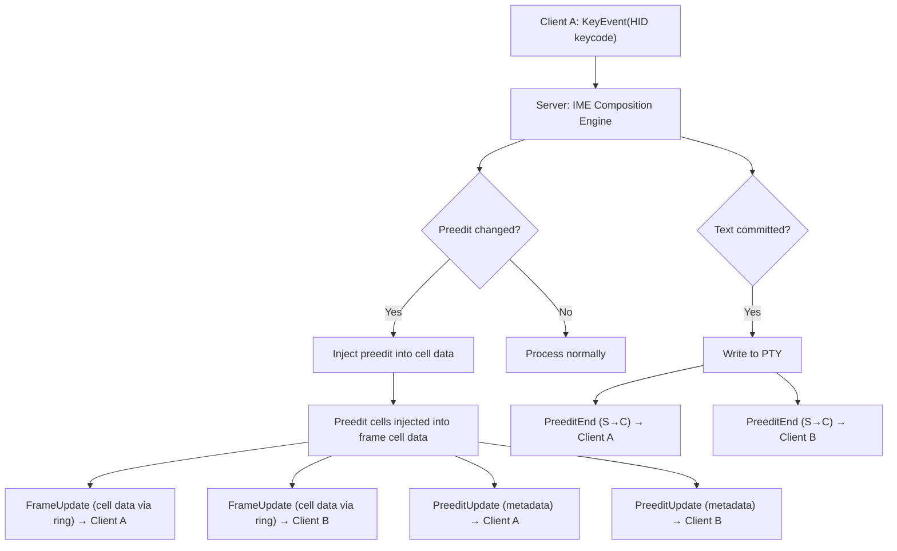
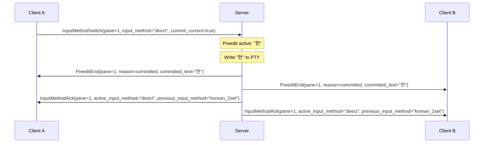

# CJK Preedit Sync and IME Protocol

- **Date**: 2026-03-14

## 1. Overview

This document specifies the protocol messages for CJK Input Method Editor (IME)
composition state synchronization. The design addresses:

1. **Preedit lifecycle management**: Start, update, end of composition sessions
2. **Multi-client sync**: Broadcasting preedit state to all attached clients
3. **Korean Hangul composition**: The most complex case — Jamo decomposition on
   backspace
4. **Input method switching**: Per-session input method state
5. **Race condition handling**: Pane close during composition, client
   disconnect, concurrent preedit, focus change during composition
6. **Session persistence**: Serializing/restoring preedit state across daemon
   restart

### 1.1 Architecture Context



**Single-path rendering model**: Preedit rendering is through cell data in
I/P-frames. The dedicated preedit messages (0x0400-0x04FF) are
lifecycle/metadata only — used for multi-client coordination, composition
tracking, and debugging. Not used for rendering. A client that only needs to
render can ignore all 0x04xx messages.

**Readonly client observation**: Readonly clients (attached with `readonly`
flag; see doc 02 for the flag, doc 03 Section 8 for the authoritative
permissions table) receive ALL preedit-related S->C messages (PreeditStart,
PreeditUpdate, PreeditEnd, PreeditSync, InputMethodAck) as observers. They
render preedit from cell data identically to read-write clients. Readonly
clients MUST NOT send InputMethodSwitch (0x0404) — the server rejects this with
ERR_ACCESS_DENIED (see doc 03, Section 8).

**Preedit exclusivity invariant**: At most one pane in a session can have active
preedit at any time. When a PreeditStart arrives for pane B, any active preedit
on pane A within the same session has already been cleared via PreeditEnd.

### 1.2 Message Type Range

| Range             | Category         | Direction                       |
| ----------------- | ---------------- | ------------------------------- |
| `0x0400`-`0x04FF` | CJK/IME messages | See per-message direction below |

---

## 2. Preedit Lifecycle Messages

All preedit lifecycle messages (PreeditStart, PreeditUpdate, PreeditEnd,
PreeditSync) flow **S->C** (server to client). The server is the sole authority
on composition state.

### 2.1 PreeditStart (type = 0x0400, S->C)

Sent by the server to ALL attached clients when a new composition session begins
on a pane. This occurs when the first composing keystroke is processed by the
IME engine.

#### JSON Payload

```json
{
  "pane_id": 1,
  "client_id": 7,
  "active_input_method": "korean_2set",
  "preedit_session_id": 42
}
```

| Field                 | Type   | Description                                                 |
| --------------------- | ------ | ----------------------------------------------------------- |
| `pane_id`             | u32    | Target pane                                                 |
| `client_id`           | u32    | Client that initiated composition (assigned by ServerHello) |
| `active_input_method` | string | Input method identifier (e.g., `"korean_2set"`, `"direct"`) |
| `preedit_session_id`  | u32    | Unique ID for this composition session                      |

The `preedit_session_id` is a monotonically increasing counter per session. It
disambiguates sequential composition sessions across all panes within the
session. The preedit exclusivity invariant (Section 1.1) guarantees at most one
active composition per session, so a single session-level counter suffices.

### 2.2 PreeditUpdate (type = 0x0401, S->C)

Sent by the server to ALL attached clients each time the composition state
changes (keystroke adds/removes a Jamo, composition advances). This is a
lifecycle/metadata-only message — used for multi-client coordination and
debugging, NOT for rendering. Preedit rendering is through cell data in
I/P-frames.

#### JSON Payload

```json
{
  "pane_id": 1,
  "preedit_session_id": 42,
  "text": "한"
}
```

| Field                | Type   | Description                                                                         |
| -------------------- | ------ | ----------------------------------------------------------------------------------- |
| `pane_id`            | u32    | Target pane                                                                         |
| `preedit_session_id` | u32    | Matches PreeditStart                                                                |
| `text`               | string | UTF-8 preedit text (for multi-client coordination and debugging, NOT for rendering) |

### 2.3 PreeditEnd (type = 0x0402, S->C)

Sent by the server to ALL attached clients when composition ends, either by
committing text or cancelling.

#### JSON Payload

```json
{
  "pane_id": 1,
  "preedit_session_id": 42,
  "reason": "committed",
  "committed_text": "한"
}
```

| Field                | Type   | Description                                      |
| -------------------- | ------ | ------------------------------------------------ |
| `pane_id`            | u32    | Target pane                                      |
| `preedit_session_id` | u32    | Matches PreeditStart                             |
| `reason`             | string | End reason (see below)                           |
| `committed_text`     | string | UTF-8 committed text (empty string if cancelled) |

**Committed text** is the final text written to the PTY. For Korean: if the user
composed "한" and pressed Space, committed_text="한".

**Reason values**:

- `"committed"`: Normal completion (Space, Enter, non-Jamo key, **Escape**,
  modifier flush)
- `"cancelled"`: Composition discarded without committing (backspace-to-empty,
  explicit reset, `commit_current=false` on InputMethodSwitch)
- `"pane_closed"`: Pane was closed while composition was active
- `"client_disconnected"`: The composing client disconnected
- `"replaced_by_other_client"`: Another client started composing on the same
  pane
- `"focus_changed"`: Focus changed to a different pane during composition (see
  Section 6.7)
- `"client_evicted"`: The composing client was evicted due to stale timeout
  (T=300s). The server commits the active preedit before disconnecting the
  client, and sends PreeditEnd with this reason to remaining peer clients. See
  doc 06 health escalation timeline.

### 2.4 PreeditSync (type = 0x0403, S->C)

Server -> specific client. Sent in two scenarios:

1. **Late-joining client**: When a client attaches to a pane that has an active
   composition session (e.g., a second client connects while Client A is
   mid-composition).
2. **Stale recovery**: When a stale client recovers, if preedit is active on any
   pane, the server sends PreeditSync before the I-frame — providing composition
   context before the grid render.

This is a full state snapshot — self-contained, unlike PreeditUpdate which
assumes the client has PreeditStart context. The visual preedit state is already
in the I-frame cell data the late-joining client receives.

#### JSON Payload

```json
{
  "pane_id": 1,
  "preedit_session_id": 42,
  "preedit_owner": 7,
  "active_input_method": "korean_2set",
  "text": "한"
}
```

| Field                 | Type   | Description                         |
| --------------------- | ------ | ----------------------------------- |
| `pane_id`             | u32    | Target pane                         |
| `preedit_session_id`  | u32    | Current session ID                  |
| `preedit_owner`       | u32    | Client ID that owns the composition |
| `active_input_method` | string | Input method identifier             |
| `text`                | string | UTF-8 preedit text                  |

PreeditSync remains necessary for late-joining clients — they need
`preedit_owner`, `preedit_session_id`, and `active_input_method` to correctly
handle subsequent PreeditUpdate and PreeditEnd messages.

---

## 3. Input Method Switching

### 3.1 InputMethodSwitch (type = 0x0404, C->S)

Client -> server. The client requests switching the active input method for a
pane.

#### JSON Payload

```json
{
  "pane_id": 1,
  "input_method": "korean_2set",
  "keyboard_layout": "qwerty",
  "commit_current": true
}
```

| Field             | Type   | Description                                                                                                                                      |
| ----------------- | ------ | ------------------------------------------------------------------------------------------------------------------------------------------------ |
| `pane_id`         | u32    | Pane that was focused when the switch was initiated. The server derives the session from this pane and applies the switch to the entire session. |
| `input_method`    | string | New input method identifier (e.g., `"direct"`, `"korean_2set"`)                                                                                  |
| `keyboard_layout` | string | Keyboard layout (optional; omit = keep current, default `"qwerty"` in v1)                                                                        |
| `commit_current`  | bool   | If true, commit active preedit before switching; if false, cancel it                                                                             |

> The server identifies the session from `pane_id`, then applies the input
> method switch to the entire session (all panes). The switch is not limited to
> the identified pane.

**Server behavior**:

1. If `commit_current=true` and preedit is active, commit current preedit text
   to PTY, send PreeditEnd with `reason="committed"` to all clients
2. If `commit_current=false` and preedit is active, cancel current preedit, send
   PreeditEnd with `reason="cancelled"` to all clients
3. Update the session's active input method and keyboard layout
4. Send InputMethodAck to ALL attached clients (broadcast)

**SHOULD recommendation**: Clients SHOULD default to `commit_current=true` for
InputMethodSwitch. The `commit_current=false` option is non-standard — no
widely-used Korean IME framework discards composition on language switch. This
option exists for future CJK language support where cancel-on-switch may be
appropriate.

### 3.2 InputMethodAck (type = 0x0405, S->C)

Server -> ALL attached clients (broadcast). Confirms the input method switch and
provides incremental state update. Together with LayoutChanged leaf node data
(see doc 03), this forms the two-channel input method state model.

#### JSON Payload

```json
{
  "pane_id": 1,
  "active_input_method": "korean_2set",
  "previous_input_method": "direct",
  "active_keyboard_layout": "qwerty"
}
```

| Field                    | Type   | Description                        |
| ------------------------ | ------ | ---------------------------------- |
| `pane_id`                | u32    | Target pane                        |
| `active_input_method`    | string | The now-active input method        |
| `previous_input_method`  | string | The previously active input method |
| `active_keyboard_layout` | string | The now-active keyboard layout     |

> **Normative**: `pane_id` identifies the pane that was focused when the input
> method switch occurred. Clients MUST update the input method state for ALL
> panes in the session, not just the identified pane. Displaying a stale input
> method for any pane in the session is incorrect.

**Broadcast semantics**: InputMethodAck is sent to ALL clients attached to the
session, not just the client that requested the switch. This enables all clients
to update their per-session input method state consistently. Combined with
`active_input_method` in LayoutChanged leaf nodes (doc 03), clients maintain
per-session input method state through two channels:

1. **LayoutChanged** (0x0180): Authoritative full state on attach and structural
   changes
2. **InputMethodAck** (0x0405): Incremental updates on input method switches

### 3.3 Per-Session Input Method State

> The new pane inherits the session's current `active_input_method`. No per-pane
> override is supported. To change the input method, send an InputMethodSwitch
> message (0x0404) after the pane is created.

**Default for new sessions**: `input_method: "direct"`,
`keyboard_layout: "qwerty"`. This is a normative requirement — servers MUST
initialize new sessions with these defaults. New panes inherit the session's
current values.

---

## 4. Ambiguous Width Configuration

### 4.1 AmbiguousWidthConfig (type = 0x0406)

Client -> server (or server -> client during handshake). Configures how
ambiguous-width Unicode characters are measured.

#### JSON Payload

```json
{
  "pane_id": 1,
  "ambiguous_width": 2,
  "scope": "per_pane"
}
```

| Field             | Type   | Description                                                                   |
| ----------------- | ------ | ----------------------------------------------------------------------------- |
| `pane_id`         | u32    | Target pane (`4294967295` for all panes)                                      |
| `ambiguous_width` | u8     | `1` = single-width (Western default), `2` = double-width (East Asian default) |
| `scope`           | string | `"per_pane"`, `"per_session"`, or `"global"`                                  |

**Affected characters**: Unicode characters with East Asian Width property "A"
(Ambiguous):

- Box drawing (-- | etc.)
- Greek letters (alpha beta gamma delta)
- Cyrillic letters
- Various symbols (degree, plus-minus, multiply, divide, etc.)

The client uses it for cell width computation during rendering.

---

## 5. Multi-Client Conflict Resolution

### 5.1 Wire-Observable Conflict Resolution

When preedit ownership conflicts occur, the following `PreeditEnd` reason values
are used:

| Reason                     | Trigger                                                                                                                       |
| -------------------------- | ----------------------------------------------------------------------------------------------------------------------------- |
| `replaced_by_other_client` | Another client's input caused a preedit takeover                                                                              |
| `client_disconnected`      | The preedit owner's connection dropped                                                                                        |
| `client_evicted`           | The preedit owner was evicted due to stale inactivity timeout (T=300s; see Section 2.3 and doc 06 health escalation timeline) |

Conflict resolution always produces a `PreeditEnd` for the previous owner,
broadcast to all attached clients. For `replaced_by_other_client` conflicts, a
`PreeditStart` for the new owner follows immediately. For `client_disconnected`
and `client_evicted` conflicts, no new owner takes over — only `PreeditEnd` is
sent.

Preedit ownership algorithm, internal state tracking, and conflict resolution
policy are defined in daemon design docs.

---

## 6. Race Condition Handling

### 6.1 Pane Close During Composition

**Scenario**: User closes a pane while Korean composition is active.

**Wire trace**:

```
Server -> all clients: PreeditEnd(pane=X, reason=pane_closed, committed="")
Server -> all clients: PaneClose(pane=X)  // from session management protocol
```

### 6.2 Client Disconnect During Composition

**Scenario**: The composing client's connection drops (network failure, crash).

**Server behavior**:

1. Detect disconnect (socket read returns 0 or error)
2. Commit current preedit text to PTY
3. Send PreeditEnd with `reason="client_disconnected"` to remaining clients
4. Clear preedit ownership

**Timeout**: If the server receives no input from the preedit owner for T=300s
(per doc 06 health escalation timeline), it commits the current preedit, evicts
the client, and sends `PreeditEnd` with `reason="client_evicted"` to remaining
clients. This handles cases where the client is frozen but the socket is still
open.

### 6.3 Concurrent Preedit and Resize

**Scenario**: The terminal is resized while composition is active.

**Server behavior**:

1. Process the resize through libghostty-vt Terminal
2. The server repositions preedit cells internally (cursor row/column may change
   due to reflow)
3. Send FrameUpdate with `frame_type=1` (I-frame) — preedit cells are included
   in the cell data at the updated position

### 6.4 Screen Switch During Composition

**Scenario**: An application switches from primary to alternate screen (e.g.,
`vim` launches) while composition is active.

**Wire behavior**: The server sends `PreeditEnd` with `reason="committed"`
followed by `FrameUpdate` with `frame_type=1` (I-frame), `screen=alternate`.

### 6.5 Rapid Keystroke Bursts

**Scenario**: User types Korean very quickly, generating multiple KeyEvents
before the server processes them.

**Wire behavior**: When rapid keystrokes arrive within a single frame interval,
only the final PreeditUpdate for the burst is sent. Intermediate preedit states
are not transmitted.

### 6.6 Layout Query After Reconnection

When a client reconnects or a new client attaches, it can query the current
layout tree via `LayoutGetRequest` (doc 03). The layout response includes
`preedit_active`, `active_input_method`, and `active_keyboard_layout` fields in
the leaf node metadata. All leaf nodes in a session carry identical
`active_input_method` and `active_keyboard_layout` values (reflecting the
session's shared engine state). For panes with active composition, the server
additionally sends `PreeditSync` (0x0403) with the full preedit state snapshot.

### 6.7 Focus Change During Composition

**Scenario**: Client B sends FocusPaneRequest while Client A is composing Korean
on the currently focused pane.

**Wire behavior**: The server sends `PreeditEnd` with `reason="focus_changed"`
to all clients, followed by `LayoutChanged` with the new focused pane. The
preedit is resolved before processing the interrupting action.

### 6.8 Session Detach During Composition

**Scenario**: The composing client sends DetachSessionRequest while composition
is active.

**Server behavior**:

1. Commit current preedit text to PTY
2. Send PreeditEnd with `reason="client_disconnected"` to remaining clients
3. Clear preedit ownership
4. Process the session detach normally

### 6.9 InputMethodSwitch During Active Preedit

**Scenario**: A client sends InputMethodSwitch (0x0404) on a pane that has
active composition.

**Server behavior**:

1. If `commit_current=true`: Commit current preedit text to PTY, send PreeditEnd
   with `reason="committed"` to all clients
2. If `commit_current=false`: Cancel current preedit, send PreeditEnd with
   `reason="cancelled"` to all clients
3. Switch the session's input method (applies to all panes)
4. Send InputMethodAck to all attached clients

**Wire trace** (commit_current=true):



### 6.10 Mouse Event During Composition

**Scenario**: A mouse event arrives while Korean composition is active on the
pane.

**MouseButton (0x0202)**: A mouse button click changes the editing context
(cursor position moves). The server MUST commit the active preedit before
forwarding the mouse event.

**Server behavior**:

1. Commit current preedit text to PTY
2. Send PreeditEnd with `reason="committed"` and the committed text to all
   clients
3. Forward the mouse event to the terminal

**Wire trace**:

```
Server -> all clients: PreeditEnd(pane=X, reason=committed, committed_text="한")
Server -> terminal:    MouseButton event forwarded
```

**MouseScroll (0x0204)**: A mouse scroll event is a viewport-only operation. The
editing context (cursor position, active pane) is unchanged. The server MUST NOT
commit preedit on scroll. The user's in-progress composition (e.g., a
half-composed Korean syllable) MUST be preserved.

Viewport restoration after scroll is handled by the terminal's scroll-to-bottom
default behavior — no protocol support needed.

---

## 7. Preedit in Session Snapshots

### 7.1 Snapshot Format

When the server serializes session state to disk (for persistence across daemon
restart), IME state is stored at session level and preedit state (if active) is
stored on the pane where composition was occurring:

```json
{
  "ime": {
    "input_method": "korean_2set",
    "keyboard_layout": "qwerty"
  },
  "panes": [
    {
      "pane_id": 1,
      "preedit": {
        "active": true,
        "session_id": 42,
        "owner_client_id": 7,
        "preedit_text": "한"
      }
    }
  ]
}
```

The `ime` object is at session level — all panes share the session's engine. The
`preedit` object is on the specific pane where composition was active (at most
one pane per session, per the preedit exclusivity invariant). Panes without
active preedit omit the `preedit` field. No per-pane IME fields (`input_method`,
`keyboard_layout`) are stored — panes carry no IME state in the session
snapshot. On restore, the server commits preedit text to PTY (Section 7.2). Only
`preedit_text` is needed for this. Cursor position is not needed at restore time
— ghostty determines cursor position from the terminal state.

### 7.2 Restore Behavior

When the daemon restarts and restores a session:

1. **Preedit was active**: The preedit text is committed to the PTY. The
   composition session is not resumed.

---

## 8. Preedit Rendering Protocol

### 8.1 Client Rendering Responsibilities

Preedit rendering is through cell data in I/P-frames. The server injects preedit
cells into the frame cell data. The client renders all cells uniformly — it has
no concept of which cells are preedit and which are terminal content.

Preedit cell decoration (block cursor overlay, 2-cell width for Hangul,
underline) is determined server-side when preedit cells are injected into the
frame. These are server-internal rendering decisions, not protocol requirements.
The client renders whatever cells it receives.

### 8.2 Preedit for Observer Clients

Non-owner clients (observers) render preedit identically to the owner — they
receive the same cell data from the ring buffer, which already includes preedit
cells. No special rendering logic is needed.

Observers MAY use metadata from PreeditStart/PreeditUpdate for composition
indicators. The `client_id` field from PreeditStart identifies the composing
client. The `text` field from PreeditUpdate carries the current composition
text.

---

## 9. Error Handling

### 9.1 Invalid Composition State

If the server's IME engine reaches an invalid state (should not happen with
correctly implemented Korean algorithms), the server sends `PreeditEnd` with
`reason="cancelled"` to all clients.

### 9.2 Malformed Preedit Messages

If the server receives a message with invalid fields:

| Error                        | Response                               |
| ---------------------------- | -------------------------------------- |
| Unknown input method         | Ignore the switch, send error response |
| preedit_session_id mismatch  | Ignore the message (stale)             |
| preedit_text not valid UTF-8 | Drop message, log error                |
| pane_id does not exist       | Send error response with error code    |

### 9.3 Error Response (type = 0x04FF)

Generic error response for CJK/IME operations.

#### JSON Payload

```json
{
  "pane_id": 1,
  "error_code": 1,
  "detail": "Unknown input method: foobar"
}
```

| Field        | Type   | Description                  |
| ------------ | ------ | ---------------------------- |
| `pane_id`    | u32    | Related pane                 |
| `error_code` | u16    | Error identifier (see below) |
| `detail`     | string | UTF-8 error description      |

**Error codes**:

| Code     | Meaning                              |
| -------- | ------------------------------------ |
| `0x0001` | Unknown input method                 |
| `0x0002` | Pane does not exist                  |
| `0x0003` | Invalid composition state transition |
| `0x0004` | Preedit session ID mismatch          |
| `0x0005` | UTF-8 encoding error in preedit text |
| `0x0006` | Input method not supported by server |

---

## 10. Message Type Summary

| Type     | Name                 | Direction          | Encoding | Description                                         |
| -------- | -------------------- | ------------------ | -------- | --------------------------------------------------- |
| `0x0400` | PreeditStart         | S -> C             | JSON     | New composition session begins                      |
| `0x0401` | PreeditUpdate        | S -> C             | JSON     | Composition state changed (lifecycle/metadata only) |
| `0x0402` | PreeditEnd           | S -> C             | JSON     | Composition session ended                           |
| `0x0403` | PreeditSync          | S -> C             | JSON     | Full preedit snapshot for late-joining client       |
| `0x0404` | InputMethodSwitch    | C -> S             | JSON     | Request input method change                         |
| `0x0405` | InputMethodAck       | S -> C (broadcast) | JSON     | Confirm input method change (all clients)           |
| `0x0406` | AmbiguousWidthConfig | Bi                 | JSON     | Set ambiguous character width                       |
| `0x04FF` | IMEError             | S -> C             | JSON     | Error response                                      |

All CJK/IME messages use JSON payloads (20-byte binary header with ENCODING=0 +
JSON body). This provides debuggability (`socat | jq`), cross-language client
support (Swift `JSONDecoder`), and schema evolution. The overhead is negligible
at preedit message frequencies (~15/s).

---

## 11. Integration with FrameUpdate

### 11.1 Single-Path Rendering Model

**Capability interaction**: The `"preedit"` capability controls only the
dedicated PreeditStart/Update/End/Sync messages. Preedit rendering through cell
data is always available regardless of capability negotiation. A client that
does not negotiate `"preedit"` still renders preedit correctly — it simply lacks
the metadata for composition tracking and observer indicators.

### 11.2 Message Ordering

The server sends context messages before the corresponding FrameUpdate.

For a single composition keystroke:

```
1. PreeditUpdate (0x0401)    -- lifecycle/metadata (sent first for observers)
2. FrameUpdate (0x0300)      -- cell data via ring (includes preedit cells + any grid changes)
```

For composition end:

```
1. PreeditEnd (0x0402)       -- lifecycle/metadata
2. FrameUpdate (0x0300)      -- cell data via ring (preedit cells removed, grid updated with committed text)
```
