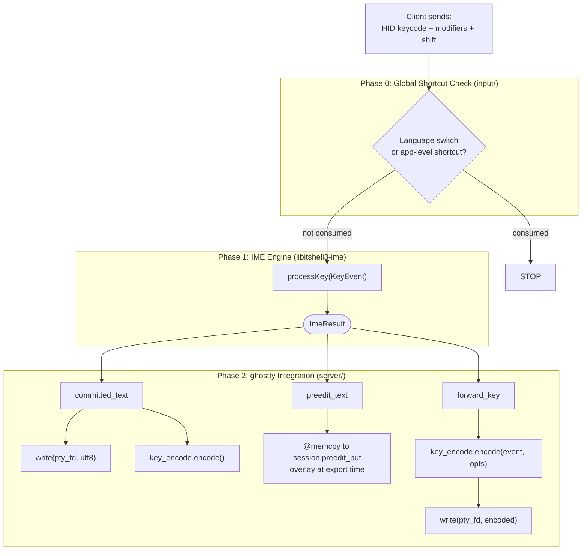
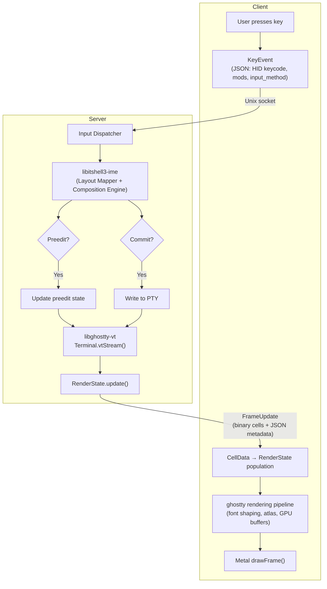

# Module Structure and Event Loop

- **Date**: 2026-03-24
- **Scope**: libitshell3 module decomposition, dependency graph, event loop
  model, and binary/library responsibility separation

---

## 1. Module Decomposition

libitshell3 is organized into 4 module groups with a diamond dependency graph.
`ghostty/` and `input/` are sibling modules that both depend on `core/`;
`server/` depends on all three.

### 1.1 Dependency Graph

```
      core/
     /    \
ghostty/  input/
     \    /
     server/
```

Dependencies point inward: `server/` depends on everything; `ghostty/` and
`input/` depend only on `core/`; `core/` depends on nothing. Circular
dependencies are prohibited.

### 1.2 Module Definitions

#### `core/` — Pure State Types

Zero dependencies on ghostty, OS, or protocol.

| Type            | Purpose                                                                                   |
| --------------- | ----------------------------------------------------------------------------------------- |
| `Session`       | Config, name, ImeEngine interface, preedit cache, focused pane, tree layout               |
| `SplitNodeData` | Binary split tree node (tagged union: `.leaf` = PaneSlot, `.split` = orientation + ratio) |
| `PaneId`        | `u32` opaque wire identifier (global monotonic, never reused)                             |
| `PaneSlot`      | `u8` session-local slot index (0..15) for fixed-size array operations                     |
| `MAX_PANES`     | Compile-time constant: 16 panes per session                                               |
| `ImeEngine`     | Vtable interface for input method engines                                                 |
| `KeyEvent`      | Key input event type consumed by IME routing                                              |
| `ImeResult`     | Result of IME processing (committed text, preedit, forward key)                           |

`core/` is unit-testable in isolation with zero external dependencies.

#### `ghostty/` — Thin Helper Functions

Depends on `core/` only. Contains helper functions (NOT wrapper types) for
ghostty's internal Zig APIs.

| Helper               | Wraps                                            | Purpose                                                      |
| -------------------- | ------------------------------------------------ | ------------------------------------------------------------ |
| Terminal lifecycle   | `Terminal.init(alloc, .{.cols, .rows})`          | Create headless Terminal instance                            |
| VT stream processing | `terminal.vtStream(bytes)`                       | Feed PTY output into terminal                                |
| RenderState snapshot | `RenderState.update(alloc, &terminal)`           | Capture terminal state for export                            |
| Cell data export     | `bulkExport(alloc, &render_state, &terminal)`    | Produce CellData[] for wire transfer                         |
| Key encoding         | `key_encode.encode(writer, event, opts)`         | Encode key events for PTY (stateless, pure function)         |
| Terminal mode query  | `Options.fromTerminal(&terminal)`                | Read DEC modes, Kitty flags                                  |
| Preedit injection    | `overlayPreedit(export_result, preedit, cursor)` | Overlay preedit cells post-export (~20 lines in vendor fork) |

**Why helper functions, not wrapper types**: ghostty's API is not stable.
Wrapper types would create a maintenance trap — every upstream API change would
require updating both the wrapper and the call site. Helper functions are a thin
layer that adds value (e.g., error mapping, parameter defaults) without creating
false abstraction. We have no second implementation of ghostty, so an
abstraction layer violates YAGNI.

#### `input/` — Key Routing Orchestration

Depends on `core/` only. No ghostty dependency.

**Scope**: The `input/` module handles Phase 0+1 of the 3-phase key processing
pipeline: shortcut interception (Phase 0), ImeEngine dispatch (Phase 1), focus
change handling (`handleIntraSessionFocusChange`), and input method switching
(`handleInputMethodSwitch`). Mouse events and paste operations bypass this
module entirely — they are handled directly in `server/`.

| Function                        | Phase | Purpose                                             |
| ------------------------------- | ----- | --------------------------------------------------- |
| `handleKeyEvent`                | 0 + 1 | Route key through shortcut check, then to ImeEngine |
| `handleIntraSessionFocusChange` | —     | Flush engine, clear preedit on old pane             |
| `handleInputMethodSwitch`       | 0     | Switch active input method                          |

`input/` depends on the `ImeEngine` interface type (defined in `core/`), not on
the concrete `HangulImeEngine` (in libitshell3-ime). This is dependency
inversion: `input/` code is testable with a `MockImeEngine` without libhangul.

##### 3-Phase Key Processing Pipeline

Every key event from a client passes through three sequential phases:



**Why IME runs before keybindings**: When the user presses Ctrl+C during Korean
composition (preedit = "하"), Phase 0 checks — Ctrl+C is not a language toggle.
Phase 1: engine detects Ctrl modifier, flushes "하", returns
`{ committed: "하", forward_key: Ctrl+C }`. Phase 2: committed text "하" is
written to PTY, then Ctrl+C is encoded via `key_encode.encode()` and written to
PTY. This ensures the user's in-progress composition is preserved before any
control key action.

For the internal `processKey()` decision algorithm (modifier handling, printable
key dispatch, libhangul composition), see `01-processkey-algorithm.md` in the
`libitshell3-ime` behavior docs.

Phase 0 and Phase 1 execute in `input/` (depends only on `core/`). Phase 2
executes in `server/` (depends on `ghostty/` for key encoding and preedit
overlay). See Section 1.3 for the Phase 2 placement rationale.

#### `server/` — Event Loop and I/O

Depends on `core/`, `ghostty/`, `input/`, libitshell3-ime, and
libitshell3-protocol.

| Component           | Purpose                                                                                                  |
| ------------------- | -------------------------------------------------------------------------------------------------------- |
| Event loop          | kqueue-based, single-threaded (see Section 2)                                                            |
| SessionEntry        | Server-side wrapper: Session (core/) + pane_slots + free_mask + dirty_mask (see `02-state-and-types.md`) |
| Client manager      | Per-client state, connection lifecycle                                                                   |
| Ring buffer         | Per-pane frame delivery with per-client cursors                                                          |
| Frame coalescing    | Adaptive timer for batching frame updates                                                                |
| PTY I/O             | Read/write handlers for pane PTY file descriptors                                                        |
| Phase 2 integration | Consume ImeResult: PTY writes, preedit cache update, key encoding                                        |
| Pane struct         | Owns Terminal + RenderState + pty_fd + child_pid (see `02-state-and-types.md`)                           |
| Startup/shutdown    | Daemon initialization and graceful teardown                                                              |

Socket setup is delegated to libitshell3-protocol's transport layer (Layer 4).

### 1.3 Phase 2 Placement

Phase 2 consumes `ImeResult` and performs:

- **I/O**: `write(pty_fd, committed_text)`, `write(pty_fd, encoded_key)`
- **ghostty API calls**: `key_encode.encode()`, `overlayPreedit()`
- **State mutation**: `@memcpy` preedit text to `session.preedit_buf`

Both I/O and ghostty dependencies belong in `server/`, not `input/`. The
`input/` module handles Phase 0 and Phase 1 only — pure routing logic that
depends solely on `core/` types.

### 1.4 Ring Buffer Placement

The ring buffer lives in `server/`, not in the protocol library or `core/`. The
ring buffer is a server-side application-level delivery optimization
(multi-client cursor management, writev scheduling) with no client-side
analogue. The protocol library provides transport-level I/O (Layer 4), but
application-level delivery strategies are the consumer's responsibility.

### 1.5 Pane Struct Placement and Fixed-Size Lookup

The Pane struct lives in `server/` because it owns both ghostty types (Terminal,
RenderState) and OS resources (pty_fd, child_pid). Placing it in `core/` would
violate the `core/ <- ghostty/` dependency rule.

A compile-time constant limits panes per session:

```zig
pub const MAX_PANES = 16;
pub const MAX_TREE_NODES = MAX_PANES * 2 - 1; // 31
```

The 16-pane limit is a UX-driven constraint, not a performance optimization. On
a 374x74 terminal, 16 panes at 93x18 is minimum viable; 32 panes at 93x9 is
unusable. The limit is enforced server-side via ErrorResponse when a client
requests a split that would exceed 16 panes.

Each session's pane slots are managed by `SessionEntry` (in `server/`), a
server-side wrapper around `Session`. See `02-state-and-types.md` for
SessionEntry type definition, dirty tracking, and pane slot allocation details.

**PaneId semantics**: PaneId on the wire is a global monotonic `u32`, never
reused within daemon lifetime. Internally, sessions use a session-local
`PaneSlot: u8` (0..15) for all fixed-size array operations. Wire-to-Pane lookup
uses per-session linear scan of `pane_slots` (at most 16 entries) — cold path
only. Hot paths (frame export, dirty iteration, PTY read) use slot indices
exclusively.

**Why global monotonic PaneId (not session-local 0..15) on the wire**:

1. **Pane-reuse race condition**: In async IPC, a client can have an in-flight
   message targeting a slot the server has already recycled. Global monotonic
   PaneId ensures stale messages target non-existent IDs and receive
   ErrorResponse.
2. **Protocol constraint leak**: Session-local PaneId (0..15) exposes the
   16-pane limit to wire semantics. Global monotonic u32 keeps the limit
   invisible to the protocol.
3. **Hot-path equivalence**: Both options have identical hot-path performance —
   all hot paths use slot indices, never PaneId.

`SessionManager` uses `HashMap(u32, *SessionEntry)` for sessions (dynamic count,
few instances — no fixed limit for sessions).

### 1.6 Inter-Library Dependencies

libitshell3 and libitshell3-protocol are separate libraries with a clean,
acyclic dependency relationship:

```
libitshell3-protocol  (standalone — depends only on Zig std; libssh2 added in Phase 5)
libitshell3-ime       (standalone — depends on libhangul)
libitshell3/core/     (standalone — no external deps)
libitshell3/ghostty/  (depends on core/, vendored ghostty)
libitshell3/input/    (depends on core/)
libitshell3/server/   (depends on core/, ghostty/, input/, libitshell3-ime, libitshell3-protocol)
```

**libitshell3-protocol does NOT import any libitshell3 types.** The protocol
library uses Zig primitive types (`u32`, `[]const u8`, etc.) for all message
fields. On the wire, `pane_id` and `session_id` are `u32` values in JSON
payloads — the protocol library reflects what the wire carries.

**`server/` maps between wire primitives and domain types.** Since `server/`
imports both `core/` and `libitshell3-protocol`, it is the natural boundary for
converting protocol message fields (e.g., `msg.pane_id: u32`) to domain types
(e.g., `core.PaneId`). This is a trivial one-line cast at each protocol handler.

**No shared types library is needed.** The types that might be shared
(`PaneId = u32`, session_id as `u32`) are trivial aliases. Extracting a
`libitshell3-types` library for two `u32` aliases would be over-engineering.

**libitshell3-protocol's external dependencies:**

- **v1**: Zig `std` only (posix sockets via `std.posix` for Layer 4 transport)
- **Phase 5**: `libssh2` added for SSH transport in Layer 4

### 1.7 Prior Art

- **tmux**: Separates pure state (`window.h`, `session.h`) from I/O (`tty.c`,
  `server-client.c`).
- **ghostty**: Separates terminal logic (`Terminal.zig`) from renderer
  (`Metal.zig`) and I/O (`Termio.zig`).

---

## 2. Event Loop Model

### 2.1 Decision

Single-threaded kqueue event loop (tmux model). No threads, no locks, no
mutexes.

### 2.2 Event Sources

All event types are handled in a single `kevent64()` call:

| Filter          | Source                  | Purpose                                                    |
| --------------- | ----------------------- | ---------------------------------------------------------- |
| `EVFILT_READ`   | PTY fds                 | Read shell output from pane child processes                |
| `EVFILT_READ`   | Socket listen fd        | Accept new client connections                              |
| `EVFILT_READ`   | Client conn fds         | Read client messages (key events, commands)                |
| `EVFILT_WRITE`  | Client conn fds         | Resume sending when socket becomes writable (after EAGAIN) |
| `EVFILT_TIMER`  | Coalescing timer        | Trigger frame export and delivery at adaptive intervals    |
| `EVFILT_TIMER`  | I-frame keyframe timer  | Periodic full-frame keyframes for state recovery           |
| `EVFILT_SIGNAL` | SIGTERM, SIGINT, SIGHUP | Graceful shutdown signals                                  |
| `EVFILT_SIGNAL` | SIGCHLD                 | Child process reaping                                      |

kqueue timers are kernel-managed, more efficient than userspace timer wheels.

### 2.3 Why Single-Threaded

See ADR 00033 (Single-Threaded Event Loop for Daemon).

### 2.4 Input Processing Priority

When the event loop dequeues multiple pending client messages in one iteration,
the server processes them in a defined priority order. Higher-priority messages
are dispatched first, ensuring user-visible feedback (key echo, cursor movement)
is never starved by bulk transfers.

The concrete 5-tier priority table is specified in the daemon-behavior docs as a
testable policy (KeyEvent/TextInput at highest priority, FocusEvent at lowest).
The architectural invariant is: **input message types MUST be prioritized by
user-visible latency impact**, with interactive input (key echo) taking
precedence over bulk transfers (paste) and advisory signals (focus).

### 2.5 Input Flow Diagram

The end-to-end input flow from user keypress through daemon processing to client
rendering:



### 2.6 Prior Art

- **tmux**: Single-threaded libevent loop, proven at scale with hundreds of
  sessions and panes.
