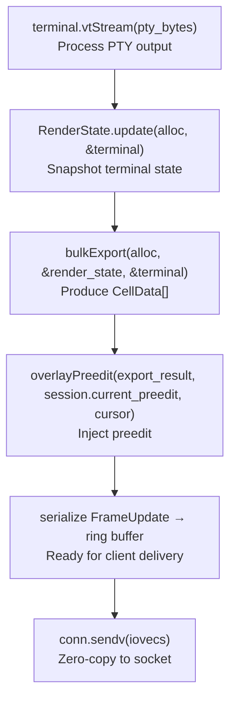
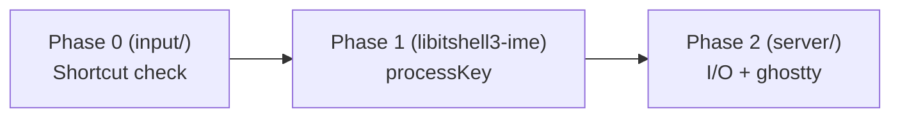
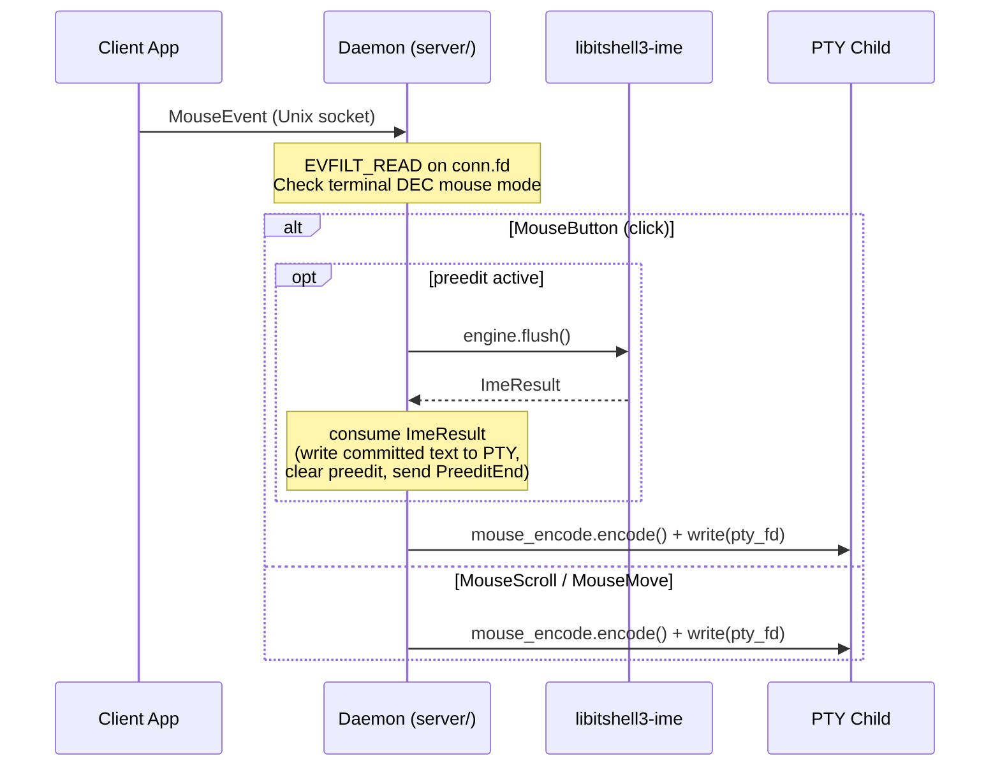
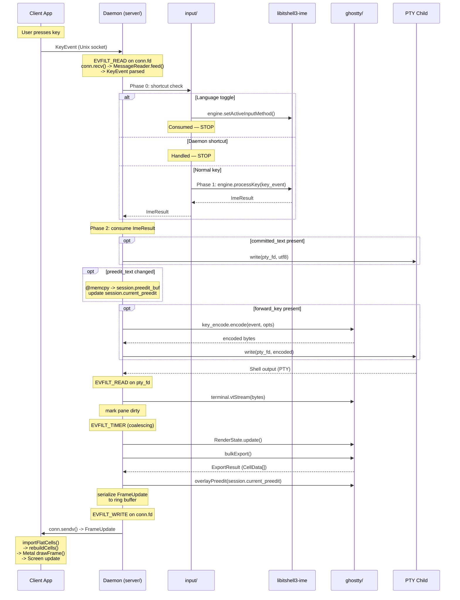
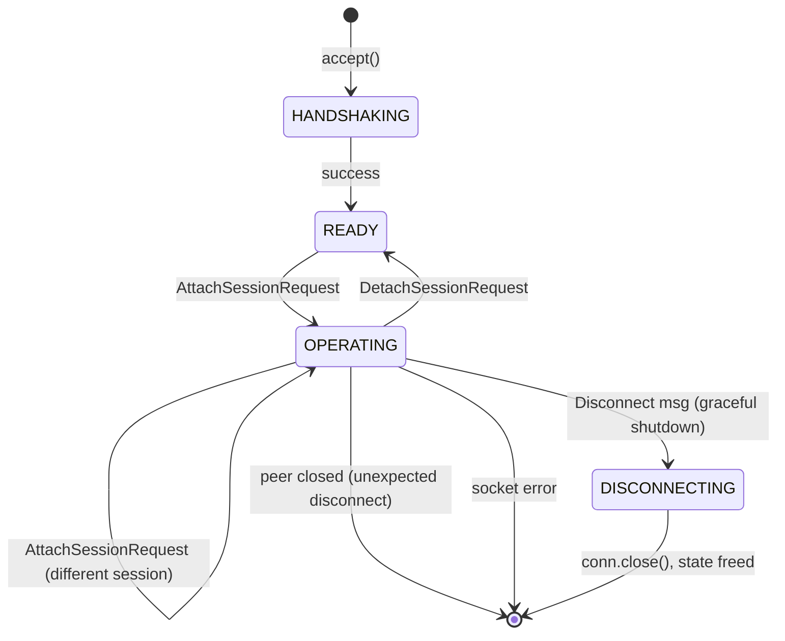
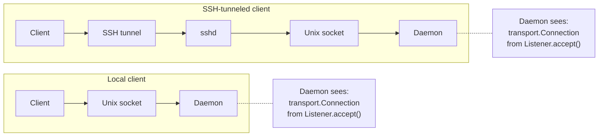

# Integration Boundaries

- **Date**: 2026-03-24
- **Scope**: Protocol library boundary, ghostty API surface, IME integration
  architecture, C API surface, client state types, transport design, deferred
  items

---

## 1. Protocol Library Boundary (libitshell3-protocol)

The daemon communicates with clients through `libitshell3-protocol`, a
standalone library organized into four layers. Layers 1-3 are I/O-free (no OS
dependencies, no file descriptors, no syscalls). Layer 4 is the sole layer with
OS dependencies.

**External dependencies**: Zig `std` only (posix sockets, libc) in v1. libssh2
added in Phase 5 for SSH transport. No dependency on `libitshell3/core/` types —
message structs use primitives (`u32` for pane_id/session_id, `[]const u8` for
names). The `server/` module maps between wire primitives and domain types
(e.g., `core.PaneId`) at the boundary.

### 1.1 Layer Architecture

```
┌─────────────────────────────────────────────────────────┐
│ Layer 4: Transport          (has OS dependencies)       │
│   Listener, Connection, socket path, stale detection    │
├─────────────────────────────────────────────────────────┤
│ Layer 3: Connection Protocol (I/O-free state machine)   │
│   6-state model, message sequencing, capability state   │
├─────────────────────────────────────────────────────────┤
│ Layer 2: Framing             (I/O-free, per-connection) │
│   MessageReader, MessageWriter, fragment reassembly     │
├─────────────────────────────────────────────────────────┤
│ Layer 1: Codec               (I/O-free, stateless)      │
│   encode(Message) → bytes, decode(bytes) → Message      │
└─────────────────────────────────────────────────────────┘
```

Both the daemon and the client use all four layers. The event loop integration
differs (kqueue for daemon, RunLoop/dispatch for Swift client), but the protocol
library itself is shared.

### 1.2 Layer 1 — Codec

Stateless, I/O-free. Pure serialization functions.

- `encode(Message) -> bytes` — serialize a message to wire format
- `decode(bytes) -> Message` — deserialize bytes to a message

Handles the 16-byte fixed header, JSON payloads, and the hybrid FrameUpdate
binary+JSON format. Zero allocation policy — the caller provides output buffers.

### 1.3 Layer 2 — Framing

Stateful per-connection, I/O-free. Operates on byte slices, NOT file
descriptors.

- **`MessageReader`** — accumulates bytes fed by the caller, extracts complete
  frames. Handles buffer management, fragment reassembly, and incomplete message
  detection.
- **`MessageWriter`** — serializes messages into output buffers or iovec arrays
  for vectored I/O.

The framing layer knows nothing about sockets or event loops. The caller feeds
bytes in (from whatever I/O mechanism it uses) and reads complete messages out.

### 1.4 Layer 3 — Connection Protocol

Event-driven state machine, I/O-free. Tracks connection state using the
canonical 6-state model from protocol doc 01 Section 5.2:

```
DISCONNECTED -> CONNECTING -> HANDSHAKING -> READY -> OPERATING -> DISCONNECTING
```

Design: `onEvent(event) -> Action` — deterministic, testable, no side effects.
The daemon or client drives the state machine by feeding events and executing
returned actions.

Responsibilities:

- Validates message sequencing (e.g., rejects FrameUpdate before state reaches
  OPERATING)
- Manages capability negotiation state during handshake
- Tracks connection lifecycle transitions

The daemon's per-client state machine starts at HANDSHAKING (after
`Listener.accept()`). DISCONNECTED and CONNECTING are client-side states only.
The key transition OPERATING -> READY (detach without disconnect) allows session
switching without reconnecting.

**Prior art**: h2 (Rust HTTP/2 library), nghttp2 (C HTTP/2 library) — both use
I/O-free state machines where the caller owns all I/O.

### 1.5 Layer 4 — Transport

Has OS dependencies (socket syscalls). Handles socket lifecycle and provides
thin I/O wrappers. Uses an **fd-providing model**: the transport layer creates
and configures sockets, returns raw file descriptors that the consumer registers
with its own event loop. The transport layer does NOT own the event loop.

#### 1.5.1 Socket Path Resolution

Both daemon and client resolve the socket path identically using a 4-step
fallback algorithm:

1. `$ITSHELL3_SOCKET` (explicit override)
2. `$XDG_RUNTIME_DIR/itshell3/<server-id>.sock`
3. `$TMPDIR/itshell3-<uid>/<server-id>.sock`
4. `/tmp/itshell3-<uid>/<server-id>.sock`

This algorithm is defined in protocol spec Section 2.1. Centralizing it in the
transport layer eliminates duplication between daemon and client.

#### 1.5.2 Listener (Server-Side)

`transport.Listener` manages the server socket lifecycle:

- **`Listener.init(config)`**: `socket(AF_UNIX, SOCK_STREAM)` -> stale socket
  detection -> `bind()` -> `listen(backlog)` -> `chmod(0600)` -> directory
  creation with `0700` permissions -> `O_NONBLOCK`. Returns the listener for
  kqueue registration via `.fd()`.

- **`Listener.accept()`**: `accept()` + `getpeereid()`/`SO_PEERCRED` UID
  verification + `O_NONBLOCK` + `setsockopt` buffer sizes -> returns a
  `Connection`.

- **`Listener.deinit()`**: `close(listen_fd)` + `unlink(socket_path)` + free
  path string. Compound cleanup ensures no leaked sockets or stale files.

#### 1.5.3 Connection (Both Sides)

A plain struct containing one `pub fd: posix.fd_t` field. 4 bytes, no allocator,
no hidden state. Created by `Listener.accept()` (server-side) or
`transport.connect(config)` (client-side).

```zig
pub const Connection = struct {
    fd: posix.fd_t,  // pub, for kqueue/RunLoop registration

    pub fn recv(self: Connection, buf: []u8) RecvResult { ... }
    pub fn send(self: Connection, buf: []const u8) SendResult { ... }
    pub fn sendv(self: Connection, iovecs: []posix.iovec_const) SendvResult { ... }
    pub fn close(self: *Connection) void { posix.close(self.fd); self.fd = -1; }
};
```

- **`.recv(buf)`** — thin wrapper over `posix.read(self.fd, buf)` with result
  mapping
- **`.send(buf)`** — thin wrapper over `posix.write(self.fd, buf)` with result
  mapping
- **`.sendv(iovecs)`** — thin wrapper over `posix.writev(self.fd, iovecs)` for
  ring buffer zero-copy path
- **`.close()`** — `posix.close(self.fd)` + `self.fd = -1` (defensive against
  use-after-close)
- **`Connection.fd`** is `pub` — consumer uses it directly for kqueue/RunLoop
  registration

**Result types**:

```zig
pub const RecvResult = union(enum) {
    bytes_read: usize,    // success
    would_block: void,    // EAGAIN — re-arm event loop
    peer_closed: void,    // EOF (n==0), EPIPE, or ECONNRESET
    err: posix.ReadError, // unexpected error
};

pub const SendResult = union(enum) {
    bytes_written: usize, // may be partial — caller manages remainder
    would_block: void,    // EAGAIN — re-arm EVFILT_WRITE
    peer_closed: void,    // EPIPE or ECONNRESET
    err: posix.WriteError,
};
```

The `SendvResult` follows the same pattern as `SendResult` but wraps
`posix.writev`.

**Why methods on the struct (not raw `posix.read/write`)**: Three reasons drove
this design:

1. **SSH swappability (primary)**: In Phase 5, `Connection` will hold SSH
   channel state internally, and `.recv()`/`.send()` will dispatch to
   `libssh2_channel_read()`/`libssh2_channel_write()`. libssh2 channels do NOT
   provide real fds — all channels multiplex onto one TCP socket. Consumer call
   sites are unchanged.
2. **Zig idiom**: `std.net.Stream` and `std.fs.File` both own fds and provide
   methods. `Connection` follows the same convention.
3. **Error consolidation**: `.recv()` maps `n==0` (EOF), `EPIPE`, and
   `ECONNRESET` to a single `.peer_closed` variant. This is genuine shared logic
   beyond what `std.posix` provides.

Note: Zig's `std.posix.read/write` already handles EINTR internally. EINTR
handling is NOT a reason for these wrappers.

#### 1.5.4 Peer Credential Extraction

Platform-specific UID verification centralized in `Listener.accept()`:

- **macOS**: `getpeereid()`
- **Linux**: `SO_PEERCRED`

Rejects connections from different UIDs (security boundary).

#### 1.5.5 Stale Socket Detection

`connect()` probe to the existing socket path:

- Success -> daemon already running -> caller decides (daemon exits, client
  connects)
- `ECONNREFUSED` -> stale socket -> report to caller for cleanup

Used by both daemon startup and client auto-start.

#### 1.5.6 Socket Option Configuration

`SO_SNDBUF`/`SO_RCVBUF` defaults at 256 KiB per protocol spec, configurable via
options struct.

### 1.6 What Layer 4 Does NOT Own

| Concern                          | Owner                                | Rationale                                                                                                               |
| -------------------------------- | ------------------------------------ | ----------------------------------------------------------------------------------------------------------------------- |
| Event loop                       | `server/` (kqueue), client (RunLoop) | Consumer decides WHEN to call recv/send                                                                                 |
| Ring buffer                      | `server/`                            | Server-side delivery optimization tied to writev zero-copy and multi-client cursor management. No client-side analogue. |
| Reconnection logic               | Client                               | Client-specific policy (exponential backoff)                                                                            |
| Application-level error response | Consumer                             | Daemon: cleanup ClientState + deregister from kqueue. Client: reconnect UI.                                             |

### 1.7 Testability

Layers 1-3 are fully testable without sockets, kqueue, or OS mocking. Feed bytes
in, check messages out. Layer 4 requires socket syscalls but can be tested with
real Unix sockets in integration tests.

### 1.8 SSH Transport (Phase 5)

No SSH abstraction in v1. Concrete Unix socket implementation only — no vtable,
no interface, no tagged union.

When Phase 5 arrives, the `Connection` struct internals are expanded to hold SSH
channel state, and `.recv()`/`.send()` dispatch to
`libssh2_channel_read()`/`libssh2_channel_write()`. Consumer call sites are
unchanged. The cost in v1 is ~40 lines of trivial pass-through wrappers; the
Phase 5 benefit is zero call-site changes.

### 1.9 Naming Convention

Types use namespace-qualified names: `transport.Listener`,
`transport.Connection` (not `TransportListener`/`TransportConnector`). The types
live in the `transport` namespace, so the prefix would be redundant.

### 1.10 C API Export (Protocol Library)

`libitshell3-protocol` SHOULD export a C API header for the codec and framing
layers (Layers 1-2), enabling the Swift client to use them directly. This is a
protocol library concern, distinct from the daemon library.

---

## 2. Transport Implementation Location

**Decision**: The client app decides local vs remote. The daemon always sees
Unix sockets.

- **Local**: Client calls `transport.connect(config)` to obtain a `Connection`
  to the daemon's Unix socket directly.
- **Remote**: Client opens an SSH tunnel (`direct-streamlocal@openssh.com`) ->
  sshd -> Unix socket. The daemon never knows the client is remote. In Phase 5,
  `transport.connect()` handles SSH channel setup internally.
- **Protocol library**: Provides all four layers — I/O-free codec + framing +
  state machine (Layers 1-3) AND transport (Layer 4) — shared by both daemon and
  client. No code duplication.

As stated in protocol doc 01 Section 2.2: "The daemon only ever sees Unix socket
connections."

---

## 3. Shared Four-Layer Model (No Duplication)

All four layers are shared by both daemon and client:

| Layer                   | Daemon usage                                        | Client usage                                           |
| ----------------------- | --------------------------------------------------- | ------------------------------------------------------ |
| **Codec**               | Serialize/deserialize messages                      | Serialize/deserialize messages                         |
| **Framing**             | `MessageReader` + `MessageWriter`                   | `MessageReader` + `MessageWriter`                      |
| **Connection protocol** | Same state machine (server role: sends ServerHello) | Same state machine (client role: sends ClientHello)    |
| **Transport**           | `Listener` + `Connection` (recv/send/sendv/close)   | `transport.connect()` + `Connection` (recv/send/close) |

The only difference is event loop integration: the daemon uses kqueue, the
client uses RunLoop/dispatch. The protocol library provides the building blocks;
the consumer decides when and how to drive I/O.

Socket path resolution, stale socket detection, peer credential extraction, and
socket option configuration are all shared. Without Layer 4 in the protocol
library, both daemon and client would independently implement these multi-step
sequences with identical logic and edge cases.

---

## 4. ghostty Terminal Instance Management

### 4.1 Headless Terminal Decision

The daemon uses headless Terminal — no Surface, no App, no embedded apprt. The
daemon uses ghostty's internal Zig APIs exclusively.

This was validated by PoC 06 (headless Terminal extraction), PoC 07 (bulkExport
benchmark at 22 us/frame for 80x24), and PoC 08 (importFlatCells + GPU rendering
on client).

**Why headless (no Surface)**: Surface-based terminals require press+release
pairs for `ghostty_surface_key()` because Surface tracks key state internally.
Since we bypass Surface and use `key_encode.encode()` directly (stateless), no
release events are needed in v1 legacy mode. The IME contract v0.7 Phase 1/Phase
2 distinction was written before the headless decision. Phase 1
(`ghostty_surface_key()`) requires a Surface we don't have. Using
`key_encode.encode()` from day one is the only viable path.

Design principle A1 ("preedit is cell data") remains valid: preedit IS cell data
on the wire; only the injection mechanism differs from normal ghostty.

### 4.2 API Surface

The daemon uses the following ghostty internal Zig APIs:

| Operation             | API                                              | Notes                                                                |
| --------------------- | ------------------------------------------------ | -------------------------------------------------------------------- |
| Terminal lifecycle    | `Terminal.init(alloc, .{.cols, .rows})`          | No Surface, no App (PoC 06 validated)                                |
| Terminal cleanup      | `Terminal.deinit()`                              | No PTY fd or Surface/renderer access — safe after `close(pty_fd)`    |
| PTY output processing | `terminal.vtStream(bytes)`                       | Zero Surface dependency                                              |
| RenderState snapshot  | `RenderState.update(alloc, &terminal)`           | Captures terminal state                                              |
| Cell data export      | `bulkExport(alloc, &render_state, &terminal)`    | Produces CellData[] (16 bytes each, C-ABI compatible, SIMD-friendly) |
| Key encoding          | `key_encode.encode(writer, event, opts)`         | Pure function, no Surface, stateless                                 |
| Terminal mode query   | `Options.fromTerminal(&terminal)`                | Reads DEC modes, Kitty keyboard flags                                |
| Mouse escape encoding | `mouse_encode.encode()`                          | Encodes mouse events using `terminal.flags.mouse_format`             |
| Preedit injection     | `overlayPreedit(export_result, preedit, cursor)` | Must be written from scratch (~20 lines in vendor fork)              |

**Mouse input correction**: The daemon does NOT use Surface-level mouse APIs
(`mouseButton()`, `mouseScroll()`, `mousePos()`) — these are Surface-level APIs
not available on headless Terminal. Instead, the daemon writes mouse escape
sequences directly using `mouse_encode.encode()` combined with
`terminal.flags.mouse_format` to determine the correct encoding format (X10,
SGR, etc.).

### 4.3 CellData = FlatCell Terminology Binding

`CellData` is the canonical wire-format name used in protocol and architecture
docs. `FlatCell` is the ghostty-internal name used only in `ghostty/` module
code and comments.

**Convergence point**: `bulkExport()` produces FlatCell internally; the export
boundary maps FlatCell to CellData for wire serialization. Both are
`extern struct` with identical memory layout.

**Little-endian constraint**: The protocol spec defines CellData as
little-endian explicit. FlatCell is `extern struct` (C ABI, native endian). On
v1 targets (all little-endian: Apple Silicon, x86-64), these are byte-identical.
This LE constraint MUST be explicitly noted at the export boundary for future
portability awareness — a big-endian target would require byte-swapping at this
convergence point.

CellData is 16 bytes, fixed-size, power-of-2 for SIMD alignment:

```
CellData (16B):  codepoint (u32) + wide (u8) + content_tag (u8)
                 + flags (u16)    ← from Style.Flags, inlined
                 + fg_color (4B)  ← from Style.fg_color, inlined
                 + bg_color (4B)  ← from Style.bg_color, inlined
```

The 8-byte ghostty Cell becomes 16 bytes because the style data (behind a
`style_id` pointer in ghostty) is now **inline** — no lookup table needed on the
client.

### 4.4 ghostty API Gap Status

The following APIs are referenced by daemon design docs but do not exist in the
main `vendors/ghostty/` submodule:

| API                       | Status                                               | Action Required                                                      |
| ------------------------- | ---------------------------------------------------- | -------------------------------------------------------------------- |
| `bulkExport()`            | Exists in PoC vendor copy only (`render_export.zig`) | Port to main vendor submodule                                        |
| `importFlatCells()`       | Exists in PoC vendor copy only                       | Port to main vendor submodule                                        |
| `render_export.zig`       | New file, PoC vendor copy only                       | Port to main vendor submodule                                        |
| `overlayPreedit()`        | Does NOT exist anywhere                              | Write from scratch (~20 lines)                                       |
| `bulkExportInto()`        | Does NOT exist                                       | Buffer-reuse variant; write into pre-existing ExportResult           |
| HID-to-Key comptime table | Does NOT exist                                       | Author comptime translation from HID keycodes to ghostty `input.Key` |

**Vendor pin strategy**: Pin to a specific ghostty commit for v1 stability.
Document which commit and what patches are applied. All extensions live in
`render_export.zig` — no existing ghostty files are modified for API purposes.

### 4.5 Helper Function Design (ghostty/ Module)

The `ghostty/` module contains helper functions (NOT wrapper types) for
ghostty's internal Zig APIs.

| Helper               | Wraps                                            | Purpose                                              |
| -------------------- | ------------------------------------------------ | ---------------------------------------------------- |
| Terminal lifecycle   | `Terminal.init(alloc, .{.cols, .rows})`          | Create headless Terminal instance                    |
| VT stream processing | `terminal.vtStream(bytes)`                       | Feed PTY output into terminal                        |
| RenderState snapshot | `RenderState.update(alloc, &terminal)`           | Capture terminal state for export                    |
| Cell data export     | `bulkExport(alloc, &render_state, &terminal)`    | Produce CellData[] for wire transfer                 |
| Key encoding         | `key_encode.encode(writer, event, opts)`         | Encode key events for PTY (stateless, pure function) |
| Terminal mode query  | `Options.fromTerminal(&terminal)`                | Read DEC modes, Kitty flags                          |
| Preedit injection    | `overlayPreedit(export_result, preedit, cursor)` | Overlay preedit cells post-export                    |

**Why helper functions, not wrapper types**: ghostty's API is not stable.
Wrapper types would create a maintenance trap — every upstream API change would
require updating both the wrapper and the call site. Helper functions are a thin
layer that adds value (e.g., error mapping, parameter defaults) without creating
false abstraction. We have no second implementation of ghostty, so an
abstraction layer violates YAGNI.

### 4.6 Frame Export Pipeline

The complete export pipeline for a single pane:



**Frame suppression for undersized panes**: The server MUST NOT generate
`FrameUpdate` for panes with `cols < 2` or `rows < 1`. When dimensions fall
below these minimums, the `bulkExport()` step is skipped entirely for that pane.
The PTY continues operating normally — only the rendering pipeline is
suppressed. When dimensions return to valid range, normal frame generation
resumes.

### 4.7 Preedit Overlay Mechanism

Preedit lives on `renderer.State.preedit` (State.zig:27), NOT on
`terminal.RenderState`. In normal ghostty, the renderer clones preedit during
the critical section and applies it during `rebuildCells()`.

Since the daemon is headless (no Surface, no renderer.State), preedit cells are
overlaid post-`bulkExport()` via `overlayPreedit()` in render_export.zig. The
function:

1. Takes ExportResult + preedit codepoints + cursor position
2. Overwrites CellData entries at the cursor position with preedit character
   data
3. Marks affected rows dirty in the bitmap

`overlayPreedit()` does NOT exist in any codebase today — it must be written
from scratch. The design is ~20 lines, self-contained and testable in isolation.

**Explicit preedit clearing required**: When `preedit_changed == true` and
`preedit_text == null` (composition ended), the daemon MUST set
`session.current_preedit = null` and mark the pane dirty. At the next frame
export, `overlayPreedit()` is skipped (no preedit to overlay), and the
previously preedit-overlaid cells are repainted with the underlying terminal
content from the I/P-frame. The `last_preedit_row` tracking ensures the correct
row is marked dirty. Failure to clear preedit state leaves stale composed
characters on screen after composition ends.

### 4.8 Terminal.deinit() Ordering Rationale

`Terminal.deinit()` does not access PTY fd or Surface/renderer state. This
enables safe ordering during pane destruction: `close(pty_fd)` then
`Terminal.deinit()` then remaining cleanup. The ordering matters because it
allows the PTY fd to be closed as early as possible in the destroy cascade,
preventing the daemon from writing to a dead pane's PTY during the cleanup
window. This is a correctness prerequisite for the pane destroy cascade (see the
behavior docs for the full ordering constraint table).

### 4.9 Prior Art

- **PoC 06**: Headless Terminal extraction — proved Terminal works without
  Surface/App.
- **PoC 07**: bulkExport benchmark — 22 us for 80x24, 217 us for 300x80.
- **PoC 08**: importFlatCells + rebuildCells + Metal drawFrame — full GPU
  pipeline on client.

---

## 5. IME Integration Architecture (libitshell3-ime)

### 5.1 Per-Session ImeEngine Lifecycle

Each Session owns one `ImeEngine` instance. All panes within a session share
this engine.

**Creation and destruction:**

- Created on session creation: `HangulImeEngine.init(allocator, "direct")` — new
  sessions default to direct mode.
- Destroyed on session destruction: `engine.deinit()`.
- The `ImeEngine` interface (vtable) is defined in `core/`. The concrete
  `HangulImeEngine` lives in libitshell3-ime (separate library).
- `MockImeEngine` enables testing all key routing logic without libhangul.
- Per-session libhangul instances are trivially cheap (~few KB each). The
  per-session model has no meaningful memory cost even with many sessions.
- The zero-pane scenario does not arise — closing the last pane destroys the
  session.

**Per-session engine state**: Each session maintains three IME-related fields at
session level, shared by all panes:

- `active_input_method`: The current input method identifier (e.g., `"direct"`,
  `"korean_2set"`). Default for new sessions: `"direct"`.
- `active_keyboard_layout`: The physical keyboard layout (e.g., `"qwerty"`,
  `"azerty"`). Default for new sessions: `"qwerty"`. Orthogonal to
  `input_method`.
- `ime_engine`: The single `ImeEngine` instance for this session.

New panes inherit the session's current `active_input_method` automatically —
the shared engine already has the correct state. No per-pane override is
supported.

**Preedit exclusivity invariant**: At most one pane in a session can have active
preedit at any time. This is structurally enforced by the per-session engine
model — one engine means one composition state machine, one focused pane.

**Lifecycle event mapping:**

| Event                           | Engine method                  | Description                                                                           |
| ------------------------------- | ------------------------------ | ------------------------------------------------------------------------------------- |
| Intra-session pane focus change | `flush()`                      | Commit composition. Engine stays active. Server routes result to old pane's PTY.      |
| Inter-session tab switch (away) | `deactivate()`                 | Commit composition + engine-specific cleanup. Engine goes idle.                       |
| Inter-session tab switch (to)   | `activate()`                   | Signal engine becoming active. No-op for Korean.                                      |
| App loses OS focus              | `deactivate()`                 | Same as inter-session switch.                                                         |
| Session close                   | `deactivate()` then `deinit()` | Clean shutdown.                                                                       |
| Pane close (non-last pane)      | `engine.reset()`               | Discard composition. NOT flush — pane is gone, committing to a dead PTY is pointless. |

> **Last-pane close triggers session auto-destroy**: When the closed pane is the
> session's last pane, the session is destroyed — the engine lifecycle follows
> the "Session close" row above (`deactivate()` then `deinit()`), not the "Pane
> close (non-last pane)" `reset()` path.

**Key distinction — flush vs deactivate:** `flush()` ends the current
composition (commits in-progress jamo). `deactivate()` ends the engine's active
period entirely. For Korean (v1), the distinction is invisible — `deactivate()`
IS `flush()` internally. But the contract is designed for multiple languages.
For future engines (e.g., Japanese with candidate window), `deactivate()` may
additionally dismiss candidate UI, save user dictionary, and release candidate
caches — behavior that would be wasteful and UX-breaking for a lightweight
intra-session pane switch where the engine remains active.

**`deactivate()` MUST flush**: All ImeEngine implementations must flush pending
composition before returning from `deactivate()`. The returned ImeResult
contains the flushed text. Calling `flush()` before `deactivate()` is redundant
but harmless (deactivate on empty composition returns empty ImeResult). This
prevents a bug class where a future engine forgets to flush in `deactivate()`.

**Active input method preservation**: `active_input_method` persists across
`deactivate()`/`activate()` cycles — it is NOT reset to `"direct"`. Users expect
that switching tabs and coming back preserves their input mode. The engine's
language state is a user preference, not a focus-dependent transient.

### 5.2 Phase 0 -> 1 -> 2 Key Routing Pipeline Overview

The client sends raw HID keycodes and modifiers over the wire protocol. The
server derives text through the native IME engine (libitshell3-ime) — the client
never sends composed text for key input. The client does not track IME
composition state; the server determines composition state internally from the
IME engine.

Key input flows through three phases across three modules:



**Phase 0** — `input/` module (shortcut interception):

1. Check if key is a language toggle ->
   `engine.setActiveInputMethod(new_method)` -> consume ImeResult -> STOP.
2. Check global daemon shortcuts -> STOP.
3. Otherwise pass to Phase 1.

**Phase 1** — libitshell3-ime library (composition):

- `engine.processKey(key_event)` -> returns `ImeResult`.

**Phase 2** — `server/` module (I/O and ghostty API calls):

| ImeResult field                         | Action                  | API                                                                  |
| --------------------------------------- | ----------------------- | -------------------------------------------------------------------- |
| `committed_text`                        | Write UTF-8 to PTY      | `write(pty_fd, text)`                                                |
| `preedit_text` (when `preedit_changed`) | Copy to session buffer  | `@memcpy` to `session.preedit_buf`, update `session.current_preedit` |
| `forward_key`                           | Encode and write to PTY | `key_encode.encode()` + `write(pty_fd, encoded)`                     |

Phase 2 lives in `server/` because it performs I/O (PTY writes) and uses ghostty
APIs (`key_encode.encode`). The `input/` module handles Phase 0 and Phase 1 only
— pure routing logic that depends solely on `core/` types.

**Why IME runs before keybindings**: When the user presses Ctrl+C during Korean
composition (preedit = "하"):

1. **Phase 0 (shortcuts)**: Ctrl+C is not a language toggle or global shortcut.
   Pass through.
2. **Phase 1 (IME)**: Engine detects Ctrl modifier -> flushes "하" -> returns
   `{ committed: "하", forward_key: Ctrl+C }`.
3. **Phase 2 (ghostty)**: Committed text "하" is written to PTY via
   `write(pty_fd, committed_text)`. Then Ctrl+C is encoded via
   `key_encode.encode(Ctrl+C)` and written to PTY.

This ordering ensures the user's in-progress composition is preserved before any
keybinding action.

**Verified by PoC** (`poc/01-ime-key-handling/`): All 10 test scenarios pass.

#### Wire-to-KeyEvent Decomposition

The daemon decomposes the protocol wire modifier bitmask into `KeyEvent` fields
before passing to the IME engine. The wire format carries a single packed
modifier byte; the daemon splits this into the engine's `shift` field and
`modifiers` struct:

| Wire bit          | KeyEvent field                 | Notes                                                                       |
| ----------------- | ------------------------------ | --------------------------------------------------------------------------- |
| Bit 0 (Shift)     | `KeyEvent.shift`               | Separate because Shift participates in jamo selection (ㄱ vs ㄲ), not flush |
| Bit 1 (Ctrl)      | `KeyEvent.modifiers.ctrl`      | Triggers composition flush                                                  |
| Bit 2 (Alt)       | `KeyEvent.modifiers.alt`       | Triggers composition flush                                                  |
| Bit 3 (Super/Cmd) | `KeyEvent.modifiers.super_key` | Triggers composition flush                                                  |
| Bit 4 (CapsLock)  | Not consumed by IME            | CapsLock as language toggle is detected in Phase 0                          |
| Bit 5 (NumLock)   | Not consumed by IME            | NumLock does not affect Hangul composition                                  |

See protocol doc 04 Section 2.1 for the full wire modifier format. This
decomposition is performed in the `input/` module before calling
`engine.processKey()`.

### 5.3 ImeEngine Vtable and Dependency Direction

The `ImeEngine` interface (vtable) is defined in `core/`. This is dependency
inversion: `input/` code depends on the interface (in `core/`), not on the
concrete `HangulImeEngine` (in libitshell3-ime). Testing all key routing logic
with `MockImeEngine` requires no libhangul dependency.

```
core/
  ImeEngine (vtable interface)
  KeyEvent, ImeResult (types)
     ↑ depends on
input/
  handleKeyEvent (uses ImeEngine interface)
     ↑ depends on
server/
  Phase 2 consumption (uses ghostty/ for key_encode)
  Wires HangulImeEngine (concrete) into Session.ime_engine
```

`server/` is the composition root — it creates `HangulImeEngine` and stores it
as an `ImeEngine` in `Session`. The `input/` module never sees the concrete
type.

### 5.4 No Per-Pane Locks

The single-threaded kqueue event loop provides implicit serialization. All key
events and focus changes are processed sequentially in the same thread. No
locks, no mutexes, no data races.

When multiple clients attach to the same session, they share the per-session IME
engine. The event loop serializes their key events, but interleaved keystrokes
from different clients would produce garbage compositions. The daemon tracks
preedit ownership via `Session.preedit.owner` and flushes the current owner's
composition before processing a different client's composing key. This is a
semantic concern (ownership transition), not a concurrency concern (data races).

### 5.5 Critical Runtime Invariant

`ImeResult` MUST be consumed (PTY write + preedit update) before the next engine
call. The engine's internal buffers are invalidated on the next mutating call
(IME contract v0.8 Section 6). This invariant is naturally satisfied by the
single-threaded event loop — each key event is fully processed before the next
one is dequeued.

### 5.6 ImeResult to ghostty API Mapping (Phase 2 Detail)

The following table shows the complete Phase 2 consumption of `ImeResult` in
`server/`. The engine is session-scoped — `entry.session.ime_engine` holds the
single shared engine. The server tracks `focused_pane` (on `Session`) and
directs output to that pane's PTY. Pane slot management (`pane_slots`,
`dirty_mask`, `free_mask`) is on `SessionEntry`.

| ImeResult field  | Action                                                                                     | API                                                              |
| ---------------- | ------------------------------------------------------------------------------------------ | ---------------------------------------------------------------- |
| `committed_text` | Write UTF-8 directly to PTY                                                                | `write(pty_fd, text)` (v1 legacy mode)                           |
| `forward_key`    | Encode key and write to PTY                                                                | `key_encode.encode()` + `write(pty_fd, encoded)`                 |
| `preedit_text`   | Copy to `session.preedit_buf` via `@memcpy` when `preedit_changed`; overlay at export time | `overlayPreedit(export_result, session.current_preedit, cursor)` |

**Keycode criticality by event type**:

| Event Type                      | Keycode Impact                                                                   |
| ------------------------------- | -------------------------------------------------------------------------------- |
| Committed text                  | **Not used** — text is written directly to PTY as UTF-8                          |
| Forwarded key (control/special) | **Critical** — `key_encode.encode()` uses keycode for escape sequence generation |
| Language switch flush           | **Not applicable** — committed text only, no forward key                         |
| Intra-session pane switch flush | **Not applicable** — committed text only, no forward key                         |

**NEVER use `ghostty_surface_text()` for IME output**: `ghostty_surface_text()`
is ghostty's clipboard paste API. It wraps text in bracketed paste markers
(`\e[200~...\e[201~`) when bracketed paste mode is active. Using it for IME
committed text causes the **Korean doubling bug** discovered in the it-shell v1
project. All IME committed text MUST go through `write(pty_fd, text)` (v1 legacy
mode) or `key_encode.encode()` for forwarded keys.

#### Example: Typing Korean "한"

The following walkthrough shows how the daemon's IME processing pipeline handles
Korean Hangul composition through the 3-phase key processing pipeline. The
client sends identical `KeyEvent` messages regardless of whether composition is
active — the server's IME engine tracks composition state internally.

```
1. User presses 'H' key (HID 0x0B), input_method=korean_2set
   Client sends: KeyEvent {"keycode": 11, "action": 0, "modifiers": 0, "input_method": "korean_2set"}
   Phase 0: not a shortcut — pass through
   Phase 1: engine.processKey() maps H → ㅎ, enters composing state
            ImeResult { preedit_text: "ㅎ", preedit_changed: true }
   Phase 2: @memcpy "ㅎ" → session.preedit_buf, mark pane dirty
            Next frame export: overlayPreedit() injects "ㅎ" at cursor

2. User presses 'A' key (HID 0x04)
   Client sends: KeyEvent {"keycode": 4, "action": 0, "modifiers": 0, "input_method": "korean_2set"}
   Phase 1: engine.processKey() maps A → ㅏ, composes ㅎ+ㅏ=하
            ImeResult { preedit_text: "하", preedit_changed: true }
   Phase 2: @memcpy "하" → session.preedit_buf, mark pane dirty
            Next frame export: overlayPreedit() injects "하" at cursor

3. User presses 'N' key (HID 0x11)
   Client sends: KeyEvent {"keycode": 17, "action": 0, "modifiers": 0, "input_method": "korean_2set"}
   Phase 1: engine.processKey() maps N → ㄴ, composes 하+ㄴ=한
            ImeResult { preedit_text: "한", preedit_changed: true }
   Phase 2: @memcpy "한" → session.preedit_buf, mark pane dirty
            Next frame export: overlayPreedit() injects "한" at cursor

4. User presses Space (HID 0x2C), commits composition
   Client sends: KeyEvent {"keycode": 44, "action": 0, "modifiers": 0, "input_method": "korean_2set"}
   Phase 1: engine.processKey() commits "한", clears composition
            ImeResult { committed_text: "한", preedit_text: null, preedit_changed: true }
   Phase 2: write(pty_fd, "한") — committed text to PTY
            session.current_preedit = null, mark pane dirty
            Next frame export: overlayPreedit() skipped (no preedit)
            Terminal shows "한" from PTY output via vtStream()
```

### 5.7 Mouse Event Interaction with IME

Mouse event interaction with IME depends on the event type. Mouse tracking is
only active when the terminal's DEC mode state has mouse reporting enabled
(determined by `Options.fromTerminal()`).

**MouseButton** events MUST commit preedit before processing. A mouse click
changes the cursor position in the terminal, which would leave the preedit
overlay stranded at the old position. The server calls `engine.flush()` in
`server/` before encoding the mouse event via `mouse_encode.encode()`. If
committed text is returned, it is written to the PTY. `PreeditEnd` with
`reason="committed"` is sent to all clients.

**MouseScroll** events do NOT commit preedit. Scrolling is a viewport-only
operation — the cursor position and composition state are unaffected.

**MouseMove** events do NOT commit preedit. Mouse motion reporting does not
alter cursor position or composition state.



### 5.8 End-to-End Key Input Data Flow



### 5.9 Eager Deactivation Rationale

See ADR 00051 (Eager Per-Session IME Deactivation).

---

## 6. Client State Types

### 6.1 State Machine

The daemon uses a subset of the canonical 6-state model from protocol doc 01
(Section 5.2). DISCONNECTED and CONNECTING are client-side only — the daemon
never initiates connections. The daemon's state machine starts at HANDSHAKING
after `Listener.accept()`.



### 6.2 ClientState Struct

```zig
const ClientState = struct {
    client_id: u32,
    conn: transport.Connection,
    state: enum { handshaking, ready, operating, disconnecting },
    attached_session: ?*SessionEntry,
    capabilities: CapabilitySet,
    ring_cursors: [MAX_PANES]?RingCursor, // indexed by PaneSlot (0..15)
    display_info: ClientDisplayInfo,
    message_reader: protocol.MessageReader,
};
```

| Field              | Description                                                                                                                  |
| ------------------ | ---------------------------------------------------------------------------------------------------------------------------- |
| `client_id`        | Monotonically increasing identifier assigned at `accept()`                                                                   |
| `conn`             | Transport connection (4-byte struct, holds fd)                                                                               |
| `state`            | Current state in the per-client state machine                                                                                |
| `attached_session` | Pointer to the session this client is viewing. Null when in READY state.                                                     |
| `capabilities`     | Negotiated capabilities from handshake (e.g., clipboard_sync, mouse, preedit)                                                |
| `ring_cursors`     | Per-pane read positions into the shared ring buffer. Fixed array indexed by `PaneSlot` (0..15). One cursor per visible pane. |
| `display_info`     | Client's terminal dimensions and display capabilities (used for pane layout calculation)                                     |
| `message_reader`   | Per-connection framing state. Accumulates partial messages across `recv()` calls.                                            |

---

## 7. Remote Version Conflict Handling

Unlike local connections where the client can kill and restart the daemon,
remote daemons cannot be trivially replaced — the user may have installed a
different version of the daemon on the remote host, or may not have permission
to upgrade it.

Version compatibility for remote connections uses `protocol_version` min/max
negotiation during the handshake:

```
ClientHello:
  protocol_version_min: u16  // oldest protocol version this client supports
  protocol_version_max: u16  // newest protocol version this client supports

ServerHello:
  protocol_version: u16      // protocol version the server selected
```

The server selects a protocol version within the client's declared range. If the
server's own version range does not overlap with the client's, the server sends
a `Disconnect` message with `reason: version_mismatch` and closes the
connection.

**Client behavior on incompatibility**: The client exits with a descriptive
error message (e.g., "Remote daemon protocol version 3 is not compatible with
this client (requires 5-7). Please update the remote daemon."). The client does
NOT attempt degraded operation — partial protocol compatibility would lead to
subtle bugs.

**Why not kill+restart for remote**: The client does not own the remote daemon.
The daemon may serve other users or sessions. Killing it would disrupt those
sessions. The client can only negotiate at the protocol level.

---

## 8. Transport-Agnostic Design

The daemon always interacts with `transport.Connection` values. Whether a client
connected locally or through an SSH tunnel is invisible to the daemon:



The daemon has no "local vs remote" code path. All clients are `Connection`
values with `recv()`, `send()`, `sendv()`, and `close()`. This is a structural
property of the architecture, not an abstraction to be maintained.

---

## 9. Items Deferred to Future Versions

| Item                                           | Deferred to | Rationale                                                                                         |
| ---------------------------------------------- | ----------- | ------------------------------------------------------------------------------------------------- |
| SSH transport implementation                   | Phase 5     | No remote use case in v1. Connection struct designed for transparent swap.                        |
| Transport vtable/interface                     | Phase 5     | One implementation (Unix socket) in v1. Abstract when the second arrives.                         |
| `Connection.deinit()` with SSH channel cleanup | Phase 5     | v1 Connection holds only an fd (4-byte struct). SSH adds channel state requiring compound deinit. |

---
