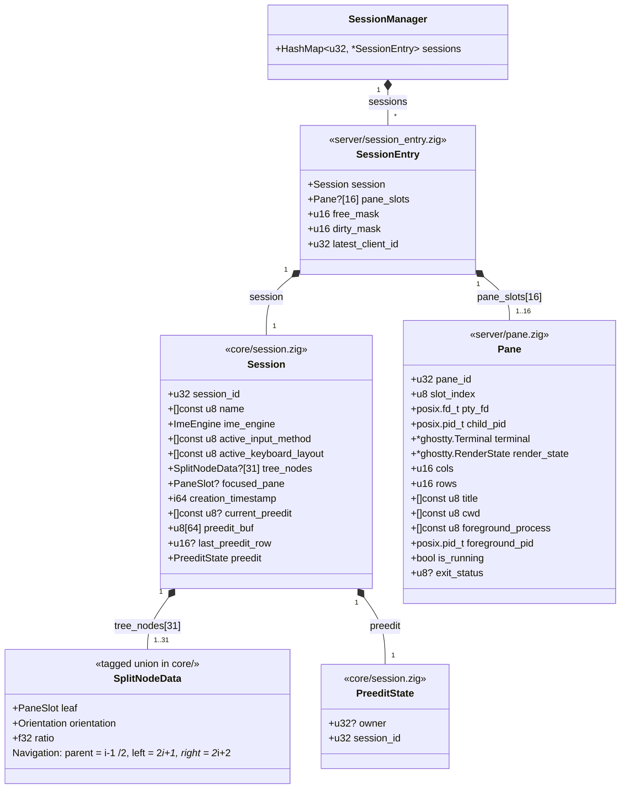

# State Tree Types — Implementation Reference

> **Transient artifact**: Type definitions for implementer reference. Deleted
> when the types exist in code.

Source: `daemon-architecture/draft/v1.0-r8/02-state-and-types.md` §1.2-§1.3

---

## Class Diagram (Detailed)



## Type Definitions

```zig
// core/constants.zig
pub const MAX_PANES = 16;
pub const MAX_TREE_NODES = MAX_PANES * 2 - 1; // 31

pub const PaneId = u32;
pub const PaneSlot = u8; // 0..15, indexes into pane_slots array

// core/session.zig — pane_slots, free_mask, dirty_mask removed (now in SessionEntry)
pub const Session = struct {
    session_id: u32,
    name: []const u8,
    ime_engine: ImeEngine,
    active_input_method: []const u8,
    active_keyboard_layout: []const u8,
    tree_nodes: [MAX_TREE_NODES]?SplitNodeData, // 31 entries, root at index 0
    focused_pane: ?PaneSlot,
    creation_timestamp: i64,
    current_preedit: ?[]const u8,
    preedit_buf: [64]u8,
    last_preedit_row: ?u16,
    preedit: PreeditState,          // multi-client ownership tracking
};

// core/session.zig — multi-client preedit ownership (replaces PanePreeditState)
pub const PreeditState = struct {
    owner: ?u32,       // client_id of composing client, null = no active composition
    session_id: u32,   // monotonic counter for PreeditStart/Update/End/Sync wire messages
};

// server/session_entry.zig — server-side wrapper bundling Session with pane-slot management
const SessionEntry = struct {
    session: Session,
    pane_slots: [MAX_PANES]?Pane,  // by value, indexed by PaneSlot (0..15)
    free_mask: u16,                 // bitmap of available pane slots
    dirty_mask: u16,                // one bit per pane slot
    latest_client_id: u32,          // client_id of the most recently active client (KeyEvent/WindowResize);
                                    // used by the `latest` resize policy; 0 = no active client
};

// core/split_node.zig
pub const SplitNodeData = union(enum) {
    leaf: PaneSlot,
    split: struct {
        orientation: enum { horizontal, vertical },
        ratio: f32,
    },
};

// server/pane.zig — stored by value in SessionEntry.pane_slots
pub const Pane = struct {
    pane_id: PaneId,
    slot_index: PaneSlot, // position in owning SessionEntry's pane_slots
    pty_fd: posix.fd_t,
    child_pid: posix.pid_t,
    terminal: *ghostty.Terminal,
    render_state: *ghostty.RenderState,
    cols: u16,
    rows: u16,
    // Pane metadata — tracked via terminal.vtStream() processing
    title: []const u8,              // OSC 0/2 title sequences
    cwd: []const u8,                // shell integration CWD (OSC 7)
    foreground_process: []const u8, // foreground process name
    foreground_pid: posix.pid_t,    // foreground process PID
    is_running: bool,               // false after child process exits
    exit_status: ?u8,               // set on process exit
    // Two-phase SIGCHLD model flags.
    // Both flags must be set before executePaneDestroyCascade() triggers.
    pane_exited: bool,              // set by SIGCHLD handler after waitpid()
    pty_eof: bool,                  // set by PTY read handler on EV_EOF
    // Silence detection
    silence_subscriptions: BoundedArray(SilenceSubscription, MAX_SILENCE_SUBSCRIBERS),
    silence_deadline: ?i64,  // now + min(thresholds), null = disarmed
};
```
