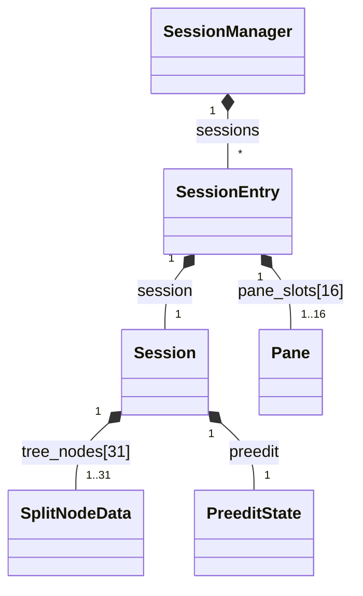
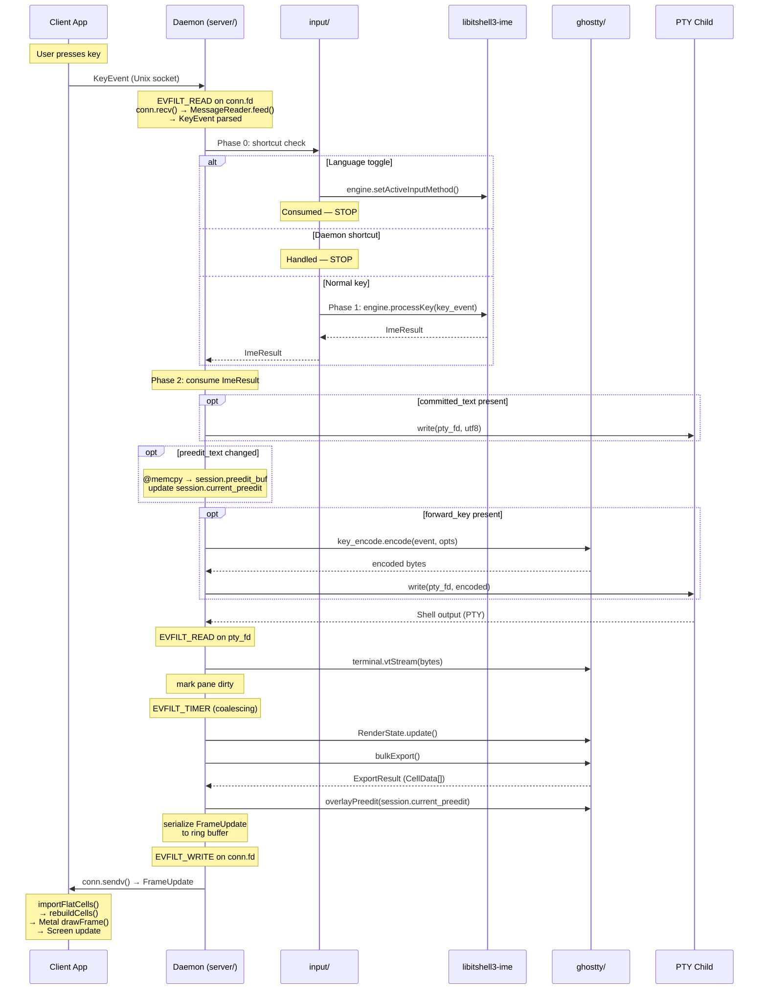
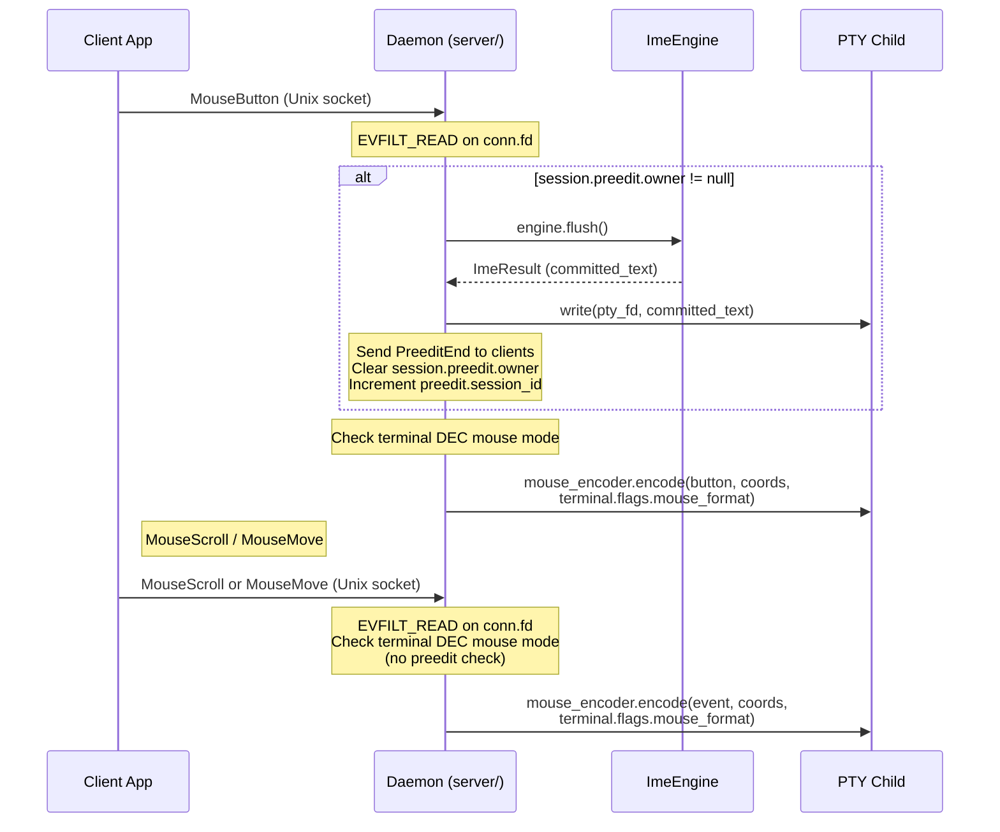

# State Tree, Types, and Data Flow

- **Date**: 2026-03-24
- **Scope**: State tree hierarchy, type definitions, pane navigation algorithm,
  end-to-end data flow, preedit cache design, and ring buffer architecture for
  the libitshell3 daemon

---

## 1. State Tree

### 1.1 Decision

Session = Tab merge. No intermediate Tab entity. Each Session directly owns an
array-based binary split tree (`[31]?SplitNodeData`). Pane slots (`[16]?Pane`)
are managed by `SessionEntry`, a server-side wrapper around Session (see Section
1.2). 16-pane-per-session limit (see `01-module-structure.md` Section 1.5).

### 1.2 Hierarchy



**Tree node array vs pane slot array**: These are separate index spaces. Tree
node indices (0..30) identify positions in the `[31]?SplitNodeData` array (in
`Session`). Pane slot indices (0..15) identify positions in the `[16]?Pane`
array (in `SessionEntry`). Leaf nodes store pane slot indices. Tree compaction
(subtree relocation during split/close) moves tree nodes but does not change the
pane slot indices stored in leaf values. Pane slot indices are stable across
tree mutations.

**Tree mutation complexity**: Split and close operations require subtree
relocation within the tree node array. With max depth 4 and 31 nodes, this is
bounded at ~15 node copies per operation — trivially fast on cache-hot data (the
entire tree fits in L1 cache).

### 1.3 Type Definitions and Size Constants

#### Fixed-Size Buffer Constants

All string fields in core types use `[N]u8` + `_length` inline buffers (ADR
00058). No allocator dependency, no lifetime management, no allocation failure.

| Constant                   | Value | Rationale                              |
| -------------------------- | ----- | -------------------------------------- |
| `MAX_SESSION_NAME`         | 64    | Session name for display               |
| `MAX_INPUT_METHOD_NAME`    | 32    | Identifier (`"korean_2set"`)           |
| `MAX_KEYBOARD_LAYOUT_NAME` | 32    | Identifier (`"qwerty"`)                |
| `MAX_PREEDIT_BUF`          | 64    | UTF-8 preedit overlay                  |
| `MAX_PANE_TITLE`           | 256   | Terminal title (OSC 0/2)               |
| `MAX_SESSIONS`             | 64    | Static array capacity (ADR 00052)      |
| `MAX_PANE_CWD`             | 4096  | Current working directory (`PATH_MAX`) |

#### Core Types

**Session** (`core/session.zig`):

| Field                           | Type                             | Notes                           |
| ------------------------------- | -------------------------------- | ------------------------------- |
| `session_id`                    | `u32`                            | Global monotonic identifier     |
| `name`                          | `[MAX_SESSION_NAME]u8`           | Inline buffer                   |
| `name_length`                   | `u8`                             | Active bytes in `name`          |
| `ime_engine`                    | `ImeEngine`                      | Vtable interface                |
| `active_input_method`           | `[MAX_INPUT_METHOD_NAME]u8`      | Default `"direct"`              |
| `active_input_method_length`    | `u8`                             | Active bytes                    |
| `active_keyboard_layout`        | `[MAX_KEYBOARD_LAYOUT_NAME]u8`   | Default `"qwerty"`              |
| `active_keyboard_layout_length` | `u8`                             | Active bytes                    |
| `tree_nodes`                    | `[MAX_TREE_NODES]?SplitNodeData` | 31 entries, root at index 0     |
| `focused_pane`                  | `?PaneSlot`                      |                                 |
| `creation_timestamp`            | `i64`                            |                                 |
| `current_preedit`               | `?[]const u8`                    | Points into `preedit_buf`       |
| `preedit_buf`                   | `[MAX_PREEDIT_BUF]u8`            | Inline buffer for preedit cache |
| `last_preedit_row`              | `?u16`                           | Dirty tracking for preedit      |
| `preedit`                       | `PreeditState`                   | Multi-client ownership tracking |

**KeyEvent** (`core/key_event.zig`):

| Field         | Type        | Notes                                                                                                           |
| ------------- | ----------- | --------------------------------------------------------------------------------------------------------------- |
| `hid_keycode` | `u8`        | USB HID usage code (0x00–0xE7). Wire carries u16 (doc 04); daemon truncates/validates to u8 before IME routing. |
| `shift`       | `bool`      | Extracted from wire bit 0                                                                                       |
| `modifiers`   | `Modifiers` | Packed struct with 5 fields (see below)                                                                         |

**KeyEvent.Modifiers** (`packed struct(u8)`):

| Field       | Bit | Notes                                                                                         |
| ----------- | --- | --------------------------------------------------------------------------------------------- |
| `ctrl`      | 0   | Triggers composition flush                                                                    |
| `alt`       | 1   | Triggers composition flush                                                                    |
| `super_key` | 2   | Triggers composition flush                                                                    |
| `caps_lock` | 3   | Dual purpose: Phase 0 language toggle detection + Phase 1 direct/English mode case resolution |
| `num_lock`  | 4   | Phase 1 numpad key classification: printable (NumLock on) vs navigation (NumLock off)         |
| `_padding`  | 5-7 | Reserved                                                                                      |

`hasCompositionBreakingModifier()` returns `true` for `ctrl`, `alt`,
`super_key`; returns `false` for `caps_lock`, `num_lock`. CapsLock and NumLock
are "input classification" modifiers that affect key identity (letter case,
numpad function) but do NOT interrupt Hangul composition.

**SplitNodeData** (`core/split_node.zig`):

```zig
pub const SplitNodeData = union(enum) {
    leaf: PaneSlot,
    split: struct {
        orientation: enum { horizontal, vertical },
        ratio: u32, // fixed-point x10^4, range 0-10000 (5000 = 50.00%)
    },
};
```

`MIN_RATIO = 500` (5%) prevents zero-size panes. Resize operations clamp to
`[MIN_RATIO, 10000 - MIN_RATIO]`.

> **Cell grid model (ADR 00063)**: Split borders occupy 0 cells in the terminal
> grid. Pane dimensions are computed by integer arithmetic:
> `child_size = parent_size * ratio / 10000`. The cell grid is the authoritative
> coordinate system — there is no sub-cell or pixel-based layout.

**Pane** (`server/pane.zig`):

| Field                       | Type                   | Notes                                        |
| --------------------------- | ---------------------- | -------------------------------------------- |
| `pane_id`                   | `PaneId`               | Global monotonic u32                         |
| `slot_index`                | `PaneSlot`             | Position in owning SessionEntry              |
| `pty_fd`                    | `posix.fd_t`           |                                              |
| `child_pid`                 | `posix.pid_t`          |                                              |
| `terminal`                  | `*ghostty.Terminal`    |                                              |
| `render_state`              | `*ghostty.RenderState` |                                              |
| `cols`                      | `u16`                  |                                              |
| `rows`                      | `u16`                  |                                              |
| `title`                     | `[MAX_PANE_TITLE]u8`   | OSC 0/2 title, inline buffer                 |
| `title_length`              | `u16`                  | Active bytes in `title`                      |
| `cwd`                       | `[MAX_PANE_CWD]u8`     | Shell integration CWD (OSC 7), inline buffer |
| `cwd_length`                | `u16`                  | Active bytes in `cwd`                        |
| `foreground_process`        | `[MAX_SESSION_NAME]u8` | Foreground process name, inline buffer       |
| `foreground_process_length` | `u8`                   | Active bytes                                 |
| `foreground_pid`            | `posix.pid_t`          |                                              |
| `is_running`                | `bool`                 | False after child process exits              |
| `exit_status`               | `?u8`                  | Set on process exit                          |
| `pane_exited`               | `bool`                 | Two-phase SIGCHLD: set by waitpid()          |
| `pty_eof`                   | `bool`                 | Two-phase SIGCHLD: set on EV_EOF             |

**SessionEntry** (`server/session_entry.zig`):

| Field              | Type               | Notes                                                 |
| ------------------ | ------------------ | ----------------------------------------------------- |
| `session`          | `Session`          | Core session state                                    |
| `pane_slots`       | `[MAX_PANES]?Pane` | By value, indexed by PaneSlot (0..15)                 |
| `free_mask`        | `u16`              | Bitmap of available pane slots                        |
| `dirty_mask`       | `u16`              | One bit per pane slot                                 |
| `latest_client_id` | `u32`              | Most recently active client (resize policy); 0 = none |

**SessionManager**: `[MAX_SESSIONS]?SessionEntry` fixed-size array (ADR 00052).
Linear scan for lookup.

### 1.4 PTY Lifecycle

Each Pane owns a PTY master fd (`pty_fd`) and a child process (`child_pid`). The
daemon manages the full PTY lifecycle:

**Process exit (two-phase SIGCHLD handling)**: When a pane's child process
exits, the daemon uses a two-phase handling model: reap and mark the process in
the SIGCHLD handler, then drain remaining PTY output before destroying the pane.
This ensures the user sees the child's final output before the pane disappears.
See the daemon behavior docs for the authoritative specification, including the
dual-flag model (`PANE_EXITED` + `PTY_EOF`), event processing priority, and the
complete `executePaneDestroyCascade()` procedure.

When a pane is explicitly closed via `ClosePaneRequest`, the daemon sends SIGHUP
to the child process via the PTY. If the `force` flag is set and the process
does not terminate within a timeout, SIGKILL is sent.

When a session is destroyed (`DestroySessionRequest`), all panes are closed —
all child processes receive SIGHUP, all PTY fds are freed.

**Resize (TIOCSWINSZ + debounce)**: When pane dimensions change (due to window
resize, split adjustment, or client attach/detach), the daemon issues
`ioctl(pane.pty_fd, TIOCSWINSZ, &new_size)` to update the PTY dimensions. This
triggers SIGWINCH in the child process.

Resize is debounced at **250ms per pane**, matching tmux's approach. This
prevents SIGWINCH storms during rapid resize drags. Exception: the FIRST resize
after session creation or client attach fires immediately (no debounce).

During the debounce window and for 500ms after the debounce fires, the server
MUST NOT transition the pane's coalescing tier to Idle — the PTY application is
processing SIGWINCH and may briefly pause output, which is not true idleness.

### 1.5 Layout Enforcement

The server enforces the 16-pane limit by rejecting `SplitPaneRequest` with
`ErrorResponse` status `PANE_LIMIT_EXCEEDED` when a split would exceed
`MAX_PANES`. This is validated server-side before the split operation begins.

The tree depth is bounded by the pane limit: with `MAX_PANES = 16` and a binary
split tree, the maximum depth is 4 (a perfectly unbalanced tree of 16 panes has
depth 15, but such extreme imbalance requires 15 consecutive splits in the same
direction — practical layouts are much shallower). The `[31]?SplitNodeData`
array bounds the tree absolutely.

### 1.6 Pane Metadata Tracking

The daemon tracks per-pane metadata derived from terminal output and process
state. Changes are detected during `terminal.vtStream()` processing and SIGCHLD
handling, then broadcast to attached clients via `PaneMetadataChanged`.

| Metadata                     | Source                                              | Update mechanism                                                                   |
| ---------------------------- | --------------------------------------------------- | ---------------------------------------------------------------------------------- |
| `title`                      | OSC 0/2 escape sequences                            | ghostty's VT parser extracts title from escape sequences during `vtStream()`       |
| `cwd`                        | OSC 7 (shell integration)                           | Shell-integration-aware shells emit CWD via OSC 7; ghostty's VT parser extracts it |
| `foreground_process`         | `/proc/<pid>/cwd` polling or `kqueue` `EVFILT_PROC` | Daemon polls or monitors the foreground process group                              |
| `foreground_pid`             | Process group tracking                              | Updated when foreground process changes                                            |
| `is_running` / `exit_status` | SIGCHLD + `waitpid()`                               | Daemon reaps child and records exit status                                         |

Only changed fields are sent in `PaneMetadataChanged` — clients detect changes
by checking which fields are present in the JSON payload.

**Relationship between `PaneMetadataChanged` and `ProcessExited`**: These are
two complementary notification channels that serve different purposes and
operate on different subscription models:

- **`PaneMetadataChanged`** (always-sent): A field-update notification. When the
  process exits, the daemon sets `pane.is_running = false` and
  `pane.exit_status`, then sends `PaneMetadataChanged` with those updated field
  values. Every attached client receives this automatically regardless of any
  subscription state. The notification's purpose is to keep clients' cached pane
  state in sync with the daemon's pane state — the same mechanism used for title
  changes, CWD updates, and foreground-process changes.

- **`ProcessExited`** (opt-in): An event notification. Clients that have
  subscribed via `Subscribe` (0x0810) receive `ProcessExited` in addition to the
  always-sent `PaneMetadataChanged`. `ProcessExited` provides an explicit, typed
  signal for process-exit events, enabling clients that care about lifecycle
  events (e.g., showing exit-status banners, playing a sound) to react without
  inspecting every `PaneMetadataChanged` payload.

On process exit, **both** fire: `PaneMetadataChanged` (always) carries the
updated `is_running` and `exit_status` field values; `ProcessExited` (if
subscribed) signals the event. Clients that only need current pane state use the
metadata update; clients that want event-driven lifecycle notifications
subscribe to `ProcessExited`.

### 1.7 Session = Tab Merge Rationale

- Session:Tab is 1:1 in v1. An intermediate Tab entity with no distinct behavior
  violates YAGNI. When Phase 3 needs multiple tabs per session, Tab can be
  introduced as an intermediate node between Session and SplitNode.
- Per-session ImeEngine maps cleanly: one engine per "thing the user switches
  between."
- The protocol already treats Sessions as the unit clients attach to. There is
  no Tab entity in the protocol — "tabs" are a client UI concept mapped to
  Sessions.

### 1.8 Preedit Cache

Session caches the current preedit text (`current_preedit: ?[]const u8`, backed
by a 64-byte `preedit_buf`) from the last `ImeResult` for use at export time.

**Why caching is necessary**: The ImeEngine vtable has no "get current preedit"
method. Preedit text is only available via `ImeResult` from mutating calls. Per
IME contract, the engine's internal buffers are invalidated on the next mutating
call.

**Cache update flow**: When `ImeResult.preedit_changed == true`, the session
copies the preedit text into `preedit_buf` via `@memcpy` and points
`current_preedit` at the copied slice. `overlayPreedit()` reads from
`session.current_preedit`, never from the engine directly.

**Lifetime semantics**: The engine's buffer is ground truth at `processKey()`
time; the Session's copy is ground truth at export time. Different lifetimes,
different purposes — this is a necessary cache, not a DRY violation.

> **Normative note — Authoritative preedit source**: `Session.current_preedit`
> is the single authoritative source of preedit text for both rendering
> (`overlayPreedit()` at export time) and ownership operations (commit to PTY on
> focus transfer, client disconnect, or ownership transition). All consumers —
> PreeditUpdate wire messages, commit-to-PTY operations, and preedit overlay
> rendering — read from `session.current_preedit`. There is no second copy of
> preedit text; the `PreeditState` struct tracks multi-client ownership metadata
> only, not preedit content.

### 1.9 Dirty Tracking for Preedit

`last_preedit_row: ?u16` tracks the cursor row where preedit was last overlaid.
When preedit changes or clears, the previous row must be marked dirty in the
next export so that the old preedit cells are repainted with the underlying
terminal content. Without this tracking, clearing preedit would leave stale
composed characters on screen until the next terminal output touched that row.

### 1.10 Prior Art

- **Array-based binary tree (heap data structure)**: Fixed-size tree with index
  arithmetic — standard CS data structure used for the `[31]?SplitNodeData`
  layout.
- **cmux**: Uses binary split tree (Bonsplit library).
- **ghostty**: Split API uses the same model.
- **tmux**: `layout_cell` tree is conceptually identical.
- **tmux**: 250ms TIOCSWINSZ debounce — battle-tested approach for preventing
  SIGWINCH storms.

---

## 2. Pane Navigation Algorithm

Pure geometric function in `core/navigation.zig` for directional pane
navigation. Depends only on `core/` types (`SplitNodeData`, `PaneSlot`,
`MAX_TREE_NODES`) and integer parameters — no ghostty, OS, or protocol
dependencies. Fully unit-testable in isolation with synthetic tree
configurations.

### 2.1 Function Signature

```zig
// core/navigation.zig
pub const Direction = enum { up, down, left, right };

pub fn findPaneInDirection(
    tree_nodes: *const [MAX_TREE_NODES]?SplitNodeData,
    total_cols: u16,
    total_rows: u16,
    focused: PaneSlot,
    direction: Direction,
) ?PaneSlot
```

Returns `null` only for single-pane sessions (no navigation possible). In
multi-pane sessions, wrap-around guarantees a non-null result.

### 2.2 Algorithm: Edge Adjacency with Overlap Filtering

```
findPaneInDirection(tree_nodes, total_cols, total_rows, focused, direction):

    // Step 1: Compute geometric rectangles
    //   Walk tree_nodes, recursively accumulate split ratios using integer
    //   arithmetic (child_size = parent_size * ratio / 10000) to produce
    //   (x, y, w, h) for each leaf node. Stack-allocated [MAX_PANES]Rect.
    //   With MAX_PANES=16, this is 16 multiply-accumulate operations —
    //   trivially fast, entirely in L1 cache.
    rects = computeLeafRects(tree_nodes, total_cols, total_rows)
    focused_rect = rects[focused]

    // Step 2: Direction filter
    //   Collect candidate panes whose adjacent edge is in the target direction.
    //   up:    candidate.bottom_edge <= focused_rect.top_edge
    //   down:  candidate.top_edge   >= focused_rect.bottom_edge
    //   left:  candidate.right_edge <= focused_rect.left_edge
    //   right: candidate.left_edge  >= focused_rect.right_edge
    candidates = filter by direction adjacency

    // Step 3: Overlap filter
    //   Keep only candidates whose perpendicular span overlaps with focused.
    //   For up/down: candidate [x, x+w) must overlap focused [x, x+w)
    //   For left/right: candidate [y, y+h) must overlap focused [y, y+h)
    //   This eliminates diagonally offset panes with no visual adjacency.
    candidates = filter by perpendicular overlap

    // Step 4: Nearest selection with deterministic tie-break
    //   Select the candidate with the shortest edge distance (distance
    //   between focused edge and candidate's adjacent edge).
    //   Tie-break: lowest pane slot index (deterministic, no extra state).
    if candidates is not empty:
        return nearest candidate (lowest slot index on tie)

    // Step 5: Wrap-around
    //   No candidate in the target direction — search the opposite direction
    //   for the furthest pane with perpendicular overlap.
    //   Example: navigating up from the topmost pane selects the bottommost
    //   pane that has horizontal overlap.
    return furthest pane in opposite direction with overlap, or null
```

### 2.3 Example: 4-Pane Layout

```
+─────────────────+─────────────────+
│                 │                 │
│     Pane 0      │     Pane 1      │
│   (focused)     │                 │
│                 │                 │
+─────────────────+─────────────────+
│                 │                 │
│     Pane 2      │     Pane 3      │
│                 │                 │
│                 │                 │
+─────────────────+─────────────────+

Navigation from Pane 0 (focused):
  → right: Pane 1  (right edge adjacent, vertical overlap)
  → down:  Pane 2  (bottom edge adjacent, horizontal overlap)
  → left:  Pane 1  (wrap-around: furthest right with vertical overlap)
  → up:    Pane 2  (wrap-around: furthest down with horizontal overlap)
```

### 2.4 Design Decisions

See ADR 00046 (Edge Adjacency Pane Navigation) and ADR 00047 (Non-Configurable
Wrap-Around).

---

## 3. End-to-End Data Flow

### 3.1 Key Input Data Flow

The following shows the complete data path for a key input event, tying together
module decomposition, event loop, ghostty APIs, and the protocol/IME integration
defined in companion documents.



### 3.2 Mouse Event Data Flow

Mouse tracking is only active when the terminal's DEC mode state has mouse
reporting enabled (determined by `Options.fromTerminal()`).

**MouseButton** events trigger a preedit flush before forwarding to the
terminal. If the session has an active preedit composition
(`session.preedit.owner != null`), the daemon commits the preedit via the flush
sequence (clearing `preedit.owner` and incrementing `preedit.session_id`), then
processes the mouse button event. This ensures that clicking (e.g., to
reposition the cursor) does not silently discard in-progress composition.

**MouseScroll** and **MouseMove** events have no IME involvement — they are
forwarded directly to the terminal without a preedit check.

The daemon writes mouse escape sequences directly using
`mouse_encoder.encode()` + `terminal.flags.mouse_format`. The Surface-level
mouse APIs (`mouseButton()`, `mouseScroll()`, `mousePos()`) are NOT available on
headless Terminal — the daemon bypasses Surface entirely.



> **Preedit-ending paths and `preedit.session_id`**: All paths that end a
> preedit composition increment `preedit.session_id`. This includes:
> intra-session focus change (`handleIntraSessionFocusChange`), mouse button
> click (§3.2 above), pane close, session destroy (explicit
> `DestroySessionRequest` only — the last-pane auto-destroy path frees the
> session, so no increment occurs), client disconnect, and input method switch
> with `commit_current=true`. The `session_id` increment is a universal
> invariant across all preedit-ending paths — not specific to any single
> trigger.

---

## 4. Ring Buffer Architecture

The daemon uses a shared per-pane ring buffer for frame delivery to clients. The
ring buffer lives in `server/` — it is a server-side application-level delivery
optimization that depends on serialized wire-format frames (libitshell3-protocol
types) and manages per-client cursors. `core/` has no protocol dependency and no
client concept.

This section defines the ring buffer's data structure, sizing, cursor model,
delivery mechanism, and interaction with the frame export pipeline. For ring
buffer POLICIES (recovery procedures, ContinuePane cursor reset, coalescing tier
behavior), see the daemon behavior docs.

### 4.1 Per-Pane Shared Ring Buffer

Each pane owns a single ring buffer (default 2 MB, server-configurable). The
server serializes each frame (I-frame or P-frame) once into the ring. Per-client
read cursors track each client's delivery position within the ring.

```
Ring Buffer (per pane, in server/)
+-------+-------+-------+-------+-------+-------+
| I-0   | P-1   | P-2   | I-3   | P-4   | P-5   |  <- frame slots
+-------+-------+-------+-------+-------+-------+
  ^                        ^               ^
  |                        |               |
  oldest                   client B        client A
  (will be overwritten)    cursor          cursor
```

- **I-frame** (keyframe): Complete screen state. Self-contained — a client can
  render from an I-frame alone without any prior frames.
- **P-frame** (delta): Only changed rows since the last frame (cumulative dirty
  rows since last I-frame). Smaller than I-frames but requires the preceding
  I-frame as a base.

**Key properties**:

- **O(1) frame serialization**: Each frame is written to the ring exactly once,
  regardless of how many clients are attached.
- **O(1) memory per frame**: Frame data is not duplicated per client. All
  clients read from the same ring at their own cursor positions.
- **Shared data, independent cursors**: Clients at different coalescing tiers
  receive different subsets of frames from the same sequence, but each frame's
  content is identical regardless of which client receives it.

**Ring buffer parameters:**

| Parameter         | Default       | Configurable                            | Description                                        |
| ----------------- | ------------- | --------------------------------------- | -------------------------------------------------- |
| Ring size         | 2 MB per pane | Server config (not protocol-negotiated) | Total ring buffer capacity                         |
| Keyframe interval | 1 second      | Server config (0.5-5 seconds)           | How often the server writes an I-frame to the ring |

**Sizing analysis** (120x40 CJK worst case, 1s keyframe interval, 60fps Active
tier):

| Component                                         | Size    |
| ------------------------------------------------- | ------- |
| I-frame (120x40, 16-byte CellData entries)        | ~77 KB  |
| P-frame (typical 5 dirty rows)                    | ~10 KB  |
| 1 second of Active tier (60 P-frames + 1 I-frame) | ~677 KB |

2 MB covers typical interactive use with headroom. For sustained heavy output
(e.g., full-screen rewrite at maximum rate), the ring wraps and slow clients
skip to the latest I-frame — this is the correct recovery behavior (Section
5.6).

**Ring invariant:** The ring MUST always contain at least one complete I-frame
for each pane. When the ring write head is about to overwrite the only remaining
I-frame, the server MUST write a new I-frame before the overwrite proceeds. This
ensures any client seeking to the latest I-frame (recovery, attach,
ContinuePane) always finds one.

### 4.2 Per-Pane Dirty Tracking

The server maintains a single dirty bitmap per pane (the `dirty_mask` field on
`SessionEntry`, see Section 1.2). Frame data (I-frames and P-frames) is
serialized once per pane per frame interval and written to the shared per-pane
ring buffer. All clients viewing the same pane receive identical frame data from
the ring buffer.

### 4.3 Wire Format

The ring buffer stores pre-serialized wire-format frames (FrameEntry = header +
payload bytes). Frame serialization happens once at write time; delivery to
multiple clients is a memcpy from ring slot to send buffer. This avoids
per-client serialization overhead.

### 4.4 Two-Channel Socket Write Priority

The server maintains two per-client output channels with strict priority
ordering:

| Priority | Channel              | Content                                                        |
| -------- | -------------------- | -------------------------------------------------------------- |
| 1        | Direct message queue | Control messages, PreeditSync, PreeditUpdate, PreeditEnd, etc. |
| 2        | Shared ring buffer   | FrameUpdate (I-frames and P-frames)                            |

When a socket becomes writable (`EVFILT_WRITE`), the server drains the direct
queue first, then writes ring buffer frames. This guarantees that context
messages (e.g., `PreeditSync`, `PreeditUpdate`, `PreeditEnd`) always arrive at
the client before the `FrameUpdate` that reflects the same state change —
enabling the client to interpret cell data with correct composition context.

### 4.5 Per-Client Cursors

Each client maintains its own read cursor (position) into the ring buffer for
each visible pane:

```zig
const RingCursor = struct {
    position: usize,    // current read position in the ring
    last_i_frame: usize, // position of last I-frame sent to this client
};
```

Cursors are independent — clients at different frame rates (e.g., 60fps desktop,
20fps battery-saving iPad) read from the same ring at their own pace.

### 4.6 Frame Delivery

When the coalescing timer fires (`EVFILT_TIMER`), the daemon:

1. For each dirty pane: export frame data (`RenderState.update()` +
   `bulkExport()` + `overlayPreedit()`), serialize into the ring buffer as
   either I-frame or P-frame.
2. For each client in OPERATING state: check if the client has pending data
   (cursor behind write position).
3. If pending data exists and `conn.fd` is write-ready: call
   `conn.sendv(iovecs)` for zero-copy delivery from ring buffer.

### 4.7 Write-Ready and Backpressure

Frame delivery uses non-blocking writes via `EVFILT_WRITE` on `conn.fd`. The
event loop never blocks on socket sends. Three outcomes are handled: successful
write (advance cursor), socket buffer full (retry on next write-ready event),
and peer closed (disconnect client). `EVFILT_WRITE` is only enabled when a
client has pending data — disabled when caught up to avoid busy-looping.

### 4.8 Slow Client Recovery

When a client falls behind (its cursor is far from the write position and the
ring is about to wrap):

1. The ring buffer detects that the client's cursor would be overwritten by new
   data.
2. Instead of accumulating stale P-frames, the client's cursor **skips to the
   latest I-frame**.
3. The client receives a complete screen state (I-frame) and resumes normal
   P-frame delivery from that point.

This prevents slow clients from:

- Consuming unbounded memory (no P-frame accumulation queue)
- Receiving stale delta sequences that produce visual corruption
- Blocking the ring buffer from advancing

The I-frame skip is transparent to the client — it receives a full screen
update, which it can render directly.

### 4.9 I-Frame Scheduling Algorithm

I-frames (keyframes) are produced periodically for state recovery:

- **Default interval**: 1 second (configurable 0.5–5 seconds via server
  configuration).
- **No-op when unchanged**: When the I-frame timer fires and the pane has no
  changes since the last I-frame, no frame is written to the ring — the most
  recent I-frame already in the ring provides correct state for any seeking
  client.
- **Full state on change**: When the timer fires and changes exist, the server
  writes `frame_type=1` (I-frame) containing all rows.
- **Timer independence**: The I-frame timer fires at a fixed interval regardless
  of PTY throughput or coalescing tier state.

### 4.10 Preedit Delivery Path

All frames, including those containing preedit cell data, go through the ring
buffer. There are no bypass paths for preedit content. Coalescing Tier 0
(Preedit tier, immediate flush at 0ms) ensures preedit-containing frames are
written to the ring immediately upon keystroke, maintaining <33ms preedit
latency over Unix socket.

The dedicated preedit protocol messages (0x0400–0x0405) are sent separately via
the direct message queue (priority 1, outside the ring buffer). During
resync/recovery, `PreeditSync` is enqueued in the direct message queue, arriving
BEFORE the I-frame from the ring. This follows the "context before content"
principle — the client processes `PreeditSync` first (records composition
metadata), then processes the I-frame (renders the grid including preedit cells
with full context).

### 4.11 Multi-Client Ring Read

All clients attached to a session receive `FrameUpdate` messages for all panes
in that session from the shared per-pane ring buffer — not just the focused
pane. Each client reads from the ring at its own cursor position via
per-(client, pane) coalescing tiers. For coalescing tier definitions and
tier-transition policies, see the daemon behavior docs.
