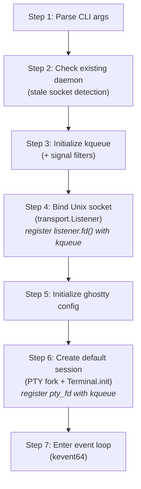
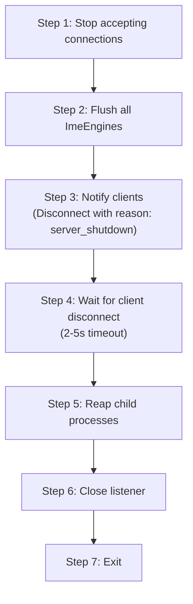

# Daemon Lifecycle — Implementation Reference

> **Transient artifact**: Copied from r7 pseudocode. Deleted when implemented as
> code with debug assertions.

Source: `daemon/draft/v1.0-r7/03-lifecycle-and-connections.md` §1 and §2

---

Copied verbatim from r7:

## 1. Daemon Startup

The daemon follows a 7-step startup sequence. Each step has a single
responsibility, a clear failure mode, and a defined recovery action. Steps are
ordered by dependency: kqueue must exist before FDs can be registered, ghostty
config must be loaded before Terminal instances are created, etc.

### 1.1 Startup Sequence



#### Step 1: Parse CLI Arguments

| Argument        | Default     | Description                                                                         |
| --------------- | ----------- | ----------------------------------------------------------------------------------- |
| `--server-id`   | `"default"` | Identifies this daemon instance. Used in socket path resolution.                    |
| `--socket-path` | (computed)  | Override the socket path. Bypasses the 4-step resolution algorithm.                 |
| `--foreground`  | `false`     | Run in foreground. Skips LaunchAgent registration. Required for SSH fork+exec mode. |

#### Step 2: Check Existing Daemon

Uses `transport.connect()` to probe the resolved socket path:

| Probe result        | Meaning                                | Action                                                                                                                    |
| ------------------- | -------------------------------------- | ------------------------------------------------------------------------------------------------------------------------- |
| Connection succeeds | Daemon already running                 | Exit with message: "daemon already running at {path}"                                                                     |
| `ECONNREFUSED`      | Stale socket (previous daemon crashed) | Transport layer's stale socket detection reports this to caller. Caller proceeds — `Listener.init()` will handle cleanup. |
| `ENOENT`            | No socket file                         | Proceed (first startup)                                                                                                   |

This step prevents two daemons from binding to the same socket path. The probe
uses the same `transport.connect()` API that clients use, ensuring identical
path resolution logic.

#### Step 3: Initialize kqueue

```
kqueue() -> kq_fd

Register signal filters:
  EVFILT_SIGNAL, SIGTERM  — graceful shutdown
  EVFILT_SIGNAL, SIGINT   — graceful shutdown (Ctrl-C in foreground mode)
  EVFILT_SIGNAL, SIGHUP   — graceful shutdown (terminal hangup)
```

**Why step 3 (before socket bind)?** kqueue is created early so that FDs
produced by subsequent steps (listen_fd in step 4, pty_fd in step 6) can be
registered with kqueue immediately after creation. This eliminates a window
where events on those FDs could be missed between creation and registration.

Signal delivery via `EVFILT_SIGNAL` requires the corresponding signals to be
blocked with `sigprocmask(SIG_BLOCK, ...)` so they are consumed by `kevent64()`
rather than invoking default signal handlers. The block mask is set once at
daemon startup, before any FDs are created.

SIGCHLD is also registered via `EVFILT_SIGNAL` for child process reaping during
normal operation (see Section 3.2).

#### Step 4: Bind Unix Socket

```
transport.Listener.init(config)
  socket(AF_UNIX, SOCK_STREAM)
  -> stale socket detection (connect probe + unlink if ECONNREFUSED)
  -> mkdir(socket_dir, 0700)   (create parent directory if needed)
  -> bind(sock_fd, sockaddr_un)
  -> listen(sock_fd, backlog)
  -> chmod(socket_path, 0600)  (owner-only access)
  -> fcntl(sock_fd, F_SETFL, O_NONBLOCK)

Register listener.fd() with kqueue:
  EVFILT_READ on listen_fd — triggers on incoming connections
```

`transport.Listener.init()` encapsulates the full socket setup sequence. The
daemon receives a `Listener` value and registers `listener.fd()` with kqueue.
The transport layer owns socket creation, security setup, and stale socket
cleanup. The daemon owns event loop integration.

**Socket and directory permissions:** The `mkdir(socket_dir, 0700)` and
`chmod(socket_path, 0600)` calls form a two-layer defense. The directory
permission (0700) prevents other users from listing or traversing the socket
directory — they cannot discover socket file names. The socket permission (0600)
prevents other users from connecting even if they know the socket path. Both
layers are necessary: directory-only protection is insufficient because an
attacker who guesses the socket name could connect directly; socket-only
protection is insufficient because directory listing reveals the socket name to
all local users.

**Fail-safe on wrong permissions:** If the socket directory already exists,
`Listener.init()` checks its permissions with `stat()`. If the directory is not
owned by the current UID or its mode is more permissive than 0700, the daemon
refuses to start and exits with a descriptive error (e.g., "socket directory
{path} has mode 0755, expected 0700 — refusing to start"). This prevents a
daemon from inadvertently operating on a socket directory created by another
user or with relaxed permissions (e.g., from a previous manual `mkdir`).

**Socket path resolution** (in transport layer): `$ITSHELL3_SOCKET` ->
`$XDG_RUNTIME_DIR/itshell3/<server-id>.sock` ->
`$TMPDIR/itshell3-<uid>/<server-id>.sock` ->
`/tmp/itshell3-<uid>/<server-id>.sock`. This 4-step fallback algorithm is shared
by both daemon and client via the transport layer.

#### Step 5: Initialize ghostty Config

Load terminal configuration (font, colors, scrollback size, default palette) via
ghostty config APIs. This creates the shared config object used as a template
for all `Terminal.init()` calls. Must complete before step 6 creates the first
Terminal instance.

#### Step 6: Create Default Session

```
Allocate SessionEntry:
  session.session_id = 1
  session.name = "default"
  session.ime_engine = HangulImeEngine.init(allocator, "direct")
  pane_slots = [MAX_PANES]?Pane{null} // initialized empty
  free_mask = 0xFFFF
  dirty_mask = 0x0000

Create initial Pane:
  forkpty() -> (pty_fd, child_pid)
  Terminal.init(allocator, .{.cols = 80, .rows = 24})
  pane_id = 1

Register pty_fd with kqueue:
  EVFILT_READ on pty_fd — triggers on shell output
```

`forkpty()` combines `openpty()` + `fork()` + `login_tty()`. The child process
execs the user's shell (`$SHELL` or `/bin/sh`). The parent (daemon) receives the
master fd and child pid.

The Session's `tree_nodes[0]` is initialized as a single `SplitNodeData` leaf
pointing to pane slot 0. The `focused_pane` is set to `PaneSlot` 0.

#### Step 7: Enter Event Loop

```
loop {
    n = kevent64(kq_fd, changelist, eventlist, timeout)
    for eventlist[0..n] -> |event| {
        switch (event.filter, event.ident) {
            listen_fd, EVFILT_READ   => acceptClient()
            pty_fd, EVFILT_READ      => handlePtyOutput(pane)
            conn_fd, EVFILT_READ     => handleClientMessage(client)
            conn_fd, EVFILT_WRITE    => drainToClient(client)
            EVFILT_TIMER             => coalesceAndExport()
            EVFILT_SIGNAL            => handleSignal(event.ident)
        }
    }
}
```

The event loop is single-threaded (doc01 §2). All state mutations — key input
processing, PTY output handling, client message parsing, frame export,
connection accept/close — are serialized by the event loop. No locks, no
mutexes, no data races.

### 1.2 Startup Failure Modes

| Step | Failure                             | Action                                                                                                                              |
| ---- | ----------------------------------- | ----------------------------------------------------------------------------------------------------------------------------------- |
| 2    | Connection succeeds (daemon exists) | Exit with informational message. Not an error.                                                                                      |
| 3    | `kqueue()` fails                    | Fatal — exit with errno. Indicates severe OS resource exhaustion.                                                                   |
| 4    | `bind()` fails with `EADDRINUSE`    | Stale socket was not cleaned up. `Listener.init()` handles stale detection and cleanup internally. If bind still fails, fatal exit. |
| 4    | `mkdir()` fails with `EACCES`       | Fatal — cannot create socket directory. Log path and permissions.                                                                   |
| 5    | ghostty config load fails           | Fatal — cannot create Terminal instances without config.                                                                            |
| 6    | `forkpty()` fails                   | Fatal — cannot create initial PTY. Log errno (`EAGAIN` = process limit, `ENOMEM` = memory).                                         |
| 6    | `Terminal.init()` fails             | Fatal — out of memory for terminal state.                                                                                           |

All fatal failures exit with a non-zero status code and a descriptive log
message. There is no partial startup — either all 7 steps succeed or the daemon
does not enter the event loop.

## 2. Daemon Shutdown

Shutdown is triggered by three events:

1. **Signal**: SIGTERM, SIGINT, or SIGHUP received via `EVFILT_SIGNAL`
2. **Last session close**: The last remaining session's last pane exits (child
   process terminates, no sessions remain)
3. **Explicit command**: A client sends a shutdown request (future — not in v1)

All three trigger the same 7-step graceful shutdown sequence.

### 2.1 Graceful Shutdown Sequence



#### Step 1: Stop Accepting Connections

Remove `listen_fd` from kqueue. No new `accept()` calls will be made. Existing
connections continue to be serviced during the drain period.

#### Step 2: Flush All ImeEngines

For each session: call `entry.session.ime_engine.deactivate()`. This eagerly
flushes any active preedit composition:

- If the engine has pending preedit text, `deactivate()` returns an `ImeResult`
  with `committed_text` set.
- The daemon writes the committed text to the session's focused pane PTY via
  `write(pty_fd, committed_text)`.
- This ensures no user input is silently discarded during shutdown.
- If no composition is active, `deactivate()` returns `ImeResult{}` (all
  null/false) — zero cost.

#### Step 3: Notify Clients

Send `Disconnect` message with `reason: server_shutdown` to all connected
clients via their `conn.send()`. This is a best-effort notification — if
`send()` returns `.would_block` or `.peer_closed`, the daemon does not retry.

#### Step 4: Wait for Client Disconnect

Set a kqueue timer (EVFILT_TIMER, 2-5 seconds). Continue processing the event
loop during this window to allow clients to:

- Receive the `Disconnect` message
- Send any final messages (e.g., session detach acknowledgment)
- Close their connections gracefully

When all clients have disconnected (all `conn.fd` values closed by peers),
proceed immediately without waiting for the full timeout. If the timeout expires
with clients still connected, proceed anyway — force-close remaining
connections.

#### Step 5: Reap Child Processes

For each pane:

```
kill(child_pid, SIGHUP)       // signal shell to exit
waitpid(child_pid, WNOHANG)   // non-blocking reap attempt
close(pty_fd)                  // close PTY master
Terminal.deinit()              // free terminal state
```

`SIGHUP` is the conventional signal for "terminal hangup" — shells interpret it
as the terminal being closed and will exit. `WNOHANG` prevents blocking on a
slow-to-exit child. If `waitpid` returns 0 (child still running), the child
becomes orphaned and will be reaped by init/launchd. The daemon does NOT send
SIGKILL — that is excessively aggressive for a terminal multiplexer.

#### Step 6: Close Listener

```
listener.deinit()
  close(listen_fd)
  unlink(socket_path)    // remove socket file from filesystem
  free(path_string)      // deallocate socket path memory
```

`listener.deinit()` performs compound cleanup: close the listening fd, remove
the socket file, and free any allocated path string. This is the transport
layer's responsibility.

#### Step 7: Exit

`exit(0)` for clean shutdown, `exit(1)` for shutdown due to unrecoverable error.
