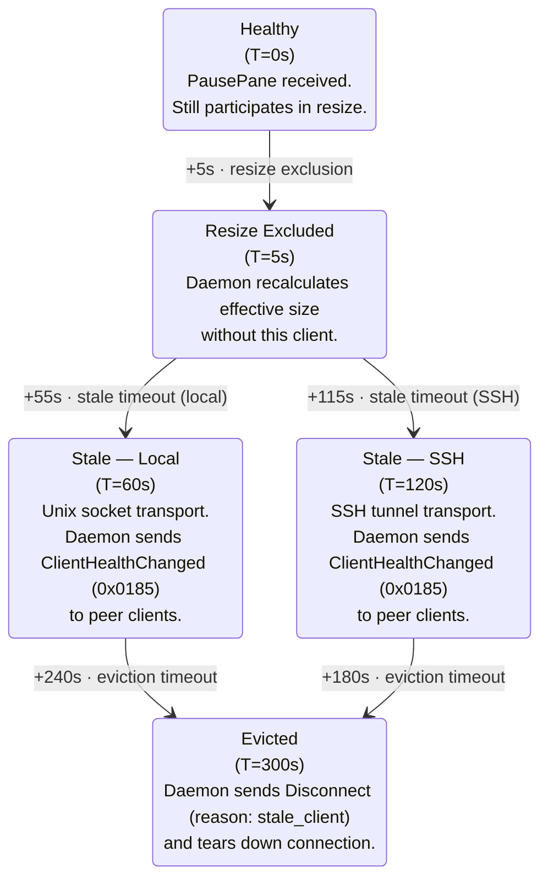

# Runtime Policies — Implementation Reference

> **Transient artifact**: Copied from r7 pseudocode. Deleted when implemented as
> code with debug assertions.

Sources:

- `daemon/draft/v1.0-r7/04-runtime-policies.md` §2.4–§2.6 (resize debounce), §3
  (health escalation), §4 (flow control), §5 (adaptive coalescing)
- `daemon/draft/v1.0-r7/03-lifecycle-and-connections.md` §5.3–§5.5 (ring buffer
  delivery, backpressure, slow client recovery)

---

Copied verbatim from r7:

## Resize Debounce (doc04 §2.4–§2.6)

### 2.4 Resize Debouncing

Resize is debounced at 250ms per pane to prevent SIGWINCH storms during rapid
resize drags.

### 2.5 Stale Re-Inclusion Hysteresis

When a stale client recovers (sends ContinuePane or any application-level
message), the daemon does NOT immediately include the recovering client's
dimensions in the resize calculation. Instead, a 5-second hysteresis period
applies:

1. Client recovers from stale state.
2. Daemon waits 5 seconds before including the client's dimensions.
3. If the client becomes resize-excluded again within the 5-second window, the
   inclusion is cancelled.

This prevents resize oscillation when a client is intermittently responsive
(e.g., iOS app cycling between foreground and background).

### 2.6 Resize Orchestration

When the effective terminal size changes (due to WindowResize, client
detach/attach, stale exclusion, or stale re-inclusion), the daemon:

1. Computes the new effective size per the active resize policy (§2.1).
2. Calls `ioctl(TIOCSWINSZ)` on each affected PTY to update terminal dimensions.
3. Sends `WindowResizeAck` to the requesting client (if triggered by
   WindowResize).
4. Sends `LayoutChanged` to ALL attached clients with updated pane dimensions.
5. Writes I-frame(s) for affected panes to the ring buffer.

Resize debounce (§2.4) and Idle suppression during the resize window (§5.7)
apply. The coalescing tier is not downgraded during active resize.

---

## Health Escalation (doc04 §3)

### 3.1 Client Health States

The daemon maintains two health states per client, orthogonal to connection
lifecycle:

| State     | Definition                               | Resize participation      | Frame delivery              |
| --------- | ---------------------------------------- | ------------------------- | --------------------------- |
| `healthy` | Normal operation                         | Yes                       | Full (per coalescing tier)  |
| `stale`   | Paused too long or output queue stagnant | No (excluded from resize) | None (ring cursor stagnant) |

`paused` (PausePane active) is an orthogonal flow-control state, not a health
state. A paused client remains `healthy` until the stale timeout fires.

### 3.2 PausePane Health Escalation Timeline



All timeouts are configurable via FlowControlConfig (Section 4.3). The 5s grace
period and the stale timeout serve different purposes:

- **5s grace**: "Should this client affect PTY dimensions right now?" (resize
  concern)
- **60s/120s stale**: "Is this client meaningfully participating in the
  session?" (health concern, triggers peer notification)

### 3.3 Stale Triggers

The stale timeout clock resets ONLY when the client sends a message that proves
application-level processing:

- ContinuePane
- KeyEvent
- WindowResize
- ClientDisplayInfo
- Any request message (CreateSession, SplitPane, etc.)

**HeartbeatAck does NOT reset the stale timeout.** On iOS, the OS can suspend
the application while keeping TCP sockets alive. The TCP stack continues to
respond to heartbeats even though the application event loop is frozen. If
HeartbeatAck reset the stale timeout, a backgrounded iPad client would never be
marked stale, and its stale dimensions would permanently constrain healthy
clients.

**Ring cursor stagnation as stale trigger**: In addition to PausePane duration,
the daemon uses ring cursor stagnation:

```
If client's ring cursor lag > 90% of ring capacity for stale_timeout_ms (60s/120s)
   AND client has not sent any application-level message during that period:
   -> transition to `stale`
```

This catches the "TCP alive but app frozen" scenario without wire format
changes.

The eviction timeout (300s) MAY reset on HeartbeatAck as a safety net against
false disconnects (the connection is alive, just slow).

### 3.4 Preedit Commit on Eviction (P13)

When the daemon evicts a stale client at T=300s:

1. If the evicted client owns an active preedit composition, the daemon commits
   (flushes) the preedit text to PTY.
2. The daemon sends `PreeditEnd` with `reason: "client_evicted"` to all
   remaining peer clients.
3. The daemon sends `Disconnect` with `reason: stale_client` to the evicted
   client and tears down the connection.

This prevents orphaned composition state. The commit happens before the
connection teardown.

### 3.5 Recovery from Stale

All recovery scenarios collapse into a single operation: advance the client's
ring cursor to the latest I-frame. The only variation is what additional
messages accompany recovery:

| Recovery trigger                               | Procedure                                                                                                                                                                                                                                                                                |
| ---------------------------------------------- | ---------------------------------------------------------------------------------------------------------------------------------------------------------------------------------------------------------------------------------------------------------------------------------------- |
| ContinuePane (after PausePane)                 | Advance cursor to latest I-frame. No additional messages.                                                                                                                                                                                                                                |
| Stale recovery                                 | Advance cursor to latest I-frame + enqueue LayoutChanged (if layout changed during stale period) and PreeditSync (if preedit active on any pane) into the direct message queue. Per socket write priority (Section 4.5), these context messages arrive BEFORE the I-frame from the ring. |
| Ring overwrite (cursor falls behind ring tail) | Advance cursor to latest I-frame. No additional messages.                                                                                                                                                                                                                                |

---

## Flow Control (doc04 §4)

### 4.1 PausePane (Advisory Signal)

PausePane is a client-to-server advisory signal indicating the client cannot
keep up with frame delivery. The daemon's ring buffer writes **unconditionally**
— PausePane does NOT stop the daemon from writing frames to the ring. PausePane
triggers the health escalation timeline (Section 3.2) and informs the daemon
that the client's ring cursor is expected to stagnate.

### 4.2 ContinuePane (Recovery)

When a client sends ContinuePane (or `auto_continue` triggers after the
configured timeout):

1. The daemon advances the client's ring cursor to the latest I-frame. The
   client receives the I-frame (a complete self-contained terminal state) and
   resumes normal incremental delivery from that point. No `last_processed_seq`
   field is needed — the ring cursor position already tracks the client's state.
2. Incremental updates resume from that point.
3. The client's coalescing tier is restored based on current throughput.

The I-frame IS the full state resync — same data, same wire format, no special
codepath.

### 4.3 FlowControlConfig

Clients configure flow control behavior via `FlowControlConfig` (0x0502). The
daemon acknowledges with `FlowControlConfigAck` (0x0503).

| Parameter             | Type | Default (local) | Default (SSH) | Description                                    |
| --------------------- | ---- | --------------- | ------------- | ---------------------------------------------- |
| `max_queue_age_ms`    | u32  | 5000            | 10000         | Max ring cursor lag before PausePane advisory  |
| `auto_continue`       | bool | true            | true          | Auto-send ContinuePane after PausePane timeout |
| `stale_timeout_ms`    | u32  | 60000           | 120000        | Time until stale transition                    |
| `eviction_timeout_ms` | u32  | 300000          | 300000        | Time until eviction after stale                |

The daemon selects transport-aware defaults based on the connection type.
Clients may override any parameter. Values of 0 disable the corresponding
timeout (except `eviction_timeout_ms`, which has a server-enforced minimum).

### 4.4 Smooth Degradation Before PausePane

Before resorting to PausePane, the daemon applies smooth degradation based on
ring cursor lag:

1. **Ring cursor lag > 50%** of ring capacity: Auto-downgrade coalescing tier
   (Active -> Bulk) for this client. Skip more P-frames.
2. **Ring cursor lag > 75%**: Force Bulk tier regardless of throughput.
3. **Ring cursor lag > 90%**: Client's next ContinuePane (or auto_continue)
   advances cursor to latest I-frame.
4. **Client sends ContinuePane**: Advance cursor. Resume incremental updates.
   Restore original tier.

This graduated approach keeps the client receiving updates for as long as
possible. PausePane is a last resort, not a routine flow control mechanism.

### 4.5 Socket Write Priority

The daemon maintains two queues per client:

1. **Direct message queue**: Control messages (LayoutChanged, PreeditSync,
   PreeditUpdate, PreeditEnd, session management responses). Higher priority.
   Dedicated preedit protocol messages (0x0400-0x0405) are sent via this queue,
   outside the ring buffer.
2. **Ring buffer**: Frame data (I-frames, P-frames). Lower priority. All frames,
   including those containing preedit cell data, go through the per-pane shared
   ring buffer. There is no separate bypass path for preedit frames.

On each writable event, the daemon drains the direct queue first, then writes
ring buffer data. This ensures context messages (e.g., LayoutChanged after stale
recovery, PreeditSync during resync) arrive before the I-frame that references
them — following the "context before content" principle.

---

## Adaptive Coalescing (doc04 §5)

### 5.1 Four-Tier Model

The daemon uses a 4-tier adaptive coalescing model (plus an Idle quiescent
state) to balance latency and throughput. Coalescing state is tracked per
(client, pane) pair.

| Tier | Name        | Min interval     | Trigger                                                        |
| ---- | ----------- | ---------------- | -------------------------------------------------------------- |
| 0    | Preedit     | 0 ms (immediate) | Preedit state change (PreeditStart, PreeditUpdate, PreeditEnd) |
| 1    | Interactive | 0 ms (immediate) | Keystroke echo, cursor movement                                |
| 2    | Active      | 16 ms (~60 fps)  | Sustained PTY output (e.g., `cat large_file`, build output)    |
| 3    | Bulk        | 33 ms (~30 fps)  | High-throughput PTY output sustained >500ms                    |
| --   | Idle        | No frames        | No PTY output for >100ms                                       |

### 5.2 Tier Transitions

Tier transitions use hysteresis to prevent oscillation:

- **Upgrade** (higher tier -> lower tier / faster): Immediate on trigger event.
- **Downgrade** (lower tier -> higher tier / slower): Requires sustained
  condition for a threshold period.
  - Interactive -> Active: sustained output >100ms
  - Active -> Bulk: sustained high throughput >500ms
  - Any -> Idle: no output >100ms

### 5.7 Idle Suppression During Resize

During an active resize drag (daemon receiving WindowResize events within the
250ms debounce window) and for **500ms after the debounce fires**, the daemon
suppresses the Idle timeout. The server MUST NOT transition the pane's
coalescing tier to Idle during this period — the PTY application is processing
SIGWINCH and may briefly pause output, which is not true idleness. This prevents
the coalescing state from dropping to Idle between resize events (which would
cause unnecessary I-frame generation on each resize step) and during the
post-debounce settling period.

---

## Ring Buffer Delivery (doc03 §5.3–§5.5)

### 5.3 Frame Delivery

When the coalescing timer fires (`EVFILT_TIMER`), the daemon:

1. For each dirty pane: export frame data (`RenderState.update()` +
   `bulkExport()` + `overlayPreedit()`), serialize into the ring buffer as
   either I-frame or P-frame.
2. For each client in OPERATING state: check if the client has pending data
   (cursor behind write position).
3. If pending data exists and `conn.fd` is write-ready: call
   `conn.sendv(iovecs)` for zero-copy delivery from ring buffer.

### 5.4 Write-Ready and Backpressure

Frame delivery uses `EVFILT_WRITE` on `conn.fd` to avoid blocking the event
loop:

```
sendv_result = client.conn.sendv(iovecs)
switch (sendv_result) {
    .bytes_written => |n| {
        advance client cursor by n bytes
        if cursor == write_position:
            // fully caught up — disable EVFILT_WRITE
            // (re-enable when new frame data is written)
        else:
            // partial write — keep EVFILT_WRITE armed
    },
    .would_block => {
        // socket send buffer full — keep EVFILT_WRITE armed
        // cursor stays at current position
        // next EVFILT_WRITE will retry
    },
    .peer_closed => {
        handleClientDisconnect(client)
    },
}
```

`EVFILT_WRITE` is only enabled when a client has pending data. When the client
is fully caught up, `EVFILT_WRITE` is disabled to avoid busy-looping (kqueue
reports write-ready continuously on an empty socket buffer).

### 5.5 Slow Client Recovery

When a client falls behind (its cursor is far from the write position and the
ring is about to wrap):

1. The ring buffer detects that the client's cursor would be overwritten by new
   data.
2. Instead of accumulating stale P-frames, the client's cursor **skips to the
   latest I-frame**.
3. The client receives a complete screen state (I-frame) and resumes normal
   P-frame delivery from that point.

This prevents slow clients from:

- Consuming unbounded memory (no P-frame accumulation queue)
- Receiving stale delta sequences that produce visual corruption
- Blocking the ring buffer from advancing

The I-frame skip is transparent to the client — it receives a full screen
update, which it can render directly.
