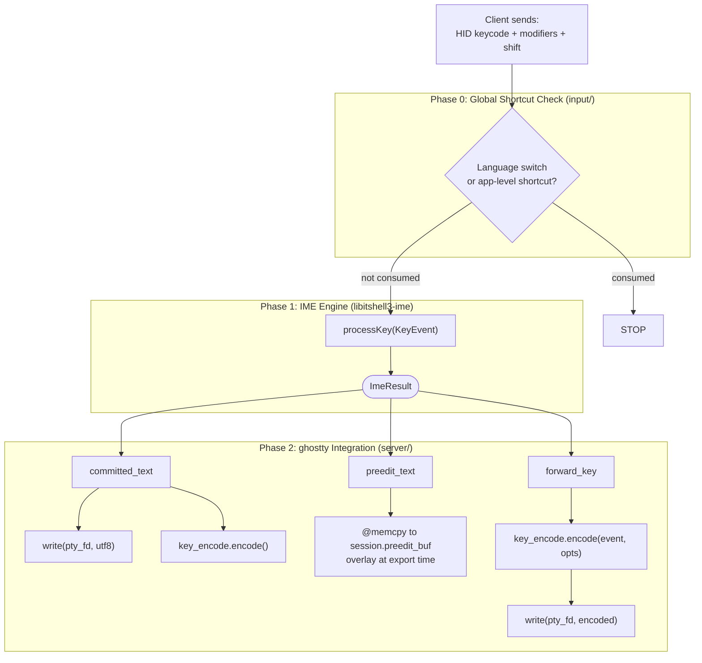
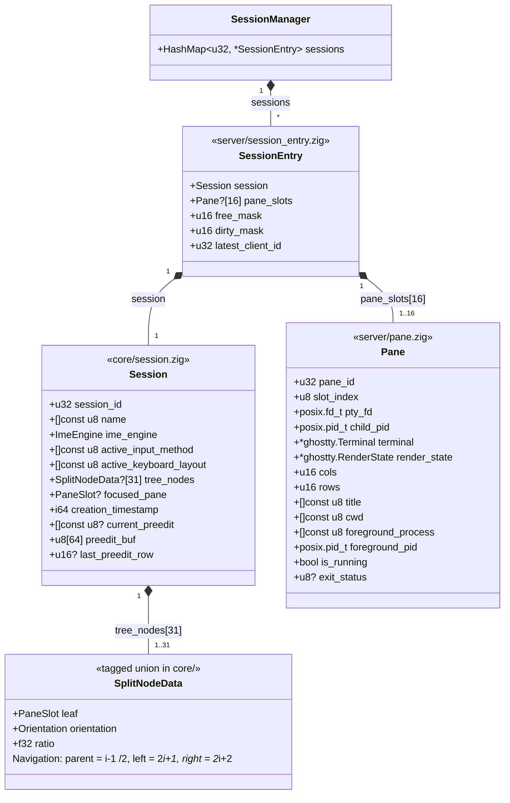
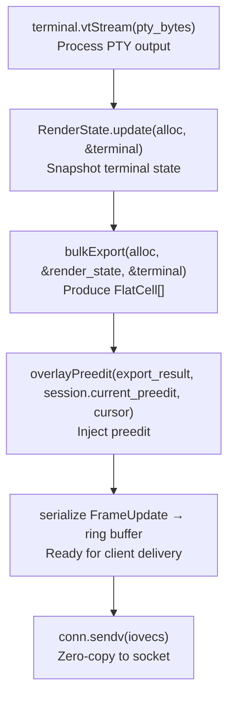
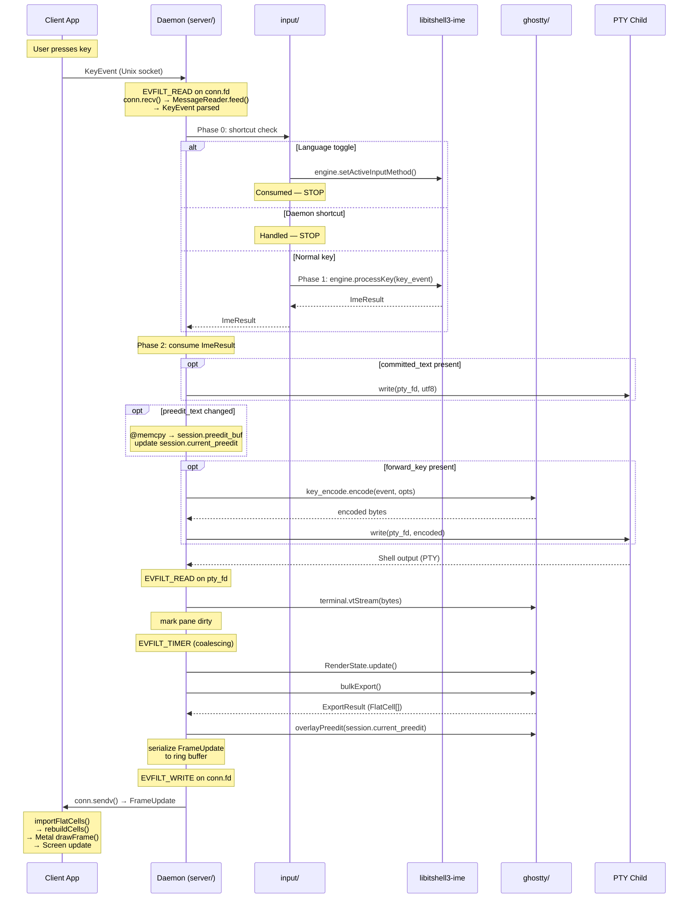
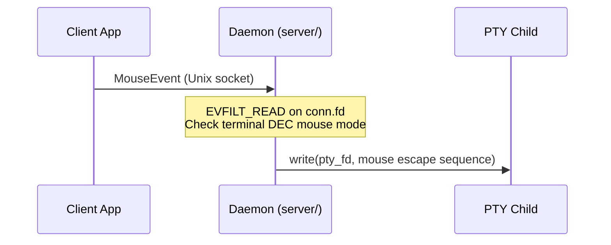

# Daemon Internal Architecture

- **Date**: 2026-03-11
- **Scope**: libitshell3 daemon internal module structure, event loop, state
  tree, and ghostty Terminal integration

---

## 1. Module Decomposition

libitshell3 is organized into 4 module groups with a diamond dependency graph.
`ghostty/` and `input/` are sibling modules that both depend on `core/`;
`server/` depends on all three.

### 1.1 Dependency Graph

```
      core/
     /    \
ghostty/  input/
     \    /
     server/
```

Dependencies point inward: `server/` depends on everything; `ghostty/` and
`input/` depend only on `core/`; `core/` depends on nothing. Circular
dependencies are prohibited.

### 1.2 Module Definitions

#### `core/` — Pure State Types

Zero dependencies on ghostty, OS, or protocol.

| Type            | Purpose                                                                                   |
| --------------- | ----------------------------------------------------------------------------------------- |
| `Session`       | Config, name, ImeEngine interface, preedit cache, focused pane, tree layout               |
| `SplitNodeData` | Binary split tree node (tagged union: `.leaf` = PaneSlot, `.split` = orientation + ratio) |
| `PaneId`        | `u32` opaque wire identifier (global monotonic, never reused)                             |
| `PaneSlot`      | `u8` session-local slot index (0..15) for fixed-size array operations                     |
| `MAX_PANES`     | Compile-time constant: 16 panes per session                                               |
| `ImeEngine`     | Vtable interface for input method engines                                                 |
| `KeyEvent`      | Key input event type consumed by IME routing                                              |
| `ImeResult`     | Result of IME processing (committed text, preedit, forward key)                           |

`core/` is unit-testable in isolation with zero external dependencies.

#### `ghostty/` — Thin Helper Functions

Depends on `core/` only. Contains helper functions (NOT wrapper types) for
ghostty's internal Zig APIs.

| Helper               | Wraps                                            | Purpose                                                      |
| -------------------- | ------------------------------------------------ | ------------------------------------------------------------ |
| Terminal lifecycle   | `Terminal.init(alloc, .{.cols, .rows})`          | Create headless Terminal instance                            |
| VT stream processing | `terminal.vtStream(bytes)`                       | Feed PTY output into terminal                                |
| RenderState snapshot | `RenderState.update(alloc, &terminal)`           | Capture terminal state for export                            |
| Cell data export     | `bulkExport(alloc, &render_state, &terminal)`    | Produce FlatCell[] for wire transfer                         |
| Key encoding         | `key_encode.encode(writer, event, opts)`         | Encode key events for PTY (stateless, pure function)         |
| Terminal mode query  | `Options.fromTerminal(&terminal)`                | Read DEC modes, Kitty flags                                  |
| Preedit injection    | `overlayPreedit(export_result, preedit, cursor)` | Overlay preedit cells post-export (~20 lines in vendor fork) |

**Why helper functions, not wrapper types**: ghostty's API is not stable.
Wrapper types would create a maintenance trap — every upstream API change would
require updating both the wrapper and the call site. Helper functions are a thin
layer that adds value (e.g., error mapping, parameter defaults) without creating
false abstraction. We have no second implementation of ghostty, so an
abstraction layer violates YAGNI.

#### `input/` — Key Routing Orchestration

Depends on `core/` only. No ghostty dependency.

**Scope**: The `input/` module handles Phase 0+1 of the 3-phase key processing
pipeline: shortcut interception (Phase 0), ImeEngine dispatch (Phase 1), focus
change handling (`handleIntraSessionFocusChange`), and input method switching
(`handleInputMethodSwitch`). Mouse events and paste operations bypass this
module entirely — they are handled directly in `server/`.

| Function                        | Phase | Purpose                                             |
| ------------------------------- | ----- | --------------------------------------------------- |
| `handleKeyEvent`                | 0 + 1 | Route key through shortcut check, then to ImeEngine |
| `handleIntraSessionFocusChange` | —     | Flush engine, clear preedit on old pane             |
| `handleInputMethodSwitch`       | 0     | Switch active input method                          |

`input/` depends on the `ImeEngine` interface type (defined in `core/`), not on
the concrete `HangulImeEngine` (in libitshell3-ime). This is dependency
inversion: `input/` code is testable with a `MockImeEngine` without libhangul.

##### 3-Phase Key Processing Pipeline

Every key event from a client passes through three sequential phases:



**Why IME runs before keybindings**: When the user presses Ctrl+C during Korean
composition (preedit = "하"), Phase 0 checks — Ctrl+C is not a language toggle.
Phase 1: engine detects Ctrl modifier, flushes "하", returns
`{ committed: "하", forward_key: Ctrl+C }`. Phase 2: committed text "하" is
written to PTY, then Ctrl+C is encoded via `key_encode.encode()` and written to
PTY. This ensures the user's in-progress composition is preserved before any
control key action.

For the internal `processKey()` decision algorithm (modifier handling, printable
key dispatch, libhangul composition), see `01-processkey-algorithm.md` in the
`libitshell3-ime` behavior docs.

Phase 0 and Phase 1 execute in `input/` (depends only on `core/`). Phase 2
executes in `server/` (depends on `ghostty/` for key encoding and preedit
overlay). See Section 1.3 for the Phase 2 placement rationale.

#### `server/` — Event Loop and I/O

Depends on `core/`, `ghostty/`, `input/`, libitshell3-ime, and
libitshell3-protocol.

| Component           | Purpose                                                                                      |
| ------------------- | -------------------------------------------------------------------------------------------- |
| Event loop          | kqueue-based, single-threaded (see Section 2)                                                |
| SessionEntry        | Server-side wrapper: Session (core/) + pane_slots + free_mask + dirty_mask (see Section 3.2) |
| Client manager      | Per-client state, connection lifecycle                                                       |
| Ring buffer         | Per-pane frame delivery with per-client cursors                                              |
| Frame coalescing    | Adaptive timer for batching frame updates                                                    |
| PTY I/O             | Read/write handlers for pane PTY file descriptors                                            |
| Phase 2 integration | Consume ImeResult: PTY writes, preedit cache update, key encoding                            |
| Pane struct         | Owns Terminal + RenderState + pty_fd + child_pid (see Section 3.3)                           |
| Startup/shutdown    | Daemon initialization and graceful teardown                                                  |

Socket setup is delegated to libitshell3-protocol's transport layer (Layer 4).

### 1.3 Phase 2 Placement

Phase 2 consumes `ImeResult` and performs:

- **I/O**: `write(pty_fd, committed_text)`, `write(pty_fd, encoded_key)`
- **ghostty API calls**: `key_encode.encode()`, `overlayPreedit()`
- **State mutation**: `@memcpy` preedit text to `session.preedit_buf`

Both I/O and ghostty dependencies belong in `server/`, not `input/`. The
`input/` module handles Phase 0 and Phase 1 only — pure routing logic that
depends solely on `core/` types.

### 1.4 Ring Buffer Placement

The ring buffer lives in `server/`, not in the protocol library or `core/`. The
ring buffer is a server-side application-level delivery optimization
(multi-client cursor management, writev scheduling) with no client-side
analogue. The protocol library provides transport-level I/O (Layer 4), but
application-level delivery strategies are the consumer's responsibility.

### 1.5 Pane Struct Placement and Fixed-Size Lookup

The Pane struct lives in `server/` because it owns both ghostty types (Terminal,
RenderState) and OS resources (pty_fd, child_pid). Placing it in `core/` would
violate the `core/ <- ghostty/` dependency rule.

A compile-time constant limits panes per session:

```zig
pub const MAX_PANES = 16;
pub const MAX_TREE_NODES = MAX_PANES * 2 - 1; // 31
```

The 16-pane limit is a UX-driven constraint, not a performance optimization. On
a 374x74 terminal, 16 panes at 93x18 is minimum viable; 32 panes at 93x9 is
unusable. The limit is enforced server-side via ErrorResponse when a client
requests a split that would exceed 16 panes.

Each session's pane slots are managed by `SessionEntry` (in `server/`), a
server-side wrapper around `Session` (see Section 3.2):

```zig
// server/session_entry.zig
pane_slots: [MAX_PANES]?Pane,  // by value, indexed by PaneSlot (0..15)
free_mask: u16,                 // bitmap of available slots
dirty_mask: u16,                // one bit per pane slot, set on PTY read
```

**Pane slot allocation**: `@ctz(free_mask)` gives the next free slot in one
instruction.

**Dirty tracking**: Set via `dirty_mask |= (1 << pane.slot_index)` on PTY read.
Iterate via `@ctz(dirty_mask)` (single instruction on x86 `TZCNT` and ARM64
`RBIT+CLZ`). Clear each bit after export: `dirty_mask &= dirty_mask - 1`.

**PaneId semantics**: PaneId on the wire is a global monotonic `u32`, never
reused within daemon lifetime. Internally, sessions use a session-local
`PaneSlot: u8` (0..15) for all fixed-size array operations. Wire-to-Pane lookup
uses per-session linear scan of `pane_slots` (at most 16 entries) — cold path
only. Hot paths (frame export, dirty iteration, PTY read) use slot indices
exclusively.

**Why global monotonic PaneId (not session-local 0..15) on the wire**:

1. **Pane-reuse race condition**: In async IPC, a client can have an in-flight
   message targeting a slot the server has already recycled. Global monotonic
   PaneId ensures stale messages target non-existent IDs and receive
   ErrorResponse.
2. **Protocol constraint leak**: Session-local PaneId (0..15) exposes the
   16-pane limit to wire semantics. Global monotonic u32 keeps the limit
   invisible to the protocol.
3. **Hot-path equivalence**: Both options have identical hot-path performance —
   all hot paths use slot indices, never PaneId.

`SessionManager` uses `HashMap(u32, *SessionEntry)` for sessions (dynamic count,
few instances — no fixed limit for sessions).

### 1.6 Inter-Library Dependencies

libitshell3 and libitshell3-protocol are separate libraries with a clean,
acyclic dependency relationship:

```
libitshell3-protocol  (standalone — depends only on Zig std; libssh2 added in Phase 5)
libitshell3-ime       (standalone — depends on libhangul)
libitshell3/core/     (standalone — no external deps)
libitshell3/ghostty/  (depends on core/, vendored ghostty)
libitshell3/input/    (depends on core/)
libitshell3/server/   (depends on core/, ghostty/, input/, libitshell3-ime, libitshell3-protocol)
```

**libitshell3-protocol does NOT import any libitshell3 types.** The protocol
library uses Zig primitive types (`u32`, `[]const u8`, etc.) for all message
fields. On the wire, `pane_id` and `session_id` are `u32` values in JSON
payloads — the protocol library reflects what the wire carries.

**`server/` maps between wire primitives and domain types.** Since `server/`
imports both `core/` and `libitshell3-protocol`, it is the natural boundary for
converting protocol message fields (e.g., `msg.pane_id: u32`) to domain types
(e.g., `core.PaneId`). This is a trivial one-line cast at each protocol handler.

**No shared types library is needed.** The types that might be shared
(`PaneId = u32`, session_id as `u32`) are trivial aliases. Extracting a
`libitshell3-types` library for two `u32` aliases would be over-engineering.

**libitshell3-protocol's external dependencies:**

- **v1**: Zig `std` only (posix sockets via `std.posix` for Layer 4 transport)
- **Phase 5**: `libssh2` added for SSH transport in Layer 4

### 1.7 Prior Art

- **tmux**: Separates pure state (`window.h`, `session.h`) from I/O (`tty.c`,
  `server-client.c`).
- **ghostty**: Separates terminal logic (`Terminal.zig`) from renderer
  (`Metal.zig`) and I/O (`Termio.zig`).

---

## 2. Event Loop Model

### 2.1 Decision

Single-threaded kqueue event loop (tmux model). No threads, no locks, no
mutexes.

### 2.2 Event Sources

All event types are handled in a single `kevent64()` call:

| Filter          | Source                  | Purpose                                                    |
| --------------- | ----------------------- | ---------------------------------------------------------- |
| `EVFILT_READ`   | PTY fds                 | Read shell output from pane child processes                |
| `EVFILT_READ`   | Socket listen fd        | Accept new client connections                              |
| `EVFILT_READ`   | Client conn fds         | Read client messages (key events, commands)                |
| `EVFILT_WRITE`  | Client conn fds         | Resume sending when socket becomes writable (after EAGAIN) |
| `EVFILT_TIMER`  | Coalescing timer        | Trigger frame export and delivery at adaptive intervals    |
| `EVFILT_TIMER`  | I-frame keyframe timer  | Periodic full-frame keyframes for state recovery           |
| `EVFILT_SIGNAL` | SIGTERM, SIGINT, SIGHUP | Graceful shutdown signals                                  |
| `EVFILT_SIGNAL` | SIGCHLD                 | Child process reaping                                      |

kqueue timers are kernel-managed, more efficient than userspace timer wheels.

### 2.3 Why Single-Threaded

**Performance**: `bulkExport()` is 22 us for 80x24, 217 us for 300x80. Even 10
panes at 60fps = 1.3% of a single core. Threading provides no measurable
benefit.

**Thread safety**: ghostty Terminal is NOT thread-safe. It uses internal arena
allocators and mutable page state. In normal ghostty, a shared mutex
synchronizes the IO thread and renderer thread. Our single-threaded design
eliminates this entirely.

**Correctness**: Single-threaded eliminates all concurrency hazards: no lock
ordering, no deadlocks, no data races on pane state, ImeEngine access, or ring
buffer writes. The event loop provides implicit serialization. The critical
runtime invariant — ImeResult must be consumed before the next engine call — is
naturally satisfied.

**Scalability**: tmux proves single-threaded scales to hundreds of panes with a
single libevent/kqueue loop.

### 2.4 Prior Art

- **tmux**: Single-threaded libevent loop, proven at scale with hundreds of
  sessions and panes.

---

## 3. State Tree

### 3.1 Decision

Session = Tab merge. No intermediate Tab entity. Each Session directly owns an
array-based binary split tree (`[31]?SplitNodeData`). Pane slots (`[16]?Pane`)
are managed by `SessionEntry`, a server-side wrapper around Session (see Section
3.2). 16-pane-per-session limit (see Section 1.5).

### 3.2 Hierarchy



**Tree node array vs pane slot array**: These are separate index spaces. Tree
node indices (0..30) identify positions in the `[31]?SplitNodeData` array (in
`Session`). Pane slot indices (0..15) identify positions in the `[16]?Pane`
array (in `SessionEntry`). Leaf nodes store pane slot indices. Tree compaction
(subtree relocation during split/close) moves tree nodes but does not change the
pane slot indices stored in leaf values. Pane slot indices are stable across
tree mutations.

**Tree mutation complexity**: Split and close operations require subtree
relocation within the tree node array. With max depth 4 and 31 nodes, this is
bounded at ~15 node copies per operation — trivially fast on cache-hot data (the
entire tree fits in L1 cache).

### 3.3 Type Definitions

```zig
// core/constants.zig
pub const MAX_PANES = 16;
pub const MAX_TREE_NODES = MAX_PANES * 2 - 1; // 31

pub const PaneId = u32;
pub const PaneSlot = u8; // 0..15, indexes into pane_slots array

// core/session.zig — pane_slots, free_mask, dirty_mask removed (now in SessionEntry)
pub const Session = struct {
    session_id: u32,
    name: []const u8,
    ime_engine: ImeEngine,
    active_input_method: []const u8,
    active_keyboard_layout: []const u8,
    tree_nodes: [MAX_TREE_NODES]?SplitNodeData, // 31 entries, root at index 0
    focused_pane: ?PaneSlot,
    creation_timestamp: i64,
    current_preedit: ?[]const u8,
    preedit_buf: [64]u8,
    last_preedit_row: ?u16,
};

// server/session_entry.zig — server-side wrapper bundling Session with pane-slot management
const SessionEntry = struct {
    session: Session,
    pane_slots: [MAX_PANES]?Pane,  // by value, indexed by PaneSlot (0..15)
    free_mask: u16,                 // bitmap of available pane slots
    dirty_mask: u16,                // one bit per pane slot
    latest_client_id: u32,          // client_id of the most recently active client (KeyEvent/WindowResize);
                                    // used by the `latest` resize policy (doc04 §2.2); 0 = no active client
};

// core/split_node.zig
pub const SplitNodeData = union(enum) {
    leaf: PaneSlot,
    split: struct {
        orientation: enum { horizontal, vertical },
        ratio: f32,
    },
};

// server/pane.zig — stored by value in SessionEntry.pane_slots
pub const Pane = struct {
    pane_id: PaneId,
    slot_index: PaneSlot, // position in owning SessionEntry's pane_slots
    pty_fd: posix.fd_t,
    child_pid: posix.pid_t,
    terminal: *ghostty.Terminal,
    render_state: *ghostty.RenderState,
    cols: u16,
    rows: u16,
    // Pane metadata — tracked via terminal.vtStream() processing
    title: []const u8,              // OSC 0/2 title sequences
    cwd: []const u8,                // shell integration CWD (OSC 7)
    foreground_process: []const u8, // foreground process name
    foreground_pid: posix.pid_t,    // foreground process PID
    is_running: bool,               // false after child process exits
    exit_status: ?u8,               // set on process exit
};
```

### 3.4 PTY Lifecycle

Each Pane owns a PTY master fd (`pty_fd`) and a child process (`child_pid`). The
daemon manages the full PTY lifecycle:

**Process exit (SIGHUP auto-close)**: When a pane's child process exits
(detected via `EVFILT_SIGNAL` for SIGCHLD + `waitpid()`), the daemon:

1. Sets `pane.is_running = false` and `pane.exit_status`.
2. Sends `PaneMetadataChanged` with `is_running: false` and `exit_status` to all
   attached clients.
3. Automatically closes the pane (same sequence as explicit `ClosePaneRequest`):
   closes `pty_fd`, removes the pane from the session's split tree, replaces the
   parent split node with the sibling, reflows layout, sends `LayoutChanged`.
4. If this was the last pane in the session, the session is auto-destroyed.

When a pane is explicitly closed via `ClosePaneRequest`, the daemon sends SIGHUP
to the child process via the PTY. If the `force` flag is set and the process
does not terminate within a timeout, SIGKILL is sent.

When a session is destroyed (`DestroySessionRequest`), all panes are closed —
all child processes receive SIGHUP, all PTY fds are freed.

**Resize (TIOCSWINSZ + debounce)**: When pane dimensions change (due to window
resize, split adjustment, or client attach/detach), the daemon issues
`ioctl(pane.pty_fd, TIOCSWINSZ, &new_size)` to update the PTY dimensions. This
triggers SIGWINCH in the child process.

Resize is debounced at **250ms per pane**, matching tmux's approach. This
prevents SIGWINCH storms during rapid resize drags. Exception: the FIRST resize
after session creation or client attach fires immediately (no debounce).

During the debounce window and for 500ms after the debounce fires, the server
MUST NOT transition the pane's coalescing tier to Idle — the PTY application is
processing SIGWINCH and may briefly pause output, which is not true idleness.

### 3.5 Layout Enforcement

The server enforces the 16-pane limit (see Section 1.5) by rejecting
`SplitPaneRequest` with `ErrorResponse` status `PANE_LIMIT_EXCEEDED` when a
split would exceed `MAX_PANES`. This is validated server-side before the split
operation begins.

The tree depth is bounded by the pane limit: with `MAX_PANES = 16` and a binary
split tree, the maximum depth is 4 (a perfectly unbalanced tree of 16 panes has
depth 15, but such extreme imbalance requires 15 consecutive splits in the same
direction — practical layouts are much shallower). The `[31]?SplitNodeData`
array bounds the tree absolutely.

### 3.6 Pane Metadata Tracking

The daemon tracks per-pane metadata derived from terminal output and process
state. Changes are detected during `terminal.vtStream()` processing and SIGCHLD
handling, then broadcast to attached clients via `PaneMetadataChanged`.

| Metadata                     | Source                                              | Update mechanism                                                                   |
| ---------------------------- | --------------------------------------------------- | ---------------------------------------------------------------------------------- |
| `title`                      | OSC 0/2 escape sequences                            | ghostty's VT parser extracts title from escape sequences during `vtStream()`       |
| `cwd`                        | OSC 7 (shell integration)                           | Shell-integration-aware shells emit CWD via OSC 7; ghostty's VT parser extracts it |
| `foreground_process`         | `/proc/<pid>/cwd` polling or `kqueue` `EVFILT_PROC` | Daemon polls or monitors the foreground process group                              |
| `foreground_pid`             | Process group tracking                              | Updated when foreground process changes                                            |
| `is_running` / `exit_status` | SIGCHLD + `waitpid()`                               | Daemon reaps child and records exit status                                         |

Only changed fields are sent in `PaneMetadataChanged` — clients detect changes
by checking which fields are present in the JSON payload.

**Relationship between `PaneMetadataChanged` and `ProcessExited`**: These are
two complementary notification channels that serve different purposes and
operate on different subscription models (doc04 §9.1 and §9.2):

- **`PaneMetadataChanged`** (always-sent, §9.1): A field-update notification.
  When the process exits, the daemon sets `pane.is_running = false` and
  `pane.exit_status`, then sends `PaneMetadataChanged` with those updated field
  values. Every attached client receives this automatically regardless of any
  subscription state. The notification's purpose is to keep clients' cached pane
  state in sync with the daemon's pane state — the same mechanism used for title
  changes, CWD updates, and foreground-process changes.

- **`ProcessExited`** (opt-in, §9.2): An event notification. Clients that have
  subscribed via `Subscribe` (0x0810) receive `ProcessExited` in addition to the
  always-sent `PaneMetadataChanged`. `ProcessExited` provides an explicit, typed
  signal for process-exit events, enabling clients that care about lifecycle
  events (e.g., showing exit-status banners, playing a sound) to react without
  inspecting every `PaneMetadataChanged` payload.

On process exit, **both** fire: `PaneMetadataChanged` (always) carries the
updated `is_running` and `exit_status` field values; `ProcessExited` (if
subscribed) signals the event. Clients that only need current pane state use the
metadata update; clients that want event-driven lifecycle notifications
subscribe to `ProcessExited`.

### 3.7 Session = Tab Merge Rationale

- Session:Tab is 1:1 in v1. An intermediate Tab entity with no distinct behavior
  violates YAGNI. When Phase 3 needs multiple tabs per session, Tab can be
  introduced as an intermediate node between Session and SplitNode.
- Per-session ImeEngine maps cleanly: one engine per "thing the user switches
  between."
- The protocol already treats Sessions as the unit clients attach to. There is
  no Tab entity in the protocol — "tabs" are a client UI concept mapped to
  Sessions.

### 3.8 Preedit Cache

Session caches the current preedit text (`current_preedit: ?[]const u8`, backed
by a 64-byte `preedit_buf`) from the last `ImeResult` for use at export time.

**Why caching is necessary**: The ImeEngine vtable has no "get current preedit"
method. Preedit text is only available via `ImeResult` from mutating calls. Per
IME contract v0.8 Section 6, the engine's internal buffers are invalidated on
the next mutating call.

**Cache update flow**: When `ImeResult.preedit_changed == true`, the session
copies the preedit text into `preedit_buf` via `@memcpy` and points
`current_preedit` at the copied slice. `overlayPreedit()` reads from
`session.current_preedit`, never from the engine directly.

**Lifetime semantics**: The engine's buffer is ground truth at `processKey()`
time; the Session's copy is ground truth at export time. Different lifetimes,
different purposes — this is a necessary cache, not a DRY violation.

### 3.9 Dirty Tracking for Preedit

`last_preedit_row: ?u16` tracks the cursor row where preedit was last overlaid.
When preedit changes or clears, the previous row must be marked dirty in the
next export so that the old preedit cells are repainted with the underlying
terminal content. Without this tracking, clearing preedit would leave stale
composed characters on screen until the next terminal output touched that row.

### 3.10 Prior Art

- **Array-based binary tree (heap data structure)**: Fixed-size tree with index
  arithmetic — standard CS data structure used for the `[31]?SplitNodeData`
  layout.
- **cmux**: Uses binary split tree (Bonsplit library).
- **ghostty**: Split API uses the same model.
- **tmux**: `layout_cell` tree is conceptually identical.
- **tmux**: 250ms TIOCSWINSZ debounce — battle-tested approach for preventing
  SIGWINCH storms.

---

## 4. ghostty Terminal Instance Management

### 4.1 Decision

Headless Terminal — no Surface, no App, no embedded apprt. The daemon uses
ghostty's internal Zig APIs exclusively.

This was validated by PoC 06 (headless Terminal extraction), PoC 07 (bulkExport
benchmark at 22 us/frame for 80x24), and PoC 08 (importFlatCells + GPU rendering
on client).

### 4.2 API Surface

The daemon uses the following ghostty internal Zig APIs:

| Operation             | API                                              | Notes                                                                |
| --------------------- | ------------------------------------------------ | -------------------------------------------------------------------- |
| Terminal lifecycle    | `Terminal.init(alloc, .{.cols, .rows})`          | No Surface, no App (PoC 06 validated)                                |
| PTY output processing | `terminal.vtStream(bytes)`                       | Zero Surface dependency                                              |
| RenderState snapshot  | `RenderState.update(alloc, &terminal)`           | Captures terminal state                                              |
| Cell data export      | `bulkExport(alloc, &render_state, &terminal)`    | Produces FlatCell[] (16 bytes each, C-ABI compatible, SIMD-friendly) |
| Key encoding          | `key_encode.encode(writer, event, opts)`         | Pure function, no Surface, stateless                                 |
| Terminal mode query   | `Options.fromTerminal(&terminal)`                | Reads DEC modes, Kitty keyboard flags                                |
| Preedit injection     | `overlayPreedit(export_result, preedit, cursor)` | ~20 lines in vendor fork (render_export.zig)                         |

### 4.3 Key Input Path

When the daemon receives a key event from a client, the IME routing pipeline
(Phase 0 -> 1 -> 2) produces an `ImeResult`. Phase 2 in `server/` consumes it:

| ImeResult field  | Action                                                                                     | API                                                              |
| ---------------- | ------------------------------------------------------------------------------------------ | ---------------------------------------------------------------- |
| `committed_text` | Write UTF-8 directly to PTY                                                                | `write(pty_fd, text)` (v1 legacy mode)                           |
| `forward_key`    | Encode key and write to PTY                                                                | `key_encode.encode()` + `write(pty_fd, encoded)`                 |
| `preedit_text`   | Copy to `session.preedit_buf` via `@memcpy` when `preedit_changed`; overlay at export time | `overlayPreedit(export_result, session.current_preedit, cursor)` |

**No press+release pairs needed**: Surface-based terminals require press+release
pairs for `ghostty_surface_key()` because Surface tracks key state internally.
Since we bypass Surface and use `key_encode.encode()` directly (stateless), no
release events are needed in v1 legacy mode. For future Kitty protocol support,
release events would go through the encoder.

#### ImeResult → ghostty API Mapping (Phase 2 Detail)

The following pseudocode shows the complete Phase 2 consumption of `ImeResult`
in `server/`. The engine is session-scoped — `entry.session.ime_engine` holds
the single shared engine. The server tracks `focused_pane` (on `Session`) and
directs output to that pane's PTY. Pane slot management (`pane_slots`,
`dirty_mask`, `free_mask`) is on `SessionEntry`.

```zig
fn handleKeyEventPhase2(entry: *SessionEntry, focused_pane: *Pane, result: ImeResult) void {
    // 1. Committed text → write directly to PTY
    //    For committed text, the key encoder is NOT used — the text is
    //    already final UTF-8 from the IME engine.
    if (result.committed_text) |text| {
        _ = posix.write(focused_pane.pty_fd, text) catch |err| {
            // Handle write error (broken pipe = process exited)
        };
    }

    // 2. Preedit update → cache for export-time overlay
    //    IMPORTANT: preedit is NOT written to the PTY. It is overlaid
    //    onto the exported FlatCell[] at frame generation time.
    if (result.preedit_changed) {
        if (result.preedit_text) |text| {
            @memcpy(entry.session.preedit_buf[0..text.len], text);
            entry.session.current_preedit = entry.session.preedit_buf[0..text.len];
        } else {
            entry.session.current_preedit = null;
        }
        // Mark dirty for preedit overlay change (dirty_mask is on SessionEntry)
        entry.dirty_mask |= (@as(u16, 1) << focused_pane.slot_index);
    }

    // 3. Forward key → encode via ghostty key encoder and write to PTY
    //    For forwarded keys, the key encoder is CRITICAL — it produces
    //    the correct escape sequences (Ctrl+C → 0x03, arrows → CSI, etc.)
    if (result.forward_key) |fwd| {
        var buf: [128]u8 = undefined;
        var stream = std.io.fixedBufferStream(&buf);
        const opts = ghostty.Options.fromTerminal(focused_pane.terminal);
        key_encode.encode(stream.writer(), mapToKeyEvent(fwd), opts) catch {};
        const encoded = stream.getWritten();
        if (encoded.len > 0) {
            _ = posix.write(focused_pane.pty_fd, encoded) catch {};
        }
    }
}
```

**Keycode criticality by event type**:

| Event Type                      | Keycode Impact                                                                   |
| ------------------------------- | -------------------------------------------------------------------------------- |
| Committed text                  | **Not used** — text is written directly to PTY as UTF-8                          |
| Forwarded key (control/special) | **Critical** — `key_encode.encode()` uses keycode for escape sequence generation |
| Language switch flush           | **Not applicable** — committed text only, no forward key                         |
| Intra-session pane switch flush | **Not applicable** — committed text only, no forward key                         |

**Intra-session pane focus change**: When focus moves from pane A to pane B
within the same session, the server flushes the engine and routes the result to
pane A before switching focus:

```zig
fn handleIntraSessionFocusChange(entry: *SessionEntry, pane_a: *Pane, pane_b: *Pane) void {
    // 1. Flush composition — committed text goes to pane A's PTY
    const result = entry.session.ime_engine.flush();

    // 2. Consume committed text immediately
    if (result.committed_text) |text| {
        _ = posix.write(pane_a.pty_fd, text) catch {};
    }

    // 3. Clear preedit cache
    if (result.preedit_changed) {
        entry.session.current_preedit = null;
        entry.dirty_mask |= (@as(u16, 1) << pane_a.slot_index);
    }

    // 4. Send PreeditEnd(pane=A, reason="focus_changed") to all clients
    sendPreeditEnd(pane_a, "focus_changed");

    // 5. Update focused pane — subsequent results route to pane B
    entry.session.focused_pane = pane_b.slot_index;
}
```

**Input method switch**: When `setActiveInputMethod()` returns committed text
from flushing, it follows the same PTY write path. The committed text is written
directly to the focused pane's PTY.

#### NEVER Use `ghostty_surface_text()` for IME Output

`ghostty_surface_text()` is ghostty's **clipboard paste** API. It wraps text in
bracketed paste markers (`\e[200~...\e[201~`) when bracketed paste mode is
active. Using it for IME committed text causes the **Korean doubling bug**
discovered in the it-shell v1 project:

```
User types: 한글
ghostty_surface_text("한") → \e[200~한\e[201~
ghostty_surface_text("글") → \e[200~글\e[201~
Display: 하하한한구글글  ← DOUBLED
```

All IME committed text MUST go through `write(pty_fd, text)` (v1 legacy mode) or
`key_encode.encode()` for forwarded keys. Neither path uses bracketed paste.

### 4.4 Preedit Overlay Mechanism

Preedit lives on `renderer.State.preedit` (State.zig:27), NOT on
`terminal.RenderState`. In normal ghostty, the renderer clones preedit during
the critical section and applies it during `rebuildCells()`.

Since we are headless (no Surface, no renderer.State), we overlay preedit cells
post-`bulkExport()` via `overlayPreedit()` in render_export.zig. The function:

1. Takes ExportResult + preedit codepoints + cursor position
2. Overwrites FlatCells at the cursor position with preedit character data
3. Marks affected rows dirty in the bitmap

This is ~20 lines in our vendor fork, self-contained and testable in isolation.

**Explicit preedit clearing required**: When `preedit_changed == true` and
`preedit_text == null` (composition ended), the daemon MUST set
`session.current_preedit = null` and mark the pane dirty. At the next frame
export, `overlayPreedit()` is skipped (no preedit to overlay), and the
previously preedit-overlaid cells are repainted with the underlying terminal
content from the I/P-frame. The `last_preedit_row` tracking (Section 3.9)
ensures the correct row is marked dirty.

Failure to clear preedit state leaves stale composed characters on screen after
composition ends. This corresponds to the IME contract's rule that
`ghostty_surface_preedit(null, 0)` must be called on preedit end — in our
headless architecture, the equivalent is clearing `session.current_preedit` and
marking dirty.

### 4.5 Frame Export Pipeline

The complete export pipeline for a single pane:



**Frame suppression for undersized panes**: The server MUST NOT generate
`FrameUpdate` for panes with `cols < 2` or `rows < 1`. This occurs during resize
animations or aggressive pane splitting. When dimensions fall below these
minimums:

- The `bulkExport()` step is skipped entirely for that pane.
- The PTY continues operating normally — `TIOCSWINSZ` reflects the actual
  dimensions, I/O continues. Only the rendering pipeline is suppressed.
- Applications in the PTY (e.g., vim) receive the actual dimensions and may
  adapt their output.
- Pane liveness is maintained via the session/pane management protocol — the
  client knows the pane exists from `CreatePaneResponse` and layout state.
- When dimensions return to valid range, normal frame generation resumes.

### 4.6 Why Headless (No Surface)

- The IME contract v0.7 Phase 1/Phase 2 distinction was written before the
  headless decision. Phase 1 (`ghostty_surface_key()`) requires a Surface we
  don't have. Using `key_encode.encode()` from day one is the only viable path.
- The IME contract v0.7 Section 5 code examples should be understood as logical
  pseudocode describing the data flow (WHAT). This daemon spec specifies the API
  calls (HOW).
- Design principle A1 ("preedit is cell data") remains valid: preedit IS cell
  data on the wire; only the injection mechanism differs from normal ghostty.

### 4.7 Prior Art

- **PoC 06**: Headless Terminal extraction — proved Terminal works without
  Surface/App.
- **PoC 07**: bulkExport benchmark — 22 us for 80x24, 217 us for 300x80.
- **PoC 08**: importFlatCells + rebuildCells + Metal drawFrame — full GPU
  pipeline on client.

---

## 5. End-to-End Data Flow

### 5.1 Key Input Data Flow

The following shows the complete data path for a key input event, tying together
module decomposition (Section 1), event loop (Section 2), ghostty APIs (Section
4), and the protocol/IME integration defined in companion documents.



### 5.2 Mouse Event Data Flow

Mouse events follow a simpler path — no IME involvement. Mouse tracking is only
active when the terminal's DEC mode state has mouse reporting enabled
(determined by `Options.fromTerminal()`).



---

## 6. Preedit / RenderState Validity (Owner Q3)

### 6.1 Decision

Design principle A1 ("preedit is cell data") is VALID. No protocol or IME
contract changes are needed.

### 6.2 The Fact

Preedit lives on `renderer.State.preedit` (State.zig:27), NOT on
`terminal.RenderState`. In normal ghostty, the renderer clones preedit during
the critical section and applies it during `rebuildCells()`.

### 6.3 Our Approach

In headless mode (no Surface, no renderer.State), the daemon overlays preedit
cells during the export phase via `overlayPreedit()` in render_export.zig (~20
lines in vendor fork).

### 6.4 Why A1 Holds

From the protocol's perspective, preedit IS cell data — it arrives at the client
as ordinary FlatCells in FrameUpdate. The client never knows or cares which
cells are preedit. The injection mechanism (`overlayPreedit` vs
`ghostty_surface_preedit`) is a server-side implementation detail invisible to
the wire.

---

## 7. Items Deferred to Future Versions

| Item                                        | Deferred to | Rationale                                                                                                                         |
| ------------------------------------------- | ----------- | --------------------------------------------------------------------------------------------------------------------------------- |
| Multiple tabs per session (Session:Tab 1:N) | Phase 3     | v1 is Session:Tab 1:1. Tab entity introduced when use case arrives.                                                               |
| Floating panes                              | Post-v1     | YAGNI for v1. Binary split tree covers all layout needs.                                                                          |
| Kitty keyboard protocol support             | Post-v1     | v1 uses legacy mode only. `key_encode.encode()` supports Kitty natively; would need release events when Kitty mode is negotiated. |
| Multi-threaded event loop                   | Not planned | Single-threaded is sufficient (Section 2.3). Revisit only if profiling proves otherwise.                                          |

---

## 8. Prior Art Summary

| Reference                                                  | Used for                                                             | Sections      |
| ---------------------------------------------------------- | -------------------------------------------------------------------- | ------------- |
| Array-based binary tree (heap data structure)              | Fixed-size tree with index arithmetic                                | 1.5, 3        |
| tmux (`window.h`, `session.h`, `tty.c`, `server-client.c`) | Pure state / I/O separation                                          | 1             |
| tmux (single-threaded libevent loop)                       | Event loop model, scaling evidence                                   | 2             |
| tmux `layout_cell` tree                                    | Binary split tree model                                              | 3             |
| tmux 250ms TIOCSWINSZ debounce                             | SIGWINCH storm prevention                                            | 3.4           |
| ghostty (`Terminal.zig`, `Metal.zig`, `Termio.zig`)        | Terminal / renderer / I/O separation                                 | 1             |
| ghostty `Terminal.init()` (PoC 06)                         | Headless Terminal validation                                         | 4             |
| ghostty `bulkExport()` (PoC 07)                            | Export performance (22 us/frame)                                     | 2, 4          |
| ghostty `importFlatCells()` (PoC 08)                       | Client-side RenderState population                                   | 4             |
| ghostty `renderer.State.preedit` (State.zig:27)            | Preedit storage location                                             | 4, 6          |
| ghostty `key_encode.encode()` (key_encode.zig:75)          | Stateless key encoding                                               | 4             |
| ghostty `vtStream()` OSC parsing                           | Pane metadata extraction (title, CWD)                                | 3.6           |
| cmux (Bonsplit binary split tree)                          | Layout tree model                                                    | 3             |
| IME contract v0.8                                          | Per-session ImeEngine, Phase 0-1-2 routing, preedit clearing rule    | 1.2, 3, 4     |
| Protocol spec v0.10                                        | Wire format, PaneId as u32 on wire, frame suppression, PTY lifecycle | 1.5, 3.4, 4.5 |
| it-shell v1 Korean doubling bug                            | ghostty_surface_text() prohibition                                   | 4.3           |
