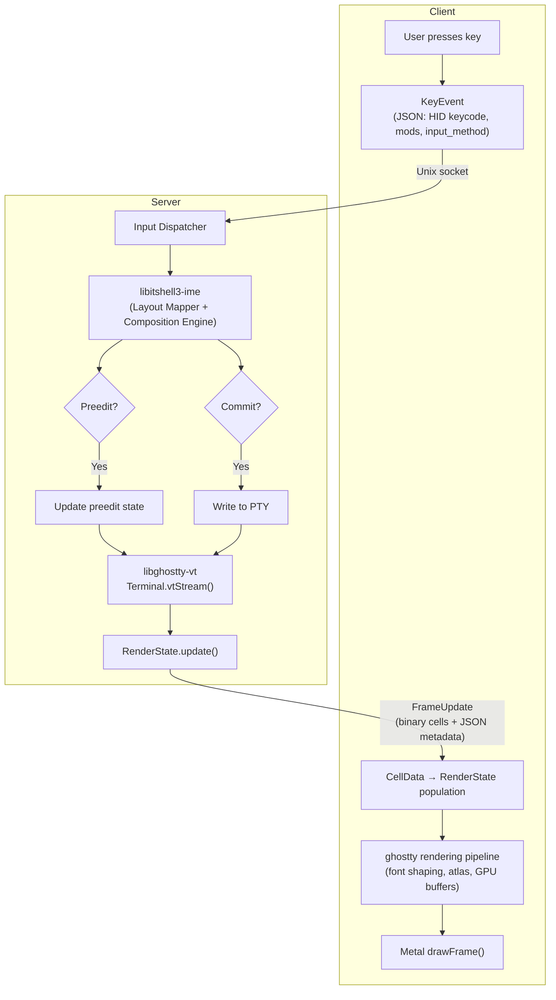

# Move Input Processing Priority and Flow Diagram from Protocol to Daemon

- **Date**: 2026-03-16
- **Source team**: protocol
- **Source version**: libitshell3-protocol server-client-protocols
  draft/v1.0-r12
- **Source resolution**: owner review (v1.0-r12 cleanup)
- **Target docs**: daemon design docs
- **Status**: open

---

## Context

During owner review of the protocol spec (v1.0-r12), Doc 04 §3 (Input Channel
Architecture) was identified as containing daemon implementation details:

- §3.1: Server processing priority order for input messages
- §3.2: End-to-end input flow diagram (server-side IME processing, ghostty
  rendering pipeline)

These describe how the daemon processes input internally, not wire protocol
concerns. The multiplexed channel decision has been recorded as ADR 00018.

## Required Changes

1. **Input processing priority**: Add server-side priority order for input
   message processing (KeyEvent/TextInput highest, FocusEvent lowest).
2. **Input flow diagram**: Add the end-to-end mermaid diagram showing KeyEvent →
   IME engine → preedit/commit → PTY → libghostty-vt → RenderState → FrameUpdate
   → client rendering pipeline.

## Summary Table

| Target Doc            | Section/Message           | Change Type | Source Resolution             |
| --------------------- | ------------------------- | ----------- | ----------------------------- |
| Internal architecture | Input processing priority | Add         | Protocol v1.0-r12 Doc 04 §3.1 |
| Internal architecture | Input flow diagram        | Add         | Protocol v1.0-r12 Doc 04 §3.2 |

## Reference: Original Protocol Text (removed from Doc 04 §3)

The following is the original text as it appeared in the protocol spec before
removal. Provided as reference for the daemon team — adapt as needed.

### Server processing priority order

1. KeyEvent, TextInput (highest — affects what the user sees immediately)
2. MouseButton, MouseScroll (user interaction)
3. MouseMove (bulk, can be coalesced)
4. PasteData (bulk transfer)
5. FocusEvent (advisory)

### Input Flow Summary

