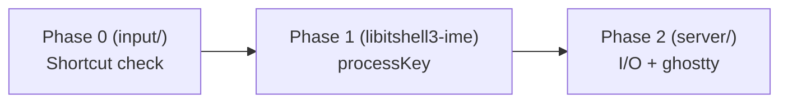
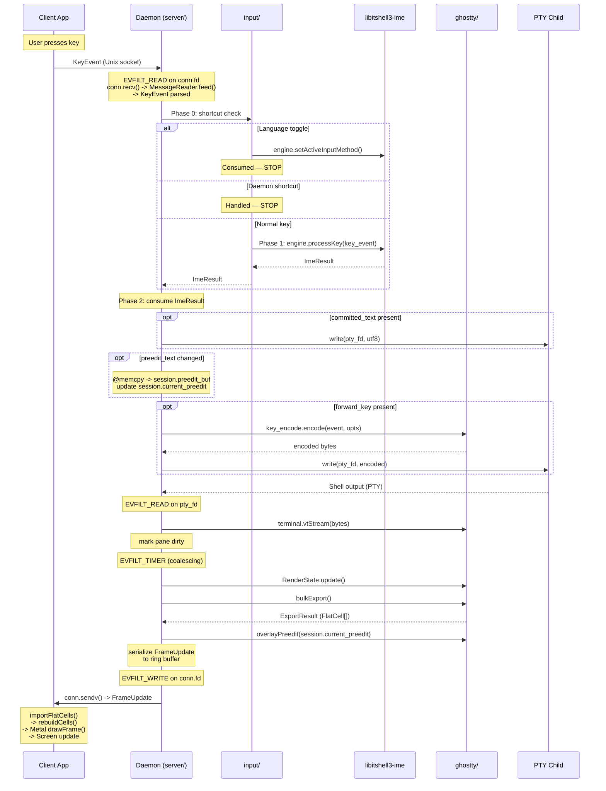
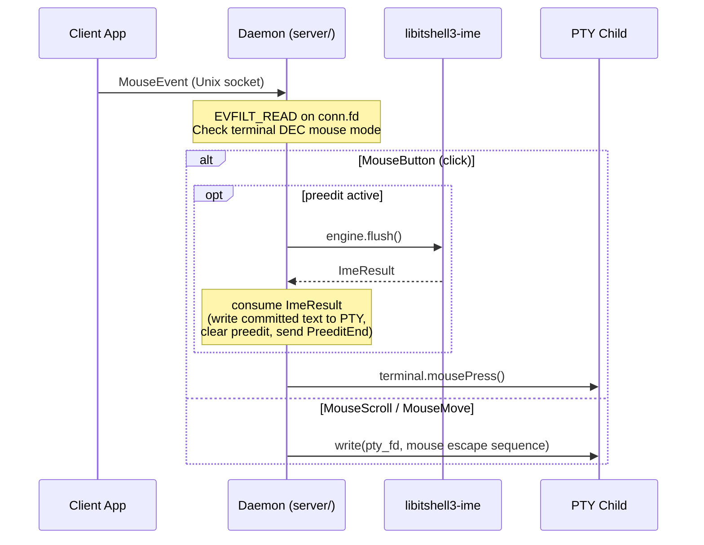

# Daemon Integration Boundaries

- **Date**: 2026-03-23
- **Scope**: IME engine integration, protocol library boundary, ghostty Terminal
  integration, and key input data flow

---

## 1. Protocol Library Boundary (libitshell3-protocol)

The daemon communicates with clients through `libitshell3-protocol`, a
standalone library organized into four layers. Layers 1-3 are I/O-free (no OS
dependencies, no file descriptors, no syscalls). Layer 4 is the sole layer with
OS dependencies.

**External dependencies**: Zig `std` only (posix sockets, libc) in v1. libssh2
added in Phase 5 for SSH transport. No dependency on `libitshell3/core/` types —
message structs use primitives (`u32` for pane_id/session_id, `[]const u8` for
names). The `server/` module maps between wire primitives and domain types
(e.g., `core.PaneId`) at the boundary.

### 1.1 Layer Architecture

```
┌─────────────────────────────────────────────────────────┐
│ Layer 4: Transport          (has OS dependencies)       │
│   Listener, Connection, socket path, stale detection    │
├─────────────────────────────────────────────────────────┤
│ Layer 3: Connection Protocol (I/O-free state machine)   │
│   6-state model, message sequencing, capability state   │
├─────────────────────────────────────────────────────────┤
│ Layer 2: Framing             (I/O-free, per-connection) │
│   MessageReader, MessageWriter, fragment reassembly     │
├─────────────────────────────────────────────────────────┤
│ Layer 1: Codec               (I/O-free, stateless)      │
│   encode(Message) → bytes, decode(bytes) → Message      │
└─────────────────────────────────────────────────────────┘
```

Both the daemon and the client use all four layers. The event loop integration
differs (kqueue for daemon, RunLoop/dispatch for Swift client), but the protocol
library itself is shared.

### 1.2 Layer 1 — Codec

Stateless, I/O-free. Pure serialization functions.

- `encode(Message) -> bytes` — serialize a message to wire format
- `decode(bytes) -> Message` — deserialize bytes to a message

Handles the 16-byte fixed header, JSON payloads, and the hybrid FrameUpdate
binary+JSON format. Zero allocation policy — the caller provides output buffers.

### 1.3 Layer 2 — Framing

Stateful per-connection, I/O-free. Operates on byte slices, NOT file
descriptors.

- **`MessageReader`** — accumulates bytes fed by the caller, extracts complete
  frames. Handles buffer management, fragment reassembly, and incomplete message
  detection.
- **`MessageWriter`** — serializes messages into output buffers or iovec arrays
  for vectored I/O.

The framing layer knows nothing about sockets or event loops. The caller feeds
bytes in (from whatever I/O mechanism it uses) and reads complete messages out.

### 1.4 Layer 3 — Connection Protocol

Event-driven state machine, I/O-free. Tracks connection state using the
canonical 6-state model from protocol doc 01 Section 5.2:

```
DISCONNECTED -> CONNECTING -> HANDSHAKING -> READY -> OPERATING -> DISCONNECTING
```

Design: `onEvent(event) -> Action` — deterministic, testable, no side effects.
The daemon or client drives the state machine by feeding events and executing
returned actions.

Responsibilities:

- Validates message sequencing (e.g., rejects FrameUpdate before state reaches
  OPERATING)
- Manages capability negotiation state during handshake
- Tracks connection lifecycle transitions

The daemon's per-client state machine starts at HANDSHAKING (after
`Listener.accept()`). DISCONNECTED and CONNECTING are client-side states only.
The key transition OPERATING -> READY (detach without disconnect) allows session
switching without reconnecting.

**Prior art**: h2 (Rust HTTP/2 library), nghttp2 (C HTTP/2 library) — both use
I/O-free state machines where the caller owns all I/O.

### 1.5 Layer 4 — Transport

Has OS dependencies (socket syscalls). Handles socket lifecycle and provides
thin I/O wrappers. Uses an **fd-providing model**: the transport layer creates
and configures sockets, returns raw file descriptors that the consumer registers
with its own event loop. The transport layer does NOT own the event loop.

#### 1.5.1 Socket Path Resolution

Both daemon and client resolve the socket path identically using a 4-step
fallback algorithm:

1. `$ITSHELL3_SOCKET` (explicit override)
2. `$XDG_RUNTIME_DIR/itshell3/<server-id>.sock`
3. `$TMPDIR/itshell3-<uid>/<server-id>.sock`
4. `/tmp/itshell3-<uid>/<server-id>.sock`

This algorithm is defined in protocol spec Section 2.1. Centralizing it in the
transport layer eliminates duplication between daemon and client.

#### 1.5.2 Listener (Server-Side)

`transport.Listener` manages the server socket lifecycle:

- **`Listener.init(config)`**: `socket(AF_UNIX, SOCK_STREAM)` -> stale socket
  detection -> `bind()` -> `listen(backlog)` -> `chmod(0600)` -> directory
  creation with `0700` permissions -> `O_NONBLOCK`. Returns the listener for
  kqueue registration via `.fd()`.

- **`Listener.accept()`**: `accept()` + `getpeereid()`/`SO_PEERCRED` UID
  verification + `O_NONBLOCK` + `setsockopt` buffer sizes -> returns a
  `Connection`.

- **`Listener.deinit()`**: `close(listen_fd)` + `unlink(socket_path)` + free
  path string. Compound cleanup ensures no leaked sockets or stale files.

#### 1.5.3 Connection (Both Sides)

A plain struct containing one `pub fd: posix.fd_t` field. 4 bytes, no allocator,
no hidden state. Created by `Listener.accept()` (server-side) or
`transport.connect(config)` (client-side).

```zig
pub const Connection = struct {
    fd: posix.fd_t,  // pub, for kqueue/RunLoop registration

    pub fn recv(self: Connection, buf: []u8) RecvResult { ... }
    pub fn send(self: Connection, buf: []const u8) SendResult { ... }
    pub fn sendv(self: Connection, iovecs: []posix.iovec_const) SendvResult { ... }
    pub fn close(self: *Connection) void { posix.close(self.fd); self.fd = -1; }
};
```

- **`.recv(buf)`** — thin wrapper over `posix.read(self.fd, buf)` with result
  mapping
- **`.send(buf)`** — thin wrapper over `posix.write(self.fd, buf)` with result
  mapping
- **`.sendv(iovecs)`** — thin wrapper over `posix.writev(self.fd, iovecs)` for
  ring buffer zero-copy path
- **`.close()`** — `posix.close(self.fd)` + `self.fd = -1` (defensive against
  use-after-close)
- **`Connection.fd`** is `pub` — consumer uses it directly for kqueue/RunLoop
  registration

**Result types**:

```zig
pub const RecvResult = union(enum) {
    bytes_read: usize,    // success
    would_block: void,    // EAGAIN — re-arm event loop
    peer_closed: void,    // EOF (n==0), EPIPE, or ECONNRESET
    err: posix.ReadError, // unexpected error
};

pub const SendResult = union(enum) {
    bytes_written: usize, // may be partial — caller manages remainder
    would_block: void,    // EAGAIN — re-arm EVFILT_WRITE
    peer_closed: void,    // EPIPE or ECONNRESET
    err: posix.WriteError,
};
```

The `SendvResult` follows the same pattern as `SendResult` but wraps
`posix.writev`.

**Why methods on the struct (not raw `posix.read/write`)**: Three reasons drove
this design:

1. **SSH swappability (primary)**: In Phase 5, `Connection` will hold SSH
   channel state internally, and `.recv()`/`.send()` will dispatch to
   `libssh2_channel_read()`/`libssh2_channel_write()`. libssh2 channels do NOT
   provide real fds — all channels multiplex onto one TCP socket. Consumer call
   sites are unchanged.
2. **Zig idiom**: `std.net.Stream` and `std.fs.File` both own fds and provide
   methods. `Connection` follows the same convention.
3. **Error consolidation**: `.recv()` maps `n==0` (EOF), `EPIPE`, and
   `ECONNRESET` to a single `.peer_closed` variant. This is genuine shared logic
   beyond what `std.posix` provides.

Note: Zig's `std.posix.read/write` already handles EINTR internally. EINTR
handling is NOT a reason for these wrappers.

#### 1.5.4 Peer Credential Extraction

Platform-specific UID verification centralized in `Listener.accept()`:

- **macOS**: `getpeereid()`
- **Linux**: `SO_PEERCRED`

Rejects connections from different UIDs (security boundary).

#### 1.5.5 Stale Socket Detection

`connect()` probe to the existing socket path:

- Success -> daemon already running -> caller decides (daemon exits, client
  connects)
- `ECONNREFUSED` -> stale socket -> report to caller for cleanup

Used by both daemon startup (step 2) and client auto-start.

#### 1.5.6 Socket Option Configuration

`SO_SNDBUF`/`SO_RCVBUF` defaults at 256 KiB per protocol spec, configurable via
options struct.

### 1.6 What Layer 4 Does NOT Own

| Concern                          | Owner                                | Rationale                                                                                                               |
| -------------------------------- | ------------------------------------ | ----------------------------------------------------------------------------------------------------------------------- |
| Event loop                       | `server/` (kqueue), client (RunLoop) | Consumer decides WHEN to call recv/send                                                                                 |
| Ring buffer                      | `server/`                            | Server-side delivery optimization tied to writev zero-copy and multi-client cursor management. No client-side analogue. |
| Reconnection logic               | Client                               | Client-specific policy (exponential backoff)                                                                            |
| Application-level error response | Consumer                             | Daemon: cleanup ClientState + deregister from kqueue. Client: reconnect UI.                                             |

### 1.7 Testability

Layers 1-3 are fully testable without sockets, kqueue, or OS mocking. Feed bytes
in, check messages out. Layer 4 requires socket syscalls but can be tested with
real Unix sockets in integration tests.

### 1.8 SSH Transport (Phase 5)

No SSH abstraction in v1. Concrete Unix socket implementation only — no vtable,
no interface, no tagged union.

When Phase 5 arrives, the `Connection` struct internals are expanded to hold SSH
channel state, and `.recv()`/`.send()` dispatch to
`libssh2_channel_read()`/`libssh2_channel_write()`. Consumer call sites are
unchanged. The cost in v1 is ~40 lines of trivial pass-through wrappers; the
Phase 5 benefit is zero call-site changes.

### 1.9 Naming Convention

Types use namespace-qualified names: `transport.Listener`,
`transport.Connection` (not `TransportListener`/`TransportConnector`). The types
live in the `transport` namespace, so the prefix would be redundant.

### 1.10 C API Export (Protocol Library)

`libitshell3-protocol` SHOULD export a C API header for the codec and framing
layers (Layers 1-2), enabling the Swift client to use them directly. This is a
protocol library concern, distinct from the daemon library.

---

## 2. Transport Implementation Location

**Decision**: The client app decides local vs remote. The daemon always sees
Unix sockets.

- **Local**: Client calls `transport.connect(config)` to obtain a `Connection`
  to the daemon's Unix socket directly.
- **Remote**: Client opens an SSH tunnel (`direct-streamlocal@openssh.com`) ->
  sshd -> Unix socket. The daemon never knows the client is remote. In Phase 5,
  `transport.connect()` handles SSH channel setup internally.
- **Protocol library**: Provides all four layers — I/O-free codec + framing +
  state machine (Layers 1-3) AND transport (Layer 4) — shared by both daemon and
  client. No code duplication.

As stated in protocol doc 01 Section 2.2: "The daemon only ever sees Unix socket
connections."

---

## 3. Shared Four-Layer Model (No Duplication)

All four layers are shared by both daemon and client:

| Layer                   | Daemon usage                                        | Client usage                                           |
| ----------------------- | --------------------------------------------------- | ------------------------------------------------------ |
| **Codec**               | Serialize/deserialize messages                      | Serialize/deserialize messages                         |
| **Framing**             | `MessageReader` + `MessageWriter`                   | `MessageReader` + `MessageWriter`                      |
| **Connection protocol** | Same state machine (server role: sends ServerHello) | Same state machine (client role: sends ClientHello)    |
| **Transport**           | `Listener` + `Connection` (recv/send/sendv/close)   | `transport.connect()` + `Connection` (recv/send/close) |

The only difference is event loop integration: the daemon uses kqueue, the
client uses RunLoop/dispatch. The protocol library provides the building blocks;
the consumer decides when and how to drive I/O.

Socket path resolution, stale socket detection, peer credential extraction, and
socket option configuration are all shared. Without Layer 4 in the protocol
library, both daemon and client would independently implement these multi-step
sequences with identical logic and edge cases.

---

## 4. IME Integration (libitshell3-ime)

### 4.1 Per-Session ImeEngine Lifecycle

Each Session owns one `ImeEngine` instance. All panes within a session share
this engine.

**Creation and destruction:**

- Created on session creation: `HangulImeEngine.init(allocator, "direct")` — new
  sessions default to direct mode.
- Destroyed on session destruction: `engine.deinit()`.
- The `ImeEngine` interface (vtable) is defined in `core/`. The concrete
  `HangulImeEngine` lives in libitshell3-ime (separate library).
- `MockImeEngine` enables testing all key routing logic without libhangul.
- Per-session libhangul instances are trivially cheap (~few KB each). The
  per-session model has no meaningful memory cost even with many sessions.
- The zero-pane scenario does not arise — closing the last pane destroys the
  session.

**Per-session engine state**: Each session maintains three IME-related fields at
session level, shared by all panes:

- `active_input_method`: The current input method identifier (e.g., `"direct"`,
  `"korean_2set"`). Default for new sessions: `"direct"`.
- `keyboard_layout`: The physical keyboard layout (e.g., `"qwerty"`,
  `"azerty"`). Default for new sessions: `"qwerty"`. Orthogonal to
  `input_method`.
- `ime_engine`: The single `ImeEngine` instance for this session.

New panes inherit the session's current `active_input_method` automatically —
the shared engine already has the correct state. No per-pane override is
supported.

**Preedit exclusivity invariant**: At most one pane in a session can have active
preedit at any time. This is structurally enforced by the per-session engine
model — one engine means one composition state machine, one focused pane. See
doc04 §11 for the normative invariant and doc04 §6 for multi-client ownership
tracking on the focused pane.

**Lifecycle event mapping:**

| Event                           | Engine method                  | Description                                                                           |
| ------------------------------- | ------------------------------ | ------------------------------------------------------------------------------------- |
| Intra-session pane focus change | `flush()`                      | Commit composition. Engine stays active. Server routes result to old pane's PTY.      |
| Inter-session tab switch (away) | `deactivate()`                 | Commit composition + engine-specific cleanup. Engine goes idle.                       |
| Inter-session tab switch (to)   | `activate()`                   | Signal engine becoming active. No-op for Korean.                                      |
| App loses OS focus              | `deactivate()`                 | Same as inter-session switch.                                                         |
| Session close                   | `deactivate()` then `deinit()` | Clean shutdown.                                                                       |
| Pane close (non-last pane)      | `engine.reset()`               | Discard composition. NOT flush — pane is gone, committing to a dead PTY is pointless. |

> **Last-pane close triggers session auto-destroy**: When the closed pane is the
> session's last pane, the session is destroyed — the engine lifecycle follows
> the "Session close" row above (`deactivate()` then `deinit()`), not the "Pane
> close (non-last pane)" `reset()` path. The SIGCHLD handler that implements
> this is in doc03 §3.2.

**Key distinction — flush vs deactivate:** `flush()` ends the current
composition (commits in-progress jamo). `deactivate()` ends the engine's active
period entirely. For Korean (v1), the distinction is invisible — `deactivate()`
IS `flush()` internally. But the contract is designed for multiple languages.
For future engines (e.g., Japanese with candidate window), `deactivate()` may
additionally dismiss candidate UI, save user dictionary, and release candidate
caches — behavior that would be wasteful and UX-breaking for a lightweight
intra-session pane switch where the engine remains active.

**`deactivate()` MUST flush**: All ImeEngine implementations must flush pending
composition before returning from `deactivate()`. The returned ImeResult
contains the flushed text. Calling `flush()` before `deactivate()` is redundant
but harmless (deactivate on empty composition returns empty ImeResult). This
prevents a bug class where a future engine forgets to flush in `deactivate()`.

**Active input method preservation**: `active_input_method` persists across
`deactivate()`/`activate()` cycles — it is NOT reset to `"direct"`. Users expect
that switching tabs and coming back preserves their input mode. The engine's
language state is a user preference, not a focus-dependent transient.

**Server-side code pattern:**

```
// Intra-session pane focus change (A -> B)
result = entry.session.ime_engine.flush()
consume(focused_pane.pty_fd, result)  // MUST consume before next engine call
entry.session.focused_pane = pane_b.slot_index

// Inter-session tab switch (entry1 -> entry2)
result = entry1.session.ime_engine.deactivate()
consume(focused_pane1.pty_fd, result)
entry2.session.ime_engine.activate()
```

**Source**: Per-session engine architecture design resolutions in the
`libitshell3-ime` interface-contract docs (Resolutions 1-8).

### 4.2 Phase 0 -> 1 -> 2 Key Routing

The client sends raw HID keycodes and modifiers over the wire protocol. The
server derives text through the native IME engine (libitshell3-ime) — the client
never sends composed text for key input. The client does not track IME
composition state; the server determines composition state internally from the
IME engine.

Key input flows through three phases across three modules:



**Phase 0** — `input/` module (shortcut interception):

1. Check if key is a language toggle ->
   `engine.setActiveInputMethod(new_method)` -> consume ImeResult -> STOP.
2. Check global daemon shortcuts -> STOP.
3. Otherwise pass to Phase 1.

**Phase 1** — libitshell3-ime library (composition):

- `engine.processKey(key_event)` -> returns `ImeResult`.

**Phase 2** — `server/` module (I/O and ghostty API calls):

| ImeResult field                         | Action                  | API                                                                  |
| --------------------------------------- | ----------------------- | -------------------------------------------------------------------- |
| `committed_text`                        | Write UTF-8 to PTY      | `write(pty_fd, text)`                                                |
| `preedit_text` (when `preedit_changed`) | Copy to session buffer  | `@memcpy` to `session.preedit_buf`, update `session.current_preedit` |
| `forward_key`                           | Encode and write to PTY | `key_encode.encode()` + `write(pty_fd, encoded)`                     |

Phase 2 lives in `server/` because it performs I/O (PTY writes) and uses ghostty
APIs (`key_encode.encode`). The `input/` module handles Phase 0 and Phase 1 only
— pure routing logic that depends solely on `core/` types.

#### Why IME Runs Before Keybindings

The 3-phase pipeline intentionally places IME processing (Phase 1) before
ghostty's keybinding system (Phase 2). When the user presses Ctrl+C during
Korean composition (preedit = "하"):

1. **Phase 0 (shortcuts)**: Ctrl+C is not a language toggle or global shortcut.
   Pass through.
2. **Phase 1 (IME)**: Engine detects Ctrl modifier -> flushes "하" -> returns
   `{ committed: "하", forward_key: Ctrl+C }`.
3. **Phase 2 (ghostty)**: Committed text "하" is written to PTY via
   `write(pty_fd, committed_text)`. Then Ctrl+C is encoded via
   `key_encode.encode(Ctrl+C)` and written to PTY. If the key matches a daemon
   shortcut binding, it fires before the PTY write.

This ordering ensures the user's in-progress composition is preserved before any
keybinding action. The alternative — letting ghostty process the key first —
would lose the preedit because ghostty has no knowledge of IME state.

**Verified by PoC** (`poc/01-ime-key-handling/`): All 10 test scenarios pass —
arrows, Ctrl+C, Ctrl+D, Enter, Escape, Tab, backspace jamo-undo, shifted keys,
and mixed compose-arrow-compose sequences all work correctly with libhangul.

#### Wire-to-KeyEvent Decomposition

The daemon decomposes the protocol wire modifier bitmask into `KeyEvent` fields
before passing to the IME engine. The wire format carries a single packed
modifier byte; the daemon splits this into the engine's `shift` field and
`modifiers` struct:

| Wire bit          | KeyEvent field                 | Notes                                                                       |
| ----------------- | ------------------------------ | --------------------------------------------------------------------------- |
| Bit 0 (Shift)     | `KeyEvent.shift`               | Separate because Shift participates in jamo selection (ㄱ vs ㄲ), not flush |
| Bit 1 (Ctrl)      | `KeyEvent.modifiers.ctrl`      | Triggers composition flush                                                  |
| Bit 2 (Alt)       | `KeyEvent.modifiers.alt`       | Triggers composition flush                                                  |
| Bit 3 (Super/Cmd) | `KeyEvent.modifiers.super_key` | Triggers composition flush                                                  |
| Bit 4 (CapsLock)  | Not consumed by IME            | CapsLock as language toggle is detected in Phase 0                          |
| Bit 5 (NumLock)   | Not consumed by IME            | NumLock does not affect Hangul composition                                  |

See protocol doc 04 Section 2.1 for the full wire modifier format. This
decomposition is performed in the `input/` module before calling
`engine.processKey()`.

#### InputMethodSwitch Message Processing

When the server receives an `InputMethodSwitch` (0x0404) message, it identifies
the session from `pane_id` and applies the input method switch to the entire
session (all panes), not per-pane:

- **`commit_current=true`** (standard): Server calls
  `engine.setActiveInputMethod(new_method)`. The IME flushes (commits) pending
  composition and switches.
- **`commit_current=false`** (discard): Server calls `engine.reset()` to discard
  the current composition, then `engine.setActiveInputMethod(new_method)` to
  switch. The single-threaded event loop guarantees atomicity — both calls
  execute within a single event handler iteration. The `PreeditEnd` reason is
  `"cancelled"`.

This is distinct from Phase 0 language toggle detection (§4.2), which intercepts
configurable keybindings (Right Alt, Caps Lock, etc.) before they reach the IME.
`InputMethodSwitch` is an explicit protocol message sent by the client — it
bypasses the key routing pipeline entirely.

### 4.3 Eager Activate/Deactivate on Session Focus Change

`deactivate()` scope is **per-session, not per-client**. The engine is
deactivated only when the last client detaches from (or switches away from) a
session — i.e., when the session's attached-client count drops to zero. A single
client detaching while other clients remain on the same session does NOT trigger
`deactivate()` on the shared engine; only that client's preedit ownership is
resolved (per
[doc04 §6.2](04-runtime-policies.md#62-ownership-rules-last-writer-wins) — the
departing client's in-progress composition is flushed to PTY via the preedit
ownership transfer mechanism).

When the daemon detects that a client is the last one leaving session A and is
switching to session B:

1. Immediately call `entry_a.session.ime_engine.deactivate()` — flushes any
   committed text to A's focused pane PTY, clears preedit.
2. If committed text returned: write to A's focused pane PTY via
   `write(pty_fd, committed_text)`.
3. If preedit changed: set `entry_a.session.current_preedit = null` and mark
   dirty to clear the overlay.
4. Then call `entry_b.session.ime_engine.activate()` — no-op for Korean.

The trigger is the **session becoming client-free** (attached-client count
reaches zero), not the individual `AttachSessionRequest` of a single client. For
a solo client switching sessions, the two conditions coincide. For multi-client
sessions, only the last departing client triggers `deactivate()`.

**Why per-session, not per-client**: The `ImeEngine` is a shared resource owned
by the session, not by any individual client. Calling `deactivate()` on a shared
engine when one of several clients detaches would discard in-progress
composition belonging to the remaining clients — violating the last-writer-wins
preedit model
([doc04 §6.2](04-runtime-policies.md#62-ownership-rules-last-writer-wins)). The
per-session engine's `deactivate()` semantics ("end this engine's active period,
perform engine-specific cleanup") only make sense when no client remains to
interact with the session.

**Why eager, not lazy**: Lazy deactivation creates deferred routing bugs.
Concrete scenario: user composes Korean text in Session A (solo client),
switches to Session B, closes Session A's pane from B, then types in B. Lazy
deactivation would attempt to flush committed text to a pane that no longer
exists. Eager deactivation on last-client-departure flushes while the pane is
still alive.

**Zero cost when not composing**: `deactivate()` on an empty engine returns
`ImeResult{}` (all null/false fields). `activate()` is a no-op for Korean. The
path is uniform regardless of composition state.

**Language preservation**: The engine's `active_input_method` is NOT changed by
deactivate/activate. Users expect that switching between tabs and coming back
preserves their input mode (e.g., still in Korean 2-set). ghostty's Surface has
zero language state — the language indicator is derived from the engine by the
daemon.

### 4.4 Intra-Session Pane Focus Change

When the user changes focus between panes within the same session, the daemon
flushes the engine and routes the result to the old pane before switching focus:

1. `engine.flush()` -> ImeResult with committed text (if composing) or empty (if
   not).
2. If `committed_text` present: write UTF-8 to old pane's PTY via
   `write(pty_fd, committed_text)`.
3. If `preedit_changed`: set `session.current_preedit = null` and mark dirty to
   clear the overlay.
4. Send `PreeditEnd(pane=old, reason="focus_changed")` to all clients (immediate
   delivery, bypasses coalescing — per protocol doc 05 Section 7.7).
5. Update `session.focused_pane` to new pane. Subsequent `processKey()` results
   route to the new pane.

**Edge case — engine already empty**: `flush()` returns `ImeResult{}` (all
null/false). The daemon skips ghostty calls. The code path is uniform regardless
of composition state.

**Key invariant**: The daemon MUST consume the `ImeResult` (process committed
text and update preedit) before making any subsequent call to the same engine
instance. The engine's internal buffers are overwritten by the next mutating
call (see §4.6).

**No composition restoration**: When focus returns to a previously-focused pane,
the engine starts with empty composition. libhangul has no snapshot/restore API,
and users don't expect to resume mid-syllable after switching panes. This
matches ibus-hangul and fcitx5-hangul, which both flush on focus-out with no
restoration on focus-in.

**Source**: Per-session engine architecture design resolutions in the
`libitshell3-ime` interface-contract docs (Resolution 2).

### 4.5 No Per-Pane Locks

The single-threaded kqueue event loop (see internal architecture doc, doc01 §2)
provides implicit serialization. All key events and focus changes are processed
sequentially in the same thread. No locks, no mutexes, no data races.

When multiple clients attach to the same session, they share the per-session IME
engine. The event loop serializes their key events, but interleaved keystrokes
from different clients would produce garbage compositions. The daemon tracks
preedit ownership via `Session.preedit.owner` (doc04 §6.2) and flushes the
current owner's composition before processing a different client's composing
key. This is a semantic concern (ownership transition), not a concurrency
concern (data races).

### 4.6 Critical Runtime Invariant

`ImeResult` MUST be consumed (PTY write + preedit update) before the next engine
call. The engine's internal buffers are invalidated on the next mutating call
(IME contract v0.8 Section 6). This invariant is naturally satisfied by the
single-threaded event loop — each key event is fully processed before the next
one is dequeued.

### 4.7 End-to-End Key Input Data Flow



### 4.8 Mouse Event Data Flow

Mouse event interaction with IME depends on the event type. Mouse tracking is
only active when the terminal's DEC mode state has mouse reporting enabled
(determined by `Options.fromTerminal()`).

**MouseButton** events MUST commit preedit before processing. A mouse click
changes the cursor position in the terminal, which would leave the preedit
overlay stranded at the old position. The server calls `engine.flush()` in
`server/` before forwarding the mouse event to `terminal.mousePress()`. If
committed text is returned, it is written to the PTY. `PreeditEnd` with
`reason="committed"` is sent to all clients. See doc04 §8.4 for the full
procedure.

**MouseScroll** events do NOT commit preedit. Scrolling is a viewport-only
operation — the cursor position and composition state are unaffected. The user's
in-progress composition MUST be preserved.

**MouseMove** events do NOT commit preedit. Mouse motion reporting does not
alter cursor position or composition state.



### 4.9 Daemon-Side Responsibility Matrix

The daemon (libitshell3) and the IME engine (libitshell3-ime) have clearly
separated responsibilities. The engine is a pure composition state machine; the
daemon owns routing, lifecycle, I/O, and ghostty integration.

| Responsibility                                                 | Owner                                 | Rationale                                                                                                                                                |
| -------------------------------------------------------------- | ------------------------------------- | -------------------------------------------------------------------------------------------------------------------------------------------------------- |
| **Routing & Lifecycle**                                        |                                       |                                                                                                                                                          |
| Per-session ImeEngine lifecycle (create/destroy)               | **daemon**                            | Creates one engine per session, destroys on session close.                                                                                               |
| activate/deactivate on session-level focus change              | **daemon**                            | Calls `deactivate()` when session loses focus, `activate()` when it gains focus.                                                                         |
| flush() on intra-session pane focus change                     | **daemon**                            | Commits composition to old pane before switching focus.                                                                                                  |
| Routing ImeResult to the correct pane's PTY                    | **daemon**                            | Tracks `focused_pane` and directs ImeResult accordingly. Engine is pane-agnostic.                                                                        |
| New pane inheriting active input method                        | **daemon**                            | Automatic — the shared engine already has the correct state. No engine call needed.                                                                      |
| Language toggle key detection                                  | **daemon**                            | Configurable keybinding (한/영, Right Alt, Caps Lock). Not an IME concern.                                                                               |
| Active input method switching                                  | **daemon**                            | Calls `setActiveInputMethod(input_method)` when user toggles.                                                                                            |
| **I/O & ghostty Integration**                                  |                                       |                                                                                                                                                          |
| HID keycode -> platform-native keycode mapping                 | **daemon**                            | ghostty's key encoder uses platform-native keycodes. IME-independent.                                                                                    |
| Writing committed/forwarded text to PTY (`write(pty_fd, ...)`) | **daemon**                            | Translates ImeResult into PTY writes. Committed text: `write(pty_fd, committed_text)`. Forwarded keys: `key_encode.encode()` + `write(pty_fd, encoded)`. |
| Updating preedit overlay state (`session.current_preedit`)     | **daemon**                            | Sets `session.current_preedit = preedit_text` and marks dirty. `overlayPreedit()` applies it at next frame export.                                       |
| Explicit preedit clearing (`session.current_preedit = null`)   | **daemon**                            | Daemon sets null and marks dirty — overlay is cleared at next frame export.                                                                              |
| Terminal escape sequence encoding                              | **daemon** (via ghostty `key_encode`) | ghostty's KeyEncoder runs daemon-side.                                                                                                                   |
| PTY writes                                                     | **daemon**                            | Daemon owns PTY master FDs and performs all writes.                                                                                                      |
| **Protocol & Client Communication**                            |                                       |                                                                                                                                                          |
| Wire-to-KeyEvent decomposition                                 | **daemon**                            | Decomposes protocol modifier bitmask into `KeyEvent.shift` and `KeyEvent.modifiers`.                                                                     |
| Sending preedit/render state to remote client                  | **daemon**                            | Part of the FrameUpdate protocol.                                                                                                                        |
| Language indicator in FrameUpdate metadata                     | **daemon**                            | Derived from `active_input_method` string. ghostty has no language state.                                                                                |
| Composing-capable check                                        | **daemon**                            | `"direct" = no`, anything else = yes. Runtime: `engine.isEmpty()`.                                                                                       |
| `display_width` / UAX #11 character width computation          | **daemon**                            | East Asian Width property lookup for CellData encoding. IME has no width knowledge.                                                                      |
| **Pane Close Handling**                                        |                                       |                                                                                                                                                          |
| Preedit on pane close                                          | **daemon**                            | Calls `engine.reset()` (discard, NOT flush) — see daemon doc 04 §7.                                                                                      |

For the IME engine's own responsibilities (HID->ASCII mapping, jamo composition,
modifier flush decisions, UCS-4->UTF-8 conversion), see IME contract v0.8
Section 4 (Responsibility Matrix).

---

## 5. C API Surface Design

**Decision**: No daemon-side C API. YAGNI.

- The daemon (libitshell3) is a Zig binary using internal Zig APIs. No
  third-party embedding use case exists.
- The client communicates via wire protocol only — it never calls daemon
  functions directly.
- `libitshell3-protocol` exports a C API header for the codec and framing layers
  (Swift client interop). This is a protocol library concern, separate from the
  daemon library.

The daemon has exactly one consumer (itself). Exporting a C API adds maintenance
burden (header generation, ABI stability) for zero benefit. If a use case
appears, the API can be added then.

**libitshell3-ime has no public C header.** libitshell3-ime is an internal
dependency of libitshell3. It is statically linked into the libitshell3 binary.
Its types (`KeyEvent`, `ImeResult`, `ImeEngine`) are internal — clients never
see them. Clients send raw HID keycodes over the wire protocol and receive
preedit via FrameUpdate cell data. Exposing a separate `itshell3_ime.h` would
create two public APIs to maintain with zero consumers.

---

## 6. Items Deferred to Future Versions

| Item                                           | Deferred to | Rationale                                                                                         |
| ---------------------------------------------- | ----------- | ------------------------------------------------------------------------------------------------- |
| SSH transport implementation                   | Phase 5     | No remote use case in v1. Connection struct designed for transparent swap.                        |
| Transport vtable/interface                     | Phase 5     | One implementation (Unix socket) in v1. Abstract when the second arrives.                         |
| `Connection.deinit()` with SSH channel cleanup | Phase 5     | v1 Connection holds only an fd (4-byte struct). SSH adds channel state requiring compound deinit. |

---
