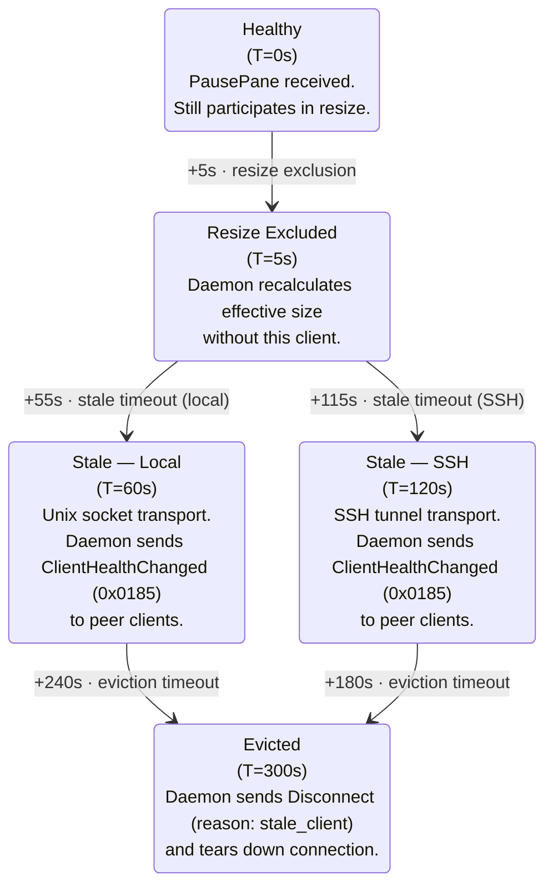

# Daemon Runtime Policies

- **Date**: 2026-03-23
- **Scope**: Connection limits, multi-client resize, health escalation, flow
  control, adaptive coalescing, preedit ownership and lifecycle, server behavior
  procedures, notification defaults, and heartbeat policy

---

## 1. Connection Limits (P3)

The daemon imposes no protocol-level limit on simultaneous connections.
Implementation-level limits apply:

- **Minimum**: The daemon MUST support at least 256 concurrent connections.
- **Rejection**: When resource limits are reached, the daemon rejects new
  connections or requests with `ERR_RESOURCE_EXHAUSTED` (0x00000600). The daemon
  MAY reject new connections during handshake if file descriptor limits are
  reached, or reject `CreateSessionRequest` if session capacity limits are
  reached. In both cases, the error code is `ERR_RESOURCE_EXHAUSTED`.
- **File descriptor budget**: Each connection consumes one fd; each pane
  consumes one fd (PTY master). A typical multi-tab deployment (50 sessions, 5
  panes each) requires approximately 300 file descriptors.
- **RLIMIT_NOFILE**: The daemon SHOULD raise `RLIMIT_NOFILE` at startup to the
  hard limit or a reasonable cap (e.g., 8192). The macOS default soft limit
  (256) is insufficient.

The limit is an implementation guard, not a protocol constant. Future versions
may raise it without protocol changes.

---

## 2. Multi-Client Resize Policy (P4)

When multiple clients attach to the same session, the daemon determines the
effective terminal size for the session's pane tree.

### 2.1 Resize Policies

| Policy     | Algorithm                                                              | Default                             |
| ---------- | ---------------------------------------------------------------------- | ----------------------------------- |
| `latest`   | PTY dimensions = most recently active client's reported size           | **Yes** (matches tmux 3.1+ default) |
| `smallest` | PTY dimensions = `min(cols)` x `min(rows)` across all eligible clients | Opt-in                              |

The active policy is server configuration, reported to clients in
`AttachSessionResponse`.

### 2.2 Latest Client Tracking

Under the `latest` policy, the daemon tracks the most recently active client per
session via `latest_client_id`. This field is updated when the client sends:

- `KeyEvent`
- `WindowResize`

`HeartbeatAck` does NOT update `latest_client_id` (passive liveness does not
indicate active use). When the latest client detaches or becomes stale (Section
3), the daemon falls back to the next most-recently-active healthy client. If no
client has any recorded activity, the daemon falls back to the client with the
largest terminal dimensions.

### 2.3 Viewport Clipping

Clients with smaller dimensions than the effective size MUST clip to their own
viewport (top-left origin), matching tmux `latest` policy behavior. Per-client
viewports (scroll to see clipped areas) are deferred to v2.

### 2.4 Resize Debouncing

Resize is debounced at 250ms per pane to prevent SIGWINCH storms during rapid
resize drags.

### 2.5 Stale Re-Inclusion Hysteresis

When a stale client recovers (sends ContinuePane or any application-level
message), the daemon does NOT immediately include the recovering client's
dimensions in the resize calculation. Instead, a 5-second hysteresis period
applies:

1. Client recovers from stale state.
2. Daemon waits 5 seconds before including the client's dimensions.
3. If the client becomes stale again within the 5-second window, the inclusion
   is cancelled.

This prevents resize oscillation when a client is intermittently responsive
(e.g., iOS app cycling between foreground and background).

### 2.6 Resize Orchestration

When the effective terminal size changes (due to WindowResize, client
detach/attach, stale exclusion, or stale re-inclusion), the daemon:

1. Computes the new effective size per the active resize policy (§2.1).
2. Calls `ioctl(TIOCSWINSZ)` on each affected PTY to update terminal dimensions.
3. Sends `LayoutChanged` to ALL attached clients with updated pane dimensions.
4. Writes I-frame(s) for affected panes to the ring buffer.
5. Sends `WindowResizeAck` to the requesting client (if triggered by
   WindowResize).

Resize debounce (§2.4) and Idle suppression during the resize window (§5.7)
apply. The coalescing tier is not downgraded during active resize.

### 2.7 Client Detach Resize

When a client detaches, the daemon recomputes the effective size using the
remaining clients' dimensions. If the effective size changes, the daemon sends
`LayoutChanged` to all remaining clients and writes I-frame(s) for affected
panes.

### 2.8 KeyEvent pane_id Routing

When `pane_id` is omitted or 0, the daemon routes the KeyEvent to the session's
currently focused pane. When present and non-zero, the daemon validates that the
pane exists in the client's attached session and routes directly. During IME
composition, the client SHOULD specify `pane_id` to prevent focus-change races —
if another client changes focus mid-composition, explicitly routed KeyEvents
continue to reach the correct pane.

### 2.9 AmbiguousWidthConfig Pass-Through

When the daemon receives an `AmbiguousWidthConfig` message (0x0406), it passes
the `ambiguous_width` value to the libghostty-vt Terminal instance for the
affected pane(s). The `scope` field (`"per_pane"`, `"per_session"`, or
`"global"`) determines which Terminal instances are updated. The server-side
Terminal state must match the client-side cell width computation for the
rendered cell grid to be correct.

---

## 3. Health Escalation (P7)

### 3.1 Client Health States

The daemon maintains two health states per client, orthogonal to connection
lifecycle:

| State     | Definition                               | Resize participation      | Frame delivery              |
| --------- | ---------------------------------------- | ------------------------- | --------------------------- |
| `healthy` | Normal operation                         | Yes                       | Full (per coalescing tier)  |
| `stale`   | Paused too long or output queue stagnant | No (excluded from resize) | None (ring cursor stagnant) |

`paused` (PausePane active) is an orthogonal flow-control state, not a health
state. A paused client remains `healthy` until the stale timeout fires.

### 3.2 PausePane Health Escalation Timeline



All timeouts are configurable via FlowControlConfig (Section 4.3). The 5s grace
period and the stale timeout serve different purposes:

- **5s grace**: "Should this client affect PTY dimensions right now?" (resize
  concern)
- **60s/120s stale**: "Is this client meaningfully participating in the
  session?" (health concern, triggers peer notification)

### 3.3 Stale Triggers

The stale timeout clock resets ONLY when the client sends a message that proves
application-level processing:

- ContinuePane
- KeyEvent
- WindowResize
- ClientDisplayInfo
- Any request message (CreateSession, SplitPane, etc.)

**HeartbeatAck does NOT reset the stale timeout.** On iOS, the OS can suspend
the application while keeping TCP sockets alive. The TCP stack continues to
respond to heartbeats even though the application event loop is frozen. If
HeartbeatAck reset the stale timeout, a backgrounded iPad client would never be
marked stale, and its stale dimensions would permanently constrain healthy
clients.

**Ring cursor stagnation as stale trigger**: In addition to PausePane duration,
the daemon uses ring cursor stagnation:

```
If client's ring cursor lag > 90% of ring capacity for stale_timeout_ms (60s/120s)
   AND client has not sent any application-level message during that period:
   -> transition to `stale`
```

This catches the "TCP alive but app frozen" scenario without wire format
changes.

The eviction timeout (300s) MAY reset on HeartbeatAck as a safety net against
false disconnects (the connection is alive, just slow).

### 3.4 Preedit Commit on Eviction (P13)

When the daemon evicts a stale client at T=300s:

1. If the evicted client owns an active preedit composition, the daemon commits
   (flushes) the preedit text to PTY.
2. The daemon sends `PreeditEnd` with `reason: "client_evicted"` to all
   remaining peer clients.
3. The daemon sends `Disconnect` with `reason: stale_client` to the evicted
   client and tears down the connection.

This prevents orphaned composition state. The commit happens before the
connection teardown.

### 3.5 Recovery from Stale

All recovery scenarios collapse into a single operation: advance the client's
ring cursor to the latest I-frame. The only variation is what additional
messages accompany recovery:

| Recovery trigger                               | Procedure                                                                                                                                                                                                                                                                                |
| ---------------------------------------------- | ---------------------------------------------------------------------------------------------------------------------------------------------------------------------------------------------------------------------------------------------------------------------------------------- |
| ContinuePane (after PausePane)                 | Advance cursor to latest I-frame. No additional messages.                                                                                                                                                                                                                                |
| Stale recovery                                 | Advance cursor to latest I-frame + enqueue LayoutChanged (if layout changed during stale period) and PreeditSync (if preedit active on any pane) into the direct message queue. Per socket write priority (Section 4.5), these context messages arrive BEFORE the I-frame from the ring. |
| Ring overwrite (cursor falls behind ring tail) | Advance cursor to latest I-frame. No additional messages.                                                                                                                                                                                                                                |

---

## 4. Flow Control (P8)

### 4.1 PausePane (Advisory Signal)

PausePane is a client-to-server advisory signal indicating the client cannot
keep up with frame delivery. The daemon's ring buffer writes **unconditionally**
— PausePane does NOT stop the daemon from writing frames to the ring. PausePane
triggers the health escalation timeline (Section 3.2) and informs the daemon
that the client's ring cursor is expected to stagnate.

### 4.2 ContinuePane (Recovery)

When a client sends ContinuePane (or `auto_continue` triggers after the
configured timeout):

1. The daemon advances the client's ring cursor to the latest I-frame. The
   client receives the I-frame (a complete self-contained terminal state) and
   resumes normal incremental delivery from that point. No `last_processed_seq`
   field is needed — the ring cursor position already tracks the client's state.
2. Incremental updates resume from that point.
3. The client's coalescing tier is restored based on current throughput.

The I-frame IS the full state resync — same data, same wire format, no special
codepath.

### 4.3 FlowControlConfig

Clients configure flow control behavior via `FlowControlConfig` (0x0502). The
daemon acknowledges with `FlowControlConfigAck` (0x0503).

| Parameter             | Type | Default (local) | Default (SSH) | Description                                    |
| --------------------- | ---- | --------------- | ------------- | ---------------------------------------------- |
| `max_queue_age_ms`    | u32  | 5000            | 10000         | Max ring cursor lag before PausePane advisory  |
| `auto_continue`       | bool | true            | true          | Auto-send ContinuePane after PausePane timeout |
| `stale_timeout_ms`    | u32  | 60000           | 120000        | Time until stale transition                    |
| `eviction_timeout_ms` | u32  | 300000          | 300000        | Time until eviction after stale                |

The daemon selects transport-aware defaults based on the connection type.
Clients may override any parameter. Values of 0 disable the corresponding
timeout (except `eviction_timeout_ms`, which has a server-enforced minimum).

### 4.4 Smooth Degradation Before PausePane

Before resorting to PausePane, the daemon applies smooth degradation based on
ring cursor lag:

1. **Ring cursor lag > 50%** of ring capacity: Auto-downgrade coalescing tier
   (Active -> Bulk) for this client. Skip more P-frames.
2. **Ring cursor lag > 75%**: Force Bulk tier regardless of throughput.
3. **Ring cursor lag > 90%**: Client's next ContinuePane (or auto_continue)
   advances cursor to latest I-frame.
4. **Client sends ContinuePane**: Advance cursor. Resume incremental updates.
   Restore original tier.

This graduated approach keeps the client receiving updates for as long as
possible. PausePane is a last resort, not a routine flow control mechanism.

### 4.5 Socket Write Priority

The daemon maintains two queues per client:

1. **Direct message queue**: Control messages (LayoutChanged, PreeditSync,
   PreeditUpdate, PreeditEnd, session management responses). Higher priority.
   Dedicated preedit protocol messages (0x0400-0x0405) are sent via this queue,
   outside the ring buffer.
2. **Ring buffer**: Frame data (I-frames, P-frames). Lower priority. All frames,
   including those containing preedit cell data, go through the per-pane shared
   ring buffer. There is no separate bypass path for preedit frames.

On each writable event, the daemon drains the direct queue first, then writes
ring buffer data. This ensures context messages (e.g., LayoutChanged after stale
recovery, PreeditSync during resync) arrive before the I-frame that references
them — following the "context before content" principle.

---

## 5. Adaptive Coalescing (P10)

### 5.1 Four-Tier Model

The daemon uses a 4-tier adaptive coalescing model (plus an Idle quiescent
state) to balance latency and throughput. Coalescing state is tracked per
(client, pane) pair.

| Tier | Name        | Min interval     | Trigger                                                        |
| ---- | ----------- | ---------------- | -------------------------------------------------------------- |
| 0    | Preedit     | 0 ms (immediate) | Preedit state change (PreeditStart, PreeditUpdate, PreeditEnd) |
| 1    | Interactive | 0 ms (immediate) | Keystroke echo, cursor movement                                |
| 2    | Active      | 16 ms (~60 fps)  | Sustained PTY output (e.g., `cat large_file`, build output)    |
| 3    | Bulk        | 33 ms (~30 fps)  | High-throughput PTY output sustained >500ms                    |
| --   | Idle        | No frames        | No PTY output for >100ms                                       |

### 5.2 Tier Transitions

Tier transitions use hysteresis to prevent oscillation:

- **Upgrade** (higher tier -> lower tier / faster): Immediate on trigger event.
- **Downgrade** (lower tier -> higher tier / slower): Requires sustained
  condition for a threshold period.
  - Interactive -> Active: sustained output >100ms
  - Active -> Bulk: sustained high throughput >500ms
  - Any -> Idle: no output >100ms

### 5.3 Preedit Immediate Rule

Preedit state changes ALWAYS trigger immediate frame delivery (Tier 0),
regardless of the current coalescing tier. When a KeyEvent triggers a preedit
change:

1. The daemon calls the IME engine's `processKey()`.
2. If preedit changed, the daemon applies preedit via `overlayPreedit()`
   post-`bulkExport()` to inject preedit cells into the exported frame data.
3. The daemon immediately triggers `RenderState.update()` + `bulkExport()`
   outside the normal coalescing window.
4. The resulting frame is written to the ring buffer and flushed to all clients
   without delay.

This ensures preedit latency stays under 33ms over local Unix socket, which is
critical for responsive Korean/CJK composition. Preedit frames are per-(client,
pane) — a pane with active composition receives immediate delivery even if
adjacent panes are in a lower-priority coalescing tier.

### 5.4 "Immediate First, Batch Rest" Rule

When a KeyEvent produces both preedit AND committed text in the same ImeResult:

1. The committed text is written to PTY (which may trigger PTY output).
2. The preedit change triggers an immediate frame.
3. Subsequent PTY output (from the committed text echo) follows normal
   coalescing.

The preedit frame is never delayed by batching with PTY output.

### 5.5 WAN Coalescing Adjustments

For SSH tunnel connections, the daemon adjusts coalescing based on the client's
`ClientDisplayInfo` (0x0505) message:

| Field                   | Effect on coalescing                                           |
| ----------------------- | -------------------------------------------------------------- |
| `transport_type: "ssh"` | Tier 2 minimum interval raised to 33ms; Tier 3 raised to 100ms |
| `bandwidth_hint`        | Below 1 Mbps: force Tier 3 for all non-preedit output          |
| `estimated_rtt_ms`      | Above 100ms: increase Idle threshold to 200ms                  |

**Preedit is NEVER throttled**, regardless of transport type or bandwidth.
Korean composition latency is non-negotiable.

### 5.6 Power-Aware Throttling

The client reports power state via `ClientDisplayInfo`:

| Power state   | Coalescing cap            | Preedit   |
| ------------- | ------------------------- | --------- |
| `ac`          | No cap (full tier model)  | Immediate |
| `battery`     | Max Tier 2 (16ms / 60fps) | Immediate |
| `low_battery` | Max Tier 3 (33ms / 30fps) | Immediate |

Preedit is always immediate regardless of power state.

### 5.7 Idle Suppression During Resize

During an active resize drag (daemon receiving WindowResize events within the
250ms debounce window) and for **500ms after the debounce fires**, the daemon
suppresses the Idle timeout. The server MUST NOT transition the pane's
coalescing tier to Idle during this period — the PTY application is processing
SIGWINCH and may briefly pause output, which is not true idleness. This prevents
the coalescing state from dropping to Idle between resize events (which would
cause unnecessary I-frame generation on each resize step) and during the
post-debounce settling period.

The normative definition of resize debounce timing and Idle suppression is in
[doc 01 §3.4 (PTY Lifecycle)](01-internal-architecture.md#34-pty-lifecycle).

### 5.8 Per-(Client, Pane) Cadence

Coalescing state is tracked independently for each (client, pane) pair. One pane
at Bulk tier does not affect another pane at Interactive tier, even within the
same client connection. One client at Bulk tier does not affect another client's
coalescing for the same pane. All clients receive `FrameUpdate` messages for all
panes in the attached session from the shared per-pane ring buffer (not just the
focused pane). Each client reads from the ring at its own cursor position via
per-(client, pane) coalescing tiers.

### 5.9 iOS Battery/SSH Tier Example

When a client reports `display_refresh_hz=60`, `power_state=battery`,
`preferred_max_fps=30`, `transport_type=ssh_tunnel`, the daemon computes the
following tier intervals:

| Tier       | Interval | Rationale                                                                  |
| ---------- | -------- | -------------------------------------------------------------------------- |
| Active     | 50ms     | 20fps — battery cap overrides `preferred_max_fps=30`                       |
| Bulk       | 100ms    | 10fps — power-throttled                                                    |
| Preedit    | 0ms      | Immediate — always bypasses throttling                                     |
| WAN adjust | --       | Further reduces Active/Bulk intervals if not already limited by power caps |

---

## 6. Preedit Ownership (P11)

### 6.1 Single-Owner Model

The daemon maintains preedit ownership state at the session level. At most one
pane in a session can have active preedit at any time (preedit exclusivity
invariant). The pane with active preedit is always `Session.focused_pane` — no
explicit `preedit_pane` field is needed. Proof: focus change always commits
preedit (§7.1), and new composition can only start on the focused pane (keys are
routed to the focused pane). Therefore, there is no state where preedit is
active on a non-focused pane.

The ownership tracking struct lives on `Session` as a nested sub-struct:

```
PreeditState {
    owner: ?u32,       // client_id of composing client, null = no active composition
    session_id: u32,   // monotonic counter, carried in PreeditStart/Update/End/Sync wire messages
}
```

`PreeditState` tracks multi-CLIENT ownership on the focused pane. When multiple
clients are attached to the same session, the `owner` field determines which
client initiated the active composition. The per-session IME engine prevents
multi-PANE simultaneous composition (§11); `PreeditState` handles the orthogonal
concern of multi-client contention on a single pane. For the authoritative
preedit text, see `Session.current_preedit` (doc01 §3.8). Cursor position and
display width are determined by `overlayPreedit()` at export time (see internal
architecture doc §4.4). Composition state is managed by the IME engine, not
tracked in the ownership struct.

### 6.2 Ownership Rules (Last-Writer-Wins)

1. **First composer**: When Client A sends a KeyEvent that triggers composition
   on a pane with no active preedit, Client A becomes the preedit owner.

2. **Ownership transition on client switch**: When Client B sends a composing
   KeyEvent on the same pane while Client A owns the preedit (interleaved client
   keys processed sequentially by the event loop):
   - Daemon checks `preedit.owner` — Client A owns the composition.
   - Daemon calls `engine.flush()` to commit Client A's preedit text to PTY.
   - Daemon extracts `committed_text` from the `ImeResult` before making any
     further engine calls (buffer lifetime constraint — see §8.1).
   - Daemon sends `PreeditEnd` to all clients with
     `reason: "replaced_by_other_client"`.
   - Daemon increments `preedit.session_id`.
   - Daemon processes Client B's KeyEvent through the IME engine, starting a new
     composition session owned by Client B.
   - Daemon sends `PreeditStart` to all clients with Client B as owner.

3. **Owner disconnect**: When the preedit owner disconnects:
   - Daemon commits current preedit text to PTY (if any).
   - Daemon sends `PreeditEnd` with `reason: "client_disconnected"`.

4. **Non-composing input from non-owner**: Regular (non-composing) KeyEvents
   from any client are always processed normally, regardless of preedit
   ownership. If a non-owner sends a regular key, the owner's preedit is
   committed first.

### 6.3 Inactivity Timeout

If the daemon receives no input from the preedit owner for 30 seconds, it
commits the current preedit text to PTY and sends `PreeditEnd`. This handles
cases where the client is frozen but the socket is still open.

---

## 7. Preedit Lifecycle on State Changes (P12)

This section defines daemon behavior when external events interrupt an active
preedit composition. The general principle: preedit is always resolved
(committed or cancelled) before processing the interrupting action. For
step-by-step server procedures with buffer lifetime and message ordering
constraints, see §8.

### 7.1 Focus Change (Intra-Session)

When the focused pane changes within a session during active composition, the
daemon flushes the active preedit to the outgoing pane's PTY and clears the
preedit overlay, sending `PreeditEnd` with `reason: "focus_changed"` to all
clients. See doc 02 Section 4.4 for the full procedure and pseudocode.

### 7.2 Alternate Screen Switch

When an application switches from primary to alternate screen (e.g., `vim`
launches) while composition is active:

1. Daemon commits current preedit text to PTY.
2. Daemon sends `PreeditEnd` with `reason: "committed"`.
3. Daemon processes the screen switch.
4. Daemon sends FrameUpdate with `frame_type=1` (I-frame), `screen=alternate`.

Alternate screen applications have their own input handling. Carrying preedit
state into the alternate screen would be confusing.

### 7.3 Pane Close (Non-Last Pane)

When the user closes a non-last pane while composition is active:

1. Daemon cancels the active composition via `engine.reset()` — does NOT commit
   to PTY (the PTY is being closed).
2. Daemon sends `PreeditEnd` with `reason: "pane_closed"` to all clients.
3. Daemon proceeds with the pane close sequence.

**Non-last pane close and input method switch with `commit_current=false` (§7.5)
are the only scenarios where `engine.reset()` (discard) is used instead of
`engine.flush()` (commit).** All other preedit-ending scenarios use flush/commit
to preserve the user's work.

> **Last-pane close**: When the closed pane is the session's last pane, the
> session is auto-destroyed. The preedit resolution follows the **session-close
> contract** (`engine.deactivate()` then `engine.deinit()`), not the pane-close
> `reset()` path. `deactivate()` flushes any active composition before
> `deinit()` tears down the engine. See doc03 §3.2 (SIGCHLD handler) for the
> implementation pseudocode.

### 7.4 Owner Disconnect

When the composing client's connection drops (network failure, crash, session
detach):

1. Daemon detects disconnect (socket read returns 0 or error).
2. Daemon commits current preedit text to PTY (best-effort: preserve the user's
   work).
3. Daemon sends `PreeditEnd` with `reason: "client_disconnected"` to remaining
   clients.
4. Daemon clears preedit ownership.

Session detach reuses the `"client_disconnected"` reason because from remaining
clients' perspective, the effect is identical.

### 7.5 Input Method Switch During Active Preedit

When a client sends `InputMethodSwitch` (0x0404) while composition is active:

- If `commit_current=true`: Daemon commits preedit to PTY, sends `PreeditEnd`
  with `reason: "committed"`.
- If `commit_current=false`: Daemon cancels preedit via `engine.reset()`, sends
  `PreeditEnd` with `reason: "cancelled"`.

Then the daemon switches the session's input method and sends `InputMethodAck`
to all attached clients.

### 7.6 Concurrent Preedit and Resize

When the terminal is resized while composition is active:

1. Daemon processes the resize through the ghostty Terminal.
2. The daemon re-overlays the preedit via `overlayPreedit()` at export time,
   using the updated cursor position from the resized terminal's `ExportResult`.
3. Daemon sends FrameUpdate with `frame_type=1` (I-frame) — preedit cells are
   included at the updated position.

No separate PreeditUpdate with cursor coordinates is needed. The preedit text is
not affected by resize — only its display position changes.

### 7.7 Summary: reset() vs flush()

| Scenario                                   | Method                                       | Rationale                                                                                      |
| ------------------------------------------ | -------------------------------------------- | ---------------------------------------------------------------------------------------------- |
| Pane close (non-last pane)                 | `engine.reset()` (discard)                   | PTY is closing; committing text is pointless                                                   |
| Pane close (last pane — session destroyed) | `engine.deactivate()` then `engine.deinit()` | Session-close contract; `deactivate()` flushes composition before `deinit()` tears down engine |
| Focus change                               | `engine.flush()` (commit)                    | Preserve user's work                                                                           |
| Alt screen switch                          | `engine.flush()` (commit)                    | Preserve user's work                                                                           |
| Owner disconnect                           | `engine.flush()` (commit)                    | Best-effort preservation                                                                       |
| Client eviction                            | `engine.flush()` (commit)                    | Prevent orphaned state                                                                         |
| Replaced by other client                   | `engine.flush()` (commit)                    | Preserve first client's work                                                                   |
| Input method switch (commit_current=true)  | `engine.flush()` (commit)                    | Explicit user request                                                                          |
| Input method switch (commit_current=false) | `engine.reset()` (discard)                   | Explicit user request                                                                          |
| 30s inactivity timeout                     | `engine.flush()` (commit)                    | Preserve user's work                                                                           |
| Mouse click during composition             | `engine.flush()` (commit)                    | Preserve user's work; commit before forwarding mouse event                                     |

---

## 8. Server Behavior Procedures

This section defines step-by-step server procedures for preedit-related events,
separating procedure (engine call sequences, buffer lifetime, message ordering)
from policy (§6 ownership rules, §7 lifecycle policies). Each procedure
specifies the exact daemon-internal operations; wire-observable behavior
(message types, field values, ordering) is defined in the protocol spec.

### 8.1 Ownership Transfer (Reference Procedure)

The flush-and-transfer sequence is the foundational procedure. Other procedures
(§8.2-§8.4) reference these steps rather than duplicating them.

> **Serialization note**: The daemon uses a single-threaded kqueue event loop
> (doc01 §2.1). All steps within a procedure execute atomically with respect to
> other event handlers — no explicit locking is needed or possible.

1. Call `engine.flush()` to commit the current composition.
2. **Extract `committed_text` from the returned `ImeResult` BEFORE making any
   further engine calls.** Engine internal buffers are invalidated on the next
   mutating call (`processKey()`, `flush()`, `reset()`) — per IME contract
   Section 6. The daemon MUST copy `committed_text` (e.g., write to PTY, copy to
   send buffer) before proceeding.
3. Write `committed_text` to PTY.
4. Clear `session.current_preedit` (set to `null`).
5. Send `PreeditEnd` with the appropriate `reason` and `preedit_session_id` to
   all attached clients via the direct message queue.
6. Increment `session.preedit.session_id`.
7. Update `session.preedit.owner` (set to new owner or `null`).
8. If transferring to a new owner: process the new client's KeyEvent through the
   IME engine, update `session.current_preedit` from the new `ImeResult`, send
   `PreeditStart` to all clients.

Steps 2-3 are the critical buffer lifetime constraint. Violating this produces
use-after-free or garbage text.

### 8.2 Client-Triggered Procedures

**Disconnect** (socket read returns 0 or error):

1. Detect disconnect on the event loop.
2. If the disconnecting client is `session.preedit.owner`: execute §8.1 steps
   1-7 with `reason: "client_disconnected"`, owner set to `null`.
3. Process connection teardown.

**Session detach** (explicit `DetachSession` request):

1. If the detaching client is `session.preedit.owner`: execute §8.1 steps 1-7
   with `reason: "client_disconnected"`, owner set to `null`.
2. Process the detach normally.

Session detach reuses `"client_disconnected"` because from remaining clients'
perspective, the effect is identical.

**Eviction** (T=300s stale timeout):

1. If the evicted client is `session.preedit.owner`: execute §8.1 steps 1-7 with
   `reason: "client_evicted"`, owner set to `null`.
2. Send `Disconnect` with `reason: stale_client` to the evicted client.
3. Tear down the connection.

The preedit commit (step 1) happens before the connection teardown (step 3).

### 8.3 State-Triggered Procedures

**Focus change** (intra-session pane switch):

1. Execute §8.1 steps 1-7 with `reason: "focus_changed"`, owner set to `null`.
2. Update `session.focused_pane` to the new pane.
3. Send `LayoutChanged` with the new focused pane to all clients.

The daemon commits preedit to the OLD `focused_pane`'s PTY (step 1) before
updating `focused_pane` (step 2), guaranteeing the correct PTY receives the
committed text.

**Pane close** (non-last pane):

1. Call `engine.reset()` to cancel the composition — do NOT commit to PTY (the
   PTY is being closed).
2. Clear `session.current_preedit` (set to `null`).
3. Clear `session.preedit.owner` (set to `null`).
4. Send `PreeditEnd` with `reason: "pane_closed"` to all clients.
5. Proceed with the pane close sequence.

**Alternate screen switch**:

1. Execute §8.1 steps 1-7 with `reason: "committed"`, owner set to `null`.
2. Process the screen switch through the ghostty Terminal.
3. Send FrameUpdate with `frame_type=1` (I-frame), `screen=alternate`.

**Resize during active composition**:

1. Process the resize through the ghostty Terminal (`ioctl(TIOCSWINSZ)`,
   Terminal reflow).
2. The preedit text is unchanged; only cursor position changes due to reflow.
3. Re-overlay preedit via `overlayPreedit()` at export time using the updated
   cursor position from the resized Terminal's `ExportResult`.
4. Send FrameUpdate with `frame_type=1` (I-frame) — preedit cells are included
   at the updated position.

No PreeditEnd or PreeditUpdate is sent. The composition continues uninterrupted.

### 8.4 Input-Triggered Procedures

**Rapid keystroke bursts**:

1. Process all pending KeyEvents in order through the IME engine.
2. Coalesce intermediate preedit states — do not send intermediate
   `PreeditUpdate` messages for states superseded within the same frame
   interval.
3. Inject the final preedit text into frame cell data via `overlayPreedit()`.
4. Write the resulting frame to the ring buffer as a single frame.
5. Send one `PreeditUpdate` for the burst (final state only).

**Mouse click during composition**:

1. Execute §8.1 steps 1-7 with `reason: "committed"`, owner set to `null`.
2. Forward the mouse event to the terminal via `terminal.mousePress()`.

The preedit check occurs in the server layer before `terminal.mousePress()`.
`MouseScroll` and `MouseMove` events do NOT trigger preedit commit — only
`MouseButton` events do.

**InputMethodSwitch during active preedit**:

- If `commit_current=true`:
  1. Call `setActiveInputMethod(new_method)` — the IME flushes (commits) pending
     composition and switches atomically.
  2. Extract `committed_text` from the result (buffer lifetime constraint).
  3. Write `committed_text` to PTY.
  4. Send `PreeditEnd` with `reason: "committed"` to all clients.
  5. Send `InputMethodAck` to all attached clients.

- If `commit_current=false`:
  1. Call `engine.reset()` to discard the current composition.
  2. Call `setActiveInputMethod(new_method)` to switch.
  3. Send `PreeditEnd` with `reason: "cancelled"` to all clients.
  4. Send `InputMethodAck` to all attached clients.

### 8.5 Error Recovery

**Invalid composition state** (should not occur with correctly implemented
Korean algorithms):

1. Log the error with full state dump (session_id, preedit.owner,
   current_preedit, engine internal state).
2. Commit whatever preedit text exists to PTY (best-effort).
3. Call `engine.reset()` to force composition state to `null`.
4. Clear `session.current_preedit` (set to `null`).
5. Clear `session.preedit.owner` (set to `null`).
6. Send `PreeditEnd` with `reason: "cancelled"` to all clients.
7. Optionally send a diagnostic notification to the composing client.

The goal is to return to a known-good state without crashing.

---

## 9. Notification Defaults (P18)

### 9.1 Always-Sent Notifications

After `AttachSession`, the client automatically receives these notifications
without explicit subscription:

| Notification        | Source                           |
| ------------------- | -------------------------------- |
| LayoutChanged       | doc 03 (session/pane management) |
| SessionListChanged  | doc 03                           |
| PaneMetadataChanged | doc 03                           |
| ClientAttached      | doc 03                           |
| ClientDetached      | doc 03                           |
| ClientHealthChanged | doc 03                           |

These are structural notifications that every client needs for correct
operation. They cannot be unsubscribed.

`PaneMetadataChanged` is a **field-update notification**: it carries the current
values of whichever pane metadata fields have changed (title, cwd,
foreground_process, foreground_pid, is_running, exit_status). Only changed
fields are included in the payload. On process exit, `is_running: false` and
`exit_status` are always present in the `PaneMetadataChanged` payload. See doc01
§3.6 for the full relationship with `ProcessExited`.

### 9.2 Opt-In Notifications

All notifications defined in the protocol's notification section
(PaneTitleChanged, ProcessExited, Bell, RendererHealth, PaneCwdChanged,
ActivityDetected, SilenceDetected) require explicit subscription via `Subscribe`
(0x0810). The daemon does not send these until the client subscribes.

`ProcessExited` is an **event notification**: it signals the process-exit event
for clients that want explicit lifecycle callbacks (e.g., to display an
exit-status banner or play a completion sound). On process exit, `ProcessExited`
fires in addition to the always-sent `PaneMetadataChanged` — they are
complementary, not redundant. `PaneMetadataChanged` keeps field state in sync;
`ProcessExited` enables event-driven reactions. A client that only needs to know
the current `is_running` / `exit_status` values does not need to subscribe to
`ProcessExited` — the always-sent `PaneMetadataChanged` already delivers those
field values.

### 9.3 Subscription Scope

Subscriptions are per-connection. If a client has multiple connections (one per
session/tab), each connection manages its own subscriptions independently.
Subscriptions can be per-pane (`pane_id` specified) or global (`pane_id = 0` for
all panes).

---

## 10. Heartbeat Policy (P19)

### 10.1 Parameters

| Parameter          | Default    | Description                                                               |
| ------------------ | ---------- | ------------------------------------------------------------------------- |
| Heartbeat interval | 30 seconds | How often to send Heartbeat if no other messages sent                     |
| Connection timeout | 90 seconds | If no message of any kind received within this period, connection is dead |

### 10.2 Behavior

Either side MAY send `Heartbeat` (0x0003) if no other messages have been sent
within the heartbeat interval. The receiver responds with `HeartbeatAck`
(0x0004). In the typical case, the server initiates heartbeats; a client MAY
also send heartbeats to detect server unresponsiveness.

If no message (of any kind) is received within 90 seconds (3 missed heartbeat
intervals), the daemon considers the connection dead and sends `Disconnect` with
`reason: timeout`.

### 10.3 Transport-Specific Behavior

- **Unix domain sockets (local)**: Heartbeat is optional. The OS detects dead
  sockets via `SO_KEEPALIVE` or write errors (`EPIPE`/`SIGPIPE`) much faster.
- **SSH tunnels**: Heartbeats are complementary to SSH's own
  `ServerAliveInterval` keepalive. Recommended to detect tunnel failures that
  the OS may not report immediately.

### 10.4 Orthogonality with Health States

Heartbeat is a **connection liveness** mechanism (90s timeout -> Disconnect).
Health states (Section 3) are an **application responsiveness** mechanism
(triggered by ring cursor lag and PausePane duration). These are independent
systems:

| Combination                       | Meaning                                                          |
| --------------------------------- | ---------------------------------------------------------------- |
| Heartbeat-healthy + output-stale  | `stale` (app frozen, TCP alive — the iOS backgrounding scenario) |
| Heartbeat-missed + output-healthy | Connection problem (will resolve or disconnect at 90s)           |

`HeartbeatAck` does NOT reset the stale timeout (Section 3.3). The `echo_nonce`
extension (application-level heartbeat verification) is deferred to v2 as a
`HEARTBEAT_NONCE` capability.

### 10.5 Heartbeat RTT Heuristic

Server-side heartbeat RTT measurement (time between sending `Heartbeat` and
receiving `HeartbeatAck`) MAY be used as an implementation-level heuristic. For
example, RTT exceeding 60 seconds for 2 consecutive heartbeats suggests the
client's event loop has stalled. This is non-normative implementation guidance,
not a protocol state trigger — it does not change the client's health state or
trigger any wire messages.

---

## 11. Design Decisions Log

| Decision                                                                                      | Status      | Rationale                                                                                                                                                                                                                                                                                                                                                                                                                                                      |
| --------------------------------------------------------------------------------------------- | ----------- | -------------------------------------------------------------------------------------------------------------------------------------------------------------------------------------------------------------------------------------------------------------------------------------------------------------------------------------------------------------------------------------------------------------------------------------------------------------- |
| HeartbeatAck does not reset stale timeout                                                     | **Decided** | iOS backgrounding keeps TCP alive while app is frozen. HeartbeatAck from frozen app would mask stale state.                                                                                                                                                                                                                                                                                                                                                    |
| Preedit never throttled                                                                       | **Decided** | Korean composition latency under 33ms is non-negotiable. Preedit Tier 0 is exempt from all WAN, power, and degradation adjustments.                                                                                                                                                                                                                                                                                                                            |
| Single preedit owner per session                                                              | **Decided** | Per-session IME engine makes simultaneous compositions physically impossible. Preedit exclusivity invariant is the normative statement. "Physically impossible" refers to multi-PANE simultaneous composition: one IME engine per session means one composition state machine, one focused pane. Multi-CLIENT contention on the same focused pane is handled by §6.2's ownership transition protocol — this is a complementary mechanism, not a contradiction. |
| Pane close and input method switch (commit_current=false) use reset(); all others use flush() | **Decided** | Committing text to a closing PTY is pointless. Explicit discard on input method switch respects the user's intent. All other scenarios preserve the user's work.                                                                                                                                                                                                                                                                                               |
| 5s hysteresis for stale re-inclusion                                                          | **Decided** | Prevents resize oscillation from intermittently responsive clients (iOS foreground/background cycling).                                                                                                                                                                                                                                                                                                                                                        |
| Coalescing per (client, pane) pair                                                            | **Decided** | One pane's throughput pattern should not affect another pane's latency. One client's degradation should not affect other clients.                                                                                                                                                                                                                                                                                                                              |
| Smooth degradation before PausePane                                                           | **Decided** | Graduated tier downgrade (50% -> 75% -> 90%) keeps clients receiving updates as long as possible. PausePane is last resort.                                                                                                                                                                                                                                                                                                                                    |
