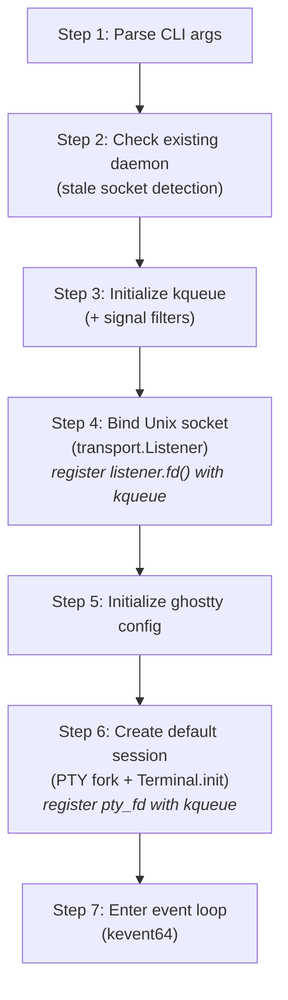
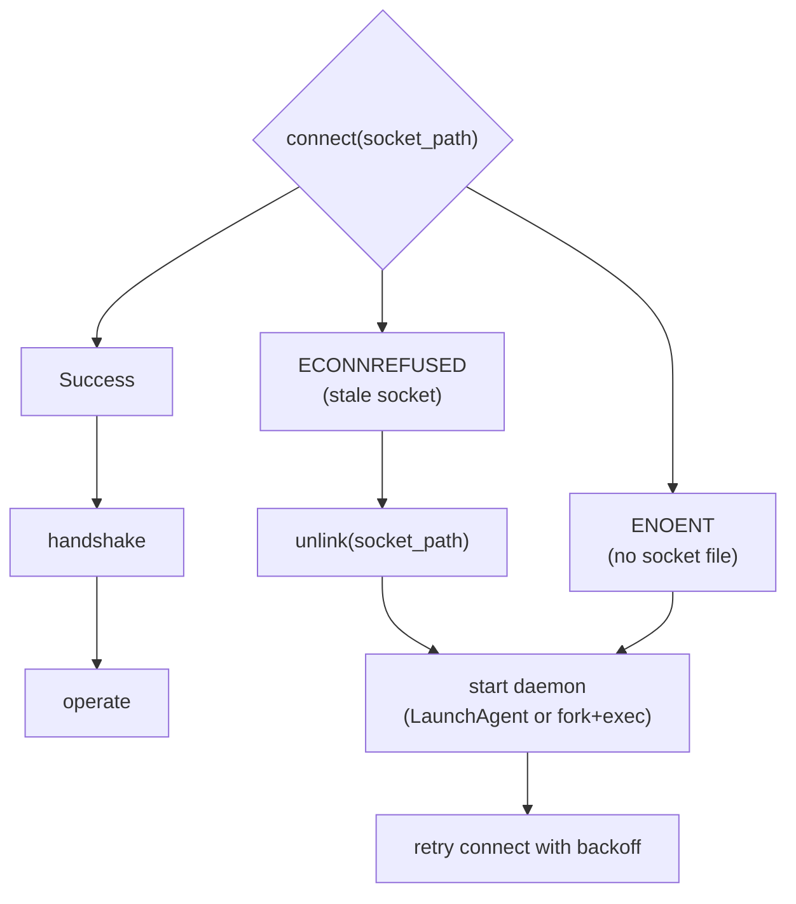
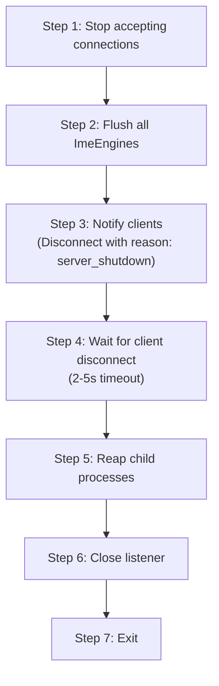
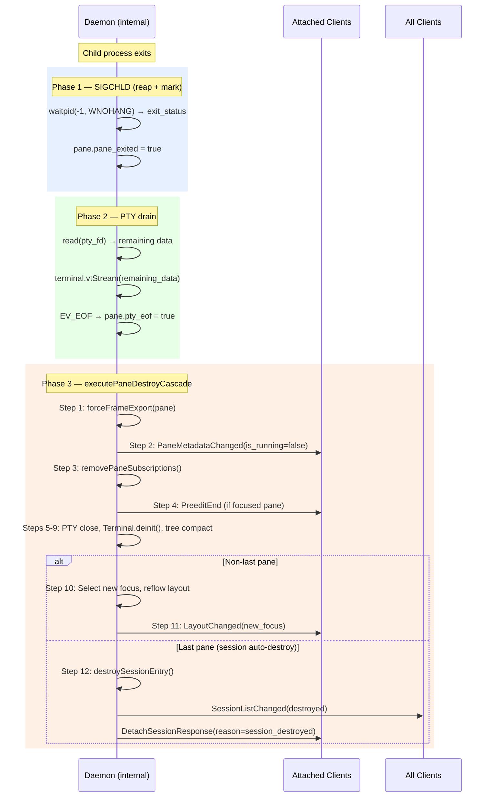
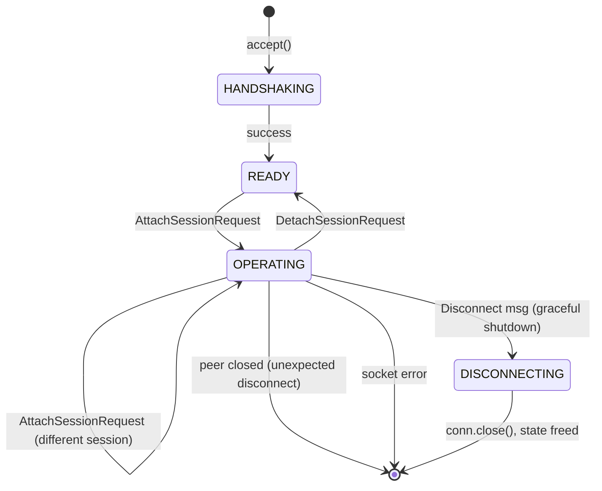
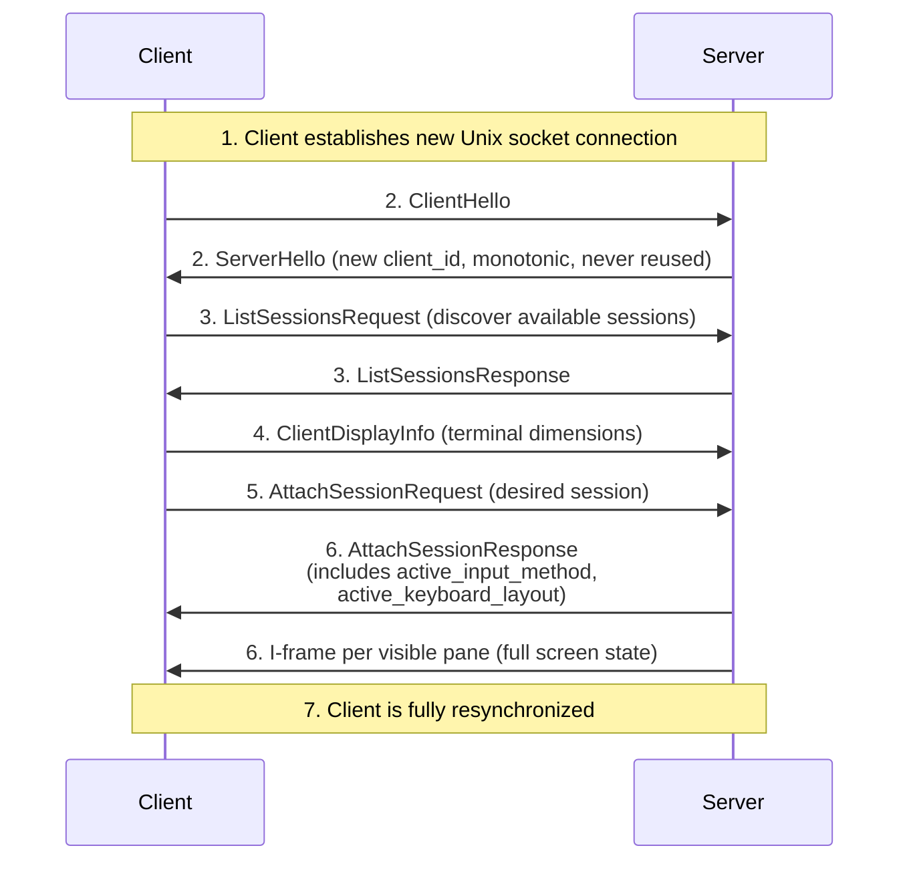
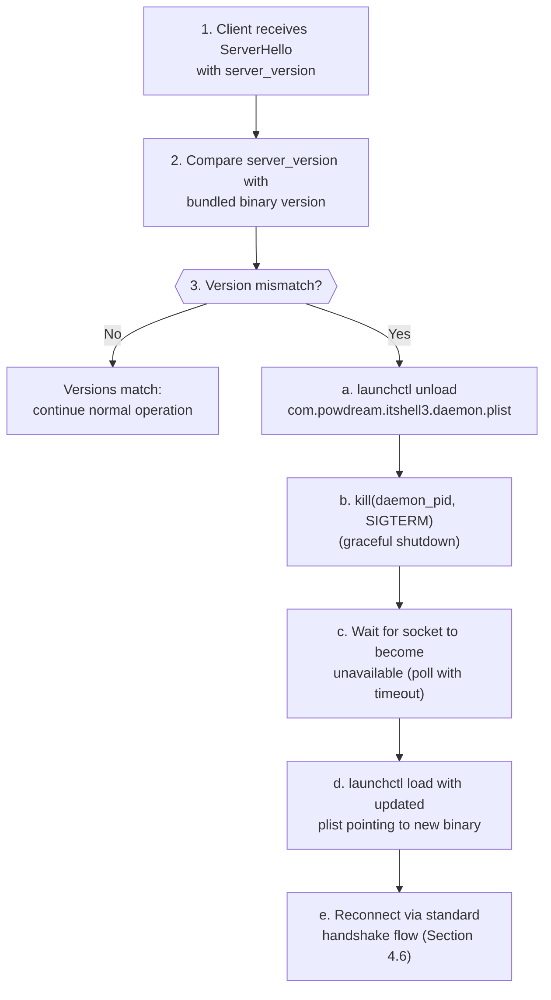
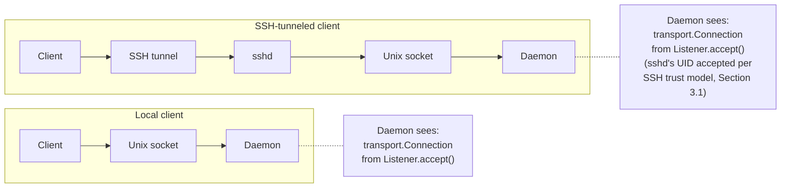

# Daemon Lifecycle and Client Connections

- **Date**: 2026-03-23
- **Scope**: Daemon startup/shutdown sequences, client connection lifecycle,
  ring buffer delivery model, auto-start, crash recovery, reconnection, and
  version conflict handling

---

## 1. Daemon Startup

The daemon follows a 7-step startup sequence. Each step has a single
responsibility, a clear failure mode, and a defined recovery action. Steps are
ordered by dependency: kqueue must exist before FDs can be registered, ghostty
config must be loaded before Terminal instances are created, etc.

### 1.1 Startup Sequence



#### Step 1: Parse CLI Arguments

| Argument        | Default     | Description                                                                         |
| --------------- | ----------- | ----------------------------------------------------------------------------------- |
| `--server-id`   | `"default"` | Identifies this daemon instance. Used in socket path resolution.                    |
| `--socket-path` | (computed)  | Override the socket path. Bypasses the 4-step resolution algorithm.                 |
| `--foreground`  | `false`     | Run in foreground. Skips LaunchAgent registration. Required for SSH fork+exec mode. |

#### Step 2: Check Existing Daemon

Uses `transport.connect()` to probe the resolved socket path:

| Probe result        | Meaning                                | Action                                                                                                                    |
| ------------------- | -------------------------------------- | ------------------------------------------------------------------------------------------------------------------------- |
| Connection succeeds | Daemon already running                 | Exit with message: "daemon already running at {path}"                                                                     |
| `ECONNREFUSED`      | Stale socket (previous daemon crashed) | Transport layer's stale socket detection reports this to caller. Caller proceeds — `Listener.init()` will handle cleanup. |
| `ENOENT`            | No socket file                         | Proceed (first startup)                                                                                                   |

This step prevents two daemons from binding to the same socket path. The probe
uses the same `transport.connect()` API that clients use, ensuring identical
path resolution logic.

#### Step 3: Initialize kqueue

```
kqueue() -> kq_fd

Register signal filters:
  EVFILT_SIGNAL, SIGTERM  — graceful shutdown
  EVFILT_SIGNAL, SIGINT   — graceful shutdown (Ctrl-C in foreground mode)
  EVFILT_SIGNAL, SIGHUP   — graceful shutdown (terminal hangup)
```

**Why step 3 (before socket bind)?** kqueue is created early so that FDs
produced by subsequent steps (listen_fd in step 4, pty_fd in step 6) can be
registered with kqueue immediately after creation. This eliminates a window
where events on those FDs could be missed between creation and registration.

Signal delivery via `EVFILT_SIGNAL` requires the corresponding signals to be
blocked with `sigprocmask(SIG_BLOCK, ...)` so they are consumed by `kevent64()`
rather than invoking default signal handlers. The block mask is set once at
daemon startup, before any FDs are created.

SIGCHLD is also registered via `EVFILT_SIGNAL` for child process reaping during
normal operation (see Section 3.2).

#### Step 4: Bind Unix Socket

```
transport.Listener.init(config)
  socket(AF_UNIX, SOCK_STREAM)
  -> stale socket detection (connect probe + unlink if ECONNREFUSED)
  -> mkdir(socket_dir, 0700)   (create parent directory if needed)
  -> bind(sock_fd, sockaddr_un)
  -> listen(sock_fd, backlog)
  -> chmod(socket_path, 0600)  (owner-only access)
  -> fcntl(sock_fd, F_SETFL, O_NONBLOCK)

Register listener.fd() with kqueue:
  EVFILT_READ on listen_fd — triggers on incoming connections
```

`transport.Listener.init()` encapsulates the full socket setup sequence. The
daemon receives a `Listener` value and registers `listener.fd()` with kqueue.
The transport layer owns socket creation, security setup, and stale socket
cleanup. The daemon owns event loop integration.

**Socket and directory permissions:** The `mkdir(socket_dir, 0700)` and
`chmod(socket_path, 0600)` calls form a two-layer defense. The directory
permission (0700) prevents other users from listing or traversing the socket
directory — they cannot discover socket file names. The socket permission (0600)
prevents other users from connecting even if they know the socket path. Both
layers are necessary: directory-only protection is insufficient because an
attacker who guesses the socket name could connect directly; socket-only
protection is insufficient because directory listing reveals the socket name to
all local users.

**Fail-safe on wrong permissions:** If the socket directory already exists,
`Listener.init()` checks its permissions with `stat()`. If the directory is not
owned by the current UID or its mode is more permissive than 0700, the daemon
refuses to start and exits with a descriptive error (e.g., "socket directory
{path} has mode 0755, expected 0700 — refusing to start"). This prevents a
daemon from inadvertently operating on a socket directory created by another
user or with relaxed permissions (e.g., from a previous manual `mkdir`).

**Socket path resolution** (in transport layer): `$ITSHELL3_SOCKET` ->
`$XDG_RUNTIME_DIR/itshell3/<server-id>.sock` ->
`$TMPDIR/itshell3-<uid>/<server-id>.sock` ->
`/tmp/itshell3-<uid>/<server-id>.sock`. This 4-step fallback algorithm is shared
by both daemon and client via the transport layer.

#### Step 5: Initialize ghostty Config

Load terminal configuration (font, colors, scrollback size, default palette) via
ghostty config APIs. This creates the shared config object used as a template
for all `Terminal.init()` calls. Must complete before step 6 creates the first
Terminal instance.

#### Step 6: Create Default Session

```
Allocate SessionEntry:
  session.session_id = 1
  session.name = "default"
  session.ime_engine = HangulImeEngine.init(allocator, "direct")
  pane_slots = [MAX_PANES]?Pane{null} // initialized empty
  free_mask = 0xFFFF
  dirty_mask = 0x0000

Create initial Pane:
  forkpty() -> (pty_fd, child_pid)
  Terminal.init(allocator, .{.cols = 80, .rows = 24})
  pane_id = 1

Register pty_fd with kqueue:
  EVFILT_READ on pty_fd — triggers on shell output
```

`forkpty()` combines `openpty()` + `fork()` + `login_tty()`. The child process
execs the user's shell (`$SHELL` or `/bin/sh`). The parent (daemon) receives the
master fd and child pid.

The Session's `tree_nodes[0]` is initialized as a single `SplitNodeData` leaf
pointing to pane slot 0. The `focused_pane` is set to `PaneSlot` 0.

#### Step 7: Enter Event Loop

```
loop {
    n = kevent64(kq_fd, changelist, eventlist, timeout)
    for eventlist[0..n] -> |event| {
        switch (event.filter, event.ident) {
            listen_fd, EVFILT_READ   => acceptClient()
            pty_fd, EVFILT_READ      => handlePtyOutput(pane)
            conn_fd, EVFILT_READ     => handleClientMessage(client)
            conn_fd, EVFILT_WRITE    => drainToClient(client)
            EVFILT_TIMER             => coalesceAndExport()
            EVFILT_SIGNAL            => handleSignal(event.ident)
        }
    }
}
```

The event loop is single-threaded (doc01 §2). All state mutations — key input
processing, PTY output handling, client message parsing, frame export,
connection accept/close — are serialized by the event loop. No locks, no
mutexes, no data races.

### 1.2 Startup Failure Modes

| Step | Failure                             | Action                                                                                                                              |
| ---- | ----------------------------------- | ----------------------------------------------------------------------------------------------------------------------------------- |
| 2    | Connection succeeds (daemon exists) | Exit with informational message. Not an error.                                                                                      |
| 3    | `kqueue()` fails                    | Fatal — exit with errno. Indicates severe OS resource exhaustion.                                                                   |
| 4    | `bind()` fails with `EADDRINUSE`    | Stale socket was not cleaned up. `Listener.init()` handles stale detection and cleanup internally. If bind still fails, fatal exit. |
| 4    | `mkdir()` fails with `EACCES`       | Fatal — cannot create socket directory. Log path and permissions.                                                                   |
| 5    | ghostty config load fails           | Fatal — cannot create Terminal instances without config.                                                                            |
| 6    | `forkpty()` fails                   | Fatal — cannot create initial PTY. Log errno (`EAGAIN` = process limit, `ENOMEM` = memory).                                         |
| 6    | `Terminal.init()` fails             | Fatal — out of memory for terminal state.                                                                                           |

All fatal failures exit with a non-zero status code and a descriptive log
message. There is no partial startup — either all 7 steps succeed or the daemon
does not enter the event loop.

### 1.3 Client-Initiated Daemon Auto-Start

If no daemon is running, the client is responsible for starting one. The
auto-start mechanism depends on the environment:

| Environment          | Mechanism                     | Details                                                                                           |
| -------------------- | ----------------------------- | ------------------------------------------------------------------------------------------------- |
| **macOS (local)**    | LaunchAgent socket activation | Client writes plist and calls `launchctl load`. See Section 6 for LaunchAgent integration.        |
| **Linux / Fallback** | Fork+exec                     | Client forks `it-shell3-daemon --foreground`, waits up to 5s for socket to appear, then connects. |
| **Remote (SSH)**     | SSH fork+exec                 | Client runs `ssh user@host "it-shell3-daemon --foreground --server-id=<id>"`. See Section 7.      |
| **iOS**              | In-process                    | Daemon embedded in app process (no separate daemon).                                              |

**Client connect-or-start flow:**



**Reconnection backoff after daemon crash or restart:** Exponential backoff with
jitter: 100ms, 200ms, 400ms, ..., max 10s. After 5 consecutive failed connection
attempts, the client reports the failure to the user (e.g., dialog or status bar
notification). The client distinguishes clean exit (socket file removed by
graceful shutdown) from crash (stale socket file still present).

The backoff applies only to the client's connect retry loop, not to the daemon
itself. The daemon does not implement any retry logic — it either starts
successfully (Section 1.1) or exits with an error (Section 1.2).

---

## 2. Daemon Shutdown

Shutdown is triggered by three events:

1. **Signal**: SIGTERM, SIGINT, or SIGHUP received via `EVFILT_SIGNAL`
2. **Last session close**: The last remaining session's last pane exits (child
   process terminates, no sessions remain)
3. **Explicit command**: A client sends a shutdown request (future — not in v1)

All three trigger the same 7-step graceful shutdown sequence.

### 2.1 Graceful Shutdown Sequence



#### Step 1: Stop Accepting Connections

Remove `listen_fd` from kqueue. No new `accept()` calls will be made. Existing
connections continue to be serviced during the drain period.

#### Step 2: Flush All ImeEngines

For each session: call `entry.session.ime_engine.deactivate()`. This eagerly
flushes any active preedit composition:

- If the engine has pending preedit text, `deactivate()` returns an `ImeResult`
  with `committed_text` set.
- The daemon writes the committed text to the session's focused pane PTY via
  `write(pty_fd, committed_text)`.
- This ensures no user input is silently discarded during shutdown.
- If no composition is active, `deactivate()` returns `ImeResult{}` (all
  null/false) — zero cost.

#### Step 3: Notify Clients

Send `Disconnect` message with `reason: server_shutdown` to all connected
clients via their `conn.send()`. This is a best-effort notification — if
`send()` returns `.would_block` or `.peer_closed`, the daemon does not retry.

#### Step 4: Wait for Client Disconnect

Set a kqueue timer (EVFILT_TIMER, 2-5 seconds). Continue processing the event
loop during this window to allow clients to:

- Receive the `Disconnect` message
- Send any final messages (e.g., session detach acknowledgment)
- Close their connections gracefully

When all clients have disconnected (all `conn.fd` values closed by peers),
proceed immediately without waiting for the full timeout. If the timeout expires
with clients still connected, proceed anyway — force-close remaining
connections.

#### Step 5: Reap Child Processes

For each pane:

```
kill(child_pid, SIGHUP)       // signal shell to exit
waitpid(child_pid, WNOHANG)   // non-blocking reap attempt
close(pty_fd)                  // close PTY master
Terminal.deinit()              // free terminal state
```

`SIGHUP` is the conventional signal for "terminal hangup" — shells interpret it
as the terminal being closed and will exit. `WNOHANG` prevents blocking on a
slow-to-exit child. If `waitpid` returns 0 (child still running), the child
becomes orphaned and will be reaped by init/launchd. The daemon does NOT send
SIGKILL — that is excessively aggressive for a terminal multiplexer.

#### Step 6: Close Listener

```
listener.deinit()
  close(listen_fd)
  unlink(socket_path)    // remove socket file from filesystem
  free(path_string)      // deallocate socket path memory
```

`listener.deinit()` performs compound cleanup: close the listening fd, remove
the socket file, and free any allocated path string. This is the transport
layer's responsibility.

#### Step 7: Exit

`exit(0)` for clean shutdown, `exit(1)` for shutdown due to unrecoverable error.

### 2.2 Crash Recovery (Unclean Shutdown)

If the daemon crashes or is killed with SIGKILL, the graceful shutdown sequence
does not run. The consequences:

| Resource        | State after crash                                                            | Recovery                                                                                                     |
| --------------- | ---------------------------------------------------------------------------- | ------------------------------------------------------------------------------------------------------------ |
| Socket file     | Stale file remains on disk                                                   | Next daemon startup detects via `connect()` probe -> `ECONNREFUSED` -> `Listener.init()` unlinks and rebinds |
| Child processes | Receive SIGHUP from PTY master close (kernel closes all FDs on process exit) | Shells exit on SIGHUP. No explicit cleanup needed.                                                           |
| PTY master FDs  | Closed by kernel on process exit                                             | Slave side gets EIO; child shells detect and exit                                                            |
| Active preedit  | Lost                                                                         | Acceptable — preedit is transient input state, not persistent data                                           |
| Terminal state  | Lost (in-memory only)                                                        | Session persistence (Phase 4) will save/restore terminal content                                             |

The key insight: Unix process cleanup guarantees (kernel closes all FDs, PTY
slaves get EIO) mean that crash recovery requires no special daemon code. The
only artifact is the stale socket file, which is handled by the transport
layer's stale socket detection.

### 2.3 PTY FD Passing for Crash Recovery

Unix domain sockets support file descriptor passing via `sendmsg(2)` with
`SCM_RIGHTS` ancillary data. This enables an optional crash recovery
optimization: a surviving daemon can pass PTY master FDs to a reconnecting
client (or a new daemon process inheriting the session).

| Aspect    | Detail                                                                                           |
| --------- | ------------------------------------------------------------------------------------------------ |
| Mechanism | `sendmsg(2)` / `recvmsg(2)` with `SCM_RIGHTS` control message                                    |
| Scope     | Unix socket only — not available over SSH tunnels                                                |
| Use case  | Passing PTY master FDs from a daemon to a client for direct PTY access (single-client fast path) |
| Status    | Optional optimization — the protocol works without it                                            |

**Limitations:**

- FD passing requires both processes to be on the same host. SSH-tunneled
  connections cannot use `SCM_RIGHTS` because `sshd` intermediates the Unix
  socket connection.
- In v1, the primary crash recovery mechanism is the standard reconnection flow
  (Section 4.6) with full I-frame state resync. FD passing is reserved for
  future optimization (e.g., zero-copy PTY relay in single-client mode).

---

## 3. Runtime Event Handling

### 3.1 New Client Connection

When `EVFILT_READ` fires on `listen_fd`:

```
conn = listener.accept()
  accept(listen_fd) -> client_fd
  getpeereid(client_fd) -> (uid, gid)    // macOS
  verify uid == daemon_uid               // reject unauthorized connections
  fcntl(client_fd, F_SETFL, O_NONBLOCK)
  setsockopt(client_fd, SO_SNDBUF, 256 KiB)
  setsockopt(client_fd, SO_RCVBUF, 256 KiB)
  return Connection{ .fd = client_fd }

Allocate ClientState:
  client_id = next_client_id++
  conn = conn
  state = .handshaking
  message_reader = MessageReader.init()

Register conn.fd with kqueue:
  EVFILT_READ on conn.fd
```

UID verification rejects connections from other users. On macOS, `getpeereid()`
extracts the peer's effective UID from the socket. On Linux, `SO_PEERCRED`
provides the same information. This check is centralized in `Listener.accept()`
(transport layer).

**SSH tunnel trust model:** When a client connects through an SSH tunnel,
`getpeereid()` returns sshd's UID, not the remote user's UID. The daemon accepts
this because SSH has already authenticated the user at the transport layer. The
trust chain is:

```
SSH key/password authentication → sshd process (runs as target user)
  → Unix socket connection (from sshd) → daemon getpeereid() → sshd's UID
```

The daemon trusts sshd's UID as a proxy for the authenticated remote user's
identity. This avoids the security audit risk of a custom mTLS/SRP
implementation and leverages SSH's decades of hardening. No protocol-level
authentication exists — the `ClientHello`/`ServerHello` handshake is identical
for local and tunneled connections. Authentication is transport-layer, not
application-layer.

### 3.2 Child Process Exit (Pane Exit Cascade)

Child process exit handling uses a two-phase model to ensure the user sees the
child's final output before the pane disappears. Instead of immediately
destroying the pane in the SIGCHLD handler, the daemon marks the pane as exited,
allows remaining PTY data to drain, and only then executes the destroy cascade.

**Event processing priority**: When a single `kevent64()` call returns both
`EVFILT_SIGNAL` (SIGCHLD) and `EVFILT_READ` (PTY data) events, `EVFILT_SIGNAL`
MUST be processed first. This ensures the `PANE_EXITED` flag is set before the
PTY read handler checks for it, which is critical for correct two-phase model
operation.

#### Phase 1 — SIGCHLD Handler (Reap + Mark)

When `EVFILT_SIGNAL` fires for SIGCHLD:

```
loop {
    result = waitpid(-1, WNOHANG)
    if result.pid == 0: break          // no more exited children
    if result.pid == -1 and errno == ECHILD: break  // no children

    pane = lookupPaneByChildPid(result.pid)
    if pane == null: continue          // unknown child

    pane.is_running = false
    pane.exit_status = WEXITSTATUS(result.status)
    pane.pane_exited = true

    // Check if PTY EOF was already received (rare: EOF before SIGCHLD)
    if pane.pty_eof:
        executePaneDestroyCascade(pane)
    // else: PTY read handler will drain remaining data and trigger cascade
}
```

The `waitpid(-1, WNOHANG)` loop reaps all exited children in one pass. Multiple
SIGCHLD signals can coalesce into one delivery (standard Unix behavior), so the
loop continues until `waitpid` returns 0 or `ECHILD`.

SIGCHLD arrives via `EVFILT_SIGNAL` (blocked with `sigprocmask`), not a signal
handler. Processing runs in normal execution context — no signal-safety
constraints on the code in Phase 1.

**Safety timeout**: When a pane enters `PANE_EXITED` state without `PTY_EOF`, a
5-second `EVFILT_TIMER` fallback is armed for that pane. If `EV_EOF` never
arrives (pathological case — e.g., a background process inherits the PTY slave
fd), the timeout fires and triggers `executePaneDestroyCascade()`
unconditionally. This prevents zombie panes from persisting indefinitely.

#### Phase 2 — PTY Read Handler (Drain Remaining Data)

The PTY read handler drains remaining data after the child exits, using kqueue's
`EV_EOF` flag to detect PTY slave closure:

```
When EVFILT_READ fires for a pty_fd:
    n = read(pty_fd, buf)
    if n > 0:
        // silence timer reset + dirty_mask (before vtStream — see doc04 §11.3)
        pane.silence_deadline = now + min_threshold  // if subscribers exist
        dirty_mask |= (1 << pane.slot_index)
        terminal.vtStream(buf[0..n])
        // coalescing continues as normal

    if event.flags & EV_EOF:
        // PTY slave closed — kqueue delivers EV_EOF even with zero remaining data
        pane.pty_eof = true
        if pane.pane_exited:
            executePaneDestroyCascade(pane)
```

The dual-flag model (`PANE_EXITED` + `PTY_EOF`) handles both arrival orders
without extra syscalls. Either event can arrive first: if SIGCHLD arrives first,
the SIGCHLD handler checks `PTY_EOF`; if PTY EOF arrives first, the read handler
checks `PANE_EXITED`. The cascade triggers when both flags are set, regardless
of arrival order.

#### Phase 3 — `executePaneDestroyCascade(pane)`

The complete 12-step cascade, executed within a single event loop iteration:

```
executePaneDestroyCascade(pane):
    session_entry = pane's owning SessionEntry

    // Step 1: Flush pending frame data
    if pane.has_dirty_state:
        forceFrameExport(pane)  // immediate bulkExport + send to clients
        // Ensures clients see the child's final rendered output

    // Step 2: Notify clients of process exit
    send PaneMetadataChanged{ pane_id, is_running: false, exit_status }
        to all attached clients
    send ProcessExited{ pane_id, exit_status } (0x0801)
        to subscribed clients (opt-in notification)

    // Step 3: Cancel silence subscriptions (CTR-13 cleanup trigger 6)
    removePaneSubscriptions(pane.slot_index)

    // Step 4: IME cleanup (only if this was the focused pane)
    if session.focused_pane == pane.slot_index:
        if session has remaining panes:
            session.ime_engine.reset()   // discard composition (PTY is dead)
            session.current_preedit = null
            session.preedit.owner = null
            if composition was active:
                send PreeditEnd{ reason: "pane_closed" } to all attached clients
                session.preedit.session_id += 1  // after PreeditEnd (carries old id)
        else:
            // Last pane — deactivate NOW while PTY fd is still open
            result = session.ime_engine.deactivate()
            if result.committed_text:
                write(pane.pty_fd, result.committed_text)  // best-effort flush
            session.current_preedit = null
            session.preedit.owner = null
            if composition was active:
                send PreeditEnd{ reason: "session_destroyed" } to all attached clients

    // Step 5: Remove PTY fd from kqueue
    kevent(kq, EV_DELETE, pane.pty_fd)

    // Step 6: Close PTY fd
    close(pane.pty_fd)

    // Step 7: Free ghostty Terminal state
    Terminal.deinit()

    // Step 8: Invalidate pane slot
    pane_slots[pane.slot_index] = null
    free_mask |= (1 << pane.slot_index)

    // Step 9: Remove pane from split tree, compact
    remove leaf for pane.slot_index from tree_nodes
    compact tree (relocate subtrees as needed)

    // Step 10: Determine outcome
    if session has remaining panes:
        // Step 10a: Select new focused pane
        new_focus = findPaneInDirection(tree_nodes, ..., old_focus, ...)
                    or sibling heuristic
        session.focused_pane = new_focus

        // Step 10b: Reflow layout (recompute geometric positions)
        reflow(tree_nodes, total_cols, total_rows)

        // Step 11: Notify clients of layout change (includes new focus)
        send LayoutChanged{ tree, focused_pane_id: new_focus.pane_id }
            to all attached clients

    else:
        // Step 12: Last pane — session auto-destroy
        // IME already deactivated + flushed in step 4 (PTY was still open)
        engine.deinit()
        // No requester — broadcast first
        broadcast SessionListChanged{ event: "destroyed", session_id }
            to all clients
        force-detach all attached clients → READY
        free SessionEntry
        if no sessions remain: initiate graceful shutdown
```

**Non-focused pane exit**: When the exiting pane is NOT the focused pane, step 4
(IME cleanup) is skipped entirely. The IME engine only tracks state for the
focused pane. All other steps are identical.

**Ordering invariants**:

| Constraint                                        | Source                                  | Steps                   |
| ------------------------------------------------- | --------------------------------------- | ----------------------- |
| Pending frames flushed before PaneMetadataChanged | protocol-architect + system-sw-engineer | 1 before 2              |
| PaneMetadataChanged before silence cleanup        | system-sw-engineer                      | 2 before 3              |
| IME cleanup before resource cleanup               | ime-system-sw-engineer                  | 4 before 5-7            |
| PreeditEnd before LayoutChanged                   | ime-system-sw-engineer                  | 4b before 11            |
| Terminal.deinit() after PTY close                 | ghostty-integration-engineer            | 7 after 6               |
| Terminal.deinit() before tree mutation            | ghostty-integration-engineer            | 7 before 9              |
| No tombstone state                                | ghostty-integration-engineer            | 8 (slot null) is atomic |
| Focus selection before LayoutChanged              | protocol-architect                      | 10a before 11           |
| PaneMetadataChanged before LayoutChanged          | protocol-architect                      | 2 before 11             |
| LayoutChanged before SessionListChanged           | protocol-architect                      | 11 before 12            |
| EVFILT_SIGNAL before EVFILT_READ                  | system-sw-engineer                      | Phase 1 before Phase 2  |

#### Pane Exit Sequence Diagram



**Cross-reference note**: The `doc01` Section 3.4 text description of pane exit
behavior should reference this section (doc03 §3.2) as the single authoritative
specification for the pane exit cascade. This section supersedes any parallel
description in `doc01`.

### 3.3 Client Disconnect (Unexpected)

When `conn.recv()` returns `.peer_closed`:

```
Remove conn.fd from kqueue
conn.close()
Free ClientState:
  clear ring_cursors
  if client was attached to a session:
    // Preedit ownership cleanup (doc04 §8.2):
    // If the disconnecting client is session.preedit.owner,
    // execute §8.1 steps 1-7 with reason: "client_disconnected",
    // owner set to null — BEFORE tearing down ClientState.
    if session.preedit.owner == client.client_id:
        engine.flush()
        committed_text = result.committed_text  // copy before next engine call
        write(focused_pane.pty_fd, committed_text)
        session.current_preedit = null
        send PreeditEnd{ reason: "client_disconnected", preedit_session_id }
            to all attached clients
        session.preedit.session_id += 1
        session.preedit.owner = null
  // Silence subscription cleanup (CTR-13 cleanup trigger 2)
  removeClientSubscriptions(client.client_id)
  deallocate ClientState
```

Client disconnection does NOT affect session lifecycle. Sessions persist until
their panes exit or the daemon shuts down. This is the fundamental property of a
terminal multiplexer — sessions survive client detach/crash/reconnect. However,
per-client resources (preedit ownership, silence subscriptions) must be cleaned
up before deallocation.

**Note on DISCONNECTING bypass**: Unexpected disconnects go directly to
`[closed]` without passing through the DISCONNECTING state. This is intentional.
The DISCONNECTING state exists to drain pending outbound messages (e.g., after
`Disconnect` with `reason: server_shutdown`), but when the peer has already
disconnected, there is no socket to drain to — any pending messages are
undeliverable. The state machine diagram in Section 4.1 shows the primary
graceful flow; unexpected disconnects (`conn.recv()` returning `.peer_closed`)
are a distinct path that skips DISCONNECTING because the drain step is
semantically inapplicable.

### 3.4 Session Destroy Cascade

When a client sends `DestroySessionRequest`, the daemon executes an ordered
4-phase procedure within a single event loop iteration. Single-threaded
serialization guarantees no interleaving with other events.

```
handleDestroySession(requester_client_id, session_id):

    entry = sessions.get(session_id) orelse return ERR_NOT_FOUND

    // Phase 1: IME cleanup (needs focused pane PTY still open)
    result = entry.session.ime_engine.deactivate()
    if result.committed_text:
        write(focused_pane.pty_fd, result.committed_text)  // best-effort flush
    if composition was active:
        send PreeditEnd{ reason: "session_destroyed" } to all attached clients
    session.current_preedit = null
    session.preedit.owner = null
    entry.session.ime_engine.deinit()

    // Phase 2: Resource cleanup
    for each pane in session:
        cancel silence subscriptions for pane (CTR-13 cleanup trigger 6)
        kill(pane.child_pid, SIGHUP)    // explicit signal, consistent with
                                         // graceful shutdown (Section 2.1 Step 5)
                                         // and ClosePaneRequest
        remove pane.pty_fd from kqueue
        close(pane.pty_fd)
        Terminal.deinit()
        pane_slots[slot] = null
        free_mask |= (1 << slot)

    // Phase 3: Protocol notifications
    // Response to requester FIRST (response before notification rule)
    send DestroySessionResponse{ status: 0 } to requester

    // Broadcast to ALL connected clients (including requester)
    broadcast SessionListChanged{ event: "destroyed", session_id } to all clients

    // Force-detach other attached clients
    for clients_attached_to(session_id):
        if client.id == requester_client_id: continue
        send DetachSessionResponse{ reason: "session_destroyed" } to client
        client.state = READY
        client.attached_session = null
        send ClientDetached{ client_id: client.id } to requester

    // Phase 4: Free session state
    free SessionEntry
```

**Key ordering constraints**:

- IME `deactivate()` before PTY close — flush may write to PTY
- `DestroySessionResponse` before `SessionListChanged` —
  response-before-notification rule
- All messages sent in one event loop iteration — no yield to kevent between
  them (Unix socket SOCK_STREAM guarantees in-order delivery)
- Session state freed AFTER all notifications sent — notification construction
  may reference session fields (name, id)
- `engine.deactivate()` is unconditional — if the PTY is dead (last-pane SIGCHLD
  case), the write fails silently, which is acceptable (best-effort)

**Shared teardown with pane exit cascade (Section 3.2)**: The last-pane SIGCHLD
path (Section 3.2 step 12) follows a similar procedure but with different
notification ordering. The explicit `DestroySessionRequest` path (Section 3.4)
sends `DestroySessionResponse` before `SessionListChanged`
(response-before-notification rule). The SIGCHLD path has no requesting client,
so it broadcasts `SessionListChanged` first and skips `DestroySessionResponse`
and `ClientDetached` entirely.

### 3.5 Session Rename Broadcast

When a client sends `RenameSessionRequest`, the daemon validates the new name,
updates state, and broadcasts the change:

```
handleRenameSession(requester_client_id, session_id, new_name):
    entry = sessions.get(session_id) orelse return ERR_NOT_FOUND
    if name_already_in_use(new_name): return ERR_DUPLICATE_NAME

    // 1. Update state
    entry.session.name = new_name

    // 2. Response to requester first
    send RenameSessionResponse{ status: 0 } to requester

    // 3. Broadcast to all connected clients
    broadcast SessionListChanged{ event: "renamed", session_id, name: new_name }
```

No IME or ghostty implications for rename — session name is daemon-level
metadata. The response-before-notification ordering rule applies here as well.

---

## 4. Client Connection Lifecycle

Each client connection is managed by a per-client state machine. The daemon
tracks client state from `accept()` to `close()`.

### 4.1 State Machine

The daemon uses a subset of the canonical 6-state model from protocol doc 01
(Section 5.2). DISCONNECTED and CONNECTING are client-side only — the daemon
never initiates connections. The daemon's state machine starts at HANDSHAKING
after `Listener.accept()`.



### 4.2 State Transitions

| From          | Event                                    | To            | Action                                                                                                                             |
| ------------- | ---------------------------------------- | ------------- | ---------------------------------------------------------------------------------------------------------------------------------- |
| HANDSHAKING   | Valid ClientHello received               | READY         | Send ServerHello with capabilities, protocol version                                                                               |
| HANDSHAKING   | Invalid ClientHello / timeout            | [closed]      | Send error, close connection                                                                                                       |
| READY         | AttachSessionRequest                     | OPERATING     | Set `attached_session`, initialize ring cursors for all visible panes, send I-frame for initial screen                             |
| READY         | Client disconnect                        | [closed]      | Clean up ClientState                                                                                                               |
| OPERATING     | DetachSessionRequest                     | READY         | Clear `attached_session`, clear ring cursors, remove silence subscriptions for detached session's panes (CTR-13 cleanup trigger 4) |
| OPERATING     | AttachSessionRequest (different session) | OPERATING     | Detach from current session, attach to new session, reinitialize ring cursors                                                      |
| OPERATING     | KeyEvent / MouseEvent                    | OPERATING     | Route to attached session's focused pane (Section 4.5)                                                                             |
| OPERATING     | WindowResize                             | OPERATING     | Update `display_info`, recalculate pane dimensions                                                                                 |
| OPERATING     | Client disconnect                        | [closed]      | Clean up ClientState                                                                                                               |
| OPERATING     | `Disconnect` (reason: `server_shutdown`) | DISCONNECTING | Begin drain sequence                                                                                                               |
| DISCONNECTING | All pending messages sent                | [closed]      | `conn.close()`, free ClientState                                                                                                   |
| DISCONNECTING | Drain timeout expires                    | [closed]      | `conn.close()`, free ClientState                                                                                                   |

The key transition is **OPERATING -> READY** (detach without disconnect). This
allows session switching without reconnecting: the client detaches from session
A, returns to READY, then attaches to session B. The Unix socket connection
stays open throughout.

### 4.3 Per-Client State

```zig
const ClientState = struct {
    client_id: u32,
    conn: transport.Connection,
    state: enum { handshaking, ready, operating, disconnecting },
    attached_session: ?*SessionEntry,
    capabilities: CapabilitySet,
    ring_cursors: [MAX_PANES]?RingCursor, // indexed by PaneSlot (0..15)
    display_info: ClientDisplayInfo,
    message_reader: protocol.MessageReader,
};
```

| Field              | Description                                                                                                                  |
| ------------------ | ---------------------------------------------------------------------------------------------------------------------------- |
| `client_id`        | Monotonically increasing identifier assigned at `accept()`                                                                   |
| `conn`             | Transport connection (4-byte struct, holds fd)                                                                               |
| `state`            | Current state in the per-client state machine                                                                                |
| `attached_session` | Pointer to the session this client is viewing. Null when in READY state.                                                     |
| `capabilities`     | Negotiated capabilities from handshake (e.g., clipboard_sync, mouse, preedit)                                                |
| `ring_cursors`     | Per-pane read positions into the shared ring buffer. Fixed array indexed by `PaneSlot` (0..15). One cursor per visible pane. |
| `display_info`     | Client's terminal dimensions and display capabilities (used for pane layout calculation)                                     |
| `message_reader`   | Per-connection framing state. Accumulates partial messages across `recv()` calls.                                            |

### 4.4 Message Receive Path

When `EVFILT_READ` fires on a client's `conn.fd`:

```
result = client.conn.recv(buf)
switch (result) {
    .bytes_read => |n| {
        client.message_reader.feed(buf[0..n])
        while (client.message_reader.next()) |message| {
            // Validate message against current state
            // (Layer 3 connection protocol rejects invalid sequences)
            processMessage(client, message)
        }
    },
    .would_block => {
        // Spurious wakeup, ignore (re-armed automatically by kqueue)
    },
    .peer_closed => {
        handleClientDisconnect(client)  // Section 3.3
    },
    .err => |e| {
        log.err("recv error on client {}: {}", .{client.client_id, e})
        handleClientDisconnect(client)
    },
}
```

`MessageReader.feed()` appends bytes to the framing buffer.
`MessageReader.next()` attempts to extract a complete message (16-byte header +
payload). Multiple messages may arrive in a single `recv()` — the `while` loop
processes all of them.

### 4.5 Multi-Client Input Model

All attached clients can send input. There is no primary/secondary distinction:

- **KeyEvent**: Routed to the `attached_session`'s focused pane. Processed
  through Phase 0->1->2 key routing (doc02 §4.2).
- **MouseEvent**: Forwarded to the focused pane's Terminal via ghostty mouse
  APIs (mouseButton, mouseScroll, mousePos), if mouse reporting is enabled in
  the terminal's DEC mode state.
- **Last writer wins**: If two clients send KeyEvents to the same pane
  simultaneously, the events are processed in the order they arrive at the event
  loop. The single-threaded model (doc01 §2) provides total ordering.

Readonly attachment is a client-requested mode (per the readonly client
permissions defined in the protocol docs). The daemon enforces it by discarding
input messages from clients that requested readonly mode. This is NOT
server-enforced based on connection order.

### 4.6 Reconnection Procedure

When a client reconnects to a running daemon (after disconnect, crash, or daemon
restart), the reconnection follows the standard handshake flow. There is no
incremental reconnection protocol — no "replay from sequence N."

**Reconnection sequence:**



**Why no incremental replay:** Every reconnection is a full state resync via
I-frame from the shared ring buffer (Section 5). The full state for a typical
terminal (120x40) is under 35 KB — small enough that full resync is simpler and
more reliable than maintaining per-client sequence watermarks across
disconnections. If reconnection latency becomes a problem, incremental replay
can be added later.

**Reconnection is client-driven:** The daemon has no reconnection logic. It
simply accepts connections, performs handshake, and serves sessions. Whether a
connection is a first-time connect or a reconnection is indistinguishable from
the daemon's perspective — every connection starts fresh with a new `client_id`,
new `MessageReader`, and new `ring_cursors`.

### 4.7 Handshake Timeouts

The daemon enforces timeouts at each stage of the connection lifecycle to
prevent resource exhaustion from stalled or misbehaving clients.

| Stage                                                                           | Duration   | Action on timeout                                 |
| ------------------------------------------------------------------------------- | ---------- | ------------------------------------------------- |
| Transport connection (accept to first byte)                                     | 5 seconds  | Close socket, report connection failure           |
| `ClientHello` → `ServerHello`                                                   | 5 seconds  | Send `Error(ERR_INVALID_STATE)`, close connection |
| `READY` → `AttachSessionRequest`/`CreateSessionRequest`/`AttachOrCreateRequest` | 60 seconds | Send `Disconnect(TIMEOUT)`, close connection      |
| Heartbeat response                                                              | 90 seconds | Send `Disconnect(TIMEOUT)`, close connection      |

This is the single authoritative timeout table. The protocol spec defers
concrete timeout values and enforcement to daemon design docs.

**Implementation:** Each timeout is a per-client `EVFILT_TIMER` registered with
kqueue when the client enters the corresponding stage. The timer is cancelled
when the expected message arrives. For the heartbeat timeout, the timer resets
on each received heartbeat response.

### 4.8 Server Negotiation Algorithms

The protocol spec defines the wire-observable outcomes of negotiation (which
error codes are sent under which conditions). The server-side decision
algorithms are defined here.

#### 4.8.1 Protocol Version Selection

```
negotiated_version = min(server_max_version, client.protocol_version_max)

if negotiated_version < client.protocol_version_min:
    -> send Error(ERR_VERSION_MISMATCH), disconnect
if negotiated_version < server_min_version:
    -> send Error(ERR_VERSION_MISMATCH), disconnect
```

In v1, both `protocol_version_min` and `protocol_version_max` are `1`. This
field exists for future version negotiation.

#### 4.8.2 General Capability Intersection

```
negotiated_caps = intersection(client.capabilities, server.capabilities)
```

Each capability is independently negotiated as the intersection of client and
server flag sets. A capability is active only if both sides support it. Unknown
capability names are ignored (forward compatibility — a v2 client advertising a
capability unknown to a v1 server does not cause an error).

#### 4.8.3 Render Capability Intersection

```
negotiated_render_caps = intersection(client.render_capabilities, server.render_capabilities)
```

The server validates that at least one rendering mode is supported:

```
if "cell_data" not in negotiated_render_caps and "vt_fallback" not in negotiated_render_caps:
    -> send Error(ERR_CAPABILITY_REQUIRED, detail="No common rendering mode"), disconnect
```

This gate runs after capability intersection, before `ServerHello` is sent. If
neither `cell_data` nor `vt_fallback` survives intersection, the server and
client have no common way to deliver terminal content — the connection is
unviable.

---

## 5. Ring Buffer Delivery Model

The ring buffer is the daemon's mechanism for delivering frame updates to
multiple clients efficiently. It lives in `server/`, not in the protocol
library.

### 5.1 Per-Pane Ring Buffer

Each pane maintains a single ring buffer containing serialized frame data:

```
Ring Buffer (per pane, in server/)
+-------+-------+-------+-------+-------+-------+
| I-0   | P-1   | P-2   | I-3   | P-4   | P-5   |  <- frame slots
+-------+-------+-------+-------+-------+-------+
  ^                        ^               ^
  |                        |               |
  oldest                   client B        client A
  (will be overwritten)    cursor          cursor
```

- **I-frame** (keyframe): Complete screen state. Self-contained — a client can
  render from an I-frame alone without any prior frames.
- **P-frame** (delta): Only changed rows since the last frame (cumulative dirty
  rows since last I-frame). Smaller than I-frames but requires the preceding
  I-frame as a base.

Frame data is serialized once per pane per coalescing interval, regardless of
how many clients are attached. This eliminates O(N) serialization cost for
multi-client delivery.

**Ring buffer parameters:**

| Parameter         | Default       | Configurable                            | Description                                        |
| ----------------- | ------------- | --------------------------------------- | -------------------------------------------------- |
| Ring size         | 2 MB per pane | Server config (not protocol-negotiated) | Total ring buffer capacity                         |
| Keyframe interval | 1 second      | Server config (0.5-5 seconds)           | How often the server writes an I-frame to the ring |

**Sizing analysis** (120x40 CJK worst case, 1s keyframe interval, 60fps Active
tier):

| Component                                         | Size    |
| ------------------------------------------------- | ------- |
| I-frame (120x40, 16-byte FlatCells)               | ~77 KB  |
| P-frame (typical 5 dirty rows)                    | ~10 KB  |
| 1 second of Active tier (60 P-frames + 1 I-frame) | ~677 KB |

2 MB covers typical interactive use with headroom. For sustained heavy output
(e.g., full-screen rewrite at maximum rate), the ring wraps and slow clients
skip to the latest I-frame — this is the correct recovery behavior (Section
5.5).

**Ring invariant:** The ring MUST always contain at least one complete I-frame
for each pane. When the ring write head is about to overwrite the only remaining
I-frame, the server MUST write a new I-frame before the overwrite proceeds. This
ensures any client seeking to the latest I-frame (recovery, attach,
ContinuePane) always finds one.

### 5.2 Per-Client Cursors

Each client maintains its own read cursor (position) into the ring buffer for
each visible pane:

```zig
const RingCursor = struct {
    position: usize,    // current read position in the ring
    last_i_frame: usize, // position of last I-frame sent to this client
};
```

Cursors are independent — clients at different frame rates (e.g., 60fps desktop,
20fps battery-saving iPad) read from the same ring at their own pace.

### 5.3 Frame Delivery

When the coalescing timer fires (`EVFILT_TIMER`), the daemon:

1. For each dirty pane: export frame data (`RenderState.update()` +
   `bulkExport()` + `overlayPreedit()`), serialize into the ring buffer as
   either I-frame or P-frame.
2. For each client in OPERATING state: check if the client has pending data
   (cursor behind write position).
3. If pending data exists and `conn.fd` is write-ready: call
   `conn.sendv(iovecs)` for zero-copy delivery from ring buffer.

### 5.4 Write-Ready and Backpressure

Frame delivery uses `EVFILT_WRITE` on `conn.fd` to avoid blocking the event
loop:

```
sendv_result = client.conn.sendv(iovecs)
switch (sendv_result) {
    .bytes_written => |n| {
        advance client cursor by n bytes
        if cursor == write_position:
            // fully caught up — disable EVFILT_WRITE
            // (re-enable when new frame data is written)
        else:
            // partial write — keep EVFILT_WRITE armed
    },
    .would_block => {
        // socket send buffer full — keep EVFILT_WRITE armed
        // cursor stays at current position
        // next EVFILT_WRITE will retry
    },
    .peer_closed => {
        handleClientDisconnect(client)
    },
}
```

`EVFILT_WRITE` is only enabled when a client has pending data. When the client
is fully caught up, `EVFILT_WRITE` is disabled to avoid busy-looping (kqueue
reports write-ready continuously on an empty socket buffer).

### 5.5 Slow Client Recovery

When a client falls behind (its cursor is far from the write position and the
ring is about to wrap):

1. The ring buffer detects that the client's cursor would be overwritten by new
   data.
2. Instead of accumulating stale P-frames, the client's cursor **skips to the
   latest I-frame**.
3. The client receives a complete screen state (I-frame) and resumes normal
   P-frame delivery from that point.

This prevents slow clients from:

- Consuming unbounded memory (no P-frame accumulation queue)
- Receiving stale delta sequences that produce visual corruption
- Blocking the ring buffer from advancing

The I-frame skip is transparent to the client — it receives a full screen
update, which it can render directly.

---

## 6. LaunchAgent Integration

LaunchAgent support is behind a comptime flag:
`build_options.enable_launchagent`. This flag is `true` for the macOS
application bundle and `false` for standalone/testing builds.

### 6.1 Plist Configuration

```xml
<?xml version="1.0" encoding="UTF-8"?>
<!DOCTYPE plist PUBLIC "-//Apple//DTD PLIST 1.0//EN"
  "http://www.apple.com/DTDs/PropertyList-1.0.dtd">
<plist version="1.0">
<dict>
    <key>Label</key>
    <string>com.powdream.itshell3.daemon</string>
    <key>ProgramArguments</key>
    <array>
        <string>/path/to/it-shell3-daemon</string>
        <string>--server-id</string>
        <string>default</string>
    </array>
    <key>KeepAlive</key>
    <true/>
    <key>Sockets</key>
    <dict>
        <key>Listeners</key>
        <dict>
            <key>SockPathName</key>
            <string>/path/to/socket</string>
            <key>SockPathMode</key>
            <integer>384</integer>  <!-- 0600 -->
        </dict>
    </dict>
</dict>
</plist>
```

### 6.2 Socket Activation

When launched by launchd with `Sockets` configuration, the daemon inherits a
pre-bound listen fd instead of creating one:

1. launchd creates the socket, binds, and listens on behalf of the daemon.
2. The daemon receives the fd via the `LAUNCH_DAEMON_SOCKET_NAME` check-in
   mechanism (`launch_activate_socket()`).
3. Step 4 of the startup sequence detects the inherited fd and skips
   `Listener.init()`. Instead, it wraps the inherited fd in a `Listener` (or
   uses the fd directly for kqueue registration).

**Benefit**: The socket is available immediately when launchd starts the daemon.
Clients connecting during daemon startup do not get `ECONNREFUSED` — launchd
queues the connections until the daemon is ready.

### 6.3 Client-Side LaunchAgent Registration

The client application (it-shell3.app) is responsible for:

1. Writing the plist to
   `~/Library/LaunchAgents/com.powdream.itshell3.daemon.plist`
2. Running `launchctl load` (or `launchctl bootstrap`) to register the agent
3. On app update: handling version conflicts (see Section 6.4)

This is client-side logic, not daemon logic. The daemon binary is the same
regardless of how it was started.

### 6.4 Local Version Conflict Handling

When the client connects to a running daemon, it receives `server_version` in
the ServerHello handshake message. If this version differs from the client's
bundled daemon binary version, the client initiates a daemon restart:



**Rationale:** The daemon binary is bundled inside the client app. When the user
updates the app (via DMG or Homebrew), the bundled daemon binary changes but the
running daemon is still the old version. The client detects this at handshake
and forces an upgrade. This is the same pattern used by tmux — the client and
server must be the same version.

**The daemon has no version conflict logic.** It simply responds to handshake
messages and serves clients. Version conflict detection and resolution are
entirely client-side. The daemon is passive — it does not compare its own
version against anything.

---

## 7. SSH Fork+Exec (Deferred to Phase 5)

**Status**: Design only. Not implemented in v1.

When implemented, the remote daemon startup path is:

```
Client SSH tunnel:
  ssh user@host -o StreamLocalBindUnlink=yes \
    -L /local/sock:/remote/sock

Remote daemon auto-start:
  ssh user@host "it-shell3-daemon --foreground --server-id=<id>"
```

The `--foreground` flag skips LaunchAgent registration (not applicable on remote
hosts). The daemon runs the same startup sequence (Section 1.1), enters the same
event loop, and is indistinguishable from a locally started daemon. No daemon
code changes are needed — only the auto-start mechanism (client-side SSH
command) differs.

### 7.1 Remote Version Conflict Handling

Unlike local connections where the client can kill and restart the daemon
(Section 6.4), remote daemons cannot be trivially replaced — the user may have
installed a different version of the daemon on the remote host, or may not have
permission to upgrade it.

Version compatibility for remote connections uses `protocol_version` min/max
negotiation during the handshake:

```
ClientHello:
  protocol_version_min: u16  // oldest protocol version this client supports
  protocol_version_max: u16  // newest protocol version this client supports

ServerHello:
  protocol_version: u16      // protocol version the server selected
```

The server selects a protocol version within the client's declared range. If the
server's own version range does not overlap with the client's, the server sends
a `Disconnect` message with `reason: version_mismatch` and closes the
connection.

**Client behavior on incompatibility:** The client exits with a descriptive
error message (e.g., "Remote daemon protocol version 3 is not compatible with
this client (requires 5-7). Please update the remote daemon."). The client does
NOT attempt degraded operation — partial protocol compatibility would lead to
subtle bugs.

**Why not kill+restart for remote?** The client does not own the remote daemon.
The daemon may serve other users or sessions. Killing it would disrupt those
sessions. The client can only negotiate at the protocol level.

---

## 8. Transport-Agnostic Design

The daemon always interacts with `transport.Connection` values. Whether a client
connected locally or through an SSH tunnel is invisible to the daemon:



The daemon has no "local vs remote" code path. All clients are `Connection`
values with `recv()`, `send()`, `sendv()`, and `close()`. This is a structural
property of the architecture, not an abstraction to be maintained.

---
