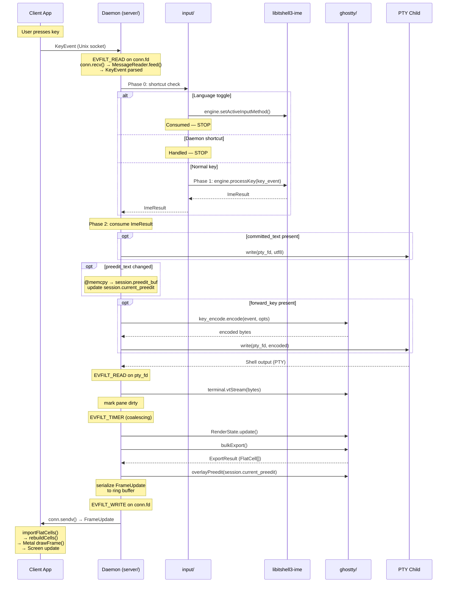
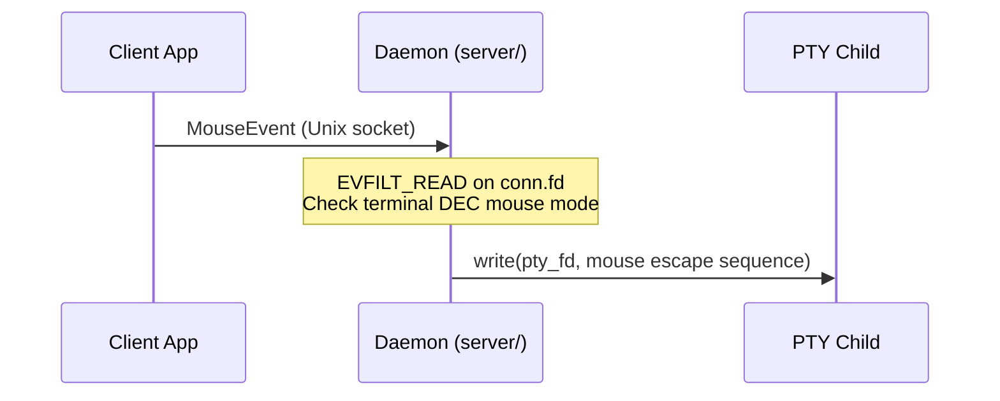

# Design Resolutions: Daemon Architecture v0.1

**Date**: 2026-03-09
**Team**: daemon-architect, ghostty-integration, ime-system-sw, principal-architect, protocol-architect, system-sw-engineer (6 members)
**Scope**: All 9 daemon design requirements + 3 owner questions
**Prior consensus**: A previous discussion session reached consensus but was lost. The prior consensus report was used as reference to accelerate reconvergence. Five positions were corrected during the initial session (see Section 6). A sixth correction (C6: R5 transport layer) was added per owner directive in a subsequent re-discussion session.

---

## Resolutions

### Resolution 1: Module Decomposition (6/6 unanimous)

**Decision**: libitshell3 is organized into 4 module groups with a diamond dependency graph. `ghostty/` and `input/` are sibling modules that both depend on `core/`; `server/` depends on all three.

```
          core/
         /    \
    ghostty/  input/
         \    /
         server/

core/     — Pure state types: Session (config, name, ImeEngine interface),
             SplitNode (tree shape, leaf = PaneId), PaneId (u32).
             Zero dependencies on ghostty, OS, or protocol.

ghostty/  — Thin helper functions (NOT wrapper types) for ghostty internal
             Zig APIs: Terminal lifecycle, vtStream, bulkExport,
             overlayPreedit, key_encode.encode, Options.fromTerminal.
             Depends on core/ only.

input/    — Key routing orchestration: Phase 0 shortcut check, Phase 1
             dispatch to ImeEngine (handleKeyEvent,
             handleIntraSessionFocusChange, handleInputMethodSwitch).
             Depends on core/ only. No ghostty dependency.

server/   — Event loop (kqueue), client manager, ring buffer,
             frame coalescing, PTY I/O, Phase 2 ghostty integration
             (key_encode.encode + write(pty_fd) + overlayPreedit),
             Pane struct (owns Terminal + RenderState + pty_fd +
             child_pid), startup/shutdown. Socket setup delegated
             to libitshell3-protocol transport layer (Layer 4).
             Depends on core/, ghostty/, input/, libitshell3-ime, and
             libitshell3-protocol.
```

**Phase 2 lives in `server/`**: Phase 2 consumes `ImeResult` and performs I/O (PTY writes) and ghostty API calls (`key_encode.encode`, `overlayPreedit`). Both I/O and ghostty dependencies belong in `server/`, not `input/`. The `input/` module handles Phase 0 and Phase 1 only — pure routing logic that depends solely on `core/` types (ImeEngine vtable, KeyEvent, ImeResult).

**Rationale**:

- `core/` has zero external dependencies, making it unit-testable in isolation and importable by the protocol library without pulling in ghostty or OS specifics.
- `ghostty/` contains helper functions, not abstraction layers. ghostty's API is not stable; wrapper types would be a maintenance trap. Direct calls to internal Zig APIs with helper functions around them is the right level. We have no second implementation of ghostty, so an abstraction layer violates YAGNI.
- `input/` depends on the `ImeEngine` interface type (defined in `core/`), not on the concrete `HangulImeEngine` (in libitshell3-ime). This is clean dependency inversion. `input/` has no ghostty dependency because Phase 2 (which uses ghostty APIs) lives in `server/`.
- Ring buffer lives in `server/`, not in the protocol library or `core/`. The ring buffer is a server-side delivery optimization tied to socket I/O (writev zero-copy path). The protocol library defines message formats, not delivery mechanisms.
- Pane struct lives in `server/` because it owns both ghostty types (Terminal, RenderState) and OS resources (pty_fd, child_pid). SplitNode in `core/` references panes by PaneId (u32), not by pointer, preserving the dependency boundary. Lookup is O(1) via `HashMap(PaneId, *Pane)` in `server/`.

**Prior art**: tmux separates pure state (window.h, session.h) from I/O (tty.c, server-client.c). ghostty separates terminal logic (Terminal.zig) from renderer (Metal.zig) and I/O (Termio.zig).

---

### Resolution 2: Event Loop Model (6/6 unanimous)

**Decision**: Single-threaded kqueue event loop (tmux model). No threads, no locks, no mutexes.

**Rationale**:

- `bulkExport()` is 22 us for 80x24, 217 us for 300x80. Even 10 panes at 60fps = 1.3% of a single core. Threading provides no measurable benefit.
- ghostty Terminal is NOT thread-safe. It uses internal arena allocators and mutable page state. In normal ghostty, a shared mutex synchronizes the IO thread and renderer thread. Our single-threaded design eliminates this entirely.
- tmux proves single-threaded scales: hundreds of panes, single libevent/kqueue loop.
- Single-threaded eliminates all concurrency hazards: no lock ordering, no deadlocks, no data races on pane state, ImeEngine access, or ring buffer writes. The event loop provides implicit serialization.
- kqueue handles all event types in a single `kevent64()` call: PTY fds (EVFILT_READ), socket fds (EVFILT_READ/EVFILT_WRITE), timers (EVFILT_TIMER for coalescing intervals and I-frame keyframes), signals (EVFILT_SIGNAL for SIGTERM/SIGCHLD). kqueue timers are kernel-managed, more efficient than userspace timer wheels.

**Prior art**: tmux — single-threaded libevent loop, proven at scale.

---

### Resolution 3: State Tree (6/6 unanimous)

**Decision**: Session = Tab merge. No intermediate Tab entity. Each Session directly owns a SplitNode tree (binary split).

**State tree structure**:

```
Session (in core/):
  session_id: u32, name: []const u8, ime_engine: ImeEngine,
  active_input_method: []const u8, keyboard_layout: []const u8,
  root: ?*SplitNode, focused_pane: ?PaneId, creation_timestamp: i64,
  current_preedit: ?[]const u8,  // cached from last ImeResult for export-time overlay
  preedit_buf: [64]u8,           // backing storage for current_preedit slice
  last_preedit_row: ?u16         // cursor row when preedit was last overlaid (for dirty tracking)

SplitNode (tagged union in core/):
  .leaf => PaneId
  .split => { orientation: enum{horizontal, vertical}, ratio: f32,
              first: *SplitNode, second: *SplitNode }

Pane (in server/):
  pane_id: u32, pty_fd: posix.fd_t, child_pid: posix.pid_t,
  terminal: *ghostty.Terminal, render_state: *ghostty.RenderState,
  cols: u16, rows: u16, title: []const u8
```

**Rationale**:

- Session:Tab is 1:1 in v1. An intermediate Tab entity with no distinct behavior violates YAGNI. When Phase 3 needs multiple tabs per session, Tab can be introduced.
- Per-session ImeEngine maps cleanly: one engine per "thing the user switches between."
- The protocol already treats Sessions as the unit clients attach to. There is no Tab entity in the protocol — "tabs" are a client UI concept mapped to Sessions.
- Session caches the current preedit text (`current_preedit: ?[]const u8`, backed by a 64-byte buffer) from the last `ImeResult` for use at export time. The ImeEngine vtable has no "get current preedit" method — preedit text is only available via `ImeResult` from mutating calls (IME contract v0.7 Section 6: engine internal buffers are invalidated on the next mutating call). When `ImeResult.preedit_changed == true`, the session copies the preedit text into `preedit_buf` via `@memcpy` and points `current_preedit` at the copied slice. `overlayPreedit()` reads from `session.current_preedit`, never from the engine directly. The engine's buffer is ground truth at `processKey()` time; the Session's copy is ground truth at export time. Different lifetimes, different purposes — this is a necessary cache, not a DRY violation.
- `last_preedit_row` tracks the cursor row where preedit was last overlaid. When preedit changes or clears, the previous row must be marked dirty in the next export so that the old preedit cells are repainted with the underlying terminal content.

**Prior art**: cmux uses binary split tree (Bonsplit library). ghostty's split API uses the same model. tmux's `layout_cell` tree is conceptually identical.

---

### Resolution 4: ghostty Terminal Instance Management (6/6 unanimous)

**Decision**: Headless Terminal — no Surface, no App, no embedded apprt. The daemon uses ghostty's internal Zig APIs exclusively.

**API surface used by the daemon**:

| Operation | API | Notes |
|-----------|-----|-------|
| Terminal lifecycle | `Terminal.init(alloc, .{.cols, .rows})` | No Surface, no App (PoC 06 validated) |
| PTY output processing | `terminal.vtStream(bytes)` | Zero Surface dependency |
| RenderState snapshot | `RenderState.update(alloc, &terminal)` | |
| Cell data export | `bulkExport(alloc, &render_state, &terminal)` | Produces FlatCell[] |
| Key encoding (forwarded keys) | `key_encode.encode(writer, event, opts)` | Pure function, no Surface |
| Terminal modes for encoder | `Options.fromTerminal(&terminal)` | DEC modes, Kitty flags |
| Preedit injection | `overlayPreedit(export_result, preedit, cursor)` | ~20 lines in vendor fork |

**Key input path**:

| ImeResult field | Action | API |
|-----------------|--------|-----|
| committed_text | Write UTF-8 directly to PTY | `write(pty_fd, text)` (v1 legacy mode) |
| forward_key | Encode key and write to PTY | `key_encode.encode()` + `write(pty_fd, encoded)` |
| preedit_text | Copy to `session.preedit_buf` via `@memcpy` when `preedit_changed`; overlay at export time | `overlayPreedit(export_result, session.current_preedit, cursor)` |

**Preedit overlay mechanism**: Preedit lives on `renderer.State.preedit` (State.zig:27), NOT on `terminal.RenderState`. Since we are headless (no Surface, no renderer.State), we overlay preedit cells post-bulkExport() via `overlayPreedit()` in render_export.zig. The function takes ExportResult + preedit codepoints + cursor position, overwrites FlatCells at the cursor position, and marks affected rows dirty in the bitmap. ~20 lines in our vendor fork, self-contained and testable in isolation.

**No press+release pairs needed**: The IME contract v0.7 Section 5 requires press+release pairs for `ghostty_surface_key()` because Surface tracks key state internally. Since we bypass Surface and use `key_encode.encode()` directly (stateless), no release events are needed in v1 legacy mode. For future Kitty protocol support, release events would go through the encoder.

**Rationale**:

- The Phase 1/Phase 2 distinction in the IME contract v0.7 was written before the headless decision. Phase 1 (`ghostty_surface_key()`) requires a Surface we don't have. Using `key_encode.encode()` from day one is the only viable path.
- The IME contract v0.7 Section 5 code examples (handleKeyEvent, etc.) should be understood as logical pseudocode describing the data flow (WHAT). The daemon doc specifies the API calls (HOW).
- Design principle A1 ("preedit is cell data") remains valid: preedit IS cell data on the wire; only the injection mechanism differs from normal ghostty.

**Prior art**: PoC 06 (headless Terminal extraction), PoC 07 (bulkExport benchmark), PoC 08 (importFlatCells GPU rendering).

---

### Resolution 5: daemon <-> libitshell3-protocol Boundary (6/6 unanimous, revised)

**Decision**: Four layers in the protocol library. Layers 1-3 are I/O-free (unchanged). Layer 4 (Transport) handles socket lifecycle and provides thin I/O wrappers. Ring buffer is server-side only.

**Layer 1 — Codec** (stateless, I/O-free): `encode(Message) -> bytes`, `decode(bytes) -> Message`. Pure serialization. Handles 16-byte header, JSON payloads, hybrid FrameUpdate binary+JSON format. Zero allocation policy.

**Layer 2 — Framing** (stateful per-connection, I/O-free): `MessageReader` accumulates bytes, extracts complete frames. `MessageWriter` serializes messages into output buffer / iovec arrays. Buffer management, fragment reassembly, incomplete message handling. Operates on byte slices, NOT file descriptors.

**Layer 3 — Connection protocol** (event-driven state machine, I/O-free): Tracks connection state using the canonical 6-state model from protocol doc 01 Section 5.2: DISCONNECTED -> CONNECTING -> HANDSHAKING -> READY -> OPERATING -> DISCONNECTING. Validates message sequencing (rejects FrameUpdate before OPERATING). Manages capability negotiation state. Design: `onEvent(event) -> Action` — deterministic, testable, no side effects. The daemon/client drives the state machine by feeding events and executing returned actions. Same pattern as h2 (Rust) and nghttp2 (C).

**Layer 4 — Transport** (new, has OS dependencies): Handles socket lifecycle and provides thin I/O wrappers. fd-providing model — the transport layer creates and configures sockets, returns raw file descriptors that the consumer registers with its own event loop (kqueue for daemon, RunLoop/dispatch for Swift client). The transport layer does NOT own the event loop.

**What Layer 4 owns:**

1. **Socket path resolution** — The algorithm from protocol spec Section 2.1: `$ITSHELL3_SOCKET` -> `$XDG_RUNTIME_DIR/itshell3/<server-id>.sock` -> `$TMPDIR/itshell3-<uid>/<server-id>.sock` -> `/tmp/itshell3-<uid>/<server-id>.sock`. Both daemon and client need this identically.

2. **Listener** (server-side) — `Listener.init(config)`: `socket(AF_UNIX, SOCK_STREAM)` -> stale socket detection -> `bind()` -> `listen(backlog)` -> `chmod(0600)` -> directory creation with `0700` -> `O_NONBLOCK`. Returns listen_fd for kqueue registration via `.fd()`. `Listener.accept()`: `accept()` + `getpeereid()`/`SO_PEERCRED` UID verification + `O_NONBLOCK` + `setsockopt` buffer sizes -> returns `Connection`. `Listener.deinit()`: `close(listen_fd)` + `unlink(socket_path)` + free path string (compound cleanup).

3. **Connection** (both sides) — A plain struct containing one `pub fd: posix.fd_t` field (4 bytes, no allocator, no hidden state). Created by `Listener.accept()` (server-side) or `transport.connect(config)` (client-side). Provides:
   - `.recv(buf) -> RecvResult` — thin wrapper over `posix.read(self.fd, buf)` with result mapping
   - `.send(buf) -> SendResult` — thin wrapper over `posix.write(self.fd, buf)` with result mapping
   - `.sendv(iovecs) -> SendvResult` — thin wrapper over `posix.writev(self.fd, iovecs)` for ring buffer zero-copy path
   - `.close()` — `posix.close(self.fd)` + `self.fd = -1` (defensive against use-after-close)
   - `Connection.fd` is `pub` — consumer uses it directly for kqueue/RunLoop registration

4. **Peer credential extraction** — Platform-specific (`getpeereid` on macOS, `SO_PEERCRED` on Linux), centralized in `Listener.accept()`.

5. **Stale socket detection** — `connect()` probe -> `ECONNREFUSED` -> report to caller (for both daemon startup check and client auto-start).

6. **Socket option configuration** — `SO_SNDBUF`/`SO_RCVBUF` defaults (256 KiB per protocol spec), configurable via options struct.

**Connection struct (v1):**

```zig
pub const Connection = struct {
    fd: posix.fd_t,  // pub, for kqueue/RunLoop registration

    pub fn recv(self: Connection, buf: []u8) RecvResult { ... }
    pub fn send(self: Connection, buf: []const u8) SendResult { ... }
    pub fn sendv(self: Connection, iovecs: []posix.iovec_const) SendvResult { ... }
    pub fn close(self: *Connection) void { posix.close(self.fd); self.fd = -1; }
};

pub const RecvResult = union(enum) {
    bytes_read: usize,   // success
    would_block: void,   // EAGAIN — re-arm event loop
    peer_closed: void,   // EOF (n==0), EPIPE, or ECONNRESET
    err: posix.ReadError, // unexpected error
};

pub const SendResult = union(enum) {
    bytes_written: usize, // may be partial — caller manages remainder
    would_block: void,    // EAGAIN — re-arm EVFILT_WRITE
    peer_closed: void,    // EPIPE or ECONNRESET
    err: posix.WriteError,
};
```

**What Layer 4 does NOT own:**

- Event loop (kqueue in `server/`, RunLoop in client) — the consumer decides WHEN to call recv/send
- Ring buffer (server-side delivery optimization)
- Reconnection logic (client-specific policy: exponential backoff)
- Application-level error response (daemon: cleanup ClientState + deregister from kqueue; client: reconnect UI)

**Layers 1-3 remain I/O-free.** Layer 4 is the only layer with OS dependencies (socket syscalls). This preserves full testability of codec, framing, and connection protocol without sockets.

**No SSH abstraction in v1.** Concrete Unix socket implementation only. No vtable, no interface, no tagged union. When Phase 5 arrives, the Connection struct internals are expanded to hold SSH channel state, and `.recv()`/`.send()` dispatch to `libssh2_channel_read()`/`libssh2_channel_write()`. Consumer call sites are unchanged — this is why methods live on the struct now. The cost is ~40 lines of trivial pass-through wrappers in v1; the Phase 5 benefit is zero call-site changes. libssh2 channels do NOT provide real fds — all channels multiplex onto one TCP socket. `std.posix.read(conn.fd)` on an SSH connection would read raw SSH protocol bytes, not demultiplexed channel data. Methods on Connection are therefore structurally necessary for SSH, not just convenient.

**Naming convention:** `transport.Listener` + `transport.Connection` (not `TransportListener`/`TransportConnector`). The types live in the `transport` namespace, so the prefix is redundant.

**Ring buffer is in server/, NOT protocol lib.** The ring buffer is a server-side delivery optimization tied to writev zero-copy and multi-client cursor management. No client-side analogue.

**libitshell3-protocol SHOULD export a C API header** for the codec + framing layers, so the Swift client can use them. This is a protocol library concern, distinct from the daemon library (which has no C API).

**Rationale**:

- Layers 1-3 are I/O-free, making the protocol library's codec, framing, and connection state machine fully testable without sockets, kqueue, or OS mocking. Feed bytes in, check messages out.
- Layer 4 eliminates transport code duplication between daemon and client: socket path resolution (4-step fallback algorithm), socket creation + bind + listen + chmod, stale socket detection + cleanup, `accept()` + `getpeereid()` UID verification, and socket option configuration. Without Layer 4, both consumers must independently implement these multi-step sequences with identical logic and edge cases.
- The recv/send/sendv methods on Connection enable transparent SSH transport swap in Phase 5 without changing consumer call sites. Zig's `std.posix.read/write` already handles EINTR internally — the methods' primary value is SSH swappability and error consolidation (EOF + EPIPE + ECONNRESET -> `.peer_closed`), not EINTR handling.
- The ring buffer is tied to socket I/O (writev zero-copy) and multi-client cursor management — these are server concerns with no client-side analogue.

**Prior art**: h2 (Rust HTTP/2 library) — I/O-free state machine (Layers 1-3). nghttp2 (C HTTP/2 library) — event-driven, caller owns I/O (Layers 1-3). tmux `server_create_socket()`/`server_accept()`/`client_connect()` — transport functions in shared code, event loop in consumer (Layer 4). Zig `std.net.Stream`/`std.fs.File` — struct owns fd, provides read/write/close methods, fd is pub field (Connection pattern). zellij `IpcStream` — shared Read + Write interface for Unix socket IPC (Connection pattern).

#### Resolved Sub-Disagreement: recv/send Scope

The team debated whether read/write/writev should be in the transport layer:

| Position | Initial advocates | Resolution |
|----------|------------------|------------|
| No — consumer calls std.posix directly | protocol-architect (initial), ime-system-sw (initial), ghostty-integration (initial) | All revised after SSH swappability argument + Zig idiom argument |
| Yes — Connection methods | daemon-architect, system-sw-engineer | Adopted as consensus |
| Stateless free functions (middle ground) | ghostty-integration (middle phase) | Superseded by Connection methods |

Three arguments drove convergence:
1. **SSH swappability (primary):** libssh2 uses `libssh2_channel_read()`/`libssh2_channel_write()`, not `posix.read()`/`posix.write()`. Consumer call sites must go through Connection to enable Phase 5 swap without codebase-wide migration.
2. **Zig idiom:** `std.net.Stream` and `std.fs.File` both own fds and provide methods. Connection follows the same convention.
3. **EOF + error consolidation:** `Connection.recv()` maps `n==0` (EOF), `EPIPE`, and `ECONNRESET` to a single `.peer_closed` variant — genuine shared logic beyond what `std.posix` provides.

Note: The initial argument for wrappers (EINTR handling) was debunked — Zig's `std.posix.read/write` already handles EINTR internally. The consensus reflects the corrected rationale.

**ime-system-sw's acceptance conditions** (all met):
1. `Connection.fd` is `pub` — no false encapsulation
2. Connection is a plain struct (4 bytes, no allocator, no hidden state)
3. Explicit `.close()` method (not implicit RAII) — caller decides when to close

---

### Resolution 6: daemon <-> libitshell3-ime Integration (6/6 unanimous)

**Decision**: Per-session ImeEngine. Phase 0->1->2 key routing. Eager activate/deactivate on session focus change. No per-pane locks.

**ImeEngine lifecycle**:

- One `HangulImeEngine` per Session, created at `Session.init(allocator, input_method)`, destroyed at `Session.deinit()`.
- ImeEngine interface (vtable) defined in `core/`. Concrete `HangulImeEngine` in libitshell3-ime (separate library).
- `MockImeEngine` for testing — all key routing logic testable without libhangul.
- On session restore: `HangulImeEngine.init(allocator, saved_input_method)` with persisted string. No composition state persisted (always starts empty).

**Phase 0->1->2 key routing**:

1. **Phase 0** (`input/`): Check if key is language toggle -> `engine.setActiveInputMethod(new_method)` -> consume ImeResult -> STOP. Check global daemon shortcuts -> STOP. Otherwise pass to Phase 1.
2. **Phase 1** (libitshell3-ime): `engine.processKey(key_event)` -> returns `ImeResult`.
3. **Phase 2** (`server/`): committed_text -> `write(pty_fd)`, preedit_text -> `@memcpy` to `session.preedit_buf` + update `session.current_preedit` (when `preedit_changed`), forward_key -> `key_encode.encode()` + `write(pty_fd)`. Phase 2 lives in `server/` because it performs I/O and uses ghostty APIs (see Resolution 1).

**Eager activate/deactivate on session focus change**:

- Session A -> B switch: immediately call `session_a.engine.deactivate()` (flush committed text to A's focused pane, clear preedit) -> `session_b.engine.activate()` (no-op for Korean).
- Trigger: the session focus change event itself (e.g., AttachSessionRequest, daemon-internal session switch), NOT the next KeyEvent.
- Eager eliminates deferred routing bugs. Concrete scenario: user composes in Session A, switches to B, closes A's pane from B, then types in B — lazy deactivation would try to flush to a gone pane. Eager flushes while the pane is still alive.
- Zero cost when not composing: `deactivate()` on an empty engine returns `ImeResult{}` (all null/false). `activate()` is a no-op for Korean.
- Matches IME contract v0.7 vtable documentation: deactivate comment says "Session lost focus (e.g., user switched to another tab)."
- The prior consensus said "lazy" — the team unanimously corrected this to "eager" during discussion (see Section 6).

**Intra-session pane focus change**:

- `engine.flush()` -> committed text -> old pane's PTY -> clear preedit on old pane -> update focused_pane to new pane.
- Exactly as specified in IME contract v0.7 Section 5 (handleIntraSessionFocusChange).

**No per-pane locks needed**: Single-threaded kqueue (Resolution 2) provides implicit serialization. All key events and focus changes are processed sequentially. Locks solve a problem that doesn't exist.

**Critical runtime invariant**: ImeResult MUST be consumed (PTY write + preedit update) before the next engine call. Naturally satisfied by single-threaded event loop. The engine's internal buffers are invalidated on the next mutating call (IME contract v0.7 Section 6).

**Prior art**: fcitx5 InputMethodEngine (single processKey interface for all languages), ibus-hangul (modifier flush pattern), IME contract v0.7 Section 5 (ghostty integration code patterns).

#### End-to-End Key Input Data Flow

The following sequence diagram shows the complete data path for a key input event, tying together Resolutions 1 (modules), 2 (event loop), 4 (ghostty APIs), 5 (protocol layers), 6 (IME routing), and 9 (client connection).



#### Mouse Event Data Flow

Mouse events follow a simpler path — no IME involvement. Mouse tracking is only active when the terminal's DEC mode state has mouse reporting enabled (determined by `Options.fromTerminal()`).



---

### Resolution 7: C API Surface Design (6/6 unanimous)

**Decision**: No daemon-side C API. YAGNI.

- The daemon (libitshell3) is a Zig binary using internal Zig APIs. No third-party embedding use case exists.
- The client communicates via wire protocol only.
- libitshell3-protocol exports a C API header for the codec + framing layers (Swift client interop). This is a protocol library concern, separate from the daemon library.

**Rationale**: The daemon has exactly one consumer (itself). Exporting a C API adds a maintenance burden (header generation, ABI stability) for zero benefit. If a use case appears, the API can be added then.

---

### Resolution 8: Daemon Lifecycle (6/6 unanimous)

**Decision**: 7-step startup sequence, graceful shutdown, LaunchAgent behind comptime flag, SSH fork+exec deferred to Phase 5.

**Startup sequence**:

1. **Parse CLI args**: `--server-id` (default: "default"), `--socket-path` (override), `--foreground` (skip LaunchAgent).
2. **Check existing daemon**: Use `transport.connect()` to probe the socket path. If succeeds -> daemon already running -> exit with message. If `ECONNREFUSED` -> stale socket detected by transport layer's stale socket detection logic.
3. **Initialize kqueue**: `kqueue()` -> register signal filters (EVFILT_SIGNAL for SIGTERM, SIGINT, SIGHUP). Created early so that FDs from subsequent steps can be registered immediately after creation.
4. **Bind Unix socket**: `transport.Listener.init(config)` (socket + stale check + bind + listen + chmod 0600 + O_NONBLOCK) -> register `listener.fd()` with kqueue (EVFILT_READ).
5. **Initialize ghostty config**: Load terminal config (font, colors, scrollback, default palette) via ghostty config APIs. This creates the shared config used for all Terminal instances. Must happen before step 6.
6. **Create default session**: Allocate Session with id=1, create initial Pane (PTY fork + Terminal.init) -> register pty_fd with kqueue (EVFILT_READ).
7. **Enter event loop**: `kevent64()` loop.

**Graceful shutdown** (on SIGTERM/SIGINT/SIGHUP or last-session-close):

1. Stop accepting new connections (remove listen_fd from kqueue).
2. Flush all ImeEngines (deactivate all sessions — eager flush of any active preedit).
3. Send ServerShutdown message to all connected clients.
4. Wait up to 2-5 seconds for clients to disconnect gracefully.
5. For each pane: `kill(child_pid, SIGHUP)` -> `waitpid(WNOHANG)` -> `close(pty_fd)` -> `Terminal.deinit()`.
6. `listener.deinit()` (close listen_fd + unlink socket_path).
7. Exit 0.

**LaunchAgent**: Behind comptime flag (`build_options.enable_launchagent`). Plist uses `KeepAlive = true` and `Sockets` for socket activation. Daemon detects socket activation via inherited fd.

**SSH fork+exec**: Deferred to Phase 5. When implemented: client SSHs to remote host, runs `itshell3-daemon --foreground --server-id=<id>`. Same daemon binary, same code path — only the auto-start mechanism differs. No daemon code changes needed.

**Rationale**: The 7-step sequence is the minimum viable startup. Each step has a clear purpose and failure mode. kqueue is created early (step 3) so that FDs from subsequent steps (socket, PTY) can be registered with kqueue immediately after creation, avoiding a window where events could be missed. The graceful shutdown ensures preedit is flushed (step 2), clients are notified (step 3), and child processes are reaped (step 5). LaunchAgent is behind a comptime flag because it's macOS-specific and not needed for SSH or testing.

---

### Resolution 9: Client Connection Lifecycle (6/6 unanimous)

**Decision**: Per-client state machine using the canonical 6-state model (protocol doc 01 Section 5.2). Shared ring buffer with per-client cursors. All clients can send input (tmux model).

**Per-client state machine** (canonical states from protocol doc 01 Section 5.2):

```
              accept()
                |
                v
          HANDSHAKING
          (ClientHello/ServerHello)
                |
                v
             READY  <------+
          (authenticated,   |
           not attached)    | SessionDetachRequest
                |           |
                v           |
           OPERATING -------+
          (attached to session, full protocol)
                |
                v
          DISCONNECTING
          (draining pending messages)
                |
                v
          [fd closed, state freed]
```

Note: DISCONNECTED and CONNECTING are client-side states (the daemon never initiates connections). The daemon's per-client state machine starts at HANDSHAKING (after `Listener.accept()`). The key transition OPERATING -> READY (detach without disconnect) allows session switching without reconnecting.

**Per-client state**:

```
ClientState:
  client_id: u32
  conn: transport.Connection
  state: enum { handshaking, ready, operating, disconnecting }
  attached_session: ?*Session
  capabilities: CapabilitySet
  ring_cursors: HashMap(PaneId, RingCursor)
  display_info: ClientDisplayInfo
  message_reader: protocol.MessageReader
```

**Shared ring buffer with per-client cursors**:

- Each pane has one ring buffer (in `server/`).
- All clients viewing that pane share the same ring. Frame data (I-frames and P-frames) is serialized once per pane per frame interval.
- Each client maintains its own cursor (read position into the ring).
- When a client falls behind, it skips to the latest I-frame (keyframe) rather than accumulating stale deltas.
- `conn.sendv()` zero-copy from ring to socket.
- `.would_block` handling: cursor stays at current position, kqueue re-arms EVFILT_WRITE on `conn.fd`.

**Multi-client input model**: All attached clients can send input. Last writer wins. No primary/secondary distinction. Readonly attachment is client-requested (per protocol doc 03 Section 9), not server-enforced based on connection order.

**Transport-agnostic**: Daemon always sees `transport.Connection` values from `Listener.accept()`. Whether the client connected locally or through an SSH tunnel is invisible. SSH-tunneled clients appear as local connections; sshd's UID is accepted per the trust model in protocol doc 01 Section 2.2.

**Rationale**:

- Shared ring buffer eliminates O(N) per-frame cost for multi-client delivery. Write once, read N times.
- Per-client cursors allow clients at different coalescing tiers (e.g., fast desktop at 60fps, battery iPad at 20fps) to read from the same ring independently.
- tmux's "all clients can send input" model is simpler and proven at scale. A "primary client" model would require state tracking, handoff logic, and conflict resolution — complexity with no v1 use case.

**Prior art**: tmux control mode — shared pane evbuffer with per-client read offsets (`control_pane.offset`). This is the closest existing analogue to our shared ring buffer model.

---

## Owner Questions

### Owner Q1: Transport Implementation Location (6/6 unanimous, revised)

**Decision**: Client app decides local vs remote. Daemon always sees Unix sockets. Protocol library owns transport layer (Layer 4) shared by both daemon and client.

- **Local**: Client calls `transport.connect(config)` to get a `Connection` to the daemon's Unix socket.
- **Remote**: Client opens SSH tunnel (`direct-streamlocal@openssh.com`) -> sshd -> Unix socket. Daemon never knows. In Phase 5, `transport.connect()` handles SSH channel setup internally.
- **Protocol library**: Provides I/O-free codec + framing + state machine (Layers 1-3) AND transport layer (Layer 4) for socket lifecycle and I/O. Both daemon and client use the same transport APIs — no code duplication.
- Explicitly stated in protocol doc 01 Section 2.2: "The daemon only ever sees Unix socket connections."

### Owner Q2: Transport Layer Duplication (6/6 unanimous, revised)

**Decision**: No duplication. Four-layer protocol model is shared by both daemon and client.

- **Codec**: Shared — both sides serialize/deserialize the same message formats.
- **Framing**: Shared — `MessageReader` and `MessageWriter` used by both sides.
- **Connection protocol**: Shared — same state machine, different valid transitions depending on role (client sends ClientHello, server sends ServerHello).
- **Transport**: Shared — `transport.Listener` (server-side), `transport.connect()` (client-side), `transport.Connection` (both sides) with `recv/send/sendv/close`. Socket path resolution, stale socket detection, peer credential extraction, and socket option configuration are all shared. Only the event loop integration differs: kqueue for daemon, RunLoop/dispatch for client.

### Owner Q3: Preedit / RenderState Validity (6/6 unanimous)

**Decision**: Design principle A1 ("preedit is cell data") is VALID. No protocol or IME contract changes needed.

- **Fact**: Preedit lives on `renderer.State.preedit` (State.zig:27), NOT on `terminal.RenderState`. In normal ghostty, the renderer clones preedit during the critical section and applies it during `rebuildCells()`.
- **Our approach**: In headless mode (no Surface, no renderer.State), the daemon overlays preedit cells during the export phase via `overlayPreedit()` in render_export.zig (~20 lines in vendor fork).
- **Why A1 holds**: From the protocol's perspective, preedit IS cell data — it arrives at the client as ordinary FlatCells in FrameUpdate. The client never knows or cares which cells are preedit. The injection mechanism (`overlayPreedit` vs `ghostty_surface_preedit`) is a server-side implementation detail invisible to the wire.

---

## Wire Protocol Changes

**None.** All 9 resolutions are internal daemon architecture decisions. The wire protocol (v0.9) is unchanged. No new message types, no modified payloads, no capability changes.

The protocol library's internal structure (three I/O-free layers + one transport layer) is a packaging decision that affects how the library is consumed, not what goes on the wire.

---

## Items Deferred to Future Versions

| Item | Deferred to | Rationale |
|------|-------------|-----------|
| SSH transport implementation | Phase 5 | No remote use case in v1. Connection struct is designed for transparent swap — recv/send methods dispatch to `libssh2_channel_read()`/`libssh2_channel_write()` in Phase 5. |
| Transport vtable/interface | Phase 5 | One implementation (Unix socket) in v1. Abstract when the second arrives (SSH). |
| Connection.deinit() with SSH channel cleanup | Phase 5 | v1 Connection holds only an fd (4-byte struct). SSH adds channel state requiring compound deinit. v1 uses explicit `.close()`. |
| SSH fork+exec daemon startup | Phase 5 | No remote use case in v1. Same daemon binary — only the auto-start mechanism differs. |
| Multiple tabs per session (Session:Tab 1:N) | Phase 3 | v1 is Session:Tab 1:1. Tab entity can be introduced when the use case arrives. |
| Floating panes | Post-v1 | YAGNI for v1. Binary split tree covers all v1 layout needs. |
| Kitty keyboard protocol support | Post-v1 | v1 uses legacy mode only. key_encode.encode() supports Kitty natively; the daemon would need to send release events when Kitty mode is negotiated. |
| Application-layer compression | Post-v1 | SSH compression handles remote; local Unix socket bandwidth is not a constraint (>1 GB/s). Reserved `COMPRESSED` header flag available. |
| Client-side composition prediction | Post-v1 | For remote clients with high RTT. Would require client-side IME state — fundamental architecture change. |

---

## Corrections from Prior Consensus

| # | Topic | Prior consensus | Corrected position | Reason |
|---|-------|----------------|-------------------|--------|
| C1 | Req 6 activate/deactivate | Lazy (triggered by key input to different session) | **Eager** (triggered by session focus change event) | Lazy creates deferred routing bugs: if the old session's pane is closed before the deferred flush, committed text has nowhere to go. Eager has zero cost when not composing. |
| C2 | Req 4 key encoding | `ghostty_surface_key()` (Phase 1) | **`key_encode.encode()` from day one** | Headless architecture (no Surface) precludes `ghostty_surface_key()`. The Phase 1/Phase 2 distinction in the IME contract was written before the headless decision. |
| C3 | Req 4 preedit injection | `ghostty_surface_preedit()` | **`overlayPreedit()` post-bulkExport** | Preedit lives on `renderer.State`, not `terminal.RenderState`. No Surface means no `ghostty_surface_preedit()`. Export-time overlay is self-contained and testable. |
| C4 | Req 9 multi-client model | First attaching client is "primary" | **All clients can send input** (tmux model) | Primary model requires state tracking, handoff logic, crash recovery. YAGNI — tmux's simpler model is proven. Readonly is client-requested, not server-enforced. |
| C5 | Req 1 Pane location | Pane in `core/` | **Pane in `server/`**, SplitNode references PaneId | Pane owns ghostty types (Terminal, RenderState) and OS resources (pty_fd, child_pid). Placing it in `core/` would violate the `core ← ghostty` dependency rule. |
| C6 | Req 5 protocol boundary | 3 I/O-free layers; transport I/O in `server/` and client separately | **4 layers: 3 I/O-free + Layer 4 Transport** in protocol lib with `Listener`, `Connection` (recv/send/sendv/close) | Without transport in protocol lib, daemon and client duplicate socket path resolution, bind/listen/accept, stale socket detection, peer credential extraction, and socket option configuration. Owner directive based on prior (lost) consensus. |

---

## Prior Art References

| Reference | Used for | Resolutions |
|-----------|----------|-------------|
| tmux (single-threaded libevent) | Event loop model, scaling evidence | R2, R9 |
| tmux control mode (shared evbuffer, per-client offsets) | Ring buffer with per-client cursors | R9 |
| tmux (all clients can send input) | Multi-client input model | R9 |
| cmux (Bonsplit binary split tree) | Layout tree model | R3 |
| ghostty Terminal.init() (PoC 06) | Headless Terminal validation | R4 |
| ghostty bulkExport() (PoC 07) | Export performance (22 us/frame) | R2, R4 |
| ghostty importFlatCells() (PoC 08) | Client-side RenderState population | R4 |
| ghostty renderer.State.preedit (State.zig:27) | Preedit storage location | R4, Q3 |
| ghostty key_encode.encode() (key_encode.zig:75) | Stateless key encoding | R4 |
| fcitx5 InputMethodEngine | Single processKey interface | R6 |
| ibus-hangul | Modifier flush pattern | R6 |
| h2 (Rust), nghttp2 (C) | I/O-free protocol state machines | R5 (Layers 1-3) |
| tmux `server_create_socket()`/`server_accept()`/`client_connect()` | Transport functions in shared code, event loop in consumer | R5 (Layer 4) |
| Zig `std.net.Stream`/`std.fs.File` | Struct owns fd, provides read/write/close, fd is pub field | R5 (Connection pattern) |
| zellij `IpcStream` | Shared Read + Write interface for Unix socket IPC | R5 (Connection pattern) |
| IME contract v0.7 | Per-session ImeEngine, Phase 0-1-2 routing, vtable design | R6 |
| Protocol spec v0.9 | Wire format, handshake, session management | R5, R9 |

---

## Document Structure

Three spec documents will be produced from these resolutions:

1. **01-internal-architecture** — Resolutions 1-4 (modules, event loop, state tree, Terminal management). Owner Q3 answer included here.
2. **02-integration-boundaries** — Resolutions 5-7 (protocol boundary with 4-layer model, IME integration, C API). Owner Q1 + Q2 answers included here.
3. **03-lifecycle-and-connections** — Resolutions 8-9 (daemon lifecycle, client connections).
