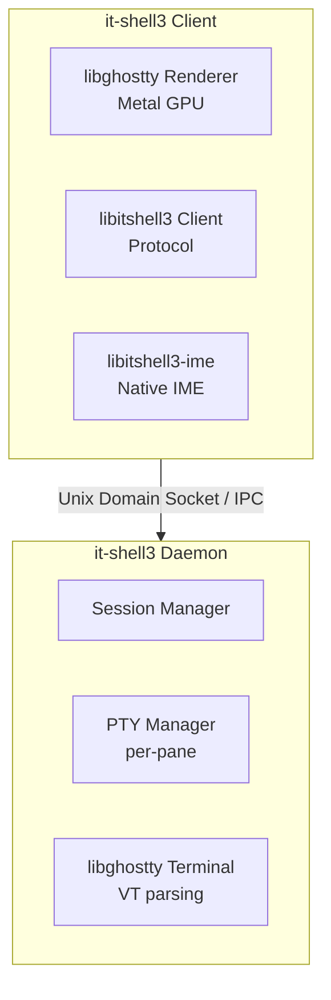

# it-shell3: Project Overview

## Vision

**it-shell3** is a terminal ecosystem providing terminal multiplexer session management with first-class CJK input support, built on **libghostty**. The project consists of two core modules:

- **libitshell3**: The portable Zig library — daemon (PTY owner, session state, I/O mux), client (socket connection, protocol, RenderState populator), binary protocol, PTY layer. Exports C API for Swift/other consumers.
- **libitshell3-ime**: A separate portable Zig library — native IME engine wrapping libhangul for Korean (2-set, 3-set) plus English QWERTY. No OS IME dependency. Purely algorithmic.

The wire protocol specification (16-byte fixed header, capability negotiation, RenderState streaming, CJK preedit sync) is documented separately at `docs/modules/libitshell3-protocol/` but is architecturally part of libitshell3.

These modules power the **it-shell3** terminal emulator app for macOS (with future iOS and Linux support), a full replacement terminal emulator that consumes libitshell3 + libitshell3-ime + libghostty Metal GPU.

## Problem Statement

Existing terminal multiplexers (tmux, zellij, screen) have fundamental limitations:

1. **CJK Input Composition**: IME preedit state (Korean Jamo decomposition, Japanese Kana-to-Kanji, Chinese Pinyin) is not properly synchronized between client and server. This causes broken input when composing CJK text inside multiplexed sessions. See `docs/modules/libitshell3-ime/01-overview/03-hangul-composition.md` for Korean composition details.

2. **AI Agent Chat Interfaces**: Modern AI coding tools (Claude Code, Codex CLI, Cursor terminal) use custom input areas that need:
   - Shift+Enter for line breaks (not command execution)
   - Cmd+C / Cmd+V for clipboard (not SIGINT / raw paste)
   - Proper CJK composition within the agent's input buffer

3. **Cross-Device Session Continuity**: Sessions should persist across terminal app restarts and be accessible from multiple devices (macOS + iOS).

## Why libghostty?

Instead of writing a custom VT emulator, we leverage Ghostty's battle-tested terminal engine because:

- **CJK-ready Unicode**: Full grapheme clustering, emoji variation selectors, proper wide character handling
- **IME Preedit API**: Native `ghostty_surface_preedit()` for input composition
- **Metal Rendering**: GPU-accelerated rendering on macOS/iOS via Metal
- **HarfBuzz Font Shaping**: Proper CJK glyph shaping and ligatures
- **Embeddable C API**: `ghostty.h` with opaque types (`ghostty_app_t`, `ghostty_surface_t`)
- **RenderState API**: Server-side `bulkExport()` and client-side `importFlatCells()` for structured cell data streaming

## Architecture Summary

> **PoC Validated**: The core rendering pipeline (server RenderState → FlatCell[] → client importFlatCells() → rebuildCells() → Metal GPU) has been proven end-to-end with actual GPU rendering. See `poc/06-renderstate-extraction/`, `poc/07-renderstate-bulk-api/`, `poc/08-renderstate-reinjection/`.

**Key architectural insight**: The client is a thin RenderState populator — `importFlatCells()` → `rebuildCells()` → `drawFrame()`. No Terminal, VT parser, or Page/Screen on the client side. The server owns all Terminal instances and exports structured cell data. See `docs/insights/design-principles.md` (A4, A5, A6).

## Key Design Goals

1. **Session Persistence**: Daemon process keeps PTY sessions alive across client disconnects
2. **CJK Preedit Sync**: IME composition state synchronized between client(s) and daemon
3. **AI Agent Awareness**: Special input mode detection for Shift+Enter, Cmd+C/V in agent contexts
4. **Cross-Platform Client**: macOS (native) and iOS (via libghostty embedded apprt)
5. **Backward Compatibility**: Graceful fallback via capability negotiation

## Reference Codebases

All reference code is available at `~/dev/git/references/`:

| Reference | Purpose | Language |
|-----------|---------|----------|
| `ghostty/` | Terminal engine (libghostty source) | Zig |
| `cmux/` | Existing libghostty-based macOS terminal app | Swift |
| `tmux/` | Canonical terminal multiplexer | C |
| `zellij/` | Modern terminal multiplexer | Rust |
| `iTerm2/` | macOS terminal with tmux integration | ObjC/Swift |

## Document Index

### Project-Level Docs (`docs/project/`)

| Document | Contents |
|----------|----------|
| [01-project-overview.md](./01-project-overview.md) | This document — project vision, problem statement, architecture summary |
| [02-feasibility-analysis.md](./02-feasibility-analysis.md) | Feasibility assessment and risk analysis |
| [03-recommended-architecture.md](./03-recommended-architecture.md) | Proposed architecture and technology choices |
| [04-testing-strategy.md](./04-testing-strategy.md) | Testing tiers, coverage estimate, CI pipeline |
| [05-architecture-validation-report.md](./05-architecture-validation-report.md) | Full architecture review, native IME decision, risk matrix, phased development path |

### App Docs (`docs/app/`)

| Document | Contents |
|----------|----------|
| [01-macos-input-pipeline.md](../app/01-macos-input-pipeline.md) | macOS input pipeline, ghostty surface APIs |
| [02-key-handling.md](../app/02-key-handling.md) | Shift+Enter, Cmd+C/V, AI agent input areas |
| [03-mouse-events.md](../app/03-mouse-events.md) | Mouse event handling strategy |

### Daemon Docs (`docs/daemon/`)

| Document | Contents |
|----------|----------|
| [01-session-persistence.md](../daemon/01-session-persistence.md) | Session persistence mechanisms (tmux, zellij, cmux patterns) |
| [02-pty-management.md](../daemon/02-pty-management.md) | PTY management, I/O architecture |
| [03-multiplexer-keybindings.md](../daemon/03-multiplexer-keybindings.md) | Multiplexer keybinding models |

### Library Docs (`docs/modules/libitshell3/01-overview/`)

| Document | Contents |
|----------|----------|
| [01-libghostty-api.md](../modules/libitshell3/01-overview/01-libghostty-api.md) | libghostty C API surface, types, and embedding patterns |
| [02-window-pane-management.md](../modules/libitshell3/01-overview/02-window-pane-management.md) | Window/pane hierarchy and layout systems |

### IME Docs

| Directory | Contents |
|-----------|----------|
| [docs/modules/libitshell3-ime/01-overview/](../modules/libitshell3-ime/01-overview/) | Native IME library — rationale, libhangul API, Korean composition, architecture, build/licensing |

### Protocol Docs

| Directory | Contents |
|-----------|----------|
| [docs/modules/libitshell3-protocol/](../modules/libitshell3-protocol/) | Wire protocol specification — handshake, session/pane management, input/renderstate, CJK preedit, flow control |

### Cross-Cutting Insights

| Document | Contents |
|----------|----------|
| [docs/insights/design-principles.md](../insights/design-principles.md) | Validated protocol design principles, architectural insights, process lessons |
| [docs/insights/ghostty-api-extensions.md](../insights/ghostty-api-extensions.md) | render_export API, FlatCell format, PoC results |
| [docs/insights/reference-codebase-learnings.md](../insights/reference-codebase-learnings.md) | Patterns from ghostty, tmux, zellij reference codebases |
