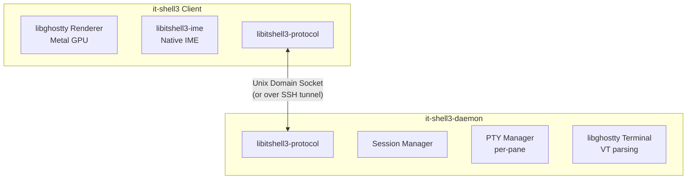

# it-shell3: Project Overview

## Vision

**it-shell3** is a terminal ecosystem providing terminal multiplexer session management with first-class CJK input support, built on **libghostty**. The project consists of three libraries and two applications:

**Libraries:**
- **libitshell3**: Core Zig library — session/tab/pane state, PTY layer, RenderState export/import. Exports C API for Swift/other consumers.
- **libitshell3-protocol**: Wire protocol library — 16-byte fixed header, capability negotiation, RenderState streaming, CJK preedit sync. Shared by both daemon and client.
- **libitshell3-ime**: Native IME engine — wraps libhangul for Korean (2-set, 3-set) plus English QWERTY. No OS IME dependency. Purely algorithmic.

**Applications:**
- **it-shell3**: Client terminal app (Swift/AppKit + libghostty Metal GPU) — connects to daemon, renders via `importFlatCells()` → `rebuildCells()` → `drawFrame()`. macOS first, iOS later.
- **it-shell3-daemon**: Server daemon process (Zig binary) — PTY owner, session persistence, I/O mux, client connections via Unix socket. Runs as LaunchAgent or standalone process. Cannot be part of the macOS app (GUI apps cannot be LaunchDaemons).

## Problem Statement

Existing terminal multiplexers (tmux, zellij, screen) have fundamental limitations:

1. **CJK Input Composition**: IME preedit state (Korean Jamo decomposition, Japanese Kana-to-Kanji, Chinese Pinyin) is not properly synchronized between client and server. This causes broken input when composing CJK text inside multiplexed sessions. See `docs/modules/libitshell3-ime/01-overview/03-hangul-composition.md` for Korean composition details.

2. **AI Agent Chat Interfaces**: Modern AI coding tools (Claude Code, Codex CLI, Cursor terminal) use custom input areas that need:
   - Shift+Enter for line breaks (not command execution)
   - Cmd+C / Cmd+V for clipboard (not SIGINT / raw paste)
   - Proper CJK composition within the agent's input buffer

3. **Cross-Device Session Continuity**: Sessions should persist across terminal app restarts and be accessible from multiple devices (macOS + iOS).

## Why libghostty?

Instead of writing a custom VT emulator, we leverage Ghostty's battle-tested terminal engine because:

- **CJK-ready Unicode**: Full grapheme clustering, emoji variation selectors, proper wide character handling
- **IME Preedit API**: Native `ghostty_surface_preedit()` for input composition
- **Metal Rendering**: GPU-accelerated rendering on macOS/iOS via Metal
- **HarfBuzz Font Shaping**: Proper CJK glyph shaping and ligatures
- **Embeddable C API**: `ghostty.h` with opaque types (`ghostty_app_t`, `ghostty_surface_t`)
- **RenderState API**: Server-side `bulkExport()` and client-side `importFlatCells()` for structured cell data streaming

## Architecture Summary

> **PoC Validated**: The core rendering pipeline (server RenderState → FlatCell[] → client importFlatCells() → rebuildCells() → Metal GPU) has been proven end-to-end with actual GPU rendering. See `poc/06-renderstate-extraction/`, `poc/07-renderstate-bulk-api/`, `poc/08-renderstate-reinjection/`.

**Key architectural insight**: The client is a thin RenderState populator — `importFlatCells()` → `rebuildCells()` → `drawFrame()`. No Terminal, VT parser, or Page/Screen on the client side. The server owns all Terminal instances and exports structured cell data. See `docs/insights/design-principles.md` (A4, A5, A6).

## Daemon Lifecycle

**Distribution**: The daemon binary (`it-shell3-daemon`) is bundled inside the client app (`it-shell3.app/Contents/Helpers/`). Distributed as notarized DMG or Homebrew Cask — not Mac App Store, since LaunchAgent registration requires sandbox escape.

**Startup**: The client does not track "first launch" state. Every launch follows the same flow:

1. Connect to Unix socket
2. If connection fails → register LaunchAgent plist + `launchctl bootstrap` → reconnect
3. If connection succeeds → handshake (version exchange) → ready

**Local version update**: On handshake, the client compares `server_version` (semantic version string) against its bundled binary version. If they differ, the client kills the daemon (`SIGKILL`) and restarts via LaunchAgent (`launchctl bootout` → `launchctl bootstrap`). Existing sessions are lost — acceptable trade-off for local single-user use. No compatibility range needed; the bundled binary is always the correct version.

**Remote (SSH)**: No LaunchAgent needed. The client connects to the socket; if the daemon is not running, it starts it directly via `fork+exec`. The daemon detaches from the SSH session (`setsid`/`daemon(3)`) and survives disconnection — same as `tmux` server auto-start. Compatibility is determined by `protocol_version` min/max negotiation (integer range, not semantic version). If the negotiated version falls below either side's minimum, the client displays an error and exits — the user must update the remote daemon manually.

## Key Design Goals

1. **Session Persistence**: Daemon process keeps PTY sessions alive across client disconnects
2. **CJK Preedit Sync**: IME composition state synchronized between client(s) and daemon
3. **AI Agent Awareness**: Special input mode detection for Shift+Enter, Cmd+C/V in agent contexts
4. **Cross-Platform Client**: macOS (native) and iOS (via libghostty embedded apprt)
5. **Backward Compatibility**: Graceful fallback via capability negotiation

## Vendored Dependencies

Located at `vendors/`:

| Dependency | Purpose | Language |
|------------|---------|----------|
| ghostty | Terminal engine (libghostty) | Zig |
| libhangul | Korean Hangul composition for libitshell3-ime | C |

## Reference Codebases

External projects used for design reference (not part of this repository):

| Reference | Purpose | Language |
|-----------|---------|----------|
| [tmux](https://github.com/tmux/tmux) | Canonical terminal multiplexer — daemon/protocol patterns | C |
| [zellij](https://github.com/zellij-org/zellij) | Modern terminal multiplexer — multi-threaded architecture | Rust |
| [iTerm2](https://github.com/gnachman/iTerm2) | macOS terminal — tmux -CC integration, native UI mapping | ObjC/Swift |
| [cmux](https://github.com/manaflow-ai/cmux) | libghostty-based macOS terminal — embedding patterns | Swift |

## Document Index

### Project-Level Docs (`docs/project/`)

| Document | Contents |
|----------|----------|
| [01-project-overview.md](./01-project-overview.md) | This document — project vision, problem statement, architecture summary |
| [02-feasibility-analysis.md](./02-feasibility-analysis.md) | Feasibility assessment and risk analysis |
| [03-recommended-architecture.md](./03-recommended-architecture.md) | Proposed architecture and technology choices |
| [04-testing-strategy.md](./04-testing-strategy.md) | Testing tiers, coverage estimate, CI pipeline |
| [05-architecture-validation-report.md](./05-architecture-validation-report.md) | Full architecture review, native IME decision, risk matrix, phased development path |

### App Docs (`docs/app/`)

| Document | Contents |
|----------|----------|
| [01-macos-input-pipeline.md](../app/01-macos-input-pipeline.md) | macOS input pipeline, ghostty surface APIs |
| [02-key-handling.md](../app/02-key-handling.md) | Shift+Enter, Cmd+C/V, AI agent input areas |
| [03-mouse-events.md](../app/03-mouse-events.md) | Mouse event handling strategy |

### Daemon Docs (`docs/daemon/`)

| Document | Contents |
|----------|----------|
| [01-session-persistence.md](../daemon/01-session-persistence.md) | Session persistence mechanisms (tmux, zellij, cmux patterns) |
| [02-pty-management.md](../daemon/02-pty-management.md) | PTY management, I/O architecture |
| [03-multiplexer-keybindings.md](../daemon/03-multiplexer-keybindings.md) | Multiplexer keybinding models |

### Library Docs (`docs/modules/libitshell3/01-overview/`)

| Document | Contents |
|----------|----------|
| [01-libghostty-api.md](../modules/libitshell3/01-overview/01-libghostty-api.md) | libghostty C API surface, types, and embedding patterns |
| [02-window-pane-management.md](../modules/libitshell3/01-overview/02-window-pane-management.md) | Window/pane hierarchy and layout systems |

### IME Docs

| Directory | Contents |
|-----------|----------|
| [docs/modules/libitshell3-ime/01-overview/](../modules/libitshell3-ime/01-overview/) | Native IME library — rationale, libhangul API, Korean composition, architecture, build/licensing |

### Protocol Docs

| Directory | Contents |
|-----------|----------|
| [docs/modules/libitshell3-protocol/](../modules/libitshell3-protocol/) | Wire protocol specification — handshake, session/pane management, input/renderstate, CJK preedit, flow control |

### Cross-Cutting Insights

| Document | Contents |
|----------|----------|
| [docs/insights/design-principles.md](../insights/design-principles.md) | Validated protocol design principles, architectural insights, process lessons |
| [docs/insights/ghostty-api-extensions.md](../insights/ghostty-api-extensions.md) | render_export API, FlatCell format, PoC results |
| [docs/insights/reference-codebase-learnings.md](../insights/reference-codebase-learnings.md) | Patterns from ghostty, tmux, zellij reference codebases |
