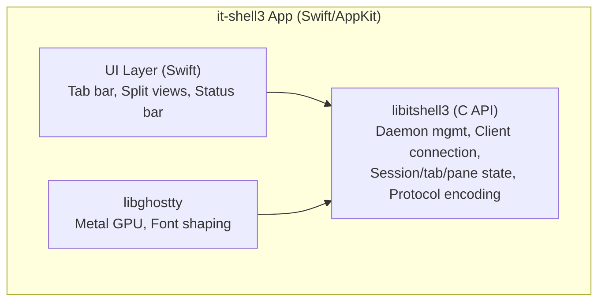

# Recommended Architecture

## Overview

This document proposes the architecture for it-shell3 based on the feasibility analysis and reference code research.

---

## Architecture Decision: Portable Zig Library (libitshell3)

it-shell3 is a **portable Zig library** (`libitshell3`) that:
- Exports C headers and shared libraries (`.dylib` / `.so`)
- Wraps libghostty's terminal engine
- Provides terminal multiplexer session management (daemon/client)
- Handles CJK preedit synchronization
- Can be consumed by native apps (Swift macOS, future Linux clients)

### Why Zig?

1. **Natural FFI with libghostty**: ghostty is written in Zig — importing and wrapping it is seamless
2. **C ABI export**: Zig can `@export` functions with C calling convention and generate `.h` headers
3. **Cross-platform**: Same codebase targets macOS (now) and Linux (future)
4. **No runtime**: No GC, no runtime overhead — suitable for embedding
5. **Build system**: Zig's build system can compose with ghostty's build system

### Library Architecture

```
libitshell3 (Zig library)
├── C API (exported via ghostty-style .h header)
│   ├── Daemon lifecycle
│   ├── Session/tab/pane management
│   ├── Client connection
│   └── Protocol encoding
│
├── Daemon Module — PTY management, session state, client connections, I/O multiplexing
├── Client Module — Socket connection, protocol handling, RenderState population
├── Protocol Module — Message types, serialization, capability negotiation
│
├── libitshell3-ime (separate library) — Native IME engine (English QWERTY + Korean 2-set)
│
└── Depends on: libghostty (git submodule) — Terminal engine, font/Unicode, Metal renderer
```

> **C API design**: The concrete function signatures and opaque handle types will be defined during implementation. The API will follow ghostty's opaque-handle pattern (e.g., `ghostty_app_t`, `ghostty_surface_t`) for clean Swift interop.

> **Build system**: Zig build system (`build.zig`) targeting Zig 0.14+. Will produce static `.a` and shared `.dylib`/`.so` libraries. ghostty is imported as a build dependency.

---

## Integration with Terminal App (it-shell3)

The it-shell3 app is a **complete terminal emulator** for macOS and iOS (starting with macOS). It consumes libitshell3 + libitshell3-ime + libghostty.

> **PoC Validated (2026-03-08)**: PoC 06–08 confirmed that the client needs only libghostty's renderer — no Terminal, VT parser, or Page/Screen required. The server exports cell data via `bulkExport()`, and the client imports via `importFlatCells()` for direct GPU rendering. See `poc/06-renderstate-extraction/`, `poc/07-renderstate-bulk-api/`, `poc/08-renderstate-reinjection/`.



The client is a thin RenderState populator: `importFlatCells()` → `rebuildCells()` → `drawFrame()`. No Terminal or VT parser on the client side. See `docs/insights/design-principles.md` (A4, A5).

---

## Technology Stack Summary

| Component | Technology | Rationale |
|-----------|-----------|-----------|
| Library language | Zig | Natural FFI with ghostty, C export, cross-platform |
| Terminal engine | libghostty (Zig) | CJK-ready, GPU-rendered, battle-tested |
| Build system | Zig build | Composes with ghostty's build system |
| IPC transport | Unix domain sockets | Proven (tmux), fast, FD passing |
| Wire format | Hybrid binary+JSON | Binary for cell data, JSON for control messages |
| Persistence | JSON snapshots | Human-readable, debuggable |
| IME engine | libitshell3-ime (Zig, wraps libhangul) | Algorithmic Korean composition, no OS IME dependency |
| macOS app | Swift/AppKit + libitshell3 + libghostty | Complete terminal emulator (first target) |
| iOS app | Swift/UIKit + libitshell3 + libghostty | Complete terminal emulator (client-only, connects to macOS/Linux daemon) |

## Design Details

For detailed specifications, see:
- **Wire protocol**: `docs/modules/libitshell3-protocol/02-design-docs/server-client-protocols/` (handshake, session/pane management, input/renderstate, CJK preedit, flow control)
- **IME engine**: `docs/modules/libitshell3-ime/01-overview/` (libhangul API, Korean composition, architecture)
- **Daemon architecture**: `docs/daemon/` overview docs (session persistence, PTY management, keybindings)
- **ghostty integration**: `docs/insights/ghostty-api-extensions.md` (render_export API, FlatCell format, PoC results)
- **Design principles**: `docs/insights/design-principles.md` (validated protocol and architectural principles)
