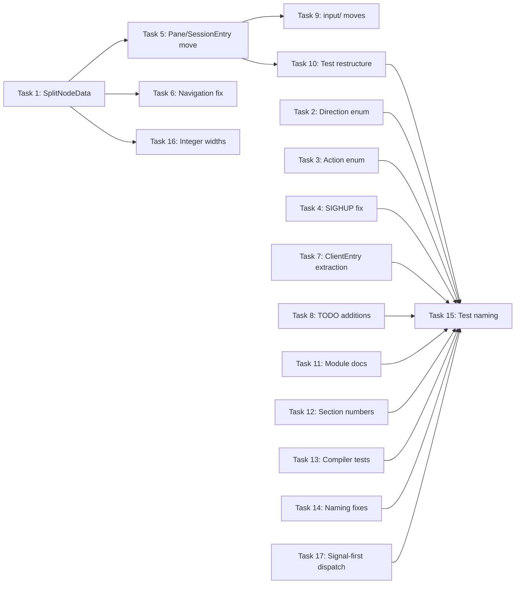
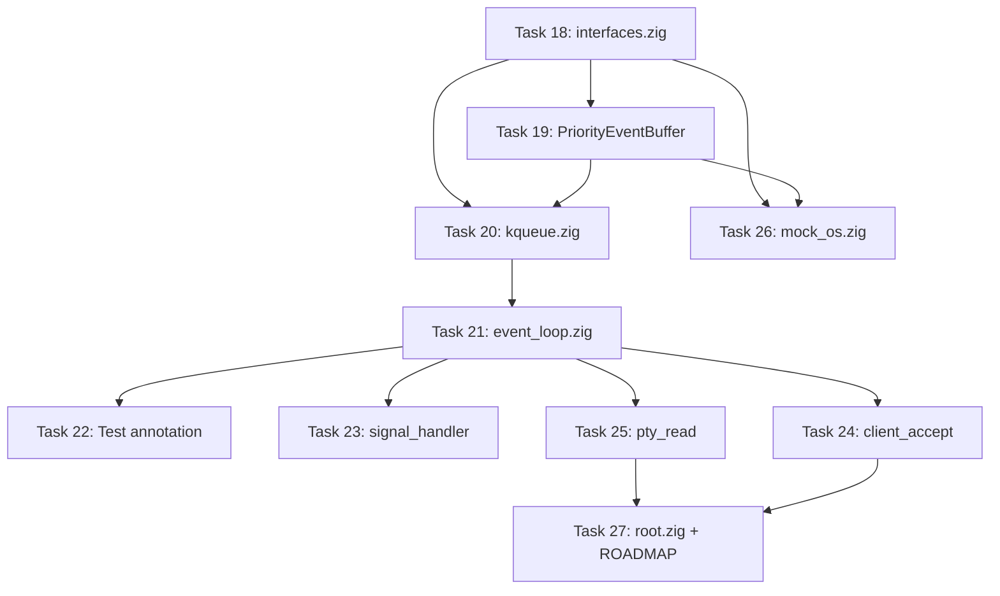

# libitshell3 Spec Alignment Audit — Implementation Plan

**Goal:** Align the libitshell3 implementation with its design specs by fixing
code bugs, resolving structural divergences, and correcting convention
violations identified during the Plan 5.5 audit. Part 2 refactors
`event_loop.zig` into a minimal event iteration engine with middleware-based
dispatch and priority-ordered event delivery, removing six spec violations that
block Plans 6, 7, 10, and 12.2.

**Architecture:** The changes span all libitshell3 named modules (core, server,
input, ghostty, testing). Structural refactoring moves types to their
spec-designated modules and redesigns the split tree to use heap-index
arithmetic. Convention fixes are mechanical and parallelizable. Part 2 replaces
the existing `EventLoop` struct with a minimal dispatcher that holds only an OS
vtable, a handler chain head, and a `running` flag. A new `PriorityEventBuffer`
data structure (in `os/`) sorts raw OS events into four priority tiers before
the loop iterates them. The handler chain pattern replaces the hard-coded
`dispatch()` routing function, and the `EventTarget` tagged union replaces raw
integer `udata` encoding.

**Tech Stack:** Zig 0.15+, libitshell3 build system (`build.zig`)

**Spec references:**

- daemon-architecture/draft/v1.0-r8 (module structure, state and types,
  integration boundaries)
- daemon-behavior/draft/v1.0-r8 (daemon lifecycle, event handling)
- server-client-protocols/draft/v1.0-r12 (protocol overview, session/pane
  management, input and renderstate)
- libitshell3-ime interface-contract/draft/v1.0-r10
- libitshell3-ime behavior/draft/v1.0-r2
- ADR 00043 (binary split tree as sole pane layout model)
- ADR 00058 (fixed-size inline buffers)
- docs/conventions/zig-coding.md
- docs/conventions/zig-naming.md
- docs/conventions/zig-documentation.md
- docs/conventions/zig-testing.md
- `docs/superpowers/specs/2026-03-28-event-loop-redesign.md` — full EventLoop
  redesign spec (9 sections)

---

## Scope

**In scope:**

1. Code bugs: SIGHUP handler, Direction enum integer mapping, Action enum
   explicit tags, signal-first dispatch ordering (EVFILT_SIGNAL before
   EVFILT_READ in kevent64() batch)
2. Owner-decided code fixes: Pane/SessionEntry move to server/, SplitNodeData
   heap-index redesign, navigation algorithm fix, KeyEvent.hid_keycode widening
3. Convention violations: module-level docs, spec section number removal, test
   directory restructure, test naming, compiler-verified test removal,
   `_len`/`_length` rename, `aim` abbreviation, inline test prefix format,
   arbitrary-width integer replacement (u3/u5 → u8 per zig-coding.md)
4. TODO additions: signal_handler, client_accept, event_loop (5-tier client
   message priority)
5. Structural refactoring: ClientEntry extraction, input/ module function moves
6. EventLoop redesign: replace EventLoop struct with minimal dispatcher, add
   Handler chain type, add EventTarget tagged union, create PriorityEventBuffer,
   update kqueue/epoll backends, refactor signal_handler/client_accept/pty_read
   to chain handler pattern, update mock_os vtable signatures

**Out of scope:**

- New feature implementation (Plans 6-16+)
- Protocol library changes (libitshell3-protocol is a separate library)
- libitshell3-ime implementation changes (separate module, own spec)
- Test coverage additions beyond what is required to verify the fixes

## File Structure

| File                                              | Action | Responsibility                                                                                               |
| ------------------------------------------------- | ------ | ------------------------------------------------------------------------------------------------------------ |
| `src/core/types.zig`                              | Modify | Fix Direction enum integer mapping; remove `_len` local if applicable                                        |
| `src/core/ime_engine.zig`                         | Modify | Add explicit integer tags to Action enum; widen hid_keycode to u16                                           |
| `src/core/split_tree.zig`                         | Modify | Redesign SplitNodeData to use `?SplitNodeData` optional + heap-index arithmetic                              |
| `src/core/navigation.zig`                         | Modify | Change selection from "greatest overlap" to "shortest edge distance"                                         |
| `src/core/session.zig`                            | Modify | Remove Pane/SessionEntry to server/; rename `aim` locals; adapt tree_nodes type                              |
| `src/core/pane.zig`                               | Delete | Move to `src/server/pane.zig`                                                                                |
| `src/core/root.zig`                               | Modify | Add `//!` header; remove Pane/SessionEntry re-exports; update post-move                                      |
| `src/core/session_manager.zig`                    | Modify | Update imports after Pane/SessionEntry move; adapt to new tree type                                          |
| `src/server/pane.zig`                             | Create | Pane struct moved from core/; typed ghostty pointers                                                         |
| `src/server/session_entry.zig`                    | Create | SessionEntry extracted from core/session.zig                                                                 |
| `src/server/client_state.zig`                     | Create | ClientEntry extracted from event_loop.zig                                                                    |
| `src/server/event_loop.zig`                       | Modify | Extract ClientEntry; fix signal-first dispatch ordering; add TODO(Plan 6) for 5-tier client message priority |
| `src/server/signal_handler.zig`                   | Modify | Fix SIGHUP to trigger shutdown; add TODO(Plan 10) for graceful shutdown                                      |
| `src/server/handlers/client_accept.zig`           | Modify | Add TODO(Plan 6) for UID verification and SO_SNDBUF/SO_RCVBUF                                                |
| `src/server/ime_procedures.zig`                   | Modify | Update imports after Pane/SessionEntry move                                                                  |
| `src/server/ime_lifecycle.zig`                    | Modify | Update imports after Pane/SessionEntry move                                                                  |
| `src/server/ime_consumer.zig`                     | Modify | Update imports after Pane/SessionEntry move                                                                  |
| `src/server/root.zig`                             | Modify | Add `//!` header; add new file imports; update re-exports                                                    |
| `src/input/root.zig`                              | Modify | Add `//!` header                                                                                             |
| `src/input/key_router.zig`                        | Modify | Remove spec section number refs if present                                                                   |
| `src/ghostty/root.zig`                            | Modify | Add `//!` header                                                                                             |
| `src/ghostty/key_encoder.zig`                     | Modify | Remove spec section number refs                                                                              |
| `src/ghostty/terminal.zig`                        | Modify | Remove spec section number refs                                                                              |
| `src/ghostty/render_state.zig`                    | Modify | Remove spec section number refs                                                                              |
| `src/ghostty/preedit_overlay.zig`                 | Modify | Remove spec section number refs                                                                              |
| `src/ghostty/render_export.zig`                   | Modify | Remove spec section number refs                                                                              |
| `src/os/root.zig`                                 | Modify | Add `//!` header                                                                                             |
| `src/root.zig`                                    | Modify | Add `//!` header                                                                                             |
| `src/testing/mock_os.zig`                         | Modify | Rename `write_len` field to `write_length`                                                                   |
| `src/testing/mock_ime_engine.zig`                 | Modify | Rename `set_aim_result`/`set_aim_count`/`last_set_aim_method` fields                                         |
| `src/testing/root.zig`                            | Modify | Add `//!` header; restructure imports for mocks/ and spec/ subdirs                                           |
| `src/testing/mocks/`                              | Create | New subdirectory for mock files                                                                              |
| `src/testing/mocks/mock_os.zig`                   | Create | Moved from `src/testing/mock_os.zig`                                                                         |
| `src/testing/mocks/mock_ime_engine.zig`           | Create | Moved from `src/testing/mock_ime_engine.zig`                                                                 |
| `src/testing/spec/`                               | Create | New subdirectory for spec test files                                                                         |
| `src/testing/spec/*_spec_test.zig`                | Create | 8 spec test files moved from `src/testing/`                                                                  |
| `src/server/ring_buffer_integration_test.zig`     | Modify | Remove spec section number refs from comments and test names                                                 |
| `src/server/ring_buffer_spec_compliance_test.zig` | Modify | Remove spec section number refs; remove 6 compiler-verified tests; move to testing/spec/                     |
| `build.zig`                                       | Modify | Update root source paths after testing/ restructure if needed                                                |
| Multiple files (~10)                              | Modify | Rename ~80 spec test names to `"spec: topic — requirement"` format                                           |
| Multiple files (~10+)                             | Modify | Add `function_or_type:` prefix to ~57 inline tests                                                           |

## Tasks

### Task 1: SplitNodeData Heap-Index Redesign (C2)

**Files:** `src/core/split_tree.zig` (modify), `src/core/session.zig` (modify),
`src/core/navigation.zig` (modify)

**Spec:** daemon-architecture `02-state-and-types.md` Section 1 — defines
`[31]?SplitNodeData` with heap-index arithmetic (parent = (i-1)/2, left = 2i+1,
right = 2i+2). ADR 00043 — binary split tree with implicit index arithmetic.

**Depends on:** None

**Verification:**

- SplitNodeData is a two-variant tagged union (leaf, split) with no `.empty`
  variant
- Tree array type is `[MAX_TREE_NODES]?SplitNodeData` (optional, not
  non-optional with `.empty`)
- Split variant has no explicit `left: u5`/`right: u5` child indices — children
  are computed by heap-index arithmetic
- `initSingleLeaf`, `splitLeaf`, `removeLeaf`, `findLeafBySlot`, `leafCount`,
  `depth`, `findParent` all use heap-index arithmetic instead of stored child
  pointers
- All existing split_tree tests pass with the new representation
- `Session.tree_nodes` type updated to match
- `navigation.zig` computeRectsNode and findPaneInDirection work with the new
  tree representation

### Task 2: Direction Enum Integer Mapping (PROTO-2)

**Files:** `src/core/types.zig` (modify)

**Spec:** server-client-protocols `03-session-pane-management.md` — directions
use integers: 0 = right, 1 = down, 2 = left, 3 = up (matches ghostty's
`GHOSTTY_SPLIT_DIRECTION`).

**Depends on:** None

**Verification:**

- `Direction` enum has explicit integer tags:
  `right = 0, down = 1, left = 2,
  up = 3`
- `@intFromEnum(Direction.right) == 0`, `@intFromEnum(Direction.down) == 1`,
  `@intFromEnum(Direction.left) == 2`, `@intFromEnum(Direction.up) == 3`

### Task 3: Action Enum Explicit Tags + KeyEvent.hid_keycode Widening (PROTO-5, C7)

**Files:** `src/core/ime_engine.zig` (modify)

**Spec:** server-client-protocols `04-input-and-renderstate.md` — action field
is u8 with 0=press, 1=release, 2=repeat. keycode field is u16. ADR 00058 for
HID_KEYCODE_MAX type.

**Depends on:** None

**Verification:**

- `KeyEvent.Action` has explicit integer tags:
  `press = 0, release = 1,
  repeat = 2`
- `KeyEvent.hid_keycode` type is `u16` (was `u8`)
- `KeyEvent.HID_KEYCODE_MAX` type is `u16` (was `u8`)
- All call sites that construct KeyEvent compile with the widened type

### Task 4: SIGHUP Shutdown Fix + Signal TODO (BEHAV-1, E-signal)

**Files:** `src/server/signal_handler.zig` (modify)

**Spec:** daemon-behavior `01-daemon-lifecycle.md` — SIGHUP is a shutdown
trigger alongside SIGTERM and SIGINT. daemon-behavior
`impl-constraints/daemon-lifecycle.md` — SIGHUP registered as graceful shutdown.

**Depends on:** None

**Verification:**

- SIGHUP case in handleSignalEvent sets `shutdown_requested = true` (same as
  SIGTERM/SIGINT)
- The old "ignored" comment is removed
- A `TODO(Plan 10)` comment is added for graceful shutdown procedure (client
  drain, preedit flush, child SIGHUP)

### Task 5: Pane and SessionEntry Move to server/ (C1)

**Files:** `src/core/pane.zig` (delete), `src/core/session.zig` (modify),
`src/core/root.zig` (modify), `src/core/session_manager.zig` (modify),
`src/server/pane.zig` (create), `src/server/session_entry.zig` (create),
`src/server/root.zig` (modify), plus all server/ files that import core pane or
session types

**Spec:** daemon-architecture `impl-constraints/state-and-types.md` — Pane is
annotated `<<server/pane.zig>>`, SessionEntry is annotated
`<<server/session_entry.zig>>`. Session stays in `core/session.zig`. The spec
class diagram explicitly places these in server/. SessionManager embeds
`[MAX_SESSIONS]?SessionEntry` by value, so SessionManager MUST also move to
server/ (it cannot reference a server/ type from core/). The spec's class
diagram does not annotate SessionManager with a file path, but its only field is
`sessions: HashMap<u32, *SessionEntry>` which requires SessionEntry — so it
belongs in server/.

**Spec (ghostty pointers):** Pane currently uses `?*anyopaque` for terminal,
render_state, vt_stream. The spec defines typed pointers: `*ghostty.Terminal`,
`*ghostty.RenderState`. Since Pane moves to server/ (which has ghostty as a
dependency), these should become typed pointers. Note: the
`vt_stream:
?*anyopaque` field is NOT in the spec type definition — it was added
per `implementation-learnings.md G3`. When moving Pane to server/, the
implementer must decide: either give `vt_stream` a typed pointer (matching the
ghostty API used), or document it explicitly as a code-only addition not present
in the spec.

**Depends on:** Task 1 (SplitNodeData redesign changes the tree_nodes type that
Session uses, which SessionEntry wraps)

**Verification:**

- `src/core/pane.zig` no longer exists
- `src/server/pane.zig` contains the Pane struct with typed ghostty pointers
  (not `?*anyopaque`)
- `src/server/session_entry.zig` contains SessionEntry
- `src/server/session_manager.zig` exists (moved from core/) — or
  `src/core/session_manager.zig` is removed and replaced
- Session remains in `core/session.zig` but no longer contains Pane/SessionEntry
- `core/root.zig` no longer re-exports Pane, SessionEntry, or SessionManager
- `server/root.zig` re-exports Pane, SessionEntry, SessionManager
- All files that previously imported Pane/SessionEntry/SessionManager from
  `itshell3_core` now import from `itshell3_server`
- Build succeeds and all existing tests pass

### Task 6: Navigation Algorithm Fix (C3)

**Files:** `src/core/navigation.zig` (modify)

**Spec:** daemon-architecture `02-state-and-types.md` Section 2.2 — Step 4 says
"select the candidate with the shortest edge distance (distance between focused
edge and candidate's adjacent edge)". The current code selects by "greatest edge
overlap" instead of "shortest edge distance".

**Depends on:** Task 1 (navigation depends on the tree representation)

**Verification:**

- Direct neighbor selection uses shortest edge distance (not greatest overlap)
  as the primary criterion
- Tie-break is still lowest pane slot index
- Perpendicular overlap filter is still applied (only candidates with
  perpendicular overlap are considered)
- All existing navigation tests still pass (the change may require updating some
  test expectations if the algorithm produces different results for edge cases)

### Task 7: ClientEntry Extraction (ARCH-26)

**Files:** `src/server/event_loop.zig` (modify), `src/server/client_state.zig`
(create), `src/server/root.zig` (modify)

**Spec:** daemon-architecture `01-module-structure.md` — ClientEntry is a
server-side type; extraction to its own file improves module organization.

**Depends on:** None

**Verification:**

- ClientEntry struct is defined in `src/server/client_state.zig`
- `event_loop.zig` imports ClientEntry from the new file
- `server/root.zig` re-exports ClientEntry
- Build succeeds and all existing event_loop tests pass

### Task 8: Event Loop and Client Accept TODOs (E-event, E-client)

**Files:** `src/server/event_loop.zig` (modify),
`src/server/handlers/client_accept.zig` (modify)

**Spec:** daemon-behavior `03-policies-and-procedures.md` §6 — 5-tier client
message priority table (the ordering policy deferred to Plan 6). daemon-
architecture `03-integration-boundaries.md` — UID verification and socket buffer
configuration at accept time.

**Depends on:** None

**Verification:**

- `event_loop.zig` dispatch function has a `TODO(Plan 6)` comment about the
  5-tier client message priority ordering (per `03-policies-and-procedures.md`
  §6); this TODO covers only the priority policy, NOT the signal-first ordering
  (that is a code fix in Task 17)
- `client_accept.zig` has `TODO(Plan 6)` for UID verification
  (`getpeereid`/`SO_PEERCRED`)
- `client_accept.zig` has `TODO(Plan 6)` for `SO_SNDBUF`/`SO_RCVBUF`
  configuration

### Task 9: input/ Module Function Moves (ARCH-8)

**Files:** `src/input/root.zig` (modify), potentially new files in `src/input/`

**Spec:** daemon-architecture `01-module-structure.md` Section 1.2 — input/
module scope includes `handleIntraSessionFocusChange` and
`handleInputMethodSwitch`. These functions do not currently exist in the
codebase (they are stubs planned for future plans), but the spec assigns them to
input/. If any focus-change or input-method-switch logic currently lives in
server/, it should be moved.

**Depends on:** Task 5 (module boundary changes)

**Verification:**

- If any focus-change or input-method-switch orchestration logic exists in
  server/ files, it is moved to input/ (the IME lifecycle/procedures files in
  server/ implement the _engine-level_ operations; the _key-routing-level_
  orchestration belongs in input/ per spec)
- input/root.zig exports are updated if new files are added
- Existing tests pass

### Task 10: Test Directory Restructure (CONV-3~5)

**Files:** `src/testing/root.zig` (modify), `build.zig` (modify if needed),
create `src/testing/mocks/` and `src/testing/spec/` directories, move 2 mock
files and 8 spec test files plus ring_buffer spec compliance tests

**Spec:** docs/conventions/zig-testing.md — testing/ must have `mocks/` and
`spec/` subdirectories. Mock files go in `mocks/mock_*.zig`. Spec tests go in
`spec/*_spec_test.zig`.

**Depends on:** None (can run in parallel with code changes, but should be
sequenced after Task 5 to avoid move conflicts)

**Verification:**

- `src/testing/mocks/mock_os.zig` and `src/testing/mocks/mock_ime_engine.zig`
  exist (moved from `src/testing/`)
- `src/testing/spec/` contains all 8 `*_spec_test.zig` files (moved from
  `src/testing/`)
- `src/server/ring_buffer_spec_compliance_test.zig` is moved to
  `src/testing/spec/ring_buffer_spec_compliance_test.zig` (or remains in server/
  if the convention allows module-local spec tests — implementer decides based
  on dependency analysis)
- `src/testing/root.zig` imports from the new paths
- `build.zig` updated if module root source paths changed
- All tests still discovered and passing

### Task 11: Convention Fixes — Module-Level Docs (CONV-1)

**Files:** 7 `root.zig` files: `src/root.zig`, `src/core/root.zig`,
`src/server/root.zig`, `src/input/root.zig`, `src/ghostty/root.zig`,
`src/os/root.zig`, `src/testing/root.zig`

**Spec:** docs/conventions/zig-documentation.md Section 1 — every `root.zig`
MUST have `//!` top-level doc comments.

**Depends on:** None

**Verification:**

- All 7 root.zig files begin with `//!` module-level documentation comments
  describing the module's purpose

### Task 12: Convention Fixes — Spec Section Number Removal (CONV-2)

**Files:** `src/ghostty/key_encoder.zig`, `src/ghostty/preedit_overlay.zig`,
`src/ghostty/terminal.zig`, `src/ghostty/render_state.zig`,
`src/ghostty/render_export.zig`, `src/server/ring_buffer.zig`,
`src/server/client_writer.zig`, `src/server/ring_buffer_integration_test.zig`,
`src/server/ring_buffer_spec_compliance_test.zig`, and any other files with `§`
or `Section N.N` references

**Spec:** docs/conventions/zig-documentation.md Section 5 — do NOT embed spec
section numbers. Reference specs by document/topic name only.

**Depends on:** None

**Verification:**

- No source file contains `§` followed by a number
- No source file contains `Section N.N` (where N is a digit) in comments
- Spec references use document/topic names instead (e.g., "per daemon-
  architecture state-and-types spec")

### Task 13: Convention Fixes — Compiler-Verified Test Removal (CONV-7)

**Files:** `src/server/ring_buffer_spec_compliance_test.zig` (modify),
`src/server/client_writer.zig` (modify)

**Spec:** docs/conventions/zig-testing.md — compiler-verified tests
(`@hasField`, `@hasDecl`, field count checks) should not exist because they test
the compiler, not the spec.

**Depends on:** None

**Verification:**

- The following 6 tests are removed from `ring_buffer_spec_compliance_test.zig`:
  - Tests using `@hasField` to check field existence
  - Tests using `@hasDecl` to check API existence
  - Tests using `@typeInfo` to count struct fields
- `client_writer.zig` inline unit tests that use `@hasField` as their sole
  assertion are removed
- No remaining tests in the codebase use `@hasField`, `@hasDecl`, or
  `@typeInfo(...).fields.len` as their sole assertion

### Task 14: Convention Fixes — Naming (CONV-8, CONV-9)

**Files:** `src/testing/mock_os.zig` (modify), `src/testing/mock_ime_engine.zig`
(modify), `src/core/session.zig` (modify), plus all files referencing renamed
fields

**Spec:** docs/conventions/zig-naming.md — no abbreviations. `_len` must be
`_length`. `aim` must be spelled out as `active_input_method` (or use the full
word in the variable name context).

**CONV-8 (`_len` to `_length`):**

- `mock_os.zig`: `write_len` field renamed to `write_length`
- `session.zig`: `name_len` local variable renamed (locals are less critical but
  should still follow convention for consistency)

**CONV-9 (`aim` abbreviation):**

- `session.zig`: `aim` local variables renamed to use full words (e.g.,
  `default_input_method` or `input_method_default`)
- `mock_ime_engine.zig`: PUBLIC fields renamed:
  - `set_aim_result` to `set_active_input_method_result`
  - `set_aim_count` to `set_active_input_method_count`
  - `last_set_aim_method` to `last_set_active_input_method`

**Depends on:** None

**Verification:**

- No struct field in the codebase uses `_len` as a suffix (except external
  library types and local variables in tight scope where the full name would be
  excessive — implementer judgment)
- No identifier uses `aim` as an abbreviation for `active_input_method`
- All references to renamed fields are updated
- Build succeeds and all tests pass

### Task 15: Convention Fixes — Test Naming (CONV-6, CONV-10)

**Files:** ~10 files containing spec tests, ~10+ files containing inline tests

**Spec:** docs/conventions/zig-testing.md — spec tests must use
`"spec: topic — requirement"` format. docs/conventions/zig-naming.md — inline
tests must use `"function_or_type: description"` format.

**CONV-6 (spec test naming):** ~80 spec tests in 10 files need renaming from
current format (e.g., `"spec 4.1: ..."`) to `"spec: topic — requirement"`
format.

**CONV-10 (inline test prefix):** ~57 inline tests missing the
`function_or_type:` prefix need the prefix added.

**Depends on:** Task 10 (test directory restructure moves the files first)

**Verification:**

- All spec tests match the pattern `test "spec: <topic> — <requirement>"`
- All inline tests match the pattern `test "<FunctionOrType>.<method>: ..."` or
  `test "<function>: ..."` with the function/type prefix present
- No test name starts with a bare description without a function/type prefix
  (for inline tests) or without `"spec: "` (for spec tests)

### Task 16: Convention Fixes — Integer Width Alignment

**Files:** `src/core/types.zig` (modify), `src/core/split_tree.zig` (modify),
`src/core/session.zig` (modify), `src/core/session_manager.zig` (modify),
`src/core/navigation.zig` (modify), `src/server/event_loop.zig` (modify),
`src/server/signal_handler.zig` (modify), `src/ghostty/preedit_overlay.zig`
(modify), and any other files with integer width violations

**Spec:** docs/conventions/zig-coding.md — 6 rules for integer type selection:
public symbols (tight but future-proof), locals (register-friendly), array
indices (match capacity), loop counters (u32/usize), sparse returns (enum),
derived constants (comptime-derived from source constant).

**Known violations:**

- `types.zig`: `MAX_PANES: u5`, `MAX_TREE_NODES: u5`, `MAX_TREE_DEPTH: u3` →
  `u8` (Rule 1: public constants, future-proof width)
- `types.zig`: `MAX_TREE_NODES` should be comptime-derived as
  `MAX_PANES * 2 - 1`; `MAX_TREE_DEPTH` should be comptime-derived as
  `std.math.log2_int(u8, MAX_PANES)` — both are currently hardcoded (Rule 6:
  derived constants must be comptime-derived from the source constant)
- `types.zig`, `split_tree.zig`, `navigation.zig`, `event_loop.zig`,
  `signal_handler.zig`: loop counters `var i: u5` → `u32` (Rule 4: loop counters
  always u32 or usize)
- `session.zig`: `paneCount` method has `var count: u5 = 0` and
  `var i: u5 =
  0` loop counters → `u32` (Rule 4); `paneCount` returning `u5` →
  `u8` (Rule 1: public function return type, future-proof width)
- `split_tree.zig`: public functions `depth`, `findParent`, `leafCount`
  returning `u5` and any `u5` parameters → `u8` (Rule 1: public function
  signatures use future-proof widths). Note: many of these will be redesigned by
  Task 1; any surviving public functions with `u5` params/returns must use `u8`.
- `preedit_overlay.zig`: `bit_idx: u6` → `u8` (Rule 2: local variable,
  register-friendly)
- `preedit_overlay.zig`: `codepointWidth` return `u2` → `enum(u2)` with named
  variants (Rule 5: sparse discrete values use enum)

**Allowed (do NOT change):**

- `u21` for Unicode codepoints (Zig std convention)
- Packed struct fields (wire protocol layout)
- Array index types matching array capacity (Rule 3)

**Depends on:** Task 1 (SplitNodeData redesign already touches these files)

**Verification:**

- All public constants use future-proof standard widths (u8 for small constants)
- All loop counters use u32 or usize
- All narrow-scope locals use register-friendly widths (u8/u16/u32/u64)
- `codepointWidth` returns a named enum, not bare u2
- Packed struct fields and array-capacity indices are unchanged
- Build succeeds and all tests pass

### Task 17: Signal-First Dispatch Fix (BEHAV-2)

**Files:** `src/server/event_loop.zig` (modify)

**Spec:** daemon-behavior `02-event-handling.md` §1.3 — EVFILT_SIGNAL MUST be
processed before EVFILT_READ when both are returned in the same kevent64()
batch. This ensures the PANE_EXITED flag is set before the PTY read handler
checks for it.

**Depends on:** None

**Verification:**

- When kevent64() returns both EVFILT_SIGNAL and EVFILT_READ events in the same
  batch, all EVFILT_SIGNAL events are dispatched before any EVFILT_READ events
- The dispatch loop uses either a pre-sort or a two-pass approach: first pass
  handles all EVFILT_SIGNAL entries in the returned event array, second pass
  handles all remaining event types
- No EVFILT_READ handler runs before EVFILT_SIGNAL handlers when both appear in
  the same kevent64() call result

## Dependency Graph

**Parallelization opportunities:**

- Tasks 2, 3, 4, 7, 8, 11, 12, 13, 14, 17 are all independent and can run in
  parallel
- Task 1 must complete before Tasks 5, 6, and 16
- Task 5 must complete before Tasks 9 and 10
- Task 15 should run last (after file moves stabilize)

## Summary

| Task                          | Files                                                                         | Spec Section                                  |
| ----------------------------- | ----------------------------------------------------------------------------- | --------------------------------------------- |
| 1. SplitNodeData redesign     | split_tree.zig, session.zig, navigation.zig                                   | daemon-arch state-and-types, ADR 00043        |
| 2. Direction enum fix         | types.zig                                                                     | protocol 03-session-pane-management           |
| 3. Action enum + hid_keycode  | ime_engine.zig                                                                | protocol 04-input-and-renderstate             |
| 4. SIGHUP fix + TODO          | signal_handler.zig                                                            | daemon-behavior daemon-lifecycle              |
| 5. Pane/SessionEntry move     | core/ -> server/, multiple files                                              | daemon-arch impl-constraints/state-and-types  |
| 6. Navigation algorithm       | navigation.zig                                                                | daemon-arch state-and-types Section 2.2       |
| 7. ClientEntry extraction     | event_loop.zig, client_state.zig                                              | daemon-arch module-structure                  |
| 8. TODO additions             | event_loop.zig, client_accept.zig                                             | daemon-behavior 03-policies-and-procedures §6 |
| 9. input/ module moves        | input/ files                                                                  | daemon-arch module-structure                  |
| 10. Test dir restructure      | testing/ directory, build.zig                                                 | zig-testing convention                        |
| 11. Module-level docs         | 7 root.zig files                                                              | zig-documentation convention                  |
| 12. Section number removal    | 8+ source files                                                               | zig-documentation convention                  |
| 13. Compiler test removal     | ring_buffer_spec_compliance_test.zig                                          | zig-testing convention                        |
| 14. Naming fixes              | mock_os, mock_ime_engine, session                                             | zig-naming convention                         |
| 15. Test naming               | ~20 files                                                                     | zig-naming + zig-testing conventions          |
| 16. Integer width fixes       | types.zig, split_tree.zig, navigation.zig+                                    | zig-coding convention                         |
| 17. Signal-first dispatch fix | event_loop.zig                                                                | daemon-behavior 02-event-handling §1.3        |
| **Part 2**                    |                                                                               |                                               |
| 18. EventTarget + Filter      | os/interfaces.zig                                                             | Spec §2.5, §4.1, §4.3, §7.4                   |
| 19. PriorityEventBuffer       | os/priority_event_buffer.zig (create)                                         | Spec §4, §4.1–4.4                             |
| 20. event_backend split       | os/kqueue.zig → event_backend/{kqueue,epoll,platform}.zig; delete os/root.zig | Spec §2.5, §4.3, §4.5                         |
| 21. EventLoop rewrite         | server/event_loop.zig                                                         | Spec §3, §5.1–5.2, §6.1, §6.3                 |
| 22. EventLoop test annot.     | server/event_loop.zig (tests)                                                 | Spec §2.4, §8.2, §8.3                         |
| 23. signal_handler chain      | server/signal_handler.zig                                                     | Spec §7.3                                     |
| 24. client_accept chain       | server/client_accept.zig                                                      | Spec §7.1                                     |
| 25. pty_read chain            | server/pty_read.zig                                                           | Spec §7.2                                     |
| 26. mock_os vtable update     | testing/mocks/mock_os.zig                                                     | Spec §7.4                                     |
| 27. root.zig + ROADMAP        | server/root.zig, ROADMAP.md                                                   | Spec §6.3; Plan 12.2 test migration note      |

---

## Part 2: EventLoop Redesign

### Task 18: Update `os/interfaces.zig` — EventTarget, Filter, Event, constants, vtable signatures

**Files:** `src/server/os/interfaces.zig` (modify)

**Spec:** spec Section 2.5 — `EventTarget` tagged union definition and field
names. Section 4.1 — `Filter` enum with explicit `enum(u2)` backing, priority
ordering, and `pub const count`. Section 4.3 — `MAX_EVENTS_PER_BATCH` constant.
Section 7.4 — `EventLoopOps.registerRead` and `registerWrite` accept
`EventTarget`; `wait` signature may change to fill `*PriorityEventBuffer` or
return an iterator.

**Depends on:** None

**Verification:**

- `EventTarget` is a tagged union with variants `listener`, `pty`, `client`, and
  `timer` with the field names and types defined in spec Section 2.5
- `Event.udata: usize` field is replaced by `Event.target: EventTarget`
- `Filter` is declared `enum(u2)` with values
  `signal = 0, timer = 1, read = 2,
  write = 3`
- `Filter` has `pub const count` that equals 4
- `MAX_EVENTS_PER_BATCH: usize = 64` is exported from `interfaces.zig`
- `EventLoopOps.registerRead` and `registerWrite` accept `EventTarget` instead
  of `udata: usize`
- The `wait` function signature is updated to match the `PriorityEventBuffer`
  delivery contract (exact form determined during Task 19)
- Existing `interfaces.zig` tests are updated or removed where they reference
  the old `udata` field; remaining tests compile and pass

### Task 19: Create `os/priority_event_buffer.zig`

**Files:** `src/server/os/priority_event_buffer.zig` (create)

**Spec:** spec Section 4 — `PriorityEventBuffer` struct with `buffers`, `sizes`,
`reset`, `add`, `isEmpty`, and `iterator`. Section 4.2 —
`@intFromEnum(event.filter)` is used directly as the bucket index. Section 4.3 —
per-tier capacity is `MAX_EVENTS_PER_BATCH`. Section 4.4 — file location.

**Depends on:** Task 18 (needs `Filter.count` and `MAX_EVENTS_PER_BATCH`)

**Verification:**

- File exists at `src/server/os/priority_event_buffer.zig`
- `add` places an event into the tier indexed by `@intFromEnum(event.filter)`
- `add` silently drops events when a tier is full (no crash)
- `iterator` yields all tier-0 events first (insertion order), then tier-1,
  tier-2, tier-3
- `reset` zeroes all `sizes` entries
- `isEmpty` returns `true` when all sizes are zero, `false` otherwise
- Inline unit tests cover: correct tier placement, iterator ordering across all
  four tiers, insertion order preservation within a tier, `reset` effect,
  `isEmpty` states, and silent drop on full tier

### Task 20: Split `os/kqueue.zig` into `os/event_backend/` and remove `os/root.zig`

**Files:**

- `src/server/os/kqueue.zig` (delete)
- `src/server/os/root.zig` (delete)
- `src/server/os/event_backend/kqueue.zig` (create — KqueueContext + kq*
  functions)
- `src/server/os/event_backend/epoll.zig` (create — EpollContext + ep*
  functions)
- `src/server/os/event_backend/platform.zig` (create — PlatformContext alias)
- All files that import `os/root.zig` (update import paths)

**Spec:** spec Section 2.5 — each backend is responsible for translating raw OS
`udata` to `EventTarget` on `wait()` output and translating `EventTarget` to raw
`udata` when registering FDs. Section 4.5 — the real kqueue/epoll implementation
fills a `PriorityEventBuffer` internally. Section 4.3 — raw event buffer size is
`[MAX_EVENTS_PER_BATCH]`.

**Depends on:** Task 18, Task 19

**Verification:**

- `os/kqueue.zig` no longer exists — split into `event_backend/kqueue.zig` and
  `event_backend/epoll.zig`
- `os/root.zig` no longer exists — files that imported `os/root.zig` now import
  from `os/interfaces.zig` or `os/event_backend/platform.zig` directly
- `event_backend/platform.zig` contains the `PlatformContext` comptime alias
  (kqueue on BSD, epoll on Linux)
- `kqueue.zig` register functions accept `EventTarget` and encode it into the
  kevent `udata` field (encoding scheme internal to the file)
- `epoll.zig` register functions accept `EventTarget` and encode it into the
  epoll `data.u64` field (encoding scheme internal to the file)
- Both `wait()` implementations decode raw events back to `EventTarget` and fill
  a `PriorityEventBuffer`
- Raw event buffers are sized to `MAX_EVENTS_PER_BATCH`
- All existing kqueue/epoll integration tests pass (updated to check
  `target: EventTarget` variants instead of `udata: usize` values)

### Task 21: Add `Handler` type and rewrite `EventLoop` in `event_loop.zig`

**Files:** `src/server/event_loop.zig` (modify)

**Spec:** spec Section 3 — new `EventLoop` struct fields (`event_ops`,
`event_ctx`, `chain`, `running`), `init` signature, `run` behavior, `stop`
semantics. Section 5.1 — `Handler` struct with `handleFn`, `context`, `next`,
and `invoke`. Section 5.2 — dispatch contract (handler must consume or forward).
Section 6.1 — what stays in `event_loop.zig`. Section 6.3 — what is deleted.

**Depends on:** Task 18, Task 19, Task 20 (new `run()` calls `wait()` which
returns `PriorityEventBuffer`-ordered events)

**Verification:**

- `EventLoop` struct has exactly: `event_ops`, `event_ctx`, `chain: Handler`,
  `running: bool`
- `EventLoop` does NOT have: `clients`, `next_client_id`, `shutdown_requested`,
  `listener`, `session_manager`, `pty_ops`, `signal_ops`
- `Handler` type is defined with `handleFn`, `context`, `next`, and `invoke`
- `init` stores the vtable, context, and chain head; sets `running = true`; has
  no side effects (no fd registration, no signal blocking)
- `run` loops while `running`; calls `wait()`; iterates events in priority order
  from the buffer; calls `chain.invoke(event)` per event
- `stop` sets `running = false`
- `run` does NOT call `registerRead`, `registerAllPtyFds`, `blockSignals`, or
  `registerSignals`
- All UDATA constants (`UDATA_LISTENER`, `UDATA_PTY_BASE`, `UDATA_CLIENT_BASE`)
  are deleted
- `dispatch`, `dispatchClientRead`, `dispatchClientWrite`, `dispatchPtyRead`,
  `dispatchTimer` are deleted
- `addClientTransport`, `removeClient`, `findClientByFd`, `clientCount` are
  deleted
- `registerAllPtyFds` is deleted
- `ClientEntry` re-export (`pub const ClientEntry = ...`) is deleted
- Direct imports of `signal_handler`, `pty_read`, `client_accept`,
  `client_writer`, `client_state`, `session_manager`, `pane` are removed

### Task 22: Annotate and rewrite existing `event_loop.zig` tests

**Files:** `src/server/event_loop.zig` (modify)

**Spec:** spec Section 2.4 and 8.3 — annotation policy for existing tests.
Section 8.2 — new unit tests for the redesigned `EventLoop`. Section 8.3 table —
exact action per existing test.

**Depends on:** Task 21

**Verification:**

- Test `"EventLoop.init: clients all null, shutdown_requested = false"` is
  removed (tests deleted fields)
- Test `"udata ranges: PTY and client ranges do not overlap"` is removed (UDATA
  constants eliminated)
- Tests `"EventLoop.addClientTransport: ..."` (3 tests),
  `"EventLoop.removeClient:
  nulls slot"`, and
  `"EventLoop.findClientByFd: ..."` (2 tests) are annotated with `TODO(Plan 6)`
  and their `test` blocks are commented out or kept as non-compiling stubs with
  the TODO note visible
- Tests `"EventLoop.dispatch: signal-first ordering in mixed batch"`,
  `"EventLoop.dispatch: signal event sets shutdown_requested"`, and
  `"EventLoop.dispatch: read event on PTY fd triggers pty read"` are rewritten
  for the handler chain + priority buffer pattern
- Test `"EventLoop.run: single event then shutdown"` is rewritten for the new
  `run()` + `stop()` API
- New tests are added per spec Section 8.2: `run` with single-handler chain
  calling `stop()`, `run` with multi-handler chain verifying traversal order,
  `run` with unhandled event (no handler consumes it), `stop` mid-batch behavior
- All remaining and new tests compile and pass

### Task 23: Refactor `signal_handler.zig` to chain handler pattern

**Files:** `src/server/signal_handler.zig` (modify)

**Spec:** spec Section 7.3 — `signal_handler` becomes a chain handler whose
context includes a stop callback (or pointer to `event_loop.running`). Entry
point changes from
`handleSignalEvent(event, signal_ops, session_manager,
*bool)` to the chain
handler signature `(context: *anyopaque, event: Event, next:
?Handler)`.
Internal logic of `handleSignalEvent` is unchanged.

**Depends on:** Task 21 (needs `Handler` type and `EventTarget`)

**Verification:**

- A chain-compatible entry point function exists with signature
  `(context: *anyopaque, event: Event, next: ?Handler) void`
- The entry point matches on `event.target` or `event.filter` to decide whether
  to handle or forward
- The internal `handleSignalEvent` logic (SIGCHLD drain, SIGTERM/SIGINT/SIGHUP
  shutdown) is preserved
- The context struct for this handler contains what it needs to call `stop()` on
  the event loop (e.g., a `stop_fn` callback or a pointer to `running`)
- `signal_handler` no longer takes `*EventLoop` as a parameter
- All existing `signal_handler.zig` unit tests still pass (they test
  `handleSignalEvent` internal logic, which is unchanged)

### Task 24: Refactor `client_accept.zig` to chain handler pattern

**Files:** `src/server/client_accept.zig` (modify)

**Spec:** spec Section 7.1 — `client_accept` becomes a chain handler with its
own context struct containing the listener reference and a client-add callback
(placeholder until Plan 6 provides `*ClientManager`). Entry point changes from
`handleClientAccept(ev: *EventLoop)` to the chain handler signature.

**Depends on:** Task 21 (needs `Handler` type and `EventTarget`)

**Verification:**

- A chain-compatible entry point function exists with signature
  `(context: *anyopaque, event: Event, next: ?Handler) void`
- The entry point matches on `event.target == .listener` to decide whether to
  handle or forward
- The context struct contains the listener reference and a client-add callback
- `client_accept.zig` no longer imports `event_loop.zig`
- `client_accept.zig` no longer takes `*EventLoop` as a parameter
- Existing TODO comments for Plan 6 (UID verification, socket buffer config) are
  preserved

### Task 25: Update `pty_read.zig` chain handler wrapper

**Files:** `src/server/pty_read.zig` (modify)

**Spec:** spec Section 7.2 — `pty_read` becomes a chain handler with a context
struct containing `pty_ops` and `session_manager`. The `handlePtyRead` signature
already takes decomposed parameters; the chain wrapper maps from
`(context, event, next)` to the existing call pattern, matching on
`event.target == .pty`.

**Depends on:** Task 21 (needs `Handler` type and `EventTarget`)

**Verification:**

- A chain-compatible entry point function exists with signature
  `(context: *anyopaque, event: Event, next: ?Handler) void`
- The entry point matches on `event.target == .pty` and extracts `session_idx`
  and `pane_slot` from `event.target.pty` directly (no range arithmetic)
- The context struct contains `pty_ops` and `session_manager`
- The internal `handlePtyRead` function signature and logic are unchanged
- `pty_read.zig` no longer receives or decodes raw `udata` integers
- All existing `pty_read.zig` unit tests still pass

### Task 26: Update `mock_os.zig` to match new vtable signatures

**Files:** `src/testing/mocks/mock_os.zig` (modify)

**Spec:** spec Section 7.4 — `EventLoopOps.registerRead` and `registerWrite`
accept `EventTarget`; `wait` signature changes to match the
`PriorityEventBuffer` contract chosen in Task 18.

**Depends on:** Task 18, Task 19

**Verification:**

- `MockEventLoopOps.mockRegisterRead` and `mockRegisterWrite` accept
  `EventTarget` instead of `udata: usize`
- `MockRegistration` stores `target: EventTarget` instead of `udata: usize`
- `MockEventLoopOps.mockWait` matches the updated `wait` signature (returns
  events in priority order via `PriorityEventBuffer` or fills one)
- All existing `mock_os.zig` tests that verify registration tracking are updated
  to check `EventTarget` variants
- The mock compiles and all its own unit tests pass

### Task 27: Update `server/root.zig` and ROADMAP.md

**Files:** `src/server/root.zig` (modify), `docs/superpowers/plans/ROADMAP.md`
(modify)

**Spec:** spec Section 6.3 — `ClientEntry` re-export from EventLoop is deleted.

**Depends on:** Task 21, Task 24

**Verification:**

- `server/root.zig` no longer re-exports `ClientEntry` via `event_loop`
- `server/root.zig` exports the `Handler` type from `event_loop`
- ROADMAP.md Plan 12.2 entry contains a note that `event_loop.zig` has
  `TODO(Plan 6)` test stubs (for `addClientTransport`, `removeClient`,
  `findClientByFd`) that must be replaced with proper Client Manager integration
  tests in Plan 12.2
- The module builds without errors

---

### Part 2 File Structure

| File                                       | Action | Responsibility                                                                                                                                                    |
| ------------------------------------------ | ------ | ----------------------------------------------------------------------------------------------------------------------------------------------------------------- |
| `src/server/os/interfaces.zig`             | Modify | Add `EventTarget` union, update `Event.udata → target`, update `Filter` enum, add `MAX_EVENTS_PER_BATCH`, update `registerRead`/`registerWrite`/`wait` signatures |
| `src/server/os/priority_event_buffer.zig`  | Create | New `PriorityEventBuffer` struct with `add`, `reset`, `isEmpty`, `iterator`                                                                                       |
| `src/server/os/kqueue.zig`                 | Delete | Split into event_backend/ subdirectory                                                                                                                            |
| `src/server/os/root.zig`                   | Delete | No longer needed; files import interfaces.zig or event_backend/ directly                                                                                          |
| `src/server/os/event_backend/kqueue.zig`   | Create | KqueueContext + kq* functions; EventTarget encode/decode; fill PriorityEventBuffer                                                                                |
| `src/server/os/event_backend/epoll.zig`    | Create | EpollContext + ep* functions; EventTarget encode/decode; fill PriorityEventBuffer                                                                                 |
| `src/server/os/event_backend/platform.zig` | Create | PlatformContext comptime alias (kqueue on BSD, epoll on Linux)                                                                                                    |
| `src/server/event_loop.zig`                | Modify | Replace struct with minimal fields; rewrite `run`/`stop`; add `Handler` type; delete client/signal/dispatch code; annotate or remove old tests                    |
| `src/server/signal_handler.zig`            | Modify | Add chain handler entry point wrapper; update `handleSignalEvent` call site                                                                                       |
| `src/server/client_accept.zig`             | Modify | Add chain handler entry point wrapper; remove `*EventLoop` parameter dependency                                                                                   |
| `src/server/pty_read.zig`                  | Modify | Add chain handler entry point wrapper; map `(context, event, next)` to existing call pattern                                                                      |
| `src/server/root.zig`                      | Modify | Update re-exports; remove `ClientEntry` re-export from `event_loop`                                                                                               |
| `src/testing/mocks/mock_os.zig`            | Modify | Update `MockEventLoopOps` to match new `EventLoopOps` vtable signatures; update `MockRegistration`                                                                |
| `docs/superpowers/plans/ROADMAP.md`        | Modify | Add note to Plan 12.2 about event_loop test migration (annotated `TODO(Plan 6)` tests)                                                                            |

### Part 2 Dependency Graph

**Part 2 parallelization opportunities:**

- Task 18 is the root dependency for Part 2
- Task 19 depends only on Task 18
- Task 20 depends on Task 18 and Task 19
- Task 26 depends on Task 18 and Task 19 — can run in parallel with Task 20
- Task 21 depends on Tasks 18, 19, and 20
- Tasks 22, 23, 24, 25 all depend on Task 21 and can run in parallel with each
  other
- Task 27 depends on Tasks 21 and 24

**Part 2 out of scope:**

- Client Manager / `ClientState` redesign — Plan 6
- Dynamic PTY fd registration — Plan 7
- Graceful shutdown state machine — Plan 10
- Daemon orchestrator, chain assembly in production, signal/listener fd
  registration — Plan 12.2
- `SignalOps.blockSignals` and `SignalOps.registerSignals` removal from
  `interfaces.zig` — Plan 12.2 will recreate them
- epoll backend full implementation (signal/timer support) — epoll currently
  handles only read/write; this refactor extends to match kqueue where epoll
  already has coverage
