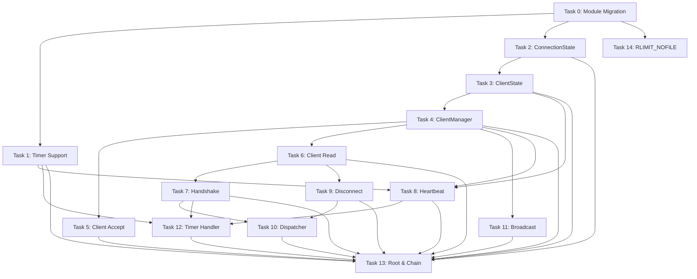

# Message Infrastructure & Connection Lifecycle Implementation Plan

**Goal:** Implement message dispatch routing, connection state machine
management, handshake flow, heartbeat, disconnect/error handling, and
multi-client broadcast infrastructure in `server/`.

**Architecture:** The daemon's `server/` module gains a `ClientManager` that
owns a fixed-size array of `ClientState` slots. Each `ClientState` wraps a
`server.ConnectionState` (which owns a `transport.SocketConnection`) plus
daemon-specific fields. A `MessageDispatcher` chain handler receives decoded
protocol messages from `ClientRead` and routes them by message type and
connection state. Handshake is driven by per-client `EVFILT_TIMER` stages;
heartbeat uses a single shared timer. All new components plug into the existing
`Handler` chain in `EventLoop`.

**Tech Stack:** Zig, libitshell3-protocol (wire format, message types),
libitshell3-transport (SocketConnection, Listener), kqueue/epoll via
`os/interfaces.zig`

**Spec references:**

- server-client-protocols/v1.0-r12 — `01-protocol-overview.md`,
  `02-handshake-capability-negotiation.md`, `06-flow-control-and-auxiliary.md`
- daemon-architecture/v1.0-r8 — `01-module-structure.md`,
  `02-state-and-types.md`, `03-integration-boundaries.md`
- daemon-behavior/v1.0-r8 — `01-daemon-lifecycle.md`, `02-event-handling.md`
- daemon-behavior/v1.0-r8/impl-constraints — `daemon-lifecycle.md`,
  `policies.md`

---

## Prerequisites — Module Migration

**CRITICAL:** Before starting any task, the following module migration must be
completed. The v2 modules were prototyped during Plan 6 Step 1 and contain the
correct implementations. Many Plan 1-5 implementations in `libitshell3-protocol`
were found to have significant spec divergences and are replaced by the v2 code.

### Step 0a: Replace libitshell3-protocol with protocol-v2

1. Delete `modules/libitshell3-protocol/`
2. Rename `modules/libitshell3-protocol-v2/` → `modules/libitshell3-protocol/`
3. Update `build.zig.zon` module name: `libitshell3_protocol_v2` →
   `libitshell3_protocol`
4. Update `build.zig` module name: `itshell3-protocol-v2` → `itshell3-protocol`
5. Update all `@import("itshell3_protocol")` references in libitshell3

### Step 0b: Rename libitshell3-transport-v2

1. Rename `modules/libitshell3-transport-v2/` → `modules/libitshell3-transport/`
2. Update `build.zig.zon` module name: `libitshell3_transport_v2` →
   `libitshell3_transport`
3. Update `build.zig` module name: `itshell3-transport-v2` →
   `itshell3-transport`
4. Add `libitshell3-transport` as a dependency in `libitshell3/build.zig`

### Step 0c: Wire transport dependency into libitshell3

1. `libitshell3/build.zig` — add `libitshell3-transport` as a dependency
2. Replace existing `itshell3_protocol` transport/connection imports with
   `itshell3_transport` imports throughout `server/`
3. Existing code that uses the old `ClientEntry`, `UnixTransport`, or
   `protocol.connection.Connection` must be rewritten against the new types:
   - `transport.SocketConnection` (fd + recv/send/sendv/close with result
     unions)
   - `server.ConnectionState` (new, wraps SocketConnection + state machine +
     caps + sequence — implemented in this plan)
   - `server.ClientState` (new, wraps ConnectionState + daemon-specific fields —
     implemented in this plan)

### Step 0d: Verify build

- `mise run test:macos` must pass for all modules
- Existing 468 tests in libitshell3 must still pass (some may need import
  updates)

**Gate:** All modules build and existing tests pass before proceeding to Task 1.

---

## Scope

**In scope:**

1. Module migration (Steps 0a-0d above)
2. ClientManager — fixed-size client slot array, client_id assignment,
   add/remove lifecycle
3. ConnectionState — server-side connection state machine wrapping
   SocketConnection (state + client_id + caps + session_id + sequence)
4. ClientState — wraps ConnectionState + daemon-specific fields (ring_cursors,
   display_info, message_reader, attached_session pointer, heartbeat/timer)
5. ClientRead upgrade — recv via SocketConnection, feed to MessageReader,
   decode, validate state, dispatch
6. MessageDispatcher — chain handler that routes decoded messages by `msg_type`
7. Handshake flow — receive ClientHello, UID verification (in
   `Listener.accept()`), capability + render capability negotiation, send
   ServerHello, timeout management
8. Handshake timeout — EVFILT_TIMER (5s handshake, 60s READY idle)
9. Socket tuning — SO_SNDBUF/SO_RCVBUF 256 KiB in `Listener.accept()`,
   RLIMIT_NOFILE advisory check
10. Heartbeat — 30s interval shared timer, 90s timeout per client, bidirectional
    (server sends + responds to client Heartbeat), ping_id tracking
11. Disconnect message — graceful send/receive with reason codes, DISCONNECTING
    state drain
12. Error message — structured ErrorResponse for protocol violations
13. Per-client sequence number tracking — server-side send_seq monotonic counter
    (wraps at 0xFFFFFFFF -> 1)
14. Multi-client broadcast infrastructure — iterate OPERATING clients for
    notification delivery via direct queue (priority 1 channel)
15. Event priority enforcement — SIGNAL > TIMER > READ > WRITE ordering

**Out of scope:**

- Session attach/detach message handling (Plan 7)
- FrameUpdate delivery / ring buffer writes (already implemented)
- IME message handling (already implemented)
- Pane management messages (Plan 7+)
- Flow control messages beyond heartbeat (Plan 8)
- Shutdown sequence orchestration (Plan 12)
- SSH transport (Plan 11)
- ClientDisplayInfo handling (Plan 8)
- Socket path resolution proper implementation (Plan 12, ADR 00054)

## Important Design Decisions from Prototyping

The following decisions were made during the transport-v2 prototyping session
and override earlier plan assumptions:

1. **No vtable on Transport.** `SocketConnection` is a plain struct with direct
   syscall wrappers returning result unions (`RecvResult`/`SendResult`). No
   polymorphic `Transport` interface. Tests use real socketpairs.

2. **ConnectionState is daemon-side, not protocol-library.** The protocol
   library (`libitshell3-protocol`) provides wire format only. Connection state
   machine (handshaking/ready/operating/disconnecting), sequence tracking,
   capability negotiation — all implemented in `server/connection/` within
   `libitshell3`.

3. **ClientState wraps ConnectionState.** No field duplication with
   `protocol.connection.Connection` (which is deleted). The layered ownership:
   ```
   transport.SocketConnection    — fd + recv/send/sendv/close
       ↑
   server.ConnectionState        — SocketConnection + state + client_id + caps + session_id + seq
       ↑
   server.ClientState            — ConnectionState + ring_cursors + display_info + message_reader + ...
   ```

4. **Handshake is server-only.** No shared handshake logic between server and
   client. Server handshake handler is written fresh in
   `server/connection/handshake_handler.zig`, not ported from
   `protocol.handshake_io`. Client handshake is Plan 14 scope.

5. **Stale socket detection does not auto-unlink.** Returns error to caller.
   Client is responsible for unlink per daemon-behavior lifecycle spec.

6. **CTRs filed:** `03-impl-transport-connection-rename.md` (rename
   `transport.Connection` to `transport.SocketConnection` in spec),
   `04-impl-remove-sendv-result.md` (remove duplicate `SendvResult`).

## File Structure

| File                                              | Action | Responsibility                                                             |
| ------------------------------------------------- | ------ | -------------------------------------------------------------------------- |
| `modules/libitshell3-protocol/`                   | Delete | Replaced by protocol-v2                                                    |
| `modules/libitshell3-protocol-v2/`                | Rename | → `modules/libitshell3-protocol/`                                          |
| `modules/libitshell3-transport-v2/`               | Rename | → `modules/libitshell3-transport/`                                         |
| `src/server/connection/connection_state.zig`      | Create | Server-side connection state machine wrapping SocketConnection             |
| `src/server/connection/client_state.zig`          | Create | Per-client struct: ConnectionState + daemon-specific fields                |
| `src/server/connection/client_manager.zig`        | Create | Fixed-size client slot array, client_id assignment, add/remove, iteration  |
| `src/server/connection/handshake_handler.zig`     | Create | Server-side handshake: fresh implementation against spec                   |
| `src/server/connection/heartbeat_manager.zig`     | Create | Shared 30s timer, per-client tracking, 90s timeout, bidirectional          |
| `src/server/connection/disconnect_handler.zig`    | Create | Graceful disconnect, DISCONNECTING drain, connection teardown              |
| `src/server/connection/broadcast.zig`             | Create | Multi-client notification delivery, session-scoped and global              |
| `src/server/handlers/client_read.zig`             | Create | Chain handler: SocketConnection.recv → MessageReader → validate → dispatch |
| `src/server/handlers/message_dispatcher.zig`      | Create | Route decoded messages by msg_type                                         |
| `src/server/handlers/timer_handler.zig`           | Create | Chain handler for EVFILT_TIMER: handshake timeout, heartbeat tick          |
| `src/server/delivery/client_state.zig`            | Remove | Old non-spec `ClientEntry`                                                 |
| `src/server/delivery/client_read.zig`             | Remove | Old stub                                                                   |
| `src/server/handlers/client_accept.zig`           | Modify | Wire to ClientManager, use Listener.accept() for UID + tuning              |
| `src/server/os/interfaces.zig`                    | Modify | Add timer registration/cancellation to EventLoopOps                        |
| `src/server/os/resource_limits.zig`               | Create | RLIMIT_NOFILE advisory check                                               |
| `src/server/root.zig`                             | Modify | Add connection namespace, update handlers/delivery                         |
| `src/testing/mocks/mock_os.zig`                   | Modify | Add timer mock support                                                     |
| `src/testing/spec/client_manager_spec_test.zig`   | Create | Spec compliance tests for ClientManager                                    |
| `src/testing/spec/handshake_spec_test.zig`        | Create | Spec compliance tests for handshake flow                                   |
| `src/testing/spec/heartbeat_spec_test.zig`        | Create | Spec compliance tests for heartbeat                                        |
| `src/testing/spec/message_dispatch_spec_test.zig` | Create | Spec compliance tests for message routing                                  |
| `src/testing/spec/broadcast_spec_test.zig`        | Create | Spec compliance tests for broadcast                                        |

## Tasks

### Task 0: Module Migration

**Files:** All modules (see Steps 0a-0d in Prerequisites above)

**Depends on:** None

**Verification:**

- `libitshell3-protocol` is the v2 code (wire format only, 102 tests)
- `libitshell3-transport` is the v2 code (SocketConnection + Listener + connect,
  19 tests)
- Old `protocol.connection.Connection` and `protocol.handshake_io` are gone
- `libitshell3` builds with new dependencies
- `mise run test:macos` passes for all modules

---

### Task 1: Timer Support in EventLoopOps

**Files:** `src/server/os/interfaces.zig` (modify), `src/server/os/kqueue.zig`
(modify), `src/server/os/epoll.zig` (modify), `src/testing/mocks/mock_os.zig`
(modify)

**Depends on:** Task 0

**Verification:**

- EventLoopOps has timer registration and cancellation
- Timer events surface through PriorityEventBuffer with `Filter.timer` priority
- MockEventLoopOps supports timer event injection for tests
- Existing event_loop tests still pass

---

### Task 2: ConnectionState

**Files:** `src/server/connection/connection_state.zig` (create)

**Spec:** daemon-architecture `03-integration-boundaries.md` — connection
lifecycle; protocol `01-protocol-overview.md` — state machine, sequence numbers

**Depends on:** Task 0

**Verification:**

- Wraps `transport.SocketConnection` + connection state enum + client_id +
  negotiated_caps + render_caps + attached_session_id + send_seq + recv_seq_last
- State enum: handshaking, ready, operating, disconnecting
- State transitions enforce protocol rules (including HANDSHAKING→DISCONNECTING
  for error/timeout)
- Message type validation per connection state
- Send sequence counter starts at 1, wraps at 0xFFFFFFFF → 1

---

### Task 3: ClientState

**Files:** `src/server/connection/client_state.zig` (create),
`src/server/delivery/client_state.zig` (remove)

**Spec:** daemon-architecture `03-integration-boundaries.md` — ClientState
struct

**Depends on:** Task 2

**Verification:**

- Old `delivery/client_state.zig` (non-spec `ClientEntry`) is deleted
- Wraps `ConnectionState` + daemon-specific fields: attached_session
  (`?*SessionEntry`), ring_cursors, display_info, message_reader,
  heartbeat/timer tracking
- No field duplication with ConnectionState

---

### Task 4: ClientManager

**Files:** `src/server/connection/client_manager.zig` (create),
`src/testing/spec/client_manager_spec_test.zig` (create)

**Spec:** daemon-architecture `02-state-and-types.md` — session/client
hierarchy; daemon-behavior `02-event-handling.md` — new client connection

**Depends on:** Task 3

**Verification:**

- Manages a fixed-size collection of ClientState instances per ADR 00052
- Supports add, remove, and lookup operations for client lifecycle
- client_id is monotonically increasing, never reused within daemon lifetime
- Supports iteration over connected clients for broadcast delivery
- Returns appropriate error when connection limit is reached

---

### Task 5: Client Accept Integration

**Files:** `src/server/handlers/client_accept.zig` (modify),
`modules/libitshell3-transport/src/transport_server.zig` (modify — implement
`Listener.accept()` with UID verification, O_NONBLOCK, buffer tuning)

**Spec:** daemon-behavior `02-event-handling.md` — UID verification before
protocol exchange, socket tuning

**Depends on:** Task 4

**Verification:**

- UID verification before protocol exchange
- SO_SNDBUF and SO_RCVBUF set to 256 KiB
- Connection limit exceeded sends `ERR_RESOURCE_EXHAUSTED` before closing
- Accepted connection registered with ClientManager
- Client fd registered with kqueue for EVFILT_READ
- Handshake timeout timer (5s) armed for new client

---

### Task 6: Client Read Handler (Message Decoding)

**Files:** `src/server/handlers/client_read.zig` (create),
`src/server/delivery/client_read.zig` (remove)

**Spec:** protocol `01-protocol-overview.md` — 16-byte header, message framing

**Depends on:** Task 3, Task 4

**Verification:**

- Chain handler matches client read events
- Uses `SocketConnection.recv()` and handles `RecvResult` variants (bytes_read,
  would_block, peer_closed)
- Feeds bytes to protocol `MessageReader`, extracts complete messages
- Validates message type against connection state
- Peer close triggers client disconnect cleanup
- Old stub `delivery/client_read.zig` is removed

---

### Task 7: Handshake Handler

**Files:** `src/server/connection/handshake_handler.zig` (create),
`src/testing/spec/handshake_spec_test.zig` (create)

**Spec:** protocol `02-handshake-capability-negotiation.md` — ClientHello/
ServerHello fields, negotiation algorithm

**Depends on:** Task 6

**Verification:**

- Receives decoded ClientHello
- Protocol version validated; mismatch sends Error(ERR_VERSION_MISMATCH) and
  transitions to DISCONNECTING
- General capabilities negotiated as intersection
- Render capabilities validated; missing cell_data AND vt_fallback sends
  Error(ERR_CAPABILITY_REQUIRED)
- ServerHello contains all fields per spec
- Connection state transitions from HANDSHAKING to READY
- Handshake timeout cancelled on success
- 60s READY idle timeout armed after ServerHello; Plan 7 cancels it on
  AttachSession
- 5s handshake timeout expiry sends Error and disconnects

---

### Task 8: Heartbeat Manager

**Files:** `src/server/connection/heartbeat_manager.zig` (create),
`src/testing/spec/heartbeat_spec_test.zig` (create)

**Spec:** protocol `01-protocol-overview.md` — 30s interval, 90s timeout,
bidirectional

**Depends on:** Task 1, Task 3, Task 4

**Verification:**

- Shared timer fires every 30 seconds
- On timer: for each READY/OPERATING client without recent activity, send
  Heartbeat with monotonic ping_id
- Incoming HeartbeatAck confirms liveness
- 90s with no message of any kind → disconnect
- HeartbeatAck does NOT reset stale timeout
- Incoming Heartbeat from client responded with HeartbeatAck echoing ping_id
- ping_id is a monotonic counter

---

### Task 9: Disconnect Handler

**Files:** `src/server/connection/disconnect_handler.zig` (create)

**Spec:** protocol `02-handshake-capability-negotiation.md` — Disconnect
payload; daemon-behavior `02-event-handling.md` — client disconnect cleanup

**Depends on:** Task 6, Task 4

**Verification:**

- Sending Disconnect: serializes with reason, transitions to DISCONNECTING,
  schedules drain
- Receiving Disconnect: transitions to DISCONNECTING, initiates teardown
- DISCONNECTING state: only Disconnect and Error accepted
- Teardown: closes fd, removes from kqueue, removes from ClientManager
- Reasons: "normal", "error", "timeout", "version_mismatch", "auth_failed",
  "server_shutdown", "stale_client", "replaced"
- Client disconnect does NOT affect session lifecycle

---

### Task 10: Message Dispatcher

**Files:** `src/server/handlers/message_dispatcher.zig` (create),
`src/testing/spec/message_dispatch_spec_test.zig` (create)

**Spec:** daemon-architecture `01-module-structure.md` — server/ component
responsibilities; protocol `01-protocol-overview.md` — message type ranges

**Depends on:** Task 6, Task 7, Task 9

**Verification:**

- Routes decoded messages by msg_type range to appropriate handlers
- Handshake range: routed to handshake, heartbeat, disconnect, error handlers
- Unhandled types (session, input, render, IME) produce stub response or forward
  to next chain handler for future plans
- Invalid message for current state returns ErrorResponse with ERR_INVALID_STATE

---

### Task 11: Multi-Client Broadcast

**Files:** `src/server/connection/broadcast.zig` (create),
`src/testing/spec/broadcast_spec_test.zig` (create)

**Spec:** daemon-behavior `02-event-handling.md` — response-before-notification
invariant; daemon-architecture `02-state-and-types.md` — two-channel write
priority

**Depends on:** Task 4

**Verification:**

- Session-scoped broadcast to all OPERATING clients attached to a session
- Global broadcast to all OPERATING clients
- Exclude-one variant for response-before-notification pattern
- Messages via direct queue (priority 1) before ring buffer frames (priority 2)
- Best-effort per client (individual enqueue failure doesn't stop broadcast)

---

### Task 12: Timer Handler Chain Link

**Files:** `src/server/handlers/timer_handler.zig` (create)

**Spec:** daemon-behavior `02-event-handling.md` — EVFILT_TIMER priority

**Depends on:** Task 1, Task 7, Task 8

**Verification:**

- Chain handler matches timer events
- Dispatches to handshake timeout, READY idle timeout (60s), or heartbeat tick
- Non-matching timer events forwarded to next handler
- Timer events processed before READ events

---

### Task 13: Root Module & Handler Chain Assembly

**Files:** `src/server/root.zig` (modify), `src/testing/root.zig` (modify)

**Spec:** daemon-architecture `01-module-structure.md` — server/ module
decomposition

**Depends on:** Tasks 1-12

**Verification:**

- `server/root.zig` exports `connection` namespace with: connection_state,
  client_state, client_manager, handshake_handler, heartbeat_manager,
  disconnect_handler, broadcast
- `server/root.zig` exports updated `handlers` namespace with: client_read,
  message_dispatcher, timer_handler
- All new source files discoverable by `zig build test`
- All existing tests continue to pass

---

### Task 14: RLIMIT_NOFILE Advisory Check

**Files:** `src/server/os/resource_limits.zig` (create)

**Spec:** daemon-behavior impl-constraints `daemon-lifecycle.md` — kqueue
creation and resource setup

**Depends on:** None

**Verification:**

- Reads `RLIMIT_NOFILE` soft limit at startup
- If soft limit < required minimum, logs a warning (does not fail)
- If soft limit can be raised (soft < hard), raises soft limit to hard limit
- Pure utility function, usable by daemon binary startup sequence

## Dependency Graph



## Summary

| Task               | Files                                              | Key Spec Reference                  |
| ------------------ | -------------------------------------------------- | ----------------------------------- |
| 0. Migration       | All modules                                        | —                                   |
| 1. Timer Support   | `os/interfaces.zig`, kqueue, epoll, mock           | daemon-behavior event handling      |
| 2. ConnectionState | `connection/connection_state.zig`                  | integration boundaries, protocol §5 |
| 3. ClientState     | `connection/client_state.zig`                      | integration boundaries §6.2         |
| 4. ClientManager   | `connection/client_manager.zig`                    | daemon-behavior §5                  |
| 5. Client Accept   | `handlers/client_accept.zig`, transport_server.zig | daemon-behavior §5                  |
| 6. Client Read     | `handlers/client_read.zig`                         | protocol §3, integration §1.2-1.3   |
| 7. Handshake       | `connection/handshake_handler.zig`                 | protocol §2-7                       |
| 8. Heartbeat       | `connection/heartbeat_manager.zig`                 | protocol §5.4, policies §3.3        |
| 9. Disconnect      | `connection/disconnect_handler.zig`                | protocol §10.1, daemon-behavior §6  |
| 10. Dispatcher     | `handlers/message_dispatcher.zig`                  | daemon-behavior §9, protocol §4     |
| 11. Broadcast      | `connection/broadcast.zig`                         | daemon-behavior §1.1-1.2            |
| 12. Timer Handler  | `handlers/timer_handler.zig`                       | daemon-behavior §9                  |
| 13. Root & Chain   | `server/root.zig`, `testing/root.zig`              | daemon-arch §1.2                    |
| 14. RLIMIT_NOFILE  | `os/resource_limits.zig`                           | impl-constraints daemon-lifecycle   |
