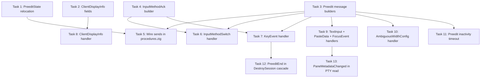

# Input Pipeline & Preedit Wire Messages Implementation Plan

**Goal:** Connect the input wire protocol (KeyEvent, TextInput, PasteData,
FocusEvent) to the existing IME pipeline and enable preedit lifecycle
broadcasting (PreeditStart/Update/End/Sync, InputMethodAck) to multi-client
sessions. Also populate ClientDisplayInfo, implement AmbiguousWidthConfig
pass-through, and add the preedit inactivity timeout.

**Architecture:** Modification plan — all infrastructure exists from Plans
1-7.5+16. The input dispatcher and IME dispatcher are stubs ready for wiring.
IME procedures have business logic implemented with wire sends stubbed as
TODO(Plan 8). Broadcast infrastructure, protocol envelope, wire decomposition,
key routing, and IME consumer are all in place.

**Tech Stack:** Zig (build.zig modules: itshell3\_core, itshell3\_server,
itshell3\_input, itshell3\_protocol)

**Spec references:**

- protocol `04-input-and-renderstate.md` — KeyEvent (0x0200), TextInput
  (0x0201), PasteData (0x0205), FocusEvent (0x0206), input method identifiers,
  modifier bitflags, HID keycodes
- protocol `05-cjk-preedit-protocol.md` — PreeditStart (0x0400), PreeditUpdate
  (0x0401), PreeditEnd (0x0402), PreeditSync (0x0403), InputMethodSwitch
  (0x0404), InputMethodAck (0x0405), AmbiguousWidthConfig (0x0406), IMEError
  (0x04FF), preedit lifecycle, multi-client conflict resolution, race conditions
- protocol `06-flow-control-and-auxiliary.md` — ClientDisplayInfo (0x0505),
  ClientDisplayInfoAck (0x0506)
- daemon-behavior `02-event-handling.md` — IME event handling procedures (§8),
  preedit ownership transfer (§8.1), focus change (§8.2), inter-session switch
  (§8.3), input method switch (§8.4), mouse click (§8.5), alternate screen
  switch (§8.6), client eviction (§8.7), inactivity timeout (§8.8), rapid
  keystroke burst coalescing (§8.9), error recovery (§8.10), input processing
  priority (§9)
- daemon-behavior `03-policies-and-procedures.md` — input processing priority
  5-tier table (§6), preedit ownership (§7), preedit lifecycle on state changes
  (§8), inactivity timeout 30s (§7.5), AmbiguousWidthConfig pass-through (§2.9)
- daemon-architecture `03-integration-boundaries.md` — Phase 0/1/2 key routing
  pipeline (§6.2), wire-to-KeyEvent decomposition (§6.2), ImeResult consumption
  (§6.6)

---

## Scope

**In scope:**

1. KeyEvent handler — parse wire JSON, decompose to KeyEvent, route through
   Phase 0/1/2 (IME), consume ImeResult, broadcast preedit messages
2. TextInput handler — parse wire JSON, write directly to PTY (bypass IME)
3. PasteData handler — parse wire JSON, assemble chunks, write to PTY with
   optional bracketed paste wrapping
4. FocusEvent handler — parse wire JSON, write focus report escape sequence to
   PTY
5. InputMethodSwitch handler (0x0404) — parse wire JSON, delegate to
   `onInputMethodSwitch` procedure, broadcast InputMethodAck
6. Preedit message builders — PreeditStart, PreeditUpdate, PreeditEnd,
   PreeditSync, InputMethodAck JSON payload construction + envelope wrapping
7. Wire sends in `procedures.zig` — replace all TODO(Plan 8) stubs with actual
   broadcast calls using preedit message builders
8. ClientDisplayInfo handler (0x0505) — parse fields, populate
   ClientState.ClientDisplayInfo, send ClientDisplayInfoAck
9. AmbiguousWidthConfig handler (0x0406) — parse fields, pass through to
   terminal instance(s) per scope
10. Preedit inactivity timeout (30s) — timer-based commit of stale compositions
11. PreeditEnd in DestroySession cascade — wire PreeditEnd before
    DestroySessionResponse
12. PaneMetadataChanged broadcast after PTY read — title/cwd extraction hook
13. PreeditState relocation — move from `core/preedit_state.zig` into
    `core/session.zig`

**Out of scope:**

- Daemon shortcut keybinding system (key\_router.zig Phase 0 step 2) — design
  not done
- Mouse handlers (MouseButton 0x0202, MouseMove 0x0203, MouseScroll 0x0204) —
  deferred to Plan 17+
- Frame export pipeline (FlatCell -> CellData -> ring) — Plan 9
- Adaptive coalescing tiers — Plan 9
- Health escalation / flow control — Plan 9
- Pane exit cascade, session destroy cascade — Plan 10

---

## Dependency Graph



---

## File Structure

| File                                                   | Module      | Action | Task(s)  |
| ------------------------------------------------------ | ----------- | ------ | -------- |
| `src/core/preedit_state.zig`                           | libitshell3 | Delete | 1        |
| `src/core/session.zig`                                 | libitshell3 | Modify | 1        |
| `src/core/root.zig`                                    | libitshell3 | Modify | 1        |
| `src/server/connection/client_state.zig`               | libitshell3 | Modify | 2        |
| `src/server/handlers/preedit_message_builder.zig`      | libitshell3 | Create | 3        |
| `src/server/handlers/input_method_message_builder.zig` | libitshell3 | Create | 4        |
| `src/server/ime/procedures.zig`                        | libitshell3 | Modify | 5        |
| `src/server/handlers/ime_dispatcher.zig`               | libitshell3 | Modify | 6, 10    |
| `src/server/handlers/input_dispatcher.zig`             | libitshell3 | Modify | 7, 9     |
| `src/server/handlers/flow_control_dispatcher.zig`      | libitshell3 | Modify | 8        |
| `src/server/ime/inactivity_timer.zig`                  | libitshell3 | Create | 11       |
| `src/server/handlers/session_handler.zig`              | libitshell3 | Modify | 12       |
| `src/server/handlers/pty_read.zig`                     | libitshell3 | Modify | 13       |
| `src/server/handlers/notification_builder.zig`         | libitshell3 | Modify | 13       |
| `src/input/key_router.zig`                             | libitshell3 | Modify | 7        |
| `src/server/root.zig`                                  | libitshell3 | Modify | 3, 4, 11 |
| `src/testing/mocks/` (existing mock files)             | libitshell3 | Modify | 5, 7     |

---

## Tasks

### Task 1: PreeditState relocation into core/session.zig

**Files:** `modules/libitshell3/src/core/preedit_state.zig` (delete),
`modules/libitshell3/src/core/session.zig` (modify),
`modules/libitshell3/src/core/root.zig` (modify)

**Spec:** daemon-architecture `02-state-and-types.md` (PreeditState as
session-level type, `<<core/session.zig>>` annotation).

**Depends on:** None

**Verification:**

- `PreeditState` struct and its methods are defined inside `session.zig`
- `preedit_state.zig` is deleted
- All existing references compile (grep for `preedit_state` in imports)
- `root.zig` re-export updated (remove `preedit_state` if exported separately)
- All existing PreeditState tests preserved and passing in `session.zig`
- Module compiles: `(cd modules/libitshell3 && zig build test --summary all)`

---

### Task 2: ClientDisplayInfo struct fields

**Files:** `modules/libitshell3/src/server/connection/client_state.zig` (modify)

**Spec:** protocol `06-flow-control-and-auxiliary.md` — ClientDisplayInfo
(0x0505) payload fields: `display_refresh_hz`, `power_state`,
`preferred_max_fps`, `transport_type`, `estimated_rtt_ms`, `bandwidth_hint`.

**Depends on:** None

**Verification:**

- `ClientDisplayInfo` struct has all six fields from protocol spec with
  appropriate types
- Default values match protocol spec defaults (60 Hz, "ac", 0, "local", 0,
  "local")
- Existing tests updated to reflect non-empty struct
- Module compiles

---

### Task 3: Preedit message builders

**Files:** `modules/libitshell3/src/server/handlers/preedit_message_builder.zig`
(create), `modules/libitshell3/src/server/root.zig` (modify)

**Spec:** protocol `05-cjk-preedit-protocol.md` — PreeditStart (0x0400, §2.1),
PreeditUpdate (0x0401, §2.2), PreeditEnd (0x0402, §2.3), PreeditSync (0x0403,
§2.4). JSON payload schemas from spec.

**Depends on:** None

**Verification:**

- `buildPreeditStart(pane_id, client_id, active_input_method, preedit_session_id, sequence, buffer)`
  produces envelope-wrapped JSON matching spec §2.1
- `buildPreeditUpdate(pane_id, preedit_session_id, text, sequence, buffer)`
  produces envelope-wrapped JSON matching spec §2.2
- `buildPreeditEnd(pane_id, preedit_session_id, reason, committed_text, sequence, buffer)`
  produces envelope-wrapped JSON matching spec §2.3
- `buildPreeditSync(pane_id, preedit_session_id, preedit_owner, active_input_method, text, sequence, buffer)`
  produces envelope-wrapped JSON matching spec §2.4
- Each builder has inline tests verifying JSON field presence and correctness
- Follows same pattern as existing `notification_builder.zig`
- Module compiles

---

### Task 4: InputMethodAck builder

**Files:**
`modules/libitshell3/src/server/handlers/input_method_message_builder.zig`
(create), `modules/libitshell3/src/server/root.zig` (modify)

**Spec:** protocol `05-cjk-preedit-protocol.md` — InputMethodAck (0x0405, §3.2).
JSON payload: `pane_id`, `active_input_method`, `previous_input_method`,
`active_keyboard_layout`.

**Depends on:** None

**Verification:**

- `buildInputMethodAck(pane_id, active_input_method, previous_input_method, active_keyboard_layout, sequence, buffer)`
  produces envelope-wrapped JSON matching spec §3.2
- Inline tests verify JSON field presence and correctness
- Module compiles

---

### Task 5: Wire sends in procedures.zig

**Files:** `modules/libitshell3/src/server/ime/procedures.zig` (modify)

**Spec:** daemon-behavior `02-event-handling.md` — all IME event handling
procedures (§8.1-§8.10); protocol `05-cjk-preedit-protocol.md` — message
ordering requirements (PreeditEnd before PreeditStart, PreeditEnd before
InputMethodAck, PreeditEnd before LayoutChanged).

**Depends on:** Task 1, Task 3

**Verification:**

- `ownershipTransfer` sends PreeditEnd via broadcast to session with correct
  reason and preedit\_session\_id
- `onFocusChange` sends PreeditEnd(reason="focus\_changed") before LayoutChanged
- `onPaneClose` sends PreeditEnd(reason="pane\_closed")
- `onInputMethodSwitch` sends PreeditEnd then InputMethodAck (both commit and
  cancel paths)
- `errorRecovery` sends PreeditEnd(reason="cancelled")
- All procedure functions now accept broadcast context parameters (client
  manager reference, session\_id) to enable wire sends
- Procedure function signatures extended to accept broadcast-capable parameters
- Existing unit tests updated for new signatures; new tests verify broadcast
  call ordering
- Module compiles

---

### Task 6: InputMethodSwitch handler (ime\_dispatcher)

**Files:** `modules/libitshell3/src/server/handlers/ime_dispatcher.zig` (modify)

**Spec:** protocol `05-cjk-preedit-protocol.md` — InputMethodSwitch (0x0404,
§3.1): parse `pane_id`, `input_method`, `keyboard_layout`, `commit_current`.
Server behavior: resolve session from pane\_id, delegate to
`onInputMethodSwitch`. daemon-behavior `02-event-handling.md` §8.4 ordering.

**Depends on:** Task 3, Task 4

**Verification:**

- `dispatch` handles `.input_method_switch` message type
- Parses JSON payload fields per protocol spec §3.1
- Resolves session from `pane_id` via session manager
- Validates pane exists, returns IMEError (0x04FF) with error\_code 0x0002 if
  not
- Validates input method is supported, returns IMEError error\_code 0x0001 if
  not
- Delegates to `procedures.onInputMethodSwitch` with parsed parameters
- Readonly client check: rejects with ERR\_ACCESS\_DENIED per protocol spec §1.1
- Inline tests cover: valid switch, unknown input method, non-existent pane
- Module compiles

---

### Task 7: KeyEvent handler (input\_dispatcher)

**Files:** `modules/libitshell3/src/server/handlers/input_dispatcher.zig`
(modify), `modules/libitshell3/src/input/key_router.zig` (modify — doc comment
only, Phase 0 step 2 stays TODO)

**Spec:** protocol `04-input-and-renderstate.md` — KeyEvent (0x0200, §2.1):
parse `keycode`, `action`, `modifiers`, `input_method`, `pane_id`.
daemon-architecture `03-integration-boundaries.md` §6.2 (Phase 0/1/2 pipeline).
daemon-behavior `03-policies-and-procedures.md` §2.8 (pane\_id routing). §7
(preedit ownership).

**Depends on:** Task 3

**Verification:**

- `dispatch` handles `.key_event` message type
- Parses JSON payload: `keycode` (u16), `action` (u8), `modifiers` (u8),
  `input_method` (string), `pane_id` (u32, optional/0 = focused pane)
- Calls `wire_decompose.decomposeWireEvent` to convert wire fields to internal
  `KeyEvent`
- Routes through `key_router.routeKeyEvent` (Phase 0 + Phase 1)
- Consumes `RouteResult` via Phase 2:
  - `.consumed`: call `consumeImeResult`, broadcast InputMethodAck if toggle
  - `.bypassed`: encode via ghostty `key_encode`, write to PTY
  - `.processed`: call `consumeImeResult`, broadcast PreeditStart/Update/End as
    appropriate based on preedit state transitions
- Preedit ownership transfer: if a different client sends a composing key, calls
  `ownershipTransfer` first per spec §7.2
- Updates `latest_client_id` on session per spec §2.2
- Records client activity via `recordActivity()`
- Inline tests cover: direct passthrough, Korean composition producing preedit,
  toggle key, bypass key, ownership transfer between clients
- Module compiles

---

### Task 8: ClientDisplayInfo handler (flow\_control\_dispatcher)

**Files:** `modules/libitshell3/src/server/handlers/flow_control_dispatcher.zig`
(modify), `modules/libitshell3/src/server/connection/client_state.zig` (modify —
if Task 2 not done via same file)

**Spec:** protocol `06-flow-control-and-auxiliary.md` — ClientDisplayInfo
(0x0505): parse all six fields. Send ClientDisplayInfoAck (0x0506) with
`status: 0` and `effective_max_fps`.

**Depends on:** Task 2

**Verification:**

- `dispatch` handles `.client_display_info` message type
- Parses JSON payload, populates `client.display_info` fields
- Sends ClientDisplayInfoAck (0x0506) response to the requesting client
- Records client activity via `recordActivity()`
- Stale timeout resets per spec §3.3
- Inline tests: valid payload populates fields, ack message sent
- Module compiles

---

### Task 9: TextInput, PasteData, and FocusEvent handlers

**Files:** `modules/libitshell3/src/server/handlers/input_dispatcher.zig`
(modify)

**Spec:** protocol `04-input-and-renderstate.md` — TextInput (0x0201, §2.2),
PasteData (0x0205, §2.6), FocusEvent (0x0206, §2.7).

**Depends on:** Task 3

**Verification:**

- **TextInput**: Parses `pane_id` and `text`. Resolves target pane. If preedit
  is active on the target pane, commits preedit first (PreeditEnd). Writes text
  directly to PTY. Does NOT route through IME engine. Validates text length <=
  65535 bytes.
- **PasteData**: Parses `pane_id`, `bracketed_paste`, `first_chunk`,
  `final_chunk`, `data`. If preedit is active, commits preedit first. On
  `first_chunk` with `bracketed_paste=true` and terminal in bracketed paste
  mode, writes `\e[200~` prefix. Writes data to PTY. On `final_chunk` with
  bracketed paste, writes `\e[201~` suffix.
- **FocusEvent**: Parses `pane_id` and `focused`. If terminal has focus
  reporting enabled (CSI ? 1004 h), writes `\e[I` (gained) or `\e[O` (lost) to
  PTY.
- All three handlers resolve pane\_id 0 to session's focused pane
- Inline tests for each handler
- Module compiles

---

### Task 10: AmbiguousWidthConfig handler

**Files:** `modules/libitshell3/src/server/handlers/ime_dispatcher.zig` (modify)

**Spec:** protocol `05-cjk-preedit-protocol.md` §4.1 — AmbiguousWidthConfig
(0x0406): `pane_id`, `ambiguous_width` (1 or 2), `scope` (per\_pane,
per\_session, global). daemon-behavior `03-policies-and-procedures.md` §2.9 —
pass-through to Terminal instance(s).

**Depends on:** Task 3

**Verification:**

- `dispatch` handles `.ambiguous_width_config` message type
- Parses JSON payload: `pane_id`, `ambiguous_width`, `scope`
- Per `scope` field, applies to appropriate Terminal instance(s): `per_pane`
  applies to one pane, `per_session` applies to all panes in the session,
  `global` applies to all panes across all sessions
- `pane_id = 4294967295` (0xFFFFFFFF) used for global scope
- Inline tests: per\_pane, per\_session, global scope variants
- Module compiles

---

### Task 11: Preedit inactivity timeout (30s)

**Files:** `modules/libitshell3/src/server/ime/inactivity_timer.zig` (create),
`modules/libitshell3/src/server/root.zig` (modify)

**Spec:** daemon-behavior `02-event-handling.md` §8.8 — preedit inactivity
timeout: 30s with no input from preedit owner triggers commit. PreeditEnd
reason="timeout". daemon-behavior `03-policies-and-procedures.md` §7.5 —
inactivity timeout 30s.

**Depends on:** Task 3

**Verification:**

- Timeout check function: given last input timestamp and current time, returns
  whether 30s has elapsed
- On timeout trigger: calls `ownershipTransfer` (flush + commit to PTY),
  broadcasts PreeditEnd(reason="timeout")
- Timer reset function: called on every KeyEvent from preedit owner
- Timer cancel function: called when preedit ends for any reason
- Constants: `PREEDIT_INACTIVITY_TIMEOUT_MS: u32 = 30_000`
- Integration point: timer registration/firing deferred to event loop wiring
  (but the state tracking and trigger logic are testable in isolation)
- Inline tests: timeout detection, reset behavior, cancel behavior
- Module compiles

---

### Task 12: PreeditEnd in DestroySession cascade

**Files:** `modules/libitshell3/src/server/handlers/session_handler.zig`
(modify)

**Spec:** daemon-behavior `02-event-handling.md` §4 — PreeditEnd
(reason="session\_destroyed") MUST precede DestroySessionResponse. Ordering
constraints §4.1.

**Depends on:** Task 7 (procedures wired with broadcast capability from Task 5)

**Verification:**

- In `handleDestroySession`, if session has active composition, broadcasts
  PreeditEnd(reason="session\_destroyed") to all attached clients BEFORE sending
  DestroySessionResponse to the requester
- Uses `procedures.onInputMethodSwitch` or direct engine deactivate depending on
  spec path (last-pane vs explicit destroy)
- Replaces the existing `TODO(Plan 8)` comment at line 483
- Inline test: destroy session with active preedit produces PreeditEnd before
  DestroySessionResponse
- Module compiles

---

### Task 13: PaneMetadataChanged broadcast in PTY read handler

**Files:** `modules/libitshell3/src/server/handlers/pty_read.zig` (modify),
`modules/libitshell3/src/server/handlers/notification_builder.zig` (modify)

**Spec:** daemon-architecture `02-state-and-types.md` — pane metadata fields
(title, cwd). daemon-behavior `02-event-handling.md` — PaneMetadataChanged
notification. protocol `03-session-pane-management.md` §3.3 —
PaneMetadataChanged (0x0183): `pane_id`, `title`, `cwd`, `is_running`,
`exit_status`.

**Depends on:** Task 9 (input dispatcher wired for PTY write validation)

**Verification:**

- After vtStream processing, compares current title/cwd against pane's cached
  values
- If changed, updates pane's cached title/cwd fields
- Broadcasts PaneMetadataChanged to session-scoped clients with updated fields
- `notification_builder.zig` has a `buildPaneMetadataChanged` function if not
  already present (check existing builder)
- Replaces the existing `TODO(Plan 8)` comment at line 89
- Inline test: PTY read with OSC title change triggers PaneMetadataChanged
  broadcast
- Module compiles

---

## Verification

After all tasks complete:

```bash
(cd modules/libitshell3 && zig build test --summary all)
```

All existing tests continue to pass. New tests cover each task's verification
criteria. No TODO(Plan 8) comments remain in the codebase.
