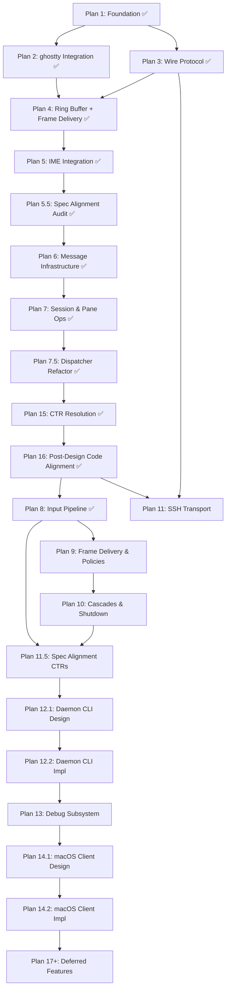

# libitshell3 Implementation Roadmap

> **For agentic workers:** This is the master index for all implementation
> plans. Start here to understand what exists, what's next, and how plans depend
> on each other. Each plan has its own file with task-level detail — this
> document is the map, not the territory.

**Goal:** Implement the full it-shell3 daemon ecosystem — from core types to
production-ready terminal multiplexer with CJK input support.

**Architecture:** Three libraries (`libitshell3`, `libitshell3-protocol`,
`libitshell3-ime`) + one daemon binary. Single-threaded kqueue/epoll event loop.
ghostty for headless VT processing. Native Zig IME engine (no OS IME
dependency). See `AGENTS.md` for full project overview.

**Tech Stack:** Zig 0.15+, vendored libghostty (v1.3.1-patch), vendored
libhangul, POSIX (kqueue/epoll, forkpty, Unix sockets).

---

## Current Status

| Module                | Source Files | Tests | Coverage (kcov) |
| --------------------- | ------------ | ----- | --------------- |
| libitshell3           | 97           | 1010  | 95.29%          |
| libitshell3-protocol  | 15           | 215   | 93.23%          |
| libitshell3-transport | 7            | 31    | 90.27%          |
| libitshell3-ime       | 11           | 142   | 98.59%          |
| daemon                | —            | —     | —               |

Coverage measured via `mise run test:coverage` (Docker + kcov on Linux).

---

## Plan Index

| #    | Name                                          | Plan File                                               | Target Module        | Status      |
| ---- | --------------------------------------------- | ------------------------------------------------------- | -------------------- | ----------- |
| 1    | Foundation                                    | `2026-03-25-libitshell3-foundation.md`                  | libitshell3          | **Done**    |
| 2    | ghostty Integration                           | `2026-03-25-libitshell3-ghostty-integration.md`         | libitshell3          | **Done**    |
| 3    | Wire Protocol                                 | `2026-03-25-libitshell3-protocol.md`                    | libitshell3-protocol | **Done**    |
| 4    | Ring Buffer + Frame Delivery                  | `2026-03-26-libitshell3-ring-buffer.md`                 | libitshell3          | **Done**    |
| 5    | IME Integration                               | `2026-03-26-libitshell3-ime-integration.md`             | libitshell3          | **Done**    |
| 5.5  | Spec Alignment Audit                          | `2026-03-27-libitshell3-spec-alignment-audit.md`        | libitshell3 + docs   | **Done**    |
| 6    | Message Infrastructure & Connection Lifecycle | `2026-03-28-libitshell3-message-infrastructure.md`      | libitshell3          | **Done**    |
| 7    | Session & Pane Operations                     | `2026-03-29-libitshell3-session-pane-operations.md`     | libitshell3          | **Done**    |
| 7.5  | Message Dispatcher Refactor                   | `2026-03-31-libitshell3-message-dispatcher-refactor.md` | libitshell3          | **Done**    |
| 8    | Input Pipeline & Preedit Wire Messages        | `2026-04-02-libitshell3-input-pipeline.md`              | libitshell3          | **Done**    |
| 9    | Frame Delivery & Runtime Policies             | (not yet written)                                       | libitshell3          | Not started |
| 10   | Cascades & Shutdown                           | (not yet written)                                       | libitshell3          | Not started |
| 11   | SSH Transport                                 | (not yet written)                                       | libitshell3-protocol | Not started |
| 11.5 | Spec Alignment CTR Resolution                 | (not yet written)                                       | multi-module + docs  | Not started |
| 12.1 | Daemon CLI — Design                           | (not yet written)                                       | daemon               | Not started |
| 12.2 | Daemon CLI — Implementation                   | (not yet written)                                       | daemon               | Not started |
| 13   | Debug Subsystem + `it-shell3-ctl`             | `specs/2026-03-26-daemon-debug-subsystem-design.md`     | daemon               | Not started |
| 14.1 | macOS Client PoC — Design                     | (not yet written)                                       | app/macos            | Not started |
| 14.2 | macOS Client PoC — Implementation             | (not yet written)                                       | app/macos            | Not started |
| 15   | Design Doc CTR Resolution                     | (not yet written)                                       | multi-module         | **Done**    |
| 16   | Post-Design Code Alignment                    | `2026-04-02-libitshell3-post-design-code-alignment.md`  | multi-module         | **Done**    |
| 17+  | Deferred Features                             | —                                                       | various              | Not started |
| S1   | Implementation Skill Redesign                 | `2026-04-04-implementation-skill-redesign.md`           | skill infrastructure | **Done**    |

---

## Dependency Graph



---

## Plan Summaries

### Plan 1: Foundation (Done)

Core types, event loop skeleton, PTY management, Unix socket listener, and basic
daemon lifecycle. Produced a minimal daemon that starts, creates a session,
accepts a client connection, and shuts down cleanly.

**Key deliverables:**

- `core/`: types, split tree, pane (two-phase exit), session, session manager,
  pane navigation (geometric edge-adjacency)
- `os/`: vtable interfaces for PTY, kqueue/epoll, socket, signals + real impls
  - mock impls for deterministic testing
- `server/`: event loop (two-level dispatch), listener, client state machine,
  signal handlers, handler stubs
- `daemon/src/main.zig`: thin ~100-line orchestrator per ADR 00048

**Key decisions:** ADR 00052 (static SessionManager allocation), OS vtable
interfaces from day one, named sub-modules (`itshell3_core`, `itshell3_os`).

### Plan 2: ghostty Integration (Done)

Integrated vendored ghostty headless VT engine. Helper functions (not wrapper
types per spec §1.2) for Terminal lifecycle, RenderState snapshots, key/mouse
encoding, cell data export, and preedit overlay.

**Key deliverables:**

- `ghostty/`: terminal.zig, render_state.zig, render_export.zig (FlatCell 16B
  - bulkExport), key_encoder.zig (256-entry HID-to-Key comptime table),
    preedit_overlay.zig (CJK wide char support)
- ghostty pinned to v1.3.1-patch with `-Dversion-string` bypass
- Persistent vtStream for split escape sequence handling

**Known gaps:** Mouse encoder not available in ghostty lib_vt.zig — must be
daemon-authored. Review note filed at
`daemon-architecture/.../review-notes/mouse-encode-api-gap.md`.

### Plan 3: Wire Protocol (Done)

Protocol message types, binary framing, JSON payloads, handshake orchestration,
transport layer, connection state machine.

**Key deliverables:**

- 16-byte fixed header (magic 0x4954 + version + flags + type + length + seq)
- All message types: handshake, session, pane, input, preedit, auxiliary
- CellData/RowHeader/FrameUpdate binary encoding for RenderState frames
- Frame reader/writer with sequence tracking
- Connection state machine (HANDSHAKING→READY→OPERATING→DISCONNECTING)
- UID authentication (getpeereid/SO_PEERCRED)
- Socket path resolution (XDG + TMPDIR + platform defaults)

### Plan 4: Ring Buffer + Frame Delivery (Done)

Zero-copy iovec-based frame delivery pipeline. Per-pane ring buffer with
monotonic byte cursors, writev delivery from ring memory, two-channel socket
write priority (direct queue + ring), dirty tracking integration.

**Key deliverables:**

- `ring_buffer.zig` — circular byte ring, `pendingIovecs()` returns slices into
  ring memory, `advanceCursor(n)` byte-granular per spec §5.4
- `frame_serializer.zig` — DirtyRow[] → wire bytes → ring
- `direct_queue.zig` — per-client priority-1 control message FIFO (lazy heap)
- `client_writer.zig` — two-channel writev delivery per spec §4.4/§5.4
- `pane_delivery.zig` — per-pane ring buffer lifecycle (page_allocator)
- 58 spec-citing tests (28 integration + 30 compliance)

**Key decisions:** ADR 00055 (ring cursor lag formula with pre-computed
thresholds), ADR 00056 (FrameEntry is prose not a type), ADR 00057 (I-frame
timer resets on any I-frame)

**Known gaps (resolved):** `last_i_frame` update semantics (client tracks its
own via wire-level frame_sequence), FlatCell/CellData field order divergence
(spec says identical, code differs — flagged for spec revision)

### Plan 5: IME Integration (Done)

**Scope:** Wire libitshell3-ime (v0.7.0, already implemented) into the daemon
event loop. Per-session IME engine lifecycle (create/destroy), preedit routing
to focused pane, ownership transfer on client disconnect/focus change, all 8
ime-procedures from impl-constraints.

**Design spec refs:**

- `daemon-architecture/.../03-integration-boundaries.md` §5
- `daemon-architecture/.../impl-constraints/ime-responsibility-matrix.md`
- `daemon-behavior/.../impl-constraints/ime-procedures.md`
- `libitshell3-ime/` interface contract + behavior docs

**Depends on:** Plan 4 (ring buffer — preedit overlay applied to exported frames
before ring insertion)

### Plan 5.5: Spec Alignment Audit (Done)

**Scope:** Systematic audit and fix of Plan 1-5 technical debt. Plans 1-2 were
implemented before the verification chain (Steps 5-8) existed, resulting in
accumulated spec violations discovered during Plan 5. This plan closes the gap
between the design spec and the existing implementation.

**Known gaps (from Plan 5 Spec Gap Log + Owner Review):**

- `ClientEntry` → `ClientState`: Spec defines 8-field `ClientState` (client_id,
  conn, state, attached_session, capabilities, ring_cursors, display_info,
  message_reader). Code has 4-field `ClientEntry` (unix_transport, conn,
  socket_fd, writer) — 3 of which are not in spec. Full type redesign needed.
- `ClientEntry` location: defined inline in `event_loop.zig`, causing cyclic
  references with handlers. Extract to `server/client_state.zig`.
- `handlers/signal.zig`: thin re-export wrapper around `signal_handler.zig`.
  Remove or justify.
- `PtyOps` was missing `write` until Plan 5 fixed it. Audit remaining OS
  interfaces for completeness.
- Test directory restructuring: apply `docs/conventions/zig-testing.md` (mocks/,
  spec/ subdirectories) to all existing code.
- Named import migration: ensure all cross-module imports use named imports per
  `modules/libitshell3/AGENTS.md`.
- Full spec-vs-code audit of Plan 1-4 types, field names, and interfaces against
  daemon-architecture v1.0-r8 and daemon-behavior v1.0-r8.

**Design spec refs:** ALL current spec documents for implemented modules:

- `daemon-architecture/draft/v1.0-r8/` — all 3 docs + impl-constraints
- `daemon-behavior/draft/v1.0-r8/` — all 3 docs + impl-constraints
- `libitshell3-ime/interface-contract/draft/v1.0-r10/` — all docs
- `libitshell3-ime/behavior/draft/v1.0-r2/` — all docs
- `server-client-protocols/draft/v1.0-r12/` — all 6 docs

The first step of this plan is a **full audit** covering two dimensions:

1. **Spec-vs-code**: Systematically walk every type, field, function, and module
   boundary in every spec document and verify the corresponding code matches.
2. **Convention compliance**: Check all existing Zig code against
   `docs/conventions/zig-coding.md`, `docs/conventions/zig-naming.md`,
   `docs/conventions/zig-documentation.md`, and
   `docs/conventions/zig-testing.md`. This includes integer width rules (public
   symbols, locals, loop counters, derived constants), field naming (`_length`
   not `_len`), doc comment format (no spec section numbers), test organization
   (inline vs spec, mock placement), and buffer constant patterns (`MAX_*` per
   ADR 00058).

The known gaps above are starting points, not an exhaustive list.

**Depends on:** Plan 5 (IME Integration — establishes verification chain and
conventions that this plan applies retroactively)

**Note:** This plan has no new features. It is purely structural — aligning
existing code with existing spec. All changes must pass the same verification
chain (Steps 5-8) as feature plans.

### Plan 6: Message Infrastructure & Connection Lifecycle (Not Started)

**Scope:** Message dispatch router, connection state machine implementation
(HANDSHAKING→READY→OPERATING→DISCONNECTING), handshake flow (ClientHello /
ServerHello, capability negotiation), handshake timeouts (4 stages), UID
verification, socket tuning (SO_SNDBUF/SO_RCVBUF, RLIMIT_NOFILE), heartbeat (30s
interval / 90s timeout), Disconnect/Error messages, event priority ordering
(SIGNAL > TIMER > READ > WRITE), per-client sequence numbers, multi-client
broadcast infrastructure.

**Design spec refs:**

- `server-client-protocols/.../02-handshake.md`
- `server-client-protocols/.../01-protocol-overview.md` (connection lifecycle)
- `daemon-behavior/.../02-event-handling.md` (event priority)

**Depends on:** Plan 5.5 (ClientState type must be finalized before building
connection lifecycle on top of it)

### Plan 7: Session & Pane Operations (Done)

**Scope:** Session CRUD (Create / List / Attach / Detach / Destroy / Rename /
AttachOrCreate), Pane CRUD (Split / Close / Focus / Navigate / Resize / Equalize
/ Zoom / Swap / LayoutGet), session attachment tracking, pane metadata
extraction (title via OSC 0/2, CWD via OSC 7), basic always-sent notifications
(LayoutChanged, SessionListChanged, PaneMetadataChanged, ClientAttached /
ClientDetached).

**Key deliverables:**

- Protocol envelope utility for 16-byte header wrapping on all outbound messages
  (fixes Plan 6 raw-JSON TODO)
- ADR 00020 compliance: remove invalid OPERATING→OPERATING transition TODO
- Pane metadata detection via ghostty vtStream() processing (title/cwd changes)
- 7 session request handlers (Create, List, Attach, Detach, Destroy, Rename,
  AttachOrCreate) in `server/handlers/session_handler.zig`
- 10 pane request handlers (Create, Split, Close, Focus, Navigate, Resize,
  Equalize, Zoom, Swap, LayoutGet) in `server/handlers/pane_handler.zig`
- 5 always-sent notification builders (LayoutChanged, SessionListChanged,
  PaneMetadataChanged, ClientAttached, ClientDetached)
- Split tree operations: equalizeRatios, swapLeaves, computeLeafDimensions
- SessionEntry enhancements: PaneId wire lookup, zoom state tracking
- Pane struct: foreground_process/foreground_pid fields (stubbed)
- Session: real creation_timestamp, setName mutation

**Design spec refs:**

- `daemon-architecture/.../01-module-structure.md` (module decomposition, pane
  placement)
- `daemon-architecture/.../02-state-and-types.md` (state tree, pane metadata)
- `daemon-architecture/.../impl-constraints/state-and-types.md` (type defs)
- `daemon-behavior/.../02-event-handling.md` (response-before-notification,
  session rename, client state changes)
- `daemon-behavior/.../03-policies-and-procedures.md` (notification defaults,
  client state transitions)
- `server-client-protocols/.../03-session-pane-management.md` (all message
  definitions, layout tree wire format, notifications)

**Note (from Plan 5.5 audit):** `Session.creation_timestamp` is hardcoded to 0.
`core/` cannot call OS time functions; the server layer must pass a real
timestamp when creating sessions. TODO comment in `session.zig`.

**Note (from Plan 5.5 audit):** Add Pane fields `foreground_process`,
`foreground_pid`, `silence_subscriptions`, `silence_deadline` per spec
`state-and-types.md`. TODO comments in `pane.zig`.

**Note (from Plan 7 triage):** ADR 00020 prohibits OPERATING→OPERATING
transition. `AttachSessionRequest` while attached returns
`ERR_SESSION_ALREADY_ATTACHED`. Client must detach first. CTR filed against
daemon-behavior spec (line 804 contradicts ADR). The `TODO(Plan 7)` in
`connection_state.zig` should be removed, not implemented.

**Note (from Plan 6):** ServerHello, HeartbeatAck, and Heartbeat messages are
enqueued as raw JSON without the 16-byte protocol header. All messages must
carry the header per protocol spec Section 3. TODO comments in
`message_dispatcher.zig` and `timer_handler.zig`.

**Depends on:** Plan 6 (message dispatch + connection lifecycle required to
route session/pane requests and send notifications)

### Plan 7.5: Message Dispatcher Refactor (Done)

**Scope:** Refactor `message_dispatcher.zig` from a single monolithic switch
into category-based sub-dispatchers matching the protocol message type ranges.

**Key deliverables:**

- Top-level dispatcher: `@intFromEnum(msg_type) >> 8` switch to 6 category
  dispatchers
- `server/handlers/lifecycle_dispatcher.zig` — handshake, heartbeat, disconnect,
  error (0x00xx)
- `server/handlers/session_pane_dispatcher.zig` — second-level split via
  `raw & 0xC0`: session (0x0100-0x013F), pane (0x0140-0x017F), notification
  (0x0180-0x019F)
- Stub dispatchers for input (0x02xx), render (0x03xx), ime (0x04xx),
  flow_control (0x05xx) — ready for Plan 8/9
- JSON parsing moves from top-level dispatcher into category dispatcher
- No behavioral change — pure structural refactor

**ADR:** ADR 00064 (Category-Based Message Dispatcher)

**Design spec refs:** protocol 01-protocol-overview (message type ranges)

**Depends on:** Plan 7 (all session/pane handlers must be implemented before
restructuring their dispatch)

### Plan 8: Input Pipeline & Preedit Wire Messages (Done)

**Scope:** KeyEvent handler (wire → IME → PTY), TextInput handler (bypass IME),
PasteData handler, FocusEvent handler, preedit broadcasting (PreeditStart /
PreeditUpdate / PreeditEnd / PreeditSync, InputMethodAck), AmbiguousWidthConfig,
preedit inactivity timeout (30s), input processing priority (5-tier).

**Note (from Plan 6):** `ClientState.display_info` is a dummy
`ClientDisplayInfo` struct. Populate fields from the `ClientDisplayInfo` message
(0x0505) when implementing the message handler. TODO comment in
`client_state.zig`.

**Note (from Plan 5.5 audit):** Wire message sending for IME procedures
(PreeditEnd, PreeditStart, InputMethodAck, LayoutChanged) — code has TODO(Plan
8) in `ime_procedures.zig`.

**Note (from Plan 5):** Implement daemon shortcut keybinding system. The key
routing hook point exists in `key_router.zig` — add a shortcut binding parameter
when keybinding design is done. TODO comment in `key_router.zig`.

**Note (from Plan 7 triage):** Move `PreeditState` from `core/preedit_state.zig`
into `core/session.zig` per spec annotation `<<core/session.zig>>`. TODO(Plan 8)
comment added in `preedit_state.zig`.

**Depends on:** Plan 7 (input must target a focused pane in an attached session)

### Plan 9: Frame Delivery & Runtime Policies (Not Started)

**Scope:** Frame export pipeline (FlatCell → CellData → ring), adaptive
coalescing (4-tier model with hysteresis), per-client cursor tracking,
EVFILT_WRITE delivery management, JSON metadata blob, health escalation timeline
(T=0 → T=300s eviction), flow control (PausePane / ContinuePane), resize
debounce (250ms per pane, 5s hysteresis), I-frame scheduling timer.

**ADRs to apply:**

- ADR 00055: Ring cursor lag formula — pre-computed byte thresholds for smooth
  degradation (50%/75%/90%).
- ADR 00056: FrameEntry is prose, not a code type. Introduce
  `server/frame_builder.zig` for FlatCell → CellData conversion.
- ADR 00057: I-frame timer resets on any I-frame production.

**Design spec refs:**

- `daemon-behavior/.../03-policies-and-procedures.md`
- `daemon-behavior/.../impl-constraints/policies.md`

**Note (from Plan 7.5):** WindowResize (0x0190) dispatch is stubbed as no-op in
`session_pane_dispatcher.zig`. This plan must implement the WindowResize handler
in the notification/window sub-dispatcher. TODO(Plan 9) inline comment marks the
location.

**Depends on:** Plan 8 (coalescing tiers respond to input activity) + Plan 5.5
(spec alignment for frame types)

### Plan 10: Cascades & Shutdown (Not Started)

**Scope:** Atomic multi-step cascades within a single event loop iteration:

- Pane exit 12-step cascade (frame flush → metadata → IME cleanup → PTY close →
  Terminal.deinit → tree compact → new focus → layout notify)
- Session destroy 4-phase cascade (IME deactivate → resource cleanup → protocol
  notifications → free state)
- Client disconnect cascade
- Graceful shutdown 6-step sequence
- "No sessions remain" shutdown trigger
- Notification subscription cleanup

**Design spec refs:**

- `daemon-behavior/.../02-event-handling.md` §3-4
- `daemon-behavior/.../impl-constraints/pane-exit-cascade.md`
- `daemon-behavior/.../impl-constraints/session-destroy-cascade.md`

**Depends on:** Plan 9 (health/flow state cleanup in cascade, frame flush before
pane exit)

### Plan 11: SSH Transport (Not Started)

**Scope:** libssh2-based SSH client transport for libitshell3-protocol.
Implements the same `Transport` vtable as `UnixTransport` so the protocol stack
is transport-agnostic.

Key components:

- `SshTransport` — Transport vtable impl over libssh2 channel
- SSH session management (connect, authenticate, channel open)
- `direct-streamlocal@openssh.com` channel forwarding to daemon's Unix socket
- SSH channel multiplexing (one TCP connection, multiple sessions)
- Remote daemon auto-start via SSH exec (`fork+exec` without LaunchAgent)

**Design spec refs:**

- `server-client-protocols/.../01-protocol-overview.md` §2.2 (SSH Tunneling)
- `server-client-protocols/.../06-flow-control-and-auxiliary.md` §7.2 (Heartbeat
  over SSH)
- ADR 00010 (SSH tunneling over custom TCP/TLS)

**Depends on:** Plan 5.5 + Plan 3 (Transport vtable). Can run in parallel with
Plans 6-10 (SSH is client-side transport only).

### Plan 11.5: Spec Alignment CTR Resolution (Not Started)

**Scope:** Apply accumulated CTRs from Plan 8 verification to
daemon-architecture spec. Documentation-only plan — no source code changes
(except code rename SC-9: `routeKeyEvent` → `handleKeyEvent`).

**Known CTRs to resolve:**

- SC-1: Dispatcher directory path `server/dispatch/` → `server/handlers/`
- SC-2: Dispatcher filenames (suffix convention + lifecycle/flow_control
  renames)
- SC-5: SplitNodeData annotation `core/split_node.zig` → `core/split_tree.zig`
- SC-6: KeyEvent annotation — reflect re-export from libitshell3-ime
- SC-7: Pane `foreground_process` — dedicated constant + separate name/path
  fields
- SC-10: Remove `handleIntraSessionFocusChange`/`handleInputMethodSwitch` from
  `input/` table, document actual location in `server/ime/`

**Code change:** Rename `routeKeyEvent` → `handleKeyEvent` in
`input/key_router.zig` and all call sites (~20 locations).

**Depends on:** Plan 8 (CTRs discovered during Plan 8 verification) + Plan 10
(cascades must be done before Plan 12.1)

### Plan 12.1: Daemon CLI — Design (Not Started)

**Scope:** Design docs for the daemon binary: startup orchestration (7-step per
ADR 00048), LaunchAgent integration, version conflict handling, CLI argument
parsing, per-instance socket directory (ADR 00054), stale socket detection,
inherited fd check, default session creation, daemon shortcut keybinding system
design (Phase 0 step 2 in key routing pipeline).

**Depends on:** Plan 11.5 (spec alignment must be done before daemon CLI design)

### Plan 12.2: Daemon CLI — Implementation (Not Started)

**Scope:** Implement daemon binary from Plan 12.1 design: `main.zig`
orchestration, LaunchAgent plist, stale socket detection, inherited fd check,
default session creation, CLI argument parsing, version conflict handling.

**Depends on:** Plan 12.1 (design must be complete before implementation)

**Note:** `event_loop.zig` contains `TODO(Plan 6)` test stubs for
`addClientTransport`, `removeClient`, and `findClientByFd` that must be replaced
with proper Client Manager integration tests. The signal/listener fd
registration and chain assembly in production belong to this plan.

### Plan 13: Debug Subsystem + `it-shell3-ctl` (Not Started)

**Scope:** Unix socket debug interface for logging, inspection, and control of
the daemon. Tag-based JSONL logging to file, state inspection (dump-sessions,
dump-screen), input injection (inject-key, inject-mouse), and a CLI tool
(`it-shell3-ctl`) for socket discovery and command dispatch.

Key components:

- `daemon/src/debug/` — listener, command parser, inspector, controller, log
  emitter, format helpers
- `it-shell3-ctl` — thin CLI client with `-w`/`--workspace` for multi-instance
- Per-instance socket directory (ADR 00054)

**Design spec:**
`docs/superpowers/specs/2026-03-26-daemon-debug-subsystem-design.md`

**ADRs:** ADR 00053 (daemon-embedded debug subsystem), ADR 00054 (per-instance
socket directory)

**Depends on:** Plan 12.2 (daemon binary must exist to embed the debug
subsystem)

### Plan 14.1: macOS Client PoC — Design (Not Started)

**Scope:** Design docs for a minimal macOS client: Swift/AppKit + libghostty
Metal GPU rendering, Unix socket connection to daemon, frame rendering from
FrameUpdate messages, basic key input forwarding. Proof-of-concept to validate
the daemon-client architecture end-to-end.

**Depends on:** Plan 13 (debug subsystem enables testing/debugging the client
connection)

### Plan 14.2: macOS Client PoC — Implementation (Not Started)

**Scope:** Implement the minimal macOS client from Plan 14.1 design. End-to-end
validation: connect to daemon, receive frames, render via Metal, forward
keyboard input.

**Depends on:** Plan 14.1 (design must be complete before implementation)

### Plan 15: Design Doc CTR Resolution (Done)

**Scope:** Apply all open CTRs to their target design docs via
design-doc-revision cycles. Documentation-only plan — no source code changes.

**Known CTRs to resolve:**

- daemon-architecture v1.0-r8:
  - `01-daemon-per-instance-socket-directory.md` (ADR 00054)
  - `02-daemon-fixed-size-session-fields.md` (ADR 00052, 00058)
  - `03-impl-transport-connection-rename.md`
  - `04-impl-remove-sendv-result.md`
  - `05-impl-message-reader-tiered-buffer.md`
  - `06-impl-fixed-point-split-ratio.md`
- daemon-behavior v1.0-r8:
  - `01-impl-static-allocation-connection-limit.md` (ADR 00052)
  - `02-impl-operating-to-operating-transition.md`
  - `03-impl-fixed-point-resize-handling.md`
- server-client-protocols v1.0-r12:
  - `01-daemon-per-instance-socket-directory.md` (ADR 00054)
  - `02-daemon-field-length-validation.md` (ADR 00058)
  - `03-impl-max-tree-depth-correction.md` (MAX_TREE_DEPTH 16→4)
  - `04-impl-preedit-session-id-per-session.md` (per-pane→per-session)
  - `05-impl-capslock-numlock-wire-preservation.md` (ADR 00059)
  - `06-impl-fixed-point-resize-ratio.md`
- libitshell3-ime interface-contract v1.0-r10:
  - `01-impl-capslock-numlock-modifiers.md` (ADR 00059)
- app (inbox) — **deferred to Plan 14.1**:
  - `01-protocol-client-rendering-pipeline-from-v1.0.md`

**Depends on:** Plan 7.5 (all current message handlers must be implemented
before resolving CTRs that affect message definitions)

### Plan 16: Post-Design Code Alignment (Done)

**Scope:** Code changes blocked on spec updates. Requires design docs to be
updated first (Plan 15) before code can be modified.

**Confirmed work items (post-research audit):**

- **ADR 00015** (u64 sequence / 20-byte header): `header.zig` HEADER_SIZE 16→20,
  VERSION 1→2, sequence u32→u64 across all handlers, dispatchers, connection
  state, protocol envelope, notification builders, frame serializer, tests
  (~100+ locations across libitshell3-protocol and libitshell3)
- **ADR 00062** (fixed-point resize ratio): `split_tree.zig` ratio f32→u32,
  `pane_handler.zig` resize handler, `session_pane_dispatcher.zig` wire parsing,
  `notification_builder.zig` JSON serialization, `equalizeRatios` 0.5→5000
- **RN-01/ADR 00003** (AttachOrCreate merge): delete message types
  0x010C/0x010D, add optional fields to AttachSessionRequest (session_name,
  create_if_missing, shell, cwd), add action_taken to AttachSessionResponse,
  merge handler logic, update dispatcher routing, rewrite tests
- **ADR 00059** (CapsLock/NumLock in KeyEvent): update `core/ime_engine.zig`
  Modifiers (add caps_lock, num_lock, change padding u5→u3),
  `input/wire_decompose.zig` (preserve bits 4-5), fix tests

**Already aligned (no work needed):**

- **ADR 00052** (MAX_CLIENTS=64): code matches v1.0-r9 spec
- **ADR 00054** (per-instance socket directory): deferred to Plan 12
- **ADR 00058** (inline buffers): fully compliant
- **ADR 00060** (Connection→SocketConnection rename): already applied
- **ADR 00061** (MessageReader tiered buffer): already implemented
- **CTR-04** (SendvResult removal): already done
- **ADR 00063** (text zoom as WindowResize): no code change needed

**Depends on:** Plan 15 (specs must be updated before code follows)

### Plan 17+: Deferred Features

> **Note:** Detailed ordering within Plan 17+ is TBD.

Features deferred beyond the initial implementation scope:

- Clipboard (OSC 52)
- Mouse (encode + handlers)
- Scroll/Search
- Extension negotiation
- Opt-in notification subscriptions (Subscribe/Unsubscribe)
- Silence detection timer
- Readonly client enforcement (AttachSessionRequest `readonly` field, prohibited
  message list, ERR_ACCESS_DENIED response — protocol spec Section 8)

### Plan S1: Implementation Skill Redesign (Done)

**Scope:** Restructure the `/implementation` skill to use fork-based step
isolation for Steps 6-9. Extract heavy context-consuming steps into
`context: fork` skills that return structured JSON results. Add a master
transition table to SKILL.md. Extract target resolution into a direct skill.
Remove per-step State Update/Next sections from all non-fork step files.

**Key deliverables:**

- Master transition table in SKILL.md (replaces per-step routing)
- 4 isolated fork skills: `/impl-execute` (Step 6), `/impl-simplify` (Step 7),
  `/impl-review` (Step 8), `/impl-fix` (Step 9)
- 1 direct skill: `/impl-resolve-target` (target resolution)
- Updated delegation rules (fork structurally enforces Steps 6-9; explicit rules
  remain for Steps 10-11)
- Non-fork step files simplified (State Update/Next removed, verification
  commands in Gate)

**Design spec:**
`docs/superpowers/specs/2026-04-03-implementation-skill-redesign.md`

**Depends on:** None (skill infrastructure — independent of module
implementation plans)

---

## Test & Coverage Commands

```bash
mise run test:macos                # macOS Debug tests (all modules)
mise run test:macos:release-safe   # macOS ReleaseSafe tests
mise run test:linux                # Linux Docker tests
mise run test:linux:release-safe   # Linux Docker ReleaseSafe tests
mise run test:coverage             # kcov in Docker (HTML report at coverage/merged/index.html)
mise run build:docker:zig-kcov     # Build the kcov Docker image
```

libitshell3 kcov workarounds: `-Dghostty-simd=false` (skip C++ simd) +
`-Doptimize=ReleaseSafe` (smaller DWARF for kcov parsing).
