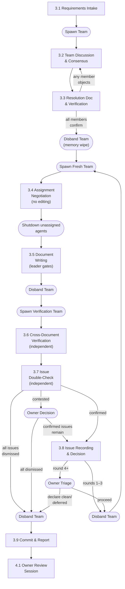
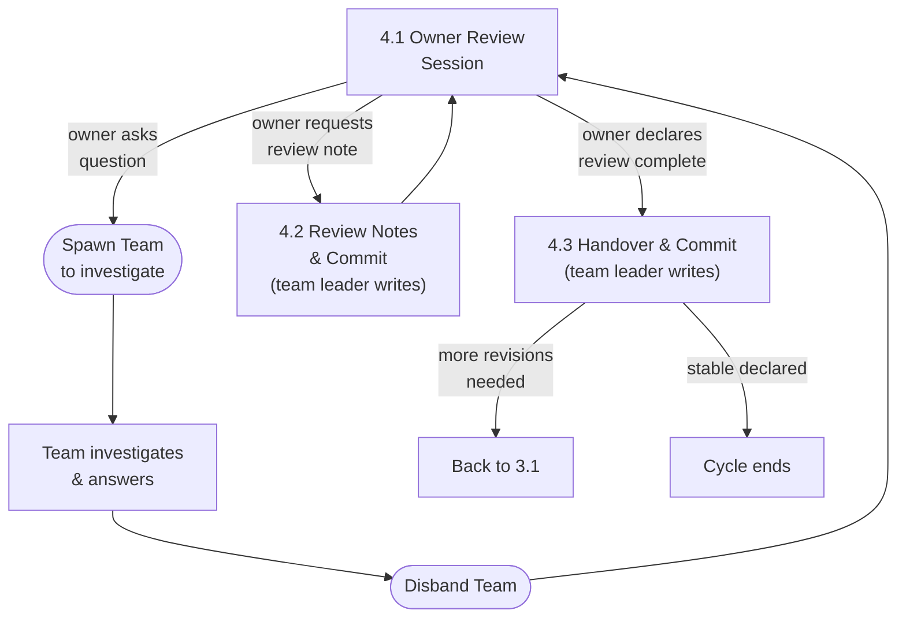

# Design Workflow

## 1. Overview

Design documents evolve through alternating **Revision** and **Review** cycles.
A Revision cycle produces or updates documents; a Review cycle evaluates them and
decides what happens next. These two cycles repeat until the owner declares the
documents stable.

This document defines the steps in each cycle. For team structure, role
definitions, and communication rules, see
[Team Collaboration](./02-team-collaboration.md).

---

## 2. Document Lifecycle

### State Machine


Full example of version progression:

```
[No Document] ---(requirements)---> [Revision] ---(commit draft/v1.0-r1)---> [Review]
[Review] ---(review notes)---> [Revision] ---(commit draft/v1.0-r2)---> [Review]
[Review] ---(review notes)---> [Revision] ---(commit draft/v1.0-r3)---> [Review]
[Review] ---(owner declares stable)---> [v1.0 STABLE]
[v1.0 STABLE] ---(minor requirements)---> [Revision] ---(commit draft/v1.1-r1)---> [Review]
[Review] ---(review notes)---> [Revision] ---(commit draft/v1.1-r2)---> [Review]
[Review] ---(owner declares stable)---> [v1.1 STABLE]
[v1.1 STABLE] ---(major requirements)---> [Revision] ---(commit draft/v2.0-r1)---> [Review]
[Review] ---(owner declares stable)---> [v2.0 STABLE]
```

### States

| State | Description |
|-------|-------------|
| **No Document** | Entry point. No existing design documents for this topic. |
| **Revision Cycle** | The team produces or updates documents based on requirements, review notes, and handover input. Ends with a commit. |
| **Review Cycle** | The owner evaluates committed documents, asks questions, and produces review notes. Ends when the owner declares the review complete. |
| **vX.Y Stable** | The owner has declared the current version stable. No further changes until new requirements arrive. |

### Transitions

- **`draft/vX.Y-rN`** versions are draft iterations toward stable `vX.Y`. Each
  revision/review loop produces the next `draft/vX.Y-r(N+1)` until the owner
  is satisfied.
- When the owner declares a version stable, the team leader creates `vX.Y/`
  containing only the final spec documents (no process artifacts). The draft
  directories remain as historical record.
- New requirements on a stable `vX.Y` start a new `draft/vX.(Y+1)-r1` (minor
  change) or `draft/v(X+1).0-r1` (major change) cycle. The owner decides which
  at requirements intake. The same revision/review process applies.
- There is no distinction between "initial draft" and "subsequent revision" --
  every version follows the same Revision Cycle steps (Section 3).

---

## 3. Revision Cycle

### Flowchart



### 3.1 Requirements Intake

The team leader receives requirements from the owner and assembles the team.

**Inputs** (any combination):

| Input | Source |
|-------|--------|
| New requirements | Owner provides directly |
| Review notes | From the previous Review Cycle (Section 4.2) |
| Handover document | From the previous Review Cycle (Section 4.3) |
| PoC findings | From a PoC experiment (see [PoC Workflow](./04-poc-workflow.md)) |
| Cross-team requests | From other teams' `draft/vX.Y-rN/cross-team-requests/` (active draft) or `{team}/inbox/cross-team-requests/` (idle team, filenames include `-from-v{X.Y}` suffix) (see [Cross-Team Requests](../conventions/artifacts/documents/07-cross-team-requests.md)) |
| Handover (stable) | From `{team}/inbox/handover/handover-for-vX.Y.md` if the previous cycle declared stable |
| Extra notes / constraints | Owner provides as additional context |

**Outputs:**

| Output | Location |
|--------|----------|
| `TODO.md` | `draft/vX.Y-rN/TODO.md` — Tracks all phases and tasks for this revision cycle. See [TODO Convention](../conventions/artifacts/documents/09-todo.md). |

**Steps:**

1. Team leader creates `TODO.md` in the new draft version directory, breaking
   down the revision cycle into phases with checkboxes for each task.
2. **Context check:** Before spawning, ask the owner via `AskUserQuestion` if
   the remaining context window is **25% or below**: _"Context window is X%
   remaining. Run `/compact` before spawning? (yes / no)"_ If yes, wait for
   the owner to run `/compact` and confirm before proceeding. (`/compact` is a
   user-only command — the team leader cannot execute it.)
3. Team leader assembles the team by spawning **ALL** core members listed in
   the team's agent directory (opus). The team leader does NOT choose a
   subset. See [Team Collaboration](./02-team-collaboration.md) for team
   structure and role definitions.
4. Team leader passes all input materials to the team.

### 3.2 Team Discussion & Consensus

The team analyzes problems, proposes solutions, debates trade-offs, and reaches
consensus.

**Rules:**

- Team members communicate **peer-to-peer**, not through the team leader. The
  team leader is a facilitator, not a message proxy. See
  [Team Collaboration](./02-team-collaboration.md) Section 5 for communication
  rules.
- The team leader reports progress, status, and opinion summaries to the owner.
- The owner may provide additional instructions during this phase; the team
  leader relays them to the team.
- Prior art research feeds into the discussion. See
  [Team Collaboration](./02-team-collaboration.md) Section 5.3 for the research
  workflow.
- PoC results feed into the discussion. See [PoC Workflow](./04-poc-workflow.md)
  for how PoC findings are structured as review input.
- **ALL disputes are resolved by unanimous consensus.** There is no majority
  vote. Team members must logically persuade each other. If a genuine deadlock
  occurs, the team leader escalates to the owner for a binding decision.
- The team leader **MUST NOT** judge whether discussion has converged or prompt
  the consensus reporter to deliver their report. The 3.2 → 3.3 transition is
  triggered **solely** by the consensus reporter's unprompted delivery. Until
  that report arrives, the team leader waits.

### 3.3 Resolution Document & Verification

When the consensus reporter delivers their report, the team produces a
resolution document and verifies it.

**Steps:**

1. **One representative** (a core member, NOT a spec-writer) writes
   `design-resolutions-{topic}.md`. Format follows
   [Design Resolutions](../conventions/artifacts/documents/04-design-resolutions.md).
2. If the resolution includes changes that affect another team's documents, the
   resolution MUST explicitly note which team is affected and what changes are
   needed. These will be written as cross-team requests in step 3.5.
3. **All team members verify the resolution document WITH THEIR MEMORY
   INTACT.** Do NOT shut down or respawn agents before this step. The purpose
   is that the same agents who participated in the debate verify that the
   written document accurately captures what they agreed on.
4. If **any** member objects that the resolution document does not match the
   consensus, go back to **3.2** for further discussion. The representative
   updates the same resolution file.
5. Only after **all** members confirm does the process proceed.
6. After verification is complete, the team leader shuts down **all** agents
   (clean memory wipe). This ensures the next step starts with a blank slate.

### 3.4 Assignment Negotiation

Fresh agents review the resolution document, negotiate ownership, and report
the agreed assignment to the team leader. **No editing is allowed during this
step.**

**Steps:**

1. **Context check:** Before spawning, ask the owner via `AskUserQuestion` if
   the remaining context window is **25% or below**: _"Context window is X%
   remaining. Run `/compact` before spawning? (yes / no)"_ If yes, wait for
   the owner to run `/compact` and confirm before proceeding.
2. Team leader spawns **ALL** core members of the team as **fresh** agents.
   The team leader does NOT choose a subset — every core member listed in
   the team's agent directory is spawned. These agents have no memory of the
   discussion — they work purely from the resolution document.
   **Model selection:** Use the model specified in each agent's definition
   file for Rounds 1-2. For Round 3 and beyond (fix cycles for
   mechanical/trivial corrections), use **sonnet** to reduce token cost.
3. Show them the resolution document and the previous draft version's spec
   documents (if updating an existing draft, not creating from scratch).
   If this is the first revision of a new topic, show only the resolution
   document — no previous spec docs exist yet.
   **Explicitly instruct: negotiate assignments only — do NOT edit any files
   yet.**
4. Team members negotiate among themselves who handles which document or
   section. This includes cross-team request files if the resolution identified
   changes affecting other teams.
5. When each member individually judges that negotiation is complete, they
   send a **direct message** to the team leader with their negotiation result
   (who owns which document/section). The team leader does NOT prompt or
   ask for reports — each member reports autonomously when they believe
   agreement has been reached.
6. The team leader waits until **ALL** members have reported. Once all
   reports are in, the team leader checks whether the reports are
   **identical** (same assignment mapping). This is a mechanical equality
   check only — the team leader does NOT judge correctness, fairness, or
   optimality of the assignments.
   - **If identical**: Negotiation is complete. Proceed to step 7.
   - **If not identical**: The team leader **unilaterally picks one
     mapping** and proceeds immediately. No re-negotiation rounds.
     The team leader selects the mapping with the strongest support
     (most reports aligned) or makes a judgment call if evenly split.
     This is a token-saving measure — re-negotiation rarely converges
     and wastes resources.
7. The team leader shuts down all **unassigned** agents (those with no
   editing tasks). Only agents with actual assignments remain.
8. After all unassigned agents have shut down, proceed to **3.5**.

### 3.5 Document Writing

The team leader tells the remaining assigned agents to begin writing. This
is the gate — no agent may edit files until the team leader explicitly
initiates this step.

**Steps:**

1. The team leader sends a message to each assigned agent: "Begin writing
   your assigned changes." This is the signal that editing may start.
2. Each member writes their assigned spec documents into the current draft
   version directory (`draft/vX.Y-rN/`): new files for the first revision
   (`r1`), updated files for subsequent revisions.
3. If assigned, the responsible core member writes cross-team request files
   and places them in the target team's `draft/vX.Y-rN/cross-team-requests/`
   directory. Format follows
   [Cross-Team Requests](../conventions/artifacts/documents/07-cross-team-requests.md).
4. When all writing is complete, the team leader disbands the team.

**Why the gate matters:** Without an explicit signal from the team leader,
agents race to edit files before negotiation completes — causing duplicate
edits, merge conflicts, and wasted work. The team leader is the gatekeeper
between negotiation and execution.

### 3.6 Cross-Document Consistency Verification (Phase 1)

Two fresh Phase 1 verification agents independently analyze the written
documents via Gemini and report issue lists.

**Steps:**

1. **Context check:** Before spawning, ask the owner via `AskUserQuestion` if
   the remaining context window is **25% or below**: _"Context window is X%
   remaining. Run `/compact` before spawning? (yes / no)"_ If yes, wait for
   the owner to run `/compact` and confirm before proceeding.
2. Team leader spawns **both** Phase 1 agents from
   `.claude/agents/verification/phase1/` as fresh agents:
   - `consistency-verifier` — structural integrity, cross-references, terminology
   - `semantic-verifier` — logical contradictions, behavioral inconsistencies
3. Provide both agents with: the list of all newly written document paths and
   the resolution document path. Each agent delegates document analysis to
   Gemini via the `/invoke-agent:prompt` skill per its agent definition —
   **do NOT instruct agents to read the files directly.**
   **Round 2+ only:** Also pass the Dismissed Issues Summary from all previous
   `round-{N}-issues.md` files and instruct agents to skip any finding that
   substantially overlaps with a previously dismissed issue.
4. Do NOT assign areas or direct their work — each agent covers its full domain.
5. Each agent reports its issue list to the team leader. Disband Phase 1 agents.

**Cascaded re-raise monitoring (Round 3+):** From the third verification
round onward, the team leader MUST check whether newly raised issues fall
into either of these cascading patterns:

1. **Re-raises of settled items**: Issues already fixed or dismissed in
   previous rounds. Phase 1 agents have no memory of prior round decisions
   and may repeat the same findings.
2. **Minor cascading inconsistencies from fixes**: A previous fix introduced
   a trivially mechanical new inconsistency. Continuing the loop yields
   diminishing returns.
3. **Explanatory note cascade**: A fix that adds a clarifying note (e.g.,
   enumerating which keys belong to a category) may contain an overly broad
   claim that contradicts another document. When a fix note groups multiple
   items under a single behavioral label ("all of these → path X"), verify
   each item individually against all other documents before committing.

If the team leader suspects either pattern, they MUST report to the owner
with the evidence and let the owner decide whether to proceed or declare clean.

### 3.7 Issue Double-Check (Phase 2)

Two fresh Phase 2 review agents independently evaluate the combined Phase 1
issue list via Gemini and report a confirm/dismiss verdict per issue.
**There is no peer-to-peer debate** — each agent works independently.

**Steps:**

1. Team leader collects all issues from both Phase 1 agents into a single
   combined list and spawns **both** Phase 2 agents from
   `.claude/agents/verification/phase2/` as fresh agents:
   - `issue-reviewer-fast` (sonnet) — evaluates all false alarm categories
   - `issue-reviewer-deep` (opus) — evaluates all false alarm categories independently
2. Provide both agents with: the combined Phase 1 issue list and the document
   paths. Each agent independently evaluates every issue via Gemini using the
   `/invoke-agent:prompt` skill per its agent definition —
   **do NOT instruct agents to read the files directly.**
3. Each agent reports a verdict (`confirm` / `dismiss` + one-line reason)
   for every issue. Disband Phase 2 agents.

**Outcome rules (team leader applies):**

- Issue is **confirmed** (true alarm) if **both** Phase 2 agents say `confirm`.
- Issue is **dismissed** if **both** Phase 2 agents say `dismiss`.
- Issue is **contested** if one agent says `confirm` and the other says `dismiss` →
  the team leader reports the contested issue(s) to the **owner** with both agents'
  reasons and requests a binding decision before proceeding.
- If **all issues are dismissed**: clean result. Proceed to **3.9**.
- If **confirmed or owner-resolved issues remain**: proceed to **3.8**.

### 3.8 Issue Recording & Decision

The team leader records confirmed issues and decides the next step.

**Steps:**

1. The team leader writes confirmed issues to
   `draft/vX.Y-rN/verification/round-{N}-issues.md` (where `{N}` is the
   verification round number, starting at 1). Format follows
   [Verification Issues](../conventions/artifacts/documents/08-verification-issues.md).
2. Disband the verification team.
3. Decide next step based on round number:
   - **Rounds 1–3**: Go back to **3.4** automatically. Spawn fresh agents and
     pass the issue file alongside the resolution document.
   - **Round 4 non-CLEAN**: Do NOT proceed automatically. The team leader
     reports all outstanding issues to the **owner**, requests triage (which
     issues are truly blocking vs. acceptable), and asks whether to proceed
     with round 5. The owner has two options:
     - **Proceed**: Go back to **3.4** for another fix round.
     - **Declare clean**: Treat remaining issues as acceptable. Proceed to **3.9**.
     - **Declare deferred**: Accept remaining issues as known but defer them to a
       future version. Proceed to **3.9**.
   - **Round 5+ non-CLEAN**: Every non-CLEAN round triggers another owner
     escalation. The team leader reports the new round's issues to the owner
     and requests explicit approval to continue each time. Same three options
     apply (proceed / declare clean / declare deferred).

**Key invariant:** Verification does NOT produce review notes. During the
Revision Cycle, no review-note files are created. The team leader records
verification issues as structured input for the next 3.4 round, not as
review-note files. Issues are transient — they exist only to guide the fix
team and are superseded once the fix is applied and verified clean.

### 3.9 Commit & Report

The team leader finalizes and reports.

**Steps:**

1. Team leader disbands the verification team.
2. Team leader commits the documents.
3. Team leader reports to the owner: what was produced, which draft version
   (e.g., `draft/v1.0-r3`), and a summary of key decisions.
4. **STOP. The Revision Cycle is now complete. The team leader does nothing
   further.** No review notes, no handover document, no further commits.

The Review Cycle (Section 4) begins **only when the owner opens a new session
and starts reviewing**. The team leader cannot initiate, advance, or complete
any part of the Review Cycle on their own.

---

## 4. Review Cycle

> **⚠️ OWNER-INITIATED ONLY.** The Review Cycle begins when the owner opens a
> session. The team leader MUST NOT write review notes, handover documents, or
> any Review Cycle artifact without an explicit instruction from the owner in
> that session. Every action in this section requires a preceding owner
> instruction — the team leader never acts unilaterally.

### Flowchart



### 4.1 Owner Review Session

The owner reviews the committed documents and asks questions.

**Steps:**

1. The owner opens a session and reviews the committed documents.
2. The owner asks questions. The team leader spawns team members to investigate
   and answer.
3. The team leader does **NOT** answer questions directly -- the team leader
   delegates to teammates.
4. Teammates discuss among themselves and report findings to the team leader.
5. The team leader summarizes answers to the owner.
6. The owner may ask follow-up questions (loop back to 4.1).
7. The owner may request a review note be created (proceed to 4.2).

### 4.2 Review Notes & Commit

Review notes are created **only** when the owner explicitly instructs in the
current session. The team leader MUST NOT create review notes proactively,
preemptively, or based on its own judgment of what the owner might want.

**Steps:**

1. **Only** when the owner explicitly instructs, the team leader writes a review
   note.
2. Format follows
   [Review Notes](../conventions/artifacts/documents/02-review-notes.md).
3. Location: `draft/vX.Y-rN/review-notes/{NN}-{topic}.md`
4. Each review note is committed immediately after creation.
5. After committing, return to 4.1 (the owner may continue reviewing).

**Note:** The team leader writes review notes directly. This is one of the few
things the team leader does personally rather than delegating.

### 4.3 Handover & Commit

The team leader writes a handover document **only when the owner explicitly
declares the review cycle complete**. The team leader MUST NOT write the
handover document, create the stable directory, or commit without this
explicit declaration from the owner.

**Steps:**

1. The owner explicitly declares the review cycle complete.
2. The team leader writes the handover. Filename and location depend on outcome:
   - More revisions needed: `draft/vX.Y-rN/handover/handover-to-r(N+1).md`
   - Stable declared: `{topic}/inbox/handover/handover-for-vX.Y.md` (where X.Y
     is the version just declared stable)

   When stable is declared, the next revision cycle's target version (minor
   bump `vX.(Y+1)` vs. major bump `v(X+1).0`) is determined by the owner at
   the next Requirements Intake (3.1), not at handover time.
3. Content: insights learned during the Revision Cycle (3.1-3.9) and Review
   Cycle (4.1-4.2) that the NEXT revision cycle's team should know. This
   includes design philosophy, owner priorities, new conventions, and any
   context that review notes alone do not capture.
4. Format follows
   [Handover](../conventions/artifacts/documents/03-handover.md).
5. **If stable declared only:** the team leader also creates `vX.Y/` containing
   only the final spec documents (files matching `[0-9]+-*.md`) copied from
   `draft/vX.Y-rN/`. Process artifacts are NOT copied — they remain in the
   draft directory as historical record. The handover (`handover-for-vX.Y.md`)
   is placed in `{topic}/inbox/handover/`, NOT inside `vX.Y/`.
6. Commit.

**If more revisions needed:** the next Revision Cycle starts with
`draft/vX.Y-r(N+1)/`, consuming: previous draft's spec docs + review notes +
handover as input.

**If stable declared:** the cycle ends. The next Revision Cycle (when new
requirements arrive) starts with `draft/v<next>-r1/`, consuming: `vX.Y/` spec
docs + review notes + handover from `{topic}/inbox/handover/` as input.

---

## 5. Anti-Patterns

| Anti-pattern | Why it is wrong | Correct behavior |
|---|---|---|
| Team leader writes review notes after committing, without owner instruction | Review notes record the **owner's** concerns. A team leader's self-assessment is not a review note. | STOP after 3.9. Write review notes only when the owner explicitly instructs in 4.2. |
| Team leader writes handover after committing, without owner declaring review complete | Handover summarizes what the **owner** learned during review. No review happened. | Write handover only after the owner explicitly declares the review cycle complete in 4.3. |
| Team leader commits review notes or handover in the same commit as spec docs | Conflates Revision and Review cycles, making git history unreadable. | Spec docs are committed in 3.9. Review notes and handover are committed separately in 4.2/4.3. |
| Team leader self-declares "review complete" and proceeds to next revision | Only the owner can declare a review complete. | Wait for the owner. Do not advance the cycle without an explicit owner declaration. |
| Agents edit files before assignment negotiation completes (3.4→3.5) | Fastest agent applies all fixes; others find nothing to do — duplicate edits, merge conflicts, wasted work. | Negotiation (3.4) and writing (3.5) are separated by an explicit gate. No editing until the team leader signals "begin writing." See also [02-team-collaboration.md §7](./02-team-collaboration.md#7-lessons-learned-and-anti-patterns). |
| Team leader prompts consensus reporter to deliver (3.2→3.3) | Pre-empts the reporter's autonomous judgment; may cut off a team member who had more to say. | The consensus reporter decides when consensus is reached and delivers unprompted. The team leader waits. See also [02-team-collaboration.md §7](./02-team-collaboration.md#7-lessons-learned-and-anti-patterns). |
| Team stops at resolution document and skips document writing (3.3→3.5) | Resolution document is an intermediate artifact, not the deliverable. Spec documents are never updated. | After the resolution is verified and the team is respawned (3.4), assigned agents must produce updated spec files in 3.5. See also [02-team-collaboration.md §7](./02-team-collaboration.md#7-lessons-learned-and-anti-patterns). |
| Team leader writes verification issues to `review-notes/` | Conflates verification artifacts with owner feedback. Verification issues are transient inputs for the fix team; review notes are permanent owner-requested records. | Write issues to `draft/vX.Y-rN/verification/round-{N}-issues.md` (3.8). Review notes are only created at owner instruction in 4.2. |
| Team leader leaves Phase 1 or Phase 2 agents alive after they report | Agents accumulate across verification rounds, consuming tokens and creating confusion about which agents are active. Each verification phase is a one-shot task — once reported, the agent has no further role. | Disband Phase 1 agents immediately after collecting issue lists (3.6 step 5). Disband Phase 2 agents immediately after collecting verdicts (3.7 step 3). |
| Team leader spawn prompt tells Phase 1 or Phase 2 agents to "read files" or "analyze documents directly" | Overrides the agent's defined workflow of delegating analysis to Gemini via the invoke-agent skill, defeating the token-saving architecture and causing agents to perform expensive reads themselves. | Follow 3.6 step 3 and 3.7 step 2 exactly: provide file paths only, without instructing agents to read them. Agents follow their agent-definition workflow. |
| Team leader spawns Phase 1 agents in Round 2+ without passing the Dismissed Issues Summary | Phase 1 agents have no memory of prior rounds and will re-raise already-settled findings, creating churn and wasting fix cycles. | From Round 2 onward, collect the Dismissed Issues Summary from all previous `round-{N}-issues.md` files and include it in the Phase 1 spawn prompt (3.6 step 3). |

---

## 6. Artifacts

### Artifact Matrix

| Artifact | Created During | Created By | Location | Convention |
|----------|---------------|------------|----------|------------|
| `design-resolutions-{topic}.md` | Revision 3.3 | Core member (representative) | `draft/vX.Y-rN/design-resolutions/` | [design-resolutions.md](../conventions/artifacts/documents/04-design-resolutions.md) |
| `research-{source}-{topic}.md` | Revision 3.2 | Researcher | `draft/vX.Y-rN/research/` | [research-reports.md](../conventions/artifacts/documents/05-research-reports.md) |
| Spec documents (`01-xx.md`, etc.) | Revision 3.5 | Core members | `draft/vX.Y-rN/` | -- |
| `review-notes/{NN}-{topic}.md` | Review 4.2 | Team leader | `draft/vX.Y-rN/review-notes/` | [review-notes.md](../conventions/artifacts/documents/02-review-notes.md) |
| `handover-to-r(N+1).md` | Review 4.3 | Team leader | `draft/vX.Y-rN/handover/` | [handover.md](../conventions/artifacts/documents/03-handover.md) |
| `handover-for-vX.Y.md` | Review 4.3 (stable) | Team leader | `{topic}/inbox/handover/` | [handover.md](../conventions/artifacts/documents/03-handover.md) |
| `cross-team-requests/{NN}-{topic}.md` | Revision 3.5 | Core member | Target team's `draft/vX.Y-rN/cross-team-requests/` or `{team}/inbox/` (idle) | [cross-team-requests.md](../conventions/artifacts/documents/07-cross-team-requests.md) |
| `round-{N}-issues.md` | Revision 3.8 | Team leader | `draft/vX.Y-rN/verification/` | [verification-issues.md](../conventions/artifacts/documents/08-verification-issues.md) |

### Version Directory Structure

See [Document Artifact Conventions — Directory Structure](../conventions/artifacts/documents/01-overview.md#directory-structure) for the canonical directory layout with examples.
