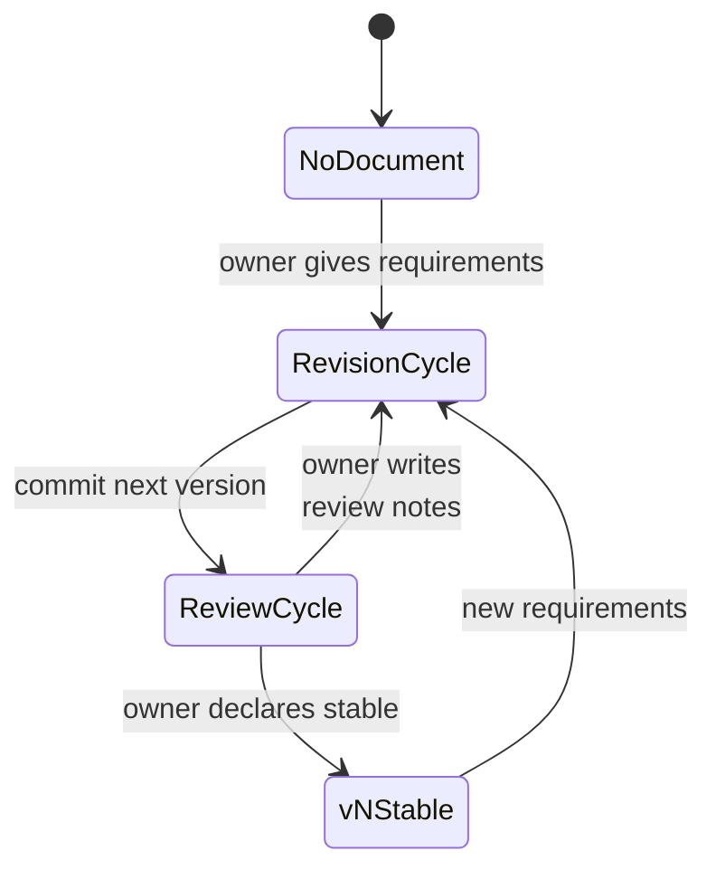
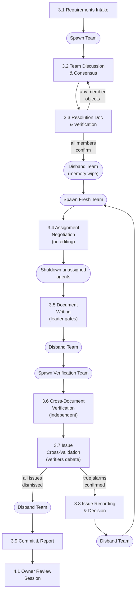
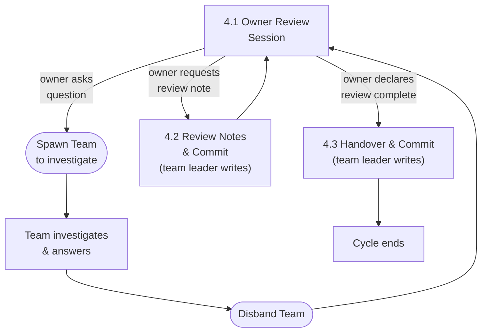

# Design Workflow

## 1. Overview

Design documents evolve through alternating **Revision** and **Review** cycles.
A Revision cycle produces or updates documents; a Review cycle evaluates them and
decides what happens next. These two cycles repeat until the owner declares the
documents stable.

This document defines the steps in each cycle. For team structure, role
definitions, and communication rules, see
[Team Collaboration](./02-team-collaboration.md).

---

## 2. Document Lifecycle

### State Machine



Full example of version progression:

```
[No Document] ---(requirements)---> [Revision] ---(commit v0.1)---> [Review]
[Review] ---(review notes)---> [Revision] ---(commit v0.2)---> [Review]
[Review] ---(review notes)---> [Revision] ---(commit v0.3)---> [Review]
[Review] ---(owner declares stable)---> [v1 STABLE]
[v1 STABLE] ---(new requirements)---> [Revision] ---(commit v1.1)---> [Review]
[Review] ---(review notes)---> [Revision] ---(commit v1.2)---> [Review]
[Review] ---(owner declares stable)---> [v2 STABLE]
```

### States

| State | Description |
|-------|-------------|
| **No Document** | Entry point. No existing design documents for this topic. |
| **Revision Cycle** | The team produces or updates documents based on requirements, review notes, and handover input. Ends with a commit. |
| **Review Cycle** | The owner evaluates committed documents, asks questions, and produces review notes. Ends when the owner declares the review complete. |
| **vN Stable** | The owner has declared the current version stable. No further changes until new requirements arrive. |

### Transitions

- **v0.x** versions are draft iterations. Each revision/review loop produces the
  next v0.x until the owner is satisfied.
- When the owner declares a version stable, it becomes **vN** (e.g., v1). The
  version number is an integer, not a decimal.
- New requirements on a stable vN start a new **v(N+1).x** draft cycle. The same
  revision/review process applies.
- There is no distinction between "initial draft" and "subsequent revision" --
  every version follows the same Revision Cycle steps (Section 3).

---

## 3. Revision Cycle

### Flowchart



### 3.1 Requirements Intake

The team leader receives requirements from the owner and assembles the team.

**Inputs** (any combination):

| Input | Source |
|-------|--------|
| New requirements | Owner provides directly |
| Review notes | From the previous Review Cycle (Section 4.2) |
| Handover document | From the previous Review Cycle (Section 4.3) |
| PoC findings | From a PoC experiment (see [PoC Workflow](./04-poc-workflow.md)) |
| Cross-team requests | From other teams' `v<X>/cross-team-requests/` directories (see [Cross-Team Requests](../conventions/artifacts/documents/07-cross-team-requests.md)) |
| Extra notes / constraints | Owner provides as additional context |

**Outputs:**

| Output | Location |
|--------|----------|
| `TODO.md` | `v<X>/TODO.md` — Tracks all phases and tasks for this revision cycle. See [TODO Convention](../conventions/artifacts/documents/09-todo.md). |

**Actions:**

1. Team leader creates `TODO.md` in the version directory, breaking down the revision cycle into phases with checkboxes for each task.
2. Team leader assembles the team by spawning **ALL** core members listed in
   the team's agent directory (opus). The team leader does NOT choose a
   subset. See [Team Collaboration](./02-team-collaboration.md) for team
   structure and role definitions.
3. Team leader passes all input materials to the team.

### 3.2 Team Discussion & Consensus

The team analyzes problems, proposes solutions, debates trade-offs, and reaches
consensus.

**Rules:**

- Team members communicate **peer-to-peer**, not through the team leader. The
  team leader is a facilitator, not a message proxy. See
  [Team Collaboration](./02-team-collaboration.md) Section 5 for communication
  rules.
- The team leader reports progress, status, and opinion summaries to the owner.
- The owner may provide additional instructions during this phase; the team
  leader relays them to the team.
- Prior art research feeds into the discussion. See
  [Team Collaboration](./02-team-collaboration.md) Section 5.3 for the research
  workflow.
- PoC results feed into the discussion. See [PoC Workflow](./04-poc-workflow.md)
  for how PoC findings are structured as review input.
- **ALL disputes are resolved by unanimous consensus.** There is no majority
  vote. Team members must logically persuade each other. If a genuine deadlock
  occurs, the team leader escalates to the owner for a binding decision.
- The team leader **MUST NOT** judge whether discussion has converged or prompt
  the consensus reporter to deliver their report. The 3.2 → 3.3 transition is
  triggered **solely** by the consensus reporter's unprompted delivery. Until
  that report arrives, the team leader waits.

### 3.3 Resolution Document & Verification

When the consensus reporter delivers their report, the team produces a
resolution document and verifies it.

**Steps:**

1. **One representative** (a core member, NOT a spec-writer) writes
   `design-resolutions-{topic}.md`. Format follows
   [Design Resolutions](../conventions/artifacts/documents/04-design-resolutions.md).
2. If the resolution includes changes that affect another team's documents, the
   resolution MUST explicitly note which team is affected and what changes are
   needed. These will be written as cross-team requests in step 3.5.
3. **All team members verify the resolution document WITH THEIR MEMORY
   INTACT.** Do NOT shut down or respawn agents before this step. The purpose
   is that the same agents who participated in the debate verify that the
   written document accurately captures what they agreed on.
4. If **any** member objects that the resolution document does not match the
   consensus, go back to **3.2** for further discussion. The representative
   updates the same resolution file.
5. Only after **all** members confirm does the process proceed.
6. After verification is complete, the team leader shuts down **all** agents
   (clean memory wipe). This ensures the next step starts with a blank slate.

### 3.4 Assignment Negotiation

Fresh agents review the resolution document, negotiate ownership, and report
the agreed assignment to the team leader. **No editing is allowed during this
step.**

**Steps:**

1. Team leader spawns **ALL** core members of the team as **fresh** agents.
   The team leader does NOT choose a subset — every core member listed in
   the team's agent directory is spawned. These agents have no memory of the
   discussion — they work purely from the resolution document.
   **Model selection:** Use the model specified in each agent's definition
   file for Rounds 1-2. For Round 3 and beyond (fix cycles for
   mechanical/trivial corrections), use **sonnet** to reduce token cost.
2. Show them the resolution document and the previous version of the spec
   documents (if updating an existing version, not creating from scratch).
   **Explicitly instruct: negotiate assignments only — do NOT edit any files
   yet.**
3. Team members negotiate among themselves who handles which document or
   section. This includes cross-team request files if the resolution identified
   changes affecting other teams.
4. When each member individually judges that negotiation is complete, they
   send a **direct message** to the team leader with their negotiation result
   (who owns which document/section). The team leader does NOT prompt or
   ask for reports — each member reports autonomously when they believe
   agreement has been reached.
5. The team leader waits until **ALL** members have reported. Once all
   reports are in, the team leader checks whether the reports are
   **identical** (same assignment mapping). This is a mechanical equality
   check only — the team leader does NOT judge correctness, fairness, or
   optimality of the assignments.
   - **If identical**: Negotiation is complete. Proceed to step 6.
   - **If not identical**: The team leader **unilaterally picks one
     mapping** and proceeds immediately. No re-negotiation rounds.
     The team leader selects the mapping with the strongest support
     (most reports aligned) or makes a judgment call if evenly split.
     This is a token-saving measure — re-negotiation rarely converges
     and wastes resources.
6. The team leader shuts down all **unassigned** agents (those with no
   editing tasks). Only agents with actual assignments remain.
7. After all unassigned agents have shut down, proceed to **3.5**.

### 3.5 Document Writing

The team leader tells the remaining assigned agents to begin writing. This
is the gate — no agent may edit files until the team leader explicitly
initiates this step.

**Steps:**

1. The team leader sends a message to each assigned agent: "Begin writing
   your assigned changes." This is the signal that editing may start.
2. Each member writes their assigned spec documents: new files for v0.1,
   updated files for v\<prev\> to v\<next\>.
3. If assigned, the responsible core member writes cross-team request files
   and places them in the target team's `v<X>/cross-team-requests/` directory.
   Format follows
   [Cross-Team Requests](../conventions/artifacts/documents/07-cross-team-requests.md).
4. When all writing is complete, the team leader disbands the team.

**Why the gate matters:** Without an explicit signal from the team leader,
agents race to edit files before negotiation completes — causing duplicate
edits, merge conflicts, and wasted work. The team leader is the gatekeeper
between negotiation and execution.

### 3.6 Cross-Document Consistency Verification

Fresh verification agents independently verify that the written documents
are correct and consistent.

**Steps:**

1. Team leader spawns **ALL** members of the verification team as **fresh**
   agents. The team leader does NOT choose a subset — every member
   listed in `.claude/agents/verification/` is spawned. Each agent's
   model is defined in its own agent file. These agents have
   no memory of who wrote what.
2. Show them **all** newly written documents and the resolution document.
3. Present the goal: verify that documents are consistent. Do NOT give
   detailed instructions, assign verification areas, or direct their work.
4. **Each verifier independently reads ALL documents.** This is
   cross-document verification — every verifier must read every document to
   check consistency across the full set. Documents are NOT split among
   members. Each verifier produces their own complete issue list.

**Cascaded re-raise monitoring (Round 3+):** From the third verification
round onward, the team leader MUST check whether newly raised issues fall
into either of these cascading patterns:

1. **Re-raises of settled items**: Issues that are re-litigations of items
   already fixed or dismissed in previous rounds. Verifiers operating on
   fresh context have no memory of prior round decisions and may repeat
   the same arguments indefinitely (e.g., a variant of a fixed issue, or
   an exact repeat of a dismissed issue).
2. **Minor cascading inconsistencies from fixes**: Issues where a previous
   round's fix itself introduced a minor new inconsistency (e.g., fixing
   a term in one location reveals the same term was used elsewhere, or a
   diagram label no longer matches updated text). These are real but
   trivially mechanical, and continuing the fix-verify loop for them
   yields diminishing returns.

If the team leader suspects either pattern, they MUST report to the owner
with the evidence (which prior round handled the item, how, and why the
new issue is cascading) and let the owner decide whether to proceed with
cross-validation or declare clean.

### 3.7 Issue Cross-Validation

The verifiers discuss and filter their combined findings.

**Team leader's role:**

1. **EXPLICITLY** initiate step 3.7 by presenting the goal: "Reach
   unanimous consensus on every raised issue. Dismiss false alarms,
   confirm true alarms."
2. Do NOT direct the discussion, assign speaking order, judge issues,
   or suggest which issues are true or false.
3. Wait for the verifiers to deliver a consolidated list.

**Verifier rules:**

- Verifiers communicate **peer-to-peer, directly with each other**.
  The team leader is NOT a message proxy.
- Unanimous consensus required for every issue — no majority vote.
  If a verifier believes an issue is real, they must logically persuade
  the others. If others present a convincing counter-argument, the
  verifier withdraws honestly.
- Discussion continues until every issue is confirmed or dismissed.
- Verifiers self-organize: they decide how to discuss among themselves.

**Outcomes:**

- If **all issues are dismissed**: the verifiers report a clean result.
  Proceed to **3.9**.
- If **true alarms are confirmed**: the verifiers deliver a single
  consolidated list of unanimously confirmed issues. Proceed to **3.8**.

### 3.8 Issue Recording & Decision

The team leader records confirmed issues and decides the next step.

**Steps:**

1. The team leader writes confirmed issues to
   `v<X>/verification/round-{N}-issues.md` (where `{N}` is the
   verification round number, starting at 1). Format follows
   [Verification Issues](../conventions/artifacts/documents/08-verification-issues.md).
2. Disband the verification team.
3. Go back to **3.4** — spawn fresh agents and pass the issue file as
   input alongside the resolution document. The fresh team uses this
   list to know exactly what needs fixing.
4. There is NO limit on how many rounds of 3.4 to 3.8 can repeat.
   Continue until a clean verification pass is achieved.

**Key invariant:** Verification does NOT produce review notes. During the
Revision Cycle, no review-note files are created. The team leader records
verification issues as structured input for the next 3.4 round, not as
review-note files. Issues are transient — they exist only to guide the fix
team and are superseded once the fix is applied and verified clean.

### 3.9 Commit & Report

The team leader finalizes and reports.

**Steps:**

1. Team leader disbands the verification team.
2. Team leader commits the documents.
3. Team leader reports to the owner: what was produced, which version, and a
   summary of key decisions.
4. This ends the Revision Cycle. Proceed to the Review Cycle (Section 4).

---

## 4. Review Cycle

### Flowchart



### 4.1 Owner Review Session

The owner reviews the committed documents and asks questions.

**Steps:**

1. The owner opens a session and reviews the committed documents.
2. The owner asks questions. The team leader spawns team members to investigate
   and answer.
3. The team leader does **NOT** answer questions directly -- the team leader
   delegates to teammates.
4. Teammates discuss among themselves and report findings to the team leader.
5. The team leader summarizes answers to the owner.
6. The owner may ask follow-up questions (loop back to 4.1).
7. The owner may request a review note be created (proceed to 4.2).

### 4.2 Review Notes & Commit

Review notes are created only when the owner explicitly instructs.

**Steps:**

1. **Only** when the owner explicitly instructs, the team leader writes a review
   note.
2. Format follows
   [Review Notes](../conventions/artifacts/documents/02-review-notes.md).
3. Location: `v<X>/review-notes/{NN}-{topic}.md`
4. Each review note is committed immediately after creation.
5. After committing, return to 4.1 (the owner may continue reviewing).

**Note:** The team leader writes review notes directly. This is one of the few
things the team leader does personally rather than delegating.

### 4.3 Handover & Commit

The team leader writes a handover document when the owner declares the review
complete.

**Steps:**

1. The owner declares the review cycle complete.
2. The team leader writes `v<X>/handover/handover-to-v<next>.md`.
3. Content: insights learned during the Revision Cycle (3.1-3.9) and Review
   Cycle (4.1-4.2) that the NEXT revision cycle's team should know. This
   includes design philosophy, owner priorities, new conventions, and any
   context that review notes alone do not capture.
4. Format follows
   [Handover](../conventions/artifacts/documents/03-handover.md).
5. Commit the handover.

This ends the current cycle. The next Revision Cycle will consume: the committed
spec documents + review notes + handover as input.

---

## 5. Artifacts

### Artifact Matrix

| Artifact | Created During | Created By | Location | Convention |
|----------|---------------|------------|----------|------------|
| `design-resolutions-{topic}.md` | Revision 3.3 | Core member (representative) | `v<X>/design-resolutions/` | [design-resolutions.md](../conventions/artifacts/documents/04-design-resolutions.md) |
| `research-{source}-{topic}.md` | Revision 3.2 | Researcher | `v<X>/research/` | [research-reports.md](../conventions/artifacts/documents/05-research-reports.md) |
| Spec documents (`01-xx.md`, etc.) | Revision 3.5 | Core members | `v<X>/` | -- |
| `review-notes/{NN}-{topic}.md` | Review 4.2 | Team leader | `v<X>/review-notes/` | [review-notes.md](../conventions/artifacts/documents/02-review-notes.md) |
| `handover-to-v<next>.md` | Review 4.3 | Team leader | `v<X>/handover/` | [handover.md](../conventions/artifacts/documents/03-handover.md) |
| `cross-team-requests/{NN}-{topic}.md` | Revision 3.5 | Core member | Target team's `v<X>/cross-team-requests/` | [cross-team-requests.md](../conventions/artifacts/documents/07-cross-team-requests.md) |
| `round-{N}-issues.md` | Revision 3.8 | Team leader | `v<X>/verification/` | [verification-issues.md](../conventions/artifacts/documents/08-verification-issues.md) |

### Version Directory Structure

```
docs/{component}/02-design-docs/{topic}/
+-- v0.1/
|   +-- 01-xxx.md
|   +-- 02-xxx.md
|   +-- design-resolutions/
|   |   +-- 01-{topic}.md
|   +-- research/
|   |   +-- 01-{source}-{topic}.md
|   +-- review-notes/
|   |   +-- 01-{topic}.md
|   +-- cross-team-requests/
|   |   +-- 01-{source-team}-{topic}.md
|   +-- verification/
|   |   +-- round-1-issues.md
|   |   +-- round-2-issues.md
|   +-- handover/
|       +-- handover-to-v0.2.md
+-- v0.2/
|   +-- 01-xxx.md  (updated)
|   +-- ...
+-- v1/  (stable release)
    +-- 01-xxx.md
    +-- ...
```
