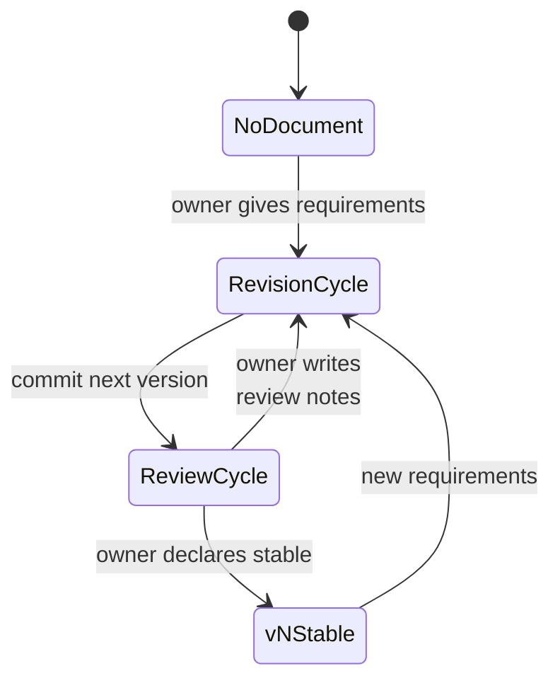
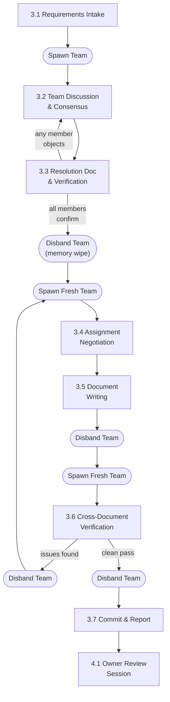

# Design Workflow

## 1. Overview

Design documents evolve through alternating **Revision** and **Review** cycles.
A Revision cycle produces or updates documents; a Review cycle evaluates them and
decides what happens next. These two cycles repeat until the owner declares the
documents stable.

This document defines the steps in each cycle. For team structure, role
definitions, and communication rules, see
[Team Collaboration](./02-team-collaboration.md).

---

## 2. Document Lifecycle

### State Machine



Full example of version progression:

```
[No Document] ---(requirements)---> [Revision] ---(commit v0.1)---> [Review]
[Review] ---(review notes)---> [Revision] ---(commit v0.2)---> [Review]
[Review] ---(review notes)---> [Revision] ---(commit v0.3)---> [Review]
[Review] ---(owner declares stable)---> [v1 STABLE]
[v1 STABLE] ---(new requirements)---> [Revision] ---(commit v1.1)---> [Review]
[Review] ---(review notes)---> [Revision] ---(commit v1.2)---> [Review]
[Review] ---(owner declares stable)---> [v2 STABLE]
```

### States

| State | Description |
|-------|-------------|
| **No Document** | Entry point. No existing design documents for this topic. |
| **Revision Cycle** | The team produces or updates documents based on requirements, review notes, and handover input. Ends with a commit. |
| **Review Cycle** | The owner evaluates committed documents, asks questions, and produces review notes. Ends when the owner declares the review complete. |
| **vN Stable** | The owner has declared the current version stable. No further changes until new requirements arrive. |

### Transitions

- **v0.x** versions are draft iterations. Each revision/review loop produces the
  next v0.x until the owner is satisfied.
- When the owner declares a version stable, it becomes **vN** (e.g., v1). The
  version number is an integer, not a decimal.
- New requirements on a stable vN start a new **v(N+1).x** draft cycle. The same
  revision/review process applies.
- There is no distinction between "initial draft" and "subsequent revision" --
  every version follows the same Revision Cycle steps (Section 3).

---

## 3. Revision Cycle

### Flowchart



### 3.1 Requirements Intake

The team leader receives requirements from the owner and assembles the team.

**Inputs** (any combination):

| Input | Source |
|-------|--------|
| New requirements | Owner provides directly |
| Review notes | From the previous Review Cycle (Section 4.2) |
| Handover document | From the previous Review Cycle (Section 4.3) |
| PoC findings | From a PoC experiment (see [PoC Workflow](./04-poc-workflow.md)) |
| Cross-team requests | From other teams' `v<X>/cross-team-requests/` directories (see [Cross-Team Requests](../conventions/artifacts/documents/07-cross-team-requests.md)) |
| Extra notes / constraints | Owner provides as additional context |

**Actions:**

1. Team leader assembles the appropriate team (opus core members). See
   [Team Collaboration](./02-team-collaboration.md) for team structure and role
   definitions.
2. Team leader passes all input materials to the team.

### 3.2 Team Discussion & Consensus

The team analyzes problems, proposes solutions, debates trade-offs, and reaches
consensus.

**Rules:**

- Team members communicate **peer-to-peer**, not through the team leader. The
  team leader is a facilitator, not a message proxy. See
  [Team Collaboration](./02-team-collaboration.md) Section 5 for communication
  rules.
- The team leader reports progress, status, and opinion summaries to the owner.
- The owner may provide additional instructions during this phase; the team
  leader relays them to the team.
- Prior art research feeds into the discussion. See
  [Team Collaboration](./02-team-collaboration.md) Section 5.3 for the research
  workflow.
- PoC results feed into the discussion. See [PoC Workflow](./04-poc-workflow.md)
  for how PoC findings are structured as review input.
- **ALL disputes are resolved by unanimous consensus.** There is no majority
  vote. Team members must logically persuade each other. If a genuine deadlock
  occurs, the team leader escalates to the owner for a binding decision.

### 3.3 Resolution Document & Verification

When consensus is reached, the team produces a resolution document and verifies
it.

**Steps:**

1. **One representative** (a core member, NOT a spec-writer) writes
   `design-resolutions-{topic}.md`. Format follows
   [Design Resolutions](../conventions/artifacts/documents/04-design-resolutions.md).
2. If the resolution includes changes that affect another team's documents, the
   resolution MUST explicitly note which team is affected and what changes are
   needed. These will be written as cross-team requests in step 3.5.
3. **All team members verify the resolution document WITH THEIR MEMORY
   INTACT.** Do NOT shut down or respawn agents before this step. The purpose
   is that the same agents who participated in the debate verify that the
   written document accurately captures what they agreed on.
4. If **any** member objects that the resolution document does not match the
   consensus, go back to **3.2** for further discussion. The representative
   updates the same resolution file.
5. Only after **all** members confirm does the process proceed.
6. After verification is complete, the team leader shuts down **all** agents
   (clean memory wipe). This ensures the next step starts with a blank slate.

### 3.4 Assignment Negotiation

Fresh agents review the resolution document and negotiate ownership.

**Steps:**

1. Team leader spawns **fresh** core members (opus). These agents have no
   memory of the discussion -- they work purely from the resolution document.
2. Show them the resolution document and the previous version of the spec
   documents (if updating an existing version, not creating from scratch).
3. Team members negotiate among themselves who handles which document or
   section. This includes cross-team request files if the resolution identified
   changes affecting other teams.
4. Negotiation concludes when all members agree on the assignment.

### 3.5 Document Writing

Each member writes their assigned parts.

**Steps:**

1. Each member writes their assigned spec documents: new files for v0.1,
   updated files for v\<prev\> to v\<next\>.
2. If assigned, the responsible core member writes cross-team request files
   and places them in the target team's `v<X>/cross-team-requests/` directory.
   Format follows
   [Cross-Team Requests](../conventions/artifacts/documents/07-cross-team-requests.md).
3. When all writing is complete, the team leader disbands the team.

### 3.6 Cross-Document Consistency Verification

Fresh agents verify that the written documents are correct and consistent.

**Steps:**

1. Team leader spawns **fresh** core members (opus). These agents have no
   memory of who wrote what.
2. Show them **all** newly written documents and the resolution document.
3. They verify:
   - Documents match the resolution document (all agreed changes applied
     correctly).
   - Cross-document consistency (field names, message types, terminology,
     cross-references all agree).

**Verification checklist** (agents check at minimum):

- [ ] Message type registry lists every message type defined across all docs
- [ ] Error codes cover all error references
- [ ] Field names are consistent across documents
- [ ] Cross-references point to correct sections and targets exist
- [ ] Terminology is uniform
- [ ] Version headers and changelogs are updated
- [ ] Cross-team requests (if any) are consistent with the source documents and resolution

**Outcomes:**

- If **any** issues are found: disband the team, go back to **3.4** (fresh
  agents renegotiate and rewrite). There is NO limit on how many rounds of 3.4 to 3.6 can
  repeat. Continue until a clean verification pass is achieved.
- If **clean** (no issues): proceed to 3.7.

**Key invariant:** Verification does NOT produce review notes. During the
Revision Cycle, no review-note files are created. If verification finds issues,
the team goes back to 3.4 to renegotiate and fix them. Issues are communicated verbally (via
agent messages), not written as review-note files.

### 3.7 Commit & Report

The team leader finalizes and reports.

**Steps:**

1. Team leader disbands the verification team.
2. Team leader commits the documents.
3. Team leader reports to the owner: what was produced, which version, and a
   summary of key decisions.

---

## 4. Review Cycle

### Flowchart


### 4.1 Owner Review Session

The owner reviews the committed documents and asks questions.

**Steps:**

1. The owner opens a session and reviews the committed documents.
2. The owner asks questions. The team leader spawns team members to investigate
   and answer.
3. The team leader does **NOT** answer questions directly -- the team leader
   delegates to teammates.
4. Teammates discuss among themselves and report findings to the team leader.
5. The team leader summarizes answers to the owner.
6. The owner may ask follow-up questions (loop back to 4.1).
7. The owner may request a review note be created (proceed to 4.2).

### 4.2 Review Notes & Commit

Review notes are created only when the owner explicitly instructs.

**Steps:**

1. **Only** when the owner explicitly instructs, the team leader writes a review
   note.
2. Format follows
   [Review Notes](../conventions/artifacts/documents/02-review-notes.md).
3. Location: `v<X>/review-notes/{NN}-{topic}.md`
4. Each review note is committed immediately after creation.
5. After committing, return to 4.1 (the owner may continue reviewing).

**Note:** The team leader writes review notes directly. This is one of the few
things the team leader does personally rather than delegating.

### 4.3 Handover & Commit

The team leader writes a handover document when the owner declares the review
complete.

**Steps:**

1. The owner declares the review cycle complete.
2. The team leader writes `v<X>/handover/handover-to-v<next>.md`.
3. Content: insights learned during the Revision Cycle (3.1-3.7) and Review
   Cycle (4.1-4.2) that the NEXT revision cycle's team should know. This
   includes design philosophy, owner priorities, new conventions, and any
   context that review notes alone do not capture.
4. Format follows
   [Handover](../conventions/artifacts/documents/03-handover.md).
5. Commit the handover.

This ends the current cycle. The next Revision Cycle will consume: the committed
spec documents + review notes + handover as input.

---

## 5. Artifacts

### Artifact Matrix

| Artifact | Created During | Created By | Location | Convention |
|----------|---------------|------------|----------|------------|
| `design-resolutions-{topic}.md` | Revision 3.3 | Core member (representative) | `v<X>/design-resolutions/` | [design-resolutions.md](../conventions/artifacts/documents/04-design-resolutions.md) |
| `research-{source}-{topic}.md` | Revision 3.2 | Researcher | `v<X>/research/` | [research-reports.md](../conventions/artifacts/documents/05-research-reports.md) |
| Spec documents (`01-xx.md`, etc.) | Revision 3.5 | Core members | `v<X>/` | -- |
| `review-notes/{NN}-{topic}.md` | Review 4.2 | Team leader | `v<X>/review-notes/` | [review-notes.md](../conventions/artifacts/documents/02-review-notes.md) |
| `handover-to-v<next>.md` | Review 4.3 | Team leader | `v<X>/handover/` | [handover.md](../conventions/artifacts/documents/03-handover.md) |
| `cross-team-requests/{NN}-{topic}.md` | Revision 3.5 | Core member | Target team's `v<X>/cross-team-requests/` | [cross-team-requests.md](../conventions/artifacts/documents/07-cross-team-requests.md) |

### Version Directory Structure

```
docs/{component}/02-design-docs/{topic}/
+-- v0.1/
|   +-- 01-xxx.md
|   +-- 02-xxx.md
|   +-- design-resolutions/
|   |   +-- 01-{topic}.md
|   +-- research/
|   |   +-- 01-{source}-{topic}.md
|   +-- review-notes/
|   |   +-- 01-{topic}.md
|   +-- cross-team-requests/
|   |   +-- 01-{source-team}-{topic}.md
|   +-- handover/
|       +-- handover-to-v0.2.md
+-- v0.2/
|   +-- 01-xxx.md  (updated)
|   +-- ...
+-- v1/  (stable release)
    +-- 01-xxx.md
    +-- ...
```
