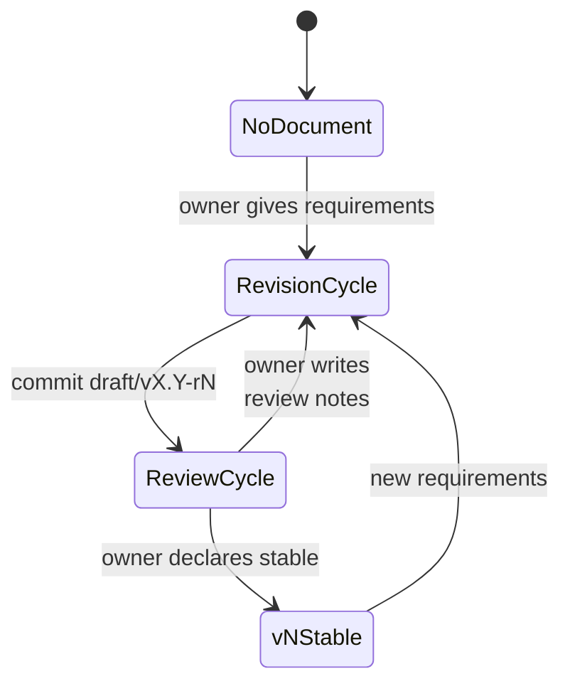

# Design Workflow — Overview

## 1. Overview

Design documents evolve through alternating **Revision** and **Review** cycles.
A Revision cycle produces or updates documents; a Review cycle evaluates them
and decides what happens next. These two cycles repeat until the owner declares
the documents stable.

For team structure, role definitions, and communication rules, see
[Team Collaboration](../02-team-collaboration.md).

**Executable playbook:** The step-by-step instructions for running a revision
cycle live in the `design-doc-revision` skill
(`.claude/skills/design-doc-revision/`). This directory provides rationale and
reference — the skill provides execution guidance.

---

## 2. Document Lifecycle

### State Machine



Full example of version progression:

```
[No Document] ---(requirements)---> [Revision] ---(commit draft/v1.0-r1)---> [Review]
[Review] ---(review notes)---> [Revision] ---(commit draft/v1.0-r2)---> [Review]
[Review] ---(review notes)---> [Revision] ---(commit draft/v1.0-r3)---> [Review]
[Review] ---(owner declares stable)---> [v1.0 STABLE]
[v1.0 STABLE] ---(minor requirements)---> [Revision] ---(commit draft/v1.1-r1)---> [Review]
[Review] ---(review notes)---> [Revision] ---(commit draft/v1.1-r2)---> [Review]
[Review] ---(owner declares stable)---> [v1.1 STABLE]
[v1.1 STABLE] ---(major requirements)---> [Revision] ---(commit draft/v2.0-r1)---> [Review]
[Review] ---(owner declares stable)---> [v2.0 STABLE]
```

### States

| State              | Description                                                                                                                           |
| ------------------ | ------------------------------------------------------------------------------------------------------------------------------------- |
| **No Document**    | Entry point. No existing design documents for this topic.                                                                             |
| **Revision Cycle** | The team produces or updates documents based on requirements, review notes, and handover input. Ends with a commit.                   |
| **Review Cycle**   | The owner evaluates committed documents, asks questions, and produces review notes. Ends when the owner declares the review complete. |
| **vX.Y Stable**    | The owner has declared the current version stable. No further changes until new requirements arrive.                                  |

### Transitions

- **`draft/vX.Y-rN`** versions are draft iterations toward stable `vX.Y`. Each
  revision/review loop produces the next `draft/vX.Y-r(N+1)` until the owner is
  satisfied.
- When the owner declares a version stable, the team leader creates `vX.Y/`
  containing only the final spec documents (no process artifacts). The draft
  directories remain as historical record.
- New requirements on a stable `vX.Y` start a new `draft/vX.(Y+1)-r1` (minor
  change) or `draft/v(X+1).0-r1` (major change) cycle. The owner decides which
  at requirements intake. The same revision/review process applies.
- There is no distinction between "initial draft" and "subsequent revision" —
  every version follows the same Revision Cycle steps.

---

## 3. Document Index

| Document                                 | Content                                         |
| ---------------------------------------- | ----------------------------------------------- |
| [Revision Cycle](./01-revision-cycle.md) | Rationale for each revision step (3.1–3.9)      |
| [Review Cycle](./02-review-cycle.md)     | Rationale for each review step (4.1–4.3)        |
| [Anti-Patterns](./03-anti-patterns.md)   | Collected reference table of all anti-patterns  |
| [Artifacts](./04-artifacts.md)           | Artifact matrix and version directory structure |
