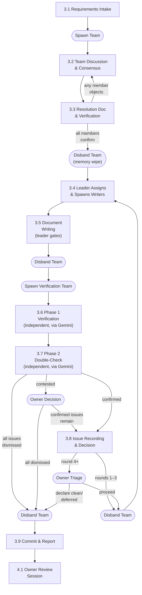

# Design Workflow — Revision Cycle Rationale

This document explains **why** each revision step exists and what rules govern
it. The step-by-step execution instructions live in the `design-doc-revision`
skill (`.claude/skills/design-doc-revision/`).

---

## Revision Cycle Flowchart

---

## 3.1 Requirements Intake

The team leader receives requirements from the owner and assembles the team.

**Inputs** (any combination):

| Input                     | Source                                                                                                                   |
| ------------------------- | ------------------------------------------------------------------------------------------------------------------------ |
| New requirements          | Owner provides directly                                                                                                  |
| Review notes              | From the previous Review Cycle                                                                                           |
| Handover document         | From the previous Review Cycle                                                                                           |
| PoC findings              | From a PoC experiment (see [PoC Workflow](../04-poc-workflow.md))                                                        |
| Cross-team requests       | From other teams' `draft/vX.Y-rN/cross-team-requests/` (active draft) or `{team}/inbox/cross-team-requests/` (idle team) |
| Handover (stable)         | From `{team}/inbox/handover/handover-for-vX.Y.md` if the previous cycle declared stable                                  |
| Extra notes / constraints | Owner provides as additional context                                                                                     |

**Outputs:**

| Output    | Location                                                                                                                                    |
| --------- | ------------------------------------------------------------------------------------------------------------------------------------------- |
| `TODO.md` | `draft/vX.Y-rN/TODO.md` — State checkpoint for the revision cycle. See [TODO Convention](../../conventions/artifacts/documents/09-todo.md). |

---

## 3.2 Team Discussion & Consensus

The team analyzes problems, proposes solutions, debates trade-offs, and reaches
consensus.

**Rules:**

- Team members communicate **peer-to-peer**, not through the team leader.
- The team leader reports progress, status, and opinion summaries to the owner.
- The owner may provide additional instructions; the team leader relays them.
- Prior art research feeds into the discussion. See
  [Team Collaboration](../02-team-collaboration.md) Section 5.3 for the research
  workflow.
- **ALL disputes are resolved by unanimous consensus.** No majority vote.
- The team leader **MUST NOT** judge whether discussion has converged or prompt
  the consensus reporter. The 3.2 → 3.3 transition is triggered **solely** by
  the consensus reporter's unprompted delivery.

---

## 3.3 Resolution Document & Verification

When the consensus reporter delivers their report, the team produces a
resolution document and verifies it.

**Key points:**

1. **One representative** (a core member) writes
   `design-resolutions-{topic}.md`.
2. Cross-team changes MUST be explicitly noted in the resolution.
3. **All team members verify WITH MEMORY INTACT.** Same agents who debated
   verify the written document.
4. If **any** member objects → back to 3.2.
5. After **all** confirm → team leader shuts down **all** agents (clean memory
   wipe).

**Why memory wipe:** Fresh agents in the next step avoid bias from the
discussion. They work purely from the resolution document.

---

## 3.4 Assignment & Spawn

The team leader assigns document ownership based on the resolution document and
agent expertise, then spawns fresh writing agents.

**Why leader assigns (not agent negotiation):** Agent negotiation added a full
spawn cycle and often resulted in the leader making a unilateral pick anyway.
Direct assignment saves tokens without loss of quality — the resolution document
already defines what needs to change.

**Model selection:** Use the model specified in each agent's definition file
(opus). Writing always uses opus regardless of round number — sonnet has
produced quality issues in past cycles.

---

## 3.5 Document Writing

The team leader tells spawned agents to begin writing. This is the gate — no
agent may edit files until the team leader explicitly initiates this step.

**Why the gate matters:** Without an explicit signal, agents race to edit files
before all agents are ready — causing duplicate edits, merge conflicts, and
wasted work.

---

## 3.6 Cross-Document Consistency Verification (Phase 1)

Two fresh Phase 1 verification agents (sonnet) independently analyze the written
documents via Gemini and report issue lists.

**Key rules:**

- Agents delegate analysis to Gemini via `/invoke-agent:prompt` — do NOT
  instruct agents to read files directly.
- **Round 2+ only:** Pass the Dismissed Issues Registry from all previous
  `round-{N}-issues.md` files as structured data (not just a summary).
- **Cascade analysis:** Phase 1 agents MUST include `impact_chain` for each
  issue — predicting which other documents/sections will need coordinated
  changes if this issue is fixed.
- Do NOT assign areas or direct their work.

**Cascaded re-raise monitoring (Round 3+):** The team leader checks whether
newly raised issues are re-raises of settled items, minor cascading
inconsistencies from fixes, or explanatory note cascades. If suspected, escalate
to the owner.

---

## 3.7 Issue Double-Check (Phase 2)

Two fresh Phase 2 review agents independently evaluate the Phase 1 issue list
via Gemini. **No peer-to-peer debate** — each works independently.

| Agent                 | Model  | Rationale                                |
| --------------------- | ------ | ---------------------------------------- |
| `issue-reviewer-fast` | sonnet | Fast pass, Gemini-delegated              |
| `issue-reviewer-deep` | opus   | Fallback quality when Gemini unavailable |

**Outcome rules:**

- Both `confirm` → confirmed (true alarm)
- Both `dismiss` → dismissed
- Split → owner escalation with both agents' reasons

---

## 3.8 Issue Recording & Decision

The team leader records confirmed issues and decides the next step.

**Round-based rules:**

| Round | Behavior                                                               |
| ----- | ---------------------------------------------------------------------- |
| 1–3   | Automatic fix round → back to 3.4                                      |
| 4+    | Owner escalation required (proceed / declare clean / declare deferred) |

**Key invariant:** Verification does NOT produce review notes. Issues are
transient input for the fix team, not permanent records.

---

## 3.9 Commit & Report

1. Team leader disbands the verification team.
2. Team leader commits the documents.
3. Team leader reports to the owner.
4. **STOP.** No review notes, no handover, no further commits.

The Review Cycle begins **only when the owner opens a new session**.
