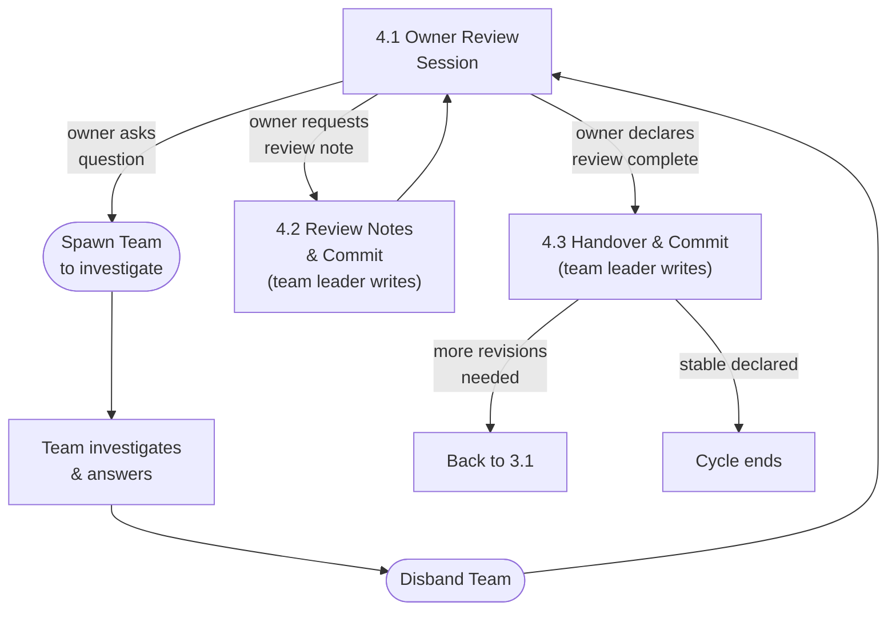

# Design Workflow — Review Cycle Rationale

> **OWNER-INITIATED ONLY.** The Review Cycle begins when the owner opens a
> session. The team leader MUST NOT write review notes, handover documents, or
> any Review Cycle artifact without an explicit instruction from the owner in
> that session.

---

## Flowchart

---

## 4.1 Owner Review Session

The owner reviews the committed documents and asks questions.

1. The owner opens a session and reviews the committed documents.
2. The owner asks questions. The team leader spawns team members to investigate.
3. The team leader does **NOT** answer questions directly — delegates to
   teammates.
4. Teammates discuss among themselves and report findings to the team leader.
5. The team leader summarizes answers to the owner.
6. The owner may ask follow-up questions (loop back to 4.1).
7. The owner may request a review note (proceed to 4.2).

---

## 4.2 Review Notes & Commit

Review notes are created **only** when the owner explicitly instructs in the
current session.

1. **Only** when the owner explicitly instructs, the team leader writes a review
   note.
2. Format follows
   [Review Notes](../../conventions/artifacts/documents/02-review-notes.md).
3. Location: `draft/vX.Y-rN/review-notes/{NN}-{topic}.md`
4. Each review note is committed immediately after creation.
5. After committing, return to 4.1.

**Note:** The team leader writes review notes directly. This is one of the few
things the team leader does personally rather than delegating.

---

## 4.3 Handover & Commit

The team leader writes a handover document **only when the owner explicitly
declares the review cycle complete**.

1. The owner explicitly declares the review cycle complete.
2. The team leader writes the handover:
   - More revisions needed: `draft/vX.Y-rN/handover/handover-to-r(N+1).md`
   - Stable declared: `{topic}/inbox/handover/handover-for-vX.Y.md`

   When stable is declared, the next revision cycle's target version is
   determined by the owner at the next Requirements Intake, not at handover
   time.
3. Content: insights learned during both cycles that the NEXT revision cycle's
   team should know.
4. Format follows
   [Handover](../../conventions/artifacts/documents/03-handover.md).
5. **If stable declared only:** create `vX.Y/` with final spec documents only
   (files matching `[0-9]+-*.md`). Process artifacts stay in the draft
   directory.
6. Commit.

**If more revisions needed:** next cycle starts with `draft/vX.Y-r(N+1)/`,
consuming: previous draft's spec docs + review notes + handover.

**If stable declared:** cycle ends. Next cycle (when new requirements arrive)
starts with `draft/v<next>-r1/`, consuming: `vX.Y/` spec docs + review notes +
handover from `{topic}/inbox/handover/`.
