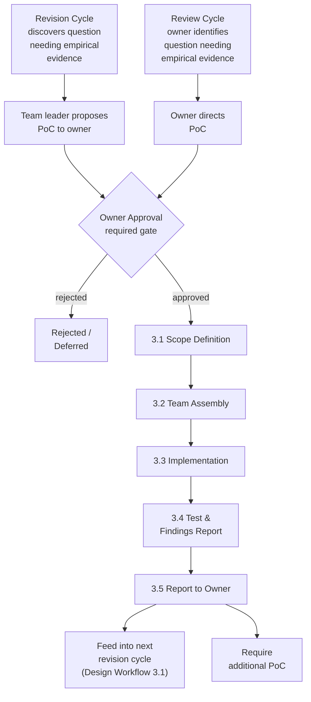

# PoC Workflow

## 1. Overview

A PoC (Proof of Concept) is a focused, limited-scope experiment that validates or
invalidates a specific design assumption. It produces empirical evidence that the
design team uses to make informed decisions.

**A PoC is NOT a prototype.** It is intentionally minimal — just enough code to
answer one well-defined question. Scope creep turns a PoC into wasted effort.

**Key principles:**

- PoC results are **evidence, not decisions**. The design team (not the PoC team)
  decides how to incorporate findings into the spec.
- PoC requires **owner approval** before any work begins, regardless of who
  proposes it.
- All PoC code lives under `poc/<name>/` in the repository.
- PoC findings feed into the design revision cycle as input alongside review notes
  and handovers (see [Design Workflow](./03-design-workflow.md)).

---

## 2. When to PoC

Two triggers can initiate a PoC:

### Trigger A: Owner Directive

The owner explicitly instructs the team to run a PoC. The owner defines the scope
and the question to answer. The team proceeds immediately.

### Trigger B: Team Proposal

During a design discussion, the team encounters a question that cannot be resolved
through theoretical debate or reference codebase research alone. In this case:

1. The team leader proposes a specific PoC to the owner
2. The proposal MUST include:
   - **What to validate** — the specific assumption or question
   - **Proposed approach** — what to build, which APIs to use, which reference
     codebases to consult
   - **Expected outcomes** — what constitutes success vs. failure
   - **Scope boundaries** — what NOT to build
3. The team does NOT start the PoC until the owner approves
4. The owner may approve, modify the scope, or reject the proposal

**In both cases, owner approval is the gate.** No PoC work begins without it.

---

## 3. PoC Lifecycle

### 3.1 Scope Definition

The owner (or team leader with owner approval) defines:

| Element | Description |
|---------|-------------|
| **Question** | The specific question to answer (e.g., "Can macOS IME be suppressed programmatically?") |
| **Success/failure criteria** | What constitutes a definitive answer |
| **Scope boundaries** | What NOT to build — keep the PoC as narrow as possible |
| **Reference material** | Which reference codebases, APIs, or libraries to use |

A PoC that tries to validate too many things at once produces ambiguous results.
If the scope feels broad, split it into multiple smaller PoCs.

### 3.2 Team Assembly

The team leader assembles a focused team for implementation. PoC teams may differ
from design teams in composition and size:

- **Domain experts** who understand the API or technology being tested are
  essential (e.g., a ghostty expert for ghostty API validation)
- PoC teams are typically **smaller** than design teams — the work is focused and
  does not require the full breadth of perspectives that spec writing demands
- All team members are `opus`. Same model policy as design teams (see
  [Team Collaboration](./02-team-collaboration.md) Section 2.1).

### 3.3 Implementation

- Code lives under `poc/<name>/` in the repository
- Code should be **minimal and focused** on answering the defined question —
  production quality is not the goal
- Team members coordinate directly using peer-to-peer communication (same rules as
  all team activities — see [Team Collaboration](./02-team-collaboration.md)
  Section 5.1)
- The team leader facilitates but does NOT write code (same constraint as always —
  see [Team Collaboration](./02-team-collaboration.md) Section 4)

### 3.4 Test and Findings Report

The team runs tests and documents findings. The findings report MUST include:

| Section | Content |
|---------|---------|
| **What was tested** | Specific APIs, scenarios, and edge cases exercised |
| **Pass/fail results** | What passed, what failed, with specifics (e.g., "22/24 tests passed") |
| **API patterns** | Patterns that worked vs. patterns that did not work |
| **Unexpected discoveries** | Bugs, platform constraints, undocumented behavior, performance characteristics |
| **Known limitations** | Limitations of the PoC itself (what it did NOT test, simplifications made) |

**Findings are factual.** The report presents evidence — it does NOT make design
recommendations. The design team will use the evidence to make decisions in the
next revision cycle.

### 3.5 Report to Owner

The team leader summarizes findings to the owner. The owner decides how findings
affect the design:

| Owner decision | Effect |
|----------------|--------|
| **Feed into next revision** | Findings become input to the design revision cycle alongside review notes and handovers |
| **Trigger new discussion** | Findings surface a question that requires a new design discussion before revision |
| **Close an open question** | Findings definitively answer an open question in the design docs |
| **Require additional PoC** | Findings are inconclusive or raise new questions that need further experimentation |

---

## 4. Artifacts

| Artifact | Location | Content |
|----------|----------|---------|
| PoC code | `poc/<name>/` | Minimal implementation focused on answering the defined question |
| Findings report | Communicated to owner; written as a file if the owner requests persistence | Test results, API patterns, discoveries, limitations |

PoC code is intentionally disposable. It is kept in the repository for reference,
but it is not maintained as production code. If a PoC directory becomes obsolete
(e.g., the question it answered is no longer relevant), it may be archived or
removed at the owner's discretion.

---

## 5. Existing PoCs

| PoC | Directory | Purpose | Key Findings |
|-----|-----------|---------|--------------|
| ime-ghostty-real | `poc/02-ime-ghostty-real/` | Validate ghostty Surface API for IME key input | `ghostty_surface_key()` is the correct API (not `_text()`). Space key needs flush + forward with `.text`. 22/24 tests passed. Results drove 6 resolutions in the IME contract v0.2 to v0.3 revision. |
| ime-key-handling | `poc/01-ime-key-handling/` | Explore IME key handling patterns | Key handling exploration for IME input pipeline |
| macos-ime-suppression | `poc/03-macos-ime-suppression/` | Validate macOS IME suppression viability | Confirmed that macOS built-in IME can be suppressed programmatically, supporting the native IME architecture decision (libitshell3-ime replaces OS IME) |

---

## 6. Connection to Design Workflow

PoC findings enter the design process as one type of input among several. The
relationship is strictly one-directional: PoCs produce evidence, and the design
team consumes it.

**How findings flow into design:**

1. PoC findings are input to the design revision cycle (see
   [Design Workflow](./03-design-workflow.md)), with the same standing as reference
   codebase research or owner review notes
2. When findings contradict current design assumptions, they become evidence in
   team discussions — not automatic overrides
3. PoC findings carry the same weight as reference codebase research: they are
   empirical evidence, not design decisions
4. The design team (not the PoC team) decides how to incorporate findings into
   the spec

**How design triggers PoCs:**

1. During a design discussion, the team may discover a question that cannot be
   resolved through debate or reference codebase analysis
2. The team leader proposes a PoC to the owner (Trigger B in Section 2)
3. If approved, the PoC runs and produces findings
4. Findings flow back into the design discussion

This cycle can repeat: a PoC may answer one question but surface another, leading
to a follow-up PoC or a new design discussion.
