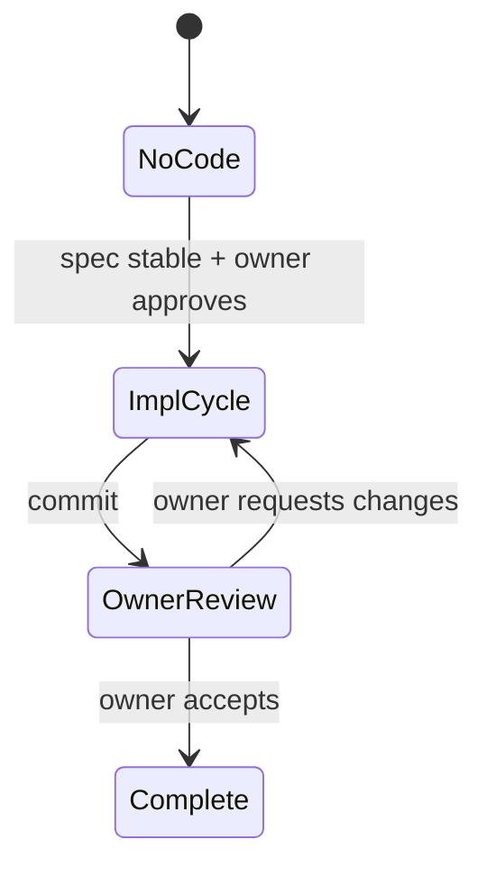
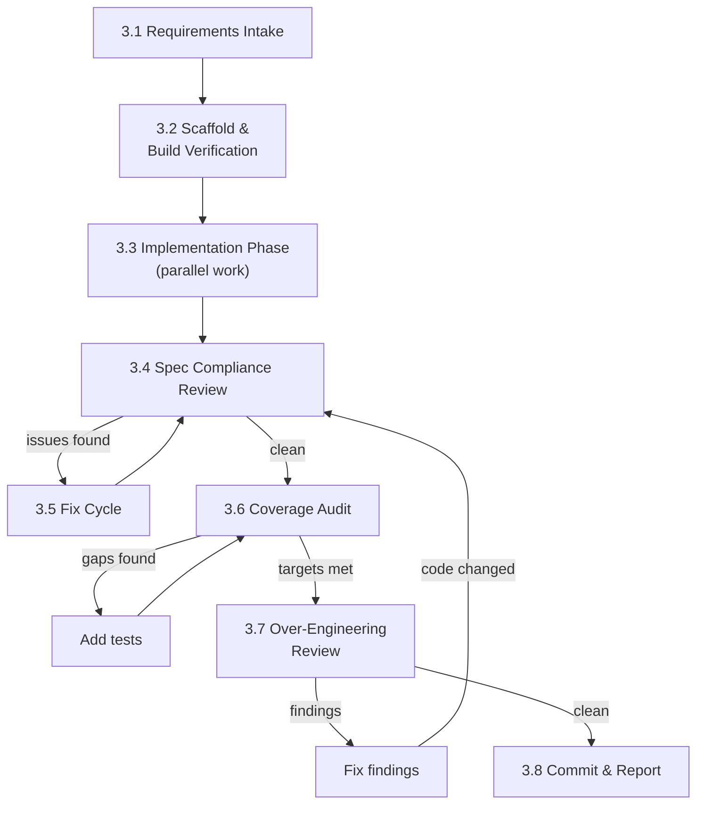

# Implementation Workflow

## 1. Overview

Implementation transforms design specifications into working source code with
comprehensive test coverage. The design spec is the **single source of truth** —
the implementation must faithfully translate the spec, adding nothing beyond
what it requires.

This document defines the implementation lifecycle. For team structure, role
definitions, and communication rules, see
[Team Collaboration](./02-team-collaboration.md). For the design process that
produces the specs being implemented, see
[Design Workflow](./03-design-workflow/).

**Key principles:**

- The design spec is **authoritative**. If the implementation reveals a spec gap
  or error, the fix goes through the design revision cycle — implementers do not
  improvise.
- Test coverage is a **first-class deliverable**, not an afterthought.
  Implementation is not complete until coverage targets are met.
- Over-engineering review is **mandatory** before commit. Code that exceeds the
  spec scope is a defect, not a feature.

---

## 2. Implementation Lifecycle

### State Machine

### States

| State                    | Description                                                                     |
| ------------------------ | ------------------------------------------------------------------------------- |
| **No Code**              | Design spec is stable. No implementation exists yet.                            |
| **Implementation Cycle** | The team produces source code, tests, and coverage reports. Ends with a commit. |
| **Owner Review**         | The owner evaluates the committed code. May request changes or accept.          |
| **Complete**             | Owner has accepted the implementation.                                          |

---

## 3. Implementation Cycle

### Flowchart

**Regression loop:** When over-engineering fixes (3.7) change code, the cycle
returns to 3.4 (not 3.8) to re-verify spec compliance and coverage. Commit is
only reached when a single pass through 3.4 → 3.6 → 3.7 completes with all three
clean.

### 3.1 Requirements Intake

The team leader receives the implementation assignment from the owner.

**Inputs:**

| Input                        | Source                                                                      |
| ---------------------------- | --------------------------------------------------------------------------- |
| Design spec (stable version) | The authoritative spec documents to implement                               |
| Implementation plan          | `.claude/plan/` — directory structure, file list, test matrix, build system |
| PoC code (if any)            | Reference implementations from `poc/`                                       |
| Owner constraints            | Performance targets, coverage requirements, tooling preferences             |

**Outputs:**

| Output            | Location                                            |
| ----------------- | --------------------------------------------------- |
| `TODO.md`         | Implementation tracking (phases, tasks, checkboxes) |
| Agent definitions | `.claude/agents/<impl-team>/`                       |

**Actions:**

1. Team leader creates agent definitions for the implementation team (see
   Section 4).
2. Team leader creates `TODO.md` tracking all implementation phases.
3. Team leader spawns ALL team members listed in the agent directory.

### 3.2 Scaffold & Build Verification

The team leader sets up the project skeleton and verifies the build system works
before implementation begins. This is the **first gate** — no implementation
work starts until the scaffold compiles.

**Steps:**

1. Create the module directory structure (directories, `build.zig`,
   `build.zig.zon`, config files).
2. Compile vendored C dependencies (if any) to verify the build chain works.
3. Create a minimal source file (e.g., `root.zig` with a trivial test) to verify
   `zig build test` runs.
4. Only after `zig build test` passes does the team leader signal "scaffold
   ready."

**Why this gate matters:** Build system issues discovered mid-implementation
waste significant effort. Verifying the build chain works before any substantial
code is written catches toolchain, path, and dependency problems early.

### 3.3 Implementation Phase

The team writes source code and tests in parallel after the scaffold gate
passes.

**Roles during this phase:**

| Role            | Responsibilities                                                                                                                    |
| --------------- | ----------------------------------------------------------------------------------------------------------------------------------- |
| **Implementer** | Writes all source files with inline unit tests (`test` blocks). Follows the spec exactly — no design deviations.                    |
| **QA Reviewer** | Writes integration tests from the scenario matrix. Reviews completed files against the spec for correctness. Runs coverage tooling. |

**Rules:**

- The implementer writes code **and** inline unit tests for each file. Unit
  tests verify internal functions and edge cases that are not part of the
  integration matrix.
- The QA reviewer writes integration tests from the predefined scenario matrix.
  Integration tests verify end-to-end behavior as described in the spec.
- Both roles work in parallel once the scaffold is ready. The QA reviewer does
  not need to wait for all files — they can test completed files as they become
  available.
- Communication follows the same peer-to-peer rules as all team activities (see
  [Team Collaboration](./02-team-collaboration.md) Section 5).

### 3.4 Spec Compliance Review

The QA reviewer reads all source code against the design spec and verifies
correctness.

**What is checked:**

- Every spec requirement has corresponding code
- Types, field names, and method signatures match the spec exactly
- Error handling matches spec-defined behavior
- Edge cases described in the spec are handled
- No undocumented behavior or implicit assumptions

**Output:** A list of issues (spec violations, missing behavior, incorrect
handling). If no issues: clean pass.

### 3.5 Fix Cycle

The implementer fixes issues found in 3.4. The QA reviewer re-validates each
fix. This repeats until a clean pass is achieved.

**Rules:**

- The QA reviewer reports issues to the implementer directly (peer-to-peer).
- The implementer fixes and notifies the QA reviewer.
- The QA reviewer re-checks the specific fix AND verifies no regressions.
- No limit on rounds — continue until clean.

### 3.6 Coverage Audit

The QA reviewer measures test coverage and identifies gaps.

**Coverage targets:**

| Metric            | Target |
| ----------------- | ------ |
| Line coverage     | ≥ 95%  |
| Branch coverage   | ≥ 90%  |
| Function coverage | 100%   |

**Process:**

1. Run coverage tooling (e.g., kcov) on the test binary.
2. Identify uncovered lines, branches, and functions.
3. For each gap: add a test that exercises the uncovered path, OR justify why
   coverage is impossible (e.g., unreachable safety assertions).
4. Repeat until targets are met.

**Coverage exceptions:** Some code paths may be intentionally untestable (e.g.,
`unreachable` branches for type safety, platform-specific code not exercisable
in CI). These must be explicitly documented with rationale.

### 3.7 Over-Engineering Review

A dedicated reviewer (typically the principal architect) evaluates all code for
scope creep and unnecessary complexity.

**What is checked:**

| Check                     | Description                                                          |
| ------------------------- | -------------------------------------------------------------------- |
| **Spec scope**            | No types, fields, methods, or features beyond what the spec requires |
| **KISS**                  | Simplest possible implementation for each requirement                |
| **YAGNI**                 | No code for hypothetical future requirements                         |
| **Dead code**             | No unused functions, types, or imports                               |
| **Premature abstraction** | No helpers or utilities for one-time operations                      |
| **Buffer sizing**         | All buffer sizes justified by spec or empirical measurement          |
| **Build system**          | No unnecessary build steps, targets, or dependencies                 |

**Process:**

1. The over-engineering reviewer reads ALL source files against the spec.
2. Reports findings with specific file:line references.
3. The implementer fixes findings.
4. The reviewer re-validates the fixes.
5. If **any code was changed** during this step, return to **3.4** — the
   over-engineering fixes may have broken spec compliance or reduced coverage. A
   full 3.4 → 3.6 → 3.7 pass must complete clean before proceeding to 3.8.
6. If clean (no findings on this pass): proceed to 3.8.

**Why the regression loop matters:** Over-engineering fixes remove or simplify
code. Removing code can break spec compliance (a required behavior was in the
removed code) or reduce coverage (tests that covered the removed code now fail
or leave new code uncovered). Re-running the full verification chain after any
code change ensures nothing slips through.

**Why this review is mandatory:** Implementation agents tend to add
"improvements" beyond the spec — extra error handling, unnecessary abstractions,
configurable parameters, defensive code for impossible scenarios. This review
catches scope creep before it accumulates.

### 3.8 Commit & Report

The team leader finalizes and reports.

**Gate conditions (ALL must be true):**

- [ ] All tests pass (`zig build test`)
- [ ] Library builds without warnings (`zig build`)
- [ ] Coverage targets met (line ≥ 95%, branch ≥ 90%, function = 100%) — or
      module-level exemption granted (see §6.2)
- [ ] Over-engineering review clean (no open findings)
- [ ] Spec compliance review clean (no open issues)

**Steps:**

1. Team leader disbands the implementation team.
2. Team leader commits the code.
3. Team leader reports to the owner: what was implemented, test count, coverage
   numbers, any spec gaps discovered.

---

## 4. Team Composition

### 4.1 Implementation Team Structure

Implementation teams are **smaller and more focused** than design teams. The
typical composition is:

| Role                          | Model | Count | Responsibilities                                |
| ----------------------------- | ----- | ----- | ----------------------------------------------- |
| **Implementer**               | opus  | 1     | Writes all source files + inline unit tests     |
| **QA Reviewer**               | opus  | 1     | Integration tests, spec review, coverage audit  |
| **Over-Engineering Reviewer** | opus  | 1     | KISS/YAGNI review (activated late in the cycle) |

All team members are `opus`. Same model policy as design teams.

### 4.2 Role Separation

The implementer and QA reviewer are **different agents** with different
perspectives:

- The **implementer** thinks "how do I make this work correctly?"
- The **QA reviewer** thinks "how can I prove this is correct — or find where it
  is wrong?"

This separation prevents the "testing your own code" bias. The QA reviewer reads
the spec independently and writes tests from the spec, not from the
implementation.

### 4.3 Over-Engineering Reviewer Activation

The over-engineering reviewer is activated **late in the cycle** (after
implementation and spec compliance review are complete). This is intentional:

- Reviewing incomplete code wastes the reviewer's time
- The reviewer needs to see the final shape of the code to judge whether
  abstractions are justified
- Early activation creates churn (implementing → reviewing → re-implementing →
  re-reviewing)

### 4.4 Agent Definitions

Agent definitions live in `.claude/agents/<impl-team>/`. Each implementation
project gets its own team directory. The team leader creates these before
spawning agents.

Agent files follow the same format as design teams (see
[Team Collaboration](./02-team-collaboration.md) Section 3).

---

## 5. Spec-to-Code Relationship

### 5.1 The Spec Is Authoritative

The design spec is the single source of truth. The implementation exists to
realize the spec — not to improve, extend, or reinterpret it.

| Situation                                         | Correct Action                                                                                                      |
| ------------------------------------------------- | ------------------------------------------------------------------------------------------------------------------- |
| Spec says X, implementer thinks Y is better       | Implement X. If Y is truly better, file a spec change through the design revision cycle.                            |
| Spec is ambiguous on a detail                     | Ask the owner or file a spec clarification. Do NOT guess.                                                           |
| Spec has an error (e.g., impossible constraint)   | Report to the owner. Do NOT silently work around it.                                                                |
| Implementation reveals a missing spec requirement | Report to the owner. Implement what the spec says; the missing requirement will be added in the next spec revision. |

### 5.2 No Unauthorized Extensions

The following are implementation defects, not features:

- Extra fields or methods not in the spec
- Error handling for scenarios the spec says cannot occur
- Configurable parameters when the spec defines fixed values
- Abstraction layers for "future flexibility"
- Backwards-compatibility shims for non-existent consumers

### 5.3 Spec Gap Protocol

When a genuine spec gap is discovered during implementation:

1. The implementer reports the gap to the team leader with specific details.
2. The team leader reports to the owner.
3. The owner decides: (a) clarify the spec now, (b) defer to next spec revision,
   or (c) make a binding decision for this implementation.
4. If (c), the team leader records the decision in the implementation TODO.md
   for future spec update.

---

## 6. Coverage Standards

### 6.1 Coverage Is a Deliverable

Test coverage is not optional. An implementation without adequate coverage is
incomplete — the same way an implementation without correct behavior is
incomplete.

### 6.2 Measurement Tooling

Coverage must be measured with instrumented tooling (e.g., kcov, llvm-cov), not
estimated from test count. The HTML report is the artifact of record.

**Module-level exceptions:** When a toolchain bug makes instrumented coverage
impossible for a specific module, the owner may grant a temporary exemption.
Exempted modules rely on the scenario-matrix test approach (every spec-defined
code path has a named test) until the toolchain issue is resolved. The exemption
and its reason must be recorded in the module's build config or README.

| Module            | Status       | Reason                                                                                                                                                                                                |
| ----------------- | ------------ | ----------------------------------------------------------------------------------------------------------------------------------------------------------------------------------------------------- |
| `libitshell3-ime` | **Exempted** | Zig linker Mach-O bug — `__text` section offset overlaps load commands, making DWARF debug info unparseable by kcov/dsymutil. See [ziglang/zig#31428](https://codeberg.org/ziglang/zig/issues/31428). |
| All other modules | **Required** | —                                                                                                                                                                                                     |

### 6.3 Target Metrics

| Metric            | Target | Rationale                                               |
| ----------------- | ------ | ------------------------------------------------------- |
| Line coverage     | ≥ 95%  | Near-complete execution of all code paths               |
| Branch coverage   | ≥ 90%  | Both sides of conditionals exercised                    |
| Function coverage | 100%   | Every public and internal function called at least once |

### 6.4 Exceptions

Some code is intentionally untestable:

- `unreachable` branches (Zig safety assertions)
- Platform-specific code not exercisable on the test platform
- Panic handlers for "should never happen" conditions

Each exception must be documented with rationale. "Hard to test" is not a valid
exception — only "impossible to test on this platform" or "testing would require
mocking the entire OS" qualifies.

---

## 7. Artifacts

| Artifact            | Created During | Created By                | Location                                       | Lifecycle                                                  |
| ------------------- | -------------- | ------------------------- | ---------------------------------------------- | ---------------------------------------------------------- |
| Implementation plan | Before 3.1     | Team leader               | `.claude/plan/<name>.md`                       | Deleted after owner accepts (Section 2: Complete state)    |
| Agent definitions   | 3.1            | Team leader               | `.claude/agents/<impl-team>/`                  | Kept for future implementation cycles on the same module   |
| TODO.md             | 3.1            | Team leader               | Module directory or `.claude/plan/`            | Deleted with the implementation plan                       |
| Source code + tests | 3.3            | Implementer + QA Reviewer | `modules/<name>/src/`                          | Permanent                                                  |
| Coverage report     | 3.6            | QA Reviewer               | `modules/<name>/coverage-report/` (gitignored) | Regenerated on demand; not committed                       |
| Spec gap notes      | 3.3-3.5        | Team leader               | In TODO.md                                     | Deleted with TODO.md; gaps feed into design revision cycle |

---

## 8. Connection to Other Workflows

### From Design Workflow

Implementation begins only after a design spec is declared stable (or
sufficiently mature for initial implementation, per owner decision). The spec
version being implemented is recorded in the implementation plan.

### To Design Workflow

If implementation reveals spec gaps or errors, these feed back into the design
revision cycle as input — alongside review notes and handovers. The
implementation team does NOT modify the spec; they report findings to the owner.

### From PoC Workflow

PoC code in `poc/` serves as reference for the implementation — patterns that
worked, APIs validated, edge cases discovered. PoC code is NOT the starting
point for production code; it is a reference only.
