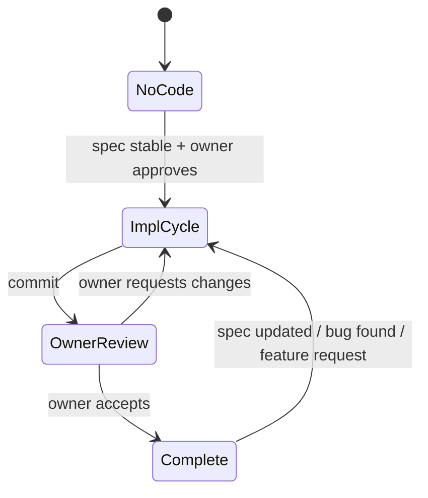
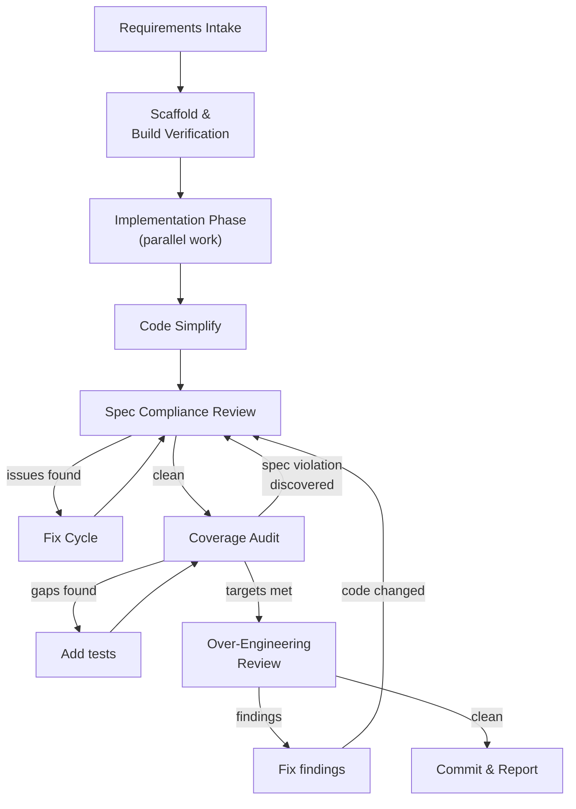

# Implementation Workflow

## 1. Overview

Implementation transforms design specifications into working source code with
comprehensive test coverage. The design spec is the **single source of truth** —
the implementation must faithfully translate the spec, adding nothing beyond
what it requires.

This document defines the implementation lifecycle. For team structure, role
definitions, and communication rules, see
[Team Collaboration](./02-team-collaboration.md). For the design process that
produces the specs being implemented, see
[Design Workflow](./03-design-workflow/).

**Executable playbook:** The step-by-step instructions for running an
implementation cycle live in the `implementation` skill
(`.claude/skills/implementation/`). This document provides rationale and
reference — the skill provides execution guidance.

**Key principles:**

- The design spec is **authoritative**. If the implementation reveals a spec gap
  or error, the fix goes through the design revision cycle — implementers do not
  improvise.
- Test coverage is a **first-class deliverable**, not an afterthought.
  Implementation is not complete until coverage targets are met.
- Over-engineering review is **mandatory** before commit. Code that exceeds the
  spec scope is a defect, not a feature.

---

## 2. Implementation Lifecycle

### State Machine

### States

| State                    | Description                                                                                 |
| ------------------------ | ------------------------------------------------------------------------------------------- |
| **No Code**              | Design spec is stable. No implementation exists yet.                                        |
| **Implementation Cycle** | The team produces or modifies source code, tests, and coverage reports. Ends with a commit. |
| **Owner Review**         | The owner evaluates the committed code. May request changes or accept.                      |
| **Complete**             | Owner has accepted the implementation. May re-enter ImplCycle when specs evolve.            |

### Entry Paths

| Entry                      | From        | Trigger                              | Step 1 Behavior                                            |
| -------------------------- | ----------- | ------------------------------------ | ---------------------------------------------------------- |
| **Greenfield**             | No Code     | First implementation of a target     | Full cycle: scaffold, implement, review                    |
| **Spec update**            | Complete    | Design spec revised to new version   | Identify delta from previous spec; skip scaffold if builds |
| **Bug fix**                | Complete    | Bug found in accepted implementation | Scope to specific fix; skip scaffold                       |
| **Owner-requested change** | OwnerReview | Owner requests changes during review | Resume from Step 3 with change list                        |

---

## 3. Implementation Cycle

### Flowchart

### Regression Loop

When over-engineering fixes change code, the cycle returns to Spec Compliance
Review (not Commit) to re-verify correctness and coverage. Commit is only
reached when a single pass through Compliance → Coverage → Over-Engineering
completes with all three clean.

**Why this matters:** Over-engineering fixes remove or simplify code. Removing
code can break spec compliance or reduce coverage. Re-running the full
verification chain after any code change ensures nothing slips through.

### Phase Summaries

| Phase                       | Purpose                                                                             | Key Gate                                       |
| --------------------------- | ----------------------------------------------------------------------------------- | ---------------------------------------------- |
| **Requirements Intake**     | Identify spec, plan, PoC inputs; set up tracking                                    | Owner approves, TODO.md created                |
| **Scaffold & Build**        | Create module skeleton; verify build chain works                                    | `zig build test` passes on minimal skeleton    |
| **Implementation**          | Write source code + unit tests (implementer) and integration tests (QA) in parallel | Both roles report complete                     |
| **Code Simplify**           | Run `/simplify` (reuse, quality, efficiency) then verify tests pass                 | Fixes applied, tests pass in Debug+ReleaseSafe |
| **Spec Compliance Review**  | QA reads all code against spec, checking types/signatures/behavior                  | Clean pass or issue list                       |
| **Fix Cycle**               | Implementer fixes issues; QA re-validates; repeat until clean                       | All issues resolved                            |
| **Coverage Audit**          | Measure instrumented coverage; fill gaps                                            | Targets met or exemption granted               |
| **Over-Engineering Review** | Principal architect checks for scope creep and unnecessary complexity               | Clean pass (code changed → back to Compliance) |
| **Commit & Report**         | Commit code; report to owner                                                        | All gates green                                |

---

## 4. Team Composition

### 4.1 Implementation Team Structure

Implementation teams are **smaller and more focused** than design teams. The
typical composition is:

| Role                          | Model | Count | Responsibilities                                |
| ----------------------------- | ----- | ----- | ----------------------------------------------- |
| **Implementer**               | opus  | 1     | Writes all source files + inline unit tests     |
| **QA Reviewer**               | opus  | 1     | Integration tests, spec review, coverage audit  |
| **Over-Engineering Reviewer** | opus  | 1     | KISS/YAGNI review (activated late in the cycle) |

All team members are `opus`. Same model policy as design teams.

### 4.2 Role Separation

The implementer and QA reviewer are **different agents** with different
perspectives:

- The **implementer** thinks "how do I make this work correctly?"
- The **QA reviewer** thinks "how can I prove this is correct — or find where it
  is wrong?"

This separation prevents the "testing your own code" bias. The QA reviewer reads
the spec independently and writes tests from the spec, not from the
implementation.

### 4.3 Over-Engineering Reviewer Activation

The over-engineering reviewer is activated **late in the cycle** (after
implementation and spec compliance review are complete). This is intentional:

- Reviewing incomplete code wastes the reviewer's time
- The reviewer needs to see the final shape of the code to judge whether
  abstractions are justified
- Early activation creates churn (implementing → reviewing → re-implementing →
  re-reviewing)

---

## 5. Spec-to-Code Relationship

### 5.1 The Spec Is Authoritative

The design spec is the single source of truth. The implementation exists to
realize the spec — not to improve, extend, or reinterpret it.

| Situation                                         | Correct Action                                                                                                      |
| ------------------------------------------------- | ------------------------------------------------------------------------------------------------------------------- |
| Spec says X, implementer thinks Y is better       | Implement X. If Y is truly better, file a spec change through the design revision cycle.                            |
| Spec is ambiguous on a detail                     | Ask the owner or file a spec clarification. Do NOT guess.                                                           |
| Spec has an error (e.g., impossible constraint)   | Report to the owner. Do NOT silently work around it.                                                                |
| Implementation reveals a missing spec requirement | Report to the owner. Implement what the spec says; the missing requirement will be added in the next spec revision. |

### 5.2 No Unauthorized Extensions

The following are implementation defects, not features:

- Extra fields or methods not in the spec
- Error handling for scenarios the spec says cannot occur
- Configurable parameters when the spec defines fixed values
- Abstraction layers for "future flexibility"
- Backwards-compatibility shims for non-existent consumers

### 5.3 Spec Gap Protocol

When a genuine spec gap is discovered during implementation:

1. The implementer reports the gap to the team leader with specific details.
2. The team leader reports to the owner.
3. The owner decides: (a) clarify the spec now, (b) defer to next spec revision,
   or (c) make a binding decision for this implementation.
4. If (c), the team leader records the decision in the implementation TODO.md
   for future spec update.

---

## 6. Coverage Standards

### 6.1 Coverage Is a Deliverable

Test coverage is not optional. An implementation without adequate coverage is
incomplete — the same way an implementation without correct behavior is
incomplete.

### 6.2 Measurement Tooling

Coverage must be measured with instrumented tooling (e.g., kcov, llvm-cov), not
estimated from test count. The HTML report is the artifact of record.

**Module-level exceptions:** When a toolchain bug makes instrumented coverage
impossible for a specific module, the owner may grant a temporary exemption.
Exempted modules rely on the scenario-matrix test approach (every spec-defined
code path has a named test) until the toolchain issue is resolved. The exemption
and its reason must be recorded in the module's build config or README.

| Module            | Status       | Reason                                                                                                                                                                                                |
| ----------------- | ------------ | ----------------------------------------------------------------------------------------------------------------------------------------------------------------------------------------------------- |
| `libitshell3-ime` | **Exempted** | Zig linker Mach-O bug — `__text` section offset overlaps load commands, making DWARF debug info unparseable by kcov/dsymutil. See [ziglang/zig#31428](https://codeberg.org/ziglang/zig/issues/31428). |
| All other modules | **Required** | —                                                                                                                                                                                                     |

### 6.3 Target Metrics

| Metric            | Target | Rationale                                               |
| ----------------- | ------ | ------------------------------------------------------- |
| Line coverage     | ≥ 95%  | Near-complete execution of all code paths               |
| Branch coverage   | ≥ 90%  | Both sides of conditionals exercised                    |
| Function coverage | 100%   | Every public and internal function called at least once |

### 6.4 Exceptions

Some code is intentionally untestable:

- `unreachable` branches (Zig safety assertions)
- Platform-specific code not exercisable on the test platform
- Panic handlers for "should never happen" conditions

Each exception must be documented with rationale. "Hard to test" is not a valid
exception — only "impossible to test on this platform" or "testing would require
mocking the entire OS" qualifies.

---

## 7. Artifacts

| Artifact            | Created By                | Location                                 | Lifecycle                                             |
| ------------------- | ------------------------- | ---------------------------------------- | ----------------------------------------------------- |
| Implementation plan | Team leader               | `.claude/plan/<name>.md`                 | Deleted after owner accepts                           |
| Agent definitions   | Team leader               | `.claude/agents/impl-team/`              | Reused across implementation cycles                   |
| TODO.md             | Team leader               | `<target>/TODO.md`                       | Deleted after owner accepts                           |
| Source code + tests | Implementer + QA Reviewer | `<target>/src/`                          | Permanent                                             |
| Coverage report     | QA Reviewer               | `<target>/coverage-report/` (gitignored) | Regenerated on demand; not committed                  |
| Spec gap notes      | Team leader               | In TODO.md                               | Feed into design revision cycle; deleted with TODO.md |

---

## 8. Connection to Other Workflows

### From Design Workflow

Implementation begins only after a design spec is declared stable (or
sufficiently mature for initial implementation, per owner decision). The spec
version being implemented is recorded in the implementation plan.

### To Design Workflow

If implementation reveals spec gaps or errors, these feed back into the design
revision cycle as input — alongside review notes and handovers. The
implementation team does NOT modify the spec; they report findings to the owner.

### From PoC Workflow

PoC code in `poc/` serves as reference for the implementation — patterns that
worked, APIs validated, edge cases discovered. PoC code is NOT the starting
point for production code; it is a reference only.
