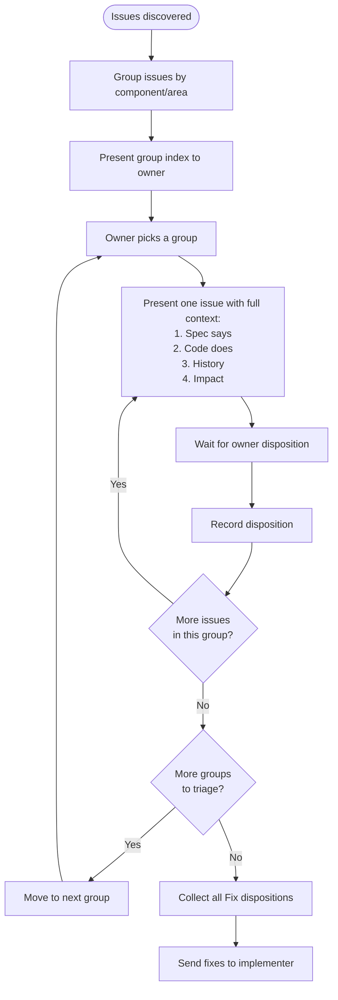

# Issue Triage

When issues are discovered — from QA review, spec compliance checks, simplify
passes, or any other source — triage them **one at a time** with the owner.

## Pre-procedure: Grouping

Before triage begins, group all discovered issues and present the groups to the
owner. The owner picks which group to triage first.

**Grouping criteria** — by the component or area of the codebase the issue
touches. Examples: "connection state machine", "handshake flow", "transport
layer", "timer infrastructure", "dead code / hygiene". Never group by severity —
severity-based groups pre-bias the triage order and hide relationships between
issues in the same area.

**Group presentation format:**

```
Group A: <area name> (N issues)
  - #1: <one-line title>
  - #4: <one-line title>

Group B: <area name> (N issues)
  - #2: <one-line title>
  - #3: <one-line title>
  - #7: <one-line title>
```

One-line titles are allowed here because this is an index, not the triage
itself. The detailed context comes when the owner picks a group and triage
begins.

## Procedure



**Presenting an issue** — show the full context without compression:

1. **Spec says** — quote the exact spec text (section name, line content). If
   multiple spec documents mention the same thing, cite all of them.
2. **Code does** — show the exact code (file path, line numbers, relevant
   snippet). Not a summary of what the code does — the actual code.
3. **History** — any prior decisions that affect this issue: existing CTRs,
   ADRs, owner decisions from prototyping, design resolutions. If none exist,
   say so.
4. **Impact** — what breaks or doesn't work because of this issue. Be concrete:
   "client cannot switch sessions" not "state transition may fail".

Do NOT include your recommendation. Do NOT pre-decide the disposition. Present
the facts and wait.

**Example:**

> **Issue 3: Handshake timeout timer not armed on client accept**
>
> **Spec says:**
>
> daemon-behavior `03-policies-and-procedures.md` Section 13 "Handshake
> Timeouts", lines 824-835:
>
> ```
> | Stage                                       | Duration | Action on timeout                        |
> | Transport connection (accept to first byte) | 5s       | Close socket                             |
> | ClientHello → ServerHello                   | 5s       | Send Error(ERR_INVALID_STATE), close     |
> | READY → AttachSession/CreateSession/...     | 60s      | Send Disconnect(TIMEOUT), close          |
> ```
>
>> **Invariant**: Each timeout MUST be enforced via per-client EVFILT_TIMER. The
>> timer is cancelled when the expected message arrives.
>
> **Code does:**
>
> `server/handlers/client_accept.zig` lines 40-54: after `accept()` succeeds,
> calls `add_client_fn(conn)` but never arms a timer. `ClientAcceptContext` has
> no `EventLoopOps` reference — timer registration is structurally impossible.
>
> ```zig
> fn handleClientAccept(ctx: *ClientAcceptContext) void {
>     const conn = ctx.listener.accept() catch { return; };
>     // TODO(Plan 6): Configure SO_SNDBUF and SO_RCVBUF ...  ← stale
>     ctx.add_client_fn(conn) catch { ... };
>     // no timer armed here
> }
> ```
>
> `timer_handler.zig` lines 48-59: handler for timer events exists
> (`handleHandshakeTimeout`, `handleReadyIdleTimeout`) — the receive side is
> implemented, but the send side (arming the timer) is missing.
>
> `client_state.zig` line 44: `handshake_timer_id: ?u16 = null` — field exists,
> never populated.
>
> **History:** No CTR or ADR. No prior owner decision. The stale TODO on line 46
> references SO_SNDBUF/SO_RCVBUF which is now handled inside
> `Listener.accept()`.
>
> **Impact:** After accept, no 5s handshake timer fires. A client that connects
> but never sends ClientHello will hold a slot indefinitely. Handshake success
> also never cancels a timer or arms the 60s READY idle timer.

**CRITICAL:** Do NOT apply fixes during triage. Triage determines dispositions
only. Fixes are collected and applied after all groups are triaged, unless the
owner explicitly says to fix something right now.

## Dispositions (owner decides)

| Disposition     | Meaning                                         | Action                                            |
| --------------- | ----------------------------------------------- | ------------------------------------------------- |
| **Fix**         | Code is wrong, change it now                    | Implementer fixes after triage completes          |
| **Defer**       | Correct but belongs in a later plan             | Add `TODO(Plan N)` in code + note in `ROADMAP.md` |
| **CTR**         | Spec needs updating to match a decision         | File a cross-team request                         |
| **False alarm** | CTR already exists or known decision            | No action needed                                  |
| **Skip**        | Not worth the cost (for simplify/perf findings) | No action                                         |

## Anti-patterns

- **Batch triage.** "Here are 7 issues, Issues 1, 4, 5 are false alarms, 2 and 3
  need fixing, 6 and 7 are deferred." This pre-decides dispositions and hides
  context.
- **Compressed summaries.** "ServerHello protocol_version type mismatch" tells
  the owner nothing. Show the spec quote, the code, and the impact.
- **Implicit dismissal.** "Known from prototyping" or "Plan 7 scope" are
  conclusions. The owner makes conclusions, not the agent.
- **Fixing during triage.** Do not modify code while triage is in progress.
  Triage is for deciding dispositions. Fixes come after.
- **Asking what to do.** "Should I fix this?" is unnecessary when the issue is
  clearly a bug. "Owner 판단?" is only appropriate when there is a genuine
  ambiguity (e.g., spec says X, prior owner decision says Y).
- **Pressuring for a decision.** The owner may need to ask follow-up questions,
  read more context, or simply think. Do not repeat "fix or skip?", "how to
  proceed?", or "next?" after presenting an issue. Present the facts once and
  wait silently. The owner will respond when ready.
